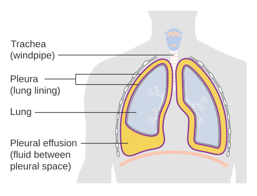
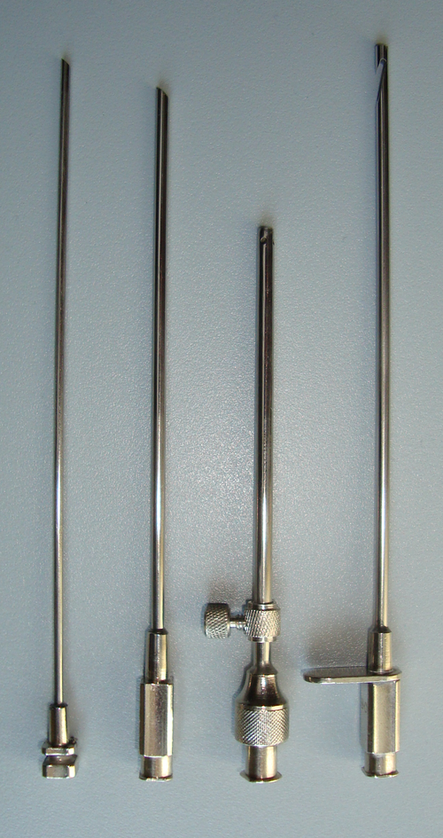

# DERRAME PLEURAL

Para entender o derrame pleural, você não deve pensar nele como uma "doença", mas sim como o **sinal clínico** de que algo está errado no equilíbrio de pressões ou na integridade das superfícies do tórax. É o "edema" do espaço pleural.

O espaço pleural é virtual, contendo apenas uma lâmina de líquido (cerca de 0,1 a 0,2 mL/kg) que lubrifica o deslize entre a pleura visceral (que recobre o pulmão) e a pleura parietal (que reveste a parede interna do tórax). Quando a produção desse líquido excede a capacidade de reabsorção, temos o derrame.

*Figura 1 - Diagrama ilustrativo do derrame pleural, demonstrando o acúmulo de líquido (azul) no espaço entre a pleura visceral e parietal. O espaço pleural é normalmente virtual, contendo apenas 0,1-0,2 mL/kg de líquido lubrificante. Fonte: Cancer Research UK, CC BY-SA 4.0 | Wikimedia Commons*

## Fisiopatologia: O "Porquê" do Acúmulo

*Figura 2 - Ilustração de biópsia/toracocentese pleural demonstrando a técnica de punção guiada do espaço pleural. Este procedimento é essencial tanto para diagnóstico (análise bioquímica do líquido - critérios de Light) quanto para terapêutica (esvaziamento de derrames volumosos). Fonte: Domínio Público | Wikimedia Commons*

O movimento de líquido no espaço pleural segue a **Lei de Starling**. O líquido sai dos capilares da pleura parietal (onde a pressão hidrostática é maior) para o espaço pleural e é reabsorvido pelos linfáticos da pleura parietal.

Existem cinco mecanismos principais que você precisa ter na ponta da língua para a prova:

- **Aumento da pressão hidrostática:** O exemplo clássico é a Insuficiência Cardíaca Congestiva (ICC). O sangue "represa", a pressão nos capilares sobe e o líquido é empurrado para fora.

- **Diminuição da pressão oncótica:** Ocorre na hipoalbuminemia (cirrose, síndrome nefrótica). Não há "proteína" suficiente para segurar o líquido dentro do vaso.

- **Aumento da permeabilidade capilar:** É o mecanismo da inflamação. Pneumonias, neoplasias e doenças autoimunes "abrem" os poros dos vasos, deixando passar líquido e proteínas.

- **Bloqueio da drenagem linfática:** Comum em neoplasias (metástases linfonodais) e no quilotórax.

- **Redução da pressão no espaço pleural:** Ocorre na atelectasia pulmonar maciça. O pulmão murcha, cria um vácuo (pressão negativa) e "puxa" o líquido para o espaço pleural.

**Dica de Prova:** As bancas adoram perguntar sobre o mecanismo da cirrose. No cirrótico, o derrame (hidrotórax hepático) ocorre principalmente pela passagem direta de ascite do abdome para o tórax através de pequenos defeitos no diafragma, e não apenas pela hipoalbuminemia.

## Quadro Clínico e Exame Físico

O sintoma cardeal é a **dispneia**. Mas atenção: a intensidade da falta de ar não depende apenas do volume do derrame, mas da velocidade com que ele se formou e da reserva funcional do paciente. Um derrame de 2 litros que se formou em 3 semanas pode ser menos sintomático que um de 500 mL que surgiu em 2 dias.

A **dor pleurítica** (em pontada, que piora com a inspiração profunda) indica inflamação da pleura parietal, pois a pleura visceral não tem inervação sensitiva. Se o paciente tem dor referida no ombro, o processo está irritando a parte central do diafragma (nervo frênico).

No exame físico, você encontrará a tríade clássica:

- **Inspeção:** Expansibilidade diminuída no lado afetado.

- **Palpação:** Frêmito Toraco-Vocal (FTV) **abolido ou diminuído**. (O líquido atua como um isolante acústico para a vibração das cordas vocais).

- **Percussão:** **Macicez** ou submaciçez.

- **Ausculta:** Murmúrio Vesicular (MV) **abolido ou diminuído**.

**Cuidado:** Muitos alunos confundem o FTV do derrame com o da pneumonia. Na pneumonia (consolidação), o FTV está **aumentado** (o sólido transmite melhor o som). No derrame, o FTV está **abolido**. Se você errar isso, a banca te elimina na hora.

## Diagnóstico por Imagem

### Radiografia de Tórax

É o exame inicial. O achado mais precoce é o **velamento do seio costofrênico**.

- No perfil: visível com ~75 mL de líquido.

- Na incidência PA: visível com ~175 a 200 mL.

O sinal clássico é a **Parábola de Damoiseau** (uma linha curva com concavidade voltada para cima). Se o derrame for maciço, haverá desvio do mediastino para o lado oposto. Se houver velamento total de um hemitórax SEM desvio de mediastino, suspeite de obstrução brônquica (atelectasia) ou infiltração neoplásica fixando as estruturas.

**Dica do Dr. Will:** A incidência de Laurell (decúbito lateral com raios horizontais) serve para ver se o derrame é livre ou loculado. Se a lâmina de líquido for **> 1 cm**, está indicada a toracocentese diagnóstica.

### Ultrassonografia (POCUS)

Hoje é o padrão-ouro à beira leito. É superior ao RX para detectar pequenos volumes (até 5 mL) e para identificar septações (essencial no empiema).

- **Sinal da Cortina:** No USG, o pulmão aerado esconde o diafragma durante a inspiração. Quando há derrame, o líquido permite ver o diafragma e os órgãos abdominais (fígado/baço) de forma contínua.

### Tomografia de Tórax (TC)

Não é necessária para todos, mas é fundamental se houver suspeita de malignidade ou para avaliar o parênquima pulmonar "escondido" pelo líquido. Na TC, o **espessamento nodular da pleura** é um sinal forte de neoplasia (mesotelioma ou metástase).

## A Toracocentese: O Divisor de Águas

Todo derrame pleural de etiologia desconhecida com > 1 cm na incidência de Laurell ou USG deve ser puncionado.

**Exceção de Prova:** Se o paciente tem uma causa óbvia de transudato (ex: ICC franca, bilateral, sem febre), você trata a ICC primeiro. Se o derrame não melhorar após a compensação (geralmente com diuréticos), aí sim você punciona.

### Técnica e Segurança

A punção deve ser feita na borda **superior** da costela inferior. Por quê? Porque o feixe neurovascular (veia, artéria e nervo) corre na borda inferior da costela. Se você puncionar ali, causará hemorragia ou dor intensa.

**Contraindicações:**

- Absolutas: Não existem, se o procedimento for de emergência.

- Relativas: Coagulopatia grave (INR > 1.5 ou Plaquetas < 50.000). No entanto, se o benefício for claro, pode-se realizar com cautela ou após correção.

**Complicação Temida:** Edema Pulmonar de Reexpansão. Ocorre quando você retira muito líquido rápido demais (> 1,5 L). O pulmão, que estava colapsado, sofre uma lesão de reperfusão/reoxigenação. Por isso, a recomendação é: **não retire mais de 1,5 litros em uma única toracocentese de alívio.**

## Análise do Líquido Pleural: Critérios de Light

Aqui é onde a maioria dos alunos se perde, mas no MedEvo simplificamos. O primeiro passo é definir se o líquido é um **Transudato** (problema sistêmico, pleura íntegra) ou um **Exsudato** (problema local, pleura doente).

### Tabela 1: Critérios de Light (Padrão-Ouro)

Para ser **Exsudato**, basta preencher **UM** dos critérios abaixo:

| Critério | Valor para Exsudato |
| --- | --- |
| Relação Proteína Pleural / Proteína Sérica | > 0,5 |
| Relação DHL Pleural / DHL Sérica | > 0,6 |
| DHL Pleural | > 2/3 do limite superior do soro |

*Se nenhum critério for preenchido, o líquido é um **Transudato**.*

**Pegadinha de Prova:** O paciente com ICC que usa muito diurético pode ter um líquido que "parece" exsudato pelos Critérios de Light (devido à concentração das proteínas). Nesses casos, calculamos o **Gradiente de Albumina (Soro - Líquido)**. Se for **> 1,2 g/dL**, é Transudato, ignore o Light.

### Outros Marcadores no Líquido

- **Glicose < 60 mg/dL:** Pense em quatro coisas: Empiema, Tuberculose, Neoplasia ou Artrite Reumatóide (esta última chega a ter glicose < 10).

- **pH < 7,2:** Indica alta atividade metabólica (infecção ou neoplasia). No derrame parapneumônico, pH < 7,2 é indicação de **drenagem**.

- **ADA (Adenosina Deaminase) > 40 U/L:** Altamente sugestivo de **Tuberculose Pleural** em jovens.

- **Amilase elevada:** Ruptura esofágica ou pancreatite.

- **Triglicerídeos > 110 mg/dL:** Diagnóstico de **Quilotórax**.

## Etiologias Específicas e Condutas

### 1. Derrame Parapneumônico e Empiema

É o derrame que acompanha uma pneumonia. Ele é classificado em três fases, e você precisa saber disso para decidir a cirurgia:

- **Fase Exsudativa (Simples):** Líquido estéril, pH normal, glicose normal. Tratamento: Apenas antibiótico para a pneumonia.

- **Fase Fibrinopurulenta (Complicado):** Invasão bacteriana. pH < 7,2, Glicose < 60, DHL > 1000. Começam a se formar septos de fibrina. Tratamento: Antibiótico + **Drenagem de Tórax**.

- **Fase de Organização (Empiema):** Presença de pus franco ou bactérias no Gram. Forma-se uma "carapaça" (peel) pleural que impede o pulmão de expandir. Tratamento: Antibiótico + Drenagem + considerar **Decorticação Pleural** (cirurgia).

**Pérola Clínica:** Se o dreno está bem posicionado, mas o derrame está septado e não drena (falha de drenagem), o próximo passo é a **Pleuroscopia (VATS)** para desfazer as aderências ou o uso de fibrinolíticos intrapleurais (rt-PA + DNase), embora a cirurgia seja preferível em pacientes com condições clínicas.

### 2. Tuberculose Pleural

É a causa mais comum de exsudato linfocítico no Brasil.

- **Perfil:** Jovem, febre, emagrecimento, dor pleurítica.

- **Líquido:** Exsudato, predomínio de **linfócitos**, ADA > 40, raramente encontramos o BAAR (bacilo) no líquido.

- **Diagnóstico:** O padrão-ouro é a **Biópsia Pleural** (fragmento mostra granuloma com necrose caseosa), mas na prática, ADA alto + clínica sugestiva autorizam o início do tratamento (Esquema RIPE).

### 3. Derrame Neoplásico

Causado principalmente por Câncer de Pulmão, Mama e Linfoma.

- **Mesotelioma:** Tumor primário da pleura, fortemente associado à exposição ao **asbesto (amianto)**. Ocorre décadas após a exposição.

- **Tratamento:** Geralmente paliativo. Se o derrame for recidivante e o pulmão reexpandir após a toracocentese, fazemos a **Pleurodese** (uso de talco para "colar" as pleuras). Se o pulmão não expande (pulmão encarcerado), usa-se um cateter pleural de longa permanência.

### 4. Hemotórax

Definido como Hematócrito do líquido pleural **> 50% do hematócrito periférico**.

- **Hemotórax Maciço:** Drenagem imediata de **> 1.500 mL** de sangue ou débito constante de **> 200 mL/h por 3-4 horas**.

- **Conduta no Maciço:** Toracotomia de urgência (centro cirúrgico).

- **Hemotórax Coagulado:** Se o sangue coagular e o dreno não resolver, a conduta é **VATS (Video-toracoscopia)** para limpeza.

## Drenagem de Tórax: A Arte da Cirurgia Torácica

Você será cobrado sobre a técnica. O local preferencial é o **Triângulo de Segurança**:

- Borda lateral do grande peitoral.

- Borda anterior do latíssimo do dorso.

- Linha acima do 5º espaço intercostal (nível do mamilo no homem).

### Técnica de Inserção

- Incisão na pele.

- **Dissecção romba** com pinça sobre a borda superior da costela.

- **Exploração digital:** Passo fundamental para garantir que você está no espaço pleural e não dentro do fígado ou baço, e para desfazer aderências iniciais.

- Inserção do dreno (direcionado para cima e para trás no derrame).

- Fixação e conexão ao **Selo d'água**.

### Manejo do Selo d'água

O frasco deve ficar sempre **abaixo** do nível do paciente.

- **Oscilação:** É normal. O líquido sobe no tubo na inspiração e desce na expiração (em ventilação espontânea). Se parar de oscilar, o dreno pode estar obstruído ou o pulmão expandiu totalmente.

- **Borbulhamento:** Indica escape aéreo (fístula broncopleural ou pneumotórax). Se borbulha apenas na tosse/expiração, é pequeno. Se borbulha constante, o escape é grande.

**Quando retirar o dreno?**

- Débito de líquido baixo (< 100-150 mL em 24h).

- Ausência de escape aéreo (parou de borbulhar).

- Pulmão totalmente expandido no RX de controle.
*Técnica de retirada:* Pedir para o paciente fazer manobra de Valsalva ou expiração máxima enquanto se retira o dreno rapidamente e fecha-se o orifício com ponto previamente preparado.

### Tabela 2: Diagnóstico Diferencial do Exsudato Pleural

| Causa | Característica do Líquido | Achado Chave |
| --- | --- | --- |
| **Pneumonia** | Turvo/Pus, pH < 7,2, Glicose baixa | História de febre e tosse produtiva |
| **Tuberculose** | Citrino, Linfocítico, ADA > 40 | Biópsia pleural com granuloma |
| **Neoplasia** | Frequentemente hemorrágico | Citologia oncótica positiva |
| **TEP** | Exsudato ou Transudato | Súbito, dispneia, D-dímero alto |
| **Quilotórax** | Leitoso (aspecto de leite) | Triglicerídeos > 110 mg/dL |
| **Artrite Reumatóide** | Exsudato, Glicose MUITO baixa | Glicose < 30 mg/dL, fator reumatoide + |

## Situações Especiais e Erros Comuns

### O Paciente Pós-Pneumonectomia

Após a retirada de um pulmão inteiro, o espaço vazio é preenchido por líquido e ar. É esperado ver um nível hidroaéreo no RX. **Não se drena esse espaço**, a menos que haja suspeita de infecção (empiema pós-pneumonectomia) ou fístula brônquica maciça. Drenar precocemente pode causar desvio agudo do mediastino e parada cardíaca.

### Atelectasia Pós-Operatória

Cenário clássico: Paciente operou o abdome superior, está com dor, não respira fundo. No 2º dia de PO, faz febre e dispneia. O RX mostra derrame pequeno e elevação do diafragma.

- **Causa:** Atelectasia por falta de fisioterapia respiratória.

- **Tratamento:** Analgesia e fisioterapia (estimular tosse e deambulação). Não precisa puncionar.

### Quilotórax

Cuidado com a causa iatrogênica! Punção de veia subclávia ou cirurgias de pescoço/tórax podem lesar o **ducto torácico**. O líquido é leitoso. O tratamento inicial é conservador: dieta com **triglicerídeos de cadeia média (TCM)** ou jejum com Nutrição Parenteral Total (NPT) para diminuir o fluxo de quilo. Se falhar, ligadura cirúrgica do ducto.

### Tabela 3: Indicações de Drenagem no Derrame Parapneumônico

| Achado | Conduta |
| --- | --- |
| Pus franco (Empiema) | Drenagem Obrigatória |
| Bactérias no Gram ou Cultura | Drenagem Obrigatória |
| pH < 7,2 | Drenagem Obrigatória |
| Glicose < 60 mg/dL | Drenagem Obrigatória |
| DHL > 1000 U/L | Drenagem Fortemente Sugerida |
| Derrame Loculado/Septado | Drenagem + Avaliar VATS |

## Pontos-Chave para Prova

- **Critérios de Light:** Proteína L/S > 0,5; DHL L/S > 0,6; DHL L > 2/3 limite superior. Apenas um positivo = Exsudato.

- **Derrame na ICC:** Geralmente bilateral. Se for unilateral, é mais comum à direita. Se puncionar e o gradiente albumina soro-líquido for > 1,2, é transudato.

- **Tuberculose Pleural:** Exsudato linfocítico com ADA > 40. A biópsia pleural tem maior sensibilidade que a citologia ou cultura do líquido.

- **Empiema:** pH < 7,2 ou glicose < 60 ou pus = Drenagem imediata em selo d'água.

- **Hemotórax Maciço:** > 1.500 mL na drenagem inicial ou > 200 mL/h por 3h. Indicação de toracotomia.

- **Mesotelioma:** Associado ao asbesto. Suspeite se houver espessamento pleural nodular e dor torácica persistente.

- **Edema de Reexpansão:** Evite retirando no máximo 1,5 L por vez.

- **Local de Drenagem:** 5º espaço intercostal, entre as linhas axilares anterior e média (Triângulo de Segurança).

- **Toracocentese:** Sempre na borda SUPERIOR da costela inferior para fugir do feixe neurovascular.

- **Quilotórax:** Triglicerídeos > 110 mg/dL. Tratamento inicial com dieta TCM.

- **Sinal da Cortina:** Achado ultrassonográfico que confirma a presença de líquido separando o pulmão do diafragma.

- **Pneumotórax ex vacuo:** Ocorre quando o pulmão não expande após a retirada do líquido devido a uma obstrução brônquica ou carapaça pleural crônica. Não adianta forçar a drenagem.

- **Contraindicação de Toracocentese:** Não há contraindicação absoluta se houver risco de vida, mas evite se houver infecção de pele no local da punção.

- **O que NÃO fazer:** Nunca drene um derrame pleural transudativo (ICC) de rotina; o tratamento é a doença de base. Drenar transudato causa perda proteica e risco de infecção desnecessário.

- **Pegadinha de Prova:** A alternativa dirá que o pH < 7,2 indica necessidade de antibiótico. Correto, mas o mais importante é que ele indica **Drenagem**. 💡

 Cópia offline para consulta pessoal.
 Fonte original:
 [https://www.medevo.com.br/material-apoio/ler/07af74f3-9df6-4524-85b5-9fda58d589fb](https://www.medevo.com.br/material-apoio/ler/07af74f3-9df6-4524-85b5-9fda58d589fb)
