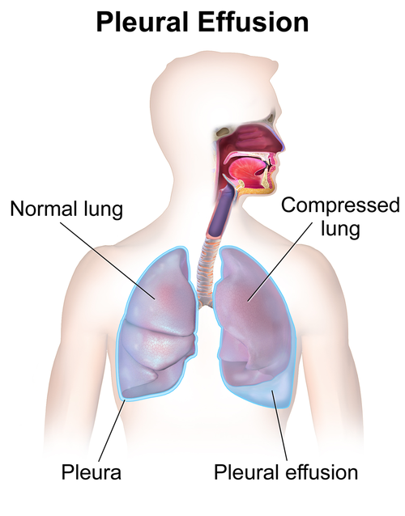
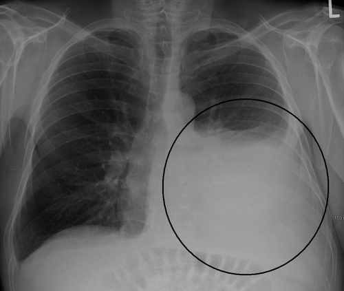

# DERRAME PLEURAL

Para entender o derrame pleural, você precisa parar de ver a pleura como apenas uma "capa" do pulmão. Imagine a cavidade pleural como um espaço virtual que, em condições normais, contém apenas uma lâmina de líquido (cerca de 0,1 a 0,2 ml/kg) que serve como lubrificante. O derrame pleural não é uma doença em si, mas a manifestação de um desequilíbrio entre a produção e a absorção desse líquido.

Nas provas de residência, o examinador não quer apenas que você saiba que "tem líquido no pulmão". Ele quer que você identifique o mecanismo fisiopatológico por trás desse acúmulo, pois é isso que define se você vai tratar o coração, o rim ou se vai precisar passar um dreno no tórax do paciente.

*Figura 1 - Ilustração anatômica do derrame pleural, mostrando o acúmulo de líquido no espaço entre a pleura visceral e parietal, que normalmente contém apenas uma fina lâmina de 0,1-0,2 ml/kg. Fonte: BruceBlaus, CC BY-SA 4.0 | Wikimedia Commons*

## Fisiopatologia: O Equilíbrio de Starling

*Figura 2 - Radiografia de tórax em incidência PA mostrando extenso derrame pleural à esquerda com velamento de metade do hemitórax, desvio do mediastino e apagamento do ângulo costofrênico. Fonte: James Heilman, MD, CC BY-SA 3.0 | Wikimedia Commons*

O acúmulo de líquido no espaço pleural ocorre por cinco mecanismos principais. Entender isso evita que você decore listas imensas de causas:

- **Aumento da Pressão Hidrostática:** É o "empurrão". Se a pressão nos capilares aumenta (como na Insuficiência Cardíaca), o líquido é empurrado para fora.

- **Diminuição da Pressão Oncótica:** É a "falta de sucção". Se as proteínas plasmáticas caem (como na Síndrome Nefrótica ou Cirrose), não há força para segurar o líquido dentro do vaso.

- **Aumento da Permeabilidade Capilar:** É o "vazamento". Processos inflamatórios ou infecciosos (Pneumonia, Tuberculose, Câncer) lesam a barreira capilar, deixando passar líquido e proteínas.

- **Dificuldade de Drenagem Linfática:** O sistema linfático é o "ralo" da pleura. Se um tumor obstrui esses canais, o líquido acumula.

- **Passagem de Líquido do Peritônio:** Através de pequenos orifícios no diafragma, o líquido ascítico pode "subir" para o tórax (comum na cirrose, o chamado hidrotórax hepático).

**Cuidado:** Muitos alunos confundem a origem do líquido. Lembre-se que, na maioria das vezes, o líquido pleural entra no espaço pleural através da pleura parietal e é drenado pelos linfáticos também da pleura parietal.

## Quadro Clínico e Exame Físico

O paciente clássico chega com três queixas: dispneia, dor pleurítica (aquela "pontada" que piora ao inspirar) e tosse seca. A intensidade da dispneia depende mais da velocidade de acúmulo do que do volume total. Um derrame de 2 litros que se formou em semanas pode ser menos sintomático que um de 500 ml que surgiu em horas.

No exame físico, você encontrará a "síndrome do derrame pleural":

- **Inspeção:** Expansibilidade reduzida no lado afetado.

- **Palpação:** Frêmito Toraco-Vocal (FTV) **abolido ou reduzido**. (Dica: o líquido isola a vibração das cordas vocais).

- **Percussão:** Macicez ou submaciça.

- **Ausculta:** Murmúrio vesicular abolido ou reduzido. Podemos encontrar a **egofonia** (voz anasalada) na borda superior do derrame.

**Pegadinha de Prova:** Como diferenciar, no exame físico, um derrame pleural volumoso de uma atelectasia total?
No **Derrame Pleural**, a traqueia é empurrada para o lado **oposto** (contralateral). Na **Atelectasia**, a traqueia é puxada para o **mesmo lado** (ipsilateral) da lesão. As bancas adoram trocar esses conceitos.

## Diagnóstico por Imagem

### Radiografia de Tórax (Incidências de Rotina)

O sinal mais precoce na radiografia em pé (PA) é o apagamento do seio costofrênico, que ocorre com cerca de 200-300 ml de líquido. Se você vir o "sinal do menisco" (aquela curva côncava superior), o diagnóstico está feito.

### Radiografia em Decúbito Lateral (Incidência de Paim de Targa ou Laurell)

Se você tem dúvida se aquele velamento é líquido ou espessamento pleural, peça o decúbito lateral com raios horizontais. Se o líquido "correr" e formar uma lâmina maior que 1 cm, ele é passível de punção (toracocentese).

### Ultrassonografia (USG) de Tórax

Hoje, o USG é considerado superior à radiografia para detectar pequenos volumes (detecta a partir de 5-10 ml) e, principalmente, para guiar a toracocentese, aumentando a segurança e evitando pneumotórax. Segundo as recomendações modernas, **toda toracocentese deveria, idealmente, ser guiada por USG**.

## Toracocentese Diagnóstica

Você deve puncionar todo derrame pleural novo, a menos que a causa seja óbvia (como uma Insuficiência Cardíaca descompensada clara). Se o paciente tem ICC, trate primeiro. Se o derrame persistir após a compensação ou se houver febre e dor unilateral, aí sim você punciona.

**Técnica e Segurança:**
A punção deve ser feita sempre na **borda superior da costela inferior**. Por quê? Porque o feixe neurovascular (veia, artéria e nervo) passa na borda inferior de cada costela. Se você puncionar ali, causará sangramento e dor intensa.

**Complicação Temida:** O edema pulmonar de reexpansão. Ocorre quando retiramos muito líquido rápido demais (geralmente > 1,5L). O pulmão, que estava colapsado, expande-se bruscamente, sofrendo lesão por reperfusão e estresse mecânico. Por isso, a recomendação é monitorar o paciente e parar a retirada se ele começar a tossir muito ou sentir dor opressiva.

## Análise do Líquido Pleural: O Coração da Prova

Aqui é onde a maioria dos alunos se perde, mas aqui no MedEvo focamos no que realmente importa. O primeiro passo é definir se o líquido é um **Transudato** ou um **Exsudato**.

- **Transudato:** Pleura íntegra. O problema é sistêmico (pressão). Ex: ICC, Cirrose, Síndrome Nefrótica.

- **Exsudato:** Pleura doente. O problema é local (inflamação/infecção/neoplasia). Ex: Pneumonia, TB, Câncer, TEP.

### Critérios de Light

Para ser um **Exsudato**, basta preencher **UM** dos seguintes critérios:

- Relação Proteína Pleural / Proteína Sérica > 0,5

- Relação DHL Pleural / DHL Sérico > 0,6

- DHL Pleural > 2/3 do limite superior da normalidade do DHL sérico.

Se não preencher nenhum, é **Transudato**.

**Tabela 1: Diferenciação Transudato vs. Exsudato**

| Característica | Transudato | Exsudato |
| --- | --- | --- |
| Mecanismo | Alteração hidrostática/oncótica | Inflamação/Lesão capilar |
| Aspecto | Límpido, amarelo citrino | Turvo, hemorrágico ou purulento |
| Proteína LP/Soro | ≤ 0,5 | > 0,5 |
| DHL LP/Soro | ≤ 0,6 | > 0,6 |
| DHL (valor absoluto) | < 2/3 LSN do soro | > 2/3 LSN do soro |
| Causas comuns | ICC, Cirrose, S. Nefrótica | Pneumonia, Câncer, TB, TEP |

**Dica do Professor:** Se o paciente estiver usando diuréticos (comum na ICC), os Critérios de Light podem "falsamente" indicar um exsudato. Nesses casos, calcule o **Gradiente de Albumina (Soro - Líquido)**. Se for > 1,2 g/dL, confirme que é um Transudato.

## Etiologias Específicas e Achados Laboratoriais

### 1. Derrame Pleural Parapneumônico (DPP)

É o derrame associado à pneumonia bacteriana. Ele se divide em três fases:

- **Simples:** Líquido estéril, apenas resposta inflamatória. Responde apenas ao antibiótico.

- **Complicado:** Invasão bacteriana. O pH cai, a glicose cai (bactérias comem glicose) e o DHL sobe muito. **Exige drenagem**.

- **Empiema:** Pus franco ou presença de bactérias no Gram/Cultura. **Exige drenagem**.

**Tabela 2: Critérios para Drenagem no Derrame Parapneumônico**

| Parâmetro | Indicação de Drenagem (Complicado/Empiema) |
| --- | --- |
| Aspecto | Pus franco (Empiema) |
| pH | < 7,20 |
| Glicose | < 60 mg/dL |
| Gram ou Cultura | Positivos |
| DHL | > 1.000 UI/L (em alguns protocolos) |
| Imagem | Loculações (derrame loculado) |

**Por que o pH baixo indica drenagem?** O pH < 7,20 reflete um metabolismo bacteriano intenso e acúmulo de ácido lático, indicando que o organismo não vai conseguir limpar aquele espaço sozinho. Se você não drenar, vai evoluir para paquipleurite (casca de ovo no pulmão) e restrição respiratória crônica.

### 2. Tuberculose Pleural

Muito comum no Brasil. Suspeite sempre que houver um exsudato com:

- **Predomínio de linfócitos** (> 50%, geralmente > 80%).

- **ADA (Adenosina Deaminase) > 40-60 U/L**.

- **Ausência de células mesoteliais** (a inflamação da TB "forra" a pleura e impede que as células mesoteliais caiam no líquido).

**Atenção:** O achado de BAAR no líquido pleural é raríssimo (< 5%). A cultura também tem baixa sensibilidade. O diagnóstico muitas vezes é presuntivo (clínica + ADA + linfocitose) ou por biópsia pleural (padrão-ouro, mostrando granuloma com necrose caseosa).

### 3. Derrame Neoplásico

Segunda causa mais comum de exsudato. Os principais vilões são: Câncer de Pulmão, Mama e Linfoma.

- **Características:** Frequentemente hemorrágico, se refaz rapidamente após a punção.

- **Diagnóstico:** Citologia oncótica do líquido. Se a primeira vier negativa, repita. Se a segunda também for negativa, parta para biópsia (preferencialmente por toracoscopia).

### 4. Tromboembolismo Pulmonar (TEP)

O TEP pode causar derrame pleural em até 50% dos casos. Geralmente é um exsudato pequeno, unilateral e pode ser hemorrágico. O mecanismo é o aumento da permeabilidade capilar por isquemia ou inflamação.

### 5. Quilotórax

Acúmulo de linfa por lesão do ducto torácico (trauma ou linfoma).

- **Aspecto:** Leitoso.

- **Diagnóstico:** Triglicerídeos > 110 mg/dL. Se estiver entre 50-110, peça a pesquisa de quilomícrons.

## Tratamento e Condutas Práticas

### Drenagem Torácica

O dreno de tórax (selo d'água) é indicado no empiema, no derrame complicado, no hemotórax e no pneumotórax volumoso.

- **Quando retirar o dreno?** Pulmão totalmente expandido no RX + débito baixo (< 100-200 ml em 24h) + líquido límpido + ausência de fístula aérea (borbulhamento).

### Fibrinolíticos e DNase

Em derrames loculados (onde o dreno não consegue aspirar tudo porque o líquido está "preso" em várias bolsinhas), o uso de fibrinolíticos intrapleurais (como a estreptoquinase ou alteplase) associados à DNase pode ser tentado para evitar a cirurgia.

### Pleurodese

Indicada para derrames neoplásicos recidivantes e sintomáticos. Injetamos uma substância irritante (geralmente talco) no espaço pleural para causar uma inflamação e "colar" a pleura parietal na visceral, impedindo que o líquido se acumule novamente. **Requisito:** O pulmão deve estar expandindo totalmente (se o pulmão estiver "aprisionado", a pleurodese falha).

## Situações Especiais e Pegadinhas

- **Artrite Reumatoide:** Causa um exsudato com glicose **muito baixa** (frequentemente < 30 mg/dL) e DHL muito alto.

- **Pancreatite:** Causa derrame pleural (geralmente à esquerda) com **Amilase Pleural** elevada (relação Amilase LP/Soro > 1,0).

- **Lúpus (LES):** Pode causar derrame, geralmente com presença de células LE ou FAN elevado no líquido pleural.

Como diz o Dr. Will, "na medicina, o óbvio precisa ser dito: se o líquido é pus, o tratamento é dreno". Não tente ser herói apenas com antibiótico se o pH estiver 7,10. Você vai perder o tempo da drenagem e o paciente vai acabar na decorticação cirúrgica.

## Diagnóstico Diferencial de Glicose Baixa no Líquido

Memorize esta lista, pois cai muito:

- Empiema / Derrame Complicado

- Tuberculose

- Neoplasia

- Artrite Reumatoide (a mais baixa de todas)

- Lúpus

## Pontos-Chave para Prova

- **Critérios de Light (Exsudato):** Proteína LP/Soro > 0,5; DHL LP/Soro > 0,6; DHL LP > 2/3 limite superior do soro.

- **Drenagem Obrigatória no DPP:** pH < 7,20; Glicose < 60 mg/dL; Pus; Gram ou Cultura positivos.

- **Tuberculose Pleural:** Exsudato linfocítico + ADA > 40 U/L + Células mesoteliais raras.

- **Principal causa de Transudato:** Insuficiência Cardíaca Congestiva (ICC).

- **Principal causa de Exsudato:** Derrame Parapneumônico.

- **Local da Punção:** Borda superior da costela inferior (evitar feixe neurovascular).

- **Edema de Reexpansão:** Evite retirar mais de 1,5L de líquido de uma só vez.

- **Quilotórax:** Triglicerídeos > 110 mg/dL.

- **Atelectasia vs. Derrame:** Atelectasia puxa a traqueia; Derrame empurra a traqueia.

- **Derrame Hemorrágico:** Pensar em Câncer, Trauma ou TEP.

- **Sinal do Menisco:** Achado clássico na radiografia de tórax em PA.

- **Incidência de Laurell:** Útil para ver se o líquido está livre ou loculado (lâmina > 1cm indica punção).

- **Contraindicação Absoluta de Toracocentese:** Não há contraindicação absoluta se houver indicação de urgência (ex: alívio de dispneia grave), mas deve-se ter cautela extrema em pacientes com discrasias sanguíneas graves (RNI > 2 ou Plaquetas < 50.000).

- **Primeira escolha para diagnóstico de Derrame Neoplásico:** Citologia oncótica do líquido pleural.

- **O que NÃO fazer:** Não drenar derrames transudativos (trate a causa base) e não esperar o resultado da cultura para drenar um derrame com pH < 7,20. 🫁

 Cópia offline para consulta pessoal.
 Fonte original:
 [https://www.medevo.com.br/material-apoio/ler/9d282876-94b2-4b73-8e12-8431da735de0](https://www.medevo.com.br/material-apoio/ler/9d282876-94b2-4b73-8e12-8431da735de0)
