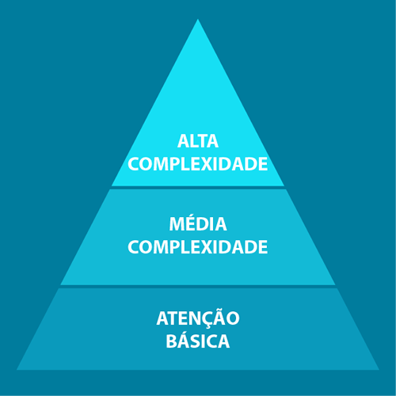
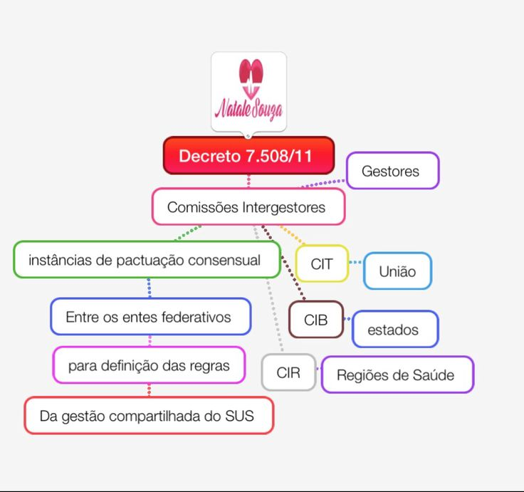

# DESCENTRALIZAÇÃO E REGIONALIZAÇÃO

Para entender o SUS que cai na sua prova, você precisa primeiro esquecer a ideia de que o sistema é uma massa única e amorfa gerida por Brasília. Se você tentar decorar as leis sem entender a lógica política por trás delas, vai errar questões bobas de "quem manda em quem". O SUS é um sistema descentralizado, regionalizado e hierarquizado. Esses três termos não são sinônimos e as bancas adoram trocar um pelo outro para te confundir.

## A Lógica da Descentralização: Por que não centralizar?

A descentralização é, antes de tudo, uma redistribuição de poder e responsabilidades. No antigo modelo do INAMPS, tudo era decidido no nível federal. O resultado? Um burocrata em Brasília decidia quantas seringas um posto de saúde no interior do Acre deveria receber. Obviamente, isso não funcionava.

A descentralização no SUS significa que o poder de decisão deve ser deslocado para o nível mais próximo possível da população. Por que? Porque o gestor municipal, o Secretário de Saúde da cidade, é quem conhece a realidade local. Ele sabe se o problema da cidade é malária ou se é atropelamento por moto.

Um conceito fundamental que você vai encontrar em provas é o de Comando Único. Guarde isso: em cada esfera de governo (União, Estado, Município), existe apenas uma autoridade que manda no SUS. No Município, é a Secretaria Municipal de Saúde. Não existe essa história de o Ministério da Saúde mandar diretamente no hospital municipal sem passar pelo gestor local. A descentralização exige que o município seja o protagonista da execução das ações de saúde.

Muitos alunos confundem descentralização com "abandono" por parte da União. Cuidado. Descentralizar não é "cada um por si". É uma transferência de responsabilidades acompanhada de transferência de recursos. Como o Dr. Will costuma enfatizar em suas discussões no MedEvo, a descentralização administrativa só funciona se houver descentralização financeira. É o famoso repasse fundo a fundo (do Fundo Nacional para o Fundo Municipal).

## O Caminho Histórico: Das NOBs ao Pacto pela Saúde

As bancas de residência amam a história da descentralização porque ela foi feita aos poucos, através das Normas Operacionais Básicas (NOBs) e Normas Operacionais de Assistência à Saúde (NOAS). Você não precisa ser um historiador, mas precisa saber o que cada uma "entregou" para o sistema.

### As NOBs e a Municipalização

A NOB 91 foi o primeiro passo, mas ainda era muito centralizadora. O grande salto veio com a NOB 93. Ela instituiu a transferência automática de recursos e começou a dar autonomia aos municípios. Foi aqui que surgiu a ideia de que o município poderia gerir seus próprios serviços.

A NOB 96 é a "queridinha" das provas sobre municipalização. Ela criou a Gestão Plena do Sistema Municipal. Para um município chegar nesse nível, ele precisava ter um Conselho de Saúde e um Fundo de Saúde funcionando. Se a questão falar em "municipalização da gestão", a resposta quase sempre passa pela NOB 96. Ela consolidou o papel do município como o principal executor do SUS.

### O Problema das "Ilhas" e a Chegada das NOAS

A municipalização foi tão forte que gerou um problema colateral: os municípios viraram ilhas. O prefeito de uma cidade pequena recebia o dinheiro, mas não tinha escala para ter um hospital de alta complexidade. O paciente da cidade A não conseguia atendimento na cidade B porque "o dinheiro não era dele".

Para resolver isso, surgiram as NOAS (2001 e 2002). O foco mudou da municipalização para a Regionalização. A NOAS 01/02 introduziu o Plano Diretor de Regionalização (PDR). A ideia era: vamos organizar os municípios em regiões para que eles compartilhem serviços. Se a cidade pequena não tem tomografia, ela pactua com a cidade vizinha (o município-polo) para que seus habitantes sejam atendidos lá.

### Tabela 1: Evolução Normativa da Descentralização

| Norma | Foco Principal | Principal Contribuição para a Prova |
| --- | --- | --- |
| NOB 91 | Centralização Federal | Equiparação de prestadores públicos e privados. |
| NOB 93 | Municipalização Incipiente | Transferência fundo a fundo e comissões intergestores. |
| NOB 96 | Gestão Plena Municipal | Fortalecimento do município como gestor do sistema. |
| NOAS 01/02 | Regionalização | Criação do PDR e definição de municípios-polo. |
| Pacto 2006 | Gestão Compartilhada | Substitui a habilitação por termos de compromisso. |

## Regionalização: O Recorte Estratégico do Território

A regionalização é a divisão geográfica do território para fins de planejamento e organização dos serviços. Não é apenas uma divisão no mapa, é uma estratégia para garantir a Integralidade.

Imagine o seguinte cenário: Um município de 5 mil habitantes. Ele consegue manter uma Unidade Básica de Saúde (UBS) excelente? Sim. Ele consegue manter um serviço de neurocirurgia 24 horas? Não. Não há demanda nem recursos para isso em cada cidade do Brasil.

A regionalização resolve isso criando a Região de Saúde. Segundo o Decreto 7.508/2011 (que é a bíblia atual deste tema), a Região de Saúde é um agrupamento de municípios limítrofes que compartilham identidades culturais, econômicas e sociais. O objetivo é integrar a organização, o planejamento e a execução de ações e serviços de saúde.

### Os Requisitos da Região de Saúde

Isso cai em 9 de cada 10 provas sobre o Decreto 7.508. Para ser considerada uma "Região de Saúde", o território precisa oferecer, no mínimo, cinco serviços específicos. Se faltar um, legalmente não é uma região.

- Atenção Primária (a porta de entrada).

- Urgência e Emergência.

- Atenção Psicossocial (CAPS e afins).

- Atenção Ambulatorial Especializada e Hospitalar.

- Vigilância em Saúde.

*Figura 1: Comparativo entre os requisitos mínimos para formação de uma Região de Saúde e as Portas de Entrada do SUS, conforme Decreto 7.508/2011.*

Erro clássico de prova: A banca vai dizer que a Região de Saúde precisa ter "Alta Complexidade" ou "Transplantes". Mentira. O requisito é o que está na lista acima. A alta complexidade pode estar em apenas algumas regiões e servir ao estado inteiro.

## Hierarquização: A Escada do Cuidado

Se a regionalização é o "onde", a hierarquização é o "como". Hierarquizar o SUS não significa que um médico do hospital é "mais importante" que o médico do posto. Significa organizar os serviços em níveis de complexidade crescente.

A Atenção Primária à Saúde (APS) é a base da pirâmide. Ela deve resolver cerca de 80 a 85% dos problemas de saúde da população. Quando o caso exige uma tecnologia que a APS não possui (um ecocardiograma, uma cirurgia), o paciente é referenciado para o nível secundário ou terciário.

*Figura 2: A pirâmide de hierarquização demonstrando os três níveis de complexidade crescente.*

Aqui entra o conceito de Referência e Contrarreferência.

- Referência: Encaminhar o paciente para um nível de maior complexidade.

- Contrarreferência: O especialista devolve o paciente para a APS com as orientações, garantindo a continuidade do cuidado.

Na prática do MedEvo, vemos que as questões adoram focar na APS como a ordenadora da rede e a porta de entrada preferencial. Se o sistema não for hierarquizado, o hospital vira uma "UBS de luxo", ficando superlotado com casos que deveriam ser resolvidos no posto, enquanto quem realmente precisa de um leito de UTI fica no corredor.

## As Comissões Intergestores: Onde o SUS é Pactuado

Como o SUS é descentralizado, os gestores precisam conversar. Você não pode ter o Estado decidindo uma coisa e o Município outra. Para isso, existem as instâncias de pactuação consensual. Grave essa palavra: consensual. Nessas comissões, não se vota; se entra em acordo.

Existem três níveis de comissões que você deve dominar:

- CIT (Comissão Intergestores Tripartite): Nível Nacional. Reúne Ministério da Saúde (União), CONASS (Secretários Estaduais) e CONASEMS (Secretários Municipais). Aqui se definem as políticas nacionais.

- CIB (Comissão Intergestores Bipartite): Nível Estadual. Reúne a Secretaria Estadual de Saúde e os COSEMS (Secretários Municipais daquele estado). É aqui que se decide como o dinheiro vai ser distribuído entre os municípios e como será o desenho da regionalização no estado.

- CIR (Comissão Intergestores Regional): Nível Regional. É o espaço de pactuação entre os municípios de uma mesma Região de Saúde e o Estado.

### Tabela 2: Comparativo das Comissões Intergestores

| Comissão | Esfera | Composição | Principal Função |
| --- | --- | --- | --- |
| CIT | Federal | MS, CONASS, CONASEMS | Pactuar diretrizes nacionais e normas gerais. |
| CIB | Estadual | SES, COSEMS | Organizar a rede estadual e distribuir recursos. |
| CIR | Regional | Municípios da Região + Estado | Pactuar o fluxo de pacientes e serviços locais. |

*Figura 3: Representação em mapa mental das três instâncias de pactuação intergestores do SUS.*

Cuidado com a pegadinha: O Conselho de Saúde (Nacional, Estadual ou Municipal) NÃO é o mesmo que as Comissões Intergestores. O Conselho tem participação da comunidade (usuários) e tem caráter deliberativo e fiscalizador. As Comissões (CIT, CIB, CIR) são apenas de gestores e servem para pactuação operacional.

## O Decreto 7.508/2011 e os Novos Conceitos

Este decreto regulamentou a Lei 8.080/90 e trouxe termos que as bancas amam cobrar porque soam modernos. Vamos desmistificá-los.

### RENASES e RENAME

A RENASES (Relação Nacional de Ações e Serviços de Saúde) é a lista de tudo o que o SUS oferece. Já a RENAME (Relação Nacional de Medicamentos Essenciais) é a lista de remédios.

O ponto chave aqui é: os estados e municípios podem ter suas próprias listas (REMUME, por exemplo), mas elas devem ser suplementares à nacional. Você não pode oferecer menos do que a RENAME nacional, mas pode oferecer mais se tiver orçamento.

### COAP (Contrato Organizativo da Ação Pública da Saúde)

O COAP é o acordo formal entre os entes federativos (União, Estado e Municípios) para organizar a rede de saúde em uma região. Ele define quem faz o quê, quem paga o quê e quais são as metas. É a "certidão de casamento" da regionalização. Embora na prática muitos estados ainda não tenham COAPs plenamente operacionais, para a sua prova, ele é o instrumento jurídico que sela a pactuação interfederativa.

### Portas de Entrada

O Decreto define claramente quais são as portas de entrada do SUS. Muitos alunos acham que é só a UBS. Errado. São portas de entrada:

- Atenção Primária.

- Atenção de Urgência e Emergência.

- Atenção Psicossocial.

- Serviços de Especial Acesso Aberto (como os Centros de Testagem e Aconselhamento - CTA).

O hospital, por si só, não é porta de entrada, a menos que seja através do serviço de Urgência/Emergência. Um paciente não pode "bater na porta" de um hospital de câncer para fazer uma consulta de rotina; ele precisa ser referenciado.

## Redes de Atenção à Saúde (RAS): Superando a Fragmentação

A regionalização e a hierarquização culminam na formação das RAS. A ideia é que o cuidado não seja um evento isolado, mas um fluxo contínuo.

Imagine um paciente com Infarto Agudo do Miocárdio (IAM).

- Ele sente a dor em casa (Território).

- O SAMU (Urgência) o atende.

- Ele é levado para um hospital com hemodinâmica (Alta Complexidade).

- Após o stent, ele volta para a UBS (Atenção Primária) para acompanhamento e reabilitação.

Isso é uma Rede de Atenção. Ela é coordenada pela Atenção Primária. Se a banca perguntar quem é o "centro de comunicação" ou o "maestro" da rede, a resposta é a Atenção Primária à Saúde.

### Tabela 3: Elementos Constitutivos da RAS

| Elemento | Descrição | Exemplo Prático |
| --- | --- | --- |
| População | Alvo da rede, cadastrada em um território. | Moradores do Distrito Sanitário X. |
| Estrutura Operacional | Os nós da rede (pontos de atenção). | UBS, CAPS, UPA, Hospital. |
| Modelo de Atenção | Lógica de cuidado (foco em condições crônicas). | Protocolo de manejo de Diabetes. |

## Gestão e Financiamento: Onde o Filho Chora e a Mãe não Vê

A descentralização trouxe a responsabilidade para o município, mas o financiamento continua sendo um desafio. O SUS é financiado com recursos da Seguridade Social (União, Estados e Municípios).

Um ponto que cai muito: a Emenda Constitucional 29 (e atualizações posteriores).

- Municípios: Devem aplicar no mínimo 15% de sua receita própria em saúde.

- Estados: Devem aplicar no mínimo 12%.

- União: O valor aplicado no ano anterior corrigido pelo IPCA (regra atual do teto de gastos/novo arcabouço fiscal, mas para provas, foque na ideia de que a União tem um cálculo baseado na receita corrente líquida).

O dinheiro da União é transferido para os municípios em blocos de financiamento. Antigamente eram vários blocos (Atenção Básica, Vigilância, etc.). Recentemente, isso foi simplificado para dois blocos: Custeio e Investimento. Isso deu mais flexibilidade para o gestor municipal usar o dinheiro onde realmente precisa, reforçando a descentralização.

## Organização Territorial: Do Distrito à Moradia

Para operacionalizar a descentralização no nível municipal, o gestor divide a cidade em Distritos Sanitários. Isso é muito comum em cidades grandes como São Paulo ou Rio de Janeiro.

A hierarquia territorial que você precisa saber para a prova é:

- Distrito Sanitário: Divisão administrativa de uma grande cidade.

- Área: Território de abrangência de uma Unidade Básica de Saúde.

- Microárea: Território de responsabilidade de um Agente Comunitário de Saúde (ACS).

- Moradia: A unidade básica de cuidado onde o ACS atua diretamente.

Essa divisão permite que o SUS chegue "dentro da casa" das pessoas, que é o nível máximo de descentralização e capilaridade.

## Exemplos Clínicos e Casos de Prova

### Caso 1: O Conflito de Gestão

Um prefeito decide que não quer mais que o hospital estadual localizado em sua cidade atenda pacientes de outros municípios, alegando que "o hospital está no meu território".

*O que a prova quer saber:* O prefeito pode fazer isso? Não. Se o hospital é estadual, a gestão é da Secretaria Estadual de Saúde (SES). Mesmo que o município tenha Gestão Plena, serviços de referência regional ou estadual (como hemocentros ou hospitais de alta complexidade) geralmente ficam sob comando do Estado para garantir a regionalização. O comando é único em cada esfera, mas a rede é compartilhada.

### Caso 2: O Fluxo de Urgência

Um paciente de 65 anos chega à UBS com sinais de AVC. A UBS não tem tomografia nem trombolítico.

*O que a prova quer saber:* Qual o princípio que garante que esse paciente chegue ao hospital? É a Hierarquização aliada à Regionalização. A UBS deve estabilizar e acionar a Central de Regulação. A Central de Regulação é a ferramenta operacional que faz a hierarquização funcionar na prática, escolhendo o "leito certo para o paciente certo" dentro da Região de Saúde.

## Erros Comuns e Pegadinhas de Banca

- **Confundir Descentralização com Desconcentração:** Desconcentração é apenas uma divisão administrativa dentro de um mesmo órgão (ex: o Ministério da Saúde criar escritórios regionais). Descentralização é transferir o poder para OUTRO ente federativo (da União para o Município). O SUS é descentralizado.

- **Achar que Regionalização é barreira:** A banca vai dizer que a regionalização "dificulta o acesso ao impedir que o paciente vá a qualquer hospital". Errado. A regionalização ORGANIZA o acesso para garantir que o paciente vá ao local correto.

- **Trocar CIB por CIT:** Lembre-se: Bipartite = 2 entes (Estado e Municípios). Tripartite = 3 entes (União, Estados e Municípios). Se a questão fala de uma política nacional, é CIT. Se fala de organizar a fila de cirurgias do estado, é CIB.

- **O papel do setor privado:** O setor privado participa do SUS de forma complementar, mas ele também deve seguir as diretrizes de regionalização e hierarquização quando contratado. Ele não manda na rede; ele se integra a ela sob comando do gestor público.

### Tabela 4: Atribuições por Esfera de Governo

| Esfera | Papel Principal | Exemplo de Atribuição |
| --- | --- | --- |
| União (Federal) | Coordenação e Normatização | Define a RENAME, formula políticas nacionais. |
| Estado | Coordenação Regional e Apoio | Gere laboratórios centrais (LACEN), coordena a PPI. |
| Município | Execução Direta | Gere as UBS, executa a vigilância sanitária local. |

## A Programação Pactuada e Integrada (PPI)

Você vai ver esse termo em questões sobre financiamento e regionalização. A PPI é o processo onde se define o que cada município vai fazer e quanto vai receber por isso. É onde se "desenha" o fluxo financeiro da regionalização.

Se o Município A vai mandar seus pacientes de ortopedia para o Município B, a PPI define que uma parte do recurso que seria do Município A vai direto para o Município B para pagar por esse serviço. A coordenação da PPI é de responsabilidade Estadual.

## Conclusão do Pensamento Clínico-Político

Entender descentralização e regionalização é entender que o SUS tenta equilibrar dois pratos: a proximidade do atendimento (município) e a viabilidade técnica/econômica (região).

Quando você estiver diante de uma questão de prova, pergunte-se: "Essa ação está aproximando o poder do cidadão?" (Descentralização). "Essa ação está organizando o território para otimizar recursos?" (Regionalização). "Essa ação está respeitando a complexidade do caso?" (Hierarquização). Se você seguir essa lógica, as questões de legislação deixam de ser um "decoreba" e passam a fazer sentido.

## Pontos-Chave para Prova

- **Comando Único:** Cada esfera de governo tem apenas uma autoridade sanitária. No município, é o Secretário de Saúde.

- **Região de Saúde (Decreto 7.508):** Deve ter obrigatoriamente: APS, Urgência/Emergência, Psicossocial, Especializada/Hospitalar e Vigilância.

- **Portas de Entrada:** APS, Urgência, CAPS e Acesso Aberto. O hospital especializado NÃO é porta de entrada direta.

- **CIT vs CIB:** CIT é nacional (Tripartite), CIB é estadual (Bipartite). Ambas são instâncias de pactuação consensual, não de deliberação social.

- **Conselho de Saúde:** Órgão de controle social, paritário (50% usuários), permanente e deliberativo. Não confunda com as Comissões Intergestores.

- **Hierarquização:** Organização por níveis de complexidade (Primário, Secundário, Terciário).

- **APS como Ordenadora:** A Atenção Primária é o centro de comunicação e a coordenadora de todas as Redes de Atenção à Saúde (RAS).

- **COAP:** Contrato jurídico que formaliza a pactuação entre entes na Região de Saúde.

- **Financiamento:** Municípios (15%), Estados (12%). Transferência fundo a fundo.

- **NOB 96:** Marco da municipalização plena. Criou as condições para o município gerir todo o seu sistema.

- **NOAS 01/02:** Marco da regionalização. Introduziu o Plano Diretor de Regionalização (PDR).

- **Distrito Sanitário:** Unidade mínima de planejamento em grandes centros urbanos para operacionalizar a descentralização.

- **Referência e Contrarreferência:** Mecanismos que garantem o fluxo do paciente entre os níveis de complexidade.

- **Setor Privado:** Participa de forma complementar, com preferência para entidades filantrópicas e sem fins lucrativos.

- **Central de Regulação:** Ferramenta essencial para gerir a fila e garantir que a hierarquização funcione na prática.

- **O que NÃO fazer:** Nunca marque que a União manda nos funcionários da prefeitura ou que o Estado pode extinguir um Conselho Municipal de Saúde. A autonomia dos entes é sagrada no Pacto Federativo. 🩺

 Cópia offline para consulta pessoal.
 Fonte original:
 [https://www.medevo.com.br/material-apoio/ler/7e763222-2811-4dbf-b6a2-0a5809ea9225](https://www.medevo.com.br/material-apoio/ler/7e763222-2811-4dbf-b6a2-0a5809ea9225)
