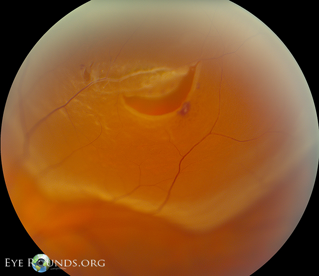
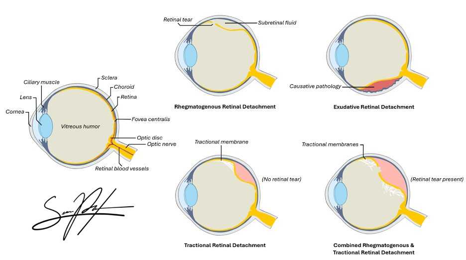
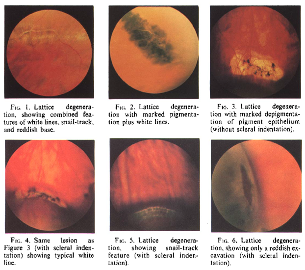
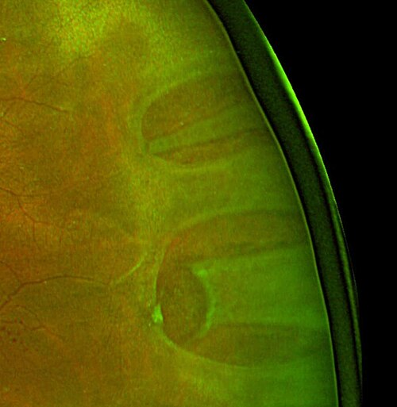
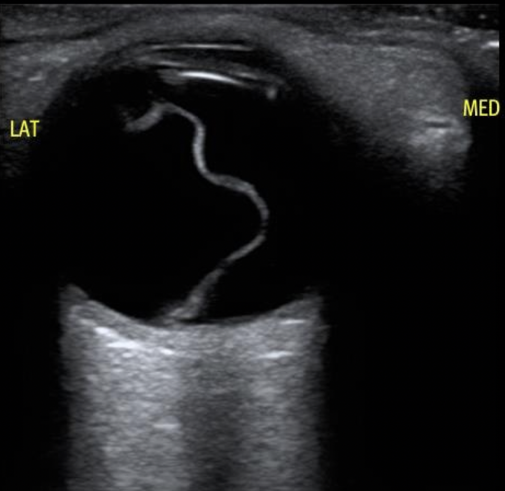
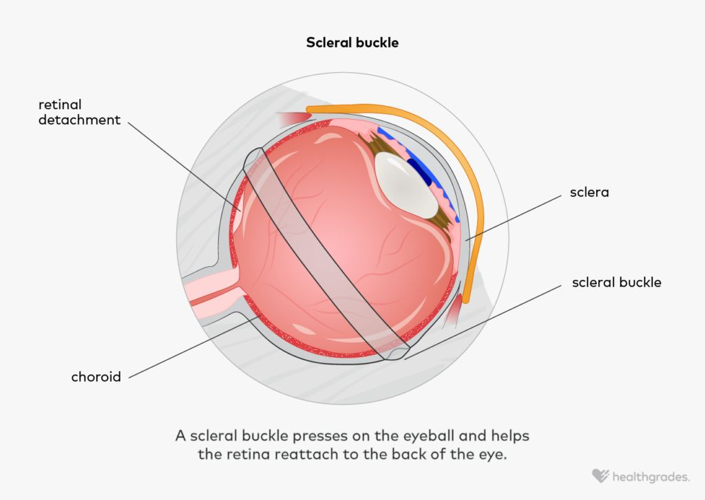

# DESCOLAMENTO DE RETINA E CIRURGIA VITREORRETINIANA

Para entender o descolamento de retina (DR), você precisa primeiro visualizar a anatomia não como um desenho estático, mas como um equilíbrio de forças. A retina não é "colada" mecanicamente em toda a sua extensão. Existe um espaço virtual entre a retina neurosensorial (onde estão os fotorreceptores) e o epitélio pigmentado da retina (EPR). O que mantém essas duas camadas unidas é, primordialmente, uma bomba metabólica ativa no EPR que "bebe" o fluido do espaço sub-retiniano e a pressão oncótica.

Quando falamos em descolamento de retina, estamos falando da separação dessas duas camadas pelo acúmulo de líquido no espaço sub-retiniano. Se você entender por que o líquido foi parar ali, você entende a classificação, o diagnóstico e, principalmente, a cirurgia.

## Fisiopatologia e Classificação: O "Porquê" de cada Tipo

Muitos alunos tentam decorar as causas, mas o segredo é entender o mecanismo. Existem três tipos principais de descolamento de retina que as bancas de residência adoram cobrar.

### 1. Descolamento de Retina Regmatogênico (DRR)

Este é o tipo mais comum e o "queridinho" das provas. A palavra vem do grego *rhegma*, que significa ruptura.
**O mecanismo:** Ocorre uma ruptura na retina (um rasgo ou buraco) que permite que o vítreo liquefeito passe para o espaço sub-retiniano.

Por que isso acontece? Com o envelhecimento, o vítreo sofre um processo de liquefação (sinérese) e se desprende da retina, o chamado Descolamento do Vítreo Posterior (DVP). Na maioria das pessoas, o DVP é fisiológico e inofensivo. No entanto, se o paciente tiver áreas de adesão vítreo-retiniana mais forte (como na degeneração lattice), o vítreo, ao se soltar, "puxa" um pedaço da retina, criando uma rasgadura em ferradura.

*Figura 2: Rasgadura em ferradura. O vítreo traciona a retina, criando o rasgo. O líquido passa pela ruptura e descola a retina.*

**Cuidado:** Nem toda ruptura causa descolamento imediato, mas toda ruptura é uma porta aberta. Se o fluxo de líquido que entra pela ruptura for maior que a capacidade da bomba do EPR de retirá-lo, a retina descola.

### 2. Descolamento de Retina Tracional (DRT)

Aqui não há necessariamente um buraco. O problema é mecânico e extrínseco.
**O mecanismo:** Membranas fibrovasculares crescem sobre a superfície da retina e, ao se contraírem, "puxam" a retina para longe do EPR.
O exemplo clássico que você verá no MedEvo e nas provas é a Retinopatia Diabética Proliferativa. Onde há isquemia, há liberação de VEGF, que gera neovasos. Esses neovasos vêm acompanhados de tecido fibroso que se contrai.

### 3. Descolamento de Retina Exudativo (ou Seroso)

Neste caso, a retina está íntegra e não há tração. O problema é que o EPR ou a coroide estão "doentes" e produzindo líquido em excesso ou falhando em drená-lo.
**O mecanismo:** Processos inflamatórios (como a Síndrome de Vogt-Koyanagi-Harada), tumores intraoculares (melanoma de coroide) ou hipertensão maligna causam o acúmulo de fluido.

*Figura 1: Os tipos de DR. Regmatogênico: tem ruptura. Tracional: membranas puxam sem ruptura. Exudativo: líquido se acumula sem ruptura nem tração.*

**Tabela 1: Diferenciação Clínica dos Tipos de Descolamento de Retina**

| Característica | Regmatogênico | Tracional | Exudativo |
| --- | --- | --- | --- |
| **Causa Principal** | Ruptura (rasgo/buraco) | Membranas fibrosas (DM) | Inflamação / Tumor |
| **Mobilidade** | Muito móvel (ondulante) | Imóvel, côncavo | Móvel (líquido flutuante) |
| **Superfície** | Convexa, com pregas | Côncava, sem pregas | Convexa, lisa |
| **Progressão** | Rápida | Lenta | Variável |
| **Sinais Associados** | Rupturas visíveis | Neovasos, hemorragia | Massa ou inflamação |

## Epidemiologia e Fatores de Risco

Você precisa saber quem é o paciente de risco, pois isso define a sua suspeita clínica antes mesmo de encostar o oftalmoscópio no paciente.

-

*Figura 5: Degeneração Lattice. Áreas finas e atróficas na periferia retiniana, onde o vítreo tem adesão mais forte. Principal fator predisponente ao DRR em míopes.*

**Miopia:** O olho míope é um olho mais longo (maior comprimento axial). A retina e a coroide são mais finas e esticadas, e a incidência de degenerações periféricas, como a degeneração lattice (em treliça), é muito maior. Um míope de mais de 6 dioptrias tem um risco exponencialmente maior de DRR.
2. **Cirurgia de Catarata (Pseudofaquia):** Mesmo uma cirurgia perfeita aumenta o risco de DRR a longo prazo. Se houver ruptura de cápsula posterior com perda de vítreo durante a cirurgia, esse risco aumenta drasticamente.
3. **Trauma Ocular:** O trauma pode causar uma diálise retiniana (desinserção da retina na periferia extrema, na ora serrata).
4. **História Familiar ou no Olho Contralateral:** Se o paciente já descolou um olho, o risco de descolar o outro é de cerca de 10% a 15%.

## Quadro Clínico: O Caminho do Diagnóstico

Imagine o seguinte cenário clínico: Paciente de 58 anos, míope, relata que há dois dias começou a ver "moscas volantes" (entopsias) e flashes de luz (fotopsias). Hoje, percebeu uma "cortina preta" subindo na parte inferior do campo visual do olho direito.

Este é o quadro clássico. Vamos dissecar o porquê de cada sintoma:

- **Fotopsias:** Representam a tração mecânica do vítreo sobre a retina. Como a retina não tem receptores de dor, ela responde a estímulos mecânicos gerando impulsos elétricos que o cérebro interpreta como luz.

- **Moscas Volantes (Floaters):** São opacidades vítreas. Podem ser condensações de colágeno ou, mais perigosamente, sangue (hemorragia vítrea) ou o Anel de Weiss (um pedaço de tecido que se solta do nervo óptico durante o DVP).

- **Sinal de Shafer (Poeira de Tabaco):** Este é o "pulo do gato" para provas. Ao examinar o vítreo anterior na lâmpada de fenda, o médico vê pequenos grânulos acastanhados. O que é isso? São células do epitélio pigmentado da retina que se soltaram através da ruptura e estão flutuando no vítreo. **Sinal de Shafer presente = Ruptura de retina até que se prove o contrário.**

-

*Figura 6: DR regmatogênico. A retina descolada aparece elevada com rasgadura em ferradura (horseshoe tear). O paciente enxerga uma "cortina" no campo visual correspondente ao setor afetado.*

**Defeito de Campo Visual:** A "cortina" ou "sombra" corresponde à área de retina descolada. Lembre-se: a imagem é invertida. Se o paciente queixa de perda de campo superior, o descolamento é inferior.

### O Exame Físico Detalhado

O padrão-ouro para o diagnóstico é a **Oftalmoscopia Indireta com Depressão Escleral**.
Por que depressão escleral? Porque a maioria das rupturas ocorre na periferia extrema, perto da ora serrata. Sem "empurrar" a periferia para dentro com um depressor, você pode deixar passar a ruptura que causou o problema.

Se o paciente tiver uma catarata muito densa ou uma hemorragia vítrea maciça que impeça a visualização do fundo de olho, a conduta obrigatória é a **Ultrassonografia Ocular (Modo B)**. No USG, o descolamento de retina aparece como uma membrana hiperecogênica, altamente móvel, que se insere no nervo óptico e na ora serrata.

*Figura 3: USG Modo B — DR "mácula off". A membrana branca (retina descolada) se insere no nervo óptico. Exame obrigatório quando os meios estão opacos.*

**Dica de Prova:** A banca pode perguntar como diferenciar DR de Descolamento de Coroide no USG. O DR se insere no nervo óptico. O descolamento de coroide não chega ao nervo óptico, pois é limitado pelas veias vorticosas.

## Regras de Lincoff: Localizando a Ruptura

O Dr. Harvey Lincoff descreveu regras baseadas na gravidade para ajudar o cirurgião a encontrar a ruptura principal. As bancas adoram cobrar a lógica por trás disso:

- **DR Superior Lateral ou Nasal:** A ruptura está a até 1,5 hora do ponto mais alto do descolamento.

- **DR Total ou Superior que cruza a linha vertical (12h):** A ruptura está às 12h ou muito próxima disso.

- **DR Inferior:** O lado com o nível de fluido mais alto indica o lado da ruptura. Se o fluido for simétrico, a ruptura costuma estar às 6h.

Por que isso importa? Porque se você não selar a ruptura, a cirurgia vai falhar. O líquido continuará entrando.

## Tratamento: A Arte da Cirurgia Vitreorretiniana

O objetivo de qualquer tratamento para DRR é: **Localizar a ruptura, selar a ruptura e aliviar a tração.**

### Profilaxia: Laser e Crioterapia

Se você encontrar uma ruptura (rasgo em ferradura) ou uma degeneração lattice sintomática, mas a retina ainda estiver colada, você faz a fotocoagulação a laser ou crioterapia ao redor da lesão. Isso cria uma cicatriz coriorretiniana (uma "solda") que impede a passagem do líquido.

### Opções Cirúrgicas para o Descolamento Instalado

Aqui é onde o aluno se confunde. Vamos simplificar as indicações conforme a Diretriz Brasileira de Oftalmologia e a prática clínica.

#### 1. Retinopexia Pneumática

É o procedimento menos invasivo. Injeta-se uma bolha de gás expansível (SF6 ou C3F8) dentro do olho. O paciente deve manter uma posição de cabeça específica para que a bolha pressione a ruptura contra o EPR, permitindo que a bomba natural reabsorva o líquido. Depois, faz-se laser ou crio.

- **Indicação:** Ruptura única, pequena, localizada nos 2/3 superiores da retina.

- **Vantagem:** Baixo custo, feito em consultório.

- **Desvantagem:** Alta taxa de redetalamento se não houver adesão estrita à posição.

*Figura 4: Scleral Buckle. A banda de silicone "empurra" a esclera para dentro, aproximando a parede do olho da retina descolada e selando a ruptura.*

#### 2. Introflexão Escleral (Scleral Buckle)

É a cirurgia "clássica" por fora do olho. Coloca-se uma banda ou elemento de silicone ao redor do globo ocular (o "buckle").

- **O "Porquê":** O buckle empurra a esclera em direção à retina, fechando a ruptura e aliviando a tração vítrea.

- **Indicação:** Pacientes jovens (fácicos), DRR sem complicações, rupturas inferiores.

- **Vantagem:** Não acelera a catarata e não exige posição de cabeça tão rigorosa quanto o gás.

#### 3. Vitrectomia Posterior via Pars Plana (VVPP)

É a cirurgia por dentro do olho. Removemos o vítreo, aspiramos o líquido sub-retiniano, tratamos a ruptura com laser e preenchemos o olho com um substituto vítreo (tamponante).

- **Indicação:** DR complexos, trações severas, hemorragia vítrea associada, ou quando o cirurgião prefere uma abordagem direta.

- **Substitutos Vítreos:**

- **Ar:** Dura 1-2 dias.

- **Gás SF6 (Hexafluoreto de enxofre):** Dura cerca de 2 semanas.

- **Gás C3F8 (Perfluorpropano):** Dura cerca de 6-8 semanas.

- **Óleo de Silicone:** É um tamponante permanente. Não é absorvido. Precisa de uma segunda cirurgia para ser retirado meses depois. Usado em casos graves (PVR, ver abaixo).

**Tabela 2: Comparativo de Tamponantes Intraoculares**

| Tamponante | Expansão | Duração Média | Principal Indicação |
| --- | --- | --- | --- |
| **Ar** | Não | 24-48 horas | Casos simples, trocas rápidas |
| **Gás SF6** | 2x | 10-14 dias | DRR superior padrão |
| **Gás C3F8** | 4x | 6-8 semanas | Rupturas inferiores ou complexas |
| **Óleo de Silicone** | Não | Permanente (até remoção) | PVR, DR Tracional, Trauma |

**Cuidado de Prova:** Pacientes com gás intraocular **NUNCA** podem voar de avião ou subir serras altas. A diminuição da pressão atmosférica faz o gás expandir, levando a um glaucoma agudo e oclusão da artéria central da retina. Isso é uma contraindicação absoluta até que a bolha seja absorvida.

## Vítreo-Retinopatia Proliferativa (PVR): O Grande Vilão

Se você fizer a cirurgia e a retina descolar novamente após algumas semanas, o culpado provavelmente é a PVR.
A PVR é um processo de cicatrização aberrante. Células do EPR e células gliais migram para a superfície da retina e formam membranas contráteis. Essas membranas "encolhem" a retina, criando dobras fixas.

**Classificação da PVR (Simplificada):**

- **Grau A:** Poeira de tabaco (células no vítreo).

- **Grau B:** Irregularidades na superfície retiniana, bordas da ruptura enroladas.

- **Grau C:** Dobras retinianas fixas em toda a espessura.

A PVR é a causa mais comum de falha cirúrgica no DRR. Quando ela está presente (especialmente Grau C), a vitrectomia com uso de óleo de silicone é quase sempre mandatória.

## Situações Especiais e Complicações

### O Descolamento de Retina com "Mácula On" vs. "Mácula Off"

Esta é a decisão clínica mais importante que você tomará.

- **Mácula ON (Mácula colada):** É uma **emergência cirúrgica**. O paciente ainda tem boa visão central (ex: 20/20), mas a retina está descolando e vai atingir a mácula em breve. Se operarmos agora, preservamos a visão.

- **Mácula OFF (Mácula descolada):** É uma urgência, mas não precisa ser operada às 2 da manhã. Uma vez que a mácula descola, a visão central cai drasticamente. O prognóstico visual final é muito pior, mesmo que a cirurgia seja um sucesso anatômico.

Como o Dr. Will costuma enfatizar em suas discussões no MedEvo, o tempo é tecido na retina "Mácula On". Cada hora conta para evitar que o fluido atinja a fóvea.

### Descolamento Tracional no Diabético

Diferente do regmatogênico, o DR tracional no diabético muitas vezes é observado se não atingir a mácula. No entanto, se houver progressão para a mácula ou se houver um componente regmatogênico associado (DR misto), a vitrectomia é indicada para dissecar as membranas e liberar a tração.

### Complicações Pós-Operatórias

- **Catarata:** Quase 100% dos pacientes submetidos à vitrectomia desenvolverão catarata em 1 a 2 anos.

- **Hipertensão Ocular:** Pode ocorrer por inflamação, bloqueio pupilar pelo gás ou pelo próprio óleo de silicone.

- **Endoftalmite:** A complicação mais temida de qualquer cirurgia intraocular (risco aproximado de 1:1000).

## Diagnóstico Diferencial: Não confunda!

Nem tudo que parece descolamento de retina é DR.

- **Retinosquise Senil:** É a divisão das camadas da retina (geralmente na camada plexiforme externa). Ao exame, parece um DR, mas é uma elevação fixa, tensa e muito transparente. Diferença crucial: a retinosquise raramente causa sintomas e o campo visual correspondente apresenta um escotoma absoluto (no DR é relativo).

- **Descolamento de Coroide:** Como mencionado, tem um aspecto "em domo", cor marrom-alaranjada, e não ultrapassa as veias vorticosas. Geralmente associado à hipotonia ocular (ex: após cirurgia de glaucoma).

- **Síndrome de Efusão Uveal:** Rara, causa descolamento exsudativo em olhos pequenos (nanoftalmos).

**Tabela 3: DR vs. Retinosquise**

| Característica | Descolamento de Retina (DRR) | Retinosquise Senil |
| --- | --- | --- |
| **Superfície** | Ondulante, opaca | Tensa, lisa, transparente |
| **Sinais de Ruptura** | Presentes (frequentemente) | Ausentes |
| **Hemorragia Vítrea** | Comum | Rara |
| **Escotoma** | Relativo | Absoluto |
| **Progressão** | Pode ser rápida | Estacionária (geralmente) |

## Tratamento Farmacológico e Adjuvantes

Não existe "colírio para colar retina". O tratamento é cirúrgico. No entanto, usamos medicações no perioperatório:

- **Corticosteroides Topicos:** Prednisolona 1% de 3/3h ou 4/4h para controlar a inflamação pós-operatória.

- **Cicloplégicos:** Atropina 1% ou Ciclopentolato para evitar sinéquias e reduzir a dor do espasmo ciliar.

- **Antibióticos Topicos:** Moxifloxacino ou Gatifloxacino por 7 a 10 dias como profilaxia de endoftalmite.

- **Anti-VEGF (Ranibizumabe/Aflibercepte):** Podem ser usados *antes* da vitrectomia em casos de DR tracional diabético grave para reduzir a vascularização das membranas e diminuir o risco de sangramento intraoperatório. **Cuidado:** O anti-VEGF em diabéticos com tração severa pode causar o "fenômeno de crunch" (contração rápida das membranas e piora do descolamento).

## Resumo da Conduta no Trauma Ocular

Se um paciente chega com trauma contuso e você não consegue ver o fundo de olho por causa de um hifema (sangue na câmara anterior) ou hemorragia vítrea:

- Estabilize o globo (se houver suspeita de perfuração, protetor ocular e nada de colírios ou toques).

- **USG Ocular** é obrigatório para descartar DR ou corpo estranho intraocular.

- Se houver DR, a cirurgia deve ser planejada. No trauma penetrante, a vitrectomia costuma ser feita entre 3 a 14 dias após o reparo inicial, para permitir que o olho estabilize e o vítreo se desprenda, facilitando a remoção.

## Pontos-Chave para Prova

- **DR Regmatogênico:** Causa mais comum é o Descolamento do Vítreo Posterior (DVP) levando a rupturas em áreas de adesão.

- **Sinal de Shafer:** Células de pigmento no vítreo anterior. Patognomônico de ruptura retiniana.

- **Miopia e Pseudofaquia:** Os dois principais fatores de risco não traumáticos para DRR.

- **Mácula ON:** Emergência cirúrgica. O objetivo é operar antes que a mácula descole para preservar a visão central.

- **Mácula OFF:** O tempo é menos crítico (urgência), mas o prognóstico visual é reservado.

- **Retinopexia Pneumática:** Indicada para rupturas únicas nos 2/3 superiores. Exige cooperação do paciente com a posição de cabeça.

- **Gases Intraoculares (SF6 e C3F8):** Contraindicação ABSOLUTA para viagens aéreas ou mudanças bruscas de altitude.

- **Óleo de Silicone:** Tamponante de longa duração. Indicado em PVR grau C, DR tracional grave e traumas. Precisa ser removido cirurgicamente depois.

- **PVR (Vítreo-Retinopatia Proliferativa):** Principal causa de insucesso na cirurgia de DR. É um processo cicatricial com membranas que "encolhem" a retina.

- **Regras de Lincoff:** Usadas para localizar a ruptura baseando-se na configuração do líquido sub-retiniano.

- **DR Tracional:** Clássico da Retinopatia Diabética Proliferativa. Não tem ruptura (inicialmente) e a superfície é côncava.

- **DR Exudativo:** Não tem ruptura nem tração. Causado por inflamação ou tumores. O líquido é "fluido" e muda de posição com a gravidade.

- **Ultrassonografia Modo B:** Exame de escolha quando os meios estão opacos (catarata ou hemorragia). O DR aparece como membrana hiperecogênica presa ao nervo óptico.

- **Degeneração Lattice (em treliça):** A alteração periférica mais associada ao DRR. Deve ser tratada com laser se for sintomática ou no olho contralateral de quem já teve DR.

- **O que NÃO fazer:** Nunca dilate um paciente com suspeita de DR sem antes descartar glaucoma de ângulo fechado, mas, para a prova de retina, o exame de fundo de olho sob midríase é essencial. O erro clássico é não fazer a depressão escleral e deixar passar a ruptura periférica. 👁️

 Cópia offline para consulta pessoal.
 Fonte original:
 [https://www.medevo.com.br/material-apoio/ler/b80c74b6-063a-4ce9-a7d6-96bb7e7ea930](https://www.medevo.com.br/material-apoio/ler/b80c74b6-063a-4ce9-a7d6-96bb7e7ea930)
