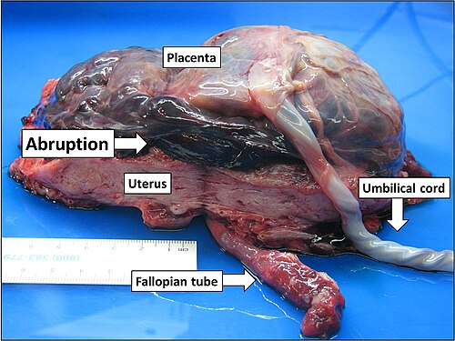

# DESCOLAMENTO PREMATURO DE PLACENTA

O Descolamento Prematuro de Placenta, carinhosamente chamado de DPP pelas bancas de residência, é o pesadelo de qualquer obstetra no plantão e um dos temas favoritos dos examinadores. Por que? Porque ele exige decisão rápida. Aqui, não há tempo para pedir uma ressonância ou esperar o resultado de um exame laboratorial complexo. O diagnóstico é clínico e a conduta, muitas vezes, é a diferença entre a vida e a morte do binômio mãe-feto.

Para entender o DPP, esqueça a decoreba por um momento. Pense na placenta como uma interface de troca que deve ficar colada ao útero até que o bebê nasça. Se ela resolve se soltar antes da hora, após as 20 semanas de gestação, temos dois problemas imediatos: a mãe começa a sangrar internamente (formando um hematoma que separa a placenta do útero) e o feto para de receber oxigênio adequadamente.

*Figura 1 - Ilustração anatômica do descolamento prematuro de placenta (DPP), mostrando a separação parcial da placenta da parede uterina antes das 20 semanas com formação de hematoma retroplacentário. Fonte: BruceBlaus, CC BY 3.0 | Wikimedia Commons*

## Fisiopatologia: O Porquê da Catástrofe

*Figura 2 - Imagem macroscópica de útero aberto mostrando DPP com hematoma retroplacentário (seta) separando a placenta da parede uterina. O sangue rico em tromboplastina pode desencadear CIVD e infiltrar o miométrio causando o Útero de Couvelaire. Fonte: Mikael Häggström, M.D., CC0 | Wikimedia Commons*

A base do DPP está na ruptura dos vasos maternos na decídua basal. Imagine que um vaso se rompe e o sangue começa a se acumular ali. Esse sangue não tem para onde ir, então ele começa a dissecar a interface entre a placenta e a parede uterina.

O que acontece a seguir é um efeito dominó. O hematoma retroplacentário aumenta a pressão local, o que leva a mais descolamento. Esse sangue acumulado é rico em tromboplastina tecidual. Quando essa substância cai na circulação materna, ela desencadeia a cascata de coagulação de forma desordenada. É por isso que o DPP é a principal causa de Coagulação Intravascular Disseminada (CIVD) na obstetrícia.

Além disso, o sangue que infiltra o miocitário (músculo uterino) causa uma irritação intensa. É essa irritação que gera a famosa hipertonia uterina. O útero fica "duro como madeira" porque as fibras musculares estão sofrendo uma agressão química pelo sangue infiltrado. Se esse sangue infiltrar demais, teremos o Útero de Couvelaire (apoplexia uterina), onde o útero perde a capacidade de contrair após o parto, gerando hemorragia pós-parto maciça.

## Fatores de Risco: Quem é a Paciente da Prova?

As bancas adoram colocar uma lista de fatores de risco e pedir para você identificar qual não faz parte. Aqui vai a regra de ouro: a hipertensão é a rainha do DPP.

- Síndromes Hipertensivas (Pré-eclâmpsia ou HAS Crônica): Presentes em cerca de 50% dos casos graves. A hipertensão causa alterações vasculares crônicas que facilitam a ruptura dos vasos deciduais.

- Trauma Abdominal: Pense em acidentes automobilísticos ou violência doméstica. O mecanismo aqui é o cisalhamento (o útero é elástico, a placenta não). Cuidado: o uso correto do cinto de segurança na gravidez (faixa subabdominal abaixo do ventre e faixa diagonal entre as mamas) reduz esse risco.

- Tabagismo e Uso de Cocaína: Ambos causam vasoconstrição e danos vasculares. A cocaína, especificamente, causa picos hipertensivos súbitos que "arrancam" a placenta.

- Idade Materna Avançada e Multiparidade: O útero vai ficando "cansado" e com vascularização menos eficiente.

- Amniorrexe Prematura e Polidrâmnio: O problema aqui é a descompressão súbita. Se o útero está muito esticado e esvazia rápido demais, a placenta pode se soltar da parede que encolheu bruscamente.

- Placenta Circunvalada: Uma variação anatômica onde as membranas se dobram sobre a face fetal, aumentando o risco de descolamento.

Dica de prova: Diabetes Gestacional NÃO é fator de risco para DPP. As bancas amam colocar isso como alternativa incorreta porque o aluno associa "gravidez de risco" a tudo que é ruim. Não caia nessa.

## O Quadro Clínico: A Tríade Clássica

Se você vir estas três coisas juntas em uma questão, não perca tempo:

- Dor Abdominal Súbita e Intensa (o sintoma mais fiel).

- Sangramento Vaginal (geralmente escuro, mas pode ser ausente em 20% dos casos, o chamado sangramento oculto).

- Hipertonia Uterina (útero não relaxa entre as contrações ou fica permanentemente rígido).

Muitas vezes, o primeiro sinal de que algo está errado é a alteração na vitalidade fetal. Como a área de troca gasosa diminuiu, o feto entra em sofrimento agudo (bradicardia fetal). Se o descolamento for superior a 50%, o óbito fetal é quase certo.

Como o Dr. Will costuma enfatizar em suas discussões clínicas, o sangramento vaginal no DPP é "mentiroso". A quantidade de sangue que você vê no absorvente da paciente não reflete a gravidade do quadro, pois boa parte do sangue pode estar retida atrás da placenta (hematoma retroplacentário). Portanto, guie-se pela clínica da paciente (taquicardia, hipotensão) e não apenas pelo volume de sangue visível.

## Diagnóstico: O Grande Erro dos Alunos

Este é o ponto onde mais se erra em provas e na vida real. O diagnóstico de DPP é CLÍNICO.

Muitas questões trazem um cenário clássico de DPP e perguntam: "Qual o próximo passo?". A alternativa "Realizar Ultrassonografia" estará lá, brilhando, para te seduzir. Não marque! A ultrassonografia tem baixa sensibilidade (cerca de 25 a 50%) para detectar o hematoma retroplacentário nas primeiras horas.

Se a clínica é soberana (dor + hipertonia + sofrimento fetal), a conduta é a resolução da gravidez. Esperar a USG pode significar a morte do feto ou a falência renal da mãe por choque hipovolêmico. A USG só é útil para descartar Placenta Prévia, onde o sangramento é indolor e o tônus uterino é normal.

### Tabela 1: Diagnóstico Diferencial das Hemorragias de Terceiro Trimestre

| Característica | Descolamento de Placenta (DPP) | Placenta Prévia (PP) | Rotura Uterina |
| --- | --- | --- | --- |
| Início | Súbito | Insidioso | Súbito / Dramático |
| Dor Abdominal | Intensa / Contínua | Ausente | Intensa (antes da rotura) |
| Sangramento | Escuro / Moderado | Vermelho Vivo / Recidivante | Variável (pode ser interno) |
| Tônus Uterino | Hipertonia (Útero de madeira) | Normal (Útero relaxado) | Partes fetais palpáveis |
| Sofrimento Fetal | Frequente e Precoce | Raro (até haver choque) | Grave / Óbito Fetal |
| Fator de Risco | Hipertensão / Trauma | Cicatriz uterina prévia | Cicatriz de Cesárea |

## Classificação de Sher: Graduando a Gravidade

A classificação de Sher ajuda a entender o prognóstico e a guiar a conduta. Ela é retrospectiva em alguns casos, mas fundamental para a prova.

- Grau 0: Assintomático. O diagnóstico é feito após o parto, ao examinar a placenta e encontrar um coágulo retroplacentário organizado.

- Grau I: Sangramento discreto, sem hipertonia importante. Feto vivo e mãe estável.

- Grau II: Sangramento moderado e hipertonia presente. Há sofrimento fetal evidente, mas a mãe ainda está compensada hemodinamicamente.

- Grau III: Óbito fetal confirmado.

- IIIa: Sem coagulopatia.

- IIIb: Com coagulopatia (CIVD instalada).

## Conduta: O que fazer quando o relógio está correndo?

A conduta no DPP depende de dois fatores: a vitalidade fetal (feto vivo ou morto) e a estabilidade materna. Mas, antes de qualquer decisão sobre a via de parto, existe uma medida que é quase universal no DPP: a AMNIOTOMIA.

Por que fazemos a amniotomia imediatamente?

- Reduz a pressão intrauterina, o que diminui a passagem de tromboplastina para o sangue materno (reduz risco de CIVD).

- Melhora a dinâmica uterina, acelerando o trabalho de parto.

- Permite observar a cor do líquido (geralmente hemático).

- Diminui a pressão sobre os vasos retroplacentários, podendo reduzir o sangramento.

### Cenário 1: Feto Vivo

Se o feto está vivo e há sofrimento fetal (bradicardia, desacelerações tardias), a regra é: Cesariana de Emergência.
Não importa se a dilatação é 4 ou 5 cm. Se o feto está sofrendo e o parto não é iminente, a via mais rápida é a alta.

Exceção: Se a paciente já está em período expulsivo (dilatação total, feto no plano +3 de DeLee), o parto vaginal pode ser mais rápido que preparar uma sala de cirurgia. Mas isso é a exceção da exceção em provas.

### Cenário 2: Feto Morto

Aqui está a pegadinha. Se o feto já morreu (Grau III), a prioridade absoluta passa a ser a MÃE.
Fazer uma cesariana em uma mulher com feto morto e provável coagulopatia é pedir para ela ter uma hemorragia incontrolável na mesa de cirurgia.

A conduta preferencial com feto morto é o Parto Vaginal.
Estabilizamos a mãe com volume e hemoderivados, fazemos a amniotomia e induzimos o parto (geralmente com ocitocina, já que o útero está irritável).

Cuidado: Se o parto vaginal demorar muito (previsão de mais de 4 a 6 horas) ou se a mãe estiver instável demais, a cesariana pode ser necessária mesmo com feto morto, mas isso é considerado uma medida de exceção para salvar a vida materna.

### Tabela 2: Resumo da Conduta no DPP

| Situação Clínica | Conduta Imediata | Via de Parto Preferencial |
| --- | --- | --- |
| Feto Vivo + Sofrimento | Estabilização + Amniotomia | Cesariana de Emergência |
| Feto Vivo + Parto Iminente | Amniotomia | Parto Vaginal |
| Feto Morto + Mãe Estável | Estabilização + Amniotomia | Parto Vaginal (Indução) |
| Feto Morto + Mãe Instável* | Reanimação Volêmica Pesada | Cesariana (se vaginal demorar) |

*Nota: Na instabilidade materna grave com feto morto, a prioridade é repor fatores de coagulação e sangue antes de qualquer corte cirúrgico.

## Complicações: O Pós-Parto é Perigoso

O problema do DPP não termina quando o bebê nasce. O útero que sofreu infiltração hemorrágica pode não contrair.

### Útero de Couvelaire (Apoplexia Uteroplacentária)

Durante a cesariana, você abre a barriga e vê um útero roxo, petequial, com aspecto de "berinjela". Isso é o sangue que infiltrou o miocitário.
A conduta inicial NÃO é a histerectomia. Tentamos medidas conservadoras: massagem uterina (Manobra de Hamilton), ocitocina, misoprostol, ácido tranexâmico e, se necessário, suturas compressivas (Sutura de B-Lynch). Se nada funcionar e a hemorragia persistir, aí sim partimos para a histerectomia.

### Coagulação Intravascular Disseminada (CIVD)

O DPP é o maior gatilho para CIVD na gravidez. O consumo de fibrinogênio é altíssimo. Se o fibrinogênio estiver abaixo de 150 mg/dL, o risco de sangramento grave é imenso. No MedEvo, sempre reforçamos: em casos de DPP grave, peça o "kit hemorrágico" (hemácias, plasma, crioprecipitado e plaquetas).

### Síndrome de Sheehan

Uma complicação tardia. O choque hipovolêmico grave causa isquemia e necrose da glândula hipófise. A paciente evolui no pós-parto com agalactia (não consegue amamentar) e perda de outros eixos hormonais (hipotireoidismo, insuficiência adrenal secundária).

## O Manejo do Choque e Reanimação

Lembre-se que a gestante demora a manifestar sinais de choque porque ela tem um volume sanguíneo 40-50% maior. Quando a pressão cai, ela já perdeu cerca de 30% do volume total.
O Índice de Choque Obstétrico (Frequência Cardíaca / Pressão Arterial Sistólica) é uma ferramenta útil. Se o resultado for > 0.9, a paciente está em choque grave, mesmo que a pressão ainda pareça "normal".

A reanimação deve ser agressiva:

- Dois acessos venosos calibrosos (Jelco 14 ou 16).

- Cristaloides (Ringer Lactato ou Soro Fisiológico) com cautela para não causar hemodiluição excessiva.

- Hemotransfusão precoce se houver instabilidade.

## Situações Especiais e Pegadinhas de Prova

- Trauma e USG: Em casos de trauma (ex: batida de carro), a USG pode ser feita como parte do protocolo FAST, mas se houver dor e hipertonia, o diagnóstico de DPP é clínico. Não espere ver o hematoma na tela.

- Cocaína: Sempre que a questão mencionar uma gestante usuária de drogas com dor abdominal súbita, marque DPP.

- Óbito Fetal e Declaração de Óbito: Se o feto tiver mais de 20 semanas ou mais de 500g, é obrigatório o preenchimento da Declaração de Óbito (DO).

- DPP Crônico: Existe uma forma rara onde ocorrem pequenos descolamentos repetidos. O quadro é de sangramento intermitente e oligodrâmnio, sem a dor aguda clássica. É raro em provas, mas bom saber para a vida.

### Tabela 3: Metas Terapêuticas na Hemorragia por DPP

| Parâmetro | Meta Desejada |
| --- | --- |
| Débito Urinário | > 30 mL/hora |
| Hematócrito | > 30% |
| Fibrinogênio | > 150 - 200 mg/dL |
| Plaquetas | > 50.000 /mm³ |
| Estabilidade Hemodinâmica | FC < 100 bpm e PAS > 90 mmHg |

## Pontos-Chave para Prova

- O diagnóstico de DPP é CLÍNICO. A ultrassonografia tem baixa sensibilidade e não deve atrasar a conduta em casos típicos.

- A principal causa de DPP é a Hipertensão (Pré-eclâmpsia ou HAS crônica).

- A tríade clássica é: Dor abdominal súbita + Hipertonia uterina + Sangramento vaginal escuro.

- O sangramento pode ser oculto em 20% dos casos. A ausência de sangue na vagina não exclui DPP.

- A primeira medida após estabilização e diagnóstico é a AMNIOTOMIA, independentemente da via de parto.

- Feto vivo com sofrimento fetal = Cesariana de emergência (regra geral).

- Feto morto = Preferência por Parto Vaginal para evitar complicações cirúrgicas em paciente com potencial coagulopatia.

- O DPP é a principal causa de Coagulação Intravascular Disseminada (CIVD) na gestação devido à liberação de tromboplastina.

- Útero de Couvelaire é a infiltração hemorrágica do miocitário. O tratamento inicial é clínico/farmacológico, não cirúrgico radical.

- Diabetes Gestacional NÃO aumenta o risco de DPP.

- O uso de cocaína é um fator de risco clássico devido ao pico hipertensivo e vasoconstrição.

- A Síndrome de Sheehan (necrose hipofisária) é uma sequela tardia do choque hipovolêmico no DPP.

- Em caso de trauma, o descolamento ocorre pelo mecanismo de cisalhamento entre o útero elástico e a placenta rígida.

- O fibrinogênio é o melhor marcador laboratorial de gravidade na CIVD por DPP; valores < 150 mg/dL são críticos.

- Se a questão mostrar uma paciente com cicatriz de cesárea prévia, dor súbita, mas tônus uterino NORMAL e subida da apresentação fetal (Sinal de Reasens), pense em Rotura Uterina, não DPP. 🚨

 Cópia offline para consulta pessoal.
 Fonte original:
 [https://www.medevo.com.br/material-apoio/ler/214adaf0-a835-4fa7-a09b-cd286c78d141](https://www.medevo.com.br/material-apoio/ler/214adaf0-a835-4fa7-a09b-cd286c78d141)
