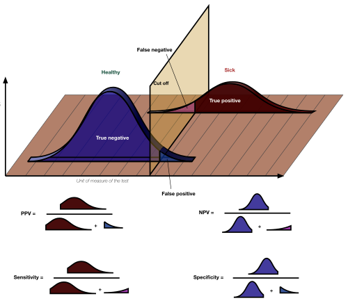
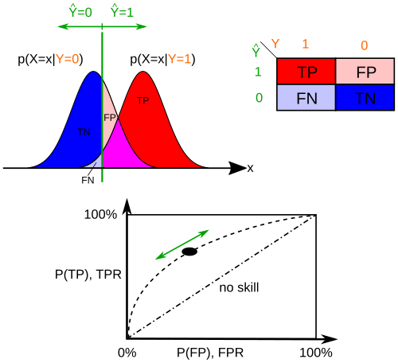

# DESEMPENHO DE TESTES DIAGNÓSTICOS

Para entender medicina preventiva e acertar as questões de epidemiologia clínica, você precisa parar de decorar fórmulas isoladas e começar a entender a lógica por trás da tomada de decisão. Na prática médica, e principalmente nas provas de residência, o examinador quer saber se você sabe escolher o teste certo para a situação certa.

Imagine que você está no ambulatório. Se você pede um exame com muitos falsos-positivos para uma doença rara, você vai causar ansiedade desnecessária e biópsias inúteis. Se você usa um teste pouco sensível para uma doença fatal e tratável, você deixa o paciente morrer. É esse equilíbrio que vamos construir aqui.

## A Tabela 2x2: O Mapa do Tesouro

Tudo em desempenho de testes diagnósticos nasce de uma tabela simples de dupla entrada. Se você souber montar essa tabela, você resolve 90% das questões de cálculo. O segredo é sempre colocar o "Padrão-Ouro" (a verdade) nas colunas e o "Resultado do Teste" nas linhas.

| | Doente (Padrão-Ouro +) | Saudável (Padrão-Ouro -) | Total |
| --- | --- | --- | --- |
| **Teste Positivo** | Verdadeiro Positivo (a) | Falso Positivo (b) | a + b |
| **Teste Negativo** | Falso Negativo (c) | Verdadeiro Negativo (d) | c + d |
| **Total** | a + c (Total de Doentes) | b + d (Total de Sadios) | N (Total Geral) |

Muitos alunos erram questões bobas porque invertem as linhas com as colunas. Lembre-se: a coluna é a realidade (o paciente tem ou não a doença), a linha é o que o seu estetoscópio, o laboratório ou a imagem estão dizendo.

## Sensibilidade e Especificidade: As Propriedades do Teste

Aqui está o primeiro grande conceito que as bancas adoram: Sensibilidade e Especificidade são propriedades intrínsecas do teste. Em teoria, elas não mudam se você aplicar o teste em uma população de idosos ou de crianças, ou se a doença for rara ou comum.

### Sensibilidade (Capacidade de detectar doentes)

A Sensibilidade responde à pergunta: "De todos os doentes, quantos o meu teste consegue identificar?".
Matematicamente: S = VP / (VP + FN) ou a / (a + c).

Por que usamos testes sensíveis? Usamos quando não podemos deixar passar nenhum caso. Se a doença é grave, letal, mas tem tratamento eficaz (como a sífilis na gestante ou o hipotireoidismo congênito no teste do pezinho), eu quero um teste que seja "boca aberta", que pegue todo mundo.

O preço da alta sensibilidade é que o teste acaba pegando alguns saudáveis de "brinde" (falsos positivos). Mas, para triagem, isso é aceitável. Lembre-se: um teste muito sensível, quando dá **negativo**, é excelente para **excluir** a doença. Se ele quase nunca erra para menos (poucos falsos negativos), um resultado negativo é muito confiável.

### Especificidade (Capacidade de detectar sadios)

A Especificidade responde: "De todos os sadios, quantos o meu teste identifica como negativos?".
Matematicamente: E = VN / (VN + FP) ou d / (b + d).

Usamos testes específicos quando o diagnóstico implica um tratamento de alto risco ou um estigma social pesado. Imagine uma quimioterapia tóxica ou uma cirurgia mutilante. Você precisa ter certeza absoluta de que o paciente está doente.

Um teste muito específico, quando dá **positivo**, é excelente para **confirmar** a doença. Se ele quase nunca erra para mais (poucos falsos positivos), um resultado positivo "carimba" o diagnóstico. Como dizemos no MedEvo, a especificidade é o filtro que separa o joio do trigo.

*Figura 1 - Visualização 3D das relações entre Sensibilidade, Especificidade, Valor Preditivo Positivo (VPP) e Valor Preditivo Negativo (VPN), integrando os conceitos da tabela 2x2. Fonte: Luigi Albert Maria, CC BY-SA 4.0 | Wikimedia Commons*

### O Trade-off: O Ponto de Corte

Na maioria dos testes laboratoriais (como a glicemia ou o PSA), o resultado é uma variável contínua. Para decidir quem é "doente", precisamos escolher um ponto de corte.

Se eu diminuo o valor do ponto de corte (torno o teste mais "exigente" para ser considerado normal), eu aumento a Sensibilidade, mas diminuo a Especificidade. Eu pego mais doentes, mas levo mais sadios junto. Se eu subo o ponto de corte, eu aumento a Especificidade (só os muito doentes positivam), mas perco Sensibilidade.

| Mudança no Ponto de Corte | Sensibilidade | Especificidade | Falsos Negativos | Falsos Positivos |
| --- | --- | --- | --- | --- |
| Para a Esquerda (Mais sensível) | Sobe | Desce | Diminui | Aumenta |
| Para a Direita (Mais específico) | Desce | Sobe | Aumenta | Diminui |

## Valores Preditivos: O Mundo Real e a Prevalência

Agora entramos no que realmente importa para o médico à beira do leito. O paciente não chega com o rótulo de "doente" ou "sadio". Ele chega com um resultado de exame na mão e pergunta: "Doutor, meu teste deu positivo, qual a chance de eu ter essa doença?".

Isso é o Valor Preditivo. E, ao contrário da Sensibilidade e Especificidade, os Valores Preditivos **dependem diretamente da prevalência** da doença na população testada.

### Valor Preditivo Positivo (VPP)

É a probabilidade de o paciente ter a doença dado que o teste foi positivo.
VPP = VP / (VP + FP) ou a / (a + b).

Aqui está a pegadinha clássica de prova: se a prevalência da doença aumenta, o VPP aumenta. Por quê? Porque em uma população onde a doença é comum, um teste positivo tem muito mais chance de ser um "verdadeiro positivo" do que um erro do teste.

### Valor Preditivo Negativo (VPN)

É a probabilidade de o paciente não ter a doença dado que o teste foi negativo.
VPN = VN / (VN + FN) ou d / (c + d).

Se a prevalência da doença diminui (doença rara), o VPN aumenta. É intuitivo: se quase ninguém tem a doença, quando o teste diz que você não tem, a chance de ele estar certo é altíssima.

### Acurácia

A acurácia é a proporção de acertos totais do teste (verdadeiros positivos + verdadeiros negativos) sobre o total de testados. Ela mede a performance global.
Acurácia = (a + d) / (a + b + c + d).

Cuidado: a acurácia pode ser enganosa em doenças muito raras. Se 1% da população tem uma doença e meu teste apenas diz "negativo" para todo mundo, ele terá uma acurácia de 99%, mas será um teste inútil para detectar doentes.

## Razão de Verossimilhança (Likelihood Ratio)

Este é um conceito que tem caído cada vez mais porque é a base da Medicina Baseada em Evidências. A Razão de Verossimilhança (RV) nos diz quanto um resultado de teste aumenta ou diminui a probabilidade pré-teste de o paciente ter a doença.

A grande vantagem da RV? Ela não depende da prevalência (como os valores preditivos), mas ajuda a calcular a probabilidade pós-teste para aquele paciente específico.

- **Razão de Verossimilhança Positiva (RV+):** Sensibilidade / (1 - Especificidade).
Indica quanto o achado de um teste positivo é mais provável em doentes do que em não doentes. Quanto maior a RV+ (especialmente acima de 10), mais o teste confirma a doença.

- **Razão de Verossimilhança Negativa (RV-):** (1 - Sensibilidade) / Especificidade.
Indica quanto o achado de um teste negativo é mais provável em doentes do que em não doentes. Quanto menor a RV- (especialmente abaixo de 0,1), mais o teste exclui a doença.

Se uma questão te der a probabilidade pré-teste (prevalência) e a RV, você usa o Nomograma de Fagan para achar a probabilidade pós-teste. Dr. Will sempre lembra: a RV é a forma mais elegante de integrar o achado clínico com a probabilidade da doença.

## Curva ROC (Receiver Operating Characteristic)

A Curva ROC é a representação gráfica da relação entre Sensibilidade (eixo Y) e 1 - Especificidade (eixo X, que representa os falsos positivos).

Cada ponto na curva representa um ponto de corte diferente.

- Quanto mais a curva se aproxima do canto superior esquerdo, melhor é o teste (maior sensibilidade e maior especificidade simultaneamente).

- A **Área Abaixo da Curva (AUC)** é a medida da acurácia do teste. Uma AUC de 1,0 é o teste perfeito. Uma AUC de 0,5 é igual a jogar uma moeda (puro acaso).

Se a prova te mostrar duas curvas, a que estiver "mais por cima" e "mais à esquerda" representa o teste com melhor desempenho global.

*Figura 2 - Curvas ROC: a curva mais próxima do canto superior esquerdo indica o teste com melhor desempenho. A área abaixo da curva (AUC) de 1.0 é o teste perfeito; AUC de 0.5 equivale ao acaso. Fonte: Sharpr/Kakau, CC BY-SA 3.0 | Wikimedia Commons*

## Testes em Série e em Paralelo

Na prática, raramente usamos apenas um teste.

### Testes em Paralelo (Simultâneos)

Pedimos vários testes ao mesmo tempo (ex: troponina e ECG na dor torácica).

- **Objetivo:** Aumentar a Sensibilidade e o VPN.

- **Critério de Positividade:** Basta UM teste ser positivo para considerarmos o paciente doente.

- **Consequência:** Perde-se especificidade (aumentam os falsos positivos).

### Testes em Série (Sequenciais)

Pedimos um teste e, se positivo, pedimos outro mais específico (ex: teste rápido para HIV seguido de Western Blot, ou VDRL seguido de FTA-Abs).

- **Objetivo:** Aumentar a Especificidade e o VPP.

- **Critério de Positividade:** O paciente só é considerado doente se AMBOS os testes forem positivos.

- **Consequência:** Perde-se sensibilidade (aumentam os falsos negativos).

## Rastreamento (Screening)

Rastrear não é apenas pedir exames. É uma intervenção de saúde pública em pessoas **assintomáticas**. Se o paciente tem sintomas (ex: sangramento anal), você não está rastreando, você está investigando um sintoma (diagnóstico precoce).

### Critérios de Wilson e Jungner

Para que um rastreamento seja justificado, ele deve cumprir critérios rigorosos:

- A doença deve ser um problema de saúde importante.

- Deve haver um estágio pré-clínico (latente) reconhecível.

- A história natural da doença deve ser conhecida.

- Deve haver um teste aceitável, seguro e barato.

- O tratamento precoce deve ser mais eficaz que o tratamento na fase sintomática.

- O custo deve ser economicamente equilibrado.

### Vieses em Rastreamento (Pegadinhas de Prova!)

As bancas amam testar se você entende por que alguns programas de rastreamento parecem bons, mas não são.

- **Viés de Tempo de Antecipação (Lead-time Bias):** O rastreamento detecta a doença mais cedo, então parece que o paciente viveu mais tempo após o diagnóstico. Na verdade, ele apenas soube que estava doente por mais tempo, mas morreu no mesmo momento em que morreria se tivesse descoberto pelos sintomas. O rastreamento não mudou o desfecho, apenas a percepção de sobrevida.

- **Viés de Tempo de Duração (Length-time Bias):** O rastreamento tende a detectar casos de progressão lenta (menos agressivos), que ficam mais tempo na fase pré-clínica. Casos fulminantes e agressivos aparecem entre um exame e outro (câncer de intervalo). Isso dá a falsa impressão de que o rastreamento é muito eficaz, quando na verdade ele está selecionando os casos de melhor prognóstico natural.

- **Overdiagnosis (Sobrediagnóstico):** Identificação de condições que nunca causariam sintomas ou morte (ex: alguns cânceres de próstata ou tireoide de crescimento muito lento). Isso leva ao **Overtreatment** (sobretratamento), expondo o paciente a riscos sem benefício.

## Recomendações de Rastreamento no Brasil (Ministério da Saúde)

Este é o ponto onde a teoria encontra a diretriz. Memorize estes valores, pois eles caem exatamente assim.

### Câncer de Colo do Útero

- **Quem:** Mulheres (ou pessoas com colo do útero) que já iniciaram atividade sexual.

- **Idade:** 25 a 64 anos.

- **Periodicidade:** Anual. Após dois exames seguidos normais, passa a ser a cada 3 anos.

- **HIV+:** Iniciar logo após a sexarca, semestral no primeiro ano e depois anual (se CD4 > 200).

### Câncer de Mama

- **Quem:** Mulheres de risco padrão.

- **Exame:** Mamografia (o exame físico das mamas não é recomendado como rastreio isolado pelo MS).

- **Idade:** 50 a 74 anos (Nota Técnica nº 626/2025-MS).

- **Periodicidade:** Bienal (a cada 2 anos).

- **Atenção:** O rastreamento em mulheres mais jovens (40-49 anos) é discutível e não é recomendado de rotina pelo MS devido ao alto índice de falsos positivos e sobrediagnóstico.

### Câncer Colorretal (CCR)

- **Quem:** Homens e mulheres de risco padrão.

- **Idade:** 50 a 75 anos.

- **Métodos:** Pesquisa de Sangue Oculto nas Fezes (anual ou bienal) OU Colonoscopia (periodicidade varia, geralmente a cada 10 anos se normal).

- **Risco Aumentado:** Parentes de 1º grau com CCR antes dos 60 anos devem iniciar aos 40 anos ou 10 anos antes do caso mais jovem da família.

### Outros Rastreamentos Importantes

- **Dislipidemia:** Homens > 35 anos e mulheres > 45 anos (MS recomenda focar no risco cardiovascular global).

- **Tabagismo/DPOC:** Não se recomenda rastreamento com espirometria em tabagistas assintomáticos. O foco é a cessação tabágica.

- **Câncer de Próstata:** O Ministério da Saúde e a USPSTF não recomendam o rastreamento populacional sistemático com PSA. A decisão deve ser compartilhada, explicando riscos (biópsias, incontinência, impotência) e benefícios.

- **Câncer de Pulmão:** Recomendado para tabagistas pesados (>20 maços-ano), fumante atual, entre 50-80 anos, indivíduos que pararam de fumar nos últimos 15 anos com Tomografia de Baixa Dosagem anual.

## Aplicações Clínicas e Epidemiológicas

### Dengue

A escolha do teste depende da fase da doença (fisiopatologia!).

- **Até o 5º dia (Fase de viremia):** Pesquisa de Antígeno NS1 ou RT-PCR. Alta sensibilidade no início.

- **Após o 6º dia (Fase de resposta imune):** Sorologia IgM. Se você pedir IgM no 2º dia, terá um Falso Negativo (janela imunológica).

### Sífilis

O rastreamento no pré-natal é feito com testes não treponêmicos (VDRL/RPR) por serem baratos e sensíveis. No entanto, eles podem dar falsos positivos (lúpus, infecções, gravidez). Por isso, um VDRL positivo sempre exige confirmação com teste treponêmico (FTA-Abs ou Teste Rápido), a menos que a paciente já tenha histórico tratado.

- **Monitoramento de cura:** Apenas com testes não treponêmicos (VDRL). O teste treponêmico fica positivo para sempre (cicatriz sorológica).

### HIV

O uso de testes de 4ª geração (que detectam antígeno p24 e anticorpos) reduziu drasticamente a janela imunológica para cerca de 15 a 20 dias. Em bancos de sangue, a prioridade é a **Sensibilidade Máxima** para garantir que nenhum sangue contaminado seja transfundido.

## Tabelas Comparativas para Revisão Rápida

### Tabela 1: Sensibilidade vs. Especificidade

| Característica | Sensibilidade (S) | Especificidade (E) |
| --- | --- | --- |
| **Foco** | Detectar Doentes | Detectar Sadios |
| **Minimiza** | Falsos Negativos (FN) | Falsos Positivos (FP) |
| **Uso Principal** | Triagem (Screening) | Confirmação Diagnóstica |
| **Se Negativo...** | Exclui a doença com segurança | Não ajuda tanto |
| **Se Positivo...** | Pode ser falso positivo | Confirma a doença com segurança |

### Tabela 2: Influência da Prevalência

| Se a Prevalência Aumenta... | Se a Prevalência Diminui... |
| --- | --- |
| VPP aumenta | VPP diminui |
| VPN diminui | VPN aumenta |
| Sensibilidade não muda | Sensibilidade não muda |
| Especificidade não muda | Especificidade não muda |

### Tabela 3: Vieses de Rastreamento

| Viés | O que é? | Consequência na Prova |
| --- | --- | --- |
| **Lead-time** | Diagnóstico precoce sem mudar desfecho | Aumento fictício da sobrevida |
| **Length-time** | Detecção de casos lentos/indolentes | Superestima benefício do teste |
| **Overdiagnosis** | Diagnosticar o que não mataria | Tratamento desnecessário (dano) |

## Pontos-Chave para Prova

- **VPP e VPN:** São os únicos que mudam com a prevalência. VPP caminha junto com a prevalência; VPN caminha no sentido oposto.

- **Sensibilidade:** É a taxa de verdadeiros positivos entre os doentes. Fundamental para triagem e doenças graves.

- **Especificidade:** É a taxa de verdadeiros negativos entre os sadios. Fundamental para confirmar e evitar iatrogenia.

- **RV+ > 10 e RV- < 0,1:** São os valores que realmente provocam mudanças drásticas na probabilidade pós-teste.

- **Acurácia:** É a soma dos acertos (VP + VN) dividida pelo total. Cuidado com doenças raras!

- **Rastreamento de Câncer de Mama (MS):** 50-74 anos, mamografia bienal (Nota Técnica nº 626/2025-MS). Mulheres de 40-49 anos podem realizar por demanda individual com decisão compartilhada.

- **Rastreamento de Colo de Útero (MS):** 25-64 anos, citologia. 2 exames anuais normais -> trienal.

- **Teste do Pezinho:** Exemplo clássico de alta sensibilidade. Deve ser feito entre o 3º e 5º dia de vida (idealmente).

- **Padrão-Ouro:** É o teste que define a verdade (ex: biópsia, cultura, RT-PCR em certas fases). Todos os outros testes são comparados a ele.

- **Curva ROC:** A área sob a curva (AUC) define a acurácia. Quanto mais perto de 1, melhor o teste.

- **Falso Negativo em Bancos de Sangue:** É o erro mais temido. Por isso, os testes lá são hipersensíveis.

- **Dengue:** NS1 até o 5º dia; IgM a partir do 6º dia. Errar isso é erro de fisiopatologia e epidemiologia.

- **DPOC:** Não se rastreia assintomático com espirometria. É recomendação forte contra o rastreio.

- **Homem Trans:** Se tiver útero/colo, deve fazer rastreamento de câncer de colo igual a qualquer mulher cis.

- **Câncer de Próstata:** Não há recomendação de rastreamento populacional pelo MS. A palavra-chave é "decisão compartilhada".

- **Câncer de Pulmão:** Tomografia de baixa dosagem para tabagistas pesados (critérios específicos).

- **VPP Baixo:** Significa muitos falsos positivos. Isso gera estresse, custos e procedimentos desnecessários.

- **Cálculo de Prevalência na Tabela 2x2:** É a soma da primeira coluna (todos os doentes) dividida pelo total geral (N). 🎯

 Cópia offline para consulta pessoal.
 Fonte original:
 [https://www.medevo.com.br/material-apoio/ler/b6b20732-e93d-49fe-95fa-2ac878060fd2](https://www.medevo.com.br/material-apoio/ler/b6b20732-e93d-49fe-95fa-2ac878060fd2)
