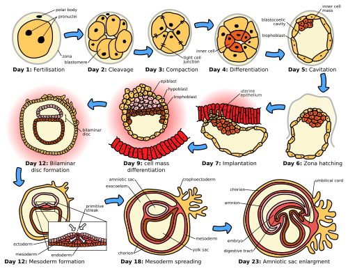

# DESENVOLVIMENTO EMBRIOLÓGICO

Para entender a obstetrícia de alto nível, você precisa dominar como a vida começa. Não se trata apenas de decorar nomes de estruturas, mas de entender a cronologia e a lógica por trás de cada processo. As bancas de residência médica, como a USP, a UNICAMP e as provas do Enare, adoram cobrar os pontos de transição, as malformações e, principalmente, a fisiologia da unidade fetoplacentária.

*Figura 1 - Diagrama das primeiras semanas da embriogênese humana: desde a fecundação na ampola tubária, passando pela clivagem (mórula e blastocisto), nidação no 6º dia, formação dos folhetos embrionários e fechamento do tubo neural. Fonte: Zephyris, CC BY-SA 3.0 | Wikimedia Commons*

## Fecundação e a Primeira Semana de Vida

Tudo começa na ampola da tuba uterina. É aqui que ocorre a fecundação. Um erro comum em provas é achar que o óvulo está "pronto". Na verdade, o que o espermatozoide encontra é um oócito secundário, que está estacionado na metáfase da segunda divisão meiótica. A meiose só se completa se houver a penetração do espermatozoide.

Após a união dos gametas, formamos o zigoto. A partir daí, iniciamos a clivagem, que ocorre enquanto o produto conceptual viaja pela tuba em direção ao útero. Ele passa pelo estágio de mórula (uma "amora" de células) e chega à cavidade uterina no estágio de blastocisto.

A nidação, ou implantação, ocorre aproximadamente no 6º dia após a fertilização. O blastocisto precisa estar "despido" da zona pelúcida para conseguir se ligar ao endométrio. Esse processo começa com a aposição, que é um contato frouxo, seguido pela adesão e invasão.

## O Trofoblasto e a Formação da Placenta

*Figura 2 - Ilustração da placenta madura mostrando a interface entre circulação materna e fetal. O córion frondoso forma a porção fetal enquanto a decídua basal forma a porção materna. O sinciciotrofoblasto produz hCG e permite as trocas gasosas e nutricionais. Fonte: OpenStax College, CC BY 3.0 | Wikimedia Commons*

O trofoblasto é a camada externa do blastocisto e será o grande responsável pela interface com a mãe. Ele se diferencia em duas camadas fundamentais:

- Citotrofoblasto: A camada interna, com células bem definidas, que funciona como uma "reserva" de células.

- Sinciciotrofoblasto: A camada externa, multinucleada, que invade o endométrio. É aqui que o hCG é produzido.

A placenta não é apenas um filtro, ela é um órgão endócrino e metabólico complexo. Para a prova, você deve lembrar que o córion frondoso (a parte vascularizada do córion em contato com a decídua basal) é o que efetivamente formará a placenta.

### A Barreira Placentária

Muitas questões perguntam quais camadas as substâncias precisam atravessar para sair do sangue materno e chegar ao fetal. No início da gestação, essa barreira é composta por quatro camadas: sinciciotrofoblasto, citotrofoblasto, tecido conjuntivo do vilo (mesênquima extraembrionário) e o endotélio do capilar fetal. Com o avançar da gravidez, essa barreira fica mais delgada para facilitar as trocas, mas a estrutura básica permanece.

### Mecanismos de Transporte Placentário

A placenta transporta substâncias de formas diferentes, e as bancas adoram trocar esses conceitos.

| Substância | Mecanismo de Transporte | Observação Clínica |
| --- | --- | --- |
| Oxigênio e CO2 | Difusão Simples | Depende do gradiente de pressão e fluxo sanguíneo. |
| Glicose | Difusão Facilitada | Utiliza transportadores GLUT1; não depende de insulina fetal. |
| Aminoácidos | Transporte Ativo | O feto mantém concentrações maiores que a mãe. |
| Imunoglobulinas (IgG) | Pinocitose | É a única que atravessa, conferindo imunidade passiva. |
| Água e Eletrólitos | Difusão Simples | Essencial para o equilíbrio do líquido amniótico. |

Como o Dr. Will sempre reforça, lembre-se que a glicose passa por difusão facilitada. Isso explica por que a hiperglicemia materna no diabetes gestacional leva diretamente à hiperglicemia fetal e, consequentemente, à macrossomia por hiperinsulinismo fetal.

## Endocrinologia da Gestação

A placenta não é autossuficiente. Ela trabalha em conjunto com a mãe e o feto na chamada unidade fetoplacentária.

### Progesterona e Estrogênios

A progesterona é essencial para manter o útero "quieto" (miométrio relaxado). Até a 7ª ou 8ª semana, o corpo lúteo ovariano é o principal produtor. Depois disso, ocorre a transição lúteo-placentária, e a placenta assume o comando.

Já os estrogênios (principalmente o estriol na gravidez) dependem de precursores androgênicos. A placenta não consegue produzir o precursor DHEA-S do zero. O feto produz DHEA-S em suas suprarrenais, que é sulfatado no fígado fetal e depois convertido em estriol pela placenta. Por isso, níveis muito baixos de estriol podem indicar sofrimento fetal ou anencefalia (onde a suprarrenal fetal é atrófica).

Cuidado com a aromatase placentária. Ela é uma enzima protetora. Se a mãe tiver um tumor ovariano produtor de andrógenos, a aromatase da placenta converte esses andrógenos em estrogênios, impedindo a virilização de um feto feminino.

## Circulação Fetal: O Coração do Problema

Este é, sem dúvida, um dos temas mais cobrados. A circulação fetal é projetada para priorizar o cérebro e o coração, órgãos que precisam de mais oxigênio.

Existem três "shunts" (desvios) fundamentais que você precisa conhecer:

- Ducto Venoso (de Arantius): Conecta a veia umbilical (que traz sangue oxigenado da placenta) à veia cava inferior. Ele permite que parte do sangue oxigenado "pule" o fígado e vá direto para o coração.

- Forame Oval: Uma abertura entre o átrio direito e o átrio esquerdo. O sangue oxigenado que vem da veia cava inferior é direcionado preferencialmente para o átrio esquerdo através deste orifício.

- Ducto Arterioso (ou Canal Arterial): Conecta a artéria pulmonar à aorta. Como o pulmão fetal está colapsado e tem alta resistência, o sangue que sai do ventrículo direito é desviado para a aorta descendente.

Na prova, lembre-se da sequência: Veia umbilical (sangue mais oxigenado do sistema) -> Ducto venoso -> Veia cava inferior -> Átrio direito -> Forame oval -> Átrio esquerdo -> Ventrículo esquerdo -> Aorta (cérebro e coronárias).

Após o nascimento, a queda da resistência vascular pulmonar e o fechamento desses shunts transformam a circulação em série, como a do adulto. O ducto venoso vira o ligamento venoso, e a veia umbilical vira o ligamento redondo do fígado.

## Diferenciação Sexual e Genitália

Este tópico exige que você entenda a "regra do silêncio". O fenótipo padrão do ser humano é o feminino. Para ser masculino, é necessário um esforço ativo do sistema.

### O Papel do Gene SRY

Localizado no braço curto do cromossomo Y, o gene SRY é o interruptor mestre. Se ele estiver presente, a gônada indiferenciada se torna testículo por volta da 7ª semana. Se ausente, a gônada se torna ovário por volta da 12ª semana.

O testículo fetal produz duas substâncias cruciais:

- Hormônio Antimülleriano (AMH): Produzido pelas células de Sertoli, causa a regressão dos ductos paramesonéfricos (Müller).

- Testosterona: Produzida pelas células de Leydig, mantém e desenvolve os ductos mesonéfricos (Wolff).

### Ductos de Müller vs. Ductos de Wolff

Aqui está a pegadinha clássica:

- Ductos de Müller (Paramesonéfricos): Originam as tubas uterinas, o útero e os 2/3 superiores da vagina.

- Ductos de Wolff (Mesonéfricos): Originam o epidídimo, o ducto deferente e as vesículas seminais. Na mulher, eles regridem (podendo deixar resquícios como os cistos de Gartner).

Se um feto tem cariótipo 46,XY mas tem uma mutação no receptor de andrógenos (Insensibilidade Androgênica), ele terá testículos (porque tem SRY), não terá útero (porque o AMH funcionou), mas terá genitália externa feminina (porque a testosterona não agiu).

### Genitália Externa

Até a 9ª semana, a genitália é bipotente. A diferenciação masculina depende da Di-hidrotestosterona (DHT), que é convertida da testosterona pela enzima 5-alfa-redutase. Sem DHT, a genitália externa será feminina, independentemente do cariótipo.

| Estrutura Indiferenciada | Derivado Masculino | Derivado Feminino |
| --- | --- | --- |
| Tubérculo Genital | Glande do Pênis | Clitóris |
| Pregas Urogenitais | Corpo do Pênis (uretra peniana) | Pequenos Lábios |
| Túmulos Labioescrotais | Escroto | Grandes Lábios |
| Seio Urogenital | Próstata e Uretra | Uretra e 1/3 inferior da vagina |

Um exemplo clínico importante é a Síndrome de Mayer-Rokitansky-Kuster-Hauser. Nela, ocorre uma agenesia dos ductos de Müller. A paciente é 46,XX, tem ovários normais e caracteres sexuais secundários normais, mas não tem útero nem a parte superior da vagina. É uma causa importante de amenorreia primária.

## Desenvolvimento do Sistema Nervoso e Tubo Neural

A formação do tubo neural (neurulação) ocorre muito cedo, entre a 3ª e a 4ª semana pós-fecundação. O fechamento começa no meio e caminha para as extremidades.

- O não fechamento do neuróporo cranial (anterior) resulta em anencefalia.

- O não fechamento do neuróporo caudal (posterior) resulta em espinha bífida ou mielomeningocele.

A pérola de prova aqui é a prevenção: o uso de ácido fólico no período periconcepcional (idealmente 3 meses antes de engravidar) reduz drasticamente esses defeitos. Em pacientes de baixo risco, a dose é 0,4 mg/dia. Em pacientes de alto risco (filho anterior com defeito de tubo neural ou uso de anticonvulsivantes), a dose sobe para 4 mg/dia.

## Sistema Gastrointestinal e Renal

No sistema GI, o conceito mais cobrado é o do ducto onfalomesentérico (ou ducto vitelino), que conecta o intestino médio à vesícula vitelínica. O remanescente mais comum desse ducto é o Divertículo de Meckel. Se você vir uma questão sobre sangramento intestinal indolor em uma criança pequena, pense nisso.

Quanto ao sistema renal, o rim definitivo é o metanefro. Ele surge da interação entre o broto ureteral (que forma o sistema coletor: ureter, pelve, cálices) e o blastema metanéfrico (que forma os néfrons). Qualquer falha nessa "conversa" entre as duas estruturas resulta em agenesia renal ou rins multicísticos.

## Teratogênese e Períodos Críticos

Nem todo momento da gravidez é igual perante um agente teratogênico.

- Período de "Tudo ou Nada" (1ª e 2ª semanas): O dano ou mata o embrião ou ele se recupera totalmente, pois as células ainda são totipotentes.

- Período Embrionário (3ª a 8ª semana): É a fase de intensa organogênese. É o período de maior sensibilidade para malformações estruturais maiores.

- Período Fetal (9ª semana em diante): O foco é crescimento e maturação funcional. Teratógenos aqui causam restrição de crescimento ou danos funcionais (como no sistema nervoso central).

Um exemplo clássico de prova é o Diabetes Pré-gestacional descontrolado. Ele está associado à Síndrome de Regressão Caudal, uma malformação raríssima na população geral, mas muito específica de mães diabéticas que engravidam com hemoglobina glicada alta.

### Classificação de Risco de Fármacos (FDA)

Embora a classificação por letras esteja sendo substituída por textos explicativos, as bancas ainda amam as categorias:

- Categoria A: Estudos controlados em humanos não mostram risco.

- Categoria B: Estudos em animais não mostram risco, mas não há estudos em humanos; OU estudos em animais mostram risco, mas estudos em humanos não confirmaram.

- Categoria C: Estudos em animais mostram risco e não há estudos em humanos. Usar apenas se o benefício superar o risco.

- Categoria D: Evidência de risco em humanos, mas o benefício pode ser aceitável em situações de vida ou morte.

- Categoria X: Risco fetal comprovado que ultrapassa qualquer benefício. Contraindicação absoluta. Exemplo: Estradiol, Danazol, Isotretinoína, Metotrexato.

## Desenvolvimento Pulmonar e Maturação

O pulmão é um dos últimos órgãos a ficar pronto. O desenvolvimento passa pelas fases pseudoglandular, canalicular, sacular e alveolar.
A fase canalicular (16-26 semanas) é crítica porque é quando surgem os bronquíolos respiratórios e a vascularização aumenta. A partir de 24-25 semanas, começamos a ter pneumócitos tipo II produzindo surfactante, o que marca o limite da viabilidade fetal.

A maturação pulmonar com corticoides (Betametasona ou Dexametasona) é indicada entre 24 e 34 semanas em casos de risco de parto prematuro, para acelerar a produção desse surfactante e reduzir a Síndrome do Desconforto Respiratório.

## Pontos-Chave para Prova

- Fecundação ocorre na ampola da tuba; o oócito está parado na Metáfase II.

- Nidação ocorre no estágio de blastocisto, cerca de 6 dias após a fecundação.

- O hCG é produzido pelo sinciciotrofoblasto.

- A segunda onda de migração trofoblástica ocorre entre 12 e 16 semanas, remodelando as artérias espiraladas para garantir baixo fluxo e alta capacitância.

- Circulação fetal: a veia umbilical tem a maior saturação de oxigênio; o ducto venoso desvia o sangue do fígado.

- Ductos de Müller formam útero, tubas e 2/3 superiores da vagina.

- Ductos de Wolff formam epidídimo, ducto deferente e vesículas seminais.

- A diferenciação da genitália externa masculina exige DHT (via 5-alfa-redutase).

- Síndrome de Turner (45,X): causa mais comum de disgenesia gonadal e amenorreia primária com baixa estatura.

- Ácido fólico: 0,4 mg para prevenção primária de defeitos do tubo neural.

- Divertículo de Meckel: remanescente do ducto onfalomesentérico.

- Diabetes pré-gestacional: associado à Síndrome de Regressão Caudal.

- O metanefro é o rim definitivo.

- Aromatase placentária: protege fetos femininos da virilização por andrógenos maternos.

- O estriol placentário depende do precursor DHEA-S produzido pela suprarrenal do feto.

- Contraindicação absoluta (Categoria X): Danazol, Estrogênios, Estatinas, Isotretinoína.

- O trofoblasto se divide em citotrofoblasto (interno) e sinciciotrofoblasto (externo).

- USG inicial: Saco gestacional (4-5 sem), Vesícula vitelínica (5 sem), Embrião com BCF (6-7 sem). 🚀

 Cópia offline para consulta pessoal.
 Fonte original:
 [https://www.medevo.com.br/material-apoio/ler/4b7fdab8-1f17-46b9-b2a1-8d7f7e6ef9ea](https://www.medevo.com.br/material-apoio/ler/4b7fdab8-1f17-46b9-b2a1-8d7f7e6ef9ea)
