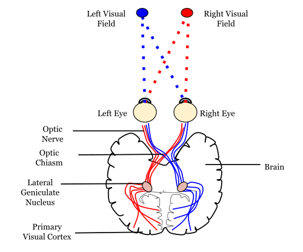
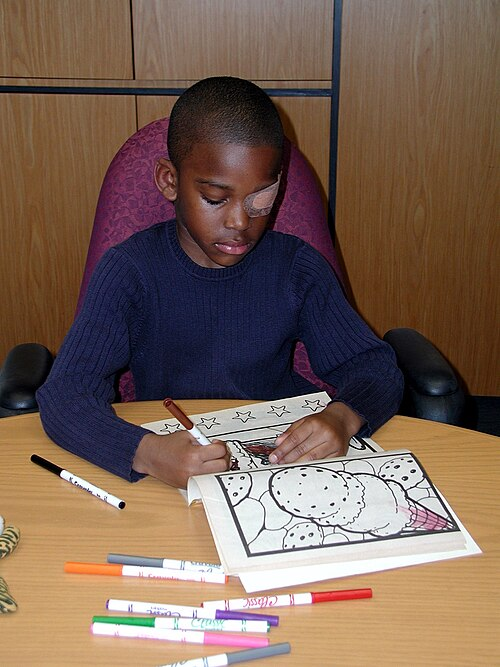

# DESENVOLVIMENTO VISUAL E AMBLIOPIA

Para entender ambliopia, você precisa primeiro esquecer a ideia de que o olho é um órgão isolado. O olho é apenas o captador de luz. Quem "enxerga", de fato, é o cérebro, especificamente o córtex visual primário. Se você entender que a ambliopia é uma falha no desenvolvimento cortical e não uma doença estrutural do olho, você já saiu na frente de 80% dos candidatos.

*Figura 1 - Diagrama da via visual: a informação deixa o olho pelo nervo óptico, cruza parcialmente no quiasma óptico, segue pelo trato óptico até o núcleo geniculado lateral, e irradia para o córtex visual primário (V1). É no córtex que realmente "enxergamos". Fonte: Mads00, CC BY-SA 4.0 | Wikimedia Commons*

## O Conceito de Período Crítico

*Figura 2 - Criança utilizando tampão oclusivo (eyepatch) no olho sadio para tratamento da ambliopia. O objetivo é forçar o uso do olho ambliope durante o período crítico de plasticidade neural (até 7-8 anos), permitindo o desenvolvimento das conexões corticais. Fonte: National Eye Institute/NIH, Domínio Público | Wikimedia Commons*

O desenvolvimento visual não acontece por acaso. Ele depende de um estímulo luminoso nítido e binocular chegando ao cérebro desde o nascimento. O período em que o cérebro está "aberto" para aprender a enxergar é o que chamamos de período crítico ou período de plasticidade neural.

Na espécie humana, esse período é mais intenso nos primeiros 2 a 3 anos de vida, mas se estende, com menor intensidade, até os 7 ou 8 anos. Alguns estudos sugerem plasticidade residual até os 12 anos ou mais, mas, para fins de prova de residência, guarde o marco dos 7 anos como o limite clássico para o tratamento eficaz.

Por que isso é importante? Porque se houver um obstáculo à visão (uma catarata, um estrabismo ou um grau alto) durante esse período e não o corrigirmos a tempo, as conexões sinápticas no córtex visual não se formam adequadamente. O cérebro simplesmente "aprende" a não ver por aquele olho. Depois que o período crítico fecha, não adianta mais operar a catarata ou colocar óculos, o cérebro já se moldou daquela forma. É por isso que a ambliopia é a maior causa de baixa visão monocular em crianças e adultos jovens.

## Desenvolvimento Visual Normal: Marcos Cronológicos

Muitos alunos erram questões simples por não saberem o que é normal para cada idade. Um recém-nascido não enxerga 20/20, e isso não é patológico. É uma imaturidade foveal e das vias ópticas.

Ao nascimento, a acuidade visual é muito baixa, em torno de 20/400 a 20/600. A criança apresenta fixação rudimentar.

Aos 2 a 3 meses, ocorre um marco fundamental: a fixação se torna estável e a criança passa a fazer o seguimento ocular (follow). Se um bebê de 4 meses não fixa e não segue objetos, você deve obrigatoriamente investigar uma causa orgânica.

Aos 6 meses, a fóvea está mais madura e a estereopsia (visão de profundidade) começa a se desenvolver de forma robusta. É aqui que o alinhamento ocular deve estar consolidado. Cuidado: um desvio ocular intermitente pode ser aceitável até os 4 meses, mas após os 6 meses, qualquer estrabismo é patológico.

A acuidade visual atinge níveis de adulto (20/20) por volta dos 5 a 7 anos de idade, dependendo do método de aferição utilizado.

### Tabela 1: Marcos do Desenvolvimento Visual

| Idade | Acuidade Visual Esperada (Snellen equivalente) | Comportamento Visual |
| --- | --- | --- |
| Recém-nascido | 20/400 a 20/600 | Reflexo fotomotor, pisca para luz forte |
| 2-3 meses | 20/150 a 20/200 | Fixa e segue objetos, contato visual |
| 6 meses | 20/50 a 20/100 | Início da estereopsia, alinhamento ocular estável |
| 1 ano | 20/40 a 20/60 | Coordenação olho-mão bem desenvolvida |
| 4-5 anos | 20/20 a 20/30 | Desenvolvimento visual quase completo |

## Definição e Critérios de Ambliopia

A ambliopia é definida como a redução da acuidade visual em um ou ambos os olhos, causada por uma experiência visual anormal durante o período crítico, que não pode ser explicada por anomalias estruturais do globo ocular ou das vias ópticas detectáveis ao exame físico imediato.

Em termos práticos e para provas, os critérios diagnósticos são:

- Diferença de acuidade visual entre os olhos de 2 linhas ou mais na tabela de Snellen (ex: 20/20 no olho direito e 20/40 no esquerdo).

- Acuidade visual pior que 20/30 em qualquer um dos olhos em crianças acima de 4-5 anos.

Lembre-se: a ambliopia é um diagnóstico de exclusão. Você primeiro garante que o olho é estruturalmente normal (não tem catarata, não tem cicatriz de coriorretinite por toxoplasmose, não tem glaucoma congênito) e depois diagnostica a ambliopia. No entanto, essas patologias podem ser a causa da ambliopia por privação, como veremos adiante.

## Fisiopatologia: A Competição Sináptica

Por que o cérebro "desliga" um olho? Imagine o córtex visual como um terreno onde dois exércitos (os estímulos de cada olho) lutam por espaço. Se os dois olhos enviam imagens nítidas e alinhadas, eles dividem o território de forma equilibrada.

Se um olho envia uma imagem borrada (erro refracional) ou uma imagem que não funde com a do outro olho (estrabismo), o cérebro sofre uma confusão sensorial. Para resolver isso, o córtex visual utiliza um mecanismo de plasticidade chamado supressão. O cérebro passa a ignorar o estímulo do olho "ruim" para privilegiar o olho "bom". Com o tempo, as colunas de dominância ocular no córtex visual que deveriam responder ao olho ruim são "invadidas" pelos neurônios do olho bom. É um processo de competição sináptica.

## Classificação da Ambliopia

As bancas adoram cobrar as causas, e você precisa saber diferenciá-las porque a conduta muda.

### 1. Ambliopia Estrábica

É a forma mais comum. Ocorre quando os eixos visuais não estão paralelos. O cérebro recebe duas imagens diferentes (diplopia). Como a criança tem muita plasticidade, ela suprime a imagem do olho desviado para evitar a visão dupla.

Atenção: a esotropia (desvio para dentro) causa ambliopia com muito mais frequência e gravidade do que a exotropia (desvio para fora). Isso ocorre porque a exotropia costuma ser intermitente no início, permitindo períodos de binocularidade.

### 2. Ambliopia Refracional (Anisometrópica e Isometrópica)

Aqui o problema não é o alinhamento, mas o foco.

A **Ambliopia Anisometrópica** ocorre quando há uma diferença de grau significativa entre os dois olhos. O cérebro recebe uma imagem nítida de um olho e uma borrada do outro. Ele escolhe a nítida e suprime a borrada. É a forma mais perigosa porque o olho é esteticamente "direitinho" (não desvia), então os pais não percebem o problema até que a criança faça um exame de rotina.

A **Ambliopia Isometrópica** é menos comum e ocorre quando ambos os olhos têm graus muito elevados e semelhantes. A criança nunca viu nada nítido na vida. A baixa visual é bilateral e geralmente menos profunda que na anisometropia.

### Tabela 2: Limites Refracionais para Risco de Ambliopia (Diretriz CBO)

| Tipo de Erro Refracional | Anisometropia (Diferença entre olhos) | Isometropia (Grau em ambos os olhos) |
| --- | --- | --- |
| Hipermetropia | > 1.00 Dioptria | > 5.00 Dioptrias |
| Astigmatismo | > 1.50 Dioptrias | > 2.50 Dioptrias |
| Miopia | > 3.00 Dioptrias | > 8.00 Dioptrias |

*Dica do Dr. Will: Note que a tolerância para hipermetropia é muito menor na anisometropia. Isso ocorre porque a criança consegue acomodar para compensar a hipermetropia, mas ela só consegue acomodar uma quantidade fixa para os dois olhos ao mesmo tempo. Se um olho precisa de +1 e o outro de +4, ao acomodar para o de +1, o de +4 continua borrado.*

### 3. Ambliopia por Privação (Ex-anopsia)

É a forma mais grave e precoce. Algo impede fisicamente a luz de chegar à retina. Exemplos clássicos: catarata congênita, ptose palpebral severa (que cobre a pupila) e opacidades corneanas. Se uma catarata congênita total não for operada nas primeiras semanas de vida (idealmente antes das 6 a 8 semanas), a ambliopia será profunda e possivelmente irreversível.

## Diagnóstico Clínico e Exame Físico

O diagnóstico em crianças pré-verbais é um desafio que exige técnica. Você não pode perguntar "que letra é essa?", então você busca sinais indiretos.

### Avaliação do Comportamento de Fixação

Utilizamos o teste de "Fixa, Mantém e Segue" (FMS).

- Se a criança oclui um olho e chora ou afasta a mão do examinador, mas aceita a oclusão do outro olho tranquilamente, você tem um forte indício de ambliopia no olho que ela não quer que fique aberto.

- O teste de fixação com prisma de 10 dioptrias também é usado para avaliar a preferência ocular em casos de estrabismo.

### Teste do Reflexo Vermelho (Teste do Pezinho Ocular)

Obrigatório em todo recém-nascido. Se o reflexo estiver ausente, assimétrico ou com manchas brancas (leucocoria), você está diante de uma urgência oftalmológica. A principal causa de ambliopia por privação detectável aqui é a catarata congênita, mas o diagnóstico diferencial inclui o retinoblastoma (tumor intraocular mais comum da infância).

### Medida da Acuidade Visual

- **Cartões de Teller (Olhar Preferencial):** Usado em bebês. Baseia-se no fato de que bebês preferem olhar para padrões listrados do que para superfícies lisas.

- **Optotipos de Figuras (Lea Symbols, Allen):** Usado em crianças de 2 a 4 anos.

- **Tabela de Snellen (Letras ou "E" de Snellen):** Usado a partir dos 5 anos.

### Exame de Refração sob Cicloplegia

Este é o ponto onde muitos alunos de medicina e residentes de pediatria falham. Toda criança com suspeita de ambliopia ou estrabismo **deve** ser submetida a refração com colírio ciclopégico (geralmente Ciclopentolato ou Atropina).

Por que? Porque a criança tem um poder de acomodação gigantesco. Se você não "congelar" o músculo ciliar, você nunca saberá o grau real dela. Ela pode esconder uma hipermetropia de +6.00 fingindo que é 0.00 através da acomodação. No MedEvo, sempre reforçamos: em pediatria, refração sem cicloplegia não tem valor diagnóstico.

## Tratamento: O Pilar da Oclusão

O tratamento da ambliopia baseia-se em dois passos sequenciais e obrigatórios. Não pule etapas.

### Passo 1: Correção da Causa Primária (Tratamento Óptico)

Se a criança tem um erro refracional, o primeiro passo é dar os óculos com o grau correto. Surpreendentemente, cerca de 25 a 30% das ambliopias resolvem apenas com o uso constante dos óculos por um período de 12 a 18 semanas. Isso é o que chamamos de "adaptação refracional".

Se houver catarata, ela deve ser operada primeiro. Se houver ptose, ela deve ser corrigida.

### Passo 2: Penalização do Olho Bom (Oclusão)

Se após o uso dos óculos a acuidade visual ainda estiver desigual, iniciamos a oclusão (tampão) do olho de melhor visão. O objetivo é forçar o cérebro a usar o olho amblíope, estimulando a plasticidade cortical.

**Dose da Oclusão (Baseado nos estudos PEDIG):**
Antigamente, fazíamos oclusão "full-time" (o dia todo). Hoje, os estudos do grupo PEDIG (Pediatric Eye Disease Investigator Group) mostraram que:

- Para ambliopia moderada (20/40 a 20/80): 2 horas de oclusão por dia são tão eficazes quanto 6 horas.

- Para ambliopia grave (20/100 a 20/400): 6 horas de oclusão por dia são tão eficazes quanto a oclusão de tempo integral.

Isso mudou a adesão ao tratamento, pois é muito mais fácil convencer uma criança a usar o tampão por 2 horas enquanto faz uma atividade prazerosa (desenhar, jogar videogame) do que o dia inteiro na escola sofrendo bullying.

### Passo 3: Penalização Farmacológica (Atropina)

E se a criança não aceita o tampão de jeito nenhum? Usamos a penalização farmacológica. Pingamos uma gota de Atropina 1% no **olho bom**.
A Atropina causa midríase (dilatação da pupila) e cicloplegia (paralisia da acomodação). Isso faz com que a visão de perto do olho bom fique borrada. O cérebro, então, prefere usar o olho amblíope para atividades de perto.

Estudos mostram que o uso de Atropina apenas nos fins de semana é tão eficaz quanto o uso diário para casos de ambliopia moderada.

### Tabela 3: Oclusão vs. Atropina

| Característica | Oclusão (Tampão) | Penalização com Atropina |
| --- | --- | --- |
| Mecanismo | Barreira física ao estímulo | Borramento óptico por cicloplegia |
| Indicação | Qualquer nível de ambliopia | Preferencialmente ambliopia moderada |
| Vantagem | Resultado mais rápido em alguns casos | Melhor adesão, menos estigma social |
| Desvantagem | Irritação cutânea, resistência da criança | Fotofobia, risco de toxicidade sistêmica |
| Eficácia Final | Equivalentes em longo prazo | Equivalentes em longo prazo |

## Diagnóstico Diferencial: As Armadilhas

Nem tudo que não enxerga é ambliopia. Você deve estar atento aos sinais de alerta que sugerem patologia orgânica.

- **Leucocoria (Pupila Branca):** Se você vê um reflexo branco, pense em Catarata Congênita, Retinoblastoma, Persistência da Vasculatura Fetal ou Doença de Coats.

- **Nistagmo:** Se a criança tem movimentos oculares oscilatórios desde cedo, isso sugere uma baixa visual bilateral profunda de origem sensorial (ex: hipoplasia de nervo óptico ou acromatopsia).

- **Baixa Visual que não melhora com tratamento:** Se você está tratando uma "ambliopia" há 6 meses com tampão e não há ganho de nenhuma linha de visão, pare e peça uma Ressonância de crânio e órbitas ou um ERG (Eletrorretinograma). Pode ser um glioma de via óptica ou uma distrofia retiniana.

### Tabela 4: Diagnóstico Diferencial de Baixa Acuidade Visual na Infância

| Patologia | Sinais Distintivos | Conduta Imediata |
| --- | --- | --- |
| Ambliopia | Olho estruturalmente normal, história de estrabismo/grau | Óculos + Oclusão |
| Catarata Congênita | Reflexo vermelho ausente ou alterado, leucocoria | Cirurgia urgente |
| Retinoblastoma | Leucocoria, estrabismo, massa esbranquiçada na retina | Encaminhamento oncológico |
| Hipoplasia de Nervo Óptico | Disco óptico pequeno, sinal do duplo anel | Investigação de eixo hipofisário |
| Glaucoma Congênito | Buftalmo (olho grande), lacrimejamento, fotofobia | Cirurgia (Goniotomia) |

## Complicações e Prognóstico

A maior complicação do tratamento da ambliopia é a **Ambliopia Reversa**. Isso acontece quando ocluímos demais o olho bom e ele acaba se tornando amblíope por privação. Por isso, o acompanhamento deve ser frequente. Uma regra prática é: a criança deve ser vista a cada "X" meses, onde "X" é a idade em anos (ex: criança de 2 anos, retorno a cada 2 meses).

O prognóstico depende de três fatores:

- **Idade de início do tratamento:** Quanto mais cedo, melhor. Resultados após os 10-12 anos são muito pobres.

- **Causa:** Ambliopias anisometrópicas têm melhor prognóstico que as estrábicas, que por sua vez são melhores que as de privação.

- **Adesão:** Este é o fator número um. O tratamento da ambliopia é feito pelos pais, não pelo médico.

## Situações Especiais e Pegadinhas de Prova

### O Estrabismo Causa Ambliopia ou a Ambliopia Causa Estrabismo?

Os dois. Um estrabismo primário leva à supressão e ambliopia. Por outro lado, qualquer olho que enxergue mal (por uma cicatriz ou catarata) perde a capacidade de fusão e acaba desviando. Em crianças, o desvio sensorial costuma ser para dentro (esotropia), enquanto em adultos costuma ser para fora (exotropia).

### Cirurgia de Estrabismo Cura Ambliopia?

**Não.** Esta é uma pegadinha clássica. A cirurgia de estrabismo serve para alinhar os olhos e tentar recuperar a binocularidade (estereopsia), mas ela não melhora a acuidade visual do olho amblíope. O tratamento da ambliopia (tampão) deve ser feito, preferencialmente, **antes** da cirurgia de estrabismo. Por que? Porque se você opera um olho que não enxerga, a chance de ele desviar de novo (perda de alinhamento por falta de estímulo) é enorme.

### O Uso de Videogames no Tratamento

Estudos recentes (PEDIG) investigaram se jogar videogames específicos durante a oclusão ou o uso de óculos binoculares (shutter glasses) ajudaria. Até o momento, a conclusão é que o tratamento binocular não se mostrou superior à oclusão clássica nas diretrizes vigentes, embora seja uma área promissora de pesquisa.

## Pontos-Chave para Prova

- **Definição:** Diferença de acuidade visual ≥ 2 linhas entre os olhos ou visão < 20/30 em um dos olhos.

- **Período Crítico:** Vai do nascimento até aproximadamente os 7 a 8 anos de idade.

- **Causa mais comum:** Estrabismo (especialmente esotropia).

- **Causa mais grave:** Privação (ex: catarata congênita).

- **Causa mais negligenciada:** Anisometropia (olhos alinhados, mas com graus diferentes).

- **Refração Obrigatória:** Sempre sob cicloplegia (Ciclopentolato é o padrão).

- **Tratamento Inicial:** Correção do erro refracional (óculos) por 12 a 18 semanas.

- **Dose de Oclusão Moderada:** 2 horas/dia (tão eficaz quanto 6h).

- **Dose de Oclusão Grave:** 6 horas/dia (tão eficaz quanto tempo integral).

- **Atropina:** Usada no olho BOM para penalização farmacológica; eficaz em casos moderados.

- **Ambliopia Reversa:** Risco de ocluir demais o olho bom e ele perder visão.

- **Cirurgia de Estrabismo:** Não trata a ambliopia; o tampão deve vir antes.

- **Teste do Reflexo Vermelho:** Principal triagem para causas de privação e tumores.

- **Leucocoria:** Diagnóstico diferencial inclui catarata, retinoblastoma e doença de Coats.

- **FMS (Fixa, Mantém e Segue):** Principal método de avaliação em crianças pré-verbais.

- **Limites de Anisometropia:** Hipermetropia > 1.00D, Astigmatismo > 1.50D, Miopia > 3.00D.

- **Fim da Plasticidade:** Após os 12 anos, o tratamento raramente tem sucesso significativo. 👁️

 Cópia offline para consulta pessoal.
 Fonte original:
 [https://www.medevo.com.br/material-apoio/ler/eea281ba-d5c4-4e7e-9632-254f782471e5](https://www.medevo.com.br/material-apoio/ler/eea281ba-d5c4-4e7e-9632-254f782471e5)
