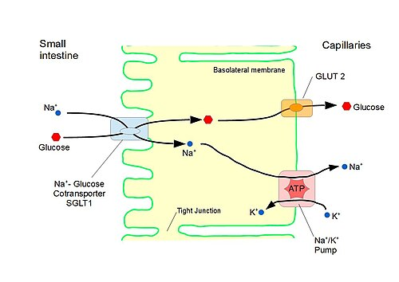

# DESIDRATAÇÃO NA GECA: TERAPIA DE REIDRATAÇÃO ORAL E HIDRATAÇÃO VENOSA

Na gastroenterite aguda (GECA), a conduta mais importante não é descobrir o agente etiológico, mas classificar corretamente o estado de hidratação.

A diarreia aguda é definida por aumento do número de evacuações e/ou redução da consistência das fezes, com duração de até 14 dias. Acima disso, passa a ser diarreia persistente. Na prática e nas provas, a decisão inicial depende de três perguntas:

- Há sinais de desidratação?

- A criança consegue beber?

- Há sinais de desidratação grave ou choque?

*Figura 1 - Mecanismo do cotransportador sódio-glicose (SGLT1) no intestino delgado. A glicose "arrasta" o sódio para dentro da célula, e o sódio, por osmose, "arrasta" a água. Este é o princípio fisiológico que torna a TRO tão eficaz. Fonte: Sugarmaster, CC0 | Wikimedia Commons*

## Por que a terapia de reidratação oral funciona?

A terapia de reidratação oral (TRO) funciona porque o cotransportador sódio-glicose (SGLT1) permanece ativo na maior parte dos quadros de diarreia infecciosa. Quando o soro de reidratação oral (SRO) oferece glicose e sódio em proporções adequadas, ocorre absorção conjunta de sódio, glicose e água.

Por isso, SRO não é o mesmo que água, suco, refrigerante ou bebida esportiva. Bebidas muito açucaradas podem aumentar a osmolaridade no lúmen intestinal e piorar a diarreia osmótica.

*Figura 2 - Paciente recebendo soro de reidratação oral (SRO). Mesmo pacientes com vômitos frequentes podem ser tratados com pequenos volumes frequentes. Fonte: CDC Public Health Image Library, Domínio Público | Wikimedia Commons*

## Avaliação do estado de hidratação

A classificação é clínica. Em geral, exames laboratoriais não são necessários para decidir entre Plano A, B ou C.

| Avaliação | Plano A: sem desidratação | Plano B: com desidratação | Plano C: desidratação grave |
| --- | --- | --- | --- |
| Estado geral | Ativo, alerta | Irritado, intranquilo | Letárgico, hipotônico, inconsciente ou comatoso |
| Olhos | Sem alteração | Fundos | Fundos |
| Sede | Sem sede | Sedento, bebe rápido e avidamente | Incapaz de beber |
| Lágrimas | Presentes | Ausentes | Ausentes |
| Boca/língua | Úmida | Seca ou levemente seca | Muito seca |
| Prega abdominal | Desaparece imediatamente | Desaparece lentamente | Desaparece muito lentamente, mais de 2 segundos |
| Pulso | Cheio | Cheio | Fraco ou ausente |

A classificação exige dois ou mais sinais da categoria. Para desidratação grave, deve haver pelo menos dois sinais, sendo um deles de maior gravidade, como alteração importante do estado geral, incapacidade de beber ou pulso fraco/ausente. Se houver dúvida entre dois planos, escolha o mais grave.

## Plano A: sem desidratação

Indicado para criança com diarreia, mas sem sinais clínicos de desidratação. O tratamento é domiciliar, com orientação clara de retorno.

Condutas principais:

- Oferecer mais líquidos que o habitual, incluindo SRO após evacuações diarreicas e vômitos.

- Manter alimentação habitual.

- Manter aleitamento materno.

- Orientar preparo correto do SRO: 1 envelope em 1 litro de água filtrada ou fervida, sem fracionar o envelope.

- Prescrever zinco quando indicado.

- Orientar sinais de alerta.

Volume de SRO após cada perda:

| Idade | Volume após cada evacuação diarreica ou vômito |
| --- | --- |
| Menores de 1 ano | 50 a 100 mL |
| 1 a 10 anos | 100 a 200 mL |
| Maiores de 10 anos | Quanto aceitar |

Evitar refrigerantes e bebidas muito açucaradas. Chás e sucos, se usados, não devem ser adoçados.

## Plano B: com desidratação, mas sem gravidade

Indicado quando há sinais de desidratação, mas a criança está consciente e consegue ingerir líquidos.

A conduta é TRO supervisionada na unidade de saúde:

- SRO em pequenos volumes, de forma frequente e contínua.

- Estimativa habitual: 50 a 100 mL/kg em 4 a 6 horas.

- Reavaliar repetidamente.

- Quando desaparecerem os sinais de desidratação, retornar ao Plano A.

Se houver vômitos, não se deve abandonar a TRO de imediato. Aguardar cerca de 10 minutos e reiniciar com volumes menores e mais frequentes, preferencialmente com colher ou copo.

A ondansetrona pode ser usada em dose única quando os vômitos persistentes dificultam a TRO, com cautela em lactentes. Doses usuais:

| Faixa etária/peso | Dose |
| --- | --- |
| 6 meses a 2 anos | 2 mg |
| Maiores de 2 a 10 anos, até 30 kg | 4 mg |
| Maiores de 10 anos ou acima de 30 kg | 8 mg |

Se a criança continuar desidratada e com baixa aceitação oral, pode-se usar sonda nasogástrica para gastróclise. Se evoluir com sinais de desidratação grave, passa para o Plano C.

## Plano C: desidratação grave

O Plano C é indicado para desidratação grave, incapacidade de ingerir líquidos, alteração importante do estado geral ou sinais de choque hipovolêmico. A criança deve receber hidratação venosa e ser encaminhada ou mantida em serviço com capacidade de monitorização.

### Fase rápida

Usar soro fisiológico 0,9% ou Ringer lactato.

| Faixa etária | Volume e tempo |
| --- | --- |
| Menores de 1 ano | 30 mL/kg em 1 hora, depois 70 mL/kg em 5 horas |
| Maiores de 1 ano | 30 mL/kg em 30 minutos, depois 70 mL/kg em 2 horas e 30 minutos |
| Recém-nascidos e menores de 5 anos com cardiopatia grave | 10 mL/kg, com reavaliação clínica cuidadosa |

Reavaliar frequentemente perfusão, pulso, nível de consciência, diurese e sinais de hidratação. Se persistirem sinais de choque, repetir a fase rápida conforme avaliação clínica.

Assim que a criança conseguir beber, iniciar SRO em pequenos volumes, mesmo durante a hidratação venosa. A hidratação venosa deve ser suspensa quando o paciente estiver hidratado, tolerando SRO e sem vômitos importantes.

### Manutenção e reposição

Após correção da desidratação, calcular manutenção pela regra de Holliday-Segar:

| Peso | Volume de manutenção em 24 horas |
| --- | --- |
| Até 10 kg | 100 mL/kg/dia |
| 10 a 20 kg | 1.000 mL + 50 mL/kg para cada kg acima de 10 |
| Acima de 20 kg | 1.500 mL + 20 mL/kg para cada kg acima de 20, máximo de 2.000 mL/dia |

Na prescrição venosa, o Ministério da Saúde orienta manutenção com SG 5% + SF 0,9% na proporção 4:1 e reposição com SG 5% + SF 0,9% na proporção 1:1, ajustando conforme perdas. O potássio só deve ser acrescentado após diurese documentada.

## Zinco

O zinco reduz a duração e a gravidade do episódio diarreico e diminui recorrência nos meses seguintes.

| Idade | Dose |
| --- | --- |
| Menores de 6 meses | 10 mg/dia por 10 a 14 dias |
| 6 meses a 5 anos | 20 mg/dia por 10 a 14 dias |

## Alimentação

Não se faz "repouso intestinal" na GECA.

- Manter aleitamento materno.

- Manter alimentação habitual conforme aceitação.

- Fórmula infantil não deve ser suspensa de rotina.

- Dietas muito restritivas não aceleram a recuperação e podem piorar o estado nutricional.

Fórmula sem lactose só deve ser considerada em situações selecionadas, como diarreia prolongada com sinais sugestivos de intolerância secundária à lactose.

## Distúrbios hidroeletrolíticos e ácido-básicos

A maioria dos casos de desidratação por GECA é isonatrêmica, mas podem ocorrer hiponatremia ou hipernatremia.

Alterações importantes:

- Acidose metabólica: comum na desidratação grave, por perda fecal de bicarbonato e hipoperfusão tecidual.

- Hipocalemia: pode ocorrer por perdas fecais; suspeitar se fraqueza, íleo paralítico ou alterações eletrocardiográficas.

- Hiponatremia: pode ocorrer quando a reposição é feita apenas com água, chás ou soluções muito hipotônicas.

- Hipernatremia: exige correção cuidadosa, evitando redução rápida do sódio.

Na acidose metabólica, a compensação esperada é hiperventilação com queda do CO2, e não acidose respiratória.

## Antibióticos

A maioria das GECA em pediatria é viral e autolimitada. Antibiótico não é rotina.

Considerar antibioticoterapia em situações específicas:

- Disenteria com comprometimento do estado geral, febre alta persistente, dor abdominal, tenesmo ou sinais sistêmicos.

- Suspeita de cólera com desidratação importante.

- Imunossupressão, desnutrição grave ou maior risco de doença bacteriana invasiva.

- Giardíase ou amebíase com confirmação ou forte suspeita clínica.

Na disenteria em crianças pequenas, esquemas atuais priorizam azitromicina ou ceftriaxona, conforme idade, peso, gravidade e contexto local. Ciprofloxacino fica mais reservado para crianças maiores, adolescentes e adultos, conforme protocolo vigente.

Não usar loperamida em crianças, especialmente na presença de febre ou sangue nas fezes, pelo risco de complicações.

## Diagnósticos diferenciais importantes

Nem todo vômito ou diarreia é GECA. Suspeite de outra condição quando houver sinais incompatíveis com quadro autolimitado.

- Estenose hipertrófica de piloro: lactente de 3 a 6 semanas, vômitos em jato não biliosos, perda ponderal e alcalose metabólica hipoclorêmica.

- Invaginação intestinal: dor abdominal súbita e intermitente, choro intenso, flexão das pernas, vômitos e fezes em "geleia de morango".

- Síndrome hemolítico-urêmica: diarreia, geralmente sanguinolenta, seguida de anemia hemolítica microangiopática, plaquetopenia e injúria renal aguda.

## Sinais de alerta para retorno imediato

Orientar retorno se houver:

- piora do estado geral;

- vômitos repetidos;

- sangue nas fezes;

- sede intensa;

- recusa de líquidos ou alimentos;

- diminuição da diurese;

- aumento importante da frequência ou volume das evacuações;

- febre alta persistente;

- ausência de melhora em 48 horas.

## Pontos-chave para prova

- A decisão inicial na GECA depende do estado de hidratação.

- Plano A: sem desidratação, tratamento domiciliar, SRO após perdas, alimentação habitual e sinais de alerta.

- Plano B: desidratação sem gravidade, TRO supervisionada na unidade, 50 a 100 mL/kg em 4 a 6 horas.

- Vômito não contraindica TRO: pausar e reiniciar com pequenos volumes frequentes.

- Plano C: desidratação grave, hidratação venosa com fase rápida e reavaliação clínica.

- Fase rápida atual: menores de 1 ano, 30 mL/kg em 1 hora + 70 mL/kg em 5 horas; maiores de 1 ano, 30 mL/kg em 30 minutos + 70 mL/kg em 2 horas e 30 minutos.

- SRO deve ser iniciado assim que houver condições de ingestão, mesmo durante hidratação venosa.

- Potássio na hidratação venosa só após diurese.

- Manter aleitamento materno e alimentação habitual.

- Zinco: 10 mg/dia se menor de 6 meses; 20 mg/dia de 6 meses a 5 anos, por 10 a 14 dias.

- Antibiótico é exceção, não regra.

- Loperamida é contraindicada em crianças.

 Cópia offline para consulta pessoal.
 Fonte original:
 [https://www.medevo.com.br/material-apoio/ler/731928ca-ee10-4ac9-b3ad-82285e547e3e](https://www.medevo.com.br/material-apoio/ler/731928ca-ee10-4ac9-b3ad-82285e547e3e)
