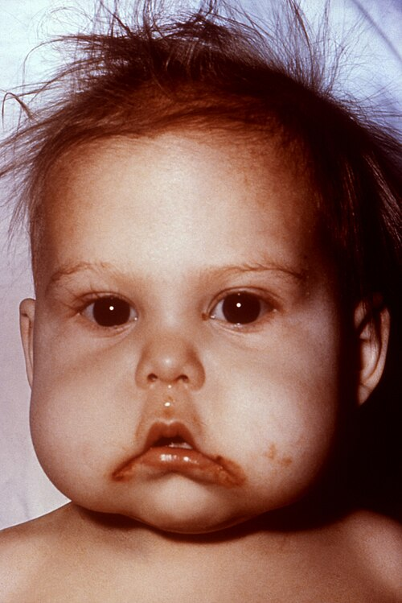
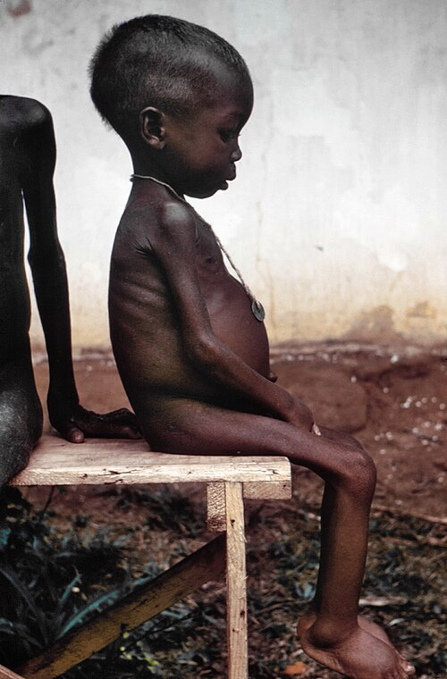

# DESNUTRIÇÃO

Para entender desnutrição em nível de prova de residência, você precisa parar de pensar nela apenas como "falta de comida". A desnutrição é um estado metabólico adaptativo (ou desadaptativo) que altera toda a fisiologia do paciente. Se você entender a base metabólica, não precisará decorar se o paciente tem bradicardia ou taquicardia – você vai deduzir.

Nas provas brasileiras, o tema aparece em três grandes frentes: a desnutrição hospitalar/cirúrgica, a desnutrição infantil (Marasmo e Kwashiorkor) e as deficiências específicas de micronutrientes. Vamos dissecar cada uma delas.

*Figura 1 - Lactente com Kwashiorkor, a desnutrição predominantemente proteica. Note os sinais característicos: cabelo ralo e despigmentado (sinal da bandeira), edema, estomatite angular (deficiência de Vitamina B associada) e retardo do crescimento. Fonte: CDC, Domínio Público | Wikimedia Commons*

## Fisiopatologia: O Corpo em Modo de Sobrevivência

*Figura 2 - Criança com desnutrição grave (kwashiorkor) durante a Guerra de Biafra. Observe o edema de membros inferiores, abdômen protruso (pot-belly), cabelo fino e despigmentado, e apatia. Contrasta com o Marasmo (desnutrição calórico-proteica), onde predomina a magreza extrema sem edema. Fonte: Dr. Lyle Conrad/CDC, Domínio Público | Wikimedia Commons*

Quando o aporte calórico-proteico cessa ou diminui drasticamente, o corpo não "desliga". Ele prioriza. O objetivo primário é manter a glicemia para o cérebro e eritrócitos.

### A Cascata Energética

Inicialmente, usamos o **glicogênio hepático**. Mas aqui está o primeiro ponto de prova: o glicogênio é uma reserva pífia. Ele dura, no máximo, 24 a 36 horas. O glicogênio muscular, por sua vez, é "egoísta"; ele não possui a enzima glicose-6-fosfatase, portanto, não consegue liberar glicose para a corrente sanguínea, servindo apenas para a contração do próprio músculo.

Esgotado o glicogênio, entramos na **neoglicogênese**. O corpo começa a quebrar proteína muscular (aminoácidos alanina e glutamina) para produzir glicose. Isso é metabolicamente caro. Por isso, em poucos dias, o corpo faz o *shift* para a **cetogênese**.

Os lipídios são nossa maior reserva energética, fornecendo **9 Kcal/g** (guarde esse número, as bancas comparam com as 4 Kcal/g dos carboidratos e proteínas). A oxidação de ácidos graxos gera corpos cetônicos, que o cérebro aprende a usar, poupando a massa magra. Se o paciente perde 30% da massa magra (comum em grandes queimados ou traumas graves), o risco de morte por pneumonia ou úlceras de pressão explode, pois não há substrato para imunidade e cicatrização.

### O Ciclo de Cori e a Economia de Energia

Muitos alunos confundem o **Ciclo de Cori**. Ele é a conversão de lactato (gerado na periferia) em glicose no fígado. Cuidado: o Ciclo de Cori **consome ATP**. Ele não é uma estratégia de "geração" de energia, mas de reciclagem de carbono. Na desnutrição crônica, o metabolismo basal (TMB) cai para economizar o que resta. É por isso que o desnutrido é bradicárdico e hipotérmico.

## Classificação Clínica: O Embate Marasmo vs. Kwashiorkor

Esta é, sem dúvida, a parte mais cobrada em pediatria e clínica médica. Você precisa diferenciar o mecanismo de adaptação de cada uma.

### Marasmo (A Adaptação "Perfeita")

O marasmo é a deficiência **energética** global. O corpo teve tempo de se adaptar. Ele consumiu a gordura (lipólise) e o músculo (proteólise) de forma equilibrada.

- **Perfil:** Geralmente lactentes < 1 ano.

- **Clínica:** Magreza extrema, fácies senil (perda da gordura de Bichat), irritabilidade.

- **O que NÃO tem:** Não tem edema. A albumina costuma estar normal ou discretamente baixa, porque o fígado ainda consegue produzi-la.

### Kwashiorkor (A Adaptação Falha)

Aqui o problema é a deficiência **proteica** aguda, muitas vezes sobreposta a uma dieta que ainda tem carboidratos (ex: criança que para de mamar e passa a comer apenas mingau de amido).

- **O Porquê do Edema:** É multifatorial. Existe a hipoalbuminemia (queda da pressão oncótica), mas as provas modernas cobram o **estresse oxidativo**. A falta de aminoácidos sulfurados impede a formação de glutationa (antioxidante). O excesso de radicais livres lesa membranas celulares, contribuindo para o extravasamento de fluido.

- **Clínica:** Edema de extremidades ou anasarca, hepatomegalia (esteatose hepática por falta de apoproteínas para tirar a gordura do fígado), alterações de fâneros (cabelo em "bandeira", despigmentado) e a clássica dermatose em "tinta descascada".

**Tabela 1: Diferenciação Marasmo vs. Kwashiorkor**

| Característica | Marasmo | Kwashiorkor |
| --- | --- | --- |
| Deficiência principal | Calorias (Energia) | Proteínas |
| Idade comum | < 1 ano | > 1-2 anos (pós-desmame) |
| Edema | Ausente | Presente (obrigatório) |
| Tecido Adiposo | Muito reduzido | Presente/Preservado |
| Fígado | Normal | Hepatomegalia (Esteatose) |
| Albuminemia | Normal ou leve ↓ | Muito reduzida |
| Evolução | Insidiosa | Aguda/Rápida |

## Avaliação Nutricional e Marcadores

Como o Dr. Will sempre enfatiza em nossas discussões de caso, "um peso isolado não faz diagnóstico, mas uma tendência de peso faz um prognóstico".

### Antropometria

- **Peso Corporal:** É o método mais simples e sensível para mudanças agudas. Perda de peso involuntária > 10% em 6 meses define desnutrição grave.

- **IMC no Idoso:** Cuidado aqui! A régua muda. Para o idoso, IMC < 22 é baixo peso; 22 a 27 é eutrofia; > 27 é sobrepeso. O idoso tem a "obesidade sarcopênica" (muita gordura, pouco músculo), o que aumenta o risco de quedas e DM2.

- **Prega Cutânea Tricipital (PCT):** Avalia reserva de gordura.

- **Circunferência do Braço (CB):** Avalia reserva muscular.

### Marcadores Bioquímicos (Pegadinha de Prova)

As bancas amam perguntar qual o melhor marcador. A resposta depende do que você quer avaliar:

- **Albumina:** Meia-vida longa (20 dias). Não serve para avaliar mudanças agudas ou resposta ao tratamento nutricional. É um ótimo marcador de **prognóstico** e gravidade crônica. Se < 3,0 g/dL no pré-operatório, o risco de deiscência e infecção é altíssimo.

- **Transferrina:** Meia-vida intermediária (8-10 dias). Mais sensível que a albumina para o pré-operatório.

- **Pré-albumina (Transtirretina):** Meia-vida curta (2-3 dias). É o melhor marcador para avaliar se a sua dieta está funcionando **agora**.

**Dica de Prova:** Em estados inflamatórios (SIRS, trauma), a albumina cai não só por desnutrição, mas porque o fígado prioriza proteínas de fase aguda (PCR) e o endotélio fica mais permeável. Portanto, albumina baixa em paciente chocado não é necessariamente desnutrição, mas gravidade da doença.

## Desnutrição Hospitalar e Cirúrgica

Cerca de 50% dos pacientes internados em hospitais brasileiros apresentam algum grau de desnutrição. Isso não é apenas um detalhe; isso mata.

### O Trato Gastrointestinal na Desnutrição

A desnutrição causa atrofia das vilosidades intestinais e redução da produção de IgA secretora. Isso leva ao **sobrecrescimento bacteriano** e à translocação bacteriana. Além disso, ocorre **hipocloridria** (redução do ácido gástrico). Sem ácido, o estômago perde sua barreira contra patógenos, aumentando o risco de infecções sistêmicas.

Aqui entra a **Glutamina**. Embora não seja um aminoácido essencial em pessoas saudáveis, no estresse metabólico ela se torna "condicionalmente essencial". Ela é o principal combustível dos enterócitos e colonócitos. Manter a integridade da barreira intestinal é a melhor forma de prevenir sepse de foco abdominal.

### Suporte Nutricional Perioperatório

Se você tem um paciente com câncer gástrico e desnutrição grave (perda de peso > 15% ou albumina < 3,0), a conduta correta segundo a SBNut e o projeto ACERTO é: **adiar a cirurgia por 7 a 14 dias** para suporte nutricional (preferencialmente enteral). Isso reduz drasticamente as complicações infecciosas.

## Síndrome de Realimentação (Refeeding Syndrome)

Este é o "terror" das provas de terapia intensiva e nutrologia. Ocorre quando você tenta nutrir rápido demais um paciente que estava em jejum prolongado ou desnutrição grave (ex: anorexia nervosa com IMC < 15, alcoolistas, pacientes oncológicos).

### A Fisiopatologia do Desastre

No jejum, a insulina está baixa. Quando você introduz carboidratos (glicose), ocorre um pico de **insulina**. A insulina coloca glicose para dentro da célula, mas leva junto **Fósforo, Magnésio e Potássio**.

- **O resultado:** Queda abrupta desses eletrólitos no sangue.

- **O marcador chave:** **Hipofosfatemia grave**.

- **Consequência:** Insuficiência cardíaca, arritmias, depressão respiratória (o diafragma não tem ATP/Fósforo para contrair) e óbito.

**Como evitar?** Comece com 50% das necessidades calóricas (ou 10-15 kcal/kg) e suba devagar. Reponha tiamina **antes** de começar a glicose.

## Deficiências de Micronutrientes (A Fome Oculta)

As bancas adoram associar uma clínica específica a uma vitamina.

### Vitamina B12 (Cobalamina)

- **Quem corre risco:** Veganos estritos, gastrectomizados (falta de fator intrínseco), usuários crônicos de IBP (precisa de ácido para destacar a B12 da proteína do alimento) e idosos com gastrite atrófica.

- **Clínica:** Anemia megaloblástica + **alterações neurológicas** (degeneração combinada subaguda da medula - perda de sensibilidade vibratória e propriocepção). Glossite atrófica (língua careca) também é comum.

### Tiamina (B1)

- **Quem corre risco:** Alcoolistas e pacientes pós-gastroplastia.

- **Clínica:** Beribéri (seco: neuropatia; úmido: ICC de alto débito) e Encefalopatia de Wernicke (ataxia, confusão mental, oftalmoplegia).

- **Pérola de Prova:** Nunca dê soro glicosado para um alcoolista sem dar Tiamina antes. A glicose vai consumir o resto de tiamina que ele tem para o metabolismo piruvato-desidrogenase e precipitar o Wernicke.

### Niacina (B3)

- **Clínica:** Pelagra. Os 3 "Ds": Dermatite (em áreas expostas ao sol - colar de Casal), Diarreia e Demência.

**Tabela 2: Resumo de Deficiências de Micronutrientes**

| Nutriente | Cenário Clínico | Manifestação Principal |
| --- | --- | --- |
| **Vitamina B12** | Veganos, Gastrectomia, IBP | Anemia Megaloblástica + Neuropatia |
| **Tiamina (B1)** | Alcoolismo, Vômitos incoercíveis | Wernicke, Beribéri |
| **Niacina (B3)** | Dieta baseada em milho | Pelagra (Dermatite, Diarreia, Demência) |
| **Vitamina C** | Falta de vegetais frescos | Escorbuto (Gengivorragia, petéquias) |
| **Zinco** | Nutrição parenteral sem reposição | Acrodermatite enteropática, má cicatrização |
| **Ferro** | Vegetarianos (ferro não-heme) | Anemia microcítica e hipocrômica |

## Desnutrição no Idoso e Sarcopenia

No MedEvo, sempre destacamos que o envelhecimento traz desafios únicos. O idoso tem redução da sensibilidade gustativa e olfativa, o que leva à anorexia do envelhecimento.

A **Sarcopenia** é a perda de massa muscular associada à perda de função (força ou desempenho). Em idosos diabéticos, a suplementação deve ser cuidadosa: suplementos hiperproteicos e hipercalóricos são indicados, mas a oferta de proteína deve ser ajustada se houver doença renal crônica avançada.

Um ponto que cai muito: a **Circunferência da Cintura**. Ela é um estimador de risco cardiovascular, medida no ponto médio entre a última costela e a crista ilíaca. Não confunda com a circunferência do quadril.

## Manejo da Desnutrição Grave (Protocolo OMS)

Para crianças com desnutrição grave, o tratamento é dividido em fases para evitar a morte por iatrogenia.

- **Fase de Estabilização (1-7 dias):** Tratar hipoglicemia, hipotermia, desidratação (cuidado com a reidratação excessiva, prefira via oral/sonda) e infecção (antibiótico é regra, mesmo sem febre). **Não se dá ferro nesta fase**. O ferro é pró-oxidante e pode favorecer o crescimento bacteriano.

- **Fase de Reabilitação (2-6 semanas):** Introdução gradual de calorias, início da reposição de ferro e ganho de peso rápido ("catch-up").

- **Fase de Seguimento:** Acompanhamento ambulatorial para prevenir recidiva.

### O Papel dos Hormônios e Peptídeos

O controle da fome e saciedade é figurinha carimbada em provas de alto nível.

- **Leptina:** Produzida pelos adipócitos. Avisa o cérebro que "temos reserva", gerando saciedade. No desnutrido, a leptina está baixa.

- **Grelina:** Produzida no estômago. É o hormônio da fome.

- **GLP-1 e PYY:** Hormônios intestinais que sinalizam saciedade pós-prandial.

## Lipídios e Ácidos Graxos Essenciais

Você precisa saber que o corpo não produz tudo. Os ácidos **linoleico (Ômega-6)** e **linolênico (Ômega-3)** são essenciais.

- O Ômega-6 (ácido palmítico é um saturado comum em carnes, não confunda) está relacionado à via pró-inflamatória, mas em níveis adequados é cardioprotetor.

- O Ômega-3 é precursor de mediadores anti-inflamatórios.
As carnes contêm principalmente ácidos graxos monoinsaturados e saturados (palmítico, esteárico).

## Pontos-Chave para Prova

- **Marasmo:** Deficiência global, sem edema, < 1 ano, adaptação metabólica presente.

- **Kwashiorkor:** Deficiência proteica, COM edema, estresse oxidativo, hepatomegalia, pós-desmame.

- **Síndrome de Realimentação:** Hipofosfatemia é o marco. Ocorre pela liberação de insulina após jejum prolongado.

- **Tiamina antes da Glicose:** Regra de ouro no atendimento de alcoolistas ou desnutridos graves para evitar Wernicke.

- **Albumina:** Excelente para prognóstico (meia-vida 20 dias), ruim para avaliar resposta aguda à dieta.

- **Pré-albumina:** Melhor marcador de resposta nutricional aguda (meia-vida 2-3 dias).

- **Glutamina:** Combustível do enterócito; essencial para manter a barreira intestinal no estresse.

- **Hipotermia e Hipoglicemia:** São as principais causas de morte na fase inicial do tratamento da desnutrição grave.

- **Antibioticoterapia:** Na desnutrição grave, é indicada mesmo na ausência de febre (o desnutrido não faz resposta inflamatória exuberante).

- **IMC Idoso:** Baixo peso se < 22 kg/m².

- **Ciclo de Cori:** Gasta ATP. Converte lactato em glicose no fígado.

- **Glicogênio Hepático:** Reserva de curtíssimo prazo (24-36h).

- **Linfócitos < 1500:** Marcador de risco nutricional/imunológico no hospital.

- **Transferrina:** Marcador mais sensível que albumina no pré-operatório (meia-vida 8 dias).

- **Ferro:** NUNCA iniciar na fase de estabilização da desnutrição grave.

- **Anorexia Nervosa:** Bradicardia, hipotensão e IMC < 15 são indicações de internação em clínica médica.

- **Vitamina B12:** Deficiência causa anemia megaloblástica E neuropatia (diferente do folato, que só causa anemia).

- **Gasto Energético:** Lipídios fornecem 9 kcal/g; Carboidratos e Proteínas fornecem 4 kcal/g. 💡

 Cópia offline para consulta pessoal.
 Fonte original:
 [https://www.medevo.com.br/material-apoio/ler/9ac7f63d-f744-4c53-8f38-b99db8034d03](https://www.medevo.com.br/material-apoio/ler/9ac7f63d-f744-4c53-8f38-b99db8034d03)
