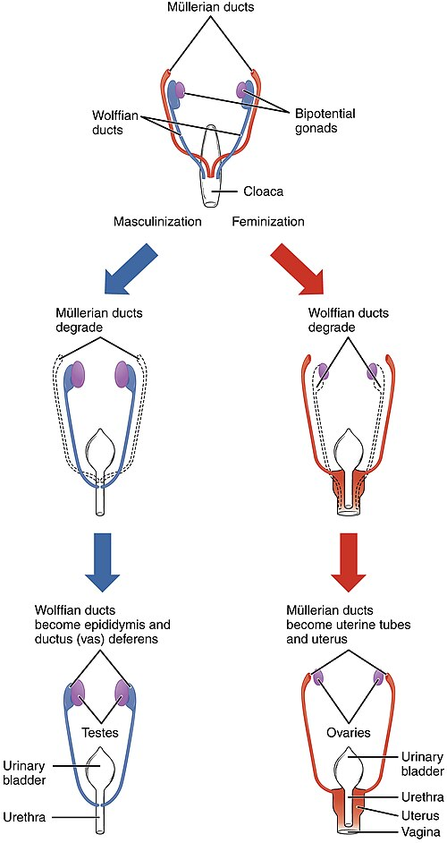
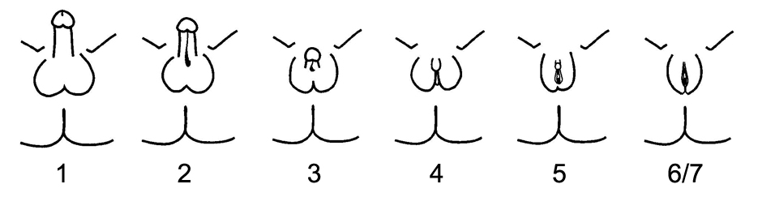

# DESORDENS DO DESENVOLVIMENTO SEXUAL

Para entender as Desordens do Desenvolvimento Sexual (DDS), você não pode começar decorando nomes de síndromes. O segredo que eu sempre digo aos meus alunos na MedEvo é: entenda a embriologia. Se você souber o que deveria ter acontecido, você identifica o erro na hora que lê o enunciado da prova.

DDS é um termo guarda-chuva para condições congênitas em que o desenvolvimento do sexo cromossômico, gonadal ou anatômico é atípico. Antigamente usavam-se termos como hermafroditismo, mas esqueça isso. A nomenclatura oficial da Sociedade Brasileira de Pediatria (SBP) e do Consenso de Chicago é Distúrbios do Desenvolvimento Sexual.

*Figura 1 - Diagrama da diferenciação sexual normal: o gene SRY no cromossomo Y induz a formação do testículo, que produz AMH (regredindo ductos de Müller) e testosterona (mantendo ductos de Wolff). Sem SRY, forma-se ovário e genitália interna feminina. Fonte: OpenStax College, CC BY 3.0 | Wikimedia Commons*

## A Lógica da Diferenciação Sexual (O "Porquê")

O embrião humano é "programado" para ser feminino. Para que um indivíduo se torne fenotipicamente masculino, ele precisa de eventos ativos e sucessivos. Se algo falhar nesse caminho, teremos uma DDS.

- **Determinação do Sexo Gonadal:** O gene SRY, localizado no braço curto do cromossomo Y, é o gatilho. Ele faz a gônada indiferenciada virar testículo. Se não tem SRY (ou se ele não funciona), a gônada vira ovário.

- **Diferenciação Interna:** O testículo produz duas substâncias cruciais:

- **Hormônio Anti-Mülleriano (AMH):** Produzido pelas células de Sertoli. Ele regride os ductos de Müller (que dariam origem ao útero, trompas e parte superior da vagina).

- **Testosterona:** Produzida pelas células de Leydig. Ela mantém os ductos de Wolff (que darão origem ao epidídimo, ducto deferente e vesículas seminais).

- **Diferenciação Externa:** A testosterona precisa ser convertida em Di-hidrotestosterona (DHT) pela enzima 5-alfa-reductase para virilizar a genitália externa (fechar a bolsa escrotal e crescer o falo).

**Dica de Prova:** Se o paciente tem útero, significa que NÃO houve ação do AMH. Se não houve AMH, ou não tinha testículo, ou as células de Sertoli falharam. Guarde isso, pois as bancas adoram colocar "presença de útero ao ultrassom" para você descartar causas de 46,XY.

## Classificação das DDS

*Figura 2 - Escala de Quigley para classificação da Síndrome de Insensibilidade aos Andrógenos (SIA): grau 1 = forma leve (MAIS); graus 2-5 = formas parciais (PAIS) com graus crescentes de feminização; graus 6-7 = forma completa (CAIS) com fenótipo feminino típico apesar do cariótipo 46,XY. Fonte: Jonathan.Marcus, CC BY-SA 3.0 | Wikimedia Commons*

Dividimos as DDS em três grandes grupos baseados no cariótipo. Essa é a forma mais organizada de pensar no diagnóstico.

### 1. DDS por Cromossomos Sexuais

Aqui o problema está no número ou na estrutura dos cromossomos.

- **Síndrome de Turner (45,X):** Menina com baixa estatura, pescoço alado e disgenesia gonadal (ovários em fita). O FSH estará elevado (hipogonadismo hipergonadotrófico).

- **Síndrome de Klinefelter (47,XXY):** Homem com estatura elevada, ginecomastia, testículos pequenos e endurecidos e infertilidade.

- **Disgenesia Gonadal Mista (45,X/46,XY):** É a causa mais comum de genitália ambígua com cariótipo em mosaico. Geralmente há um testículo de um lado e uma gônada em fita do outro.

### 2. DDS 46,XX (Antigo Pseudo-hermafroditismo Feminino)

O indivíduo tem ovários, mas a genitália externa foi virilizada por excesso de andrógenos.

- **Hiperplasia Adrenal Congênita (HCS):** A causa número 1 de genitália ambígua no recém-nascido. Vamos detalhar adiante porque isso cai em TODA prova.

- **Tumores Maternos ou Ingestão de Andrógenos:** Raro, mas pode acontecer se a mãe tiver um arrenoblastoma durante a gestação.

### 3. DDS 46,XY (Antigo Pseudo-hermafroditismo Masculino)

O indivíduo tem testículos, mas a genitália não virilizou adequadamente.

- **Síndrome de Insensibilidade Androgênica (SIA ou Síndrome de Morris):** O corpo produz testosterona, mas o receptor não funciona.

- **Deficiência de 5-alfa-reductase:** O corpo produz testosterona, mas não converte em DHT. A genitália externa nasce feminina ou ambígua, mas na puberdade (com o aumento brutal da testosterona), o clitóris pode crescer e "virar" um pênis.

- **Defeitos na Síntese de Testosterona:** Falha enzimática nas células de Leydig.

## Hiperplasia Adrenal Congênita (HCS): O Tema de Ouro

Como professor, eu garanto: se você souber HCS, você acerta 50% das questões de endocrinologia pediátrica. A HCS é uma doença autossômica recessiva. O erro está na produção de cortisol pela glândula adrenal.

### Fisiopatologia (O bloqueio enzimático)

Em 95% dos casos, a deficiência é da enzima **21-hidroxilase**.
Imagine uma fábrica com três linhas de produção: Cortisol, Aldosterona e Andrógenos. Se você bloqueia a produção de Cortisol e Aldosterona (pela falta da 21-hidroxilase), a matéria-prima (colesterol e precursores) é desviada para a única linha que sobrou: a dos Andrógenos.

O resultado é:

- **Queda do Cortisol:** O corpo percebe isso e aumenta o ACTH para tentar estimular a adrenal. Isso gera a "Hiperplasia" da glândula.

- **Queda da Aldosterona:** Perda de sódio e retenção de potássio (nas formas perdedoras de sal).

- **Excesso de Andrógenos:** Virilização da genitália em fetos femininos (46,XX).

### Formas Clínicas da Deficiência de 21-hidroxilase

| Característica | Forma Perdedora de Sal (75%) | Forma Virilizante Simples (25%) | Forma Não Clássica (Tardia) |
| --- | --- | --- | --- |
| **Genitália (46,XX)** | Ambígua (Prader III a V) | Ambígua | Normal ao nascimento |
| **Genitália (46,XY)** | Normal (Perigo!) | Normal | Normal |
| **Crise Adrenal** | Sim (2ª semana de vida) | Não | Não |
| **Laboratório** | ↑ 17-OHP, ↓ Na, ↑ K | ↑ 17-OHP, Na e K normais | ↑ 17-OHP (após estímulo) |

**Atenção ao "Menino Normal":** O recém-nascido 46,XY com HCS perdedora de sal nasce com genitália normal. Ele não é diagnosticado pelo exame físico. Ele vai chegar no pronto-socorro com 10 a 14 dias de vida, desidratado, vomitando e em choque. O examinador vai colocar "vômitos e desidratação" para você pensar em Estenose Hipertrófica de Piloro, mas o potássio estará ALTO. Na estenose de piloro, o potássio é BAIXO. Não erre isso!

### Diagnóstico e Manejo da Crise

O diagnóstico padrão-ouro na triagem neonatal (Teste do Pezinho) é a dosagem da **17-hidroxiprogesterona (17-OHP)**. Se vier alta, precisamos confirmar.

Na crise adrenal neonatal (vômitos, desidratação, hiponatremia, hipercalemia, hipoglicemia):

- **Estabilização:** Soro Fisiológico 0,9% (20 ml/kg) + Glicose.

- **Reposição de Glicocorticoide:** Hidrocortisona IV (ataque de 50-100 mg/m²). Segundo a SBP, a hidrocortisona é a droga de escolha na infância porque tem menor efeito de supressão do crescimento que a dexametasona.

- **Reposição de Mineralocorticoide:** Fludrocortisona (após estabilização da fase aguda).

## Síndrome de Insensibilidade Androgênica (SIA) - Síndrome de Morris

Este é o cenário clássico de prova: "Menina" adolescente que nunca menstruou (amenorreia primária), tem mamas bem desenvolvidas (Tanner M3-M4), mas **não tem pelos pubianos nem axilares** (P1).

**Por que isso acontece?**
O paciente é 46,XY. Ele tem testículos (geralmente intra-abdominais ou nos canais inguinais). Os testículos produzem AMH, então **não há útero nem trompas**. Eles produzem testosterona, mas o receptor não a "enxerga". A testosterona sobra e é convertida perifericamente em estrogênio, o que faz as mamas crescerem. Como não há ação androgênica, não nascem pelos.

**Diferencial com Síndrome de Mayer-Rokitansky:**
Ambas têm ausência de útero e vagina curta. Mas a paciente com Rokitansky é 46,XX, tem ovários e **tem pelos normais**. A SIA é 46,XY e não tem pelos. Dr. Will sempre lembra: "SIA = Sem Pelos".

## Abordagem do Recém-Nascido com Genitália Ambígua

Isso é uma emergência médica e social. A primeira regra de ouro: **Não registre a criança e não defina o sexo antes da investigação.**

### O Exame Físico é a Chave

O que procurar?

- **Gônadas palpáveis?** Se você palpa gônada na bolsa ou no canal inguinal, essa gônada é um testículo (ovários não descem). Se há testículo, o cariótipo provavelmente tem um Y.

- **Tamanho do falo:** Medir o comprimento (micropênis < 2,5 cm no termo).

- **Grau de fusão labioescrotal:** Ver se há orifício único (seio urogenital).

- **Escala de Prader:** Usada para estadiar a virilização da genitália feminina (I a V).

### Exames Iniciais

- **Cariótipo com banda G:** Para definir o sexo genético.

- **Ultrassonografia de abdome e pelve:** Para procurar útero e gônadas internas.

- **Eletrólitos (Na, K):** Monitorar crise perdedora de sal.

- **17-OHP:** Investigar HCS.

## Criptorquidia e Distopia Testicular

Muitas questões de DDS começam com um relato de testículo não descido. Vamos alinhar os conceitos:

- **Criptorquidia:** Testículo parado em algum ponto do trajeto normal de descida.

- **Ectopia Testicular:** Testículo fora do trajeto normal (ex: região femoral).

- **Testículo Retrátil:** O testículo sobe devido ao reflexo cremastérico excessivo, mas você consegue trazê-lo para a bolsa e ele **fica lá** sem tensão. Isso é variante do normal, não precisa de cirurgia, apenas acompanhamento.

**Conduta na Criptorquidia:**
Aguardar até os 6 meses de vida. Se não desceu até lá, a chance de descida espontânea é mínima.

- **Cirurgia (Orquidopexia):** Deve ser feita preferencialmente entre **6 e 18 meses**. Por que tão cedo? Para preservar a fertilidade e permitir a palpação futura (risco de câncer testicular é maior em quem teve criptorquidia, e a cirurgia não elimina o risco, mas facilita o diagnóstico precoce).

- **Testículo não palpável bilateral:** Investigar DDS imediatamente! Pode ser uma menina virilizada (HCS).

## Tumores e Virilização Precoce

Se a prova descreve uma menina que estava bem e, de repente, começa a ter pelos pubianos, acne e **clitorimegalia** (virilização rápida), pense em **Tumor de Córtex Adrenal**.

- Diferente da HCS (que é congênita), o tumor aparece depois.

- O marcador principal é o **DHEA-S** (Sulfato de Deidroepiandrosterona) muito elevado.

- O exame de imagem (TC ou RM) mostrará a massa adrenal.

## Tabelas Comparativas para Fixação

### Tabela 1: Diagnóstico Diferencial de Amenorreia Primária com Ausência de Útero

| Característica | Síndrome de Morris (SIA) | Síndrome de Rokitansky |
| --- | --- | --- |
| **Cariótipo** | 46,XY | 46,XX |
| **Gônada** | Testículos (ocultos) | Ovários |
| **Pelos Pubianos** | Ausentes ou escassos | Normais |
| **Testosterona** | Alta (nível masculino) | Normal (nível feminino) |
| **Causa** | Defeito no receptor androgênico | Agenesia dos ductos de Müller |

### Tabela 2: Distúrbios Hidroeletrolíticos na Infância (Diagnóstico Diferencial)

| Condição | Sódio (Na) | Potássio (K) | pH / Estado Ácido-Básico |
| --- | --- | --- | --- |
| **HCS Perdedora de Sal** | Baixo (Hiponatremia) | Alto (Hipercalemia) | Acidose Metabólica |
| **Estenose de Piloro** | Baixo | Baixo (Hipocalemia) | Alcalose Metabólica |
| **Diabetes Insipidus** | Alto (Hipernatremia) | Normal | Normal |
| **SIADH** | Baixo | Normal | Normal (Euvolemia) |

## O Manejo Cirúrgico e Ético

Este é um ponto que mudou muito nos últimos anos e as bancas estão começando a cobrar a visão moderna. Antigamente, operava-se o bebê o mais rápido possível para "ajustar" a genitália ao sexo escolhido.

Hoje, a recomendação (SBP e Ministério da Saúde) é:

- **Equipe Multidisciplinar:** Endocrinologista, cirurgião pediátrico, geneticista, psicólogo e assistente social.

- **Cirurgia de Designação:** Deve ser discutida com a família. Em casos de ambiguidade severa, há uma tendência crescente de adiar cirurgias puramente estéticas até que a criança possa participar da decisão (identidade de gênero).

- **Cirurgias Funcionais:** Essas não esperam. Ex: corrigir hipospadias graves para permitir micção ou orquidopexia para evitar torção/malignidade.

## Situações Especiais e Pegadinhas

**Hérnia Inguinal em Meninas:**
Sempre que você atender uma lactente do sexo feminino com hérnia inguinal, palpe o conteúdo do saco herniário. Se sentir uma estrutura firme e ovalada, pode ser um testículo. Isso é uma pista clássica para Síndrome de Morris ou Disgenesia Gonadal. Solicite cariótipo.

**O Uso do Ácido Acetilsalicílico (AAS) e Kawasaki:**
Embora pareça fora do tema, as bancas misturam vasculites pediátricas em questões de diagnóstico diferencial de massas ou crises sistêmicas. Lembre-se: Doença de Kawasaki é febre alta por 5 dias + critérios clínicos. O tratamento é Imunoglobulina IV + AAS em doses altas. É a única indicação clássica de AAS em crianças (devido ao risco de Síndrome de Reye).

**Síndrome de Kallmann:**
Se o paciente tem atraso puberal (hipogonadismo hipogonadotrófico) e **anosmia** (não sente cheiro), o diagnóstico é Kallmann. O problema é a falha na migração dos neurônios produtores de GnRH e dos neurônios olfatórios.

## Pontos-Chave para Prova

- **HCS 21-hidroxilase:** Causa mais comum de DDS 46,XX. Cursa com ↑ 17-OHP e andrógenos.

- **Crise Perdedora de Sal:** Hiponatremia + Hipercalemia + Desidratação + Vômitos. Ocorre geralmente entre o 7º e 15º dia de vida.

- **Tratamento da Crise Adrenal:** Hidrocortisona IV é a prioridade após expansão volêmica.

- **Síndrome de Morris (SIA):** 46,XY, fenótipo feminino, mamas presentes, mas **sem pelos** e sem útero.

- **Criptorquidia:** Se bilateral no RN, investigar DDS. Se unilateral, aguardar 6 meses. Cirurgia ideal entre 6-18 meses.

- **Orquidopexia:** Reduz risco de infertilidade e facilita detecção de câncer, mas o risco de malignidade continua maior que na população geral.

- **Gônada Palpável em Genitália Ambígua:** Sugere fortemente a presença de cromossomo Y (testículo).

- **Diferença HCS vs Estenose de Piloro:** HCS tem potássio ALTO e acidose. Piloro tem potássio BAIXO e alcalose.

- **Tumor de Adrenal:** Virilização rápida em meninas com DHEA-S muito elevado.

- **Cariótipo:** É o primeiro exame a ser solicitado na investigação de genitália ambígua, junto com USG e 17-OHP.

- **Contraindicação Absoluta:** Nunca realize circuncisão (postectomia) em recém-nascido com hipospadia ou genitália ambígua. O prepúcio será necessário para a cirurgia reconstrutiva futura.

- **Valores Memorizáveis:** Micropênis no RN a termo é < 2,5 cm. Puberdade precoce em meninas é < 8 anos e em meninos < 9 anos.

- **Erro Comum:** Achar que toda HCS perde sal. A forma Virilizante Simples tem eletrólitos normais, mas a menina nasce com genitália ambígua.

- **O que NÃO fazer:** Não definir o sexo do bebê na sala de parto se houver dúvida. Use termos neutros com a família até a investigação inicial.

Este material foi estruturado para que você, aluno MedEvo, tenha a base fisiopatológica necessária para não ser enganado pelas bancas. Lembre-se do Dr. Will: na dúvida, siga o caminho dos hormônios!

 Cópia offline para consulta pessoal.
 Fonte original:
 [https://www.medevo.com.br/material-apoio/ler/50456f82-2672-4d37-b5c8-8a02ba68ffa7](https://www.medevo.com.br/material-apoio/ler/50456f82-2672-4d37-b5c8-8a02ba68ffa7)
