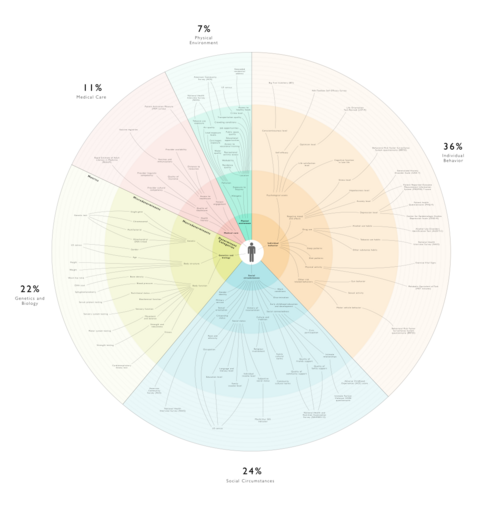
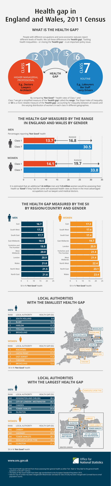

# DETERMINANTES SOCIAIS DA SAÚDE

Para entender por que as pessoas adoecem, não basta olhar para o microscópio ou para o receptor de membrana. Se você focar apenas na fisiopatologia celular, vai errar muitas questões de Medicina Preventiva e, pior, vai falhar com seu paciente na prática. Os Determinantes Sociais da Saúde (DSS) são as condições em que as pessoas nascem, crescem, vivem, trabalham e envelhecem.

A lógica aqui é simples: a biologia não ocorre no vácuo. O infarto do miocárdio de um executivo estressado em um bairro nobre tem determinantes diferentes do infarto de um trabalhador informal que mora em uma área sem saneamento e com insegurança alimentar. As bancas de residência, como a USP, a UNICAMP e o Enare, cobram esse tema exigindo que você saiba diferenciar os modelos teóricos e, principalmente, como a desigualdade se traduz em indicadores de saúde.

*Figura 1 - Visualização abrangente dos determinantes de saúde, desde fatores individuais (genética, comportamento) até macrodeterminantes (condições socioeconômicas, ambiente construído, políticas públicas). Note como as "escolhas individuais" são condicionadas pelas camadas externas. Fonte: Admiralyang/GoInvo, CC BY-SA 4.0 | Wikimedia Commons*

## O Campo da Saúde e o Modelo de Marc Lalonde

*Figura 2 - Gradiente de saúde: quanto maior a classe socioeconômica, melhor a autoavaliação de saúde. O "health gap" é a diferença entre grupos mais e menos favorecidos. Este princípio é universal e ilustra como os DSS criam iniquidades em saúde independente dos sistemas de saúde. Fonte: Office for National Statistics (UK), OGL v1.0 | Wikimedia Commons*

Em 1974, o então ministro da saúde do Canadá, Marc Lalonde, publicou um relatório que mudou a história da saúde pública. Antes dele, o foco era quase total na assistência médica (hospitais e remédios). Lalonde propôs o conceito de "Campo da Saúde", dividindo-o em quatro componentes fundamentais.

### Os Quatro Componentes de Lalonde

- Biologia Humana: Herança genética, processos de maturação e envelhecimento.

- Meio Ambiente: Fatores externos ao corpo, como poluição, saneamento e urbanização.

- Estilo de Vida: Comportamentos e decisões individuais (tabagismo, dieta, sedentarismo).

- Organização dos Serviços de Saúde: Acesso, qualidade e disponibilidade de médicos e hospitais.

Aqui está a primeira grande dica de prova: o Modelo de Lalonde demonstrou que o Estilo de Vida é o fator com maior peso na determinação da saúde e da mortalidade, mas, paradoxalmente, é onde os governos menos investiam na época. As bancas adoram perguntar qual fator tem maior impacto segundo Lalonde. A resposta é Estilo de Vida.

No entanto, cuidado com a pegadinha. Embora o estilo de vida seja central, ele não é puramente uma "escolha livre". Como o Dr. Will costuma reforçar nas discussões do MedEvo, a escolha individual é condicionada pelo acesso. É difícil escolher uma dieta equilibrada quando o acesso a alimentos saudáveis é caro ou inexistente no seu território (os chamados desertos alimentares).

## Modelos Teóricos de Determinantes Sociais

As bancas não querem apenas que você saiba que a pobreza adoece. Elas querem que você saiba "como" os autores organizam esse pensamento. Existem dois modelos principais que aparecem em 90% das questões.

### Modelo de Dahlgren e Whitehead (O Modelo em Camadas)

Este é o famoso modelo do "arco-íris". Ele organiza os determinantes em níveis, do micro ao macro.

- Nível 1 (Centro): Características individuais (idade, sexo e fatores genéticos). São os determinantes não modificáveis.

- Nível 2: Estilo de vida dos indivíduos. Aqui entram comportamentos como tabagismo e atividade física.

- Nível 3: Redes sociais e comunitárias. O apoio de amigos, vizinhos e família atua como um fator protetor.

- Nível 4: Condições de vida e de trabalho. Inclui habitação, saneamento, ambiente de trabalho, educação e serviços de saúde.

- Nível 5 (Camada Externa): Condições socioeconômicas, culturais e ambientais gerais. É o nível macro, onde estão as políticas públicas e o desenvolvimento sustentável.

Diferenciação para a prova:
Determinantes Proximais: São os níveis 1 e 2 (indivíduo e comportamento).
Determinantes Intermediários: São os níveis 3 e 4 (comunidade e condições de vida).
Determinantes Distais (ou Macrodeterminantes): É o nível 5 (políticas, economia, cultura).

### Modelo da Comissão da OMS (Solar e Irwin)

Este modelo é um pouco mais político e foca na Iniquidade Social em Saúde. Ele divide os determinantes em dois grandes blocos:

- Determinantes Estruturais: São aqueles que geram a estratificação social. Incluem renda, educação, ocupação, classe social, gênero e raça/etnia. Eles definem a posição socioeconômica do indivíduo.

- Determinantes Intermediários: São as condições materiais (moradia, vizinhança), fatores psicossociais e comportamentais.

A conexão aqui é vital: os determinantes estruturais operam através dos intermediários para causar os desfechos de saúde. Se a banca falar em "estratificação social" ou "mecanismos que geram desigualdade", ela está falando do modelo estruturalista de Solar e Irwin.

## Indicadores de Saúde e Desigualdade

Como medimos o impacto dos DSS? Não basta dizer que a situação está ruim, precisamos de números.

### O Índice de Desenvolvimento Humano (IDH)

O IDH é um indicador composto, muito cobrado em provas de epidemiologia social. Ele varia de 0 a 1 e utiliza três pilares:

- Longevidade: Medida pela esperança de vida ao nascer.

- Educação: Média de anos de estudo e anos esperados de escolaridade.

- Renda: Medida pelo PIB per capita (PPC).

Lembre-se: o IDH não mede apenas riqueza, ele mede desenvolvimento humano. Um país pode ser rico, mas se a educação for precária, o IDH será baixo.

### Mortalidade Infantil: O Termômetro Social

A mortalidade infantil (óbitos em menores de 1 ano) é dividida em dois componentes que caem muito em prova:

- Mortalidade Neonatal (até 28 dias): Está muito ligada a fatores biológicos, assistência ao pré-natal e ao parto. É mais difícil de reduzir.

- Mortalidade Pós-Neonatal (28 dias a 1 ano): É o indicador mais sensível às condições socioeconômicas. Se o saneamento é ruim, se falta vacina ou se há desnutrição, este índice sobe.

Erro clássico de prova: Achar que a mortalidade neonatal é a mais sensível ao ambiente. Não é. A pós-neonatal é que reflete diretamente o meio externo e a determinação social.

| Indicador | O que reflete prioritariamente? | Sensibilidade aos DSS |
| --- | --- | --- |
| Mortalidade Neonatal | Assistência ao parto e pré-natal | Moderada |
| Mortalidade Pós-Neonatal | Saneamento, nutrição, moradia | Altíssima |
| Letalidade | Gravidade da doença nos doentes | Baixa (foco biológico) |
| Esperança de Vida | Qualidade de vida acumulada | Alta |

## Tuberculose: A Doença Social por Excelência

Se existe uma doença que resume os Determinantes Sociais da Saúde, é a Tuberculose (TB). A epidemiologia da tuberculose mostra que o adoecimento é multifatorial. Não basta o bacilo de Koch estar presente, o ambiente precisa permitir a infecção e o adoecimento.

Quem é o paciente de maior risco para TB nas provas?

- Pessoas em Situação de Rua (PSR).

- Pessoas Privadas de Liberdade (PPL): Homens jovens, baixa escolaridade, vivendo em ambientes superlotados.

- Populações com baixa renda e desnutrição.

A Estratégia pelo Fim da Tuberculose da OMS coloca a redução da pobreza como tema central. Em provas, se aparecer um caso de TB em área vulnerável com diarreia infantil recorrente no mesmo domicílio, a banca quer que você identifique os múltiplos determinantes sociais, como a falta de saneamento e o acesso precário à saúde.

Cuidado com o PPD (ou IGRA): Um PPD positivo isolado indica apenas infecção latente (ILTB), não doença ativa. Para falar em doença, precisamos de clínica (tosse crônica, febre vespertina, perda de peso) e exames (baciloscopia, TRM-TB ou cultura).

## Raça e Etnia como Marcadores Sociais

Este é um tema que ganhou muita força nos últimos anos. Raça e etnia não são apenas variáveis biológicas (como no caso da Anemia Falciforme), mas marcadores de vulnerabilidade social devido ao Racismo Institucional.

Exemplo clássico de prova: A Hipertensão Arterial Sistêmica (HAS) e suas complicações apresentam maior mortalidade na população negra no Brasil. Isso não é apenas genética. Isso reflete iniquidades no acesso ao diagnóstico precoce, ao tratamento contínuo e ao estresse crônico gerado pela discriminação.

Outro dado alarmante: A violência letal por arma de fogo tem aumentado entre negros e diminuído entre brancos. Isso é o reflexo direto do racismo estrutural na saúde e na segurança pública.

## Ferramentas de Avaliação Familiar e Comunitária

Na Atenção Primária à Saúde (APS), usamos ferramentas para materializar os DSS no atendimento individual.

### Genograma e Ecomap

O Genograma é uma ferramenta visual para mapear relações familiares e emocionais por pelo menos três gerações.

- Quadrado = Homem.

- Círculo = Mulher.

- Linhas duplas = Relação muito próxima.

- Linhas em zigue-zague = Relação conflituosa.

- Paciente índice (quem motivou a consulta) é identificado com uma seta ou círculo/quadrado duplo.

O Ecomap, por outro lado, olha para fora da família. Ele mostra a relação da família com a comunidade (igreja, UBS, escola, trabalho). É fundamental para identificar serviços de suporte e coesão social.

### Escala de Fagerstrom

Muito cobrada quando o assunto é rastreamento de tabagismo. Ela avalia o grau de dependência de nicotina. O ponto crucial é a pergunta: "Quanto tempo após acordar você fuma o seu primeiro cigarro?". Se for nos primeiros 5 minutos, a dependência é altíssima.

## Violência como Problema de Saúde Pública

A OMS define violência como o uso intencional da força ou poder, real ou em ameaça, contra si próprio, contra outra pessoa ou contra um grupo/comunidade.

### Violência Infantil

Atenção aqui, pois as bancas adoram as "pegadinhas" sobre abuso:

- O agressor geralmente é conhecido da família (pai, padrasto, tio).

- O abuso sexual infantil raramente deixa sinais físicos evidentes (como lacerações). A ausência de lesão não exclui o diagnóstico.

- A violência é frequentemente repetitiva e de difícil detecção inicial.

Em áreas urbanas vulneráveis, a violência infantil é potencializada pela falta de espaços seguros e pela exposição precoce à criminalidade. O enfrentamento exige o que chamamos de Intersetorialidade (Saúde + Educação + Assistência Social + Judiciário).

## A Lei dos Cuidados Inversos

Este conceito de Julian Tudor Hart é uma pérola para provas de residência. A Lei dos Cuidados Inversos diz que a disponibilidade de bons cuidados médicos tende a variar inversamente com a necessidade da população atendida.

Ou seja: onde as pessoas mais precisam de saúde (áreas pobres, favelas), é onde os serviços são mais precários, os médicos ficam menos tempo e a estrutura é pior. Superar essa lei é o objetivo da Equidade no SUS.

## Saúde do Adolescente e Competência Cultural

O atendimento ao adolescente exige um olhar sistêmico. O real motivo da consulta (queixa oculta) muitas vezes é diferente da queixa inicial trazida pelos pais. É preciso garantir o sigilo (desde que não haja risco de vida) e entender a identidade na adolescência como um processo de construção influenciado pelo meio.

A Competência Cultural é a capacidade do profissional de saúde de se comunicar efetivamente e trabalhar respeitando as diferenças culturais do paciente. Não é apenas "ser legal", é uma técnica de comunicação para aumentar a adesão ao tratamento.

## Populações Vulneráveis e Situações Especiais

### Pessoas em Situação de Rua (PSR)

Para mulheres em situação de rua, o risco de violência sexual é altíssimo. Por isso, as diretrizes recomendam priorizar métodos contraceptivos de longa duração (LARC), como o implante subdérmico de etonogestrel ou o DIU, pois não dependem da memória ou da rotina da paciente, que é caótica.

### Vulnerabilidade Programática

Este termo aparece quando o sistema de saúde falha. Se um paciente com TB abandona o tratamento porque a UBS fecha no horário em que ele sai do trabalho, ou porque não há transporte para buscar o remédio, estamos diante de uma vulnerabilidade programática. O erro não é do paciente, é do programa de saúde.

## Impactos Ambientais e Mudanças Climáticas

Os macrodeterminantes também incluem o meio ambiente. As mudanças climáticas afetam a saúde de forma direta (ondas de calor, desastres naturais) e indireta (expansão de vetores como o Aedes aegypti para áreas antes frias).

Os serviços de ecossistema (provisão de água, regulação do clima, serviços culturais) são essenciais para a manutenção da saúde coletiva. A visão socioambiental substitui a visão biomédica focada apenas no agente etiológico, integrando o indivíduo ao seu contexto ecológico.

| Visão Biomédica | Visão Socioambiental |
| --- | --- |
| Foco na doença e no agente | Foco na saúde e no contexto |
| Intervenção: Vacinas e Drogas | Intervenção: Políticas públicas e espaços saudáveis |
| Responsabilidade individual | Responsabilidade coletiva e estatal |
| Cura como objetivo | Qualidade de vida como objetivo |

## Planejamento e Diagnóstico em Saúde Coletiva

Para intervir nos DSS, o gestor precisa de um Diagnóstico de Demanda. Isso envolve avaliar as condições de vida da população e não apenas contar quantas pessoas foram à consulta. O planejamento em saúde deve ser ascendente (da comunidade para o governo) e baseado em evidências epidemiológicas.

Lembre-se da Causalidade Bidirecional: A pobreza causa doença (pelas más condições), mas a doença também causa pobreza (pela incapacidade de trabalhar e custos do tratamento). É um ciclo vicioso que as políticas de proteção social tentam quebrar.

## Pontos-Chave para Prova

- Modelo de Lalonde: O Estilo de Vida é o determinante com maior impacto na saúde, mas historicamente recebeu menos investimento que a assistência médica.

- Modelo de Dahlgren e Whitehead: Organiza os determinantes em camadas. A camada externa (distal) contém os fatores macroeconômicos e culturais.

- Mortalidade Pós-Neonatal: É o indicador de mortalidade infantil mais sensível às variações socioeconômicas e ambientais (saneamento, nutrição).

- IDH: Composto por Longevidade (esperança de vida), Educação (anos de estudo) e Renda (PIB per capita).

- Lei dos Cuidados Inversos: Onde a necessidade de saúde é maior, a oferta de serviços de qualidade costuma ser menor.

- Tuberculose: Doença marcador de iniquidade social. Grupos de risco: PPL, PSR e imunossuprimidos.

- Racismo Institucional: Explica por que a população negra tem piores indicadores de saúde (como mortalidade por HAS e causas externas) mesmo controlando outras variáveis.

- Genograma: Quadrado (homem), Círculo (mulher), Seta (paciente índice). Essencial para mapear dinâmica familiar.

- Violência Sexual Infantil: A ausência de sinais físicos de violência não exclui o diagnóstico; o agressor costuma ser próximo.

- LARC (Implante/DIU): Prioridade para mulheres em alta vulnerabilidade social (ex: situação de rua) devido à alta eficácia e independência de uso.

- Vulnerabilidade Programática: Refere-se às barreiras impostas pela organização dos serviços de saúde que impedem o cuidado adequado.

- Pegadinha de Prova: A alternativa dirá que a iniquidade em saúde se resolve apenas com educação e informação. Incorreto. Exige políticas públicas estruturais e intersetoriais.

- Erro Comum: Achar que "Determinantes Sociais" é sinônimo de "Pobreza". DSS inclui fatores positivos (coesão social, lazer) e negativos (poluição, desemprego).

- Fagerstrom: Avalia dependência de nicotina. A pergunta sobre o tempo para o primeiro cigarro ao acordar é a mais importante.

- WHOQOL: Instrumento da OMS para medir qualidade de vida, validado no Brasil em versões longa e abreviada (WHOQOL-bref).

 Cópia offline para consulta pessoal.
 Fonte original:
 [https://www.medevo.com.br/material-apoio/ler/b153be38-f5e9-491a-bba0-6b07b076b6eb](https://www.medevo.com.br/material-apoio/ler/b153be38-f5e9-491a-bba0-6b07b076b6eb)
