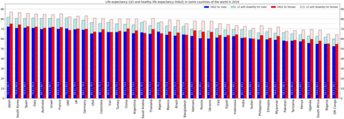
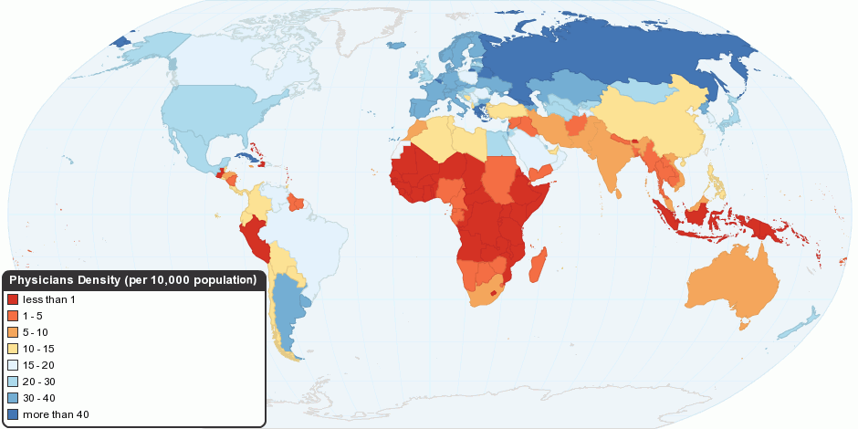

# DETERMINANTES SOCIAIS DA SAÚDE

Determinantes Sociais da Saúde (DSS) são condições sociais, econômicas, culturais, ambientais, políticas e territoriais que influenciam o processo saúde-doença. Em Medicina Preventiva e Social, adoecimento não é explicado apenas por agentes biológicos ou escolhas individuais; renda, moradia, escolaridade, raça/cor, gênero, trabalho, saneamento, segurança alimentar e acesso aos serviços modulam risco, prognóstico e capacidade de cuidado.

A abordagem clínica e coletiva deve identificar fatores individuais, familiares, comunitários e estruturais. Tratar pneumonia em criança que vive em moradia úmida, sem ventilação e sem saneamento, sem atuar sobre o contexto, reduz a efetividade do cuidado e favorece recorrência.

*Figura 1 - Expectativa de vida saudável (HALE) por região e sexo, ilustrando diferenças associadas às condições sociais, econômicas e territoriais. Fonte: Lady3mlnm/OMS, CC0 | Wikimedia Commons*

## O Conceito e a Evolução Histórica

Determinantes Sociais da Saúde

Estruturais: renda, educação, ocupação, raça/cor, gênero, território, políticas públicas
 ↓
Intermediários: moradia, saneamento, alimentação, transporte, trabalho, redes sociais
 ↓
Sistema de saúde: acesso, acolhimento, qualidade, longitudinalidade, coordenação do cuidado
 ↓
Desfechos: adoecimento, funcionalidade, mortalidade, qualidade de vida e autonomia

Equidade significa tratar desigualmente os desiguais para reduzir iniquidades evitáveis e injustas. Portanto, políticas universais precisam ser combinadas com estratégias específicas para grupos historicamente vulnerabilizados.

*Figura 2 - Mapa global de densidade médica por 10.000 habitantes (OMS 2010). A distribuição desigual de recursos humanos em saúde é um determinante estrutural que perpetua iniquidades. Note a escassez de profissionais onde as condições de saúde mais carecem de intervenção. Fonte: ChartsBin/WHO, CC BY-SA 3.0 | Wikimedia Commons*

Determinantes Sociais da Saúde são as condições em que as pessoas nascem, crescem, vivem, trabalham e envelhecem. Essas circunstâncias são moldadas pela distribuição de dinheiro, poder e recursos em nível global, nacional e local.

A Comissão sobre Determinantes Sociais da Saúde da OMS define que a saúde é um produto social. Não é apenas ausência de doença, como já dizia a clássica definição de 1946, mas algo construído no cotidiano.

Historicamente, passamos pelo **Sanitarismo Desenvolvimentista**, uma visão que predominou no Brasil em meados do século XX. Nessa lógica, acreditava-se que a saúde da população dependia primariamente do desenvolvimento econômico do país. Se o PIB crescesse, a saúde melhoraria "por gravidade". Hoje, sabemos que isso é insuficiente. O crescimento econômico sem distribuição de renda e sem políticas sociais gera iniquidades, não saúde.

Um marco fundamental é a **Carta de Ottawa (1986)**, documento central da Promoção da Saúde. Diferentemente da prevenção centrada em doenças, a promoção foca capacitação comunitária, ambientes saudáveis e atuação sobre determinantes. A Carta de Ottawa define saúde como recurso para a vida cotidiana, não como objetivo final de viver.

## Modelos de Determinação Social

Existem várias formas de visualizar como a organização social produz adoecimento. Um modelo clássico é o de **Dahlgren e Whitehead**, que organiza os determinantes em camadas concêntricas.

- **O Centro:** Fatores biológicos individuais (idade, sexo e fatores genéticos). São os determinantes não modificáveis.

- **Primeira camada:** estilos de vida individuais, como tabagismo, dieta e atividade física. Na Saúde Coletiva, esses comportamentos não são escolhas puramente isoladas; são condicionados por renda, acesso a alimentos, segurança territorial, transporte, tempo livre, educação e ambiente.

- **A Segunda Camada:** Redes sociais e comunitárias. O apoio da vizinhança, da família e de grupos sociais protege a saúde.

- **A Terceira Camada:** Condições de vida e de trabalho. Aqui estão o saneamento básico, a habitação, o ambiente de trabalho, a educação e os serviços de saúde.

- **A Camada Externa:** Condições socioeconômicas, culturais e ambientais gerais. É o macrocontexto, as políticas macroeconômicas e o modelo de desenvolvimento do país.

Outro conceito fundamental é a **Medicina Social**, que vê a saúde-doença como um processo complexo, influenciado por fatores sociais, biológicos e políticos, e não como uma dicotomia simples. Giovanni Berlinguer, um nome que aparece em questões mais teóricas, foi um dos grandes defensores dessa visão, ligando a saúde à consciência de classe e à justiça social.

## Iniquidades e a Lei dos Cuidados Inversos

É essencial diferenciar desigualdade de iniquidade.

- **Desigualdade:** É uma diferença mensurável (ex: homens têm mais câncer de próstata que mulheres). É uma diferença biológica ou estatística.

- **Iniquidade:** É uma desigualdade **injusta e evitável**. Se uma criança negra na periferia tem cinco vezes mais chance de morrer por diarreia do que uma criança branca em um bairro nobre, isso é uma iniquidade.

A **Equidade** é o princípio do SUS que busca tratar desigualmente os desiguais, priorizando os mais necessitados para reduzir essas disparidades. É dar mais para quem tem menos.

Um fenômeno clássico descrito por Julian Tudor Hart é a **Lei dos Cuidados Inversos**. Ela diz que a disponibilidade de bons cuidados médicos tende a variar inversamente com a necessidade da população atendida. Ou seja, onde as pessoas mais precisam de médico, é onde há menos médicos e pior estrutura. No Brasil, vemos isso claramente na distribuição de profissionais: temos cerca de 2,0 médicos por mil habitantes, mas eles estão concentrados nos grandes centros e no setor privado.

## Políticas Nacionais e Populações Vulnerabilizadas

O SUS não é um sistema único apenas no nome, ele precisa ser único na entrega. Para isso, foram criadas políticas específicas para enfrentar os DSS de grupos historicamente excluídos.

### Política Nacional de Saúde Integral da População Negra (PNSIPN)

O foco principal da política é o combate ao **racismo institucional** no SUS. Racismo institucional manifesta-se em barreiras de acesso, menor qualidade do cuidado, menor tempo de consulta, subtratamento da dor e invisibilização de necessidades específicas da população negra.

A PNSIPN prioriza doenças com maior prevalência ou carga genética nesse grupo, como a **anemia falciforme**, a hipertensão arterial e o diabetes mellitus. Uma diretriz importante da atualização de 2017 é a inclusão dos temas "Racismo e Saúde da População Negra" na formação e educação permanente dos profissionais de saúde.

**Ponto epidemiológico:** tuberculose, mortalidade materna, violência e doenças negligenciadas expressam desigualdades históricas e territoriais. A interpretação deve considerar raça/cor, etnia, território, renda e acesso ao cuidado.

### Saúde da População LGBT

A Política Nacional de Saúde Integral LGBT busca a equidade, combatendo o preconceito e garantindo o acesso. Um ponto muito cobrado é a extensão de cobertura de planos de saúde para casais homoafetivos e o direito à **hormonização para transexuais** no SUS, respeitando o nome social e a identidade de gênero.

### Saúde Indígena e Ribeirinha

A saúde indígena deve integrar as práticas tradicionais de cura com a medicina ocidental do SUS. O foco atual está na transição epidemiológica: além das doenças infectocontagiosas, há um aumento preocupante de causas externas (violência/acidentes) e Doenças Crônicas Não Transmissíveis (DCNT).

Para as populações ribeirinhas, o determinante social mestre é o ciclo das águas (cheia/vazante). Isso causa isolamento geográfico sazonal e exige um planejamento de saúde específico, como as Unidades Básicas de Saúde Fluviais. O conhecimento tradicional desses povos é fruto da vivência, das relações sociais e da interação direta com o meio ambiente.

## Saneamento Básico e Doenças Relacionadas

O saneamento é o pilar mais básico da saúde pública. Ele envolve quatro eixos: água tratada, esgotamento sanitário, manejo de resíduos sólidos (lixo) e drenagem de águas pluviais.

Em 2015, o Brasil tratava apenas cerca de 42,67% do seu esgoto. Esse dado é frequentemente usado em provas para mostrar o abismo que ainda temos. A falta de saneamento impacta diretamente na mortalidade infantil e na prevalência de doenças como as arboviroses, as parasitoses intestinais e a leptospirose.

| Componente do Saneamento | Impacto Direto na Saúde |
| --- | --- |
| Água Tratada | Redução de diarreias, cólera, hepatite A. |
| Esgoto Coletado/Tratado | Controle de geo-helmintoses e poluição de mananciais. |
| Coleta de Lixo | Controle de vetores (ratos, moscas, mosquitos). |
| Drenagem Pluvial | Prevenção de inundações e leptospirose. |

## Violência como Problema de Saúde Pública

A violência não é mais um caso de "polícia", é um caso de "política de saúde". Ela é um determinante social que impacta a mortalidade jovem e a qualidade de vida.

A **Notificação Compulsória de Violência** é um tema quente. Quando se trata de violência doméstica, sexual ou outras violências contra mulheres, crianças e idosos, a notificação é obrigatória.

**Ponto de atenção:** no caso de violência contra a mulher, a notificação para fins de vigilância epidemiológica deve ser feita ao sistema de saúde. A comunicação externa para autoridade policial possui regras específicas, mas a notificação em saúde é obrigatória conforme a natureza do caso, com prioridade para situações de violência sexual e tentativa de suicídio.

## Promoção da Saúde e Prevenção

A diferença entre promoção e prevenção fica clara quando se observa o objetivo da ação.

### Níveis de Prevenção (Leavell & Clark)

- **Prevenção Primordial:** É o nível mais "raiz". Visa evitar o surgimento de padrões de vida sociais, econômicos e culturais que contribuam para o aumento do risco de doenças. Exemplo: Leis que proíbem o fumo em locais fechados ou impostos sobre bebidas açucaradas.

- **Prevenção Primária:** Atua no período pré-patogênico. O objetivo é remover causas e fatores de risco de um indivíduo ou grupo antes que a doença ocorra. Exemplos: Vacinação, uso de preservativos, orientar dieta e exercício.

- **Prevenção Secundária:** A doença já existe, mas está no início (fase assintomática ou clínica inicial). O objetivo é o diagnóstico precoce e tratamento imediato para evitar sequelas. Exemplos: Rastreamento de câncer de colo de útero (Papanicolau), mamografia, teste do pezinho.

- **Prevenção Terciária:** A doença já causou danos. O objetivo é a reabilitação e a redução de incapacidades. Exemplo: Fisioterapia pós-AVC, reabilitação cardíaca pós-IAM.

- **Prevenção Quaternária:** É a detecção de indivíduos em risco de intervenções médicas excessivas (sobrediagnóstico e sobretratamento). O objetivo é evitar a iatrogenia. Exemplo: Não pedir PSA para um paciente de 90 anos com múltiplas comorbidades.

| Nível de Prevenção | Foco Principal | Exemplo Clássico |
| --- | --- | --- |
| Primordial | Sociedade/Ambiente | Ciclovias para evitar sedentarismo. |
| Primária | Fator de Risco | Vacinação contra HPV. |
| Secundária | Doença Precoce | Rastreamento de Câncer de Mama. |
| Terciária | Sequelas | Fisioterapia motora. |
| Quaternária | Iatrogenia | Evitar exames desnecessários. |

## Alimentação e Nutrição (PNAN)

A Política Nacional de Alimentação e Nutrição (PNAN) foca na melhoria das condições de alimentação da população. Ela lida com o "duplo ônus" da má nutrição: a persistência da desnutrição em bolsões de pobreza e a epidemia de obesidade e DCNT.

O diagnóstico situacional é feito pelo **SISVAN** (Sistema de Vigilância Alimentar e Nutricional). O combate às carências nutricionais exige ações básicas de saúde somadas a educação e desenvolvimento socioeconômico. A obesidade, especificamente, é tratada como um problema social complexo que exige abordagem intersetorial (saúde, educação, agricultura).

## Educação Popular em Saúde

Inspirada em **Paulo Freire**, a Educação Popular em Saúde foge do modelo "palestra" onde o médico fala e o paciente escuta. Ela se baseia no diálogo, na valorização do saber popular e na inserção da dinâmica local para o empoderamento. O objetivo é que a comunidade entenda seus determinantes e se organize para mudá-los. Isso é a base do **Controle Social** no SUS.

## O Contexto Internacional: ODS e Obamacare

A comparação entre sistemas de saúde ajuda a compreender o papel do financiamento e da universalidade.

Os **Objetivos de Desenvolvimento Sustentável (ODS)** da ONU para 2030 incluem metas como a erradicação da pobreza, fome zero e saúde e bem-estar. Eles são, essencialmente, uma agenda global para intervir nos determinantes sociais da saúde.

Sobre o **Affordable Care Act (Obamacare)**: Cuidado! Ele não transformou os EUA em um sistema público universal como o SUS. O Obamacare visou expandir a cobertura de saúde principalmente via subsídios para planos privados e expansão do Medicaid (para os muito pobres). O sistema americano continua sendo predominantemente privado e fragmentado.

## Financiamento e Gasto em Saúde no Brasil

Apesar de termos um sistema universal, o financiamento é um desafio. Mais de 60% dos gastos totais com saúde no Brasil são gastos privados (planos de saúde e gastos do próprio bolso). Isso gera uma distorção: o SUS atende 75% da população com menos de 45% dos recursos totais do setor.

O **Pacto de Gestão do SUS** buscou descentralizar e dar mais autonomia para os municípios, mas a subfinanciamento crônico e a "hegemonia às avessas" (termo de Paim, 2013) mostram como a participação privada e o desenho do financiamento podem restringir acesso, aumentar gasto direto das famílias e reduzir a efetividade do direito universal à saúde.

## Como Transformar DSS em Conduta

A identificação de determinantes sociais deve gerar plano terapêutico ampliado, não apenas registro no prontuário. A APS é o ponto privilegiado para longitudinalidade, coordenação do cuidado e articulação intersetorial.

| Determinante identificado | Impacto em saúde | Conduta clínica e coletiva |
| --- | --- | --- |
| Insegurança alimentar | Piora de diabetes, hipertensão, desenvolvimento infantil | plano alimentar realista, acionar assistência social, programas de renda/alimentação, acompanhamento nutricional |
| Moradia precária | Asma, pneumonias, tuberculose, acidentes domésticos | visita domiciliar, vigilância ambiental, orientação familiar, articulação com CRAS/habitação quando disponível |
| Racismo institucional | Atraso diagnóstico, menor vínculo, subtratamento da dor | escuta qualificada, registro adequado de raça/cor, educação permanente, monitoramento de indicadores por raça/cor |
| Violência | Trauma, sofrimento mental, gestação de risco, uso de substâncias | acolhimento, avaliação de risco, notificação, plano de segurança e rede de proteção |
| Baixa escolaridade/letramento | Erro no uso de medicamentos, baixa adesão | linguagem simples, demonstração do uso, material visual, checagem de compreensão |

Fluxo prático na consulta

Problema clínico recorrente
 ↓
Perguntar por moradia, renda, alimentação, trabalho, violência, rede de apoio e acesso ao serviço
 ↓
Classificar: determinante individual, familiar, territorial ou estrutural
 ↓
Plano: cuidado clínico + equipe multiprofissional + rede intersetorial
 ↓
Reavaliar adesão, barreiras e desfechos ao longo do tempo

## Exemplos Práticos de DSS na Clínica

**Cenário 1:** paciente de 45 anos, hipertenso e diabético, com dificuldade persistente de controle glicêmico apesar de prescrição adequada. A investigação dos DSS identifica desemprego, insegurança alimentar e predomínio de alimentos ultraprocessados de baixo custo no território.

- **Conduta:** Não adianta apenas trocar a insulina. É necessário acionar a rede de assistência social (CRAS), verificar a elegibilidade para o BPC (Benefício de Prestação Continuada) e buscar estratégias de segurança alimentar na comunidade.

**Cenário 2:** mulher de 28 anos com cefaleia, dor abdominal crônica e equimoses em diferentes estágios de cicatrização. Durante atendimento acolhedor e sigiloso, relata agressões recorrentes pelo parceiro.

- **Conduta:** além do tratamento sintomático, deve-se realizar notificação compulsória em saúde quando indicada, avaliar risco imediato, construir plano de segurança e acionar equipe multiprofissional, psicologia, serviço social e rede de proteção conforme o caso.

## Síntese Clínica

- **Determinantes Sociais da Saúde (DSS):** São as condições de vida e trabalho que impactam a saúde. Não confunda com fatores puramente biológicos.

- **Modelo de Dahlgren e Whitehead:** Decore as camadas. O centro é imutável (biologia), as camadas externas são políticas e sociais.

- **Equidade:** Tratar desigualmente os desiguais. É o princípio que justifica políticas para negros, LGBTs e indígenas.

- **Carta de Ottawa (1986):** Marco da Promoção da Saúde. Foca no empoderamento e na intersetorialidade.

- **Lei dos Cuidados Inversos:** Quem mais precisa de saúde é quem menos tem acesso a ela.

- **PNSIPN:** Foco no combate ao racismo institucional e na anemia falciforme.

- **Violência contra a mulher:** Notificação compulsória imediata (24h para sexual/suicídio) e não há exceção de sigilo para a vigilância.

- **Saneamento Básico:** Água, esgoto, lixo e drenagem. O Brasil ainda trata menos da metade do esgoto.

- **Prevenção quaternária:** evitar excesso de intervenção médica, sobrediagnóstico, sobremedicalização e iatrogenia.

- **Prevenção Primordial:** Evitar que os fatores de risco apareçam na sociedade (ex: taxar o tabaco).

- **RIPSA:** Rede Interinstitucional de Informações para a Saúde. Fornece dados essenciais para o diagnóstico de saúde no Brasil. Não é um órgão de aperfeiçoamento esporádico, mas de articulação contínua.

- **Tuberculose:** Doença socialmente determinada. Mais comum em indígenas, seguidos por negros.

- **Obamacare:** Expansão de seguros privados e Medicaid, não é um sistema público universal.

- **Educação Popular (Paulo Freire):** Diálogo e saber popular. O oposto da educação bancária (apenas transmitir informações).

- **Redução de Danos:** No alcoolismo e drogas, o foco é melhorar a qualidade de vida e reduzir riscos, mesmo que a abstinência não seja alcançada de imediato.

- **Mortalidade Infantil:** Reduzida drasticamente por ações de APS, vacinação, saneamento e licença-maternidade. 🧠

 Cópia offline para consulta pessoal.
 Fonte original:
 [https://www.medevo.com.br/material-apoio/ler/b7b1850c-3775-4f79-bd30-3c997c456c20](https://www.medevo.com.br/material-apoio/ler/b7b1850c-3775-4f79-bd30-3c997c456c20)
