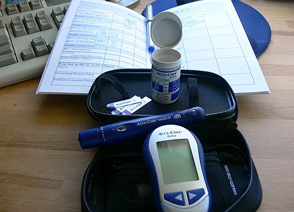

# DIABETES GESTACIONAL

Para entender o diabetes gestacional (DMG), você precisa primeiro esquecer a ideia de que a gestação é um estado de equilíbrio perfeito. Na verdade, a gestação é um "teste de esforço" para o pâncreas da mulher. Se ela já tem uma predisposição latente, a gravidez vai desmascarar essa condição.

*Figura 1 - Kit de monitorização glicêmica utilizado por gestante com DMG, incluindo glicosímetro, lancetador e fitas reagentes. O controle glicêmico rigoroso é fundamental para prevenir macrossomia fetal e complicações ao nascimento. Fonte: Jessica Merz, CC BY 2.0 | Wikimedia Commons*

## Fisiopatologia: O Porquê da Resistência Insulínica

*Figura 2 - Mecanismo de ação da insulina: ligação ao receptor → translocação de GLUT-4 → captação de glicose → glicólise e síntese de glicogênio. No DMG, os hormônios placentários (hPL, progesterona, cortisol) aumentam a resistência periférica a este processo, exigindo maior produção pancreática materna. Fonte: Meiquer, CC BY-SA 3.0 | Wikimedia Commons*

Muitos alunos decoram que o diabetes gestacional surge no segundo trimestre, mas poucos entendem o motivo biológico. O grande vilão, ou melhor, o grande protagonista aqui é a placenta.

A placenta produz hormônios que são "contrainsulínicos". O principal deles, e que despenca em provas, é o Hormônio Lactogênio Placentário (hPL). Além dele, temos o cortisol, a prolactina e a progesterona. O objetivo fisiológico desses hormônios é nobre: eles querem garantir que a glicose sobre no sangue materno para que ela possa atravessar a placenta e alimentar o feto.

A glicose atravessa a placenta por **difusão facilitada**. Guarde esse termo. O feto não "chupa" a glicose ativamente, ela passa a favor de um gradiente. Se a mãe está hiperglicêmica, o feto também estará.

Aqui entra o ponto crucial: a insulina materna NÃO atravessa a placenta. Por volta da 10ª a 12ª semana, o pâncreas fetal começa a funcionar. Se o feto recebe muita glicose da mãe, o pâncreas dele reage produzindo muita insulina. A insulina é o principal hormônio de crescimento fetal. É por isso que o bebê de mãe diabética fica macrossômico. Ele não é apenas "gordinho", ele tem hiperplasia e hipertrofia celular estimuladas pelo excesso de insulina (hiperinsulinismo fetal).

**Dica de Prova:** As bancas adoram perguntar sobre a diferença entre o Diabetes Mellitus Pré-gestacional (Tipo 1 ou Tipo 2 prévios) e o Diabetes Gestacional (DMG). O DMG surge tipicamente após a 20ª semana, quando a carga hormonal placentária atinge seu pico. Por isso, o DMG raramente causa malformações fetais, pois a organogênese já terminou quando a hiperglicemia se instalou. Se a questão fala em "defeito de fechamento de tubo neural" ou "síndrome de regressão caudal", pense em diabetes pré-gestacional mal controlado no momento da concepção.

## Rastreamento e Diagnóstico: Onde a maioria se confunde

O diagnóstico de diabetes na gestação segue um fluxograma rígido no Brasil, baseado nas recomendações da FEBRASGO e da Sociedade Brasileira de Diabetes (SBD). O erro mais comum dos alunos é confundir os valores de "Diabetes Overt" (diabetes franco) com "Diabetes Gestacional".

### O Primeiro Passo: Glicemia de Jejum no 1º Trimestre

Toda gestante, na primeira consulta de pré-natal, deve colher uma glicemia de jejum. O resultado aqui nos leva a três caminhos:

- **Glicemia de Jejum < 92 mg/dL:** Resultado normal para o momento. Mas atenção: isso não exclui DMG futuro. Essa paciente deve ser reavaliada entre 24 e 28 semanas com o TOTG 75g.

- **Glicemia de Jejum entre 92 e 125 mg/dL:** Diagnóstico direto de **Diabetes Mellitus Gestacional (DMG)**. Não precisa de segundo exame, não precisa de TOTG. Se deu 92, é DMG.

- **Glicemia de Jejum ≥ 126 mg/dL:** Diagnóstico de **Diabetes Mellitus Pré-existente (ou Overt Diabetes)**. Essa paciente já era diabética antes de engravidar e não sabia.

**Exemplo Clínico:** Imagine uma paciente de 28 anos, obesa, que na 8ª semana de gestação apresenta glicemia de jejum de 94 mg/dL. O que você faz? Você já fecha o diagnóstico de DMG e inicia o tratamento (MEV). Não espere as 24 semanas.

### O Segundo Passo: O TOTG 75g (24-28 semanas)

Para as pacientes que tiveram a glicemia de jejum inicial normal (< 92), solicitamos o Teste Oral de Tolerância à Glicose com 75g de dextrosol entre a 24ª e 28ª semana. Este é o período de maior resistência insulínica.

**Tabela 1: Critérios Diagnósticos no TOTG 75g (Basta UM valor alterado)**

| Tempo | Valor de Referência (mg/dL) | Diagnóstico se ≥ |
| --- | --- | --- |
| Jejum | < 92 | Diabetes Gestacional |
| 1 hora | < 180 | Diabetes Gestacional |
| 2 horas | < 153 | Diabetes Gestacional |

**Pegadinha de Prova:** Se no TOTG de 24 semanas o jejum vier 127 mg/dL ou o valor de 2 horas vier ≥ 200 mg/dL, o diagnóstico é de Diabetes Overt (franco), e não apenas gestacional.

**Cuidado:** Algumas bancas ainda citam o critério de Carpenter-Coustan (que usa 100g de glicose e exige dois valores alterados). No Brasil, para a residência, foque no critério da IADPSG/SBD/FEBRASGO: 75g de glicose e **apenas um valor alterado** já faz o diagnóstico.

## Manejo Terapêutico: A Escada do Tratamento

Uma vez diagnosticada, o objetivo é um só: manter a glicemia da mãe dentro de metas estritas para evitar que o feto receba excesso de glicose. Como diz o Dr. Will nas discussões do MedEvo, "o tratamento do diabetes gestacional é, na verdade, a prevenção das complicações neonatais".

### 1. Medidas Não Farmacológicas (MEV)

Cerca de 70% a 80% das gestantes com DMG conseguem o controle apenas com Mudança de Estilo de Vida.

- **Dieta:** Não é dieta restritiva de fome. A gestante precisa de calorias para o crescimento fetal. A recomendação é de 30 a 35 kcal/kg de peso ideal. O segredo é o fracionamento (5 a 6 refeições por dia) e a substituição de carboidratos simples por complexos (fibras).

- **Atividade Física:** Se não houver contraindicação obstétrica (como risco de parto prematuro ou placenta prévia), a gestante deve fazer exercícios aeróbicos de intensidade moderada (caminhada, natação, hidroginástica) por pelo menos 150 minutos por semana, distribuídos em 3 a 5 dias.

### 2. Monitoramento Glicêmico

A paciente deve realizar o automonitoramento (destro) em casa. O esquema clássico é o perfil de 4 pontos: Jejum, 1 hora após o café, 1 hora após o almoço e 1 hora após o jantar. Algumas diretrizes aceitam 2 horas pós-prandial, mas a 1 hora é mais sensível para captar o pico glicêmico na gestante.

**Tabela 2: Metas Glicêmicas na Gestação**

| Momento | Meta (mg/dL) |
| --- | --- |
| Jejum | < 95 |
| 1 hora pós-prandial | < 140 |
| 2 horas pós-prandial | < 120 |

### 3. Tratamento Farmacológico

Se após 1 a 2 semanas de dieta e exercícios as metas não forem atingidas (geralmente se > 20-30% dos valores estiverem alterados), devemos iniciar a medicação.

- **Insulina:** É o padrão-ouro. Não atravessa a placenta e é altamente titulável. Iniciamos geralmente com uma dose total de 0,3 a 0,5 UI/kg/dia. Usamos a combinação de insulina de ação intermediária (NPH) e ação rápida (Regular ou análogos como Lispro/Aspart).

- **Metformina:** A FEBRASGO e a SBD já aceitam o uso da metformina em casos selecionados (pacientes com forte resistência insulínica ou que se recusam a usar insulina), mas a insulina continua sendo a primeira escolha. A metformina atravessa a placenta, embora não tenha sido demonstrado teratogenicidade.

**Dica de Manejo:** Se a paciente já usava metformina para DM2 antes de engravidar, a conduta atual é manter a medicação e monitorar. Se o controle fugir da meta, adicionamos insulina.

## Repercussões Materno-Fetais: O que cai na prova

Aqui é onde as bancas de pediatria e obstetrícia se cruzam. Você precisa saber o que acontece com a mãe e o que acontece com o bebê.

### Complicações Maternas

- **Pré-eclâmpsia:** Existe uma associação íntima entre diabetes e síndromes hipertensivas.

- **Polidramnia:** A hiperglicemia fetal causa diurese osmótica no feto. O bebê urina mais, aumentando o volume de líquido amniótico.

- **Candidíase de repetição:** O excesso de glicose altera o pH vaginal e favorece o crescimento de fungos.

- **Risco de DM2 no futuro:** O DMG é um preditor fortíssimo de que essa mulher terá diabetes tipo 2 em 10 a 20 anos.

### Complicações Fetais e Neonatais

- **Macrossomia:** Definida como peso ao nascer ≥ 4.000g. O excesso de insulina faz o feto crescer, especialmente o tronco e os ombros. Isso leva à **distócia de ombros** (biacromial) durante o parto.

- **Hipoglicemia Neonatal:** É a complicação mais comum no pós-parto imediato. O bebê estava acostumado com muita glicose e produzindo muita insulina. Quando o cordão é cortado, a glicose para de vir, mas a insulina dele continua alta por algumas horas. Resultado: a glicose dele despenca.

- **Hipocalcemia e Hiperbilirrubinemia:** O mecanismo é multifatorial, envolvendo atraso na maturação enzimática e policitemia (o feto diabético consome mais oxigênio e produz mais EPO, gerando mais hemácias que, ao serem destruídas, causam icterícia).

- **Síndrome do Desconforto Respiratório (SDR):** A insulina alta no feto inibe a produção de surfactante pelos pneumócitos tipo II. Por isso, o bebê de mãe diabética pode ter pulmão imaturo mesmo sendo a termo.

- **Hipertrofia Septal Assimétrica:** O excesso de insulina pode causar um espessamento do septo cardíaco, levando a uma cardiomegalia funcional.

**Erro Comum:** Achar que DMG causa macrocefalia. Pelo contrário, a macrossomia do diabetes é "assimétrica", poupando o crescimento cerebral e focando no depósito de gordura abdominal e escapular.

## Acompanhamento Obstétrico e Vitalidade Fetal

Gestantes com DMG bem controlado com dieta podem seguir o protocolo de pré-natal de baixo risco até as 40 semanas. No entanto, se a paciente usa insulina ou tem controle difícil, o acompanhamento deve ser mais rigoroso.

- **Ultrassonografia:** Avaliar o crescimento fetal e o volume de líquido amniótico. Se a circunferência abdominal fetal estiver acima do percentil 75 na ultrassonografia entre 28-32 semanas, isso sugere que o controle glicêmico não está sendo eficaz, mesmo que as pontas de dedo da mãe pareçam normais.

- **Vitalidade:** Cardiotocografia e Perfil Biofísico Fetal (PBF) são indicados a partir de 32-34 semanas em pacientes em uso de insulina.

- **Maturação Pulmonar:** Se houver necessidade de parto prematuro eletivo, a avaliação da maturidade pulmonar pode ser feita via amniocentese, pesquisando o **fosfatidil glicerol** no líquido amniótico (padrão-ouro para diabéticas).

## O Momento do Parto: Quando e Como?

A via de parto é de indicação obstétrica. O diabetes por si só não é indicação de cesárea. No entanto, se o peso estimado fetal for > 4.500g (ou > 4.000g em alguns protocolos), a cesárea eletiva deve ser discutida para evitar a distócia de ombros.

**Resolução da Gestação:**

- **DMG em dieta (A1):** Aguardar até 40 semanas.

- **DMG em insulina (A2):** Geralmente entre 38 e 39 semanas.

- **DMG mal controlado ou com vasculopatia:** Considerar interrupção entre 37 e 38 semanas.

**Manejo Intraparto:**
Durante o trabalho de parto, queremos manter a glicemia materna entre 70 e 110 mg/dL. Se a paciente estiver em uso de insulina NPH, no dia do parto (seja indução ou cesárea), a dose deve ser reduzida ou suspensa, e o controle deve ser feito com insulina regular conforme a necessidade (esquema móvel).

## Puerpério: A "Cura" Imediata

Assim que a placenta é retirada, a fonte dos hormônios contrainsulínicos desaparece. A resistência insulínica cai drasticamente em minutos.

**Conduta no Pós-parto:**

- **Suspender a insulina:** Na grande maioria das pacientes com DMG, a insulina deve ser suspensa imediatamente após o parto.

- **Dieta livre:** Não há necessidade de restrição rigorosa no puerpério imediato.

- **Monitorar glicemia:** Checar a glicemia capilar nas primeiras 24-48 horas para garantir que a paciente não era, na verdade, uma DM2 não diagnosticada.

**O Re-teste (Obrigatório):**
Toda mulher que teve DMG deve realizar um novo TOTG 75g entre 6 e 12 semanas após o parto. Não adianta fazer glicemia de jejum simples; precisamos do teste de sobrecarga para avaliar se ela permaneceu diabética, se tem intolerância à glicose ou se está curada.

**Tabela 3: Diagnóstico Pós-parto (TOTG 75g após 6-12 semanas)**

| Categoria | Jejum (mg/dL) | 2 horas pós-75g (mg/dL) |
| --- | --- | --- |
| Normal | < 100 | < 140 |
| Pré-diabetes | 100 - 125 | 140 - 199 |
| Diabetes Mellitus | ≥ 126 | ≥ 200 |

## Situações Especiais e Pegadinhas de Prova

### 1. O Limiar Renal para Glicose

Na gestação, a taxa de filtração glomerular aumenta e a reabsorção tubular de glicose diminui. Isso significa que é normal a gestante ter **glicosúria** mesmo com glicemias normais. Portanto, glicosúria no exame de urina 1 NÃO serve para diagnosticar diabetes gestacional, embora possa ser um sinal de alerta para pedir exames de sangue.

### 2. Corticosteroides para Maturação Pulmonar

Se uma gestante diabética entrar em trabalho de parto prematuro e precisar de betametasona ou dexametasona, prepare-se: a glicemia vai explodir. Os corticoides aumentam muito a resistência insulínica. Nesses casos, a dose de insulina deve ser aumentada preventivamente em 30-50% nos primeiros dias após o corticoide.

### 3. Taquipneia Transitória do Recém-Nascido (TTRN)

É muito comum em filhos de mães diabéticas, especialmente se nascidos por cesárea eletiva. O quadro clínico é de desconforto respiratório leve a moderado logo após o nascimento, com melhora em 24-48 horas. No raio-X, vemos líquido nas cissuras e hiperinsuflação. Não confunda com a Doença da Membrana Hialina (SDR), que é mais grave e tem o padrão de vidro fosco no RX.

### 4. Trombofilia e Diabetes

Embora não haja uma ligação direta na fisiopatologia, pacientes obesas e diabéticas têm maior risco de eventos tromboembólicos. Se a paciente tiver outros fatores de risco (como história prévia ou mutação MTHFR em homozigose), a profilaxia com Heparina de Baixo Peso Molecular (HBPM) pode ser necessária no puerpério por até 6 semanas.

## Resumo do Fluxo Diagnóstico Brasileiro

Para não errar nunca mais:

-

**Início do Pré-natal:** Glicemia de Jejum.

- < 92: Segue para TOTG na 24ª semana.

- 92 a 125: DMG.

- ≥ 126: Diabetes Overt (prévio).

- HbA1c ≥ 6,5%: Diabetes Overt (prévio).

-

**24ª a 28ª Semana:** TOTG 75g (para quem tinha jejum < 92).

- Jejum ≥ 92 OU 1h ≥ 180 OU 2h ≥ 153: DMG.

- Apenas UM valor alterado é suficiente.

-

**Tratamento:**

- 1ª linha: Dieta + Exercício (MEV).

- 2ª linha: Insulina (se MEV falhar em 1-2 semanas).

-

**Pós-parto:**

- Suspende insulina.

- TOTG 75g após 6 semanas.

## Pontos-Chave para Prova

- **Critérios exatos DMG:** Jejum ≥ 92, 1h ≥ 180, 2h ≥ 153 (no TOTG 75g).

- **Critério Overt Diabetes:** Glicemia de jejum ≥ 126 no 1º trimestre ou HbA1c ≥ 6,5%.

- **Hormônio Chave:** Lactogênio Placentário Humano (hPL) é o principal responsável pela resistência insulínica.

- **Malformações:** DMG NÃO aumenta risco de malformações (organogênese ocorre antes da resistência insulínica placentária). Malformação é sinal de diabetes pré-gestacional.

- **Macrossomia:** É o crescimento excessivo do tronco e ombros, aumentando risco de distócia de espáduas.

- **Surfactante:** O hiperinsulinismo fetal atrasa a maturação pulmonar; o bebê pode ter SDR mesmo a termo.

- **Primeira escolha farmacológica:** Insulina (NPH e Regular).

- **Metas Glicêmicas:** Jejum < 95, 1h pós < 140, 2h pós < 120.

- **Conduta no Pós-parto:** Suspender insulina imediatamente e realizar TOTG 75g em 6-12 semanas.

- **Polidramnia:** Causada por diurese osmótica fetal secundária à hiperglicemia.

- **O que NÃO fazer:** Não use a Hemoglobina Glicada (HbA1c) para diagnosticar Diabetes Gestacional; ela só serve para diagnosticar Diabetes Overt no 1º trimestre.

- **Pegadinha clássica:** A alternativa dirá que são necessários dois valores alterados no TOTG. Incorreto. Apenas UM valor alterado fecha o diagnóstico de DMG.

- **Complicação Neonatal:** A hipoglicemia neonatal é causada pelo hiperinsulinismo fetal persistente após a interrupção do aporte de glicose materna.

- **Fator de Risco:** Macrossomia em gestação anterior é indicação de rastreamento precoce, mesmo que a glicemia de jejum inicial seja normal.

- **Líquido Amniótico:** O padrão-ouro para avaliar maturidade pulmonar em filhos de mães diabéticas é a presença de fosfatidil glicerol.

 Cópia offline para consulta pessoal.
 Fonte original:
 [https://www.medevo.com.br/material-apoio/ler/0a39c12c-72be-4dd8-8035-e9e3b53963ea](https://www.medevo.com.br/material-apoio/ler/0a39c12c-72be-4dd8-8035-e9e3b53963ea)
