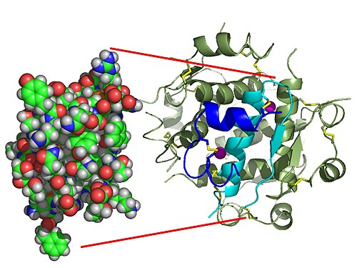
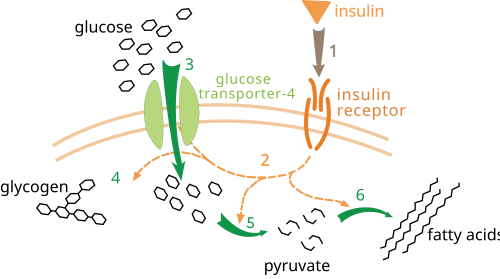

# DIABETES MELLITUS (DM)

Diabetes mellitus é um distúrbio metabólico heterogêneo caracterizado por **hiperglicemia crônica** decorrente de defeito na secreção de insulina, na ação da insulina ou em ambos. Em prova, não pense apenas em “açúcar alto”: o principal impacto clínico do DM está no risco **cardiovascular, renal, neurológico e microvascular**.

*Figura 1 - Estrutura tridimensional do monômero de insulina, hormônio produzido pelas células beta pancreáticas. Sua deficiência absoluta é típica do DM1, enquanto resistência insulínica e falência progressiva da célula beta predominam no DM2. O peptídeo C ajuda a estimar produção endógena. Fonte: Isaac Yonemoto, CC BY 2.5 | Wikimedia Commons*

## 1) Classificação

*Figura 2 - Ação da insulina no metabolismo da glicose: ligação ao receptor, sinalização intracelular, translocação de GLUT-4 e captação de glicose, síntese de glicogênio, glicólise e lipogênese. No DM2, a resistência a essa via contribui para hiperglicemia. Fonte: XcepticZP, Domínio Público | Wikimedia Commons*

### DM tipo 1

- Destruição das células beta pancreáticas, geralmente autoimune.

- Deficiência **absoluta** de insulina.

- Marcadores: anti-GAD65, anti-IA2, anti-ZnT8 e anti-insulina.

- Peptídeo C baixo ou indetectável.

- Quadro típico: jovem, emagrecimento, poliúria, polidipsia, cetose ou cetoacidose.

### DM tipo 2

- Resistência à insulina associada à falência progressiva da célula beta.

- É a forma mais comum de DM.

- Pode evoluir de hiperinsulinemia compensatória para hiperglicemia sustentada e necessidade de combinação de fármacos ou insulina.

### LADA

- Diabetes autoimune latente do adulto.

- Pode parecer DM2 no início, mas há autoimunidade, geralmente com anti-GAD positivo.

- Evolui mais rapidamente para necessidade de insulina.

### MODY

- Diabetes monogênico, geralmente autossômico dominante.

- Suspeitar em início jovem, forte história familiar em gerações sucessivas, ausência de obesidade importante e pouca resistência insulínica.

### Diabetes secundário

Causas possíveis: pancreatite crônica, neoplasia pancreática, fibrose cística, Cushing, acromegalia, corticoides, antipsicóticos, imunossupressores e pós-transplante.

## 2) Diagnóstico em não gestantes

| Exame | Normal | Pré-diabetes | Diabetes mellitus |
| --- | --- | --- | --- |
| Glicemia de jejum | < 100 mg/dL | 100 a 125 mg/dL | ≥ 126 mg/dL |
| TOTG 75 g, 2h | < 140 mg/dL | 140 a 199 mg/dL | ≥ 200 mg/dL |
| HbA1c | < 5,7% | 5,7 a 6,4% | ≥ 6,5% |
| Glicemia casual + sintomas clássicos | - | - | ≥ 200 mg/dL |

### Confirmação diagnóstica

- Em assintomáticos, é necessário confirmar com **2 resultados alterados**, no mesmo exame repetido ou em exames diferentes.

- Sintomas clássicos de hiperglicemia com glicemia casual ≥ 200 mg/dL fecham diagnóstico.

- Pela SBD, glicemia de jejum ≥ 126 mg/dL e HbA1c ≥ 6,5% na **mesma amostra** podem confirmar DM.

### Quando a HbA1c pode enganar

A HbA1c reflete aproximadamente os últimos 2 a 3 meses, mas depende da sobrevida das hemácias. Pode ser menos confiável em:

- anemia hemolítica;

- hemoglobinopatias;

- transfusão recente;

- gestação;

- doença renal avançada;

- situações com alteração importante do turnover eritrocitário.

Nesses casos, priorize glicemias plasmáticas, TOTG e, quando disponível, marcadores como frutosamina ou albumina glicada para acompanhamento.

### Glicemia de 1 hora no TOTG

O TOTG 75 g com glicemia de 1 hora tem sido proposto para detecção precoce de disfunção glicêmica:

- 1h ≥ 155 mg/dL: maior risco metabólico;

- 1h ≥ 209 mg/dL: sugere DM e exige confirmação.

Ainda não substitui os critérios clássicos mais cobrados em prova.

## 3) Rastreamento

Em adultos assintomáticos:

- rastrear a partir de **35 anos**;

- rastrear antes se houver sobrepeso/obesidade associado a fatores de risco;

- se exame normal, repetir em geral a cada 3 anos;

- se pré-diabetes, repetir anualmente.

Fatores de risco importantes: história familiar em primeiro grau, hipertensão, dislipidemia, doença cardiovascular, sedentarismo, síndrome dos ovários policísticos, diabetes gestacional prévio e sinais de resistência insulínica.

## 4) Fisiopatologia do DM2: octeto ominoso

O DM2 envolve múltiplos defeitos metabólicos:

- redução da secreção de insulina;

- aumento do glucagon;

- aumento da produção hepática de glicose;

- redução da captação periférica de glicose;

- aumento da lipólise;

- redução do efeito incretínico;

- aumento da reabsorção renal de glicose;

- disfunção do sistema nervoso central relacionada a apetite e resistência insulínica.

Esse raciocínio ajuda a entender as classes farmacológicas.

## 5) Avaliação inicial

Na primeira avaliação, organize o raciocínio em quatro perguntas:

-

Qual o tipo provável de diabetes?

- Fenótipo, idade, peso, história familiar, cetose, autoanticorpos e peptídeo C quando houver dúvida.

-

Há doença cardiovascular, insuficiência cardíaca ou DRC?

- Isso muda a escolha do tratamento.

-

Há complicações crônicas?

- Avaliar PA, IMC, circunferência abdominal, pulsos, sensibilidade dos pés, retina e sintomas neuropáticos.

-

Quais exames iniciais são necessários?

- HbA1c, glicemia, creatinina/eTFG, relação albumina/creatinina urinária, lipidograma, TGO/TGP e exames conforme contexto clínico.

## 6) Tratamento não farmacológico

- Atividade física: pelo menos 150 min/semana de exercício aeróbico moderado, associado a treino resistido 2 a 3 vezes por semana.

- Evitar mais de 2 dias consecutivos sem exercício.

- Perda ponderal: alvo inicial de 5 a 10% em pacientes com excesso de peso.

- Dieta: reduzir ultraprocessados, bebidas açucaradas e açúcar livre; priorizar fibras, vegetais, proteínas adequadas e carboidratos de melhor qualidade.

- Cessação do tabagismo.

- Educação em diabetes: hipoglicemia, adesão, automonitorização quando indicada, cuidados com os pés e orientação para dias de doença.

Dica de prova: exercício melhora a captação muscular de glicose por translocação de GLUT-4 também por via independente da insulina.

## 7) Tratamento farmacológico do DM2

A atualização mais importante das diretrizes recentes é abandonar o raciocínio “metformina para todos e depois vejo”. A escolha inicial deve considerar **distância da meta de HbA1c**, sintomas, custo, risco de hipoglicemia, peso, DRC, insuficiência cardíaca e doença cardiovascular aterosclerótica.

### Regra prática: quando iniciar 1, 2 fármacos ou insulina?

| Situação inicial | Conduta sugerida |
| --- | --- |
| HbA1c próxima da meta, geralmente **< 0,5% acima da meta individual** | Monoterapia costuma ser suficiente, se não houver indicação cardiorrenal específica. |
| HbA1c **≥ 0,5% acima da meta** | Já iniciar **terapia dupla** para evitar inércia terapêutica. Ex.: meta 7%; HbA1c ≥ 7,5% → pensar em 2 fármacos. |
| Doença cardiovascular aterosclerótica, insuficiência cardíaca ou DRC | Incluir **iSGLT2 e/ou GLP-1 RA com benefício comprovado**, independentemente da HbA1c e independentemente de metformina. |
| HbA1c muito elevada, geralmente **≥ 10%**, glicemia **≥ 300 mg/dL**, sintomas catabólicos ou cetose | Considerar **insulina** desde o início, frequentemente com metformina se não contraindicada. |
| Obesidade com necessidade de grande perda ponderal | Preferir GLP-1 RA potente ou agonista duplo GIP/GLP-1, se disponível e adequado. |

**Como memorizar:**

- “A1c pouco acima” → 1 droga pode bastar.

- “A1c 0,5% acima da meta” → comece com 2.

- “A1c ≥ 10%, glicose ≥ 300 ou catabolismo” → pense em insulina.

- “Coração/rim manda mais que glicose” → iSGLT2/GLP-1 RA entram pelo benefício cardiorrenal.

### Metformina

- Ainda é excelente base para muitos pacientes com DM2: barata, eficaz, baixo risco de hipoglicemia e possível benefício metabólico.

- Reduz produção hepática de glicose e melhora sensibilidade insulínica.

- Pode causar intolerância gastrointestinal e deficiência de vitamina B12 com uso prolongado.

- Função renal:

- eTFG ≥ 45: pode usar;

- eTFG 30 a 44: usar com cautela, dose reduzida/monitorização; evitar iniciar em muitos protocolos;

- eTFG < 30: **contraindicada**.

- Evitar temporariamente em doença aguda grave, hipoxemia, sepse, choque, desidratação importante, contraste iodado em cenários de risco e insuficiência cardíaca instável/hospitalizada.

### Inibidores de SGLT2

Exemplos: dapagliflozina, empagliflozina, canagliflozina.

- Promovem glicosúria e natriurese.

- Preferenciais quando há **insuficiência cardíaca** ou **DRC**, quando elegíveis.

- Reduzem internação por insuficiência cardíaca e retardam progressão renal em grupos selecionados.

- Podem reduzir peso e pressão arterial.

- Efeitos adversos: candidíase genital, desidratação/hipotensão, infecção geniturinária e **cetoacidose euglicêmica**.

- **Evitar/pausar** em:

- CAD atual ou história recente/importante de CAD;

- jejum prolongado, perioperatório, doença aguda grave, desidratação, sepse;

- dieta cetogênica ou muito pobre em carboidratos;

- álcool excessivo;

- suspeita de DM1/LADA/insulinopenia relevante;

- gestação;

- eTFG abaixo do limite de uso do fármaco, conforme indicação/local.

**Sick day rule:** em doença aguda, vômitos, jejum, cirurgia ou baixa ingesta, suspender temporariamente iSGLT2 e avaliar cetonas se náuseas, dor abdominal, taquipneia ou mal-estar mesmo com glicose não muito alta.

### Agonistas do receptor de GLP-1 e agonista duplo GIP/GLP-1

Exemplos de GLP-1 RA: liraglutida, semaglutida, dulaglutida. Exemplo de agonista duplo GIP/GLP-1: tirzepatida.

- Aumentam insulina dependente de glicose, reduzem glucagon, aumentam saciedade e retardam esvaziamento gástrico.

- Úteis quando há doença cardiovascular aterosclerótica, alto risco cardiovascular ou necessidade relevante de perda de peso.

- Semaglutida/tirzepatida têm grande potência para redução de HbA1c e peso.

- Efeitos adversos: náuseas, vômitos, diarreia/constipação e doença biliar.

- **Evitar/cautela** em:

- história de pancreatite, principalmente se associada ao fármaco;

- gastroparesia importante;

- doença gastrointestinal grave;

- história pessoal/familiar de carcinoma medular de tireoide ou MEN2 para alguns agentes;

- gestação.

- Não combinar GLP-1 RA com inibidor de DPP-4: pouco ganho e custo maior.

### Outras classes

- **Sulfonilureias:** baixo custo e boa potência, mas causam hipoglicemia e ganho de peso. Evitar em idosos frágeis, DRC avançada, alto risco de hipoglicemia e alimentação irregular.

- **Inibidores de DPP-4:** baixo risco de hipoglicemia e peso neutro, porém menor potência. Não combinar com GLP-1 RA. Cautela com saxagliptina/alogliptina em insuficiência cardíaca.

- **Pioglitazona:** melhora resistência insulínica, mas causa ganho de peso, edema, fraturas e pode piorar insuficiência cardíaca. Evitar em IC sintomática, edema importante e alto risco de fratura; cautela em doença hepática.

- **Insulina:** mais potente e necessária se catabolismo, cetose/CAD, hiperglicemia grave, gestação, internação crítica ou falha terapêutica.

| Classe | Melhor perfil | Quando evitar/cuidado |
| --- | --- | --- |
| Metformina | maioria dos pacientes com DM2 | eTFG < 30, doença aguda grave, hipóxia/choque |
| iSGLT2 | DRC e insuficiência cardíaca | CAD/euglicêmica, jejum, perioperatório, DM1/LADA, desidratação |
| GLP-1 RA / GIP-GLP-1 | obesidade e ASCVD | pancreatite, gastroparesia, MEN2/CMT para alguns agentes |
| Sulfonilureia | baixo custo | hipoglicemia, idosos frágeis, DRC, alimentação irregular |
| DPP-4 | baixo risco de hipoglicemia | menor potência; não associar a GLP-1 RA; cautela saxagliptina/alogliptina em IC |
| Pioglitazona | resistência insulínica selecionada | IC, edema, fraturas, ganho de peso |

## 8) Quando iniciar insulina no DM2

Pensar em insulina se houver sinais de insulinopenia, toxicidade glicêmica ou situação em que as drogas não insulínicas não são seguras/suficientes.

### Indicações clássicas

- **Catabolismo:** perda ponderal, poliúria/polidipsia intensas, cetose, fraqueza importante.

- **Hiperglicemia sintomática importante.**

- **HbA1c ≥ 10%** ou glicemia **≥ 300 mg/dL**, especialmente se sintomático.

- Suspeita de DM1/LADA ou diabetes pancreatogênico insulinopênico.

- CAD/EHH ou internação crítica.

- Gestação quando metas não são atingidas com medidas seguras.

- Perioperatório, nutrição enteral/parenteral, uso de altas doses de corticoide ou falha de múltiplas terapias.

### Esquema inicial comum no ambulatório

- Iniciar **insulina basal**:

- NPH ao deitar ou 1-2x/dia; ou

- análogo basal.

- Dose prática: **0,1-0,2 U/kg/dia** ou 10 U/dia, titulando conforme glicemia de jejum.

- Se glicemia pós-prandial persistir elevada, associar bolus antes da principal refeição e avançar para basal-bolus conforme necessidade.

- Em muitos pacientes, manter metformina se não contraindicada. Reduzir ou suspender sulfonilureia quando intensificar insulina para reduzir hipoglicemia.

### Quando preferir GLP-1 RA antes de insulina?

Em DM2 sem catabolismo, sem cetose e sem glicemias muito extremas, GLP-1 RA/agonista duplo pode ser preferido antes da insulina por reduzir HbA1c, peso e risco de hipoglicemia. Mas se há **A1c ≥ 10%, glicose ≥ 300, sintomas catabólicos ou cetose**, a prova quer que você pense em **insulina**.

## 9) Metas glicêmicas

As metas devem ser individualizadas conforme idade, comorbidades, risco de hipoglicemia, expectativa de vida e contexto clínico.

### Adultos não gestantes

- HbA1c geral: < 7%.

- Glicemia pré-prandial: 80 a 130 mg/dL.

- Pico pós-prandial: < 180 mg/dL.

- Metas menos rígidas, como HbA1c < 8% ou mais, podem ser adequadas em idosos frágeis, pacientes com múltiplas comorbidades ou alto risco de hipoglicemia.

### Gestação e diabetes gestacional

Metas usuais para ajuste dietético e insulinoterapia:

- jejum: < 95 mg/dL;

- 1h pós-prandial: < 140 mg/dL;

- 2h pós-prandial: < 120 mg/dL.

Esses horários são especialmente úteis para decidir qual componente do tratamento ajustar:

- jejum alto: revisar ceia, atividade, dose/horário de basal ou NPH noturna;

- pós-café alto: ajustar carboidrato do café e, se necessário, insulina rápida/regular da manhã;

- pós-almoço alto: ajustar almoço e eventual bolus pré-almoço;

- pós-jantar alto: ajustar jantar e eventual bolus pré-jantar.

## 10) Complicações agudas

As duas emergências hiperglicêmicas clássicas são **cetoacidose diabética (CAD/DKA)** e **estado hiperglicêmico hiperosmolar (EHH/HHS)**. A atualização de 2024 do consenso ADA/EASD/AACE/JBDS/DTS reduziu o ponto de corte glicêmico diagnóstico da CAD e valorizou mais o **beta-hidroxibutirato**.

### Cetoacidose diabética (CAD/DKA)

Mais comum no DM1, mas também pode ocorrer no DM2, especialmente no diabetes insulinopênico, no diabetes cetose-prone, em infecção, omissão de insulina, IAM/AVC, pancreatite, corticoide e uso de iSGLT2.

Para diagnosticar CAD, os 3 componentes devem estar presentes:

| Componente | Critério atualizado |
| --- | --- |
| Diabetes/hiperglicemia | História de diabetes **ou glicose ≥ 200 mg/dL**. Atenção: pode ser euglicêmica, especialmente com iSGLT2, gestação, jejum ou álcool. |
| Cetose | **Beta-hidroxibutirato ≥ 3,0 mmol/L** ou cetonúria/cetonemia significativa se não houver beta-hidroxibutirato. |
| Acidose metabólica | pH venoso/arterial **< 7,30** e/ou bicarbonato **< 18 mmol/L**. |

**Classificação de gravidade da CAD:**

| Gravidade | Beta-hidroxibutirato | pH/bicarbonato | Estado mental |
| --- | --- | --- | --- |
| Leve | 3,0-6,0 mmol/L | pH > 7,25 a < 7,30 ou HCO3 15-18 | Alerta |
| Moderada | 3,0-6,0 mmol/L | pH 7,0-7,25 ou HCO3 10 a < 15 | Alerta/sonolento |
| Grave | > 6,0 mmol/L | pH < 7,0 ou HCO3 < 10 | Estupor/coma |

Conduta resumida:

- Cristaloide isotônico ou balanceado; em geral 500-1.000 mL/h nas primeiras 2-4 h se não houver risco de congestão.

- Dosar e repor potássio antes/durante insulina.

- Insulina regular EV, geralmente 0,1 U/kg/h, após potássio adequado.

- Quando glicose cair para < 250 mg/dL, adicionar dextrose e manter insulina até corrigir cetose/acidose.

- Investigar precipitante: infecção, omissão de insulina, IAM/AVC, pancreatite, drogas.

**Potássio é a pegadinha:**

- Se K+ **< 3,5 mmol/L**, repor potássio e **adiar insulina** até K+ > 3,5.

- Se K+ 3,5-5,0, repor durante fluidos para manter 4-5.

- Se K+ > 5,0, não repor inicialmente; monitorar frequentemente.

**Bicarbonato:** não é rotina. Considerar apenas em acidose muito grave, especialmente pH **< 7,0**, conforme protocolo.

**Resolução da CAD:** beta-hidroxibutirato < 0,6 mmol/L + pH ≥ 7,3 ou bicarbonato ≥ 18 mmol/L; idealmente glicose < 200 mg/dL. Não use apenas ânion gap/urina cetona para decidir resolução.

### Estado hiperglicêmico hiperosmolar (EHH/HHS)

Mais comum em idosos com DM2. Desenvolve-se em dias/semanas, com desidratação profunda e alteração neurológica. Infecção, AVC, IAM, cirurgia, corticoide e baixa ingesta hídrica são precipitantes comuns.

Critérios práticos:

| Componente | Critério |
| --- | --- |
| Hiperglicemia | Glicose geralmente **≥ 600 mg/dL** |
| Hiperosmolaridade | Osmolalidade efetiva/total elevada, tipicamente **> 300-320 mOsm/kg**; muitos protocolos usam osmolalidade efetiva > 300 ou total > 320 |
| Ausência de acidose importante | pH **≥ 7,30** e bicarbonato **≥ 18 mmol/L** |
| Cetose ausente ou leve | Beta-hidroxibutirato **< 3,0 mmol/L** |

Tratamento:

- **Hidratação é a prioridade inicial**; muitas vezes reduz glicose de forma importante antes mesmo da insulina.

- Corrigir osmolaridade lentamente: queda de osmolalidade cerca de 3-8 mOsm/kg/h e glicose não deve cair rápido demais.

- Insulina EV em dose menor se não houver CAD associada, frequentemente 0,05 U/kg/h.

- Se houver cetose importante/acidose, tratar como quadro misto CAD/EHH com insulina 0,1 U/kg/h.

**Diferença de prova:**

- CAD = cetose + acidose; glicose pode ser só ≥ 200 ou até normal se iSGLT2.

- EHH = glicose muito alta + hiperosmolaridade + desidratação/alteração mental, sem acidose/cetose significativa.

- Quadro misto CAD/EHH é comum e tem pior prognóstico.

## 11) Complicações crônicas

### Nefropatia diabética

- Rastrear com eTFG e relação albumina/creatinina urinária.

- Albuminúria persistente ≥ 30 mg/g sugere lesão renal.

- IECA ou BRA são indicados se houver albuminúria, especialmente com hipertensão.

- iSGLT2 deve ser considerado para proteção renal quando elegível.

### Retinopatia diabética

- DM2: rastrear ao diagnóstico.

- DM1: rastrear após alguns anos de doença, conforme protocolo e faixa etária.

- Retinopatia proliferativa: neovascularização, com risco de hemorragia vítrea e descolamento de retina.

### Neuropatia e pé diabético

- Neuropatia periférica distal simétrica é o padrão clássico: distribuição em “bota e luva”.

- Examinar pés regularmente: inspeção, pulsos, deformidades, pele, calçados e sensibilidade com monofilamento de 10 g.

- Artropatia de Charcot: pé quente, edemaciado, deformado e com pouca dor em paciente neuropático.

### Classificação de Wagner

- 0: pé em risco, sem úlcera.

- 1: úlcera superficial.

- 2: úlcera profunda até tendão ou cápsula.

- 3: úlcera profunda com abscesso ou osteomielite.

- 4: gangrena localizada.

- 5: gangrena extensa.

## 12) Diabetes na gestação

### Diabetes gestacional

Rastreamento habitual com TOTG 75 g entre 24 e 28 semanas.

Diagnóstico se qualquer um:

- jejum ≥ 92 mg/dL;

- 1h ≥ 180 mg/dL;

- 2h ≥ 153 mg/dL.

### Diabetes manifesto na gestação

Usar critérios compatíveis com diabetes fora da gestação:

- jejum ≥ 126 mg/dL;

- HbA1c ≥ 6,5%;

- glicemia casual ≥ 200 mg/dL com sintomas;

- TOTG 2h ≥ 200 mg/dL.

## 13) Pegadinhas de prova

### Hipoglicemia factícia

- Insulina alta + peptídeo C baixo: uso de insulina exógena.

- Insulina alta + peptídeo C alto: pensar em sulfonilureia ou insulinoma.

### Fenômeno do alvorecer x Somogyi

- Alvorecer: hiperglicemia matinal por aumento de GH/cortisol, sem hipoglicemia prévia.

- Somogyi: hipoglicemia de madrugada com hiperglicemia rebote pela manhã.

### Hipoglicemia grave

A definição é clínica: episódio que exige ajuda de terceiros, independentemente do valor exato da glicemia.

## Pontos-chave

- Diagnóstico: jejum ≥ 126, HbA1c ≥ 6,5%, TOTG 2h ≥ 200 ou sintomas/crise hiperglicêmica + glicemia casual ≥ 200 mg/dL.

- Em assintomáticos, confirmar com 2 testes alterados.

- Glicemia de jejum ≥ 126 e HbA1c ≥ 6,5% na mesma amostra podem confirmar DM.

- Rastreamento: a partir dos 35 anos ou antes se houver sobrepeso/obesidade com fatores de risco.

- DM2: se HbA1c está **≥ 0,5% acima da meta**, já pensar em **terapia dupla**.

- Se HbA1c **≥ 10%**, glicose **≥ 300 mg/dL**, catabolismo, cetose ou sintomas intensos: considerar **insulina**.

- Metformina é base para muitos, mas iSGLT2 e GLP-1 RA/GIP-GLP-1 podem ser priorizados conforme perfil cardiorrenal e peso.

- iSGLT2: destaque em DRC e insuficiência cardíaca; lembrar de candidíase e **cetoacidose euglicêmica**. Pausar em doença aguda, jejum, cirurgia, desidratação e suspeita de CAD.

- GLP-1 RA/GIP-GLP-1: destaque em obesidade e doença cardiovascular aterosclerótica; náuseas e doença biliar são efeitos adversos comuns; não combinar com DPP-4.

- Sulfonilureia: barata, mas causa hipoglicemia e ganho de peso; cuidado em idoso frágil e DRC.

- CAD atualizada: diabetes/hiperglicemia com glicose **≥ 200 mg/dL ou história de diabetes** + beta-hidroxibutirato **≥ 3,0 mmol/L** + pH **< 7,30** ou bicarbonato **< 18**.

- CAD grave: beta-hidroxibutirato **> 6**, pH **< 7,0** ou bicarbonato **< 10**, alteração mental.

- CAD: hidratação, potássio e insulina; se K+ **< 3,5**, corrigir antes da insulina.

- EHH: glicose geralmente **≥ 600 mg/dL**, osmolalidade elevada, desidratação importante, pouca cetose e pH **≥ 7,30**/bicarbonato **≥ 18**.

- DMG no TOTG 75 g: 92 / 180 / 153 mg/dL.

- Metas usuais na gestação: jejum < 95, 1h pós-prandial < 140 e 2h pós-prandial < 120 mg/dL.

## Referências

SOCIEDADE BRASILEIRA DE DIABETES. Diretriz da Sociedade Brasileira de Diabetes. Ed. 2025. Disponível em: [https://diretriz.diabetes.org.br/](https://diretriz.diabetes.org.br/).

SOCIEDADE BRASILEIRA DE DIABETES. Diagnóstico de diabetes mellitus. Diretriz da Sociedade Brasileira de Diabetes, 2024. Disponível em: [https://diretriz.diabetes.org.br/diagnostico-de-diabetes-mellitus/](https://diretriz.diabetes.org.br/diagnostico-de-diabetes-mellitus/).

SOCIEDADE BRASILEIRA DE DIABETES. Planejamento, metas e monitorização do tratamento do diabetes durante a gestação. Disponível em: [https://diretriz.diabetes.org.br/planejamento-metas-e-monitorizacao-do-tratamento-do-diabetes-durante-a-gestacao/](https://diretriz.diabetes.org.br/planejamento-metas-e-monitorizacao-do-tratamento-do-diabetes-durante-a-gestacao/).

AMERICAN DIABETES ASSOCIATION PROFESSIONAL PRACTICE COMMITTEE. Standards of Care in Diabetes, 2026. Diabetes Care, 2026.

INTERNATIONAL DIABETES FEDERATION. IDF Position Statement on the 1-hour plasma glucose test. Diabetes Research and Clinical Practice, 2024.

WORLD HEALTH ORGANIZATION. Diagnostic criteria and classification of hyperglycaemia first detected in pregnancy. Geneva: WHO, 2013.

 Cópia offline para consulta pessoal.
 Fonte original:
 [https://www.medevo.com.br/material-apoio/ler/439d60bb-b836-455c-9d13-d02d2d728059](https://www.medevo.com.br/material-apoio/ler/439d60bb-b836-455c-9d13-d02d2d728059)
