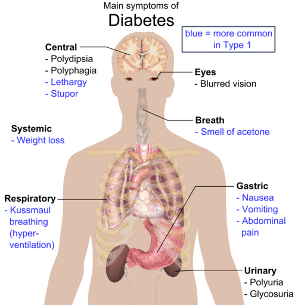
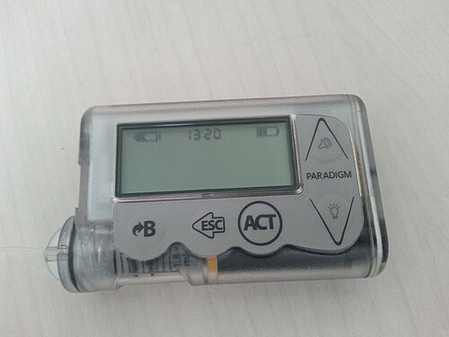

# DIABETES MELLITUS TIPO 1

O Diabetes Mellitus Tipo 1 (DM1) não é apenas uma doença de "açúcar no sangue". Para a prova de residência e para a sua vida no plantão da pediatria, você precisa entender que o DM1 é uma falência endócrina aguda ou subaguda causada por uma guerra civil imunológica. O corpo decide que as células beta do pâncreas são inimigas e as destrói sistematicamente.

Quando o paciente chega para você com os sintomas clássicos, ele já perdeu cerca de 80 a 90 por cento da sua capacidade de produzir insulina. É por isso que o quadro clínico costuma ser dramático e o tratamento é, obrigatoriamente, a reposição do que falta: insulina. Não existe DM1 tratado apenas com dieta ou comprimidos.

## Fisiopatologia

*Figura 1 - Visão geral dos principais sintomas do diabetes mellitus, incluindo poliúria, polidipsia, polifagia e perda de peso. Fonte: Mikael Häggström, Public Domain | Wikimedia Commons*
: O Porquê do Caos Metabólico

Para entender as questões de Cetoacidose Diabética (CAD), que é o tema favorito das bancas, você precisa entender o que a falta de insulina faz. A insulina é a chave que coloca a glicose para dentro da célula. Sem ela, a célula "morre de fome" em um mar de abundância (hiperglicemia).

O corpo, em pânico por estar sem energia celular, ativa mecanismos de contrarregulação. Ele libera glucagon, cortisol e adrenalina. Esses hormônios dizem ao fígado para produzir mais glicose (gliconeogênese) e ao tecido adiposo para quebrar gordura (lipólise) para gerar energia alternativa.

O problema é que a quebra excessiva de gordura gera ácidos graxos livres que, no fígado, são convertidos em corpos cetônicos (acetoacetato e beta-hidroxibutirato). Esses corpos cetônicos são ácidos. Quando eles se acumulam, o pH do sangue cai, e temos a Cetoacidose.

Além disso, a glicose alta no sangue ultrapassa o limiar renal (cerca de 180 mg/dL). A glicose sai na urina e "puxa" água com ela por osmose. É a famosa diurese osmótica. Isso explica a poliúria (urinar muito) e a polidipsia (sede excessiva para compensar a perda). Se o aluno entende que o paciente está desidratado porque está "urinando açúcar", ele entende por que a hidratação é o primeiro passo do tratamento.

## Quadro Clínico e Diagnóstico

O diagnóstico de DM1 em crianças costuma ser direto, mas as bancas adoram colocar pegadinhas no diagnóstico diferencial.

### Os 4 Ps Clássicos

- Poliúria: A criança volta a fazer xixi na cama (enurese secundária) ou vai ao banheiro muitas vezes à noite.

- Polidipsia: Sede insaciável.

- Polifagia: Fome excessiva, mas que não resulta em ganho de peso.

- Perda de peso: O corpo está literalmente se consumindo (proteólise e lipólise) por falta de insulina.

Cuidado: Em bebês, o quadro pode ser confundido com candidíase de fraldas persistente, pois a urina rica em glicose é um meio de cultura perfeito para fungos. Se vir uma candidíase cutânea que não melhora, pense em DM1.

### Critérios Diagnósticos (SBD 2024)

Para a prova, decore estes valores. Eles são universais para DM1 e DM2, mas no DM1 a apresentação costuma ser com glicemias muito mais altas.

| Exame | Normal | Pré-diabetes | Diabetes |
| --- | --- | --- | --- |
| Glicemia de Jejum (8h) | < 100 mg/dL | 100 a 125 mg/dL | ≥ 126 mg/dL |
| Glicemia 2h após TOTG (75g) | < 140 mg/dL | 140 a 199 mg/dL | ≥ 200 mg/dL |
| Hemoglobina Glicada (HbA1c) | < 5,7% | 5,7 a 6,4% | ≥ 6,5% |
| Glicemia Aleatória + Sintomas | - | - | ≥ 200 mg/dL |

Dica de ouro do MedEvo: Se o paciente tem os sintomas clássicos (os 4 Ps), você não precisa de dois exames alterados. Uma glicemia aleatória de 200 mg/dL ou mais já fecha o diagnóstico. Não perca tempo pedindo curva glicêmica (TOTG) para uma criança que está perdendo peso e urinando muito; isso é perigoso e desnecessário.

### Marcadores de Autoimunidade

Como o DM1 é autoimune, podemos dosar anticorpos. Isso é útil para diferenciar do DM2 ou do diabetes tipo MODY em casos duvidosos.

- Anti-GAD (Descarboxilase do ácido glutâmico): O mais comum e que persiste por mais tempo.

- Anti-IA2 (Antiantígeno de ilhota 2).

- Anti-Insulina (IAA).

- Anti-Znt8 (Transportador de Zinco 8).

O Peptídeo C é um subproduto da produção de insulina. No DM1, ele estará baixo ou indetectável, indicando que o pâncreas não está produzindo nada. No DM2, ele costuma estar normal ou alto no início.

## Manejo Terapêutico: A Arte da Insulinoterapia

O objetivo no DM1 pediátrico é manter a HbA1c < 7,5% (segundo a maioria das diretrizes pediátricas e a SBP, visando evitar hipoglicemias graves, embora a SBD 2024 já mencione < 7% para alguns perfis se puder ser feito com segurança).

### O Esquema Basal-Bolus

Este é o padrão-ouro. Tentamos imitar o pâncreas fisiológico.

- Insulina Basal: Mantém o nível estável de insulina durante o jejum e entre as refeições. Usamos NPH (2 a 3 vezes ao dia) ou análogos de longa duração como Glargina, Detemir ou Degludeca (1 vez ao dia).

- Insulina Bolus (Prandial): Cobre a glicose que entra com a comida. Usamos Insulina Regular ou análogos de ação ultrarrápida (Lispro, Aspart, Glulisina).

A dose total diária costuma ser de 0,7 a 1,0 UI/kg/dia em crianças pré-púberes. Na puberdade, devido ao hormônio do crescimento (que é hiperglicemiante), essa dose pode subir para 1,2 a 1,5 UI/kg/dia.

### Fenômeno de Somogyi vs. Fenômeno do Alvorecer

Isso cai muito! Ambos causam hiperglicemia de manhã cedo, mas o motivo é oposto.

- Fenômeno do Alvorecer (Dawn): Liberação fisiológica de hormônios contrarreguladores (GH, cortisol) na madrugada. A glicemia sobe porque a insulina da noite não foi suficiente. Conduta: Aumentar a dose de insulina basal da noite.

- Efeito Somogyi: É uma hiperglicemia reacional. O paciente faz uma hipoglicemia de madrugada (muitas vezes por excesso de NPH noturna), o corpo libera adrenalina e glucagon para se salvar, e a glicemia "rebota" para cima. Conduta: Reduzir a dose de insulina basal da noite ou fazer um lanche antes de dormir.

Como diferenciar? Peça para o paciente medir a glicemia às 3 da manhã. Se estiver baixa, é Somogyi. Se estiver alta ou normal, é Alvorecer.

## Cetoacidose

*Figura 2 - Fórmula estrutural do ácido beta-hidroxibutírico, um dos principais corpos cetônicos elevados na cetoacidose diabética. Fonte: Fvasconcellos, Public Domain | Wikimedia Commons*
 Diabética (CAD): O Pesadelo das Provas

A CAD é a emergência endócrina mais comum na pediatria. Muitas vezes é a "primodescompensação", ou seja, o primeiro sinal de que a criança tem diabetes.

### Critérios Diagnósticos da CAD

Você precisa de três coisas:

- Hiperglicemia: Geralmente > 200 mg/dL.

- Acidose Metabólica: pH venoso < 7,3 ou Bicarbonato < 15 mEq/L.

- Cetose: Cetonemia (preferencial) ou cetonúria positiva.

A gravidade é definida pelo pH:

- Leve: pH 7,2 a 7,3.

- Moderada: pH 7,1 a 7,19.

- Grave: pH < 7,1.

### O Manejo Passo a Passo (Protocolo SBP/ISPAD)

Aqui é onde a maioria dos alunos erra. O Dr. Will sempre avisa: a ordem dos fatores altera totalmente o produto na CAD.

#### Passo 1: Hidratação (O mais importante no início)

O paciente está desidratado. Começamos com Soro Fisiológico (SF 0,9%) 10 a 20 mL/kg em 1 a 2 horas. Se houver choque, pode repetir.
Por que SF 0,9%? Porque precisamos restaurar o volume circulante. Mas cuidado: o excesso de SF 0,9% pode causar acidose metabólica hiperclorêmica (ânion gap normal) após a resolução da CAD.

#### Passo 2: Potássio (A pegadinha fatal)

A insulina joga o potássio para dentro da célula. Além disso, a acidose faz o potássio sair da célula para o sangue (troca por H+). Então, o potássio sérico pode parecer normal ou alto, mas o potássio corporal total está sempre BAIXO.

- Se K+ < 3,3 mEq/L: NÃO comece insulina. Reponha potássio primeiro, senão o paciente faz uma arritmia fatal quando a insulina entrar.

- Se K+ entre 3,3 e 5,2 mEq/L: Comece a reposição de potássio junto com a insulina.

- Se K+ > 5,2 mEq/L: Não reponha agora, mas monitore a cada 2 horas.

#### Passo 3: Insulinoterapia

Só comece a insulina 1 a 2 horas DEPOIS de ter iniciado a hidratação.
Dose: 0,1 UI/kg/hora em bomba de infusão contínua (Insulina Regular). Em crianças muito pequenas, alguns protocolos aceitam 0,05 UI/kg/hora.
Não faça bôlus de insulina em crianças! Isso aumenta o risco de edema cerebral por queda brusca da osmolaridade.

#### Passo 4: Quando adicionar Glicose?

Quando a glicemia chegar a cerca de 250 mg/dL, o paciente ainda pode estar em acidose. Você não pode desligar a insulina, porque ela é necessária para parar a produção de corpos cetônicos (cetogênese).
Conduta: Mantenha a insulina e troque o soro para uma solução com Glicose 5% (Soro Glicosado) associada ao SF 0,45%. Isso permite manter a insulina ligada até que o pH normalize e o Bicarbonato suba para > 15.

#### Passo 5: Bicarbonato (O vilão)

O uso de bicarbonato de sódio na CAD pediátrica é quase NUNCA indicado. Ele está associado a um aumento brutal do risco de edema cerebral e hipocalemia. Só é considerado em casos de acidose extrema (pH < 6,9) com comprometimento da contratilidade cardíaca, e mesmo assim com muita cautela.

### A Complicação Temida: Edema Cerebral

Ocorre em 0,5 a 1% dos casos de CAD, mas mata muito.
Sinais de alerta: Criança que estava melhorando e de repente fica sonolenta, tem bradicardia, hipertensão (Tríade de Cushing) ou cefaleia intensa.
Tratamento: Manitol (0,5 a 1 g/kg) ou Salina Hipertônica 3% IMEDIATAMENTE. Não espere a Tomografia para tratar se a suspeita for alta.

## Hipoglicemia: A Complicação Mais Comum

Definida como glicemia < 70 mg/dL.
Sintomas adrenérgicos: Suor frio, taquicardia, tremor, fome.
Sintomas neuroglicopênicos: Confusão, sonolência, convulsão, coma.

Tratamento (Regra dos 15):

- Se consciente: 15g de carboidrato simples (ex: 1 colher de sopa de açúcar dissolvida em água ou 150ml de refrigerante comum). Espere 15 minutos e reavalie.

- Se inconsciente: Glucagon IM ou Glicose 25% EV (2 a 4 mL/kg).

## Comorbidades Autoimunes Associadas

O DM1 não gosta de andar sozinho. Como a base é a autoimunidade, o paciente tem risco aumentado para outras doenças.

- Doença Celíaca: Muito comum. Suspeite se a criança parar de crescer, tiver diarreia ou começar a ter hipoglicemias inexplicáveis (má absorção de carboidratos). Rastreio com anticorpo Anti-transglutaminase IgA.

- Tireoidite de Hashimoto: Rastrear com TSH e Anti-TPO.

- Doença de Addison: Insuficiência adrenal. Suspeite se houver hiperpigmentação de pele e hipotensão.

## Outros Tipos de Diabetes na Infância (Diagnóstico Diferencial)

Nem tudo que brilha é ouro, e nem toda poliúria é DM1.

### Diabetes Mellitus Tipo 2 (DM2)

Antigamente era doença de adulto, hoje é comum em adolescentes obesos.
Diferenciais: Acantose nigricans (sinal de resistência insulínica), obesidade, história familiar forte.
Rastreio: Iniciar aos 10 anos (ou na puberdade) se a criança tiver sobrepeso (IMC > p85) + 2 fatores de risco (história familiar, etnia de risco, acantose, HAS, dislipidemia). Repetir a cada 2 anos.

### Diabetes Insipidus (DI)

O paciente tem poliúria e polidipsia, mas a glicemia é NORMAL. O problema é o ADH (hormônio antidiurético). A urina sai muito diluída (densidade baixa < 1.005). Se houver sintomas neurológicos associados, pense em tumores como o craniofaringioma.

### Diabetes Monogênico (MODY)

Diabetes que parece tipo 2 (tem produção de insulina), mas ocorre em jovens não obesos e tem um padrão de herança autossômica dominante (várias gerações da família afetadas).

## Tabelas Comparativas para Fixação

### Tabela 2: Diferenças entre DM1 e DM2 na Pediatria

| Característica | Diabetes Tipo 1 | Diabetes Tipo 2 |
| --- | --- | --- |
| Início | Abrupto, agudo | Insidioso |
| Peso | Geralmente magro/perda de peso | Obesidade/Sobrepeso |
| Acantose Nigricans | Ausente | Presente (marcador de resistência) |
| Autoanticorpos | Presentes (Anti-GAD, etc) | Ausentes |
| Peptídeo C | Baixo/Indetectável | Normal ou Alto |
| Tratamento Inicial | Sempre Insulina | MEV + Metformina (se estável) |

### Tabela 3: Manejo de Fluidos e Eletrólitos na CAD

| Componente | Conduta | Observação |
| --- | --- | --- |
| Expansão Inicial | SF 0,9% (10-20 mL/kg) | Restaurar perfusão |
| Manutenção | SF 0,45% a 0,9% | Reposição do déficit em 48h |
| Potássio | 40 mEq/L de solução | Iniciar se K+ < 5,2 e diurese presente |
| Insulina | 0,1 UI/kg/h (contínua) | Iniciar 1-2h após início dos fluidos |
| Glicose | Adicionar quando Glicemia < 250 | Evitar queda brusca e hipoglicemia |

## Pontos-Chave para Prova

- Diagnóstico de DM1: Glicemia aleatória ≥ 200 mg/dL + sintomas clássicos (4 Ps) dispensa outros exames.

- Meta de HbA1c na pediatria: Geralmente < 7,5% para equilibrar controle e segurança contra hipoglicemia.

- CAD é definida por: Glicemia > 200 + pH < 7,3 (ou Bicarb < 15) + Cetonemia/Cetonúria.

- Primeira conduta na CAD: Hidratação venosa com SF 0,9%. A insulina vem depois.

- Potássio na CAD: O potássio corporal total está sempre baixo. Se o K+ sérico estiver < 3,3, a insulina é contraindicada até que o K+ seja reposto.

- Edema Cerebral: É a complicação mais grave do tratamento da CAD. Trate com Manitol ou Salina 3% antes mesmo da TC se houver alteração de consciência ou bradicardia.

- Bicarbonato na CAD: Contraindicação relativa na maioria dos casos pediátricos; aumenta risco de edema cerebral.

- Fenômeno de Somogyi: Hipoglicemia na madrugada com hiperglicemia reacional de manhã. Conduta: Reduzir insulina noturna.

- Fenômeno do Alvorecer: Hiperglicemia matinal por hormônios do crescimento/cortisol. Conduta: Aumentar insulina noturna.

- Rastreio de DM2 em crianças: Iniciar aos 10 anos se IMC > p85 + fatores de risco.

- Doenças associadas: Sempre investigar Doença Celíaca e Tireoidite em pacientes com DM1, especialmente se houver perda de crescimento ou hipoglicemias frequentes.

- Fase de Lua de Mel: Período logo após o diagnóstico onde a necessidade de insulina cai drasticamente porque as células beta remanescentes têm um "último fôlego".

- Vacinação: Crianças com DM1 devem seguir o calendário vacinal e priorizar vacinas para patógenos respiratórios (Pneumococo, Influenza), pois infecções são gatilhos comuns para CAD.

- Exercício Físico: Recomendado (60 min/dia), mas exige ajuste de dose de insulina e lanches extras para evitar hipoglicemia durante ou após o esforço.

- Lipodystrophy: Prevenção feita através do rodízio sistemático dos locais de aplicação de insulina. 💉

Lembre-se: Em uma questão de prova sobre CAD, se a alternativa sugerir "insulina em bôlus" ou "bicarbonato de rotina", ela está errada. O foco é hidratação cuidadosa e reposição de potássio. No DM1, a clínica é soberana e o tratamento é uma maratona, não um sprint.

 Cópia offline para consulta pessoal.
 Fonte original:
 [https://www.medevo.com.br/material-apoio/ler/58ddc5b3-5d80-46d9-9f22-480572646bd0](https://www.medevo.com.br/material-apoio/ler/58ddc5b3-5d80-46d9-9f22-480572646bd0)
