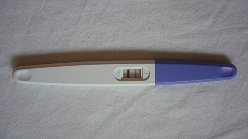

# DIAGNÓSTICO DE GRAVIDEZ

O diagnóstico de gravidez combina três pilares:

- **Clínica:** sinais e sintomas maternos.

- **Laboratório:** detecção do hCG, especialmente o β-hCG.

- **Ultrassonografia:** confirmação da gestação intrauterina, viabilidade e datação.

Para provas, o ponto central é entender a cronologia: primeiro aparecem alterações hormonais e sintomas inespecíficos; depois, achados objetivos ao exame físico; por fim, evidências diretas do concepto.

## hCG: o principal marcador laboratorial

A gonadotrofina coriônica humana, ou hCG, é produzida pelo sinciciotrofoblasto após a implantação. Sua principal função inicial é manter o corpo lúteo, garantindo a produção de progesterona até que a placenta assuma essa função, por volta da 8ª a 10ª semana.

O hCG é formado por duas subunidades:

- **Subunidade alfa:** semelhante à do TSH, LH e FSH.

- **Subunidade beta:** confere maior especificidade ao teste.

Por isso, na prática e nas provas, o exame mais útil é o **β-hCG**, especialmente quando quantitativo.

## Cinética do β-hCG

O β-hCG começa a ser detectável após a implantação, cerca de 6 a 8 dias após a fecundação.

Na gestação inicial viável, espera-se elevação progressiva do β-hCG, geralmente com aumento importante em 48 a 72 horas. A ausência de elevação adequada sugere possibilidade de:

- gestação ectópica;

- abortamento;

- gestação intrauterina não evolutiva.

O pico ocorre por volta da **8ª a 12ª semana**, frequentemente em torno da 10ª semana. Depois, os níveis diminuem e permanecem em platô mais baixo até o fim da gestação.

## Sinais clínicos de gravidez

A classificação clássica divide os achados em sinais de **presunção**, **probabilidade** e **certeza**.

### Sinais de presunção

São manifestações subjetivas ou alterações sistêmicas inespecíficas. Sugerem gravidez, mas podem ocorrer em outras condições.

Principais exemplos:

- atraso menstrual;

- náuseas e vômitos;

- fadiga;

- sonolência;

- polaciúria;

- sialorreia;

- mastalgia e aumento do volume mamário;

- tubérculos de Montgomery;

- rede venosa de Haller;

- sinal de Hunter, com hiperpigmentação da aréola secundária;

- cloasma gravídico;

- linha nigra;

- percepção de movimentos fetais pela gestante.

Os sinais mamários são sinais de **presunção**, pois decorrem de alterações hormonais e não confirmam gravidez.

### Sinais de probabilidade

São achados objetivos identificados pelo examinador, principalmente no exame ginecológico. Têm maior valor que os sinais de presunção, mas ainda não confirmam definitivamente a gestação.

Principais exemplos:

- **sinal de Hegar:** amolecimento do istmo uterino;

- **sinal de Goodell:** amolecimento do colo uterino;

- **sinal de Chadwick ou Jacquemier:** coloração violácea da vulva, vagina ou colo por congestão vascular;

- **sinal de Kluge:** coloração violácea da mucosa vaginal;

- **sinal de Piskacek:** assimetria uterina por implantação em um dos cornos;

- **sinal de Nobile-Budin:** preenchimento dos fundos de saco vaginais pelo útero globoso;

- aumento do volume uterino;

- alterações de forma, consistência e tamanho do útero ao toque bimanual.

O **sinal de Nobile-Budin** deve ser classificado como sinal de **probabilidade**, por ser achado objetivo ao exame físico.

### Sinais de certeza

São evidências diretas do concepto. Confirmam a gravidez.

Principais exemplos:

- ausculta de batimentos cardiofetais;

- movimentos fetais percebidos pelo examinador;

- sinal de Puzos, ou rechaço fetal;

- visualização do embrião ou feto à ultrassonografia.

A percepção de movimentos fetais pela gestante não é sinal de certeza. Para ser sinal de certeza, o movimento deve ser percebido pelo examinador.

## Comparação dos sinais clínicos

| Categoria | Característica | Exemplos |
| --- | --- | --- |
| Presunção | Sintomas e alterações inespecíficas | Atraso menstrual, náuseas, mastalgia, tubérculos de Montgomery, Hunter |
| Probabilidade | Achados objetivos ao exame físico | Hegar, Goodell, Chadwick, Piskacek, Nobile-Budin, aumento uterino |
| Certeza | Evidência direta do concepto | BCF, movimentos fetais pelo examinador, Puzos, USG com embrião ou feto |

## Testes laboratoriais

### Teste urinário de gravidez

O teste imunológico de gravidez na urina é qualitativo e detecta hCG acima do limite de sensibilidade do método, geralmente em torno de 20 a 25 mUI/mL.

Vantagens:

- rápido;

- barato;

- acessível;

- útil na triagem inicial.

Limitação principal:

- pode ser falso-negativo se realizado muito precocemente.

Quando o teste urinário é negativo, mas a suspeita clínica persiste, deve-se repetir o teste após alguns dias ou solicitar β-hCG sérico.

### β-hCG sérico

O β-hCG sérico pode ser qualitativo ou quantitativo. O quantitativo é especialmente útil em situações nas quais é necessário acompanhar a evolução da gestação.

Principais indicações do β-hCG quantitativo:

- suspeita de gestação ectópica;

- sangramento no início da gestação;

- dor pélvica com suspeita gestacional;

- gestação de localização indeterminada;

- suspeita de doença trofoblástica gestacional;

- acompanhamento pós-esvaziamento molar.

## Falsos-positivos e falsos-negativos

### Falsos-positivos

São incomuns, mas podem ocorrer em situações como:

- uso de hCG em tratamentos de fertilidade;

- tumores produtores de hCG, como alguns tumores germinativos;

- doença trofoblástica gestacional;

- interferência laboratorial por anticorpos heterófilos;

- hCG hipofisário, especialmente no climatério e pós-menopausa.

A homologia estrutural entre hCG e TSH explica efeitos tireoidianos em situações de hCG muito elevado, mas os testes modernos de β-hCG reduzem muito a chance de reação cruzada clinicamente relevante.

### Falsos-negativos

Principais causas:

- teste realizado muito precocemente;

- urina muito diluída;

- erro de execução ou leitura;

- efeito gancho, especialmente em níveis extremamente elevados de hCG, como na mola hidatiforme.

No **efeito gancho**, a concentração muito alta de hCG satura os anticorpos do ensaio e pode gerar resultado falsamente negativo. A solução é repetir o teste com diluição da amostra.

*Figura 1 - Teste urinário de gravidez positivo, com linha de controle e linha de teste visíveis. Fonte: Domínio Público | Wikimedia Commons*

## Ultrassonografia no diagnóstico de gravidez

A ultrassonografia transvaginal é o método mais sensível no início da gestação. Ela ajuda a confirmar a localização, estimar a idade gestacional e avaliar viabilidade.

Marcos gerais na USG transvaginal:

- **4 a 5 semanas:** saco gestacional;

- **5 a 6 semanas:** vesícula vitelínica;

- **6 a 7 semanas:** embrião com atividade cardíaca.

A vesícula vitelínica é importante porque ajuda a confirmar gestação intrauterina verdadeira, diferenciando-a de possível pseudosaco gestacional.

## Critérios ultrassonográficos de gestação não evolutiva

São achados compatíveis com gestação não evolutiva:

- embrião com CCN igual ou maior que 7 mm sem atividade cardíaca;

- saco gestacional com diâmetro médio igual ou maior que 25 mm sem embrião.

Quando os achados ainda não preenchem critérios definitivos, a conduta costuma ser repetir a ultrassonografia no intervalo adequado, evitando diagnóstico precoce incorreto de perda gestacional.

## Zona discriminatória

A zona discriminatória é o valor de β-hCG acima do qual se espera visualizar saco gestacional intrauterino na ultrassonografia transvaginal.

Na prática, costuma-se usar faixa aproximada de **1.500 a 2.000 mUI/mL**, podendo variar conforme o serviço e a qualidade do exame.

Se o β-hCG está acima da zona discriminatória e a USG transvaginal não mostra gestação intrauterina, deve-se suspeitar de:

- gravidez ectópica;

- gestação intrauterina muito inicial com datação incerta;

- abortamento completo;

- erro de datação ou limitação técnica.

Em paciente com dor pélvica, sangramento e útero vazio, a hipótese de gestação ectópica deve ser priorizada.

## Condições associadas ao hCG elevado

### Gestação ectópica

Na gestação ectópica, o β-hCG geralmente apresenta elevação mais lenta, queda inadequada ou platô. A USG pode mostrar útero vazio, massa anexial ou líquido livre.

### Doença trofoblástica gestacional

Na mola hidatiforme, o β-hCG costuma estar muito elevado para a idade gestacional. Podem ocorrer:

- sangramento vaginal;

- útero maior que o esperado;

- hiperêmese;

- cistos tecaluteínicos;

- hipertireoidismo gestacional;

- imagem ultrassonográfica sugestiva, classicamente descrita como “tempestade de neve”.

### Hipertireoidismo gestacional transitório

Em níveis muito altos, o hCG pode estimular receptores de TSH, levando a TSH suprimido e sintomas de tireotoxicose. Isso pode ocorrer especialmente em hiperêmese gravídica e doença trofoblástica gestacional.

## Adolescente com suspeita de gravidez

A adolescente deve ser atendida com acolhimento, privacidade e sigilo, desde que tenha capacidade de compreensão e discernimento.

Pontos importantes:

- o atendimento não deve ser negado por ausência dos pais ou responsáveis;

- o resultado deve ser comunicado primeiro à adolescente;

- deve-se orientar sobre pré-natal, direitos, rede de apoio e prevenção de ISTs;

- o sigilo pode ser quebrado em situações de risco relevante, violência, abuso, incapacidade de discernimento ou necessidade de proteção.

Em suspeita de violência sexual, a abordagem deve seguir os protocolos assistenciais e legais vigentes.

## Anticoncepção de emergência

Em caso de relação sexual desprotegida, a anticoncepção de emergência deve ser considerada quando ainda estiver dentro da janela de efetividade.

Opções principais:

- **levonorgestrel 1,5 mg:** preferencialmente até 72 horas, com eficácia decrescente ao longo do tempo;

- **DIU de cobre:** pode ser usado até 5 dias após a relação e é o método mais eficaz de anticoncepção de emergência.

A anticoncepção de emergência não é abortiva. Se a gestação já estiver estabelecida, ela não interrompe a gravidez.

## Exame físico orientado

Na suspeita de gravidez, o exame deve ser direcionado:

- **Inspeção geral:** cloasma, linha nigra, alterações mamárias.

- **Palpação abdominal:** avaliação do volume uterino, especialmente após o primeiro trimestre.

- **Exame especular:** coloração vaginal e cervical, sangramentos ou corrimentos.

- **Toque bimanual:** tamanho, consistência, forma e mobilidade uterina; sinais de Hegar, Goodell, Piskacek e Nobile-Budin.

O útero torna-se palpável acima da sínfise púbica por volta de 12 semanas e atinge a cicatriz umbilical em torno de 20 semanas.

## Pontos-chave para prova

- Sinais mamários, náuseas, atraso menstrual e percepção materna de movimentos fetais são sinais de **presunção**.

- Hegar, Goodell, Chadwick, Piskacek, Nobile-Budin e aumento uterino são sinais de **probabilidade**.

- BCF, movimentos fetais percebidos pelo examinador, Puzos e USG com embrião ou feto são sinais de **certeza**.

- O β-hCG sérico quantitativo é essencial na avaliação de gestação ectópica, sangramento inicial e doença trofoblástica gestacional.

- Na gestação inicial viável, espera-se aumento importante do β-hCG em 48 a 72 horas.

- O pico do hCG ocorre por volta de 8 a 12 semanas.

- A primeira estrutura geralmente visível na USG transvaginal é o saco gestacional.

- Vesícula vitelínica sugere gestação intrauterina verdadeira.

- Embrião com CCN igual ou maior que 7 mm sem BCF sugere gestação não evolutiva.

- Saco gestacional com diâmetro médio igual ou maior que 25 mm sem embrião sugere gestação não evolutiva.

- β-hCG acima da zona discriminatória com útero vazio exige investigação de gestação ectópica.

- Efeito gancho pode causar falso-negativo em níveis extremamente elevados de hCG, especialmente na mola hidatiforme.

 Cópia offline para consulta pessoal.
 Fonte original:
 [https://www.medevo.com.br/material-apoio/ler/10652082-3dd3-4063-9ddb-6ecbb20a914e](https://www.medevo.com.br/material-apoio/ler/10652082-3dd3-4063-9ddb-6ecbb20a914e)
