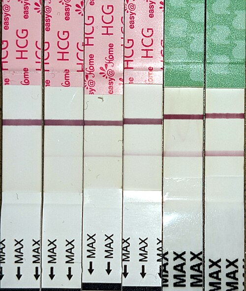
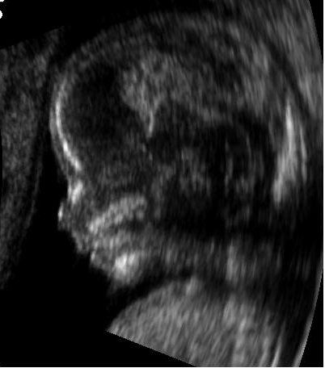

# DIAGNÓSTICO E DATAÇÃO DA GESTAÇÃO

O diagnóstico de gravidez é um dos atos mais frequentes na prática médica, mas, curiosamente, é onde muitos alunos tropeçam em provas de residência por negligenciarem a semiologia clássica. Para o examinador, não basta saber que o "teste deu positivo". Você precisa saber classificar os sinais clínicos e, principalmente, datar essa gestação com precisão, pois toda a conduta obstétrica posterior, do rastreio de malformações à indicação de parto, depende de uma Idade Gestacional (IG) bem estabelecida.

## O Gatilho Biológico: Gonadotrofina Coriônica Humana (hCG)

*Figura 1 - Série de testes de gravidez realizados em dias consecutivos, demonstrando a detecção progressiva do β-hCG no início da gestação. Fonte: Grendelkhan, CC BY-SA 4.0 | Wikimedia Commons*

Tudo começa com a nidação. Assim que o blastocisto se implanta no endométrio, o sinciciotrofoblasto passa a produzir o hCG. A função biológica primordial desse hormônio é manter o corpo lúteo produzindo progesterona até que a placenta assuma essa função, por volta da 8ª a 10ª semana.

Na prática de prova, você deve lembrar que o hCG possui duas subunidades: alfa e beta. A subunidade alfa é idêntica à do LH, FSH e TSH. Por isso, para diagnóstico, utilizamos sempre a subunidade **fração beta (β-hCG)**, que é específica da gestação.

### Dinâmica do β-hCG e o Limiar de Visualização

O β-hCG plasmático é detectável precocemente, cerca de 8 a 11 dias após a concepção. Em uma gestação inicial saudável, os níveis de β-hCG costumam dobrar a cada 48 horas.

**Dica de Ouro do Dr. Will:** Se você atende uma paciente com β-hCG de 1.100 mUI/mL e a ultrassonografia (USG) transvaginal não mostra saco gestacional, não se desespere nem diagnostique ectópica precocemente. O "limiar discriminatório" para visualizar o saco gestacional na USG transvaginal é geralmente entre 1.500 e 2.000 mUI/mL. A conduta correta aqui é repetir o β-hCG em 48 horas para avaliar a curva de ascensão.

O pico do hCG ocorre entre a 8ª e 12ª semana, chegando a níveis de 100.000 mUI/mL, e depois sofre um declínio, mantendo-se em um platô mais baixo até o final da gestação. Isso explica por que os enjoos costumam melhorar após o primeiro trimestre.

## Diagnóstico Clínico

*Figura 2 - Perfil embrionário visualizado por ultrassonografia obstétrica com 14 semanas de gestação, demonstrando a datação por biometria fetal. Fonte: X.Compagnion, Public Domain | Wikimedia Commons*
: A Tríade da Semiologia Obstétrica

As bancas adoram classificar os sinais de gravidez em três grupos. O erro clássico é achar que um sinal de probabilidade é de certeza. Memorize esta hierarquia:

### 1. Sinais de Presunção (Sintomas Sistêmicos e Maternos)

São sinais que a paciente sente ou que aparecem longe do útero. Eles sugerem, mas não confirmam nada.

- **Amenorreia:** É o sinal mais comum, mas lembre-se: em qualquer mulher em idade fértil com amenorreia secundária, o primeiro passo é excluir gravidez com β-hCG.

- **Manifestações clínicas:** Náuseas, vômitos, polaciúria (pela compressão vesical precoce), fadiga e mastalgia.

- **Alterações mamárias:**

- **Rede de Haller:** Veias superficiais visíveis nas mamas.

- **Tubérculos de Montgomery:** Glândulas sebáceas hipertrofiadas na aréola.

- **Sinal de Hunter:** Aparecimento de uma aréola secundária, com limites imprecisos.

- **Sinal de Halban:** Aumento da lanugem (pelos) no couro cabeludo.

### 2. Sinais de Probabilidade (Alterações no Trato Genital)

Aqui o examinador foca nas alterações do útero, vagina e vulva percebidas pelo médico no exame físico.

- **Sinal de Hegar:** Amolecimento do istmo uterino. Ao toque bimanual, parece que o corpo do útero e o colo são estruturas separadas. É um dos mais cobrados.

- **Sinal de Goodell:** Amolecimento do colo uterino (textura de "lábio" em vez de "ponta do nariz").

- **Sinal de Piskacek:** Assimetria uterina à palpação, devido à implantação do ovo em um dos cornos uterinos.

- **Sinal de Noble-Budin:** Preenchimento dos fundos de saco vaginais pelo útero que se torna globoso.

- **Sinal de Jacquemier (ou Chadwick):** Coloração violácea da vulva e mucosa vaginal.

- **Sinal de Kluge:** Coloração violácea da mucosa vaginal (muitas vezes Jacquemier e Kluge são citados juntos como sinal de coloração).

### 3. Sinais de Certeza (Presença Fetal)

Estes não deixam dúvidas. Se presentes, a paciente está grávida.

- **Ausculta de Batimentos Cardiofetais (BCF):**

- Sonar Doppler: detectável a partir de 10 a 12 semanas.

- Estetoscópio de Pinard: detectável a partir de 18 a 20 semanas.

- **Percepção de Movimentos Fetais pelo Examinador:** Geralmente após 18 a 20 semanas. Cuidado: a percepção da mãe é sinal de presunção, pois ela pode confundir com movimentos peristálticos.

- **Sinal de Puzos (Rechaço Fetal):** Ao realizar o toque vaginal e impulsionar o útero para cima, o feto "bate" no dedo do examinador ao retornar.

- **Visualização do feto na Ultrassonografia.**

| Categoria | Exemplos Principais | Valor Diagnóstico |
| --- | --- | --- |
| **Presunção** | Amenorreia, náuseas, Sinal de Hunter, Sinal de Halban | Baixo (sugestivo) |
| **Probabilidade** | Sinal de Hegar, Piskacek, Goodell, Jacquemier | Médio (muito provável) |
| **Certeza** | Ausculta de BCF, Sinal de Puzos, Movimento fetal pelo médico | Absoluto (confirmatório) |

## Datação da Gestação: O Coração do Pré-natal

Datar a gestação é definir a Idade Gestacional (IG) e a Data Provável do Parto (DPP). No MedEvo, sempre reforçamos: uma datação errada no início gera uma cascata de erros no final.

### Regra de Naegele para DPP

A DPP é calculada somando-se 280 dias (40 semanas) à Data da Última Menstruação (DUM). A fórmula prática é:

- **Somar 7 dias ao primeiro dia da DUM.**

- **Subtrair 3 meses ao mês da DUM** (ou somar 9 meses, se for janeiro, fevereiro ou março).

- **Ajustar o ano**, se necessário.

**Exemplo Clínico:** DUM em 12/06/2023.

- Dias: 12 + 7 = 19.

- Meses: 06 - 3 = 03 (Março).

- Ano: Como passou para o ano seguinte, 2024.
DPP: 19/03/2024.

**Atenção:** Se a paciente tem ciclos irregulares, a DUM torna-se pouco confiável. Nesses casos, a ultrassonografia é soberana.

### Cálculo da Idade Gestacional (IG)

Para calcular a IG em semanas e dias na data da consulta, você deve somar o número total de dias decorridos desde o primeiro dia da DUM até a data atual e dividir por 7.

**Exemplo:** DUM 15/09/2022. Consulta em 14/12/2022.

- Setembro: 15 dias restantes (30 - 15).

- Outubro: 31 dias.

- Novembro: 30 dias.

- Dezembro: 14 dias.

- Total: 15 + 31 + 30 + 14 = 90 dias.

- 90 / 7 = 12 semanas e 6 dias.

## O Papel da Ultrassonografia na Datação

A USG é o método mais preciso para datar a gestação, mas sua acurácia diminui conforme a gravidez avança. Isso ocorre porque, no início, o crescimento embrionário é muito uniforme (pouca influência genética ou ambiental). No terceiro trimestre, fatores como restrição de crescimento ou macrossomia aumentam a margem de erro.

### Primeiro Trimestre: O Padrão-Ouro

A medida do **Comprimento Cabeça-Nádega (CCN)**, realizada entre 7 e 13 semanas e 6 dias, é o parâmetro isolado mais fidedigno para datar a gravidez, com margem de erro de apenas 3 a 5 dias.

**Marcos Ultrassonográficos Iniciais:**

- **Saco Gestacional:** 4 a 5 semanas (primeira estrutura visível).

- **Vesícula Vitelina:** 5 a 6 semanas (confirma que a gestação é intrauterina).

- **Embrião com BCF:** 6 a 7 semanas.

### Quando a USG prevalece sobre a DUM?

Esta é uma questão clássica de prova. Se houver discrepância entre a IG calculada pela DUM e a IG calculada pela USG, qual usar?

- **No 1º Trimestre (até 13s 6d):** Se a diferença for **maior que 7 dias**, a USG prevalece. Se for menor ou igual a 7 dias, mantemos a DUM.

- **No 2º Trimestre (até 22 semanas):** Se a diferença for **maior que 10 dias**, a USG prevalece.

- **No 2º Trimestre (após 22 semanas):** Se a diferença for **maior que 14 dias**, a USG prevalece.

- **No 3º Trimestre:** A margem de erro é de até 3 semanas. Se a paciente chega sem exames prévios, a datação é muito precária.

| Época da USG | Parâmetro Principal | Margem de Erro |
| --- | --- | --- |
| **1º Trimestre** | Comprimento Cabeça-Nádega (CCN) | 3 a 5 dias |
| **2º Trimestre** | Diâmetro Biparietal (DBP) / Fêmur | 7 a 10 dias |
| **3º Trimestre** | Parâmetros Biométricos Combinados | 14 a 21 dias |

## Altura do Fundo Uterino (AFU) e Correlação Clínica

Na falta de USG ou DUM confiável, usamos a palpação uterina. É um método grosseiro, mas muito cobrado em cenários de Atenção Primária.

- **6 semanas:** O útero não sofreu alteração de tamanho perceptível ao exame abdominal.

- **8 semanas:** Útero do tamanho de uma laranja.

- **10 semanas:** Útero do tamanho de uma toranja (pode ser sentido logo acima da sínfise púbica ao toque bimanual).

- **12 semanas:** O útero sai da pelve e torna-se palpável logo acima da sínfise púbica.

- **16 semanas:** Fundo uterino entre a sínfise púbica e a cicatriz umbilical.

- **20 semanas:** Fundo uterino na altura da cicatriz umbilical.

- **18 a 30 semanas:** Existe uma correlação direta onde a AFU em centímetros corresponde aproximadamente à IG em semanas (Regra de McDonald). Ex: 24 cm ≈ 24 semanas.

**Por que a AFU pode falhar?**
Se a AFU estiver muito maior que a IG esperada, pense em: gestação gemelar, polidrâmnio, mola hidatiforme ou macrossomia. Se estiver muito menor: restrição de crescimento fetal (RCF) ou oligodrâmnio.

## Situações Especiais e Complicações na Datação

### O Pós-datismo e a Gestação Prolongada

Uma gestação é considerada **a termo** entre 37 semanas e 41 semanas e 6 dias.

- **Termo precoce:** 37s a 38s 6d.

- **Termo pleno:** 39s a 40s 6d.

- **Termo tardio:** 41s a 41s 6d.

- **Pós-termo:** ≥ 42 semanas.

Segundo a FEBRASGO e o Ministério da Saúde, em gestações de baixo risco com datação confiável, a interrupção da gestação (indução do parto) deve ser considerada a partir de 41 semanas para reduzir a mortalidade perinatal e o risco de síndrome de aspiração de mecônio.

### Avaliação da Maturidade Pulmonar

Antigamente, quando a datação era incerta, recorria-se à amniocentese para avaliar a maturidade pulmonar fetal. Embora a USG tenha tornado isso raro, as provas ainda cobram:

- **Teste de Clements:** Avalia a estabilidade da bolha de surfactante em etanol.

- **Relação Lecitina/Esfingomielina:** Maturidade se > 2.

- **Presença de Fosfatidilglicerol:** É o marcador mais tardio e indica maturidade pulmonar definitiva.

## Diagnóstico Diferencial e Pegadinhas

Muitas vezes, o sangramento de implantação (Sinal de Hartmann) ocorre próximo à data esperada da menstruação. A paciente pode confundir esse pequeno sangramento com uma menstruação normal, o que leva a um erro de um mês na DUM. Por isso, a USG de primeiro trimestre é fundamental para confirmar se o tamanho do embrião condiz com a data informada.

Outro ponto: a percepção fetal (quickening). Pacientes primigestas costumam sentir o feto por volta de 18 a 20 semanas. Multíparas, por já conhecerem a sensação, podem sentir com 16 semanas. Isso é subjetivo e nunca deve ser usado para datar a gestação se houver USG disponível.

## Pontos-Chave para Prova

- **β-hCG:** Detectável no sangue 8-11 dias após a concepção. Dobra a cada 48h no início.

- **Saco Gestacional:** Primeira estrutura na USG (4-5 semanas). Se β-hCG > 2.000 e útero vazio, suspeite de ectópica.

- **CCN (Comprimento Cabeça-Nádega):** O parâmetro mais fiel para IG no 1º trimestre (erro de 3-5 dias).

- **Regra de Naegele:** DUM + 7 dias, - 3 meses, + 1 ano. Cuidado com viradas de mês e anos bissextos.

- **Sinal de Hegar:** Amolecimento do istmo (Probabilidade).

- **Sinal de Puzos:** Rechaço fetal (Certeza).

- **Sinal de Jacquemier/Kluge:** Coloração violácea (Probabilidade).

- **Sinal de Hunter:** Aréola secundária (Presunção).

- **Ausculta de BCF:** Sonar (10-12s), Pinard (18-20s). Certeza absoluta.

- **Cicatriz Umbilical:** Útero atinge esse nível com 20 semanas.

- **Discrepância DUM vs USG:** No 1º trimestre, se diferença > 7 dias, a USG manda.

- **Gestação Prolongada:** Risco de insuficiência placentária. Induzir com 41 semanas.

- **Amenorreia Secundária:** Sempre pedir β-hCG antes de qualquer outra propedêutica.

- **Sinal de Piskacek:** Assimetria uterina por implantação lateral (Probabilidade).

- **Sinal de Goodell:** Amolecimento do colo (Probabilidade).

- **O que NÃO fazer:** Não use a data da percepção materna de movimentos fetais para mudar a IG de uma USG de primeiro trimestre. 🩺

 Cópia offline para consulta pessoal.
 Fonte original:
 [https://www.medevo.com.br/material-apoio/ler/1bb83e5f-fb74-4531-9681-041b4f4dc7af](https://www.medevo.com.br/material-apoio/ler/1bb83e5f-fb74-4531-9681-041b4f4dc7af)
