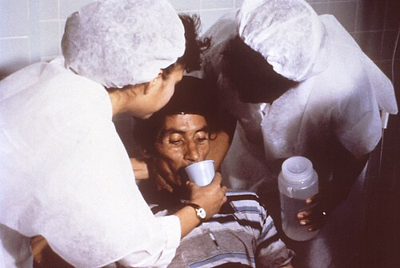
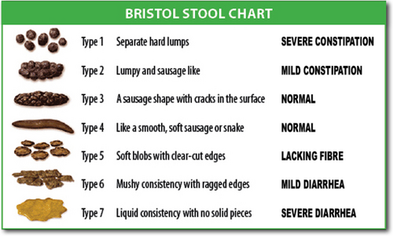

# DIARREIA AGUDA E CRÔNICA

Para entender diarreia em provas de residência, você precisa primeiro organizar sua gaveta mental. Não adianta decorar uma lista de bactérias se você não souber distinguir uma diarreia alta de uma baixa, ou uma osmótica de uma secretora. O examinador quer saber se você sabe conduzir o paciente, não se você é uma enciclopédia de microbiologia.

## Definições e Classificação Temporal

A primeira coisa que você deve perguntar ao paciente (ou procurar no enunciado) é: "Há quanto tempo isso está acontecendo?". A duração define nossa conduta inicial.

- **Diarreia Aguda:** Até 14 dias. Geralmente infecciosa e autolimitada.

- **Diarreia Persistente:** Entre 14 e 30 dias. Aqui o sinal de alerta acende para protozoários ou quadros de má absorção pós-infecciosa.

- **Diarreia Crônica:** Mais de 30 dias. Esqueça a maioria dos vírus; aqui pensamos em doenças inflamatórias, má absorção, neoplasias ou causas funcionais.

**Dica de Prova:** Muitas bancas tentam te confundir com o termo "diarreia persistente". Lembre-se: se passou de 14 dias, o *Cryptosporidium* (um protozoário, não um vírus!) entra forte no diferencial, especialmente em imunocomprometidos.

## Diarreia Aguda:

*Figura 2 - Paciente com diarreia grave recebendo solução de reidratação oral (SRO), demonstrando a importância fundamental da hidratação no manejo da diarreia aguda. Fonte: CDC, Public Domain | Wikimedia Commons*
 O Campo de Batalha da Hidratação

Na diarreia aguda, o diagnóstico etiológico raramente é necessário. Por quê? Porque o tratamento não muda: é hidratação. O que mata o paciente não é a bactéria, é a desidratação.

### Fisiopatologia:

*Figura 1 - Escala de Bristol para classificação das fezes, ferramenta útil para caracterizar o padrão das evacuações e diferenciar diarreias de outras alterações do hábito intestinal. Fonte: Cabot Health, CC BY-SA 3.0 | Wikimedia Commons*
 O "Porquê" dos Sintomas

Existem quatro mecanismos principais que você precisa dominar:

- **Osmótica:** Há algo na luz do intestino que "puxa" água. Exemplo clássico: intolerância à lactose. Se o paciente para de comer, a diarreia para. O hiato osmótico fecal estará elevado (> 125 mOsm/kg).

- **Secretora:** O enterócito está secretando água e eletrólitos ativamente, geralmente por toxinas (Vibrio cholerae). A diarreia NÃO para com o jejum e o hiato osmótico é baixo (< 50 mOsm/kg).

- **Inflamatória (Exsudativa):** Há destruição da mucosa. Sangue, muco e pus (disenteria). Pense em *Shigella*, *Salmonella*, *Campylobacter* e *E. histolytica*.

- **Motora:** O trânsito está rápido demais. Comum no hipertireoidismo e na Síndrome do Intestino Irritável (SII).

### Avaliação da Desidratação (O Padrão-Ouro da SBP/OMS)

Você não pode errar a classificação da desidratação. É isso que define se o paciente vai para casa ou fica internado.

| Sinal/Sintoma | Sem Desidratação (Plano A) | Desidratação Moderada (Plano B) | Desidratação Grave (Plano C) |
| --- | --- | --- | --- |
| Estado Geral | Alerta, ativo | Irritado, sedento | Letárgico, inconsciente |
| Olhos | Normais | Fundos | Muito fundos |
| Sinal da Prega | Desaparece rápido | Desaparece lentamente (<2s) | Desaparece muito lento (>2s) |
| Pulso | Cheio | Rápido e fraco | Débil ou ausente |
| Conduta | Domiciliar (TRO) | Unidade de Saúde (TRO) | Hospitalar (Vigência IV) |

**Exemplo Clínico:** Uma criança de 2 anos chega com 5 episódios de diarreia e 2 vômitos. Está irritada, com olhos fundos e sinal da prega que volta em 1 segundo. Qual o plano? **Plano B**. Você vai oferecer a Terapia de Reidratação Oral (TRO) na unidade de saúde, em pequenas quantidades e frequentemente.

**Cuidado:** Vômitos NÃO são contraindicação absoluta para TRO. Se a criança vomitar, você espera 10 minutos e reinicia com colheradas menores. Só passamos para sonda nasogástrica ou hidratação venosa se houver vômitos persistentes (mais de 4 em 1 hora) ou perda de consciência.

### Manejo Farmacológico na Diarreia Aguda

Aqui é onde os alunos mais erram em provas. "Professor, quando eu dou antibiótico?".

Na maioria das vezes, **NÃO** damos. O uso indiscriminado de antibióticos pode prolongar o estado de portador de *Salmonella* e, no caso da *E. coli* produtora de toxina Shiga (EHEC), pode precipitar a **Síndrome Hemolítico-Urémica (SHU)**.

**Quando indicar ATB (Ciprofloxacino ou Azitromicina):**

- Disenteria grave com febre alta.

- Pacientes idosos (> 70 anos) ou imunocomprometidos.

- Suspeita de Cólera.

- Sinais de sepse.

**Zinco:** Segundo a OMS e a SBP, deve ser prescrito para todas as crianças com diarreia aguda (10mg/dia para < 6 meses; 20mg/dia para > 6 meses, por 10-14 dias). Ele reduz a duração, a gravidade e previne novos episódios nos meses seguintes.

**Racecadotrila:** É um antissecretor (inibidor da encefalinase). Pode ser usado para alívio rápido dos sintomas em quadros sem sinais de alarme.

## Colite Pseudomembranosa: A Diarreia Nosocomial

Se o enunciado falar em "paciente internado", "uso prévio de antibióticos" (especialmente clindamicina, cefalosporinas ou quinolonas) e "leucocitose importante", você deve marcar *Clostridioides difficile*.

- **Diagnóstico:** Pesquisa de toxinas A e B nas fezes ou PCR para o gene da toxina. A colonoscopia com visualização de pseudomembranas é patognomônica, mas nem sempre necessária.

- **Tratamento:** Vancomicina oral (125mg 6/6h) é a primeira escolha atual para casos moderados a graves. A fidaxomicina é uma alternativa excelente, mas pouco disponível no Brasil. Metronidazol ficou em segundo plano.

## Diarreia Crônica: Investigando o "Invisível"

Quando a diarreia dura mais de 4 semanas, o jogo muda. Precisamos diferenciar se a causa é **Orgânica** ou **Funcional**.

- **Sinais de Alarme (Sugerem causa Orgânica):** Perda ponderal inexplicada, diarreia noturna (que acorda o paciente), sangue nas fezes, anemia ferropriva, início após os 50 anos, história familiar de câncer colorretal ou DII.

### Síndrome do Intestino Irritável (SII)

É a causa funcional mais comum. O diagnóstico é clínico pelos **Critérios de Roma IV**:
Dor abdominal recorrente (pelo menos 1 dia por semana nos últimos 3 meses) associada a dois ou mais:

- Relação com a evacuação (melhora ou piora).

- Alteração na frequência das fezes.

- Alteração na forma/aparência das fezes.

**Dica do Dr. Will:** Se o paciente tem dor que melhora ao evacuar, mas NÃO tem perda de peso e os exames básicos (hemograma, PCR, calprotectina fecal) são normais, pense em SII. A calprotectina fecal negativa é excelente para afastar Doença Inflamatória Intestinal (DII).

### Síndromes de Má Absorção

Aqui o paciente tem esteatorreia (fezes gordurosas, que boiam e são difíceis de limpar).

#### 1. Doença Celíaca

É uma enteropatia imunomediada pelo glúten. Não é só diarreia; pode cursar com anemia ferropriva refratária, baixa estatura e dermatite herpetiforme (lesões vesiculares).

- **Diagnóstico:**

- Triagem: Anti-transglutaminase tecidual IgA (tTG-IgA).

- Confirmação: Biópsia de duodeno (Classificação de Marsh).

- **Exceção de Prova (Crianças):** Se tTG-IgA > 10x o limite superior + Anti-endomísio (EMA) positivo + HLA DQ2/DQ8 positivo, pode-se dispensar a biópsia (conforme diretrizes recentes da ESPGHAN, frequentemente cobradas).

#### 2. Supercrescimento Bacteriano no Intestino Delgado (SIBO)

Ocorre quando bactérias do cólon "sobem" para o delgado. Causas: estase (diabetes, esclerodermia), cirurgias (alça cega) ou uso crônico de IBP.

- **Pérola Clínica:** A bactéria consome a D-xilose. Por isso, o teste da D-xilosemia estará alterado na SIBO, mesmo que a mucosa esteja íntegra.

- **Tratamento:** Rifaximina (antibiótico não absorvível).

#### 3. Intolerância à Lactose

Deficiência de lactase. A lactose não absorvida sofre fermentação bacteriana, gerando H2 (hidrogênio), CO2 e ácidos graxos de cadeia curta.

- **Sintomas:** Distensão, flatulência e diarreia osmótica após ingestão de laticínios.

- **Diagnóstico:** Teste respiratório do hidrogênio expirado ou teste de tolerância à lactose oral (curva glicêmica que não sobe após ingestão de lactose).

| Condição | Mecanismo Principal | Achado Chave |
| --- | --- | --- |
| Doença Celíaca | Imunomediado (Glúten) | Atrofia de vilosidades / Anti-tTG |
| SIBO | Proliferação bacteriana | Teste do H2 expirado / Resposta a Rifaximina |
| Intolerância à Lactose | Deficiência enzimática | Diarreia osmótica / pH fecal ácido |
| Insuficiência Pancreática | Deficiência de enzimas | Elastase fecal baixa / Esteatorreia |

## Constipação: Quando o Intestino Para

Embora o tema principal seja diarreia, as bancas adoram misturar constipação, especialmente em idosos.

**Definição:** Menos de 3 evacuações por semana, esforço evacuatório, fezes endurecidas (Bristol 1 e 2) ou sensação de evacuação incompleta.

### Causas Secundárias e Sinais de Alarme

Sempre investigue causas secundárias antes de rotular como funcional:

- **Medicamentos:** Amitriptilina (tricíclicos têm forte efeito anticolinérgico), opioides, bloqueadores de canal de cálcio.

- **Metabólicas:** Hipotireoidismo, hipercalcemia.

- **Neoplasia:** Idoso com mudança recente do hábito intestinal (constipação de início recente) + anemia ou perda de peso = **Colonoscopia obrigatória** para afastar Adenocarcinoma Colorretal.

**Pérola de Prova:** O tumor de sigmoide costuma cursar com constipação ou "diarreia paradoxal" (líquido que passa por uma obstrução parcial). Já o tumor de cólon direito costuma cursar com anemia ferropriva e sintomas mais vagos.

## Situações Especiais e "Zebra" de Prova

### VIPoma (Síndrome de Verner-Morrison)

Tumor neuroendócrino (geralmente no pâncreas) que secreta VIP (Peptídeo Intestinal Vasoativo).

- **Quadro:** Diarreia aquosa profusa ("cólera pancreática"), hipocalemia e acloridria.

- **Dica:** Se o enunciado trouxer uma diarreia secretora volumosa (> 3 litros/dia) com potássio muito baixo, pense nisso.

### Doença de Whipple

Causada pela bactéria *Tropheryma whipplei*.

- **Tríade:** Diarreia mal-absortiva + Artrite + Sintomas neurológicos/linfadenopatia.

- **Diagnóstico:** Biópsia de duodeno com macrófagos PAS-positivos.

### Isquemia Mesentérica Crônica

"Angina abdominal". O paciente tem medo de comer porque dói (dor pós-prandial). Geralmente é um idoso com fatores de risco cardiovascular (tabagista, hipertenso). Pode cursar com diarreia e perda de peso (por desnutrição voluntária).

## Diagnóstico Diferencial de Sangue nas Fezes

Não ache que todo sangue é hemorroida ou DII.

- **Criança:** Intussuscepção intestinal (fezes em "geleia de morango" + massa palpável), Divertículo de Meckel (sangramento indolor).

- **Adulto Jovem:** Doença Inflamatória Intestinal (Retocolite ou Crohn).

- **Idoso:** Diverticulose (sangramento volumoso indolor), Angiodisplasia, Câncer Colorretal, Colite Isquêmica (dor abdominal seguida de sangramento).

**Conexão MedEvo:** Lembra que falamos da isquemia mesentérica? Na **Colite Isquêmica**, a dor é súbita e o sangramento ocorre porque a mucosa do cólon sofreu um insulto hipóxico transitório. É diferente da isquemia mesentérica aguda (embolia), onde a dor é desproporcional ao exame físico e o paciente está muito mais grave.

## Resumo do Manejo da Diarreia Aguda (Protocolo MS/OMS)

- **Avaliar desidratação.**

- **Plano A (Casa):** Aumentar ingestão de líquidos (SRO após cada evacuação), manter alimentação habitual, zinco por 10-14 dias. Orientar sinais de perigo.

- **Plano B (Unidade de Saúde):** SRO 50-100 ml/kg em 4 horas. Reavaliar constantemente. Se melhorar, vai para o Plano A.

- **Plano C (Hospital):** Fase de expansão rápida com Ringer Lactato ou Soro Fisiológico 0,9%.

- < 1 ano: 30 ml/kg em 1h + 70 ml/kg em 5h.

-

> 1 ano: 30 ml/kg em 30min + 70 ml/kg em 2h30min.

## Pontos-Chave para Prova 💡

- **Diarreia Aguda Infecciosa:** A maioria é viral. Não use antibiótico de rotina.

- **Vômitos na Criança:** Não impedem a TRO. Ofereça SRO em colheradas.

- **Zinco:** Reduz duração e recorrência da diarreia em pediatria.

- **C. difficile:** Suspeitar em diarreia pós-ATB ou hospitalar. Tratar com Vancomicina oral.

- **SHU:** Tríade de Anemia Hemolítica Microangiopática + Trombocitopenia + Insuficiência Renal Aguda. Ocorre após diarreia por EHEC.

- **Doença Celíaca:** Anti-tTG IgA é o exame de escolha para triagem. Biópsia confirma (Marsh).

- **D-xilose:** Avalia integridade da mucosa. Está normal na insuficiência pancreática e alterada na Doença Celíaca e SIBO (pelo consumo bacteriano).

- **Sinal de Alarme em Idoso:** Mudança do hábito intestinal ou constipação súbita = Colonoscopia.

- **Amitriptilina:** Causa clássica de constipação medicamentosa por efeito anticolinérgico.

- **Diarreia Osmótica:** Hiato osmótico > 125, para com o jejum. Ex: Lactose.

- **Diarreia Secretora:** Hiato osmótico < 50, NÃO para com o jejum. Ex: Cólera, VIPoma.

- **Diarreia Noturna:** Sempre indica causa orgânica (nunca é funcional/SII).

- **Calprotectina Fecal:** Marcador de inflamação intestinal. Útil para diferenciar SII de DII.

- **Racecadotrila:** Antissecretor que pode ser usado na diarreia aguda sem sinais de gravidade.

- **Loperamida:** Contraindicada em disenteria (risco de megacólon tóxico).

- **Óleo Mineral:** Evitar em menores de 3 anos ou pacientes com distúrbios de deglutição pelo risco de pneumonia lipoídica por aspiração.

- **S. aureus:** Intoxicação alimentar com início muito rápido (1-6 horas) e muitos vômitos.

- **Salmonella:** Risco de sepse em menores de 3 meses, idosos e falcêmicos (osteomielite).

Este material cobre a base fisiopatológica e as condutas práticas exigidas nas principais bancas do país. Ao ler uma questão, identifique primeiro o tempo de evolução e a presença de sinais de alarme. Isso eliminará 50% das alternativas incorretas de imediato.

 Cópia offline para consulta pessoal.
 Fonte original:
 [https://www.medevo.com.br/material-apoio/ler/6105b22f-b89b-4318-b9ed-2366c0560c85](https://www.medevo.com.br/material-apoio/ler/6105b22f-b89b-4318-b9ed-2366c0560c85)
