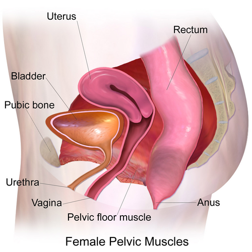
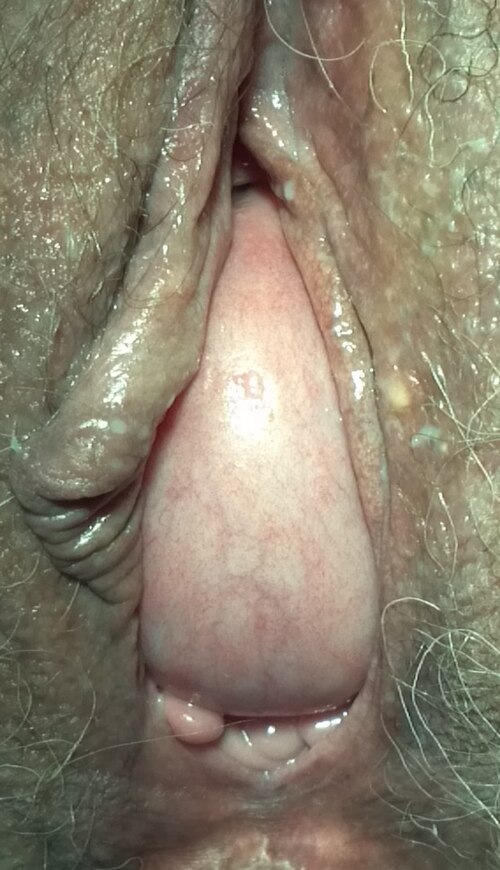

# DISFUNÇÕES DO ASSOALHO PÉLVICO

Para entender as disfunções do assoalho pélvico, você precisa parar de ver a pelve como um conjunto de órgãos isolados e passar a enxergá-la como uma unidade funcional. Imagine uma rede de sustentação que segura bexiga, útero e reto. Se a rede esgarça, os órgãos descem. Se a rede fica tensa demais, surge a dor. Se a rede rompe, perdemos o controle dos esfíncteres.

As bancas de residência amam este tema porque ele exige conhecimento anatômico preciso e raciocínio clínico para diferenciar patologias com sintomas muito parecidos, como a bexiga hiperativa e a cistite intersticial.

## Anatomia Funcional

*Figura 1 - Ilustração médica mostrando a musculatura do assoalho pélvico feminino em vista lateral, incluindo o músculo levantador do ânus e suas porções. Fonte: BruceBlaus, CC BY-SA 4.0 | Wikimedia Commons*
: O Alicerce de Tudo

Se você não dominar a anatomia, vai errar questões bobas sobre prolapso e incontinência. O assoalho pélvico não é apenas "músculo", ele é dividido em estruturas de sustentação e suspensão.

### O Diafragma Pélvico

*Figura 2 - Cistocele (prolapso do compartimento anterior) projetando-se através do introito vaginal, demonstrando a consequência clínica da disfunção do assoalho pélvico. Fonte: Mikael Häggström, CC0 | Wikimedia Commons*

Esta é a estrutura principal. Quando a prova perguntar quem forma o diafragma pélvico, você deve responder: Músculo Levantador do Ânus + Músculo Coccígeo.

O Músculo Levantador do Ânus é o protagonista aqui. Ele é o principal responsável pela sustentação dos órgãos pélvicos e pela manutenção da continência. Ele não é um músculo único, mas um complexo muscular. Guarde o mnemônico PRI para lembrar de suas três porções:

- **P**uborretal: Forma uma alça em "U" ao redor do reto. É fundamental para a continência fecal, pois mantém o ângulo anorretal. Quando ele relaxa, o ângulo diminui e as fezes passam. Quando contrai, o ângulo aumenta e a continência é mantida.

- **R**ubococcígeo (ou Pubococcígeo): Estende-se do púbis ao cóccix. É o músculo que a paciente exercita durante os exercícios de Kegel. Sua fraqueza está diretamente ligada à incontinência urinária de esforço e ao vaginismo (quando há espasmo involuntário).

- **I**liococcígeo: A parte mais lateral e posterior, que completa a "rede".

**Dica de Prova:** O músculo puborretal não possui inserções inferiores no púbis, ele funciona como uma corda que puxa o reto para frente, criando a angulação necessária para a continência. Se a questão falar em "estiramento do hiato genital" durante o parto vaginal, ela está descrevendo o mecanismo que leva ao prolapso uterino e vaginal futuro.

### Estruturas de Suspensão e Sustentação

Muitos alunos confundem os conceitos de DeLancey. Pense assim:

- **Suspensão (Nível I):** Ligamentos uterossacros e cardinais. Eles "penduram" o útero e o ápice da vagina.

- **Sustentação (Nível II):** Fáscia pubocervical e retovaginal. Elas seguram a parede anterior (bexiga) e posterior (reto).

- **Sustentação (Nível III):** Corpo perineal e membrana do períneo. É a base, onde tudo se apoia.

## Incontinência Urinária: O Desafio do Diagnóstico Diferencial

A queixa de "perda de urina" é genérica. Seu papel como médico é identificar o mecanismo fisiopatológico. Segundo a FEBRASGO, dividimos as principais causas em três grandes grupos.

### Incontinência Urinária de Esforço (IUE)

Aqui o problema é mecânico. A pressão intra-abdominal supera a pressão de fechamento uretral. Geralmente ocorre por hipermobilidade do colo vesical ou deficiência esfincteriana intrínseca.

- **Fisiopatologia:** A uretra perde seu suporte (fáscia pubocervical e músculo pubococcígeo). Ao tossir ou espirrar, a uretra "desce" e não consegue fechar contra a sínfise púbica.

- **Tratamento:** O padrão-ouro inicial é conservador com Fisioterapia Pélvica (Exercícios de Kegel). Se falhar, partimos para cirurgias de "Sling" (retropúbico ou transobturatório).

### Bexiga Hiperativa (BH)

Diferente da IUE, aqui o problema é neuromuscular. O músculo detrusor (o músculo da bexiga) contrai quando não deveria.

- **Quadro Clínico:** Urgência miccional (o sintoma cardeal), polaciúria (ir muitas vezes ao banheiro) e noctúria. Se houver perda, chamamos de Incontinência de Urgência.

- **Fisiopatologia:** Contrações involuntárias do detrusor durante a fase de enchimento.

- **Tratamento:** Mudança de estilo de vida (reduzir cafeína, irritantes vesicais), treinamento vesical e farmacoterapia (Anticolinérgicos como a Oxibutinina ou Agonistas Beta-3 como a Mirabegrona).

### Síndrome da Bexiga Dolorosa e Cistite Intersticial (SBD/CI)

Este é o "terror" das provas porque mimetiza uma infecção urinária, mas a urocultura é sempre negativa. Como o Dr. Will sempre enfatiza em suas discussões de caso no MedEvo, a SBD é um diagnóstico de exclusão.

- **Critérios:** Dor pélvica crônica (> 6 meses) relacionada ao enchimento vesical, que melhora após a micção, associada a sintomas irritativos (urgência/frequência).

- **O "Pulo do Gato" na Prova:** Se a questão mencionar "Teste do Potássio Vesical Positivo" ou "Glomérulações na cistoscopia", marque Cistite Intersticial sem medo. O teste do potássio avalia a permeabilidade do urotélio; se o potássio penetra, causa dor intensa, indicando lesão na camada de glicosaminoglicanos.

**Tabela 1: Diferenciação das Incontinências**

| Característica | IUE | Bexiga Hiperativa | Cistite Intersticial |
| --- | --- | --- | --- |
| **Gatilho** | Tosse, espirro, peso | Urgência súbita | Enchimento vesical |
| **Dor** | Ausente | Ausente | Presente (alivia ao urinar) |
| **Urocultura** | Negativa | Negativa | Negativa |
| **Mecanismo** | Hipermobilidade uretral | Contração do detrusor | Lesão do urotélio |
| **Tratamento Inicial** | Fisioterapia (Kegel) | Comportamental + Medicação | Dieta + Amitriptilina/PPS |

## Prolapso de Órgãos Pélvicos (POP)

O prolapso ocorre quando as estruturas de suspensão ou sustentação falham. O principal fator de risco é o trauma obstétrico (parto vaginal), que causa estiramento e lesão nervosa no assoalho pélvico.

### Classificação POP-Q

Você não precisa decorar todos os pontos (Aa, Ba, C, D, Ap, Bp), mas precisa entender os estágios, pois as condutas dependem disso:

- **Estágio 0:** Sem prolapso.

- **Estágio I:** A porção mais distal do prolapso está a mais de 1 cm acima do hímen.

- **Estágio II:** Entre 1 cm acima e 1 cm abaixo do hímen. (Aqui a paciente começa a sentir a "bola na vagina").

- **Estágio III:** Mais de 1 cm abaixo do hímen, mas sem eversão total.

- **Estágio IV:** Eversão completa (procidência).

**Exemplo Clínico:** Paciente de 65 anos, multípara, queixa-se de peso vaginal. Ao exame, o colo uterino está no nível do hímen. Isso é um Estágio II. Se ela for assintomática, a conduta é expectante. Se houver incômodo, podemos optar por pessários (conservador) ou cirurgia (histerectomia vaginal ou sacropromontofixação).

## Disfunções Anorretais e Trauma Obstétrico

Esta área é frequentemente negligenciada pelos estudantes, mas as bancas adoram cobrar a anatomia do esfíncter anal e as complicações do parto.

### Lacerações Perineais Obstétricas

A classificação das lacerações é um tema onipresente em provas de obstetrícia e ginecologia. Você deve saber exatamente onde termina uma e começa a outra.

- **Primeiro Grau:** Apenas pele e mucosa vaginal.

- **Segundo Grau:** Atinge os músculos do períneo (corpo perineal), mas o esfíncter anal está intacto.

- **Terceiro Grau:** Lesão do esfíncter anal. Ela se subdivide (Classificação de Sultan):

- **3A:** Lesão de menos de 50% da espessura do Esfíncter Anal Externo (EAE).

- **3B:** Lesão de mais de 50% da espessura do EAE.

- **3C:** Lesão do EAE + Esfíncter Anal Interno (EAI).

- **Quarto Grau:** Lesão do complexo esfincteriano (EAE + EAI) E da mucosa retal (expondo o lúmen do reto).

**Cuidado com a pegadinha:** Se a questão disser que a paciente tem lesão de mucosa retal, é Quarto Grau automaticamente, independentemente da porcentagem do esfíncter. Se a paciente evolui com incontinência fecal pós-parto, os exames de escolha são a Eletromanometria anorretal e o Ultrassom endoanal para avaliar a integridade dos esfíncteres.

### Hemorroidas: Quando a Ginecologia encontra a Proctologia

As hemorroidas internas são classificadas em graus, e isso determina o tratamento:

- **Grau I:** Sangramento, mas sem prolapso.

- **Grau II:** Prolapso com redução espontânea.

- **Grau III:** Prolapso que exige redução manual.

- **Grau IV:** Prolapso irredutível.

**Tratamento de Escolha:** Para graus I, II e III que não respondem a fibras e banhos de assento, a **Ligadura Elástica** é o procedimento de escolha.
**Atenção:** A ligadura elástica NUNCA deve ser feita abaixo da linha denteada. Por quê? Porque acima da linha denteada a inervação é visceral (insensível à dor); abaixo, a inervação é somática (nervos pudendos), e a dor seria insuportável.

### Fissura Anal

A fissura anal clássica é posterior e está associada à constipação. Se a questão mostrar uma fissura anal anterior ou lateral, desconfie de causas atípicas (Doença de Crohn, HIV, Sífilis). A fissura é considerada crônica após 8 semanas de evolução, apresentando frequentemente o "plicoma sentinela".

## Dermatoses Vulvares e Dor Pélvica

Muitas vezes, a disfunção do assoalho pélvico se manifesta como dor crônica ou lesões cutâneas que afetam a qualidade de vida.

### Líquen Escleroso Vulvar

É uma doença inflamatória crônica, mais comum em mulheres na pós-menopausa (hipoestrogenismo).

- **Quadro Clínico:** Prurido vulvar intenso (pior à noite), pele branca, fina e brilhante (aspecto de "papel de cigarro"). Pode causar a perda da arquitetura vulvar (reabsorção dos pequenos lábios e estenose do introito).

- **Padrão Típico:** Lesão em "ampulheta" ou "figura de oito" (envolvendo vulva e região perianal).

- **Tratamento:** Corticoide de alta potência. O padrão-ouro é o **Clobetasol 0,05%** tópico.

- **Risco:** O Líquen Escleroso é uma lesão precursora do Carcinoma Espinocelular (CEC) de vulva. Se a lesão não responder ao tratamento ou houver ulceração, a biópsia é obrigatória.

### Vulvodínia

Definida como dor vulvar crônica (pelo menos 3 meses de duração) em queimação, sem causa identificável (diagnóstico de exclusão). Muitas vezes associada à dispareunia de intróito. O tratamento envolve educação, fisioterapia pélvica e, às vezes, antidepressivos tricíclicos em doses baixas para modulação da dor.

### O Papel do Estrogênio

A deficiência estrogênica (seja pela menopausa ou por radioterapia pélvica) causa atrofia urogenital severa. O estrogênio é fundamental para manter o trofismo da mucosa vaginal e vesical, além de melhorar a vascularização periuretral.
**Exemplo Clínico:** Idosa com líquen escleroso controlado, mas que apresenta incontinência urinária e lesões irritativas novas na vulva. Pense em **Dermatite de Contato por Urina**. A urina é irritante e, em uma pele já atrofiada, causa dermatite rapidamente. O tratamento aqui é barreira (pomadas de zinco) e tratar a incontinência.

## Fisiopatologia da Defecação e Continência

Para que a paciente seja continente, o músculo puborretal deve estar contraído, mantendo o ângulo anorretal agudo (cerca de 80 a 90 graus). Durante a evacuação, ocorre um relaxamento coordenado do puborretal e do esfíncter anal externo, retificando o canal anal.

Se houver uma lesão do músculo elevador do ânus (comum em partos traumáticos), a paciente pode apresentar:

- Frouxidão vaginal.

- Sensação de "flatus" pela vagina.

- Incontinência fecal ou urgência defecatória.

A manometria anorretal ajuda a diferenciar se a falha é na pressão de repouso (responsabilidade do Esfíncter Anal Interno - músculo liso) ou na pressão de contração (responsabilidade do Esfíncter Anal Externo - músculo estriado).

**Tabela 2: Classificação das Lacerações Perineais (Sultan)**

| Grau | Estruturas Atingidas |
| --- | --- |
| **1º Grau** | Pele e mucosa vaginal apenas |
| **2º Grau** | Músculos do corpo perineal (esfíncter intacto) |
| **3A** | < 50% do Esfíncter Anal Externo (EAE) |
| **3B** | > 50% do Esfíncter Anal Externo (EAE) |
| **3C** | EAE total + Esfíncter Anal Interno (EAI) |
| **4º Grau** | Complexo esfincteriano + Mucosa Retal |

## Tratamento Farmacológico e Metas

Nas disfunções do assoalho pélvico, as doses e classes variam conforme o alvo:

- **Bexiga Hiperativa:**

- Oxibutinina (Anticolinérgico): 5 mg, 2 a 3 vezes ao dia. Cuidado com idosos (risco de confusão mental e xerostomia).

- Mirabegrona (Agonista Beta-3): 50 mg, 1 vez ao dia. Melhor perfil de efeitos colaterais, mas cuidado com hipertensos descompensados.

- **Cistite Intersticial:**

- Amitriptilina: 10 a 25 mg à noite (modulação da dor).

- Pentosana Polissulfato de Sódio (PPS): Ajuda a recompor a camada de glicosaminoglicanos da bexiga.

- **Atrofia Urogenital:**

- Estrogênio tópico (Promestrieno ou Estriol): Aplicação vaginal 2 a 3 vezes por semana.

## Situações Especiais e Pegadinhas

### Vaginismo

Muitas vezes confundido com causas orgânicas de dispareunia. O vaginismo é o espasmo involuntário do músculo pubococcígeo. O tratamento não é cirúrgico, mas sim multidisciplinar, envolvendo psicoterapia e fisioterapia pélvica com uso de dilatadores vaginais progressivos.

### Bexiga Neurogênica

Sempre que uma paciente apresentar sintomas urinários associados a déficits neurológicos (como em casos de Esclerose Múltipla ou lesões medulares), o estudo urodinâmico é obrigatório para avaliar o risco de altas pressões vesicais que podem lesar os rins (hidronefrose).

### Radioterapia Pélvica

A radioterapia para câncer de colo uterino causa uma endarterite obliterante. Isso leva à cistite actínica (sangramento e urgência) e atrofia vaginal severa. O uso de estrogênio tópico e dilatadores é essencial para evitar a estenose vaginal completa.

## Pontos-Chave para Prova

- **Músculo Elevador do Ânus:** Composto por Puborretal, Pubococcígeo e Iliococcígeo (PRI). É a principal sustentação pélvica.

- **Diafragma Pélvico:** Levantador do Ânus + Coccígeo.

- **Incontinência Urinária de Esforço:** Tratamento inicial é Fisioterapia (Kegel para fortalecer o pubococcígeo).

- **Bexiga Hiperativa:** Contrações involuntárias do detrusor. Tratamento com anticolinérgicos ou beta-3 agonistas.

- **Cistite Intersticial:** Dor pélvica crônica + Urgência + Urocultura negativa + Melhora ao urinar. Teste do potássio positivo.

- **Líquen Escleroso:** Prurido crônico, aspecto em papel de cigarro, risco de CEC. Tratamento: Clobetasol 0,05%.

- **Laceração de 3º Grau:** Envolve o esfíncter anal. 3C é quando atinge também o esfíncter interno.

- **Laceração de 4º Grau:** Atinge a mucosa retal. É a única que expõe o lúmen intestinal.

- **Hemorroida Grau III:** Prolapso que precisa de redução manual. Tratamento: Ligadura elástica.

- **Contraindicação da Ligadura Elástica:** Nunca realizar abaixo da linha denteada devido à dor somática intensa.

- **Ângulo Anorretal:** Mantido pelo músculo puborretal. O relaxamento deste músculo é essencial para a defecação.

- **Vaginismo:** Espasmo involuntário do músculo pubococcígeo.

- **Atrofia Urogenital:** O estrogênio melhora o trofismo vesical e a vascularização periuretral.

- **Dermatite de Contato por Urina:** Causa comum de irritação vulvar em idosas com incontinência, mesmo com líquen controlado.

- **Prolapso Estágio II:** Ponto mais distal entre 1 cm acima e 1 cm abaixo do hímen.

- **Fissura Anal Atípica:** Se for anterior ou lateral, investigar doenças sistêmicas (Crohn, HIV). 💡

Ao revisar este conteúdo, lembre-se do que o Dr. Will sempre diz: na uroginecologia, o exame físico e a história clínica valem mais que qualquer exame complementar sofisticado. Entender a anatomia do levantador do ânus é o segredo para não cair nas armadilhas das bancas sobre prolapsos e lacerações.

 Cópia offline para consulta pessoal.
 Fonte original:
 [https://www.medevo.com.br/material-apoio/ler/7972924a-7478-4ceb-9590-e94011440ed3](https://www.medevo.com.br/material-apoio/ler/7972924a-7478-4ceb-9590-e94011440ed3)
