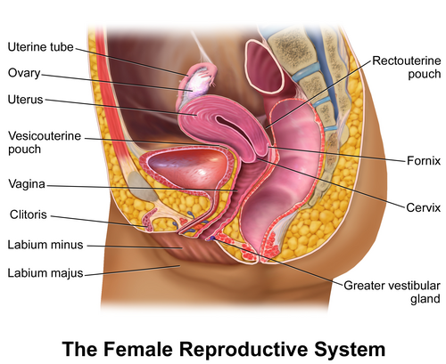
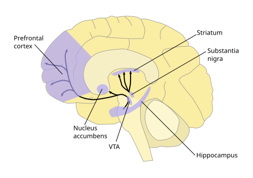

# DISFUNÇÕES SEXUAIS FEMININAS: DESEJO, EXCITAÇÃO E DOR

Para entender as disfunções sexuais femininas, você precisa primeiro abandonar a ideia de que a resposta sexual da mulher funciona como um interruptor de luz, liga ou desliga. Na verdade, ela se parece muito mais com um sistema complexo de som, com vários botões de ajuste fino que interagem entre si. Se você tentar decorar apenas os nomes das patologias, vai errar questões de prova que exigem raciocínio clínico sobre a motivação e a fisiologia.

Historicamente, as bancas cobravam o modelo linear de Masters e Johnson (excitação, platô, orgasmo e resolução). Depois, Helen Kaplan adicionou o "desejo" antes da excitação. Mas o grande salto para as provas modernas, e o que você deve levar para a vida, é o Modelo Circular de Rosemary Basson.

## O Modelo de Resposta Sexual Feminina

*Figura 1 - Anatomia do sistema reprodutor feminino em corte sagital, estrutura fundamental para compreender a fisiologia da resposta sexual. Fonte: BruceBlaus, CC BY 3.0 | Wikimedia Commons*

Por que o modelo de Basson é o preferido das diretrizes atuais, como as da FEBRASGO? Porque ele reconhece que a mulher nem sempre começa o ato sexual com um desejo espontâneo, aquela "vontade do nada". Em relacionamentos de longa duração, é muito comum o desejo ser responsivo.

A mulher começa em um estado de neutralidade sexual. Ela decide se engajar no sexo por motivos que vão além da pulsão biológica, como busca de intimidade, carinho ou parceria. A partir dos estímulos, ela atinge a excitação e, só então, o desejo aparece. Se a prova perguntar sobre uma mulher em um casamento de 10 anos que não tem "fogo espontâneo" mas que gosta e se excita quando começa, saiba que isso não é patológico, é o desejo responsivo.

### Neurobiologia:

*Figura 2 - Vias dopaminérgicas no cérebro, demonstrando o circuito de recompensa fundamental para a resposta sexual (VTA → núcleo accumbens). Fonte: NIDA, Public Domain | Wikimedia Commons*
 O Acelerador e o Freio

O sistema de resposta sexual funciona sob um equilíbrio entre neurotransmissores excitatórios e inibitórios. Imagine um carro.

O acelerador (excitatório) é comandado principalmente pela Dopamina e pela Noradrenalina. Elas aumentam o foco, a motivação e a busca pelo prazer. Já o freio (inibitório) é comandado pela Serotonina e pelos Opioides.

Aqui mora uma pegadinha clássica de prova: por que os antidepressivos ISRS (Inibidores Seletivos da Recaptação de Serotonina) causam tanta disfunção sexual? Porque eles pisam no freio. Ao aumentar a serotonina, eles dificultam a excitação e o orgasmo. Se o examinador colocar um caso de anorgasmia após início de Fluoxetina, a causa é o medicamento.

### Tabela 1: Modelos de Resposta Sexual

| Modelo | Autor | Características Principais |
| --- | --- | --- |
| Linear | Masters e Johnson | Foco na fisiologia (Excitação, Platô, Orgasmo, Resolução). |
| Trifásico | Helen Kaplan | Introduz o Desejo como fase inicial necessária. |
| Circular | Rosemary Basson | Foco na intimidade e no Desejo Responsivo. Ideal para mulheres. |

## Transtorno do Interesse e Excitação Sexual Feminino (TIESF)

O DSM-5-TR unificou o que antes chamávamos separadamente de "Desejo Sexual Hipoativo" e "Transtorno da Excitação". Agora, eles formam uma única entidade diagnóstica. Por que isso foi feito? Porque na prática clínica feminina, é quase impossível separar onde termina a falta de vontade e onde começa a falta de lubrificação. Elas se retroalimentam.

Para o diagnóstico, a paciente deve apresentar pelo menos três dos seguintes critérios por no mínimo 6 meses, causando sofrimento pessoal:

- Ausência ou redução do interesse na atividade sexual.

- Ausência ou redução de pensamentos ou fantasias sexuais.

- Ausência ou redução de iniciativa para atividade sexual e receptividade às tentativas do parceiro.

- Ausência ou redução do prazer/excitação em quase todas as atividades sexuais (75% a 100% das vezes).

- Ausência ou redução do interesse/excitação em resposta a estímulos sexuais internos ou externos.

- Ausência ou redução de sensações genitais ou não genitais durante a atividade sexual.

Cuidado: se a falta de desejo for explicada por um conflito grave no relacionamento, violência doméstica ou uma depressão maior não tratada, você não deve diagnosticar TIESF como disfunção primária. Primeiro trata-se a causa base.

### O papel dos hormônios

Muitos alunos acham que "falta de libido = falta de testosterona". Isso é um erro que as bancas adoram explorar. A testosterona tem, sim, um papel na modulação do desejo, mas não existe um nível de corte laboratorial que defina disfunção. Você nunca deve pedir exames de testosterona para diagnosticar disfunção sexual em mulheres, pois os kits laboratoriais comuns são feitos para níveis masculinos e não têm sensibilidade para mulheres.

O uso de testosterona (Terapia de Reposição Androgênica) só está indicado, segundo a FEBRASGO e a International Menopause Society, para mulheres na pós-menopausa com diagnóstico firmado de desejo hipoativo, após falha de outras terapias. E lembre-se: o objetivo é atingir níveis fisiológicos de uma mulher jovem, não níveis masculinos.

## Transtorno do Orgasmo Feminino (Anorgasmia)

A anorgasmia é a ausência, o retardo acentuado ou a diminuição da intensidade do orgasmo em quase todas as ocasiões (75% a 100%), causando sofrimento, após uma fase de excitação normal.

Aqui, o Dr. Will sempre lembra nas aulas: a maioria das mulheres (cerca de 70% a 80%) não atinge o orgasmo apenas com a penetração vaginal. Elas precisam de estimulação clitoriana direta. Se uma paciente chega dizendo que não tem orgasmo na penetração, mas tem na masturbação ou com estímulo manual, ela NÃO tem anorgasmia. Ela tem uma variante normal da sexualidade feminina.

### Tratamento da Anorgasmia

O tratamento é focado na Terapia Sexual Comportamental. As técnicas mais cobradas em prova são:

- Autofocagem genital: A mulher aprende a conhecer o próprio corpo e os pontos de prazer através da masturbação dirigida.

- Foco Sensorial (Técnica de Masters e Johnson): O casal é orientado a se tocar sem o objetivo de penetração ou orgasmo, reduzindo a ansiedade de desempenho.

- Manobra de ponte: Estimulação clitoriana durante a penetração para facilitar a transição do prazer.

## Dor Gênito-Pélvica e da Penetração

Este é o tópico que mais gera confusão. O DSM-5 unificou o Vaginismo e a Dispareunia nesta categoria, mas as provas de residência ainda amam separar os conceitos. Vamos ser precisos aqui.

### Vaginismo

O vaginismo é caracterizado pela contração involuntária dos músculos do assoalho pélvico (principalmente o músculo levantador do ânus) que impede ou torna muito dolorosa a penetração.

O ponto chave para a prova: a etiologia é predominantemente psicogênica (medo da dor, traumas passados, educação repressora), mas a resposta é física e involuntária. A paciente quer penetrar, mas o corpo "fecha a porta".

Tratamento de primeira linha: Dessensibilização sistemática com o uso de dilatadores vaginais progressivos e fisioterapia pélvica para biofeedback e relaxamento muscular. A terapia focada no casal é fundamental.

### Dispareunia

Dispareunia é, por definição, dor durante o coito. Ela é classificada pela localização:

- Dispareunia de Introito (Superficial): A dor ocorre logo na entrada. Causas comuns: Atrofia vulvovaginal (hipoestrogenismo da menopausa), infecções (candidíase, herpes), lubrificação inadequada ou vulvodínia.

- Dispareunia Profunda: A dor ocorre com a penetração profunda, no fundo de saco vaginal. Causas clássicas: Endometriose (especialmente em ligamentos uterossacros), Doença Inflamatória Pélvica (DIP), tumores pélvicos, retroversão uterina fixa ou adenomiose.

Se a questão descreve uma dor que piora no período pré-menstrual e é profunda, pense imediatamente em endometriose. Se a dor é na entrada, em uma mulher de 60 anos, pense em atrofia e trate com estrogênio tópico.

### Vulvodínia

Este é um diagnóstico de exclusão. É uma dor vulvar crônica (pelo menos 3 meses de duração), sem causa orgânica identificável (exame físico normal, sem infecção, sem dermatose).

O teste padrão-ouro para o diagnóstico é o Teste do Cotonete (Q-tip test): você toca levemente o vestíbulo vulvar com um cotonete e a paciente relata uma dor desproporcional (alodinia). O tratamento envolve cuidados locais (evitar irritantes), fisioterapia pélvica e, em alguns casos, medicamentos para dor neuropática (Amitriptilina ou Gabapentina).

### Tabela 2: Diagnóstico Diferencial da Dor na Penetração

| Condição | Características da Dor | Achados no Exame Físico | Conduta Inicial |
| --- | --- | --- | --- |
| Vaginismo | Medo da penetração + contração muscular. | Contração visível do períneo ao toque. | Dilatadores + Terapia Sexual. |
| Atrofia Vaginal | Secura, queimação, dispareunia de introito. | Mucosa pálida, sem rugosidades, pH > 5. | Estrogênio tópico. |
| Endometriose | Dispareunia profunda, cíclica. | Dor à mobilização do colo, nódulos em fundo de saco. | USG transvaginal com preparo/RNM. |
| Vulvodínia | Dor/ardência crônica no vestíbulo. | Exame normal; Teste do cotonete positivo. | Medidas comportamentais + Neuromoduladores. |

## O Exame Físico na Disfunção Sexual

Não se pula o exame físico em uma queixa sexual. Ele serve para descartar causas orgânicas e para educar a paciente.

- Inspeção: Procure por sinais de dermatoses (como o Líquen Escleroso, que causa prurido e perda da arquitetura vulvar, tratado com Clobetasol).

- Avaliação da Musculatura: Peça para a paciente contrair e relaxar o períneo. Observe se há hipertonia.

- Teste do Cotonete: Essencial para suspeita de vulvodínia.

- Exame Especular: Avalie trofismo, conteúdo vaginal (cervicites causam dor profunda) e pH.

- Toque Bimanual: Fundamental para avaliar dor à mobilização do colo (DIP) ou massas anexiais.

Lembre-se de uma pérola clínica importante: em casos de deiscência de episiorrafia com sinais de celulite (calor, rubor, secreção), a conduta é antibioticoterapia, drenagem se houver coleção e cicatrização por segunda intenção. Não tente suturar novamente uma área infectada.

## Fatores que Interferem na Resposta Sexual

A sexualidade feminina é multifatorial. No MedEvo, sempre reforçamos que você deve olhar para quatro pilares:

- Biológico: Hormônios, doenças crônicas (Diabetes causa neuropatia e reduz lubrificação), medicamentos.

- Psicológico: Depressão, ansiedade, histórico de abuso sexual (sempre investigue abuso em casos de vaginismo e dor pélvica crônica sem causa clara).

- Interpessoal: Qualidade do relacionamento, conflitos, disfunção sexual do parceiro (ex: ejaculação precoce do parceiro gerando ansiedade na mulher).

- Sócio-cultural: Mitos, tabus religiosos, educação restritiva.

### Medicamentos e Sexualidade

Além dos já citados ISRS, outros fármacos comuns em provas diminuem a libido:

- Espironolactona (efeito antiandrogênico).

- Contraceptivos Orais Combinados (aumentam a SHBG, que se liga à testosterona livre, diminuindo sua biodisponibilidade).

- Betabloqueadores.

- Antipsicóticos (aumentam a prolactina).

Por outro lado, a hiperprolactinemia (seja por prolactinoma ou por remédios) é uma causa clássica de desejo hipoativo e secura vaginal, pois inibe o eixo gonadotrófico.

### Tabela 3: Medicamentos e Impacto Sexual

| Medicamento | Efeito na Função Sexual | Mecanismo |
| --- | --- | --- |
| Fluoxetina / Sertralina | ↓ Desejo, ↓ Orgasmo | ↑ Serotonina (freio central). |
| Espironolactona | ↓ Desejo | Bloqueio de receptores androgênicos. |
| ACO Combinado | ↓ Desejo, ↓ Lubrificação | ↑ SHBG (↓ Testosterona livre). |
| Risperidona | ↓ Desejo | Hiperprolactinemia (supressão do eixo). |
| Tibolona | ↑ Desejo | Ação androgênica (indicada na menopausa). |

## Situações Especiais: Ciclo Gravídico-Puerperal

A gestação e o pós-parto são períodos críticos. Na gestação, o desejo é flutuante (geralmente cai no 1º tri pelo mal-estar, sobe no 2º pela congestão pélvica e cai no 3º pelo desconforto físico).

No puerpério, temos o "combo do deserto":

- Prolactina alta (inibe estrogênio e testosterona).

- Privação de sono e fadiga.

- Alteração da imagem corporal.

- Depressão Pós-Parto (DPP): Se a paciente apresentar tristeza, anedonia e culpa por mais de 2 semanas, com impacto funcional, o diagnóstico é DPP. Lembre-se que histórico de ansiedade prévia é um fator de risco importante.

Se houver queixa de dispareunia no pós-parto em mulher amamentando, a causa mais provável é a atrofia vaginal pela hipoestrogenemia da lactação. O tratamento é estrogênio tópico, que não interfere na amamentação.

## Mastalgia: Quando a dor não é no coito

Embora o tema principal seja disfunção sexual, a mastalgia (dor mamária) frequentemente aparece correlacionada em provas de ginecologia.

A maioria das mastalgias é cíclica (piora na fase lútea) e bilateral. O primeiro passo é sempre afastar malignidade pelo exame físico e, se necessário, imagem. Uma vez descartado o câncer, a conduta é orientação e suporte (uso de sutiã adequado, dieta).

Se a dor for intensa e refratária às medidas iniciais, o Tamoxifeno (em doses baixas, 10mg) é o tratamento medicamentoso com maior evidência de eficácia, apesar dos efeitos colaterais.

## Abordagem Clínica: O Modelo PLISSIT

Para organizar o atendimento, usamos o modelo PLISSIT, que ajuda o médico generalista a saber até onde ir:

- P (Permission): Dar permissão para a paciente falar sobre sexo. "Muitas mulheres com sua condição sentem mudanças na vida sexual. Isso acontece com você?".

- LI (Limited Information): Fornecer informações limitadas e mitigar mitos. Ex: Explicar que a falta de lubrificação na menopausa é normal e tratável.

- SS (Specific Suggestions): Sugestões específicas. Ex: Indicar o uso de lubrificantes à base de água ou mudar o horário da medicação.

- IT (Intensive Therapy): Encaminhamento para especialista (terapeuta sexual ou ginecologista especializado).

A maioria dos problemas de prova se resolve nos três primeiros degraus.

### Tabela 4: Critérios Diagnósticos DSM-5-TR (Resumo)

| Transtorno | Critério Essencial | Tempo Mínimo |
| --- | --- | --- |
| Interesse/Excitação (TIESF) | Redução de desejo E/OU excitação (3 de 6 sintomas). | 6 meses |
| Orgasmo Feminino | Ausência/atraso do orgasmo com excitação normal. | 6 meses |
| Dor Gênito-Pélvica (GPPPD) | Dor na penetração, medo da dor ou contração muscular. | 6 meses |
| Aversão Sexual | Esquiva persistente e extrema ao contato sexual. | N/A |

## Pontos-Chave para Prova

- Vaginismo: A contração é INVOLUNTÁRIA. O tratamento padrão é a dessensibilização sistemática com dilatadores e terapia comportamental.

- Desejo Responsivo: É o modelo de Basson. Comum em mulheres em relacionamentos estáveis. Não é doença!

- Dispareunia Profunda: Pense em Endometriose, DIP ou Adenomiose.

- Dispareunia de Introito: Pense em Atrofia Vaginal (pós-menopausa) ou Vulvodínia.

- Vulvodínia: Dor crônica (> 3 meses) com exame físico normal. Diagnóstico pelo Teste do Cotonete (alodinia).

- Anorgasmia: Só é disfunção se houver sofrimento. A maioria das mulheres precisa de estímulo clitoriano; a ausência de orgasmo apenas com penetração não é patológica.

- Antidepressivos (ISRS): São os grandes vilões da fase de excitação e orgasmo nas provas.

- Testosterona: Não se pede de rotina. Só se usa na pós-menopausa com diagnóstico de desejo hipoativo e após falha de outras medidas.

- Líquen Escleroso: Causa prurido e dispareunia. Tratamento é Corticoide Ultrapotente (Clobetasol).

- Depressão Pós-Parto: Sintomas por > 2 semanas. Diferencie do Blues Puerperal (mais leve, dura até 10-14 dias, sem prejuízo funcional).

- Mastalgia Cíclica: Orientação é a primeira conduta. Tamoxifeno é para casos graves e refratários.

- Mulheres são multiorgásmicas: Diferente dos homens, elas geralmente não possuem período refratário obrigatório.

- Impotência Primária (Disfunção Erétil Primária): No homem, é a disfunção com a menor taxa de cura.

- Hemorroidas na Gestação: Conduta inicial é sempre conservadora (fibras, banhos de assento).

- Pegadinha de Prova: A alternativa dirá que toda dispareunia é psicológica. Errado! Pode ser orgânica (atrofia, endometriose) ou psicogênica. 🩺

 Cópia offline para consulta pessoal.
 Fonte original:
 [https://www.medevo.com.br/material-apoio/ler/7462a833-57e5-4153-916e-2cce65acda67](https://www.medevo.com.br/material-apoio/ler/7462a833-57e5-4153-916e-2cce65acda67)
