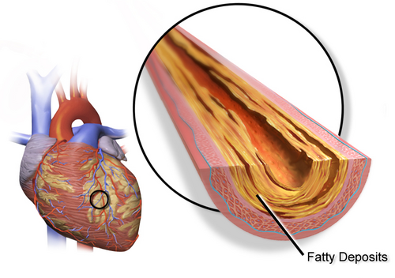
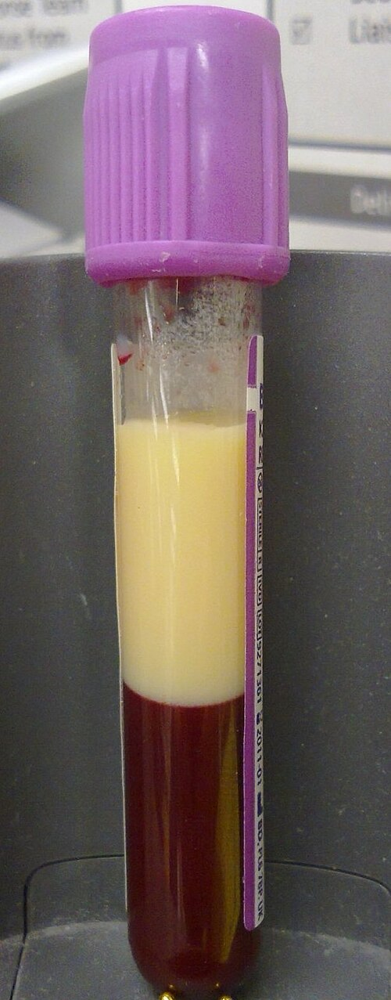

# DISLIPIDEMIAS NA APS: RASTREAMENTO E ESTRATIFICAÇÃO DE RISCO CARDIOVASCULAR

As dislipidemias representam um dos pilares fundamentais das Doenças Crônicas Não Transmissíveis (DCNT). Na Atenção Primária à Saúde (APS), o manejo do colesterol não é uma busca por números isolados, mas uma estratégia de redução de desfechos duros: infarto agudo do miocárdio (IAM) e acidente vascular cerebral (AVC). No Brasil, as doenças cardiovasculares (DCV) continuam sendo a principal causa de morte, e a compreensão de que o evento coronário agudo é a primeira manifestação da aterosclerose em uma proporção significativa de indivíduos — e não apenas em uma minoria — reforça a urgência do rastreamento eficaz.

O tema transita entre Clínica Médica, Cardiologia e Medicina Preventiva. A conduta não depende apenas do valor isolado de LDL-c, mas da estratificação global do risco cardiovascular aterosclerótico, da presença de diabetes, doença renal, aterosclerose subclínica, fatores agravantes e contexto de prevenção primária ou secundária.

## Fisiopatologia

*Figura 1 - Ilustração da formação de placa aterosclerótica em artéria coronária, demonstrando o acúmulo de LDL oxidado, células espumosas e núcleo lipídico característico do ateroma. Fonte: BruceBlaus, CC BY 3.0 | Wikimedia Commons*
 A Dinâmica das Lipoproteínas e a Gênese da Placa

O colesterol e os triglicérides são gorduras hidrofóbicas que necessitam de transporte especializado para circular no plasma. Esse transporte é feito pelas lipoproteínas, complexos macromoleculares compostos por um núcleo lipídico e uma casca de apolipoproteínas.

### O Papel das Lipoproteínas

*Figura 2 - Amostra de sangue de paciente com hiperlipidemia grave, evidenciando a camada lipídica (aspecto leitoso) separada após repouso, indicando níveis extremamente elevados de triglicérides. Fonte: Mark-shea, Public Domain | Wikimedia Commons*

As apolipoproteínas (Apo) funcionam como os "capitães" dessas partículas, direcionando-as para receptores específicos ou ativando enzimas metabólicas.

- **LDL (Low-Density Lipoprotein):** É a principal partícula aterogênica. Sua função fisiológica é levar o colesterol do fígado para os tecidos. O problema surge quando há excesso: o LDL infiltra-se no espaço subendotelial, sofre oxidação e desencadeia uma cascata inflamatória. Macrófagos tentam limpar esse excesso, transformando-se em células espumosas (*foam cells*), o cerne da placa de ateroma.

- **HDL (High-Density Lipoprotein):** Atua no transporte reverso, retirando o colesterol dos tecidos e das artérias para ser excretado pelo fígado. Níveis elevados de HDL-c são classicamente considerados fatores protetores cardiovasculares.

- **Triglicérides (TG):** Embora não sejam diretamente aterogênicos como o LDL, níveis elevados sinalizam a presença de lipoproteínas remanescentes ricas em triglicérides, que são altamente inflamatórias. Além disso, a hipertrigliceridemia grave (> 500 mg/dL) impõe um risco agudo de pancreatite, que muitas vezes precede a preocupação cardiovascular.

### Aterosclerose Assintomática

A doença aterosclerótica é silenciosa. A avaliação intuitiva do risco é perigosamente imprecisa devido à complexidade e ao sinergismo dos fatores de risco. Um paciente pode ter um LDL "normal" para a média da população, mas se ele for tabagista e hipertenso, esse LDL já é tóxico para o seu endotélio. Por isso, a estratificação de risco serve para identificar subgrupos e diferenciar o cuidado dentro da Rede de Atenção à Saúde.

## Diagnóstico Laboratorial e o Fim do Jejum Obrigatório

Uma das atualizações mais importantes das diretrizes brasileiras (SBC) nos últimos anos foi a flexibilização do jejum para o perfil lipídico. Na APS, isso facilita a adesão do paciente e reduz o absenteísmo nos exames.

### Quando o Jejum ainda é Necessário?

O estado pós-prandial reflete melhor o tempo de exposição aterogênica diária. No entanto, o jejum de 12 horas permanece indicado se:

- O paciente apresentar TG > 400 mg/dL em exame anterior sem jejum.

- Houver histórico de hipertrigliceridemia grave.

- O médico solicitar especificamente para avaliação de distúrbios metabólicos raros.

### A Fórmula de Friedewald e suas Limitações

A maioria dos laboratórios calcula o LDL através da fórmula: **LDL-c = CT – HDL-c – (TG/5)**.
Cuidado: essa fórmula é inválida se os triglicérides estiverem acima de 400 mg/dL. Nesses casos, deve-se solicitar a dosagem direta do LDL ou utilizar o **Colesterol Não-HDL (CT - HDL)**. A diretriz de 2024 reforça que o Não-HDL é um alvo secundário valioso, pois engloba todas as partículas aterogênicas (LDL, VLDL e IDL).

**Tabela 1: Valores de Referência em Adultos (SBC 2024)**

| Parâmetro | Referência (mg/dL) | Observação Clínica |
| --- | --- | --- |
| Colesterol Total | < 190 | Valor desejável para rastreamento inicial. |
| HDL-c | > 40 | Fator protetor se elevado; risco se baixo. |
| Triglicérides | < 150 (com jejum) | < 175 se colhido sem jejum. |
| LDL-c | Alvo individualizado | Definido pela estratificação de risco. |
| Não-HDL | Alvo individualizado | Geralmente 30 mg/dL acima da meta do LDL. |

## Rastreamento: O "Quando" e o "Quem" na APS

O rastreamento de dislipidemia é uma forma de detecção precoce de condição assintomática e integra a prevenção cardiovascular. Diretrizes podem divergir nos pontos de corte e na periodicidade; por isso, a APS deve combinar recomendações populacionais com estratificação individual de risco.

### Visão da Sociedade Brasileira de Cardiologia (SBC)

A SBC recomenda o rastreamento do perfil lipídico para todos os adultos acima de **20 anos**. Se o perfil for normal e o risco cardiovascular for baixo, o exame deve ser repetido a cada **5 anos**.

### Visão do Ministério da Saúde e USPSTF

Focada em custo-efetividade populacional, a recomendação costuma ser:

- **Homens:** Iniciar aos 35 anos (ou 20 anos se houver fatores de risco).

- **Mulheres:** Iniciar aos 45 anos (ou 20 anos se houver fatores de risco).

- **Fatores de Risco para antecipar rastreio:** Diabetes, hipertensão, tabagismo, obesidade (IMC > 30), história familiar de doença cardiovascular precoce (homens < 55 anos, mulheres < 65 anos).

**Dica de Prova:** Se a questão focar em "Saúde do Homem" ou "Rastreamento em Adultos Assintomáticos", o homem de 40 anos é o alvo clássico para dosagem de colesterol total e frações.

## Estratificação de Risco Cardiovascular: Diretriz SBC 2025

A Diretriz Brasileira de Dislipidemias e Prevenção da Aterosclerose de 2025 organiza a decisão terapêutica em cinco categorias de risco cardiovascular aterosclerótico: baixo, intermediário, alto, muito alto e extremo. A lógica é simples: quanto maior o risco absoluto, menor a meta de LDL-c e maior a intensidade do tratamento.

A estratificação deve seguir uma sequência prática: primeiro identificar doença cardiovascular aterosclerótica manifesta ou critérios de risco extremo; depois procurar aterosclerose subclínica, LDL-c muito elevado, diabetes e fatores agravantes; por fim, quando não houver critério automático, calcular o risco em 10 anos.

### Categorias de Risco Cardiovascular Aterosclerótico — SBC 2025

| Categoria | Critérios principais | Meta LDL-c | Redução mínima | Meta não-HDL-c | Meta ApoB |
| --- | --- | --- | --- | --- | --- |
| Baixo | Risco calculado < 5% em 10 anos, sem agravantes, sem DM2, LDL-c < 160 mg/dL | < 115 mg/dL | ≥ 30% | < 145 mg/dL | < 100 mg/dL |
| Intermediário | Risco 5% a < 20%; ou risco < 5% com agravante; ou LDL-c 160–189 mg/dL; ou DM2 em homem < 50 anos/mulher < 56 anos sem EAR/EMAR | < 100 mg/dL | ≥ 30% | < 130 mg/dL | < 90 mg/dL |
| Alto | Risco ≥ 20%; ou risco intermediário com agravante; ou aterosclerose subclínica; ou LDL-c ≥ 190 mg/dL; ou Lp(a) > 180 mg/dL; ou DM2 conforme idade/EAR | < 70 mg/dL | ≥ 50% | < 100 mg/dL | < 70 mg/dL |
| Muito alto | Doença aterosclerótica significativa ou evento aterosclerótico prévio; obstrução arterial ≥ 50%; CAC > 300 UA; DM2 com EMAR ou ≥ 3 EAR | < 50 mg/dL | ≥ 50% | < 80 mg/dL | < 55 mg/dL |
| Extremo | Múltiplos eventos cardiovasculares ateroscleróticos maiores ou 1 evento maior associado a ≥ 2 condições de alto risco | < 40 mg/dL | ≥ 50% | < 70 mg/dL | < 45 mg/dL |

**Atenção:** o colesterol não-HDL é meta coprimária, especialmente útil quando há hipertrigliceridemia, resistência à insulina, diabetes ou suspeita de excesso de partículas aterogênicas. A ApoB é meta secundária, mas tem valor particular em pacientes com diabetes, hipertrigliceridemia ou discordância entre LDL-c e carga aterogênica real.

### Fluxograma Prático de Estratificação na APS

Paciente com perfil lipídico alterado ou rastreamento cardiovascular
 ↓
1. Há evento cardiovascular aterosclerótico prévio?
 • IAM, SCA recente, AVC isquêmico, AIT, doença arterial periférica sintomática
 ↓
 Sim → avaliar critérios de RISCO EXTREMO
 • múltiplos eventos maiores; ou
 • 1 evento maior + ≥ 2 condições de alto risco
 ↓
 Se não extremo → MUITO ALTO RISCO

2. Sem evento prévio: há doença aterosclerótica significativa?
 • obstrução arterial ≥ 50% em território coronário, carotídeo, cerebral ou periférico
 • CAC > 300 UA
 ↓
 Sim → MUITO ALTO RISCO

3. Há critérios automáticos de ALTO RISCO?
 • LDL-c ≥ 190 mg/dL
 • Lp(a) > 180 mg/dL ou > 390 nmol/L
 • aterosclerose subclínica: placa carotídea < 50%, CAC > 100 UA ou percentil > 75,
 placas < 50% em angioTC de coronárias, aneurisma de aorta abdominal
 • DM2 homem ≥ 50 anos ou mulher ≥ 56 anos sem EMAR
 • DM2 em qualquer idade com 1 ou 2 EAR e sem EMAR
 ↓
 Sim → ALTO RISCO

4. Se DM2 sem critérios acima:
 • homem < 50 anos ou mulher < 56 anos, sem EAR e sem EMAR → INTERMEDIÁRIO
 • DM2 com ≥ 3 EAR ou pelo menos 1 EMAR → MUITO ALTO

5. Se não houver DM2 nem critério automático:
 • calcular risco aterosclerótico em 10 anos
 • < 5% sem agravante → BAIXO
 • < 5% com agravante → INTERMEDIÁRIO
 • 5% a < 20% sem agravante → INTERMEDIÁRIO
 • 5% a < 20% com agravante → ALTO
 • ≥ 20% → ALTO

### Fatores Agravantes de Risco

Fatores agravantes refinam a classificação quando o risco calculado parece subestimar o risco real. Na diretriz de 2025, merecem busca ativa:

| Grupo | Exemplos relevantes |
| --- | --- |
| História familiar | Doença cardiovascular prematura em parente de 1º grau: < 55 anos em homens ou < 65 anos em mulheres |
| Adiposidade e metabolismo | Adiposidade, síndrome metabólica, esteatose hepática metabólica/MASLD, especialmente com fibrose ou outros fatores cardiometabólicos |
| Inflamação crônica | Artrite reumatoide, psoríase, lúpus, doença inflamatória intestinal, infecção crônica pelo HIV |
| Transplante | Transplante de coração, rim, fígado ou outros órgãos sólidos |
| Mulheres | Menarca ≤ 12 anos ou ≥ 17 anos, pré-eclâmpsia/eclâmpsia/hipertensão gestacional, diabetes gestacional, parto prematuro, restrição de crescimento intrauterino, ≥ 3 abortos espontâneos, menopausa precoce |
| Biomarcadores | Lp(a) ≥ 50 mg/dL ou ≥ 125 nmol/L; PCR-us ≥ 2,0 mg/L |

### Estratificação Especial no Diabetes Mellitus Tipo 2

O diabetes tipo 2 tem poder aterogênico próprio e não deve ser tratado como simples fator isolado. A diretriz de 2025 separa **estratificadores de alto risco (EAR)** e **estratificadores de muito alto risco (EMAR)**.

| Situação no DM2 | Categoria sugerida |
| --- | --- |
| Homem < 50 anos ou mulher < 56 anos, sem EAR e sem EMAR | Intermediário |
| Homem ≥ 50 anos ou mulher ≥ 56 anos, sem EMAR | Alto |
| Qualquer idade com 1 ou 2 EAR, sem EMAR | Alto |
| DM2 com ≥ 3 EAR ou pelo menos 1 EMAR | Muito alto |
| DM2 associado a evento cardiovascular maior + outras condições de alto risco | Considerar risco extremo conforme critérios gerais |

**EAR — estratificadores de alto risco no DM2:** duração do DM2 > 10 anos, história familiar de doença arterial coronariana prematura, síndrome metabólica, hipertensão arterial, tabagismo ativo, doença renal de alto risco, placa carotídea ou coronária com estenose < 50%, CAC 10–300 UA, aneurisma de aorta abdominal, neuropatia autonômica cardiovascular incipiente e retinopatia diabética não proliferativa leve.

**EMAR — estratificadores de muito alto risco no DM2:** síndrome coronária aguda, infarto antigo ou angina estável, AVC aterotrombótico ou AIT, insuficiência vascular periférica ou amputação, estenose arterial > 50%, revascularização arterial, DM1 com duração > 20 anos diagnosticado após os 18 anos, presença de ≥ 3 EAR, EMAR renal, colesterol total > 310 mg/dL ou LDL-c > 190 mg/dL, neuropatia autonômica cardiovascular instalada, retinopatia diabética moderada a severa/proliferativa ou evidência de progressão.

DM2 na APS
 ↓
Verificar idade e estratificadores
 ↓
Sem EAR/EMAR + H < 50 anos ou M < 56 anos → risco intermediário
H ≥ 50 anos ou M ≥ 56 anos sem EMAR → alto risco
1 ou 2 EAR sem EMAR → alto risco
≥ 3 EAR ou qualquer EMAR → muito alto risco
Evento CV maior + ≥ 2 condições alto risco → risco extremo

## Níveis de Prevenção Aplicados às Dislipidemias e APS

Este conceito é a base da Medicina Preventiva e cai em todas as provas de residência. Vamos aplicar ao contexto cardiovascular:

- **Prevenção Primordial:** Evitar a instalação dos fatores de risco na sociedade. Exemplo: Leis que proíbem gordura trans em alimentos ou políticas de taxação de bebidas açucaradas. O objetivo é que a criança de hoje não seja o obeso dislipidêmico de amanhã.

- **Prevenção Primária:** O fator de risco existe (ex: LDL 160), mas a doença não. O objetivo é evitar o primeiro IAM. Aqui entra o cálculo do ERG e o início de estatinas em pacientes de alto risco assintomáticos.

- **Prevenção Secundária:** A doença já se manifestou (ex: paciente pós-AVC). O objetivo é evitar a recorrência. As metas aqui são agressivas (LDL < 50 ou < 40).

- **Prevenção Terciária:** Reabilitação. Exemplo: Fisioterapia cardiovascular pós-infarto para reduzir incapacidades.

- **Prevenção Quaternária:** Proteger o paciente de intervenções médicas excessivas ou desnecessárias. Exemplo: Suspender sinvastatina em um idoso de 90 anos frágil, com baixo risco e efeitos colaterais (mialgia), onde o benefício da droga é superado pelo risco de quedas e polifarmácia. É o combate à sobremedicalização.

- **Prevenção Quinquenária:** Cuidado com a saúde mental e física do profissional de saúde, evitando o burnout para garantir um cuidado seguro.

## A Consulta de Rastreamento na APS: Além dos Lípides

Quando um paciente de 50 anos procura a Unidade Básica de Saúde para um "check-up", o médico deve realizar um rastreamento integrado. O rastreamento de dislipidemia é apenas uma parte da avaliação da saúde do adulto.

### Rastreamento Cardiovascular Global

Inclui: Avaliação do tabagismo, aferição da PA, cálculo do IMC e circunferência abdominal (obesidade central), glicemia de jejum e perfil lipídico. Em pacientes hipertensos, o rastreamento de ácido úrico anualmente é recomendado devido à sua associação com risco metabólico.

### Outros Rastreios Importantes na APS

- **Câncer Colorretal (CCR):** Homens e mulheres de 45 a 75 anos (Pesquisa de Sangue Oculto nas Fezes anual ou Colonoscopia a cada 10 anos).

- **Câncer de Próstata:** O rastreamento populacional sistemático não é recomendado pelo Ministério da Saúde. Deve haver decisão compartilhada (Cuidado Centrado no Paciente), discutindo riscos e benefícios do PSA/Toque em homens > 50 anos (ou 45 com fatores de risco).

- **Câncer de Pulmão:** Tomografia de baixa dose anual para tabagistas (≥ 20 maços/ano) entre 50-80 anos que fumam ou pararam há menos de 15 anos.

- **Osteoporose:** Densitometria óssea para mulheres ≥ 65 anos ou mulheres na pós-menopausa com fatores de risco (tabagismo, baixo peso, uso de corticoide).

- **Saúde Visual:** Rastreio com tabela de Snellen em idosos > 65 anos para detecção de acuidade visual reduzida.

## Manejo Não Farmacológico: Mudanças de Estilo de Vida (MEV)

O manejo inicial da dislipidemia em pacientes de baixo ou intermediário risco deve focar na MEV por 3 a 6 meses antes de considerar fármacos.

- **Atividade Física:** A recomendação da OMS e SBC é de pelo menos 150 minutos/semana de atividade aeróbica moderada, somada a 2 dias/semana de fortalecimento muscular. Isso reduz o risco de IAM e melhora o perfil de HDL e TG.

- **Dieta:** A qualidade das gorduras importa mais que a quantidade total. Deve-se priorizar gorduras insaturadas (azeite, castanhas, peixes) e reduzir saturadas (< 7% das calorias) e trans (zero). Dieta rica em frutas e fibras solúveis (aveia) é protetora.

- **Cessação do Tabagismo:** É a intervenção isolada mais impactante na redução do risco cardiovascular global.

## Tratamento Farmacológico: Estatinas e Além

As estatinas são a primeira linha. Elas inibem a HMG-CoA redutase, aumentando a expressão de receptores de LDL no fígado.

### Potência das Estatinas e Terapia Combinada

- **Alta potência (redução de LDL-c ≥ 50%):** atorvastatina 40–80 mg ou rosuvastatina 20–40 mg. Preferir em risco alto, muito alto e extremo.

- **Potência moderada (redução de LDL-c 30–50%):** sinvastatina 20–40 mg, atorvastatina 10–20 mg ou rosuvastatina 5–10 mg.

- **Terapia combinada:** em risco muito alto ou extremo, ou quando a meta não é atingida, associar ezetimiba precocemente. Se LDL-c permanecer acima da meta com estatina em dose máxima tolerada + ezetimiba, considerar terapia anti-PCSK9 conforme disponibilidade e perfil de risco.

- **Diabetes:** estatina é a escolha inicial quando LDL-c está acima da meta; ezetimiba e anti-PCSK9 são opções sequenciais se a meta não for atingida. Em retinopatia diabética leve, fenofibrato pode reduzir progressão da retinopatia, mas não substitui o controle prioritário de LDL-c/não-HDL-c.

### Efeitos Adversos e Contraindicações

- **Mialgia:** O efeito colateral mais comum. A rabdomiólise (CPK > 10x LSN + dano renal) é rara.

- **Elevação de Transaminases:** A contraindicação formal é a elevação persistente de ALT/AST > 3x o limite superior do normal. Uma elevação leve não exige suspensão, apenas monitoramento.

- **Gravidez:** Estatinas são categoria X (contraindicadas). Devem ser suspensas em mulheres que planejam engravidar.

### Outras Drogas

- **Ezetimiba:** Inibe a absorção intestinal de colesterol. Usada em associação com estatinas quando a meta não é atingida.

- **Fibratos:** Primeira escolha se **Triglicérides > 500 mg/dL** para prevenir pancreatite. **Cuidado:** Nunca associe Genfibrozila com estatinas (alto risco de rabdomiólise). Se precisar associar, use o Fenofibrato.

- **Inibidores da PCSK9:** Anticorpos monoclonais potentes para casos de altíssimo risco ou Hipercolesterolemia Familiar que não atingem metas com terapia máxima oral.

## Situações Especiais na APS

### O Idoso na APS

Em idosos (> 75 anos), a prevenção primária com estatinas é controversa. Deve-se avaliar a funcionalidade e a expectativa de vida. Já na prevenção secundária (pós-IAM), o benefício é claro e deve ser mantido, respeitando a tolerância do paciente.

### Hipercolesterolemia Familiar (HF)

Suspeite sempre que o LDL-c for > 190 mg/dL. É uma doença genética autossômica dominante. O achado físico patognomônico é o **Xantoma Tendinoso** (especialmente no tendão de Aquiles). O arco corneano em pacientes < 45 anos também é um forte sinal.

### Aconselhamento em Puericultura

A prevenção cardiovascular começa na infância. Hábitos de vida saudáveis devem ser estimulados desde cedo. O rastreio lipídico em crianças é indicado se houver história familiar de IAM precoce ou se a criança tiver fatores de risco (obesidade, HAS). Detalhar os fatores de risco do familiar é essencial para avaliar o risco da criança.

**Tabela 3: Resumo de Rastreamento e Conduta na APS**

| Perfil do Paciente | Rastreamento Inicial | Conduta se Alterado |
| --- | --- | --- |
| Adulto 20-35a sem FR | Perfil lipídico a cada 5 anos | MEV se LDL fora da meta do ERG. |
| Adulto com DM ou HAS | Perfil lipídico anual | Estatina conforme estratificação de risco e meta de LDL-c/não-HDL-c. |
| Homem > 50a tabagista | Perfil lipídico + Glicemia + PSA (compartilhado) | Cessação tabágica + Estatina se ERG alto. |
| Mulher > 65a | Perfil lipídico + Densitometria Óssea | Avaliar risco de fratura e risco CV. |
| TG > 500 mg/dL | Perfil lipídico imediato | Fibrato + Dieta zero álcool/açúcar. |

## Pontos-Chave para Prova

- O risco cardiovascular global é mais importante que o valor isolado do LDL para definir conduta.

- A meta de LDL para risco **Extremo** é < 40 mg/dL e para risco **Muito Alto** é < 50 mg/dL (SBC 2024).

- O jejum não é obrigatório para o perfil lipídico na maioria dos casos, facilitando o rastreio na APS.

- LDL ≥ 190 mg/dL indica tratamento com estatina de alta potência, independente do escore de risco.

- Diabetes Mellitus associado à Hipertensão ou lesão de órgão-alvo classifica o paciente como **Alto Risco**.

- A prevenção quaternária busca evitar a iatrogenia e a sobremedicalização, especialmente em idosos frágeis.

- O uso de AAS em prevenção primária é desencorajado para risco intermediário devido ao risco de sangramento.

- A atividade física recomendada é de ≥ 150 min/semana de exercícios aeróbicos moderados.

- A contraindicação absoluta para estatinas inclui gravidez, amamentação e doença hepática ativa (TGP > 3x LSN).

- Fibratos são indicados prioritariamente quando TG > 500 mg/dL para evitar pancreatite.

- A fórmula de Friedewald não deve ser usada se TG > 400 mg/dL.

- História familiar de IAM precoce é um fator agravante que pode elevar a categoria de risco do paciente.

- O rastreamento de câncer colorretal deve iniciar aos 45 anos para a população geral.

- A avaliação da circunferência abdominal e IMC é essencial para estratificar o risco metabólico.

- Em prevenção secundária, nunca suspenda a estatina apenas porque a meta foi atingida; o benefício é contínuo. 🚀

 Cópia offline para consulta pessoal.
 Fonte original:
 [https://www.medevo.com.br/material-apoio/ler/77aa6797-9dd5-4cb9-bf4e-ca6e55ae34c4](https://www.medevo.com.br/material-apoio/ler/77aa6797-9dd5-4cb9-bf4e-ca6e55ae34c4)
