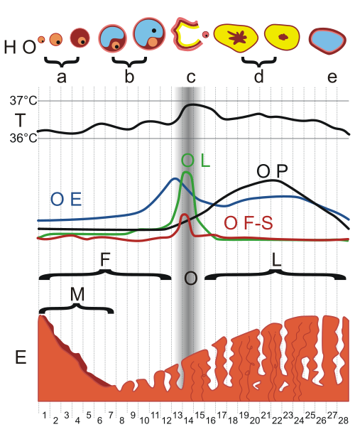

# DISMENORREIA

A dismenorreia, popularmente conhecida como cólica menstrual, é muito mais do que um simples desconforto. Para as provas de residência e para a sua prática no consultório, você deve entendê-la como uma dor pélvica cíclica, relacionada ao período menstrual, que pode ser o sintoma de uma adaptação fisiológica exacerbada ou o sinal de alerta para patologias pélvicas graves.

Muitos alunos cometem o erro de achar que toda cólica é igual. Não é. O segredo para acertar as questões e tratar bem sua paciente está em saber diferenciar se aquela dor tem uma causa anatômica (secundária) ou se é apenas um excesso de produção de substâncias inflamatórias pelo próprio endométrio (primária).

## Classificação e Definições

A primeira coisa que você precisa fixar é a divisão clássica. As bancas adoram cobrar a diferenciação entre dismenorreia primária e secundária, e os detalhes clínicos são as pistas que elas deixam no enunciado.

### Dismenorreia Primária

*Figura 1 - Diagrama do ciclo menstrual mostrando as fases folicular e lútea, variações hormonais (FSH, LH, estrogênio, progesterona) e alterações endometriais que fundamentam a fisiopatologia da dismenorreia primária. Fonte: Speck-Made/A7N8X, CC BY-SA 3.0 | Wikimedia Commons*

É a dor menstrual que ocorre na ausência de qualquer patologia pélvica identificável. Ou seja, o aparelho reprodutor é anatomicamente normal. Ela é extremamente comum em adolescentes e mulheres jovens, geralmente surgindo de 6 a 24 meses após a menarca, que é o tempo necessário para o estabelecimento dos ciclos ovulatórios.

Por que isso é importante? Porque a dismenorreia primária só acontece em ciclos ovulatórios. Se a paciente não ovula, ela não produz progesterona de forma adequada, não forma um endométrio secretor e, consequentemente, não tem a cascata inflamatória que gera a dor intensa. Guarde isso: dismenorreia primária é sinônimo de ciclo ovulatório.

### Dismenorreia Secundária

*Figura 2 - Diagrama do útero demonstrando endometriose em tubas uterinas e endometrioma no ovário direito, principal causa de dismenorreia secundária. Fonte: Femke, CC BY 4.0 | Wikimedia Commons*

Aqui, a dor é um sintoma de uma doença subjacente. Existe uma causa orgânica, uma alteração no sistema reprodutor. Ela costuma surgir anos após a menarca, em mulheres mais velhas (acima dos 25 ou 30 anos), e tende a ser progressiva.

As causas mais comuns que você encontrará nas questões são:

- Endometriose (a grande campeã das provas).

- Adenomiose (útero aumentado e dor).

- Miomas (especialmente os submucosos).

- Estenose cervical ou malformações Müllerianas.

- Doença Inflamatória Pélvica (DIP) crônica.

## Fisiopatologia: O Porquê da Dor

Para entender o tratamento, você precisa entender a química do útero. Na dismenorreia primária, o vilão tem nome: Prostaglandinas, especificamente a Prostaglandina F2-alfa (PGF2-alfa) e a PGE2.

Tudo começa após a ovulação. Com a queda dos níveis de progesterona no final do ciclo, ocorre a lise dos lisossomos das células endometriais, liberando a enzima fosfolipase A2. Essa enzima atua sobre os fosfolipídios da membrana celular, liberando ácido araquidônico. Através da via da cicloxigenase (COX), esse ácido é transformado em prostaglandinas.

O excesso de PGF2-alfa causa:

- Contrações miometriais intensas e desordenadas.

- Vasoconstrição das artérias espiraladas.

- Isquemia tecidual e hipóxia.

- Sensibilização das terminações nervosas à dor.

É por isso que a dor é do tipo cólica. É o útero "espremendo" para expulsar o endométrio, mas com uma força tão grande que gera isquemia, semelhante a uma angina cardíaca, mas no miométrio. Além das prostaglandinas, os leucotrienos também estão elevados no endométrio de mulheres com dismenorreia, o que explica por que algumas pacientes não melhoram 100% apenas com inibidores da COX.

Como o Dr. Will sempre reforça em suas discussões no MedEvo, se você entende que a causa é o excesso de prostaglandina, você entende por que o Anti-inflamatório Não Esteroide (AINE) é a primeira linha: ele bloqueia a produção do vilão na fonte.

## Quadro Clínico e Diagnóstico

O diagnóstico da dismenorreia é eminentemente clínico. Na maioria das vezes, uma boa anamnese e um exame físico normal em uma adolescente são suficientes para diagnosticar a forma primária e iniciar o tratamento.

### Características da Dismenorreia Primária

A dor costuma começar algumas horas antes ou logo após o início do fluxo menstrual. Ela dura, em média, de 48 a 72 horas (os primeiros dois dias são os piores). A localização clássica é no hipogástrio (baixo ventre), mas atenção para a irradiação: é muito comum a dor irradiar para a região lombo-sacra e para a face posterior das coxas, simulando às vezes uma dor ciática.

Além da dor pélvica, a tempestade de prostaglandinas na corrente sanguínea pode causar sintomas sistêmicos:

- Náuseas e vômitos.

- Diarreia (a prostaglandina estimula a musculatura lisa do intestino).

- Cefaleia e tontura.

- Fadiga.

### Sinais de Alerta para Dismenorreia Secundária

Você deve suspeitar que algo está errado (causa orgânica) quando:

- A dor começa antes dos ciclos ovulatórios se estabelecerem ou surge após os 25 anos.

- A dor é progressiva (piora a cada mês).

- A dor não se limita ao período menstrual (dor pélvica crônica ou dispareunia).

- O fluxo menstrual é excessivamente pesado (sugerindo miomas ou adenomiose).

- Não há resposta ao tratamento inicial com AINEs ou anticoncepcionais.

**Exemplo Clínico:** Imagine uma paciente de 16 anos, virgem, com cólicas intensas desde a menarca, que faltam à escola dois dias por mês. Exame físico impossibilitado pela virgindade, mas inspeção externa normal. Isso é dismenorreia primária clássica. Agora, imagine uma mulher de 28 anos, nulípara, com dor que começou leve e agora dura o mês inteiro, piorando muito na menstruação, e que sente dor profunda na relação sexual. Aqui, a suspeita de endometriose é obrigatória.

### Exame Físico

Na dismenorreia primária, o exame físico pélvico (se possível realizar) deve ser rigorosamente normal. Se você palpar um útero aumentado e irregular, pense em miomas. Se o útero estiver globoso e doloroso à palpação, pense em adenomiose. Se houver dor à mobilização do colo ou espessamento de ligamentos uterossacros, pense em endometriose.

## Investigação Complementar

Para a dismenorreia primária, não são necessários exames de imagem. O diagnóstico é de exclusão de causas orgânicas através da história.

No entanto, se houver suspeita de causa secundária ou se a paciente for refratária ao tratamento, a propedêutica inclui:

- **Ultrassonografia (USG) Pélvica ou Transvaginal:** É o exame inicial. Ótimo para ver miomas, pólipos e sinais indiretos de adenomiose.

- **USG com preparo intestinal ou Ressonância Magnética (RM):** Padrão-ouro para mapeamento de endometriose profunda.

- **CA-125:** Pode estar aumentado na endometriose e adenomiose, mas é inespecífico. Sua maior utilidade é no acompanhamento, não no diagnóstico inicial.

- **Laparoscopia:** Reservada para casos de forte suspeita de endometriose com exames de imagem normais ou quando o tratamento clínico falha.

| Característica | Dismenorreia Primária | Dismenorreia Secundária |
| --- | --- | --- |
| Início | Logo após a menarca (6-24 meses) | Anos após a menarca (> 25 anos) |
| Duração da dor | 48 a 72 horas | Pode durar todo o ciclo |
| Sintomas sistêmicos | Comuns (náusea, diarreia) | Incomuns |
| Exame físico | Normal | Alterado (massas, dor, útero fixo) |
| Resposta a AINEs | Geralmente excelente | Pobre ou nula |

## Tratamento da Dismenorreia Primária

O objetivo aqui é bloquear a produção de prostaglandinas ou suprimir a ovulação.

### Primeira Linha: Anti-inflamatórios Não Esteroides (AINEs)

Os AINEs são os medicamentos de escolha porque agem diretamente na fisiopatologia, inibindo a enzima COX.

- **Ácido Mefenâmico (Ponstan):** Muito clássico em provas. Dose: 500mg de 8/8h.

- **Ibuprofeno:** 400mg a 600mg de 6/6h ou 8/8h.

- **Naproxeno:** 250mg a 500mg de 12/12h.

**Dica de Ouro:** O tratamento deve começar 1 a 2 dias antes do início previsto da menstruação ou no primeiro sinal de dor/sangramento. Se a paciente esperar a dor ficar insuportável para tomar o remédio, as prostaglandinas já estarão ligadas aos receptores e a eficácia será menor.

### Primeira Linha (Alternativa ou Combinada): Contraceptivos Hormonais

Se a paciente deseja contracepção ou se os AINEs não forem suficientes, usamos hormônios para suprimir a ovulação. Sem ovulação, não há corpo lúteo, não há progesterona em altos níveis seguida de queda, e o endométrio fica atrófico (fino), produzindo menos prostaglandinas.

- **Anticoncepcionais Orais Combinados (ACOs):** Podem ser usados de forma cíclica ou contínua. O uso contínuo é excelente para quem tem sintomas graves, pois elimina a menstruação.

- **Progestagênios Isolados:** Opção para quem tem contraindicação ao estrogênio. Podem ser orais, injetáveis (acetato de medroxiprogesterona) ou o implante subdérmico.

- **DIU de Levonorgestrel (Mirena/Kyleena):** Extremamente eficaz. Causa atrofia endometrial profunda e reduz drasticamente a dismenorreia.

### Tratamento Não Farmacológico

Embora menos potentes que os remédios, as mudanças de estilo de vida ajudam no manejo crônico:

- **Exercício Físico:** Pelo menos 150 minutos por semana. A atividade física libera endorfinas que são analgésicos naturais.

- **Calor Local:** Bolsas de água quente no hipogástrio causam vasodilatação, combatendo a isquemia miometrial. Estudos mostram eficácia comparável a alguns analgésicos simples.

- **Dieta:** Redução de sal (para diminuir o edema) e aumento de alimentos ricos em ômega-3.

## Tratamento da Dismenorreia Secundária

Aqui, o foco é a causa base. Não adianta apenas dar AINE se a paciente tem um mioma submucoso de 4 cm "nascendo" pelo colo uterino.

- **Endometriose:** Tratamento hormonal (progesterona contínua, análogos de GnRH) ou cirurgia (laparoscopia para exérese de focos).

- **Adenomiose:** DIU de Levonorgestrel é uma excelente opção. Em casos de prole constituída e falha clínica, a histerectomia é o tratamento definitivo.

- **Miomas:** Miomectomia ou embolização de artérias uterinas, dependendo do desejo reprodutivo.

- **Estenose Cervical:** Dilatação do canal cervical.

## Situações Especiais e Pegadinhas de Prova

### Menstruação Membranácea

Este é um conceito que vira e mexe aparece em provas de alto nível. É uma condição rara onde o endométrio se desprende inteiramente, em um único bloco, mantendo o formato da cavidade uterina. A passagem desse "molde" de tecido pelo colo uterino causa uma dor lancinante, uma dismenorreia severa que cessa subitamente após a expulsão da membrana.

### Mittelschmerz (Dor da Ovulação)

Muitas vezes confundida com dismenorreia, mas a cronologia é diferente. A dor da ovulação ocorre no meio do ciclo (cerca de 14 dias antes da menstruação). É causada pelo crescimento do folículo ou pelo pequeno sangramento que ocorre na ruptura folicular, irritando o peritônio. É uma dor aguda, geralmente unilateral, que dura poucas horas.

### Mastalgia Cíclica (Mastodínia)

Frequentemente acompanha a dismenorreia como parte da Síndrome Pré-Menstrual (SPM). É a dor mamária que surge na fase lútea devido ao edema estromal causado pela flutuação hormonal. O tratamento inicial é suporte (sutiã adequado, redução de cafeína). Em casos persistentes, a Vitamina E ou o Tamoxifeno (em casos graves e selecionados) podem ser discutidos, mas o manejo clínico costuma bastar.

### Malformações Müllerianas

Sempre que você ler sobre uma adolescente com dismenorreia primária que **não melhora de jeito nenhum** com medicação e que tem uma dor que parece uma "obstrução", pense em malformações. Um hímen imperfurado ou um septo vaginal transverso podem causar acúmulo de sangue (hematocolpos/hematometra), gerando dor cíclica intensa desde a menarca.

## Diagnóstico Diferencial de Dor Pélvica

É fundamental não rotular toda dor menstrual como dismenorreia sem antes pensar em diagnósticos diferenciais importantes, especialmente em situações de urgência.

| Diagnóstico | Características Diferenciais |
| --- | --- |
| Gravidez Ectópica | Atraso menstrual, b-hCG positivo, dor aguda unilateral. |
| Apendicite | Dor que migra para fossa ilíaca direita, febre, sinal de Blumberg. |
| Cisto de Ovário Roto | Início súbito, dor intensa, pode haver sinais de irritação peritoneal. |
| DIP Aguda | Dor pélvica, febre, corrimento purulento, dor à mobilização do colo. |
| Torção Anexial | Dor súbita, náuseas intensas, massa palpável ao exame. |

## Procedimentos Relacionados: Suturas e Dor

Um ponto curioso que aparece em questões de Ginecologia e Obstetrícia misturadas ao tema "dor" é a técnica de sutura em episiorrafias ou lacerações. As evidências e as diretrizes brasileiras (FEBRASGO) apontam que o uso de **fios sintéticos absorvíveis de absorção rápida (como a poligalactina 910)** e a realização de **sutura contínua** (em vez de pontos separados) estão associados a menos dor no pós-operatório e menor necessidade de analgesia. Isso cai muito em provas de residência como "medida para reduzir dor pélvica/perineal pós-parto".

## Resumo da Conduta na Dismenorreia Primária

- **Anamnese e Exame Físico:** Confirmar caráter cíclico e ausência de massas.

- **Medidas Gerais:** Calor local e exercícios.

- **AINEs:** Iniciar 1-2 dias antes do fluxo. Ácido mefenâmico ou Ibuprofeno.

- **Contracepção Hormonal:** Se houver desejo de evitar gravidez ou falha do AINE.

- **Reavaliação em 3-6 meses:** Se não houver melhora, investigar causas secundárias (Endometriose é a principal).

Lembre-se: a dismenorreia primária crônica não tratada pode levar a um quadro de sensibilização central. O sistema nervoso da paciente "aprende" a sentir dor, aumentando o risco de dor pélvica crônica e até fibromialgia no futuro. Por isso, tratar a cólica da adolescente não é "frescura", é prevenção de dor crônica.

## Pontos-Chave para Prova

- **Fisiopatologia:** O aumento de Prostaglandina F2-alfa (PGF2-alfa) causa contração uterina excessiva e isquemia.

- **Ciclos Ovulatórios:** A dismenorreia primária só ocorre em ciclos ovulatórios (presença de progesterona).

- **Primeira Linha de Tratamento:** AINEs (inibidores da COX) e/ou Contraceptivos Hormonais Combinados.

- **Ácido Mefenâmico:** É o AINE mais citado em provas para este fim.

- **Dismenorreia Secundária:** Suspeitar se a dor for progressiva, tardia (após os 25 anos) ou se houver alteração no exame físico.

- **Endometriose:** É a causa mais comum de dismenorreia secundária e deve ser investigada em casos refratários.

- **Adenomiose:** Suspeitar em mulheres multíparas, com útero aumentado ("globoso") e dismenorreia associada a sangramento uterino anormal (SUA).

- **DIU de Levonorgestrel:** Excelente para dismenorreia primária e secundária (especialmente adenomiose e endometriose).

- **Menstruação Membranácea:** Dor severa que cessa após a expulsão de um "molde" de endométrio.

- **Exames de Imagem:** USG pélvica é o exame inicial para investigar causas secundárias. RM é superior para endometriose profunda e adenomiose.

- **Pegadinha:** Câncer de colo de útero NÃO é causa de dismenorreia primária (é causa de sangramento pós-coito ou dor pélvica avançada).

- **Irradiação:** A dor da dismenorreia primária irradia tipicamente para a região lombar e coxas.

- **O que NÃO fazer:** Não indicar laparoscopia de cara para uma adolescente com cólica sem antes tentar o tratamento clínico com AINE e ACO por pelo menos 3 a 6 meses.

- **Fios de Sutura:** Em períneo, prefira sutura contínua com fios sintéticos absorvíveis para reduzir a dor.

- **Mastalgia Cíclica:** Tratamento inicial é clínico/orientação; Vitamina E é uma opção descrita em diretrizes para casos leves a moderados. 🩺

 Cópia offline para consulta pessoal.
 Fonte original:
 [https://www.medevo.com.br/material-apoio/ler/6b5fff1c-45c5-4990-82f4-5f3dcaad65ec](https://www.medevo.com.br/material-apoio/ler/6b5fff1c-45c5-4990-82f4-5f3dcaad65ec)
