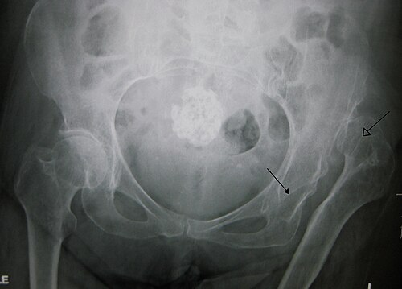
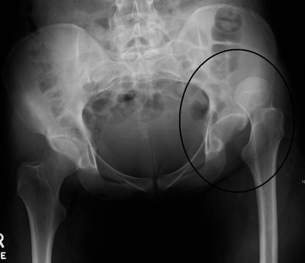

# DISPLASIA DO DESENVOLVIMENTO DO QUADRIL

A Displasia do Desenvolvimento do Quadril, ou simplesmente DDQ, é um daqueles temas que separa o médico que apenas decorou nomes do médico que realmente entende a mecânica da ortopedia pediátrica. Antigamente, chamávamos esta condição de Luxação Congênita do Quadril, mas esse termo caiu em desuso por um motivo muito lógico que você precisa entender para a sua prova: a doença não é necessariamente congênita (presente ao nascimento) e nem sempre é uma luxação.

A DDQ é, na verdade, um espectro. Imagine uma escala que vai desde uma leve instabilidade, passa pela subluxação (quando a cabeça do fêmur está "quase" saindo) e chega até a luxação completa (quando a cabeça do fêmur não tem contato nenhum com o acetábulo). O termo "Desenvolvimento" no nome indica que o quadril pode nascer normal e se tornar displásico, ou nascer instável e evoluir para a cura ou para a luxação.

## Fisiopatologia:

*Figura 1 - Radiografia demonstrando luxação congênita do quadril esquerdo. Seta fechada marca o acetábulo raso/displásico, seta aberta indica a cabeça femoral deslocada. Fonte: James Heilman MD, CC BY-SA 3.0 | Wikimedia Commons*
 O Porquê do Quadril "Sair do Lugar"

Para entender a DDQ, você deve visualizar o quadril como uma articulação de "bola e soquete". A bola é a cabeça do fêmur e o soquete é o acetábulo. No recém-nascido, grande parte dessas estruturas ainda é cartilagem, não osso. Para que o acetábulo se desenvolva de forma profunda e côncava, ele precisa que a cabeça do fêmur esteja bem centralizada dentro dele, exercendo uma pressão constante e simétrica.

Se a cabeça do fêmur fica fora do lugar ou mal posicionada, o acetábulo não recebe o estímulo para se aprofundar e acaba ficando raso (displásico). É um ciclo vicioso: o acetábulo raso não segura a cabeça do fêmur, e a falta da cabeça do fêmur impede o acetábulo de crescer.

Existem três pilares que explicam por que isso acontece:

*Figura 2 - Radiografia mostrando a relação entre cabeça femoral e acetábulo, fundamental para o diagnóstico por imagem da DDQ. Fonte: James Heilman MD, CC BY-SA 3.0 | Wikimedia Commons*

- **Fatores Mecânicos:** Tudo o que "aperta" o bebê dentro do útero no último trimestre. Se o espaço é pequeno, as pernas do bebê podem ser forçadas contra a parede uterina, alavancando a cabeça do fêmur para fora do acetábulo.

- **Laxidão Hormonal:** Durante o parto, o corpo da mãe produz relaxina e outros hormônios para amolecer as sinfises pélvicas. Esses hormônios atravessam a placenta e agem no bebê, deixando os ligamentos do quadril mais "frouxos".

- **Genética:** Existe uma predisposição familiar clara. Se um irmão teve, o risco aumenta; se um dos pais teve, o risco é ainda maior.

## Epidemiologia e Fatores de Risco: O Perfil da Questão de Prova

As bancas de residência amam os fatores de risco porque eles definem quem você deve investigar com mais rigor. Se você encontrar uma questão descrevendo um recém-nascido com os seguintes fatores, acenda o alerta para DDQ:

- **Sexo Feminino:** É cerca de 4 a 8 vezes mais comum em meninas. Por que? Porque as meninas são mais sensíveis aos hormônios maternos de relaxamento ligamentar.

- **Apresentação Pélvica:** Este é, talvez, o fator de risco isolado mais importante. O bebê que fica "sentado" no útero tem os quadris mantidos em uma posição que favorece o deslocamento. Segundo a Sociedade Brasileira de Pediatria (SBP), o parto pélvico é indicação formal de rastreio com imagem, mesmo que o exame físico seja normal.

- **Primeira Gestação (Primiparidade):** O útero da primigesta é mais "apertado" e menos complacente, aumentando a pressão mecânica sobre o feto.

- **História Familiar Positiva:** Ter um parente de primeiro grau com DDQ aumenta significativamente o risco.

- **Oligodrâmnio:** Menos líquido amniótico significa menos espaço para o bebê se movimentar, aumentando a compressão.

- **Associações Malformativas:** Frequentemente a DDQ vem acompanhada de torcicolo congênito ou deformidades nos pés (como o pé metatarso aduto). Isso ocorre porque a causa mecânica (falta de espaço) que gerou um, provavelmente gerou o outro.

**Dica de Prova do Dr. Will:** Se a questão mencionar um bebê do sexo feminino, nascido de parto pélvico e que apresenta um "nódulo no pescoço" (torcicolo congênito), a resposta quase certamente passará pela investigação de DDQ.

## O Exame Físico: A Arte de Barlow e Ortolani

Aqui é onde a maioria dos alunos se confunde. Vamos separar o exame físico em dois momentos: o recém-nascido (até 2 a 3 meses) e o lactente maior.

### No Recém-Nascido: Manobras de Instabilidade

Nesta fase, o quadril é muito elástico. O diagnóstico depende de sentir a cabeça do fêmur entrando ou saindo do acetábulo.

-

**Manobra de Ortolani (A Manobra da Redução):**

- **Como fazer:** Você abduz o quadril (abre as pernas do bebê) enquanto aplica uma pressão para cima com os dedos sobre o grande trocanter.

- **O que você busca:** Se o quadril estiver luxado, você sentirá um "clunk" (um ressalto palpável) quando a cabeça do fêmur "pula" para dentro do acetábulo.

- **Cuidado:** Um "clique" fino e agudo é comum e geralmente é apenas um estalido ligamentar sem valor patológico. O Ortolani verdadeiro é um ressalto, uma sensação de que algo encaixou.

-

**Manobra de Barlow (A Manobra da Luxação):**

- **Como fazer:** Você aduz o quadril (fecha as pernas) e aplica uma pressão suave para baixo e para trás.

- **O que você busca:** Você está tentando ver se o quadril é "luxável". Se a cabeça do fêmur sair do acetábulo com essa pressão, o teste é positivo.

**Resumo para não esquecer:**

- **B**arlow **B**ota para fora (testa se é luxável).

- **O**rtolani **O**põe a luxação (testa se é redutível).

### No Lactente Maior (após 3 meses)

Após alguns meses, a musculatura ao redor do quadril começa a sofrer contraturas e encurtamentos. O quadril que estava luxado agora está "preso" fora do lugar. As manobras de Barlow e Ortolani tornam-se negativas!

Nesta fase, os sinais clínicos mudam:

- **Limitação da Abdução:** Este é o sinal mais sensível no lactente maior. Você tenta abrir as pernas do bebê para trocar a fralda e um dos lados não abre completamente.

- **Sinal de Galeazzi:** Com o bebê deitado, você dobra os joelhos e apóia os pés na mesa. Você notará que um joelho está mais baixo que o outro, indicando um encurtamento aparente do fêmur (porque a cabeça do fêmur está deslocada para trás e para cima).

- **Assimetria de Pregas:** As pregas glúteas ou inguinais estão desiguais. Atenção: este sinal é muito inespecífico (muitos bebês normais têm pregas assimétricas), mas se cair na prova associado a outro sinal, ele corrobora a DDQ.

### Na Criança que já Anda

Se o diagnóstico não foi feito precocemente, a criança chegará ao consultório com:

- **Marcha de Trendelenburg:** A bacia "cai" para o lado oposto ao da luxação quando a criança tira o pé do chão, por fraqueza da musculatura glútea.

- **Marcha Anserina (de pato):** Se a luxação for bilateral, a criança anda balançando o tronco para os dois lados.

- **Hiperlordose Lombar:** Para compensar o deslocamento posterior dos quadris.

## Diagnóstico por Imagem: Quando pedir o quê?

Este é um ponto clássico de prova. A escolha do exame depende exclusivamente da idade do paciente, devido à ossificação da cabeça do fêmur.

### Ultrassonografia (Exame de escolha até os 4-6 meses)

Antes dos 4 meses, a cabeça do fêmur é puramente cartilagem. O Raio-X não enxerga cartilagem, então ele é inútil ou muito difícil de interpretar. O ultrassom permite ver a relação da cartilagem com o acetábulo em tempo real.

- **Método de Graf:** É a classificação ultrassonográfica mais utilizada. Ela mede o ângulo alfa (formação do teto ósseo) e o ângulo beta (teto cartilaginoso).

- **Valores de Referência:** Um ângulo alfa > 60 graus é considerado normal.

- **Quando pedir:** Segundo as diretrizes, o USG deve ser feito após a 4ª ou 6ª semana de vida para evitar falsos positivos devido à frouxidão ligamentar fisiológica do recém-nascido. A exceção é se o exame físico for francamente alterado (Ortolani positivo), onde o USG pode ser feito antes para planejar o tratamento.

### Radiografia Simples (Exame de escolha após os 4-6 meses)

A partir dos 4 a 6 meses, o núcleo de ossificação da cabeça femoral começa a aparecer, tornando o Raio-X o padrão-ouro. Para interpretar o Raio-X da bacia, traçamos algumas linhas clássicas:

- **Linha de Hilgenreiner:** Uma linha horizontal que passa pelas cartilagens trirradiadas (no fundo do acetábulo).

- **Linha de Perkins:** Uma linha vertical perpendicular à de Hilgenreiner, que passa pela borda lateral do acetábulo.

- **Quadrantes de Ombredanne:** Essas duas linhas dividem o quadril em 4 quadrantes. O normal é que o núcleo de ossificação da cabeça do fêmur esteja no **quadrante ínfero-medial**. Na DDQ, ele estará no quadrante súpero-lateral.

- **Arco de Shenton:** Uma linha curva imaginária que passa pela borda inferior do colo do fêmur e continua pela borda superior do forame obturador. Na luxação, esse arco está "quebrado" ou descontínuo.

- **Índice Acetabular:** Mede a inclinação do teto do acetábulo. Valores acima de 30 graus em lactentes sugerem displasia (acetábulo muito inclinado/raso).

| Idade | Exame de Escolha | Justificativa |
| --- | --- | --- |
| < 4 meses | Ultrassonografia | Cabeça femoral é cartilaginosa (invisível ao RX) |
| > 6 meses | Radiografia de Bacia | Núcleo de ossificação já é visível |
| 4-6 meses | Transição | Pode-se usar ambos, dependendo da ossificação |

## Diagnóstico Diferencial: Não confunda na hora da prova!

A DDQ é uma causa de alteração no quadril, mas não é a única. As bancas adoram colocar casos clínicos de dor no quadril para você diferenciar.

- **Sinovite Transitória do Quadril:** É a causa mais comum de dor no quadril em crianças (geralmente 3 a 10 anos). Ocorre após uma infecção viral (IVAS). A criança manca, mas não tem febre alta e os exames laboratoriais são normais. O tratamento é apenas repouso e AINEs.

- **Artrite Séptica:** Esta é uma EMERGÊNCIA. A criança tem febre alta, dor intensa à mínima movimentação do quadril, recusa-se a andar e tem leucocitose com VHS/PCR elevados. O diagnóstico exige punção articular e o tratamento é drenagem cirúrgica e antibiótico IV.

- **Doença de Legg-Calvé-Perthes:** Necrose avascular da cabeça do fêmur em crianças de 4 a 8 anos. É uma dor insidiosa, crônica, com claudicação.

- **Epifisiólise (SCFE):** Típica do adolescente obeso. A cabeça do fêmur "escorrega" em relação ao colo. A dor pode ser referida no joelho! Lembre-se: dor no joelho em adolescente pode ser problema no quadril.

## Tratamento: O Tempo é Ouro

O objetivo do tratamento é manter a cabeça do fêmur reduzida (dentro do acetábulo) para que o desenvolvimento ósseo ocorra normalmente. Quanto mais cedo começamos, melhor o prognóstico.

### 1. De 0 a 6 meses: Suspensório de Pavlik

É o padrão-ouro para o tratamento inicial. É uma órtese dinâmica que mantém o quadril em **flexão (acima de 90°) e abdução**.

- **Por que funciona?** Nesta posição, a cabeça do fêmur é pressionada contra o centro do acetábulo, estimulando o seu aprofundamento.

- **Vantagem:** Permite movimentos controlados, o que reduz o risco de necrose avascular da cabeça femoral (a complicação mais temida).

- **Monitoramento:** O bebê deve ser reavaliado semanalmente ou quinzenalmente. Se após 3 a 4 semanas de uso correto o quadril não reduzir, o Pavlik deve ser abandonado para evitar danos à parede posterior do acetábulo (a chamada "Pavlik disease").

### 2. De 6 meses a 18 meses: Redução e Gesso

Se o diagnóstico for tardio ou o Pavlik falhar, precisamos de algo mais drástico.

- **Redução Incruenta (Fechada):** Sob anestesia, o médico coloca o quadril no lugar sem abrir a pele.

- **Gesso Pelvipodálico (Spica Cast):** Após a redução, o bebê é engessado da cintura até o pé para manter a posição por vários meses.

- **Redução Cruenta (Aberta):** Se houver tecidos moles (músculos, cápsula) impedindo a entrada da cabeça do fêmur, é necessária cirurgia para limpar o acetábulo e colocar o fêmur no lugar.

### 3. Acima de 18 meses: Osteotomias

Nesta idade, o acetábulo já está muito deformado. Além de reduzir o quadril, o cirurgião precisa cortar o osso da bacia (osteotomia de Salter, por exemplo) ou o próprio fêmur para remodelar a articulação e dar estabilidade.

**Cuidado com a complicação:** A complicação mais grave de qualquer tratamento da DDQ é a **Necrose Avascular da Cabeça do Fêmur**. Isso acontece se forçada uma abdução excessiva que comprima os vasos sanguíneos que nutrem a cabeça femoral. Por isso, o Pavlik é tão bem visto: ele é "fisiológico".

## Resumo de Condutas por Faixa Etária

| Idade ao Diagnóstico | Conduta Inicial |
| --- | --- |
| 0 - 6 meses | Suspensório de Pavlik |
| 6 - 18 meses | Redução (fechada ou aberta) + Gesso Pelvipodálico |
| > 18 meses | Redução aberta + Osteotomias (Bacia/Fêmur) |

## O Papel do Pediatra e o Rastreio

No Brasil, a recomendação da SBP e do Ministério da Saúde é o **rastreio clínico universal**. Todo recém-nascido deve ser submetido às manobras de Ortolani e Barlow na maternidade e em todas as consultas de puerpério até a criança andar com firmeza.

**Quando pedir USG de rotina (mesmo com exame físico normal)?**
Embora não seja um consenso absoluto em todos os países, a maioria das bancas brasileiras segue a orientação de que bebês com **fatores de risco maiores** (apresentação pélvica ou história familiar de primeiro grau) devem realizar USG de quadril entre 4 e 6 semanas de vida, mesmo que o médico não tenha sentido nada no exame físico.

Lembre-se da pérola clínica: "O exame físico normal não exclui DDQ em pacientes de alto risco". No MedEvo, sempre reforçamos que a prevenção da luxação tardia é o que evita que essa criança precise de uma prótese de quadril aos 30 anos de idade.

## Complicações da DDQ não tratada

Se você deixar passar um diagnóstico de DDQ, as consequências para o paciente são devastadoras:

- **Osteoartrose Precoce:** O desgaste da articulação ocorre muito cedo devido à má distribuição de carga.

- **Diferença de Comprimento dos Membros:** A perna luxada fica "curta", levando a problemas de coluna (escoliose compensatória).

- **Dor Crônica e Limitação Funcional:** A criança terá dificuldade para atividades físicas e, futuramente, para o trabalho.

- **Necrose Avascular:** Como mencionado, pode ocorrer tanto pela doença quanto pelo tratamento intempestivo.

## Pontos-Chave para Prova

- **Definição:** DDQ é um espectro de instabilidade, não apenas luxação. O termo "congênita" é impreciso; prefira "do desenvolvimento".

- **Fatores de Risco Clássicos:** Sexo feminino (80% dos casos), apresentação pélvica (fator de risco mais forte), história familiar e primiparidade.

- **Manobra de Ortolani:** É para **reduzir** o quadril luxado. Sente-se o "clunk" de entrada. É o sinal mais importante no RN.

- **Manobra de Barlow:** É para **luxar** o quadril instável. Testa se a cabeça do fêmur sai do acetábulo.

- **Sinal de Galeazzi:** Encurtamento aparente do fêmur com joelhos dobrados. Típico de lactentes maiores (> 3 meses).

- **Limitação da Abdução:** O sinal clínico mais confiável após os 3 meses de vida, quando Ortolani/Barlow perdem a sensibilidade.

- **Exame de Imagem < 4 meses:** Ultrassonografia (Método de Graf). O ângulo alfa deve ser > 60°.

- **Exame de Imagem > 6 meses:** Radiografia de Bacia. O núcleo de ossificação deve estar no quadrante ínfero-medial de Ombredanne.

- **Tratamento de Escolha (0-6 meses):** Suspensório de Pavlik. Mantém flexão e abdução.

- **Falha do Pavlik:** Se não reduzir em 3-4 semanas, deve-se partir para redução sob anestesia e gesso.

- **Complicação mais temida:** Necrose avascular da cabeça femoral.

- **Diagnóstico Diferencial:** Sinovite transitória (pós-viral, benigna) vs. Artrite Séptica (febre, urgência cirúrgica).

- **Pegadinha de Prova:** A banca vai dizer que o bebê tem "cliques" no quadril e perguntar a conduta. Se for apenas um clique fino, sem ressalto, e sem fatores de risco, a conduta é apenas observação e reavaliação em 2 semanas.

- **Indicação de USG mesmo com exame normal:** Apresentação pélvica ao nascimento ou história familiar de 1º grau.

- **O que NÃO fazer:** Nunca force uma abdução extrema no gesso ou no suspensório, pois isso causa isquemia da cabeça do fêmur.

- **Marcha de Trendelenburg:** Indica fraqueza do glúteo médio no lado luxado; a bacia cai para o lado saudável quando o paciente apoia o peso no lado doente.

Este material cobre o que há de mais essencial e o que é rotineiramente cobrado nas provas de residência médica e Revalida sobre DDQ. Entender a transição do exame físico (de manobras de instabilidade para sinais de contratura) e a transição da imagem (de USG para RX) é o segredo para não errar nenhuma questão sobre o tema. 🛡️

 Cópia offline para consulta pessoal.
 Fonte original:
 [https://www.medevo.com.br/material-apoio/ler/bdc7266e-bcef-4e42-8b07-b6dc9cffebfb](https://www.medevo.com.br/material-apoio/ler/bdc7266e-bcef-4e42-8b07-b6dc9cffebfb)
