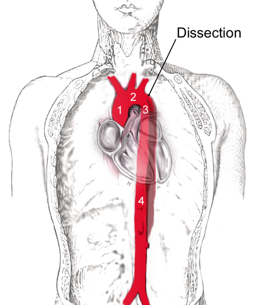
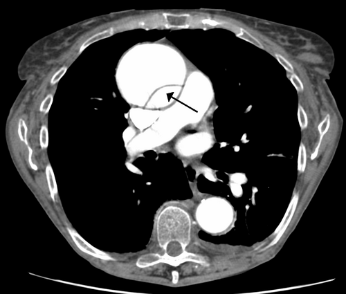

# DISSECÇÃO AÓRTICA

A dissecção aórtica não é apenas uma "rasgadura" na parede do vaso; é uma catástrofe hemodinâmica onde o sangue, sob alta pressão, decide trilhar um caminho que não lhe pertence. Como professor, vejo muitos alunos decorarem classificações, mas falharem no momento crítico: o manejo inicial. Se você entender o "porquê" de cada droga e de cada tempo cirúrgico, nunca mais errará uma questão de residência sobre o tema.

## Fisiopatologia:

*Figura 1 - Diagrama esquemático da dissecção aórtica tipo Stanford B, mostrando a separação entre luz verdadeira e luz falsa na aorta descendente, distal à subclávia esquerda. Fonte: Fvasconcellos/JHeuser, CC BY-SA 3.0 | Wikimedia Commons*
 O Conceito do "Shear Stress"

Para entender a dissecção, imagine a aorta como uma mangueira de alta pressão com três camadas: íntima, média e adventícia. O evento inicial é uma laceração na íntima (o "flap"). O sangue entra por esse orifício e separa a camada média, criando dois caminhos: a **luz verdadeira** (por onde o sangue deveria passar) e a **luz falsa** (o novo espaço criado).

Por que isso progride? Por causa do *shear stress* (estresse de cisalhamento). A cada batimento cardíaco, a força com que o sangue é ejetado (dP/dt) empurra o flap e expande a luz falsa. É por isso que o controle da frequência cardíaca é mais importante que o da pressão arterial isolada. Se você baixar a pressão, mas o coração continuar batendo rápido e forte, a dissecção continuará "rasgando".

**Dica de Prova:** A hipertensão arterial sistêmica (HAS) é o principal fator de risco (presente em 70-80% dos casos). Em pacientes jovens (< 40 anos), suspeite sempre de doenças do tecido conjuntivo, como a Síndrome de Marfan.

## Classificações:

*Figura 2 - Tomografia computadorizada com contraste demonstrando dissecção da aorta ascendente (tipo A), com visualização clara do flap intimal separando luz verdadeira e falsa. Fonte: James Heilman MD, CC BY-SA 3.0 | Wikimedia Commons*
 Onde o Sangue Está Indo?

As bancas amam cobrar as duas classificações clássicas. Elas não servem apenas para dar nome ao problema, mas para definir quem vai para o centro cirúrgico agora e quem vai para a UTI.

### Stanford (A mais cobrada)

Foca no envolvimento da aorta ascendente.

- **Tipo A:** Envolve a aorta ascendente (independente de onde começou). É a emergência cirúrgica "vaga zero".

- **Tipo B:** Envolve apenas a aorta descendente (distal à artéria subclávia esquerda). O manejo inicial costuma ser clínico.

### DeBakey (A mais detalhada)

Foca na origem e extensão.

- **Tipo I:** Começa na ascendente e se estende para a descendente.

- **Tipo II:** Limitada à aorta ascendente.

- **Tipo III:** Limitada à aorta descendente (IIIa: apenas torácica; IIIb: tóraco-abdominal).

| Stanford | DeBakey | Localização | Conduta Inicial |
| --- | --- | --- | --- |
| **Tipo A** | I e II | Aorta Ascendente | Cirurgia de Emergência |
| **Tipo B** | III | Aorta Descendente | Manejo Clínico (UTI) |

**Cuidado:** Muitos alunos confundem DeBakey II com Stanford B. Lembre-se: se tocou na ascendente, é Stanford A. Ponto final. Segundo a Diretriz Brasileira de Hipertensão (2020), a dissecção tipo A é uma emergência hipertensiva que exige intervenção imediata.

## Quadro Clínico: A Dor "Rasgada"

O paciente clássico é o hipertenso grave que chega com uma dor torácica súbita, de intensidade máxima desde o início. Diferente do IAM, onde a dor pode ser progressiva ou em aperto, na dissecção ela é descrita como **"em facada" ou "rasgando"**.

### Sinais de Alerta no Exame Físico

- **Assimetria de Pulsos e Pressão:** Uma diferença de PAS > 20 mmHg entre os braços sugere que o flap de dissecção está obstruindo o óstio da artéria subclávia.

- **Sopro de Insuficiência Aórtica:** Se a dissecção "voltar" para a base da aorta (retrógrada), ela desestrutura a valva aórtica. Um sopro diastólico novo em um paciente com dor torácica é dissecção tipo A até prova em contrário.

- **Déficits Neurológicos:** Se o flap subir para as carótidas, o paciente pode apresentar um AVC agudo associado à dor torácica.

- **Tamponamento Cardíaco:** A principal causa de óbito na dissecção tipo A. Se o paciente apresentar Tríade de Beck (hipotensão, bulhas abafadas e turgência jugular), o prognóstico é sombrio.

**Exemplo Clínico:** Paciente de 65 anos, hipertenso, dor súbita irradiada para o dorso. Ao exame: PA 210/110 mmHg no braço direito e 170/90 mmHg no esquerdo. Diagnóstico? Dissecção Aórtica. Próximo passo? Controle de FC e PA antes mesmo da Tomografia.

## Diagnóstico: O Padrão-Ouro

Não perca tempo com exames de baixa sensibilidade se o paciente estiver estável.

- **Radiografia de Tórax:** Pode mostrar alargamento de mediastino (> 8 cm), mas um RX normal NÃO exclui dissecção.

- **Angiotomografia (Angio-TC) de Tórax e Abdome:** É o padrão-ouro para o diagnóstico e planejamento cirúrgico. Mostra a luz verdadeira, a luz falsa e o flap de íntima.

- **Ecocardiograma Transesofágico (ETE):** Excelente para pacientes instáveis que não podem ser transportados para a TC. Tem alta sensibilidade para aorta ascendente.

- **Ressonância Magnética:** Ótima acurácia, mas raramente usada na fase aguda pelo tempo de execução e dificuldade de monitorização.

**Pegadinha de Prova:** A alternativa dirá que o Ecocardiograma Transtorácico (ETT) é suficiente. Errado! O ETT tem baixa sensibilidade para a aorta descendente. O ETE é o correto para beira de leito.

## Manejo Inicial: A Terapia Anti-Impulso

Aqui é onde o Dr. Will e a equipe do MedEvo batem na tecla: **Frequência Cardíaca primeiro, Pressão Arterial depois.**

Por que? Se você usar um vasodilatador potente (como o Nitroprussiato) isoladamente, causará uma taquicardia reflexa. Esse aumento da FC aumenta o dP/dt (a força de ejeção), o que pode literalmente terminar de rasgar a aorta do paciente.

### Metas Hemodinâmicas (SBC/Diretriz de Hipertensão 2020)

- **Frequência Cardíaca:** < 60 bpm.

- **Pressão Arterial Sistólica:** 100 a 120 mmHg (alcançar em 20 minutos).

### Drogas de Escolha

- **Betabloqueadores IV:** São a primeira linha.

- **Esmolol:** Ótimo por ter meia-vida curta (fácil de titular). Dose: Bolus 0,5 mg/kg em 1 min, seguido de infusão 50-200 mcg/kg/min.

- **Metoprolol:** 5 mg IV a cada 5 min, até o máximo de 15 mg.

- **Vasodilatadores (se PAS continuar > 120 mmHg após BB):**

- **Nitroprussiato de Sódio:** 0,25 a 10 mcg/kg/min. Cuidado com a toxicidade por cianeto em infusões prolongadas.

- **Analgesia:** Morfina ou Fentanil. A dor gera descarga adrenérgica, que aumenta a PA e a FC. Controlar a dor é parte do tratamento pressórico.

| Medicamento | Classe | Função na Dissecção |
| --- | --- | --- |
| **Esmolol / Metoprolol** | Betabloqueador | Reduz FC e dP/dt (Prioridade 1) |
| **Nitroprussiato** | Vasodilatador | Reduz RVP e PAS (Prioridade 2) |
| **Morfina** | Opioide | Analgesia e redução do drive simpático |

## Tratamento Definitivo: Cirurgia vs. Clínico

A conduta depende da classificação de Stanford e da presença de complicações.

### Stanford Tipo A (Ascendente)

**Sempre cirúrgico de emergência.** A mortalidade aumenta 1-2% a cada hora de atraso. O cirurgião costuma realizar a troca da aorta ascendente por uma prótese de Dacron (Cirurgia de Bentall-De Bono se houver envolvimento valvar).

### Stanford Tipo B (Descendente)

O tratamento inicial é **CLÍNICO** (controle rigoroso de PA e FC na UTI).
No entanto, existem as chamadas **Dissecções Tipo B Complicadas**, que exigem intervenção (geralmente endovascular - TEVAR):

- Dor persistente ou refratária ao tratamento medicamentoso.

- Sinais de má perfusão (isquemia renal, mesentérica ou de membros).

- Expansão rápida do diâmetro aórtico ou sinais de ruptura iminente (hemotórax).

- Hipertensão incontrolável.

**Erro Comum:** Achar que toda dissecção tipo B opera. Não! A maioria é manejo clínico. A cirurgia aberta para tipo B tem alta mortalidade e risco de paraplegia (isquemia da artéria de Adamkiewicz). Por isso, prefere-se o tratamento endovascular (stent) quando há complicação.

## Diagnóstico Diferencial: Não Confunda!

A dissecção é a grande simuladora da emergência.

- **IAM:** O ECG pode estar normal na dissecção, mas cuidado: se a dissecção atingir o óstio da coronária direita, ela causará um IAM de parede inferior. Se você der trombolítico ou anticoagulante para esse "IAM", você mata o paciente. **Sempre cheque pulsos antes de trombolisar um IAM.**

- **TEP:** Causa dor súbita e dispneia. A Angio-TC diferencia ambos. No TEP com instabilidade, a conduta é trombólise (Alteplase). Na dissecção com instabilidade, é cirurgia.

- **Hemorragia Subaracnoidea (HSA):** Cefaleia em trovoada. Se a dissecção carotídea for a causa, o quadro pode se confundir.

## Complicações e Prognóstico

A dissecção crônica pode evoluir para a formação de aneurismas na luz falsa. O seguimento com exames de imagem (TC ou RM) é obrigatório: aos 3, 6 e 12 meses, e depois anualmente.

A restrição de atividades físicas intensas (que aumentam a pressão intratorácica e o estresse na aorta) é fundamental. O controle da HAS deve ser eterno, preferencialmente com betabloqueadores como base do esquema.

## Pontos-Chave para Prova 💡

- **Principal Fator de Risco:** Hipertensão Arterial Sistêmica (HAS).

- **Dor Típica:** Súbita, intensidade máxima no início, caráter "rasgante", irradia para o dorso.

- **Stanford A:** Aorta ascendente envolvida. Conduta: Cirurgia de Emergência.

- **Stanford B:** Aorta descendente apenas. Conduta: Clínico (UTI).

- **Meta de FC:** < 60 bpm (usar Betabloqueador IV primeiro).

- **Meta de PAS:** 100-120 mmHg (alcançar em 20 minutos).

- **Nitroprussiato Isolado:** Contraindicado (causa taquicardia reflexa e aumenta o dP/dt).

- **Padrão-Ouro Diagnóstico:** Angiotomografia de Tórax e Abdome.

- **Exame para Instáveis:** Ecocardiograma Transesofágico (ETE).

- **Principal Causa de Morte no Tipo A:** Tamponamento Cardíaco.

- **Sinal de Má Perfusão no Tipo B:** Indica tratamento endovascular (TEVAR).

- **Assimetria de Pulsos:** Diferença de PAS > 20 mmHg entre membros superiores.

- **Contraindicação Absoluta:** Anticoagulação ou Trombolíticos na suspeita de dissecção.

- **Sopro Diastólico Novo:** Sugere insuficiência aórtica aguda por dissecção retrógrada (Tipo A).

- **O que NÃO fazer:** Esquecer de checar pulsos em todo paciente com dor torácica aguda.

- **Luz Verdadeira vs. Falsa:** A luz verdadeira costuma ser menor e ter fluxo mais rápido; a falsa é maior e pode ter trombos.

- **Vaga Zero:** Dissecção de Aorta Tipo A é prioridade absoluta de transferência.

 Cópia offline para consulta pessoal.
 Fonte original:
 [https://www.medevo.com.br/material-apoio/ler/a0dade88-1741-4021-b2e4-a99e76d90df4](https://www.medevo.com.br/material-apoio/ler/a0dade88-1741-4021-b2e4-a99e76d90df4)
