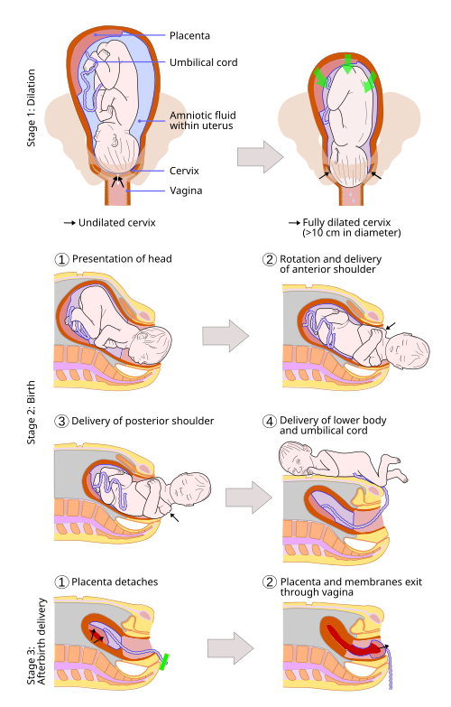
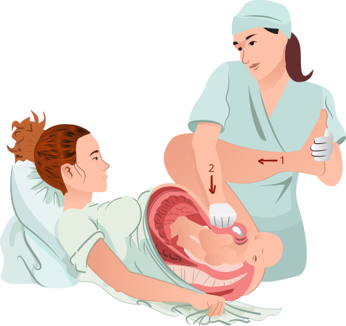

# DISTOCIAS

Distocias devem ser entendidas a partir da interação entre três variáveis clássicas: **Poder** (motor/contrações), **Passageiro** (feto) e **Passagem** (bacia e partes moles). Quando um desses elementos falha, o parto se torna difícil, trabalhoso ou impossível por vias naturais.

O raciocínio principal é identificar qual componente interrompeu a progressão. Entender o mecanismo evita decorar manobras de forma solta e facilita a conduta.

## Distocias Funcionais

*Figura 1 - Diagrama dos estágios do parto normal: dilatação, expulsão e dequitação. A compreensão da mecânica normal é essencial para identificar quando ocorre distocia. Fonte: Jmarchn, CC BY-SA 3.0 | Wikimedia Commons*
 (O Motor)

O motor do parto é o útero. Para o feto descer, o útero precisa de contrações coordenadas, com o chamado **tríplice gradiente descendente**: a contração começa no fundo, é mais forte no fundo e dura mais tempo no fundo. Se isso se perde, o motor "engasga".

### Hipoatividade e Hiperatividade

*Figura 2 - Manobra de McRoberts para distocia de ombro: hiperflexão das coxas maternas sobre o abdome, que retifica a lordose lombar e aumenta o diâmetro AP do estreito inferior. Fonte: geraldbaeck, CC0 | Wikimedia Commons*

A **hipoatividade uterina** ocorre quando as contrações são fracas (intensidade < 25 mmHg), curtas ou raras. O resultado? O colo não dilata e o feto não desce. Por que isso acontece? Muitas vezes por sobredistensão uterina (polidrâmnio, gemelaridade) ou simplesmente exaustão materna.

A conduta aqui não é sair correndo para a cesárea. Se o motor está fraco, nós damos "combustível": ocitocina e, se as membranas estiverem íntegras, a amniotomia. A amniotomia ajuda porque a saída do líquido reduz o volume uterino, melhorando a eficiência da fibra muscular.

Já a **hiperatividade** é o excesso. Mais de 5 contrações em 10 minutos (taquissistolia) ou contrações muito longas. Cuidado: a hiperatividade pode ser um sinal de alerta para obstrução. Se o feto não consegue passar (DCP), o útero tenta "forçar a porta" aumentando a dinâmica. Administrar ocitocina em paciente com hipertonia por obstrução pode precipitar rotura uterina.

### Incoordenação Uterina

Aqui o útero contrai, mas de forma bagunçada.

- **Incoordenação de 1º grau:** Dois marcapassos uterinos batendo em ritmos diferentes.

- **Incoordenação de 2º grau (Fibrilação uterina):** Vários marcapassos. A pressão basal do útero sobe (hipertonia), mas não há efetividade para dilatar o colo.

A incoordenação pode ser confundida com falso trabalho de parto. No falso trabalho de parto (Braxton-Hicks), as contrações são irregulares e **não modificam o colo**. Na incoordenação, há dor e contrações desorganizadas, mas o parto não progride. O manejo pode envolver repouso e analgesia, conforme avaliação clínica.

## O Partograma e as Distocias de Progressão

O partograma orienta a avaliação das distocias de progressão e ajuda a diferenciar evolução lenta de parada verdadeira. Ele começa a ser preenchido na **fase ativa** (pelo menos 4 cm de dilatação e contrações regulares).

### 1. Fase Ativa Prolongada

A dilatação ocorre, mas de forma muito lenta (menos de 1 cm por hora).

- **Causa principal:** Distocia funcional (motor ruim).

- **Conduta:** Ocitocina, amniotomia, deambulação. Não é indicação imediata de cesárea.

### 2. Parada Secundária da Dilatação

A dilatação estagnou. O colo parou no mesmo centímetro por **2 horas ou mais** (em dois toques sucessivos).

- **Causa principal:** Desproporção Céfalo-Pélvica (DCP). Se o motor está bom e a dilatação parou, o problema é o "tamanho do passageiro" ou o "formato da passagem".

- **Conduta:** Avaliar a vitalidade fetal e a bacia. Se confirmada a DCP, a conduta é cesariana.

### 3. Parada Secundária da Descida

A dilatação chegou a 10 cm (total), mas o feto parou de descer por 1 hora (multípara) ou 2 horas (nulípara).

- **Causa:** Pode ser posição fetal anômala (ex: occipitotransversa persistente) ou bacia estreita.

### 4. Parto Precipitado (Taquitócico)

O parto ocorre em menos de 3 horas desde o início da fase ativa.

- **Risco:** O aluno acha que "parto rápido é bom". Errado! O parto precipitado aumenta o risco de lacerações de trajeto, atonia uterina pós-parto e sofrimento fetal agudo (o útero não relaxa, não oxigena o feto).

| Padrão no Partograma | Definição | Conduta Sugerida |
| --- | --- | --- |
| Fase Ativa Prolongada | Dilatação < 1 cm/h | Ocitocina / Amniotomia |
| Parada Secundária Dilatação | Dilatação estagnada ≥ 2h | Avaliar DCP (Cesárea se confirmada) |
| Parada Secundária Descida | Descida estagnada ≥ 1h (multi) ou 2h (nuli) | Fórceps ou Cesárea (depende do plano) |
| Parto Precipitado | Parto em < 3 horas | Observar lacerações e atonia |

## Distocias do Passageiro (O Feto)

Aqui o problema é o feto: ou ele é grande demais, ou está "mal posicionado".

### Macrossomia Fetal

Feto com peso estimado > 4.000g (ou > 4.500g em algumas diretrizes). O principal fator de risco é o Diabetes Gestacional.
**Dica de prova:** Se a Altura Uterina (AU) for muito maior que a Idade Gestacional (IG + 3 cm), suspeite de macrossomia ou polidrâmnio. Peça um USG. Se o feto for macrossômico, o risco de distocia de ombro e rotura uterina aumenta drasticamente.

### Variedades de Posição e Assinclitismo

O feto idealmente entra na bacia em posição flexionada. Se ele começa a "inclinar a cabeça" para os lados, temos o **assinclitismo**.

- **Assinclitismo Anterior (Naegele):** A sutura sagital está mais próxima do sacro. O osso parietal anterior desce primeiro.

- **Assinclitismo Posterior (Litzmann):** A sutura sagital está mais próxima da sínfise púbica. O osso parietal posterior desce primeiro.

**Pegadinha de prova:** O assinclitismo leve é normal na mecânica do parto, mas o acentuado impede a descida. Se a questão fala em "sutura sagital próxima ao pube", o diagnóstico é assinclitismo posterior.

### Apresentações Defletidas (Face e Fronte)

- **Deflexão de 1º grau (Bregma):** O feto apresenta o bregma. O parto vaginal é possível.

- **Deflexão de 2º grau (Fronte):** É a pior de todas. O maior diâmetro tenta passar. **Indicação de Cesárea.**

- **Deflexão de 3º grau (Face):** O feto apresenta o rosto.

- Se o mento (queixo) estiver voltado para o pube (**Mento-Anterior**): Parto vaginal é possível.

- Se o mento estiver voltado para o sacro (**Mento-Posterior**): O feto não consegue fazer a curvatura do canal. **Indicação de Cesárea.**

## Distocia de Ombros (Espáduas)

Esta é a maior emergência da obstetrícia. Ocorre quando a cabeça sai, mas o ombro anterior fica impactado na sínfise púbica materna. O achado clássico é o **sinal da tartaruga**: a cabeça exterioriza e retrai contra o períneo.

**O que NÃO fazer:** Jamais faça a Manobra de Kristeller (pressão no fundo do útero). Isso só encrava mais o ombro e pode romper o útero ou causar lesão de plexo braquial no feto.

### Sequência de Manejo (Mnemônico HELPERR ou ALERTA)

Segundo a FEBRASGO, a primeira linha é sempre:

- **Manobra de McRoberts:** Hiperflexão e abdução das coxas da paciente contra o abdome. Isso retifica o sacro e muda o ângulo da sínfise púbica. Resolve mais de 80% dos casos.

- **Pressão Suprapúbica:** Um auxiliar faz pressão acima do pube para tentar "deslocar" o ombro anterior.

Se não resolveu, partimos para manobras internas:

- **Manobra de Woods (parafuso):** rotação do ombro posterior para transformar o diâmetro biacromial e liberar o ombro impactado.

- **Woods reverso:** rotação no sentido oposto ao Woods clássico, útil quando a rotação inicial não libera os ombros.

- **Manobra de Rubin II:** pressão na face posterior do ombro anterior para aduzir o ombro e reduzir o diâmetro biacromial.

- **Retirada do braço posterior:** introduz-se a mão para localizar e exteriorizar o braço posterior, reduzindo o diâmetro fetal.

- **Posição de quatro apoios (manobra de Gaskin):** mudança materna para quatro apoios; pode aumentar os diâmetros pélvicos funcionais e facilitar a liberação, especialmente quando há equipe treinada e condição materna permite.

Em casos desesperadores: **Manobra de Zavanelli** (empurrar a cabeça de volta para dentro e fazer cesárea).

| Manobra | Descrição | Nível de Intervenção |
| --- | --- | --- |
| McRoberts | Hiperflexão das coxas maternas | 1ª Linha (Externa) |
| Pressão Suprapúbica | Pressão lateral sobre o ombro anterior | 1ª Linha (Externa) |
| Woods / Rubin / braço posterior | Rotação interna, adução ou redução do diâmetro biacromial | 2ª Linha (Interna) |
| Quatro apoios (Gaskin) | Mudança postural materna para facilitar liberação | Alternativa útil se viável |
| Zavanelli | Reposição cefálica para cesárea | Último recurso (Altíssima mortalidade) |

## Distocias da Passagem (O Canal)

A desproporção céfalo-pélvica (DCP) pode ser causada por uma bacia estreita (distocia óssea) ou por tumores/malformações (distocia de partes moles).

### Avaliação da Bacia (Pelvimetria)

O diâmetro mais importante da bacia é a **Conjugata Vera Obstétrica**. Nós não conseguimos medi-la diretamente no exame físico. Medimos a **Conjugata Diagonalis** (ao toque vaginal, a distância entre a borda inferior da sínfise púbica e o promontório sacral).

- **Cálculo:** Conjugata Vera Obstétrica = Conjugata Diagonalis - 1,5 cm.

- Se a Vera Obstétrica for < 10 cm, o risco de DCP é altíssimo.

### Distocia de Partes Moles

Pode ser um septo vaginal, um mioma pré-vial (localizado no segmento inferior, impedindo a descida) ou até um edema de colo por excesso de força antes da dilatação total.

## Complicações Graves: Rotura Uterina

A rotura uterina é o desfecho catastrófico de uma distocia não resolvida. O útero tenta vencer a obstrução até que a fibra rompe.

### Iminência de Rotura (Síndrome de Bandl-Frommel)

A banca vai descrever uma paciente em trabalho de parto obstruído com dois sinais clássicos:

- **Anel de Bandl:** Um sulco visível que separa o corpo do útero do segmento inferior (parece uma ampulheta).

- **Sinal de Frommel:** Os ligamentos redondos ficam tensos e esticados, palpáveis como "cordas de violão".

### Rotura Consumada

A dor é súbita e lancinante, seguida de uma "calmaria" (as contrações param porque o músculo rasgou).

- **Sinal de Reasens:** Subida da apresentação fetal (o feto que estava em plano +1 volta para o espaço).

- **Sinal de Clark:** Crepitação à palpação (enfisema subcutâneo).

- **Quadro clínico:** Choque hipovolêmico, sangramento vaginal (nem sempre proporcional à gravidade interna) e sofrimento fetal agudo/óbito.

**Conduta:** Laparotomia imediata.

## Situações Especiais e Fórceps

O fórceps não é uma distocia, mas é a ferramenta para resolvê-la.

- **Fórceps de Simpson:** Usado para tração. Ótimo para apresentações em variedades occipito-púbicas (OP).

- **Fórceps de Kielland:** O "rei das rotações". Usado quando o feto está em variedades transversas (ODT, OET) ou assinclitismo.

**Cuidado:** Para usar fórceps, o feto deve estar em plano de De Lee **+2 ou mais baixo**. Fórceps "alto" (acima de 0) é proibido na obstetrícia moderna. Se o feto está alto e não desce, a resposta é cesárea.

Como o Dr. Will sempre reforça em suas discussões clínicas, o diagnóstico de distocia funcional deve ser feito com cautela para evitar intervenções desnecessárias, mas a distocia mecânica (obstrução) exige decisão rápida para evitar a asfixia fetal.

## Pontos-Chave para Prova

- **Parada Secundária da Dilatação:** Diagnóstico após 2 horas de dilatação estagnada na fase ativa. Pensar em DCP.

- **Distocia de Ombro:** Primeira conduta é McRoberts + Pressão Suprapúbica. **NUNCA** fazer Kristeller.

- **Sinal da Tartaruga:** Patognomônico de distocia de ombros.

- **Apresentação de Fronte (Deflexão de 2º grau):** É a única que inviabiliza o parto vaginal em qualquer circunstância.

- **Mento-Posterior:** Indicação de cesariana. Mento-Anterior pode tentar parto vaginal.

- **Sinais de Iminência de Rotura:** Bandl (anel) e Frommel (ligamentos redondos).

- **Sinal de Reasens:** Subida da apresentação fetal após dor aguda, indicando rotura uterina consumada.

- **Parto Precipitado:** Risco de atonia uterina e lacerações cervicais/perineais.

- **Assinclitismo Posterior (Litzmann):** Sutura sagital próxima à sínfise púbica.

- **Hipoatividade Uterina:** Tratar com ocitocina e amniotomia.

- **Fórceps de Kielland:** Escolha para rotação de variedades transversas.

- **Diabetes Gestacional:** Principal fator de risco para macrossomia e distocia de ombro.

- **Conjugata Vera Obstétrica:** Valor mínimo para um parto seguro é em torno de 10 cm.

- **Taquissistolia:** Mais de 5 contrações em 10 minutos. Pode levar ao sofrimento fetal por redução do fluxo placentário.

- **Contraindicação Absoluta ao Parto Vaginal:** Desproporção Céfalo-Pélvica absoluta, Placenta Prévia Total, Apresentação de Fronte, Mento-Posterior persistente. 🛡️

 Cópia offline para consulta pessoal.
 Fonte original:
 [https://www.medevo.com.br/material-apoio/ler/6825a4bf-b0ff-4992-870e-720053b757be](https://www.medevo.com.br/material-apoio/ler/6825a4bf-b0ff-4992-870e-720053b757be)
