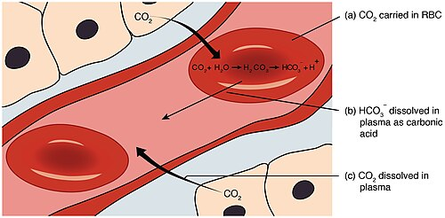
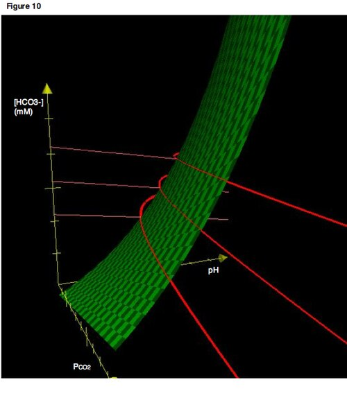
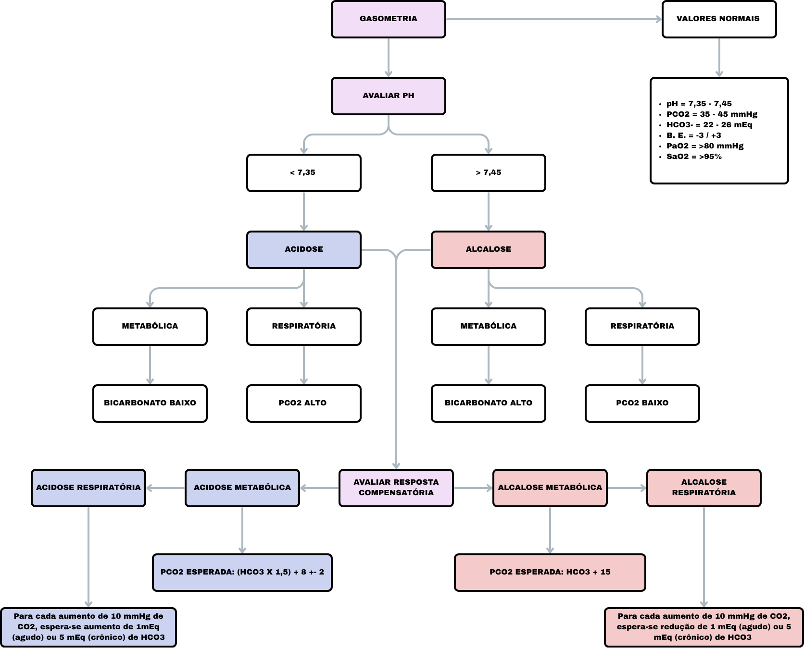

# DISTÚRBIOS ÁCIDO-BASE

Para entender distúrbios ácido-base, você precisa parar de tentar decorar fórmulas isoladas e começar a enxergar a balança do organismo. O corpo humano é uma máquina de produzir ácido. Nosso metabolismo gera, todos os dias, uma quantidade enorme de ácidos voláteis (CO2) e não voláteis (como o ácido lático e o ácido sulfúrico). O que mantém você vivo e com o pH entre 7,35 e 7,45 é a capacidade de excretar ou tamponar essa carga.

Se o pH foge dessa faixa, as proteínas mudam de forma, as enzimas param de funcionar e os canais iônicos falham. É por isso que, em provas de residência, esse tema é onipresente: ele é a base da fisiopatologia crítica.

## A Lógica da Gasometria

*Figura 1 - Diagrama do transporte de dióxido de carbono no sangue, ilustrando a conversão CO2 ↔ HCO3- catalisada pela anidrase carbônica, base do sistema tampão bicarbonato. Fonte: OpenStax College, CC BY 3.0 | Wikimedia Commons*
: O Primeiro Passo

Antes de olhar qualquer número, lembre-se: o pH é o mestre. Ele diz a direção do distúrbio primário. Se o pH está baixo (< 7,35), temos uma acidose. Se está alto (> 7,45), uma alcalose.

O segundo passo é olhar para o Bicarbonato (HCO3-) e para a pressão parcial de CO2 (pCO2). Aqui está o segredo que muitos alunos erram: o distúrbio é **metabólico** quando o HCO3- varia na mesma direção do pH. Se o pH cai e o HCO3- cai, o problema é metabólico. Se o pH sobe e o HCO3- sobe, também. Já nos distúrbios **respiratórios**, o pCO2 varia na direção oposta ao pH. pH baixo com pCO2 alto? Acidose respiratória.

Muitas vezes, na correria do plantão ou da prova, o aluno vê um bicarbonato baixo e já grita "acidose metabólica!". Cuidado. Se o pH estiver alto, esse bicarbonato baixo pode ser apenas a compensação de uma alcalose respiratória crônica. Sempre olhe o pH primeiro.

### Valores de Referência (Memorize agora)

- **pH:** 7,35 a 7,45

- **pCO2:** 35 a 45 mmHg

- **HCO3-:** 22 a 26 mEq/L

- **Ânion Gap (AG):** 8 a 12 mEq/L

## Acidose Metabólica

*Figura 2 - Diagrama de Davenport mostrando as relações tridimensionais entre pH, pCO2 e HCO3-, ferramenta para visualizar distúrbios ácido-base e suas compensações. Fonte: Thewookie55, Public Domain | Wikimedia Commons*
: O Labirinto do Ânion Gap

A acidose metabólica ocorre por três caminhos: ou você está produzindo ácido demais, ou está perdendo bicarbonato demais, ou seu rim não consegue excretar o ácido do dia a dia.

Para diferenciar esses caminhos, usamos o **Ânion Gap (AG)**. A lógica é a eletroneutralidade: a soma das cargas positivas (cátions) deve ser igual à soma das cargas negativas (ânions). Como não medimos todos os ânions (como proteínas, fosfatos e sulfatos), existe um "buraco" no cálculo.

**Fórmula: AG = Na+ - (Cl- + HCO3-)**

Se o AG está aumentado (> 12), significa que existe um "ácido novo" no sangue que não é o ácido clorídrico. Se o AG está normal (8-12), a acidose é chamada de hiperclorêmica, porque, para compensar a perda de bicarbonato, o rim retém cloro para manter a carga elétrica.

### Acidose Metabólica com Ânion Gap Elevado

Aqui estão as causas que "sujam" o sangue com ânions não medidos. Use o mnemônico clássico **MUDPILES**, mas foque no que realmente cai:

- **Cetoacidose (Diabética ou Alcoólica):** Acúmulo de acetoacetato e beta-hidroxibutirato.

- **Acidose Lática:** Ocorre por hipoperfusão (Tipo A - choque, sepse) ou por problemas metabólicos (Tipo B - metformina, HIV, câncer).

- **Insuficiência Renal (Aguda ou Crônica):** O rim não filtra sulfatos e fosfatos, que se acumulam.

- **Intoxicações:** Metanol, Etilenoglicol e Salicilatos.

**Dica de Prova:** Se a questão trouxer um paciente com acidose metabólica de AG elevado e uma "lacuna osmolar" (diferença entre a osmolaridade medida e a calculada > 10), pense imediatamente em intoxicação por álcoois tóxicos.

### Acidose Metabólica

*Figura 2 - Diagrama de Davenport mostrando as relações tridimensionais entre pH, pCO2 e HCO3-, ferramenta para visualizar distúrbios ácido-base e suas compensações. Fonte: Thewookie55, Public Domain | Wikimedia Commons*
 com Ânion Gap Normal (Hiperclorêmica)
Se o AG é normal, o problema é a perda de bicarbonato. Onde perdemos bicarbonato?

- **Pelo Trato Gastrointestinal:** Diarreia é a causa número 1. Fístulas pancreáticas também (o suco pancreático é riquíssimo em HCO3-).

- **Pelo Rim:** As famosas Acidoses Tubulares Renais (ATRs).

**Pegadinha de Prova:** A expansão volêmica vigorosa com Soro Fisiológico 0,9% causa acidose metabólica hiperclorêmica. Por quê? Porque o SF 0,9% tem 154 mEq/L de Cloro, muito acima dos 100 mEq/L normais do plasma. O excesso de cloro "empurra" o bicarbonato para baixo.

## As Acidoses Tubulares Renais (ATRs)

Este é o tema que separa quem passa de quem fica. As bancas amam porque exige raciocínio fisiopatológico. Como Dr. Will costuma enfatizar nas discussões do MedEvo, o segredo aqui é olhar para o Potássio e para o pH urinário.

### ATR Tipo 2 (Proximal)

O túbulo proximal deveria reabsorver 80-90% do bicarbonato filtrado. Na ATR tipo 2, ele falha. O bicarbonato é perdido na urina inicialmente, mas depois o corpo atinge um novo equilíbrio com um bicarbonato sérico mais baixo.

- **Causa clássica:** Síndrome de Fanconi (múltiplos defeitos no túbulo proximal).

- **Drogas:** Acetazolamida (inibidor da anidrase carbônica).

### ATR Tipo 1 (Distal)

O problema é no túbulo distal, que não consegue secretar H+ (íons hidrogênio). Se você não secreta H+, a urina nunca fica ácida.

- **Marcador:** pH urinário sempre alto (> 5,5), mesmo com acidose sistêmica grave.

- **Associação:** Síndrome de Sjögren e doenças autoimunes. Pode causar hipocalemia e nefrolitíase (o cálcio sai do osso para tamponar a acidose e precipita no rim).

### ATR Tipo 4 (Hipoaldosteronismo)

É a única que cursa com **Hipercalemia**. Ocorre por falta de aldosterona ou resistência à sua ação. Muito comum em pacientes diabéticos com nefropatia inicial ou em uso de IECA/BRA e poupadores de potássio como a Espironolactona.

| Característica | ATR Tipo 1 (Distal) | ATR Tipo 2 (Proximal) | ATR Tipo 4 (Hipoaldosteronismo) |
| --- | --- | --- | --- |
| **Defeito Principal** | Secreção de H+ | Reabsorção de HCO3- | Deficiência/Resistência à Aldosterona |
| **Potássio Sérico** | Baixo (Hipocalemia) | Baixo (Hipocalemia) | **Alto (Hipercalemia)** |
| **pH Urinário** | > 5,5 (Incapaz de acidificar) | < 5,5 (Variável) | < 5,5 |
| **Associações** | Sjögren, Cálculos renais | Mieloma, Fanconi | Diabetes, IECA, AINEs |

## Compensação: O Rim e o Pulmão Conversando

O corpo nunca fica parado. Se há uma acidose metabólica, o centro respiratório percebe e manda você respirar mais rápido e mais fundo (Respiração de Kussmaul). Isso reduz o pCO2 para tentar subir o pH.

Para saber se a compensação está adequada ou se existe um distúrbio misto, usamos a **Fórmula de Winter**:
**pCO2 esperado = (1,5 x HCO3-) + 8 (variação de ± 2)**

- Se o pCO2 medido for **maior** que o esperado: Acidose Metabólica + Acidose Respiratória.

- Se o pCO2 medido for **menor** que o esperado: Acidose Metabólica + Alcalose Respiratória.

**Exemplo Clínico:** Paciente com DPOC (que já retém CO2) faz uma sepse e desenvolve acidose lática. O pCO2 dele estará muito acima do esperado pela fórmula de Winter. Isso é um distúrbio misto gravíssimo, pois o pulmão doente não consegue compensar a acidose metabólica.

## Alcalose Metabólica: O Mistério do Cloro

A alcalose metabólica (pH alto, HCO3- alto) ocorre basicamente por dois motivos: perda de ácidos (H+) ou ganho de bases. Mas o rim normal é excelente em excretar bicarbonato. Então, para a alcalose persistir, algo deve estar impedindo o rim de jogar o excesso de bicarbonato fora.

Os dois grandes "vilões" que mantêm a alcalose são a **hipovolemia** e a **hipocalemia**.

### Alcalose Responsiva ao Cloro (Cloro urinário 20 mEq/L)

Aqui o problema não é falta de volume, mas excesso de mineralocorticoide.

- **Causas:** Hiperaldosteronismo primário, Síndrome de Cushing, Síndrome de Bartter ou Gitelman.

- **Tratamento:** Tratar a causa base ou usar antagonistas da aldosterona. O SF 0,9% não resolve aqui.

**Atenção:** Diuréticos de alça (Furosemida) e tiazídicos causam alcalose metabólica. Eles forçam a chegada de sódio no túbulo distal, aumentando a excreção de H+ e K+. Nunca marque acidose como efeito colateral de diurético de alça em prova!

## Distúrbios Respiratórios: Agudo vs. Crônico

Na acidose ou alcalose respiratória, o problema é a ventilação.

- **Acidose Respiratória:** Hipoventilação (DPOC, obesidade mórbida, sedação, doenças neuromusculares). O CO2 sobe.

- **Alcalose Respiratória:** Hiperventilação (Ansiedade, dor, febre, TEP inicial, altitude). O CO2 cai.

A diferença crucial aqui é o tempo. O rim demora de 24 a 48 horas para compensar um distúrbio respiratório alterando a reabsorção de bicarbonato.

- **Agudo:** O bicarbonato quase não muda (sobe apenas 1 mEq/L para cada 10 de pCO2 na acidose).

- **Crônico:** O bicarbonato sobe de forma expressiva (3,5 a 4 mEq/L para cada 10 de pCO2).

**Exemplo de Prova:** Um paciente com pH 7,20 e pCO2 de 80 mmHg. Se o bicarbonato for 28, é uma acidose respiratória aguda (compensação mínima). Se o bicarbonato for 38, é crônica (o rim teve tempo de agir).

## Interpretando a gasometria

## O Uso do Bicarbonato de Sódio: Quando é Erro?

Muitos alunos acham que pH baixo é sinônimo de "correr bicarbonato". Errado. Na verdade, na maioria das vezes, o bicarbonato pode piorar as coisas.

- **Na Cetoacidose Diabética:** O bicarbonato só é considerado se pH < 6,9. Antes disso, ele aumenta a produção de CO2 intracelular e piora a acidose dentro da célula.

- **Na Acidose Lática por Choque:** O tratamento é volume e droga vasoativa. O bicarbonato não melhora a sobrevida e pode causar sobrecarga de sódio e desvio da curva de dissociação da hemoglobina para a esquerda (dificultando a entrega de O2 para os tecidos).

- **Quando usar?** Acidose metabólica grave na Insuficiência Renal (HCO3 < 10-12), perdas digestivas maciças de bicarbonato ou em algumas intoxicações (como salicilatos, para alcalinizar a urina).

| Distúrbio | Alteração Primária | Compensação Esperada | Fórmula de Compensação |
| --- | --- | --- | --- |
| **Acidose Metabólica** | ↓ HCO3- | ↓ pCO2 | pCO2 = (1,5 x HCO3) + 8 |
| **Alcalose Metabólica** | ↑ HCO3- | ↑ pCO2 | pCO2 = HCO3 + 15 |
| **Acidose Respiratória** | ↑ pCO2 | ↑ HCO3- | Aguda: ↑ 1 HCO3 p/ 10 pCO2 / Crônica: ↑ 3,5 HCO3 p/ 10 pCO2 |
| **Alcalose Respiratória** | ↓ pCO2 | ↓ HCO3- | Aguda: ↓ 2 HCO3 p/ 10 pCO2 / Crônica: ↓ 5 HCO3 p/ 10 pCO2 |

## Situações Especiais e "Pérolas" de Beira de Leito

### A Metformina e a Acidose Lática (MALA)

A acidose lática associada à metformina (MALA) é um clássico. A metformina inibe a cadeia respiratória mitocondrial e a gliconeogênese a partir do lactato. Se o paciente tem insuficiência renal (TFG < 30), a droga acumula. O quadro é uma acidose metabólica de AG elevado grave. O tratamento de escolha em casos severos é a hemodiálise, que remove tanto o lactato quanto a metformina.

### Hipoalbuminemia e o Ânion Gap

A albumina é a principal proteína plasmática e tem carga negativa. Se o paciente está desnutrido ou séptico com albumina baixa, o AG "normal" dele não é 12, é menor.
**Regra de ouro:** Para cada 1 g/dL de queda na albumina abaixo de 4 g/dL, o AG esperado cai cerca de 2,5 mEq/L. Se você não corrigir isso, pode comer bola e não diagnosticar uma acidose de AG elevado em um paciente hipoalbuminêmico.

### O Delta-Delta (ΔAG / ΔHCO3-)

Isso serve para ver se existe um terceiro distúrbio escondido na acidose de AG elevado.

- **Delta AG:** AG medido - 12.

- **Delta HCO3:** 24 - HCO3 medido.
Se o Delta AG for muito maior que o Delta HCO3 (relação > 1,6 ou HCO3 corrigido > 26), significa que o bicarbonato está "alto demais" para aquela acidose. Ou seja: existe uma **Alcalose Metabólica associada**. Comum no paciente que está em cetoacidose (acidose AG elevado) mas está vomitando muito (alcalose metabólica).

## Manejo de Eletrólitos e Ácido-Base

A relação entre Potássio e pH é íntima. Na acidose, o excesso de H+ no sangue entra na célula. Para manter a carga elétrica, o K+ sai da célula para o sangue.
**Resultado:** Acidose causa hipercalemia.
**Exceção Crítica:** Diarreia e ATRs. Nessas condições, você perde tanto bicarbonato quanto potássio, resultando em acidose com hipocalemia. Se você vir uma questão com pH baixo e K+ baixo, pense logo em perdas renais ou digestivas.

### O Caso da Estenose de Artéria Renal

A estenose de artéria renal causa ativação máxima do sistema renina-angiotensina. Isso gera um hiperaldosteronismo secundário. A aldosterona em excesso vai causar o quê? Alcalose metabólica hipocalêmica. Se o paciente é jovem e hipertenso com esse distúrbio, procure estenose de artéria renal (displasia fibromuscular). Se for idoso, aterosclerose.

## Diagnóstico Diferencial por Cenários

- **Pós-operatório imediato + Taquipneia + Ansiedade:** Alcalose respiratória.

- **Vômitos persistentes (Estenose de piloro/Úlcera):** Alcalose metabólica hipoclorêmica e hipocalêmica.

- **Diarreia profusa (C. difficile/Cólera):** Acidose metabólica hiperclorêmica (AG normal).

- **Rebaixamento do nível de consciência + pCO2 80:** Acidose respiratória por hipoventilação alveolar.

- **Etilista crônico que para de comer e vomita:** Cetoacidose alcoólica (AG elevado).

## Pontos-Chave para Prova 🧠

- **Valores Normais:** pH 7,35-7,45; pCO2 35-45; HCO3 22-26. Se o HCO3 for 14, está baixo (acidose metabólica ou compensação de alcalose respiratória).

- **Ânion Gap:** Na - (Cl + HCO3). Normal é 8-12. Elevado significa presença de ácidos orgânicos (Lactato, Cetoácidos, Toxinas).

- **Fórmula de Winter:** pCO2 esperado = (1,5 x HCO3) + 8. Essencial para diagnosticar distúrbios mistos na acidose metabólica.

- **Acidose Tubular Renal Tipo 1 (Distal):** pH urinário > 5,5. Associada a Sjögren e hipocalemia.

- **Acidose Tubular Renal Tipo 4:** A única ATR com **Hipercalemia**. Comum no Diabetes Mellitus.

- **Alcalose Metabólica por Vômitos:** É cloridro-responsiva. O tratamento é Soro Fisiológico 0,9% para repor volume e cloro.

- **Diuréticos de Alça/Tiazídicos:** Causam alcalose metabólica hipocalêmica, nunca acidose.

- **Acetazolamida:** Causa acidose metabólica hiperclorêmica (ATR tipo 2 farmacológica).

- **MALA (Metformina):** Acidose lática tipo B. Contraindicada se TFG < 30 mL/min.

- **Hipoalbuminemia:** Diminui o valor basal do Ânion Gap. Sempre corrija o AG se a albumina estiver baixa.

- **Delta Gap > 26 (ou relação > 1,6):** Indica alcalose metabólica associada a uma acidose de AG elevado.

- **Bicarbonato IV:** Não usar de rotina na cetoacidose ou acidose lática por choque. Reservar para pH < 6,9 ou insuficiência renal grave.

- **Tampão Intracelular:** O principal tampão não-bicarbonato intracelular para acidose metabólica é o **Fosfato**. A Hemoglobina também é um tampão importante no sangue.

- **Soro Fisiológico 0,9% em excesso:** Causa acidose metabólica hiperclorêmica por excesso de cloro.

- **Respiração de Kussmaul:** É a compensação respiratória clássica (hiperventilação) da acidose metabólica grave.

- **Contraindicação Absoluta:** Não use metformina em pacientes com instabilidade hemodinâmica ou insuficiência renal severa pelo risco de acidose lática fatal.

 Cópia offline para consulta pessoal.
 Fonte original:
 [https://www.medevo.com.br/material-apoio/ler/690796ea-a9fa-44a2-b493-426826f345ca](https://www.medevo.com.br/material-apoio/ler/690796ea-a9fa-44a2-b493-426826f345ca)
