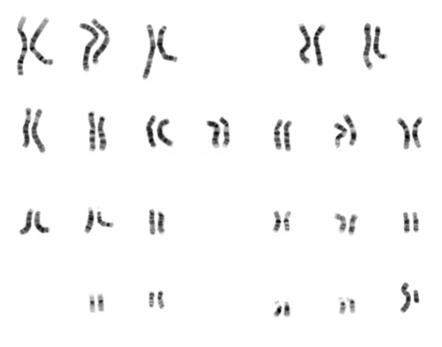

# DISTÚRBIOS CROMOSSÔMICOS

Para entender a genética na pediatria, você precisa parar de tentar decorar nomes de síndromes e começar a enxergar padrões. Na prova de residência, o examinador não quer apenas que você saiba que a Síndrome de Down é a trissomia do 21. Ele quer saber se você entende por que o risco de recorrência muda quando há uma translocação, ou se você sabe identificar a cardiopatia que vai matar aquele recém-nascido.

Aqui no MedEvo, focamos no que realmente aparece no seu plantão e na sua prova. Vamos dividir o raciocínio em como as alterações ocorrem e como elas se manifestam clinicamente.

## Bases da Genética Clínica

*Figura 1 - Cariótipo humano masculino normal (46,XY) com bandamento G, demonstrando os 22 pares de autossomos e o par de cromossomos sexuais. Fonte: National Human Genome Research Institute, Public Domain | Wikimedia Commons*
 e Cariótipo

O cariótipo é o nosso "mapa" básico. Quando pedimos um cariótipo de sangue periférico com bandamento G, estamos olhando a estrutura e o número dos cromossomos.

A maioria dos erros que caem em prova ocorre na meiose, especificamente a não disjunção. Se os cromossomos não se separam direito, terminamos com um gameta com 24 cromossomos e outro com 22. Ao fecundar, teremos uma trissomia (47 cromossomos) ou uma monossomia (45 cromossomos).

### O Porquê do Cariótipo

Muitos alunos erram ao achar que todo quadro dismórfico precisa de cariótipo imediato. Cuidado: o cariótipo não é essencial para a maioria dos quadros dismórficos isolados. Ele é indicado quando suspeitamos de síndromes cromossômicas clássicas, atraso global do desenvolvimento sem causa definida ou genitália ambígua.

Se você tem uma criança com uma única malformação, como uma fenda palatina isolada, o risco de recorrência é multifatorial. Agora, se há um conjunto de malformações (síndrome), a genética manda no prognóstico.

## Síndrome de Down

*Figura 2 - Cariótipo demonstrando trissomia do cromossomo 21 (47,XX,+21), característico da Síndrome de Down. Fonte: National Human Genome Research Institute, Public Domain | Wikimedia Commons*
 (Trissomia do 21)

Esta é a desordem autossômica mais comum em recém-nascidos. Você vai encontrar o fenótipo clássico: hipotonia neonatal, braquicefalia, fissuras palpebrais oblíquas para cima, prega palmar única (prega simiesca) e língua protrusa.

Mas a prova quer o detalhe. Vamos ao que define a conduta:

### Etiologia e Risco de Recorrência

Existem três formas de um paciente ter Síndrome de Down, e isso cai muito porque define o aconselhamento genético:

- **Trissomia Simples (95%):** Erro na meiose (geralmente materna). O cariótipo é 47,XX,+21 ou 47,XY,+21. O risco de recorrência para os pais é baixo (cerca de 1%), dependendo da idade materna.

- **Translocação Robertsoniana (3-4%):** Aqui o bicho pega. O cromossomo 21 extra está "grudado" em outro cromossomo (geralmente o 14). O cariótipo mostra 46 cromossomos, mas um deles é um "híbrido" t(14;21).

- **Mosaicismo (1-2%):** O erro ocorre após a fecundação (mitose). O paciente tem duas linhagens de células: algumas normais e outras com trissomia. O fenótipo costuma ser mais leve.

**Dica do Dr. Will:** Se a prova mostrar um cariótipo com translocação t(14;21), a conduta obrigatória é realizar o cariótipo dos pais. Por quê? Porque um deles pode ser portador da translocação equilibrada. Se a mãe for a portadora, o risco de recorrência é de 10 a 15%. Se for o pai, é de 2 a 5%. Se for uma translocação 21;21, o risco de recorrência é de 100%.

### Complicações que Caem em Prova

Não decore apenas a face do paciente. Decore o que o mata ou o que muda sua qualidade de vida:

- **Cardiopatia:** 40 a 50% dos pacientes têm. A principal é o Defeito do Septo Atrioventricular (DSAV). Se a questão falar em "sopro holossistólico" e "comunicação entre as quatro câmaras", marque Down.

- **Hematologia:** Existe um risco aumentado de Leucemia (tanto LLA quanto LMA, sendo a LMA-M7 mais comum em crianças pequenas com Down).

- **Gastrointestinal:** Atresia duodenal (sinal da dupla bolha no raio-X) e pâncreas anular.

- **Instabilidade Atlanto-axial:** Cuidado com esportes de impacto ou intubação orotraqueal.

## Síndrome de Edwards (Trissomia do 18)

Se o Down é o "queridinho" das provas, o Edwards é o "clássico das malformações graves". O cariótipo é 47,XX,+18 ou 47,XY,+18.

O quadro clínico é muito florido. O examinador vai descrever um RN com:

- Microcefalia e occipital proeminente.

- Micrognatia (queixo pequeno) e orelhas de implantação baixa e malformadas.

- **Pés em mata-borrão** (planta do pé convexa).

- **Mãos cerradas com sobreposição do segundo dedo sobre o terceiro e do quinto sobre o quarto.** Isso é quase patognomônico em questões de prova.

O prognóstico é muito reservado, com alta mortalidade no primeiro ano de vida devido a malformações cardíacas e renais graves.

## Síndrome de Patau (Trissomia do 13)

Aqui falamos de defeitos de linha média. O cariótipo é 47,XX,+13. Pense na Síndrome de Patau como a síndrome das "fendas e furos".

Os achados principais são:

- **Holoprosencefalia:** O cérebro não se divide corretamente em dois hemisférios.

- **Microftalmia ou anoftalmia.**

- **Fenda labial e palatina central.**

- **Polidactilia pós-axial** (dedo extra do lado do dedinho).

- Cutis aplasia (falta de pele no couro cabeludo).

Assim como no Edwards, a letalidade é altíssima e precoce. Muitas vezes a questão foca no diagnóstico diferencial com Edwards. Lembre-se: Patau tem fendas e polidactilia; Edwards tem mãos cerradas e pés em mata-borrão.

### Tabela 1: Comparativo das Trissomias Autossômicas

| Característica | Síndrome de Down (21) | Síndrome de Edwards (18) | Síndrome de Patau (13) |
| --- | --- | --- | --- |
| **Cariótipo Comum** | 47,XX,+21 | 47,XX,+18 | 47,XX,+13 |
| **Achado Facial** | Fissuras oblíquas, língua protrusa | Micrognatia, orelhas baixas | Fenda labial/palatina, microftalmia |
| **Mãos/Pés** | Prega palmar única | Mãos cerradas (sobreposição), mata-borrão | Polidactilia |
| **Cardiopatia** | DSAV | CIV, Estenose Valvar | CIV, Dextrocardia |
| **Outros** | Hipotonia, risco de Leucemia | Occipital proeminente | Holoprosencefalia, Cutis aplasia |

## Síndrome de Turner (45,X)

Atenção: Turner é a única monossomia viável em humanos. É um fenótipo feminino (45,X).

O diagnóstico pode ser feito em três fases da vida, e as bancas adoram as três:

- **Período Neonatal:** RN feminino com **linfedema de mãos e pés** e pescoço alado (pterygium colli). Se houver coarctação da aorta, a suspeita aumenta drasticamente.

- **Infância:** Baixa estatura (é a principal característica constante). Muitas vezes é o único sinal.

- **Adolescência:** Puberdade atrasada e amenorreia primária devido à disgenesia gonadal (ovários em fita).

**Achados Renais:** Rins em ferradura são comuns.
**Tratamento:** Reposição de Hormônio do Crescimento (GH) para a estatura e terapia estrogênica para induzir caracteres sexuais e proteger a saúde óssea.

## Síndrome de Klinefelter (47,XXY)

É o fenótipo masculino com um cromossomo X extra. O diagnóstico raramente é feito na infância, pois o quadro clínico se torna evidente na puberdade.

O que cai:

- Estatura elevada (membros inferiores longos).

- Hipogonadismo hipergonadotrófico (testículos pequenos e endurecidos, testosterona baixa, LH/FSH altos).

- Ginecomastia e infertilidade (azoospermia).

- Dificuldades de aprendizado e problemas de comportamento.

## Síndrome do X Frágil

Embora não seja uma aneuploidia (número errado de cromossomos), é uma alteração cromossômica estrutural (expansão de tripletos CGG no gene FMR1) que é a causa hereditária mais comum de deficiência intelectual (DI).

**O quadro clássico de prova:** Menino com atraso no desenvolvimento, face alongada, orelhas grandes/proeminentes e, após a puberdade, **macrorquidia** (testículos aumentados). Também apresentam hiperextensibilidade articular.

Cuidado: Muitos confundem com autismo, pois o X Frágil é uma das principais causas genéticas de comportamento autístico. O diagnóstico é feito por biologia molecular (PCR ou Southern Blot), não pelo cariótipo comum.

## Distúrbios do Desenvolvimento Sexual (DDS) e Genitália Ambígua

Este tema assusta, mas vamos simplificar. Quando um RN nasce com genitália ambígua, a primeira conduta é estabilizar o paciente (risco de crise adrenal) e a segunda é investigar a etiologia.

### Hiperplasia Adrenal Congênita (HAC)

É a causa mais comum de genitália ambígua. O cariótipo é **46,XX** (feminino), mas há virilização por excesso de andrógenos.

- **Causa:** Deficiência da enzima 21-hidroxilase.

- **Laboratório:** Elevação da 17-OH-progesterona.

- **Clínica:** Pode haver perda de sal (hiponatremia, hipercalemia e choque) nas primeiras semanas de vida.

### Síndrome de Morris (Insensibilidade Androgênica Completa)

O cariótipo é **46,XY** (masculino), mas o fenótipo é feminino.

- **Por que?** O corpo produz testosterona, mas os receptores não funcionam.

- **Clínica:** Menina com desenvolvimento mamário normal (a testosterona periférica vira estrogênio), mas com ausência de pelos pubianos e axilares, vagina curta e ausência de útero/ovários (os testículos estão intra-abdominais ou no canal inguinal).

**Dica de Prova:** RN com genitália ambígua? O primeiro exame de imagem é a **Ultrassonografia Pélvica** para procurar útero. Se tem útero, pense em causas de virilização de um feto feminino (como HAC). Se não tem útero, pense em causas de má-virilização de um feto masculino.

## Síndromes de Microdeleção e Imprinting

Aqui o cariótipo normal pode enganar, pois a perda de material genético é tão pequena que só o exame de FISH ou Microarray detecta.

### Síndrome de DiGeorge (Deleção 22q11.2)

Lembre-se da tríade: **Coração, Timo e Cálcio.**

- **Coração:** Cardiopatias conotruncais (Tetralogia de Fallot, tronco arterioso).

- **Timo:** Hipoplasia ou aplasia do timo, levando à imunodeficiência celular (infecções de repetição).

- **Cálcio:** Hipocalcemia neonatal por hipoplasia das paratireoides (pode causar convulsões).

### Síndrome de Prader-Willi

Ocorre por uma deleção no cromossomo 15 de origem **paterna** (ou dissomia uniparental materna).

- **Fase 1 (Neonatal):** Hipotonia grave ("bebê frouxo") e dificuldade de sucção.

- **Fase 2 (Infância):** Hiperfagia incontrolável, levando à obesidade mórbida, mãos e pés pequenos, hipogonadismo e retardo mental.

## Genética e Oncologia Pediátrica

Algumas alterações cromossômicas e genéticas estão diretamente ligadas a tumores. As bancas amam essa correlação.

- **Tumor de Wilms (Nefroblastoma):** Massa abdominal que não ultrapassa a linha média, bom estado geral. Associado ao gene **WT1** (cromossomo 11). Pode vir na síndrome WAGR (Wilms, Aniridia, Genitália ambígua, Retardo mental).

- **Retinoblastoma:** Tumor ocular. 40% são hereditários (mutação no gene RB1). Se for bilateral, é quase certamente hereditário. O sinal clássico é a leucocoria (reflexo branco).

- **Neuroblastoma:** Massa abdominal que **ultrapassa** a linha média, criança com aspecto doente, diarreia, anemia. O marcador de mau prognóstico é a amplificação do oncogene **MYCN**.

### Tabela 2: Diagnóstico Diferencial de Massas Abdominais

| Característica | Tumor de Wilms | Neuroblastoma |
| --- | --- | --- |
| **Localização** | Renal (distorce o rim) | Adrenal ou Cadeia Simpática |
| **Linha Média** | Raramente ultrapassa | Frequentemente ultrapassa |
| **Estado Geral** | Bom | Comprometido (doente) |
| **Marcador/Genética** | Gene WT1 | Amplificação MYCN |
| **Calcificações** | Raras | Comuns na TC |

## Infecções Congênitas e Microcefalia (Diagnóstico Diferencial)

Muitas vezes, a prova coloca um quadro de microcefalia e você precisa diferenciar se é genético ou infeccioso (TORCH).

- **Toxoplasmose Congênita:** Tríade de Sabin (Hidrocefalia + Calcificações intracranianas **difusas** + Coriorretinite).

- **Citomegalovírus (CMV):** Calcificações **periventriculares**, microcefalia, surdez neurossensorial e trombocitopenia.

- **Zika Vírus:** Microcefalia grave, calcificações na transição corticossubcortical e artrogripose.

**Definição de Microcefalia (OMS):** Para RN com idade gestacional ≥ 37 semanas, o Perímetro Cefálico (PC) deve ser ≤ 31,5 cm para meninas e ≤ 31,9 cm para meninos.

## Outras Condições Importantes

### Síndrome de Prune Belly

Tríade: Agenesia da musculatura reto-abdominal (abdome em "ameixa seca"), anomalias do trato urinário (megaureter, bexigoma) e criptorquidia bilateral. É mais comum em meninos.

### Distrofia Muscular de Duchenne (DMD)

Herança ligada ao X recessiva. Menino que começa a cair muito, sinal de Gowers (levanta-se "escalando" o próprio corpo).

- **Exame inicial:** Creatina Quinase (CK) sérica. Estará absurdamente elevada (10 a 50 vezes o normal).

### Disrafismo Espinhal Oculto

Sempre examine o dorso do RN. Estigmas neurocutâneos como sinus dérmico, tufos de pelos, lipomas ou manchas hemangiomatosas na linha média da coluna podem indicar que a medula não fechou direito por baixo da pele.

## Pontos-Chave para Prova

- **Síndrome de Down:** A causa mais comum é a trissomia simples (não disjunção). Se houver translocação, o cariótipo dos pais é obrigatório para avaliar risco de recorrência.

- **Cardiopatia no Down:** Defeito do Septo Atrioventricular (DSAV) é a resposta correta em 90% das questões.

- **Edwards (18):** Mãos cerradas com sobreposição de dedos e pés em mata-borrão.

- **Patau (13):** Holoprosencefalia, fendas centrais e polidactilia.

- **Turner (45,X):** Menina com linfedema neonatal, coarctação da aorta e, futuramente, baixa estatura e amenorreia.

- **X-Frágil:** Causa hereditária mais comum de deficiência intelectual. Macrorquidia é a dica de ouro no adolescente.

- **HAC:** Principal causa de genitália ambígua no RN 46,XX. Risco de crise adrenal (perda de sal).

- **Síndrome de Morris:** Cariótipo 46,XY, mas fenótipo feminino. Ausência de útero e pelos.

- **DiGeorge:** Deleção 22q11.2, hipocalcemia (convulsões), cardiopatia conotruncal e imunodeficiência celular.

- **Prader-Willi:** Hipotonia neonatal seguida de hiperfagia e obesidade.

- **Microcefalia OMS:** PC ≤ 31,5 cm (♀) e ≤ 31,9 cm (♂).

- **Tumor de Wilms:** Massa abdominal que respeita a linha média; associado ao gene WT1.

- **Neuroblastoma:** Massa que ultrapassa a linha média; MYCN positivo indica mau prognóstico.

- **Duchenne:** CK elevada é o melhor teste de rastreio inicial.

- **Cariótipo:** Não é necessário para malformações isoladas (ex: fenda palatina isolada), mas essencial em múltiplas malformações ou atraso de causa desconhecida. 🧬

 Cópia offline para consulta pessoal.
 Fonte original:
 [https://www.medevo.com.br/material-apoio/ler/93d70c89-cc72-4168-94f9-a729eb6ea821](https://www.medevo.com.br/material-apoio/ler/93d70c89-cc72-4168-94f9-a729eb6ea821)
