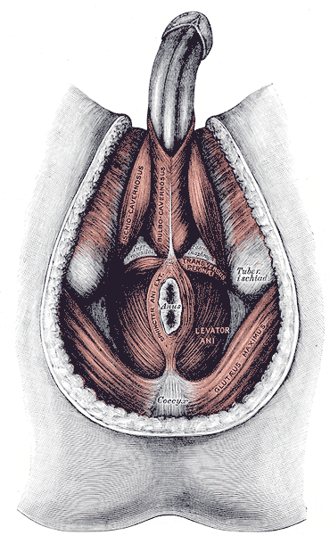

# DISTÚRBIOS DO ASSOALHO PÉLVICO

Para entender os distúrbios do assoalho pélvico, você precisa parar de ver a pelve como um conjunto de órgãos isolados e passar a enxergá-la como uma unidade funcional. Imagine uma rede ou uma "rede de descanso" (hammock). Se os ganchos da rede quebram ou se o tecido esgarça, tudo o que está em cima dela cai ou funciona mal. Na prova de residência, o examinador não quer apenas que você saiba o nome do músculo; ele quer que você saiba o que acontece quando esse músculo falha durante uma cirurgia ou no parto.

*Figura 1 - Musculatura do períneo feminino mostrando músculos do assoalho pélvico. Fonte: OpenStax, CC BY 3.0 | Wikimedia Commons*

## A Base de Tudo: Anatomia Cirúrgica e Funcional

Se você errar a anatomia, você erra a questão e, pior, erra a cirurgia. O assoalho pélvico é dividido didaticamente em dois "andares" principais que as bancas amam confundir.

*Figura 2 - Músculos do períneo (Gray's Anatomy). Fonte: Henry Vandyke Carter, Public Domain | Wikimedia Commons*

### O Diafragma Pélvico

Este é o verdadeiro "chão" da pelve. Ele é formado por um conjunto de músculos que sustentam as vísceras. Guarde esta composição, pois ela cai sistematicamente: o diafragma pélvico é composto pelos **músculos levantadores do ânus** e pelo **músculo coccígeo** (também chamado de isquiococcígeo).

Aqui mora a primeira pegadinha clássica: o músculo piriforme **não** faz parte do diafragma pélvico. Ele compõe a parede pélvica lateral. Se a alternativa colocar o piriforme no meio do diafragma, pode riscar sem medo.

O músculo levantador do ânus, por sua vez, é uma tríade. Você precisa decorar esses três componentes como se fossem um mantra:

- **Músculo Puborretal:** É a estrela da continência fecal. Ele forma uma alça em "U" ao redor da junção anorretal, criando o ângulo anorretal.

- **Músculo Pubococcígeo:** A porção principal, que se estende do púbis ao cóccix.

- **Músculo Ileococcígeo:** A parte mais lateral e posterior, que dá estabilidade à "rede".

### O Diafragma Urogenital e o Períneo

Abaixo do diafragma pélvico, temos o diafragma urogenital. Ele é mais superficial e fecha o triângulo anterior da pelve. Ele é composto basicamente pelo **músculo transverso profundo do períneo** e pelo **esfíncter uretral externo**.

Cuidado: muitos alunos confundem o elevador do ânus com o diafragma urogenital. Lembre-se que o elevador do ânus é profundo e faz parte do diafragma pélvico. Se uma questão mencionar lesão do diafragma urogenital, ela está falando de estruturas que afetam os músculos transverso profundo e transverso superficial do períneo.

### Fáscias e Espaços: O Mapa do Cirurgião

Na prática do MedEvo, sempre reforçamos que o cirurgião colorretal precisa de "planos de clivagem". Se você entrar no plano errado, o sangramento é catastrófico ou você lesa nervos autonômicos.

- **Fáscia de Waldeyer (Fáscia Retossacral):** Esta é a "queridinha" das provas de cirurgia. Ela conecta o reto ao sacro na altura de S3-S4. Para realizar uma dissecção retro-retal segura, você precisa seccioná-la. Se você não a reconhecer, corre o risco de entrar no plexo venoso pré-sacral.

- **Fáscia de Denonvilliers (Fáscia Retoprostática/Retovaginal):** Localizada anteriormente ao reto. É o plano de separação entre o reto e a próstata (no homem) ou a vagina (na mulher).

- **Fáscia Pré-sacral:** Recobre o osso sacro e os vasos pré-sacrais. Nunca deve ser violada, sob risco de hemorragia de difícil controle.

- **Espaço de Retzius:** É o espaço retropúbico. Por que isso cai? Porque é a via de acesso para a **Cirurgia de Burch**, utilizada para tratar a incontinência urinária de esforço.

| Estrutura | Composição / Localização | Importância Clínica/Cirúrgica |
| --- | --- | --- |
| **Diafragma Pélvico** | Levantador do ânus + Coccígeo | Sustentação visceral total |
| **Diafragma Urogenital** | Transverso profundo + Esfíncter uretral | Continência urinária e suporte anterior |
| **Fáscia de Waldeyer** | Entre reto e sacro (posterior) | Plano de dissecção na cirurgia retal |
| **Fáscia de Denonvilliers** | Entre reto e órgãos genitais (anterior) | Proteção de estruturas urogenitais |

## Fisiologia da Continência: Por que não "vazamos"?

A continência não é um evento passivo; é um equilíbrio dinâmico.

### Continência Fecal

Para manter as fezes no lugar, precisamos de três pilares:

- **Músculo Puborretal:** Ele mantém o ângulo anorretal (entre 80° e 100°). Quando você quer evacuar, esse músculo relaxa, o ângulo se retifica e as fezes passam. Se ele não relaxar, temos a "anismo" ou defecação obstruída.

- **Esfíncter Anal Interno (EAI):** Musculatura lisa, involuntária. Responsável por 70-80% da pressão de repouso do canal anal.

- **Esfíncter Anal Externo (EAE):** Musculatura estriada, voluntária. É o que você "aperta" quando está longe de um banheiro.

### Continência Urinária

Aqui, o foco é a uroginecologia. A continência urinária de esforço ocorre quando a pressão intra-abdominal supera a pressão de fechamento uretral, geralmente por hipermobilidade do colo vesical ou deficiência esfincteriana. O suporte dado pela fáscia endopélvica e pelos músculos levantadores do ânus é fundamental.

## Distúrbios Comuns e Manejo Clínico

### Incontinência Fecal

Imagine uma paciente de 65 anos, multípara (vários partos normais), que se queixa de perda involuntária de gases e fezes líquidas. O que o Dr. Will recomendaria investigar primeiro?

O exame físico é soberano. O toque retal avalia o tônus de repouso (EAI) e a contração voluntária (EAE e Puborretal).

- **Diagnóstico:** A manometria anorretal quantifica essas pressões. A ultrassonografia endoanal é o padrão-ouro para ver se há rotura (buraco) nos esfíncteres, comum em traumas de parto.

- **Tratamento:** Começamos com dieta (fibras para dar consistência) e biofeedback (fisioterapia pélvica). Se houver lesão esfincteriana franca, a esfincteroplastia pode ser indicada.

### Prolapso de Órgãos Pélvicos (POP) e Retocele

A retocele é a protrusão da parede anterior do reto em direção à luz vaginal. A paciente sente que "fica um resto de fezes" e, muitas vezes, precisa realizar manobras digitais (introduzir o dedo na vagina) para conseguir evacuar. Isso acontece por fraqueza do septo retovaginal (fáscia de Denonvilliers).

### Incontinência Urinária de Es esforço (IUE)

A prova vai te cobrar a **Cirurgia de Burch** (colposuspensão retropúbica).

- **Onde é feita?** No Espaço de Retzius.

- **O que ela faz?** Fixa a fáscia perivaginal ao ligamento de Cooper (pectíneo), elevando a transição uretrovesical.

## Urgências em Coloproctologia: O Megacólon Tóxico

Embora pareça um tema à parte, o megacólon tóxico aparece frequentemente em questões de assoalho pélvico e anatomia cirúrgica devido à complexidade da dissecção pélvica em vigência de inflamação.

O cenário típico: paciente com Retocolite Ulcerativa (RCU) que evolui com febre, taquicardia, dor abdominal e dilatação do cólon > 6 cm no raio-X.

- **Conduta de Prova:** Se o tratamento clínico falhar em 24-72h ou houver sinais de perfuração, a cirurgia é mandatória.

- **Qual cirurgia?** Colectomia subtotal + Ileostomia terminal + Sepultamento do reto (Procedimento de Hartmann).

- **Por que não tirar o reto agora?** Porque o paciente está grave (tóxico) e a dissecção pélvica profunda para tirar o reto é demorada e sangrenta. Deixamos o reto para um segundo tempo, quando o paciente estiver estável.

## Vascularização e Inervação: Detalhes que Decidem Questões

Você não pode ir para a prova sem saber a origem dos vasos.

- **Artéria Mesentérica Inferior (AMI):** Ela dá origem à artéria cólica esquerda, artérias sigmoideas e termina como **Artéria Retal Superior**. Portanto, a retal superior irriga o reto proximal.

- **Artéria Ilíaca Interna:** Dela saem as artérias retais médias.

- **Artéria Pudenda Interna:** Dela saem as artérias retais inferiores.

**O Nervo Pudendo:** É o "rei" do períneo. Ele emerge pelo **forame isquiático maior**, passa pelo canal de Alcock e fornece a inervação sensitiva dos genitais externos e a inervação motora para o esfíncter anal externo. Lesões desse nervo (por estiramento no parto ou esforço evacuatório crônico) são causas frequentes de incontinência.

| Artéria | Origem | Território |
| --- | --- | --- |
| **Retal Superior** | Ramo terminal da Mesentérica Inferior | Reto Superior e Médio |
| **Retal Média** | Ramo da Ilíaca Interna | Reto Médio e Inferior |
| **Retal Inferior** | Ramo da Pudenda Interna | Canal Anal e Esfíncteres |

## Anatomia do Reto e Válvulas de Houston

O reto começa ao nível de S3 e termina no canal anal. Internamente, ele possui pregas transversais chamadas **Válvulas de Houston**. Geralmente são três: superior, média e inferior. A válvula média (de Kohlrausch) é a mais constante e marca o nível da reflexão peritoneal anterior.

Por que isso importa? Tumores acima da reflexão peritoneal (reto superior) podem ser tratados como tumores de cólon, enquanto tumores abaixo (reto médio e inferior) exigem uma abordagem pélvica mais complexa, muitas vezes com neoadjuvância (quimio e radioterapia).

## Diagnóstico Diferencial e Exames Complementares

Quando um paciente chega com queixa de "bola saindo pelo ânus", você deve diferenciar:

- **Hemorroidas Prolapsadas:** Origem na linha pectínea, mucosa com aspecto de "gomos".

- **Procidência de Reto (Prolapso Total):** Todas as camadas do reto saem pelo ânus. Você verá pregas circunferenciais (anelares) na mucosa.

- **Prolapso Mucoso:** Apenas a mucosa sai. As pregas são radiais.

Para investigar a fisiopatologia desses distúrbios, usamos:

- **Defecografia (ou Cinedefecografia):** Um raio-X dinâmico onde o paciente evacua um contraste pastoso. É excelente para ver retocele, intussuscepção e se o músculo puborretal está relaxando adequadamente.

- **Manometria Anorretal:** Mede pressões. Essencial para diagnosticar anismo e avaliar a força dos esfíncteres.

- **Tempo de Trânsito Colônico:** Útil na constipação para diferenciar se o problema é no cólon todo (inércia colônica) ou apenas na saída (obstrução de saída).

## Pontos-Chave para Prova

- **Diafragma Pélvico:** Composto pelos músculos levantadores do ânus (puborretal, pubococcígeo, ileococcígeo) e pelo músculo coccígeo. O piriforme NÃO faz parte.

- **Diafragma Urogenital:** Composto pelo músculo transverso profundo do períneo e esfíncter uretral externo.

- **Músculo Puborretal:** É o principal responsável pela manutenção do ângulo anorretal e pela continência fecal sólida.

- **Fáscia de Waldeyer:** Também chamada de fáscia retossacra. Crucial para acessar o espaço retro-retal sem causar hemorragias pré-sacrais.

- **Fáscia de Denonvilliers:** Separa o reto da próstata/vagina. É o plano anterior de dissecção.

- **Nervo Pudendo:** Principal nervo sensitivo do períneo e motor do esfíncter externo. Emerge pelo forame isquiático maior.

- **Artéria Retal Superior:** É a continuação direta (ramo terminal) da artéria mesentérica inferior.

- **Megacólon Tóxico na RCU:** A conduta cirúrgica de urgência é colectomia subtotal + ileostomia terminal + Hartmann. Nunca faça anastomose ou proctectomia total na urgência.

- **Cirurgia de Burch:** Realizada no Espaço de Retzius (retropúbico) para tratar incontinência urinária de esforço.

- **Ângulo Anorretal:** Valor normal entre 80° e 100°. É mantido pela contração tônica do puborretal.

- **Espaço de Retzius:** Localizado entre a sínfise púbica e a bexiga.

- **Válvulas de Houston:** Pregas transversais do reto. A média marca a reflexão peritoneal.

- **Contraindicação Absoluta para Cirurgia de Prolapso:** Paciente sem condições clínicas mínimas ou sem sintomas que justifiquem o risco (prolapso assintomático em idoso muito frágil).

- **Erro Clássico:** Achar que o esfíncter anal interno é voluntário. Ele é músculo liso (involuntário). O externo é que é estriado (voluntário).

- **Manobra de Valsalva no Exame Físico:** Essencial para evidenciar prolapsos e retocele que não aparecem em repouso. 🧠

 Cópia offline para consulta pessoal.
 Fonte original:
 [https://www.medevo.com.br/material-apoio/ler/8b941aa9-bd0e-46d8-972c-19eec36530a1](https://www.medevo.com.br/material-apoio/ler/8b941aa9-bd0e-46d8-972c-19eec36530a1)
