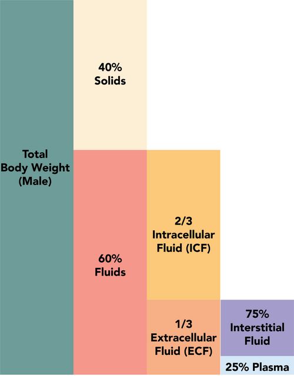
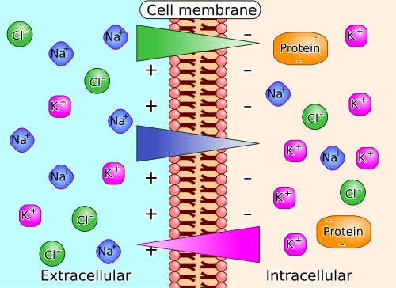

# DISTÚRBIOS HIDROELETROLÍTICOS E ÁCIDO-BASE

Para entender os distúrbios hidroeletrolíticos no paciente cirúrgico, você precisa primeiro abandonar a ideia de que estamos tratando apenas números em um papel de exame. Na cirurgia, o eletrólito é o reflexo direto da manipulação tecidual, do tempo de jejum, da resposta endócrino-metabólica ao trauma (REMET) e das perdas digestivas. Se você entender a dinâmica dos fluidos, nunca mais vai precisar decorar fórmulas de reposição de forma isolada.

*Figura 1 - Esquema dos compartimentos de fluidos corporais mostrando intracelular, extracelular, intersticial e intravascular. Fonte: Alan Sved and David Walsh, CC BY-SA 4.0 | Wikimedia Commons*

## Fisiologia dos Fluidos e Compartimentos

O corpo humano é, essencialmente, uma solução salina. Em um adulto jovem, cerca de 60% do peso corporal é água. Mas aqui está o primeiro ponto que as bancas adoram: essa proporção varia. Idosos e mulheres têm menos água (mais gordura, menos músculo), chegando a 50%. Por que isso importa? Porque uma perda de 2 litros de fluido em um jovem de 80kg é uma coisa; em uma idosa de 50kg, é um desastre hemodinâmico.

A água se divide em dois grandes compartimentos:

- **Intracelular (IC):** 2/3 do total. O rei aqui é o Potássio (K+).

- **Extracelular (EC):** 1/3 do total. O rei aqui é o Sódio (Na+).

O compartimento extracelular ainda se divide em intersticial (75%) e intravascular (25%). Quando falamos em "volemia" e "choque", estamos olhando para esses 25% do extracelular. O grande desafio do cirurgião é o "terceiro espaço": aquele fluido que sai do vaso e vai para o interstício ou para a luz intestinal devido à inflamação e ao trauma cirúrgico. Esse líquido está no corpo, mas não serve para perfundir órgãos.

*Figura 2 - Diferenças de concentração iônica (Na+, K+, Cl-) em lados opostos da membrana celular criando potencial elétrico. Fonte: Biezl/Looie496, CC BY-SA 3.0 | Wikimedia Commons*

## Distúrbios do Sódio: O Balanço de Água

Um erro clássico de aluno é achar que o sódio sérico mede a quantidade total de sal no corpo. Errado. O sódio sérico mede a **proporção** entre sódio e água. Na maioria das vezes, um distúrbio do sódio é, na verdade, um distúrbio da água.

### Hiponatremia (Na 145 mEq/L)

Geralmente reflete um **déficit de água livre**. Imagine um idoso com AVC que não consegue pedir água ou um paciente com febre alta e perdas insensíveis aumentadas.

*Cálculo do Déficit de Água:*
Déficit = Água Corporal Total x [(Na atual / Na desejado) - 1]

A reposição deve ser feita preferencialmente por via oral ou sonda (água livre). Se for venosa, usamos Soro Glicosado 5% ou Salina 0,45%.

## Distúrbios do Potássio: O Perigo Elétrico

Se o sódio é sobre volume e água, o potássio é sobre **excitabilidade celular**. Como 98% do potássio está dentro da célula, pequenas mudanças no sangue (extracelular) causam desastres no potencial de membrana do coração.

### Hipercalemia (K > 5,5 mEq/L)

No contexto cirúrgico, pense em:

- Insuficiência Renal Aguda (LRA) pós-operatória.

- Rabdomiólise (trauma por esmagamento ou isquemia de membro).

- Acidose metabólica (o H+ entra na célula e o K+ sai para compensar).

**O Eletrocardiograma (ECG) é sua bússola:**

- Onda T apiculada ("em tenda") e simétrica.

- Achatamento da onda P e prolongamento do intervalo PR.

- Alargamento do QRS (fase perigosa!).

- Ritmo sinodal (onda T e QRS se fundem).

**Tabela 1: Manejo da Hipercalemia Grave**

| Medida | Mecanismo | Início de Ação |
| --- | --- | --- |
| **Gluconato de Cálcio 10%** | Estabiliza a membrana do miocárdio (NÃO baixa o K) | Imediato (1-3 min) |
| **Glicoinsulinoterapia** | Joga o K para dentro da célula | 30-60 min |
| **Beta-2 agonista (Nebulização)** | Joga o K para dentro da célula | 30 min |
| **Bicarbonato de Sódio** | Se houver acidose metabólica associada | Variável |
| **Furosemida / Resinas (Kayexalate)** | Eliminação renal/intestinal | Horas |
| **Hemodiálise** | Remoção definitiva | Ouro-padrão na refratariedade |

*Dica de Prova:* Se a questão mostrar um ECG com onda T em tenda e perguntar a "primeira conduta", a resposta é **Gluconato de Cálcio**. Ele não muda o nível de potássio, mas impede que o paciente pare o coração enquanto você usa as outras medidas.

### Hipocalemia (K

| Solução | Na+ (mEq/L) | Cl- (mEq/L) | K+ (mEq/L) | pH | Osmolaridade |
| --- | --- | --- | --- | --- | --- |
| **SF 0,9%** | 154 | 154 | 0 | 5,0 | 308 |
| **Ringer Lactato** | 130 | 109 | 4 | 6,5 | 273 |
| **Plasma-Lyte** | 140 | 98 | 5 | 7,4 | 294 |
| **SG 5%** | 0 | 0 | 0 | 4,0 | 252 |

*Exemplo Clínico:* Paciente de 45 anos, pós-op de gastrectomia, em jejum. Se você prescrever apenas SG 5%, ele fará hiponatremia (falta sódio). Se prescrever apenas SF 0,9% em grandes volumes, fará acidose hiperclorêmica. O equilíbrio é a chave.

## Situações Especiais em Cirurgia

### Síndrome Compartimental Abdominal (SCA)

Quando a pressão intra-abdominal (PIA) ultrapassa 20 mmHg associada a uma nova disfunção de órgãos.

- **Fisiopatologia:** A pressão alta comprime a veia cava (diminui retorno venoso) e as artérias renais.

- **Sinal clássico:** Paciente com abdome tenso, oligúria e aumento da pressão de pico no ventilador.

- **Conduta:** Laparotomia descompressiva ("abdome aberto").

### Fístulas Digestivas

O eletrólito perdido depende de onde vem o líquido:

- **Estômago:** Perde H+ e Cl- (Alcalose).

- **Pâncreas/Biliar/Intestino Delgado:** Perde muito Bicarbonato (Acidose metabólica AG normal).

- **Dica:** Se o dreno da cirurgia de Whipple (duodenopancreatectomia) começar a sair muito líquido, dose a amilase do dreno. Se estiver alta, é fístula pancreática.

### Síndrome da Realimentação

Ocorre no paciente desnutrido crônico (ex: câncer de esôfago) que volta a receber carga de glicose (NPT ou dieta enteral).

- **Mecanismo:** A insulina sobe bruscamente e joga fósforo, magnésio e potássio para dentro da célula.

- **Marcador principal:** **Hipofosfatemia grave**. Pode causar insuficiência cardíaca e morte.

## Avaliação da Responsividade a Fluidos

No choque, não basta saber se o paciente "precisa" de volume, mas se ele "aguenta" e "responde" ao volume.

- **Variação do Volume Sistólico (VVS):** Em pacientes em ventilação mecânica, uma VVS > 12-13% indica que o paciente é responsivo a fluidos.

- **Passive Leg Raise (Elevação passiva das pernas):** Uma manobra simples que simula um "bolus" de 300ml de sangue das pernas para o coração. Se o débito cardíaco subir, ele precisa de volume.

## Pontos-Chave para Prova

- **Hiponatremia no Pós-Op:** Geralmente é dilucional por excesso de ADH e soro hipotônico.

- **Mielinólise Pontina:** Complicação da correção rápida de hiponatremia crônica (> 10-12 mEq/24h).

- **Hipercalemia e ECG:** Onda T em tenda → Achatamento de P → Alargamento de QRS.

- **Gluconato de Cálcio:** Estabiliza o miocárdio, não reduz o potássio sérico. É a primeira medida na hipercalemia com alteração de ECG.

- **Acidose Hiperclorêmica:** Efeito colateral clássico da infusão excessiva de Soro Fisiológico 0,9%.

- **Alcalose Metabólica Hipoclorêmica Hipocalêmica:** Típica de vômitos persistentes ou aspiração por SNG.

- **Regra 4-2-1:** Essencial para cálculo de manutenção hídrica basal.

- **SCA (Síndrome Compartimental Abdominal):** PIA > 20 mmHg + disfunção de órgão (ex: oligúria). Tratamento é descompressão.

- **Síndrome da Realimentação:** Cuidado com a hipofosfatemia ao nutrir desnutridos.

- **Potássio no Pós-Op Imediato:** Evitar nas primeiras 24h se não houver perdas claras ou hipocalemia documentada.

- **Taquicardia:** É o sinal mais precoce de hipovolemia compensada.

- **Ringer Lactato:** Mais fisiológico que o SF 0,9%, mas cuidado: contém potássio e cálcio (não usar com sangue na mesma via).

- **Insuficiência Renal Pós-Operatória:** Frequentemente oligúrica (< 0,5 mL/kg/h), mas pode ser não-oligúrica.

- **Magnésio:** Se o potássio não sobe com a reposição, a culpa é da hipomagnesemia.

- **NPT (Nutrição Parenteral Total):** Sempre via Acesso Venoso Central devido à alta osmolaridade (> 900 mOsm/L). 🩺

 Cópia offline para consulta pessoal.
 Fonte original:
 [https://www.medevo.com.br/material-apoio/ler/346c5c44-d10d-441c-b4b2-0a477aff31d0](https://www.medevo.com.br/material-apoio/ler/346c5c44-d10d-441c-b4b2-0a477aff31d0)
