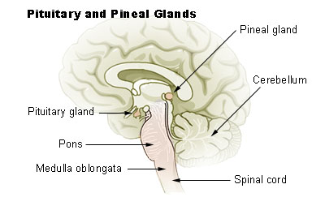

# DISTÚRBIOS HIPOFISÁRIOS

Para entender a hipófise, você não deve visualizá-la como uma glândula isolada, mas como a "gerente" de uma grande empresa. O "diretor" é o hipotálamo. Se a comunicação entre o diretor e a gerente é interrompida (compressão da haste hipofisária), a gerente para de receber ordens. Na hipófise, isso tem uma consequência única que cai em toda prova: todos os hormônios caem, exceto a prolactina, que sobe. Por quê? Porque o comando do hipotálamo para a prolactina é de **inibição** via dopamina. Sem o "freio" dopaminérgico, a prolactina corre solta.

*Figura 1 - Esquema do complexo hipotálamo-hipófise mostrando adeno-hipófise e neuro-hipófise. Fonte: OpenStax College, CC BY 3.0 | Wikimedia Commons*

## Anatomia e Fisiologia Aplicada à Clínica

A hipófise reside na sela túrcica, logo abaixo do quiasma óptico. Isso explica por que tumores grandes (macroadenomas > 10mm) causam a clássica **hemianopsia bitemporal**. O paciente perde a visão periférica porque as fibras que cruzam no quiasma (vindas da retina nasal, responsáveis pelo campo temporal) são comprimidas.

A glândula é dividida em:

- **Adeno-hipófise (Anterior):** Produz GH, ACTH, TSH, FSH, LH e Prolactina.

- **Neuro-hipófise (Posterior):** Não produz hormônios. Ela apenas armazena e libera o ADH (Vasopressina) e a Ocitocina, que são sintetizados nos núcleos supraóptico e paraventricular do hipotálamo.

**Dica de Prova:** Se uma questão menciona "fratura de base de crânio" ou "secção da haste", lembre-se que o transporte de ADH é interrompido, levando ao Diabetes Insipidus Central, e a inibição da prolactina cessa, gerando hiperprolactinemia.

*Figura 2 - Localização anatômica da glândula hipófise e pineal no encéfalo. Fonte: Public Domain | Wikimedia Commons*

## Hiperprolactinemia: O Tema Mais Cobrado

A prolactina tem uma função biológica principal: lactação. Para isso, ela inibe o eixo gonadotrófico. É por isso que o quadro clínico clássico é o binômio **galactorreia + hipogonadismo hipogonadotrófico** (amenorreia, infertilidade, queda de libido e disfunção erétil).

### Etiologia e o Raciocínio Diagnóstico

Não saia diagnosticando prolactinoma para todo mundo. A causa mais comum de prolactina alta é **fisiológica** (gravidez). A segunda é **farmacológica**.

**Causas Farmacológicas (Antagonistas Dopaminérgicos):**
Se a dopamina inibe a prolactina, qualquer droga que bloqueie a dopamina vai aumentar a prolactina.

- Antipsicóticos: Risperidona, Haloperidol.

- Antieméticos: Metoclopramida (Plasil), Domperidona.

- Anti-hipertensivos: Alfametildopa.

- Outros: Sulpirida, antidepressivos tricíclicos.

**Causas Patológicas:**

- **Prolactinomas:** Tumores produtores de prolactina.

- **Hipotireoidismo Primário:** O TRH alto (pelo feedback negativo do T3/T4 baixos) estimula não só o TSH, mas também os lactotrofos. **Regra de ouro:** Sempre dose o TSH antes de investigar um prolactinoma.

- **Insuficiência Renal Crônica (IRC):** Por redução do clearance da prolactina.

### O Efeito Gancho (Hook Effect) e a Macroprolactina

Aqui estão as duas maiores pegadinhas de prova de residência:

- **Efeito Gancho:** Ocorre em macroadenomas gigantes. A prolactina está tão absurdamente alta que satura os anticorpos do ensaio laboratorial, gerando um resultado falsamente baixo (ex: 50 ng/mL quando o real é 5.000). Se você vê um tumor de 4 cm e uma prolactina de apenas 60, peça a **diluição da amostra**.

- **Macroprolactina:** O paciente tem prolactina alta (ex: 80 ng/mL), mas é totalmente assintomático (menstruação normal, sem galactorreia). Isso ocorre porque a prolactina está ligada a imunoglobulinas, formando um complexo grande que não atravessa o vaso para agir no tecido. Conduta: Pesquisa de macroprolactina (precipitação por polietilenoglicol - PEG). Se for macroprolactina, **não trate**.

### Tratamento do Prolactinoma

Diferente de quase todos os outros tumores do corpo, o tratamento de escolha para o prolactinoma — mesmo os macroadenomas com compressão visual — é **CLÍNICO**.

- **Agonistas Dopaminérgicos:** Cabergolina (preferencial por ter menos efeitos colaterais e posologia de 1-2x por semana) ou Bromocriptina.

- **Mecanismo:** Eles mimetizam a dopamina, inibindo a secreção e reduzindo o tamanho do tumor.

- **Cirurgia (Transesfenoidal):** Reservada apenas para casos de intolerância ou resistência aos medicamentos, ou se houver perda visual progressiva que não regride com o tratamento clínico inicial.

**Exemplo Clínico:** Mulher, 28 anos, amenorreia há 6 meses e cefaleia. RNM mostra adenoma de 1,2 cm. Prolactina: 180 ng/mL. Conduta? Iniciar Cabergolina. Não marque cirurgia! Como diz o MedEvo, o bisturi é a última opção aqui.

## Acromegalia: O Excesso de GH

A acromegalia é causada, em >95% dos casos, por um adenoma hipofisário secretor de GH. Se ocorre antes do fechamento das epífises ósseas, temos o Gigantismo. No adulto, temos a Acromegalia.

### Quadro Clínico: O "Paciente que muda"

As alterações são insidiosas (levam 8-10 anos para o diagnóstico).

- Crescimento de extremidades (aumento do número do sapato, necessidade de alargar anéis).

- Fácies típica: Prognatismo (queixo para frente), macroglossia, diastema (espaçamento entre dentes), proeminência frontal.

- Sistêmicos: Hipertensão, Diabetes Mellitus (o GH é um hormônio contrarregulador da insulina), apneia do sono, polipose colônica (maior risco de câncer de cólon).

### Diagnóstico: O Fluxograma que cai na prova

- **Rastreio:** Dosagem de **IGF-1**. Por que não o GH basal? Porque o GH é pulsátil e tem meia-vida curta. O IGF-1 é estável e reflete a produção de GH das últimas 24h.

- **Confirmação:** Teste de Tolerância à Glicose (TOTG) com dosagem de GH.

- Fisiologia: A glicose deveria suprimir o GH para < 0,4 ng/mL (ou < 1,0 dependendo da diretriz).

- Na Acromegalia: O GH **não é suprimido** ou apresenta resposta paradoxal.

- **Localização:** RNM de sela túrcica (geralmente são macroadenomas).

### Tratamento da Acromegalia

Aqui a regra inverte em relação ao prolactinoma:

- **1ª Escolha:** Cirurgia Transesfenoidal.

- **Tratamento Clínico (se a cirurgia não curar):**

- Análogos da Somatostatina (Octreotide, Lanreotide): Inibem a secreção de GH.

- Antagonista do Receptor de GH (Pegvisomant): Bloqueia a ação do GH na periferia (baixa o IGF-1, mas não reduz o tumor).

- Agonistas Dopaminérgicos (Cabergolina): Podem ser usados se houver co-secreção de prolactina.

| Característica | Prolactinoma | Acromegalia |
| --- | --- | --- |
| **Rastreio Inicial** | Prolactina Sérica | IGF-1 |
| **Teste Confirmatório** | Excluir causas secundárias | TOTG com GH |
| **Tratamento 1ª Linha** | Clínico (Cabergolina) | Cirúrgico (Transesfenoidal) |
| **Principal Sintoma** | Galactorreia/Amenorreia | Crescimento Acral |

## Hipopituitarismo e Síndromes Específicas

O hipopituitarismo é a deficiência de um ou mais hormônios hipofisários. A sequência de perda geralmente é: GH > Gonadotrofinas (FSH/LH) > TSH > ACTH.

### Síndrome de Sheehan

É a necrose hipofisária isquêmica pós-parto. Durante a gravidez, a hipófise dobra de tamanho (hiperplasia dos lactotrofos), mas a irrigação sanguínea não aumenta na mesma proporção. Se houver uma hemorragia pós-parto grave com choque hipovolêmico, a hipófise sofre infarto.

- **Sinal clássico:** Agalactia (não consegue amamentar) seguida de amenorreia persistente e sinais de hipotireoidismo/insuficiência adrenal.

### Síndrome de Kallmann

Um erro clássico é confundir com outras causas de atraso puberal.

- **Fisiopatologia:** Falha na migração dos neurônios produtores de GnRH e dos neurônios olfatórios.

- **Clínica:** Hipogonadismo Hipogonadotrófico (FSH/LH baixos) + **Anosmia ou Hiposmia** (não sente cheiro).

- **Dica do Dr. Will:** Se a questão fala de um adolescente que não entrou na puberdade e "não sente o cheiro do café", a resposta é Kallmann.

### Síndrome de Prader-Willi

Causada por uma deleção no cromossomo 15 paterno.

- **Clínica:** Obesidade infantil grave, hiperfagia (fome insaciável), hipotonia neonatal, atraso mental e hipogonadismo hipogonadotrófico.

### Apoplexia Hipofisária

Uma emergência médica. Hemorragia ou infarto súbito de um adenoma hipofisário pré-existente.

- **Quadro:** Cefaleia súbita ("a pior da vida"), vômitos, meningismo, distúrbios visuais e colapso circulatório (por insuficiência adrenal aguda).

- **Conduta:** Corticoide em dose suprafisiológica (Hidrocortisona IV) e descompressão cirúrgica se houver perda visual.

## Diabetes Insipidus (DI)

O DI é a incapacidade de concentrar a urina por falta de ação do ADH. O paciente apresenta a tríade: **Poliúria (> 3L/dia), Polidipsia e urina diluída (baixa osmolaridade)**.

### Classificação e Diferenciação

- **DI Central:** Deficiência na produção/liberação de ADH pelo hipotálamo/neuro-hipófise. Causas: Trauma, cirurgia, tumores (craniofaringioma).

- **DI Nefrogênico:** O rim é resistente ao ADH. Causas: Lítio, hipercalcemia, hipocalemia.

**O Teste da Privação Hídrica (Teste de Miller):**
Você priva o paciente de água. Se a osmolaridade urinária subir, era Polidipsia Primária (o paciente bebe água demais por hábito ou problema psiquiátrico). Se a urina continuar diluída, é DI.

Para diferenciar Central de Nefrogênico, administramos **Desmopressina (DDAVP)**, que é um análogo do ADH:

- Se a osmolaridade urinária subir (>50%): **DI Central** (o rim respondeu ao hormônio que faltava).

- Se a urina continuar diluída: **DI Nefrogênico** (o rim não responde nem ao hormônio exógeno).

**Tratamento:**

- DI Central: Desmopressina (nasal ou oral).

- DI Nefrogênico: Tratar a causa base, dieta hipossódica e, paradoxalmente, diuréticos tiazídicos.

## Neoplasia Endócrina Múltipla Tipo 1 (MEN1)

A MEN1 é uma síndrome autossômica dominante (gene MEN1, proteína menina). Você deve memorizar os "3 Ps":

- **Paratireoide:** Hiperparatireoidismo primário (causa mais comum e precoce, >95%).

- **Pâncreas:** Tumores neuroendócrinos (Gastrinoma é o mais comum, causando Síndrome de Zollinger-Ellison; Insulinoma).

- **Pituitária (Hipófise):** Prolactinoma é o mais comum.

**Cuidado:** Se a questão trouxer Carcinoma Medular de Tireoide e Feocromocitoma, estamos falando de MEN2 (gene RET), que NÃO envolve a hipófise.

## Manejo de Massas Hipofisárias (Incidentalomas)

Muitas vezes, uma RNM feita por outro motivo (ex: trauma) revela uma massa na hipófise.

- **Microincidentaloma (< 10mm):** Dose Prolactina. Se normal e assintomático, repita RNM em 1 ano.

- **Macroincidentaloma (> 10mm):** Avaliação hormonal completa de todos os eixos e exame de campo visual.

**Lembrete MedEvo:** No pan-hipopituitarismo, ao repor hormônios, **sempre comece pelo corticoide** antes da levotiroxina. Se você der T4 livre primeiro, vai acelerar o metabolismo e pode precipitar uma crise adrenal fatal em um paciente que não tem reserva de cortisol.

## Tabelas Comparativas para Revisão Rápida

### Tabela 1: Diagnóstico Diferencial de Hiperprolactinemia

| Nível de Prolactina | Suspeita Clínica |
| --- | --- |
| 25 - 100 ng/mL | Fármacos, Hipotireoidismo, Microprolactinoma, Compressão da Haste |
| 100 - 200 ng/mL | Microprolactinoma ou Macroadenoma não-funcionante |
| > 200 ng/mL | Macropolactinoma (quase certo) |
| > 500 ng/mL | Macropolactinoma gigante |

### Tabela 2: Diabetes Insipidus vs. Polidipsia Primária

| Condição | Osmolaridade Plasmática | Osmolaridade Urinária | Resposta ao DDAVP |
| --- | --- | --- | --- |
| **Polidipsia Primária** | Baixa (< 280) | Sobe com privação hídrica | N/A |
| **DI Central** | Alta (> 295) | Permanece baixa | **Aumenta > 50%** |
| **DI Nefrogênico** | Alta (> 295) | Permanece baixa | **Sem resposta (< 10%)** |

### Tabela 3: Síndromes Genéticas e Hipófise

| Síndrome | Achado Principal | Genética/Mecanismo |
| --- | --- | --- |
| **MEN1** | 3 Ps (Paratireoide, Pâncreas, Pituitária) | Gene MEN1 (Menina) |
| **Kallmann** | Hipogonadismo + Anosmia | Falha na migração neuronal |
| **McCune-Albright** | Puberdade Precoce + Manchas Café-com-leite + Displasia Fibrosa | Mutação ativadora proteína G |
| **Prader-Willi** | Obesidade + Hiperfagia + Hipogonadismo | Deleção 15q11-q13 paterna |

## Pontos-Chave para Prova 🧠

- **Prolactinoma:** O tratamento inicial é sempre clínico com agonistas dopaminérgicos (Cabergolina), mesmo se houver compressão visual.

- **Acromegalia:** O melhor exame de rastreio é o IGF-1. O diagnóstico é confirmado pelo GH > 1,0 ng/mL após TOTG.

- **Hemianopsia Bitemporal:** Lesão clássica de compressão do quiasma óptico por macroadenomas.

- **Síndrome de Sheehan:** Pense nisso em toda mulher com história de hemorragia no parto que não conseguiu amamentar.

- **Diabetes Insipidus Central:** Tratamento de escolha é a Desmopressina (DDAVP).

- **Efeito Gancho:** Se a prolactina for estranhamente baixa para um tumor gigante, peça diluição da amostra.

- **Macroprolactina:** Suspeitar se prolactina alta em paciente totalmente assintomática.

- **Hipotireoidismo:** É causa de hiperprolactinemia (TRH estimula prolactina). Sempre dose TSH.

- **Drogas:** Metoclopramida e Risperidona são campeãs de causar prolactina alta em provas.

- **Pan-hipopituitarismo:** Repor Corticoide ANTES do T4 livre para evitar crise adrenal.

- **Kallmann:** Hipogonadismo hipogonadotrófico + Anosmia.

- **MEN1:** Paratireoide (PTH alto/Cálcio alto) + Pâncreas (Gastrina/Insulina) + Hipófise (Prolactina).

- **Contraindicação Absoluta:** Não se deve realizar cirurgia de prolactinoma como primeira linha sem antes tentar tratamento clínico, exceto em raras emergências.

- **Valor de Corte:** Prolactina > 200 ng/mL é altamente sugestiva de prolactinoma; valores menores sugerem causas secundárias ou compressão da haste.

- **O que NÃO fazer:** Nunca use o GH basal para diagnosticar acromegalia devido à sua secreção pulsátil.

- **Pegadinha:** A alternativa dirá que a ovulação causa hiperprolactinemia. Falso! Gravidez causa, ovulação não.

- **Mecanismo do ADH:** Ele age nos receptores V2 nos ductos coletores renais, inserindo aquaporinas para reabsorver água.

 Cópia offline para consulta pessoal.
 Fonte original:
 [https://www.medevo.com.br/material-apoio/ler/b0250e3c-e12d-419a-8c3b-4185bf9c29a0](https://www.medevo.com.br/material-apoio/ler/b0250e3c-e12d-419a-8c3b-4185bf9c29a0)
