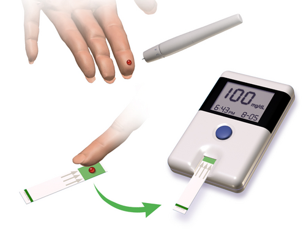
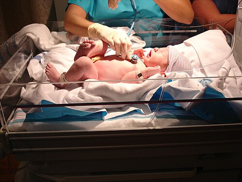

# DISTÚRBIOS METABÓLICOS DO RN

Para entender os distúrbios metabólicos no período neonatal, você precisa primeiro visualizar a "tempestade" que é o nascimento. No útero, o feto vive em um estado de suprimento contínuo. A glicose atravessa a placenta por difusão facilitada, mantendo níveis fetais em cerca de 70% a 80% dos níveis maternos. O cálcio é transportado ativamente, garantindo que o feto tenha ossos bem mineralizados, mesmo que a mãe esteja carente.

Ao clampar o cordão, esse "delivery" acaba. O recém-nascido (RN) precisa, subitamente, ativar suas próprias vias metabólicas: glicogenólise, gliconeogênese e lipólise. Se essa transição falha, surgem os distúrbios que tanto caem em prova. Vamos dissecar cada um deles com o olhar de quem prepara a questão para você.

*Figura 1 - Teste de glicemia capilar para monitoramento neonatal. Fonte: BruceBlaus, CC BY 3.0 | Wikimedia Commons*

## Hipoglicemia Neonatal: O Vilão Mais Comum

A hipoglicemia é, sem dúvida, o tema de neonatologia mais cobrado em provas de residência. Por que? Porque ela é frequente, muitas vezes assintomática e pode deixar sequelas neurológicas permanentes se não for tratada.

*Figura 2 - Avaliação clínica de recém-nascido na sala de parto. Fonte: CC BY 2.0 | Wikimedia Commons*

### Fisiopatologia e Grupos de Risco

A glicemia do RN cai fisiologicamente nas primeiras 1 a 2 horas de vida, atingindo um nadir, e depois começa a subir conforme o bebê mobiliza estoques. O problema ocorre quando o consumo supera a produção ou quando não há estoque.

Existem três grupos principais que você deve memorizar para a prova:

- O RN de Mãe Diabética (RNMD) e o Grande para a Idade Gestacional (GIG): Aqui o problema é o hiperinsulinismo fetal. A mãe tem muita glicose, que passa para o feto. O pâncreas do feto produz muita insulina para dar conta. Ao nascer, a glicose para de vir, mas a insulina continua alta por um tempo, "sequestrando" a glicose do sangue para dentro das células.

- O Pequeno para a Idade Gestacional (PIG) e o Prematuro: Estes bebês simplesmente não tiveram tempo ou substrato para guardar glicogênio hepático e gordura. Eles não têm "reserva" para queimar durante a transição.

- O RN em Estresse (Asfixia, Sepse, Hipotermia): O estresse aumenta o consumo metabólico de glicose de forma absurda. O bebê gasta mais do que consegue produzir.

### Definição e Valores de Corte

Cuidado aqui. A definição de hipoglicemia neonatal é um dos pontos mais polêmicos da pediatria. Para fins de prova, baseamos as condutas nas recomendações da Sociedade Brasileira de Pediatria (SBP) e da Academia Americana de Pediatria (AAP).

Consideramos hipoglicemia, de forma geral, valores de glicemia plasmática abaixo de 40 a 45 mg/dL. No entanto, a conduta depende do tempo de vida e da presença de sintomas.

### Quadro Clínico: O que observar?

A maioria dos casos é assintomática, o que justifica o rastreio em grupos de risco. Quando há sintomas, eles são inespecíficos. Se a questão descreve um RN com tremores, irritabilidade, letargia, hipotonia, sucção débil ou crises de apneia, sua primeira conduta deve ser checar a glicemia.

Erro clássico de prova: achar que febre é sinal de hipoglicemia. Não é. A hipoglicemia costuma cursar com instabilidade térmica ou hipotermia.

### Manejo da Hipoglicemia

Aqui é onde as bancas fazem a festa. Você precisa saber o fluxograma de cor.

**1. RN Assintomático com Fatores de Risco:**
O rastreio deve ser feito com 30 a 60 minutos de vida.

- Se a glicemia estiver entre 25 e 40 mg/dL: A conduta inicial é oferecer alimentação (leite materno ou fórmula) e reavaliar em 30 a 60 minutos.

- Se o RN for PIG e estiver assintomático com glicemia ≥ 45 mg/dL: Apenas reforce o aleitamento e continue monitorando.

- O uso de gel de dextrose oral a 40% tem sido cada vez mais citado em questões como uma alternativa eficaz para evitar a separação da mãe e o uso de fórmulas em casos de hipoglicemia leve e assintomática.

**2. RN Sintomático ou com Glicemia Muito Baixa:**

- Se o RN apresentar sintomas neurológicos (convulsão, letargia grave) ou se a glicemia for < 25 mg/dL nas primeiras 4 horas de vida: A conduta é Glicose Intravenosa imediata.

- O bôlus inicial é de 2 mL/kg de Glicose a 10% (o famoso "mini-bôlus" de 200 mg/kg).

- Após o bôlus, você DEVE iniciar uma infusão contínua, calculando a Taxa de Infusão de Glicose (TIG).

### Cálculo da TIG (Taxa de Infusão de Glicose)

Você não pode ir para a prova sem saber calcular a TIG. A TIG normal de um RN a termo é de 4 a 6 mg/kg/min. Prematuros podem precisar de 6 a 8 mg/kg/min.

A fórmula que o Dr. Will sempre recomenda para facilitar a vida no plantão e na prova é:
TIG = (Volume em mL/kg/dia x Concentração da Glicose) / 144

Ou, de forma mais detalhada para entender o porquê:
TIG (mg/kg/min) = [Volume (mL) x Concentração (%) x 10] / [Peso (kg) x 1440 (minutos do dia)]

Se o bebê mantém hipoglicemia mesmo com TIG de 12 mg/kg/min, estamos diante de uma hipoglicemia persistente ou refratária, e precisamos investigar causas hiperinsulinêmicas ou defeitos enzimáticos.

| Cenário Clínico | Conduta Inicial |
| --- | --- |
| RN Assintomático, Glicemia 25-40 mg/dL | Alimentação (LM ou fórmula) + Reavaliar em 30-60 min |
| RN Sintomático (qualquer valor) | Bôlus de Glicose 10% (2 mL/kg) + TIG de manutenção |
| RN Assintomático, Glicemia < 25 mg/dL | Glicose IV imediata |
| RNMD, Glicemia 50 mg/dL, Assintomático | Manter aleitamento e controle glicêmico de rotina |

## Hipocalcemia Neonatal: Quando o Tremor não é Glicose

Imagine a cena: você corrigiu a glicemia do RN de mãe diabética, o dextro agora está 60 mg/dL, mas o bebê continua com tremores e irritabilidade. O que você pensa? Hipocalcemia.

O cálcio sérico total abaixo de 7 a 8 mg/dL em RN a termo (ou cálcio iônico < 4,4 mg/dL) define o quadro.

### Classificação e Causas

Dividimos a hipocalcemia em precoce e tardia, e essa distinção é fundamental para o diagnóstico diferencial.

**1. Hipocalcemia Precoce (primeiras 72 horas):**
É a mais comum em provas. Está relacionada à falha na adaptação neonatal.

- Principais causas: Asfixia perinatal grave (causa mais comum citada em questões), RN de mãe diabética (o magnésio baixo da mãe diabética causa hipomagnesemia no feto, que inibe o paratormônio), prematuridade e sepse.

- Por que a asfixia causa isso? O sofrimento celular libera fosfato intracelular, que se liga ao cálcio, além de haver um atraso na resposta do paratormônio (PTH).

**2. Hipocalcemia Tardia (após 72 horas):**
Geralmente relacionada a fatores exógenos ou patologias específicas.

- Causa clássica: Ingestão de leite de vaca (rico em fosfato). O excesso de fosfato causa hipocalcemia por quelação e inibição da ativação da Vitamina D.

- Outras causas: Hipoparatireoidismo (Síndrome de DiGeorge - procure por cardiopatia congênita e fácies típica na questão) e deficiência de Vitamina D.

### Tratamento da Hipocalcemia

Se o RN está sintomático (convulsões, tremores, prolongamento do intervalo QT no ECG), usamos o Gluconato de Cálcio a 10%.

- Dose: 1 a 2 mL/kg (100-200 mg/kg) via intravenosa.

- Cuidado: A infusão deve ser LENTA e sob monitorização cardíaca, pois o cálcio pode causar bradicardia e arritmias. Se houver extravasamento na veia, pode causar necrose tecidual grave.

## Hiperplasia Adrenal Congênita (HAC): A Emergência Metabólica

A HAC é um tema "quente" porque envolve genética, endocrinologia e emergência pediátrica. A forma mais comum (90-95% dos casos) é a deficiência da enzima 21-hidroxilase.

### Fisiopatologia: O Bloqueio Enzimático

Para entender a HAC, pense em uma fábrica com três linhas de produção: Mineralocorticoides (Aldosterona), Glicocorticoides (Cortisol) e Andrógenos (Testosterona).
Na deficiência de 21-hidroxilase, as duas primeiras linhas estão bloqueadas. O "estoque" de matéria-prima (17-OH Progesterona) acumula e é todo desviado para a terceira linha: a dos andrógenos.

Resultado:

- Falta Aldosterona: O corpo perde sal (sódio) e retém potássio.

- Falta Cortisol: O corpo não responde ao estresse e faz hipoglicemia.

- Excesso de Andrógenos: Virilização da genitália em fetos femininos.

### Quadro Clínico e a "Pegadinha" do Sexo

- Meninas: Geralmente diagnosticadas ao nascimento devido à genitália ambígua (clitoromegalia, fusão labioscrotal). É a causa mais comum de genitália ambígua com gônadas não palpáveis.

- Meninos: Aqui mora o perigo. A genitália é normal (pode haver apenas uma leve hiperpigmentação escrotal). Eles costumam chegar ao pronto-socorro entre o 7º e o 14º dia de vida em crise adrenal grave.

A tríade clássica da Crise Adrenal (forma perdedora de sal) que você verá na prova:

- Hiponatremia grave.

- Hipercalemia.

- Acidose metabólica (e muitas vezes hipoglicemia).

Se a questão descreve um lactente de 10-14 dias com vômitos, desidratação grave que não melhora com soro comum, prostração e esses eletrólitos alterados, não pense em estenose hipertrófica do piloro (que faz alcalose e hipocalemia), pense em HAC!

### Diagnóstico e Manejo

O diagnóstico é sugerido pela triagem neonatal (Teste do Pezinho), que mede a 17-OH Progesterona. Se alterado, confirmamos com eletrólitos e dosagem sérica dos hormônios.

Tratamento da Crise Adrenal:

- Reposição volêmica vigorosa com Soro Fisiológico 0,9%.

- Hidrocortisona IV (dose de ataque para repor o glicocorticoide).

- Reposição de mineralocorticoide (Fludrocortisona) assim que o paciente tolerar via oral.

## Distúrbios do Magnésio e Fósforo

Embora menos frequentes como tema principal, eles aparecem como diagnósticos diferenciais de tremores e convulsões.

- Hipomagnesemia: Frequentemente associada à hipocalcemia (especialmente em filhos de mães diabéticas). Se você trata o cálcio e o bebê não melhora, dose o magnésio. O tratamento é feito com Sulfato de Magnésio.

- Hipercalcemia: Rara no RN. Pode ocorrer em prematuros em nutrição parenteral prolongada ou por iatrogenia. Os sintomas incluem hipotonia, poliúria e letargia.

## Erros Inatos do Metabolismo (EIM): Quando Suspeitar?

As bancas adoram colocar um caso de EIM disfarçado de sepse neonatal. Como diferenciar?

O cenário típico de EIM é: um RN que nasceu bem, a termo, com bom peso, começou a mamar e, após 24-48 horas, apresenta uma deterioração súbita.

- Sinais de alerta: Vômitos persistentes, odor peculiar na urina (ex: cheiro de xarope de bordo ou pé chulé), recusa alimentar, convulsões que não respondem a anticonvulsivantes comuns e um hiato aniônico (anion gap) elevado.

Se a questão mencionar hiperamonemia grave sem acidose, pense em defeitos do ciclo da ureia. Se houver acidose metabólica importante, pense em acidemias orgânicas.

## Doença Hemorrágica do Recém-Nascido (DHRN)

Embora seja um distúrbio da coagulação, a DHRN é frequentemente agrupada nos distúrbios metabólicos/nutricionais por envolver a Vitamina K.

A Vitamina K é essencial para a síntese dos fatores II, VII, IX e X no fígado. O RN nasce com baixos estoques porque a vitamina K atravessa mal a placenta e o intestino neonatal é estéril (não há bactérias para sintetizá-la).

A forma clássica ocorre entre o 2º e 7º dia de vida. A forma tardia (2 semanas a 6 meses) é a mais perigosa, podendo causar hemorragia intracraniana.

- Fator de risco clássico em provas: Parto domiciliar sem profilaxia e aleitamento materno exclusivo (o leite materno é pobre em Vitamina K).

Prevenção: Administração de 1 mg de Vitamina K intramuscular ao nascimento para todos os RNs.

## Convulsão Neonatal: A Primeira Linha de Defesa

A convulsão no período neonatal é uma emergência médica. Diferente do adulto, o RN raramente faz crises tônico-clônicas generalizadas. As crises mais comuns são as "sutis" (movimentos de pedalar, desvios oculares, movimentos de sucção).

Sempre que um RN convulsionar, a sequência de pensamento deve ser:

- Estabilização (ABC).

- Descartar distúrbios metabólicos tratáveis (Glicose e Cálcio).

- Se os eletrólitos estão normais ou a crise persiste: Fenobarbital é a droga de primeira escolha (dose de ataque 20 mg/kg).

Cuidado: O diazepam deve ser evitado no RN devido ao risco de depressão respiratória grave e por competir com a bilirrubina pela albumina, aumentando o risco de kernicterus.

## Adaptação Metabólica e Perda de Peso

É normal o RN perder peso nos primeiros dias de vida. Isso não é necessariamente um distúrbio, mas a perda excessiva pode levar a distúrbios hidroeletrolíticos como a hipernatremia por desidratação.

- Perda fisiológica: Até 10% do peso de nascimento em RN a termo (até 15% em prematuros).

- Recuperação do peso: Esperada até o 10º-14º dia de vida.

Se um RN com 5 dias de vida perdeu 15% do peso e está prostrado, a causa provável é erro na técnica de amamentação levando a uma desidratação hipernatrêmica. O tratamento deve ser feito com reposição lenta para evitar edema cerebral.

## Tabelas Comparativas para Revisão Rápida

Abaixo, consolidei as informações que as bancas mais gostam de comparar. Use estas tabelas para revisões de véspera.

### Tabela 1: Diagnóstico Diferencial de Tremores no RN

| Causa | Pistas Clínicas | Conduta |
| --- | --- | --- |
| Hipoglicemia | RNMD, PIG, estresse, letargia associada | Glicose IV ou alimentação |
| Hipocalcemia | Asfixia, RNMD, QT longo no ECG | Gluconato de Cálcio 10% |
| Hipomagnesemia | Associada à hipocalcemia refratária | Sulfato de Magnésio |
| Síndrome de Abstinência | Mãe usuária de drogas, choro agudo, diarreia | Suporte e, se grave, morfina/fenobarbital |
| Tremores Fisiológicos | Ocorrem apenas sob estímulo, param ao segurar o membro | Observação |

### Tabela 2: Distúrbios Eletrolíticos na Crise Adrenal (HAC)

| Eletrólito/Parâmetro | Alteração na HAC | Por que ocorre? |
| --- | --- | --- |
| Sódio (Na+) | Hiponatremia | Falta de Aldosterona (perda renal de Na) |
| Potássio (K+) | Hipercalemia | Falta de Aldosterona (retenção de K) |
| Glicose | Hipoglicemia | Deficiência de Cortisol |
| pH Sanguíneo | Acidose Metabólica | Perda de bicarbonato e retenção de H+ |

### Tabela 3: Metas de Glicemia e Intervenção (SBP/AAP)

| Grupo | Valor de Glicemia | Conduta |
| --- | --- | --- |
| < 4h de vida, Sintomático | < 40 mg/dL | Glicose IV (bôlus + TIG) |
| < 4h de vida, Assintomático | < 25 mg/dL | Glicose IV ou Alimentação (individualizar) |
| 4h a 24h de vida, Assintomático | < 35 mg/dL | Alimentar e reavaliar em 1h |
| Após 24h de vida | < 45 mg/dL | Investigar e tratar conforme sintomas |

## Pontos-Chave para Prova 🚀

- O valor de corte para hipoglicemia neonatal em RNs de risco nas primeiras 24h é geralmente < 40-45 mg/dL, mas a conduta depende da presença de sintomas.

- RN de mãe diabética tem risco aumentado de hipoglicemia (hiperinsulinismo) e hipocalcemia (hipomagnesemia materna).

- Se a glicemia foi corrigida e os tremores persistem, a próxima suspeita é hipocalcemia.

- A asfixia perinatal é a principal causa de hipocalcemia precoce.

- A tríade da Crise Adrenal por HAC é: Hiponatremia + Hipercalemia + Acidose Metabólica.

- Meninas com HAC apresentam genitália ambígua; meninos podem ter genitália normal e chocar na segunda semana de vida.

- O tratamento da convulsão neonatal de primeira linha é o Fenobarbital (20 mg/kg).

- O bôlus de glicose para correção de hipoglicemia é de 2 mL/kg de Glicose a 10%. Nunca use concentrações maiores (como 25% ou 50%) em bôlus venoso periférico no RN.

- A TIG basal para um RN a termo é de 4 a 6 mg/kg/min.

- A deficiência de Vitamina K causa sangramentos; a profilaxia com 1 mg IM ao nascer é obrigatória.

- Perda de peso acima de 10% nos primeiros dias exige avaliação rigorosa da amamentação.

- Erros Inatos do Metabolismo devem ser suspeitados em RNs que "estavam bem e pioraram subitamente" após início da dieta.

- Contraindicação absoluta para o uso de Diazepam no RN: risco de kernicterus e depressão respiratória.

- A Síndrome de DiGeorge deve ser lembrada em casos de hipocalcemia tardia associada a sopros cardíacos.

- O mel é contraindicado para menores de 1 ano pelo risco de botulismo, que pode mimetizar distúrbios metabólicos (hipotonia).

- Na desidratação grave com acidose, a expansão rápida com SF 0,9% (20 mL/kg) é a prioridade antes de qualquer outra medida.

- O diagnóstico de HAC no teste do pezinho é feito pela dosagem da 17-OH Progesterona.

Lembre-se do que sempre discutimos no MedEvo: em neonatologia, o tempo é cérebro. Identificar um distúrbio metabólico rapidamente e entender a fisiopatologia por trás dele não apenas garante sua vaga na residência, mas salva a vida e o futuro neurológico do seu paciente.

 Cópia offline para consulta pessoal.
 Fonte original:
 [https://www.medevo.com.br/material-apoio/ler/a65bc473-11ca-44a5-98f4-341172e60f4e](https://www.medevo.com.br/material-apoio/ler/a65bc473-11ca-44a5-98f4-341172e60f4e)
