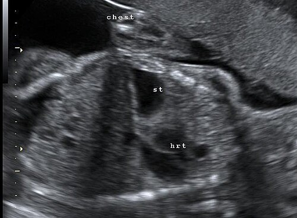

# DISTÚRBIOS RESPIRATÓRIOS NEONATAIS AVANÇADOS

Para dominar os distúrbios respiratórios avançados em neonatologia, você precisa primeiro mudar sua mentalidade de "decorador de doenças" para "fisiopatologista clínico". Na prova de residência, as questões não vão apenas perguntar o nome da doença, elas vão te dar um cenário de sala de parto ou de UTI Neonatal e exigir uma decisão imediata.

Muitos alunos confundem as patologias básicas (como a Taquipneia Transitória ou a Doença da Membrana Hialina) com as malformações e distúrbios circulatórios. O segredo aqui é olhar para o abdome, para a cronologia da cianose e para a resposta ao oxigênio.

*Figura 1 - Ultrassom obstétrico mostrando hérnia diafragmática congênita: estômago e coração ambos dentro do tórax. Fonte: Dr Laughlin Dawes, CC BY 3.0 | Wikimedia Commons*

## Hérnia Diafragmática Congênita (HDC)

A HDC é a "queridinha" das bancas quando o assunto é emergência cirúrgica neonatal. O defeito ocorre pela falha no fechamento dos canais pleuroperitoneais por volta da 8ª a 10ª semana de gestação.

### Fisiopatologia e o "Porquê" da Gravidade

Por que a HDC mata? Não é apenas porque o intestino está no tórax. O problema real é a hipoplasia pulmonar secundária. Como as vísceras ocupam o espaço torácico durante o desenvolvimento fetal, o pulmão (principalmente o ipsilateral) não se desenvolve. Há menos gerações de brônquios e, crucialmente, uma vasculatura pulmonar hipoplásica e hiper-reativa. Isso explica por que esses bebês evoluem quase invariavelmente com Hipertensão Pulmonar Persistente (HPPN).

*Figura 2 - TC sagital do tórax mostrando hérnia de Morgagni (seta vermelha) contendo gordura abdominal. Fonte: JasonRobertYoungMD, CC BY-SA 4.0 | Wikimedia Commons*

### Quadro Clínico e Diagnóstico

O cenário clássico de prova é: RN nasce com desconforto respiratório grave imediato, cianose e, a dica de ouro, abdome escavado (ou escafoide). Como as alças intestinais subiram para o tórax, a barriga fica "vazia".

Ao exame físico, você notará:

- Desvio das bulhas cardíacas para o lado contralateral (geralmente para a direita, pois 80 a 85% das hérnias são à esquerda, conhecidas como Hérnia de Bochdalek).

- Murmúrio vesicular abolido ou muito diminuído no lado afetado.

- Ruídos hidroaéreos audíveis no tórax (embora nem sempre presentes logo ao nascer).

### Manejo: O Erro que Reprova

Aqui está o ponto onde muitos candidatos perdem a questão e, na vida real, colocam o paciente em risco. **Nunca, em hipótese alguma, faça Ventilação com Pressão Positiva (VPP) com bolsa e máscara em um paciente com suspeita de HDC.**

Por que? Porque ao usar a máscara, você empurra ar tanto para os pulmões quanto para o esôfago/estômago. O ar vai insuflar as alças intestinais que já estão dentro do tórax, comprimindo ainda mais o pouco pulmão que o bebê tem e desviando o mediastino.

A conduta imediata é:

- Intubação Orotraqueal (IOT) imediata.

- Passagem de Sonda Oro gástrica (SOG) calibrosa em aspiração contínua para descompressão do trato gastrointestinal.

- Estabilização hemodinâmica e ventilatória antes da cirurgia. A cirurgia NÃO é uma emergência de primeira hora; a estabilização fisiológica é a prioridade.

## Hipertensão Pulmonar Persistente do Recém-Nascido (HPPN)

A HPPN, ou Circulação Fetal Persistente, ocorre quando a resistência vascular pulmonar (RVP) permanece elevada após o nascimento, impedindo a transição normal para a circulação neonatal.

### Mecanismo e Fatores de Risco

Normalmente, ao respirar pela primeira vez, o O2 causa vasodilatação pulmonar e a RVP cai. Na HPPN, isso falha. O sangue, encontrando alta resistência nos pulmões, prefere passar pelos shunts fetais (forame oval e ducto arterioso) da direita para a esquerda. Resultado: hipoxemia grave e refratária.

As bancas associam a HPPN a:

- Síndrome de Aspiração de Mecônio (SAM).

- Sepse neonatal e Pneumonia.

- Asfixia perinatal.

- Hérnia Diafragmática Congênita.

- Uso materno de ISRS (Inibidores Seletivos da Recaptação de Serotonina) ou anti-inflamatórios no 3º trimestre.

### O Teste do Gradiente Pré e Pós-Ductal

Este é um conceito que o Dr. Will sempre reforça: para diagnosticar o shunt pelo canal arterial, comparamos a saturação ou a PaO2 no membro superior direito (pré-ductal) com os membros inferiores (pós-ductal).

Um gradiente de PaO2 > 10-20 mmHg ou uma diferença de saturação de O2 > 5-10% entre a mão direita e o pé confirma a presença de shunt direita-esquerda pelo ducto arterioso, sugerindo fortemente HPPN.

### Tratamento Avançado

O objetivo é reduzir a RVP.

- **Oxigênio:** É um potente vasodilatador pulmonar, mas deve ser usado com cautela para evitar lesão oxidativa.

- **Óxido Nítrico Inalatório (NOi):** É o padrão-ouro. É um vasodilatador pulmonar seletivo (age apenas onde chega o gás, melhorando a relação ventilação/perfusão).

- **Inotrópicos:** Para manter a pressão sistêmica acima da pressão pulmonar e tentar reverter o shunt.

- **ECMO (Oxigenação por Membrana Extracorpórea):** Em casos de falha total do tratamento clínico.

| Parâmetro | Pré-ductal (Mão Direita) | Pós-ductal (Membros Inferiores) | Interpretação |
| --- | --- | --- | --- |
| Saturação de O2 | 95% | 82% | Diferença > 10% = Shunt D-E (HPPN ou Cardiopatia) |
| PaO2 (mmHg) | 80 | 55 | Diferença > 20 mmHg = Shunt D-E significativo |

## Malformações de Vias Aéreas Superiores: Atresia de Coana

Se a questão descreve um RN que fica cianótico enquanto dorme ou mama, mas que "fica rosinha" e melhora quando chora, você está diante de uma Atresia de Coana.

### Por que a cianose é cíclica?

O recém-nascido é um respirador nasal preferencial. Se as coanas (passagem posterior do nariz para a faringe) estão obstruídas, ele não consegue respirar de boca fechada. Ao chorar, ele abre a boca e o ar entra, resolvendo a hipóxia temporariamente. Ao tentar mamar ou relaxar, a boca fecha e a cianose volta.

### Diagnóstico e Conduta

O diagnóstico clínico imediato é feito pela incapacidade de progredir uma sonda de aspiração (nº 6 ou 8) através das narinas até a orofaringe. O diagnóstico de confirmação é por Tomografia Computadorizada de face.

A conduta de emergência é manter a via aérea pérvia, muitas vezes utilizando uma cânula de Guedel ou o bico de uma mamadeira cortado (dispositivo de McGovern) para forçar a respiração oral até a correção cirúrgica.

## Atresia de Esôfago e Fístula Traqueoesofágica (FTE)

Aqui o problema não é apenas respiratório, mas as complicações pulmonares são o que mata o paciente. A forma mais comum (85% dos casos) é a Atresia de Esôfago com Fístula Traqueoesofágica Distal (Tipo C).

### Sinais de Alerta

- **História Materna:** Polidrâmnio (o feto não deglute o líquido amniótico).

- **Sialorreia excessiva:** O bebê "espuma" pela boca porque não consegue engolir a própria saliva.

- **Engasgos e Cianose:** Tentou mamar? Vai tossir, engasgar e sufocar.

### Diagnóstico Diferencial e Radiológico

Ao tentar passar uma sonda orogástrica, ela encontra resistência e "enrola" na bolsa esofágica superior.
No Raio-X:

- Se houver ar no estômago/intestino: Existe uma fístula distal (o ar da traqueia passa para o esôfago inferior).

- Se o abdome estiver "mudo" (sem gás): É uma atresia pura, sem fístula distal.

**Cuidado:** Muitos alunos acham que a fístula é sempre entre a parte de cima do esôfago e a traqueia. Na verdade, a fístula distal é a mais perigosa para o pulmão, pois o suco gástrico sobe do estômago para a árvore brônquica, causando pneumonia química grave.

## Síndrome de Aspiração de Mecônio (SAM)

A SAM é uma doença do RN a termo ou pós-termo. O mecônio é liberado no líquido amniótico devido ao estresse hipóxico intrauterino, que estimula o peristaltismo e o relaxamento do esfíncter anal fetal.

### Fisiopatologia em "Três Frentes"

- **Obstrução Mecânica:** O mecônio espesso obstrui as vias aéreas. Se a obstrução for total, gera atelectasia. Se for parcial, cria um mecanismo de "válvula", onde o ar entra mas não sai, levando ao aprisionamento aéreo e risco altíssimo de pneumotórax.

- **Pneumonite Química:** O mecônio é irritante e causa uma resposta inflamatória intensa.

- **Inativação do Surfactante:** Os ácidos graxos do mecônio "lavam" o surfactante natural, colapsando os alvéolos.

### Imagem Radiológica

O RX de tórax na SAM é clássico: infiltrado grosseiro, difuso e heterogêneo ("em remendos" ou "algodonoso"), alternando áreas de atelectasia com áreas de hiperinsuflação. O diafragma costuma estar retificado pelo aprisionamento de ar.

### Manejo Atualizado (Diretriz SBP)

Antigamente, aspirava-se a traqueia de todo bebê com mecônio. **Isso mudou.**

- Se o RN está vigoroso (bom tônus, choro forte): Apenas cuidados de rotina.

- Se o RN não está vigoroso: Inicia-se a reanimação padrão (VPP se necessário). A aspiração traqueal só é indicada se houver obstrução evidente das vias aéreas que impeça a ventilação. Não se deve atrasar a VPP para aspirar mecônio.

## Diagnóstico Diferencial de Cianose: O Teste de Hiperóxia

Este é um divisor de águas em provas. O RN está cianótico. É pulmão ou é coração?

Você oferece O2 a 100% por 10 minutos e colhe uma gasometria arterial (preferencialmente pré-ductal).

- **Causa Respiratória:** A PaO2 costuma subir significativamente (> 150-200 mmHg). O oxigênio consegue vencer a barreira da membrana alvéolo-capilar doente.

- **Causa Cardíaca (Cardiopatia Cianótica):** A PaO2 raramente ultrapassa 100 mmHg (muitas vezes fica abaixo de 50-60 mmHg). Como o sangue está sendo desviado mecanicamente (shunt anatômico), dar O2 para o pulmão não resolve o problema do sangue que nem passa por lá.

### Cardiopatias Ducto-Dependentes

Se você suspeita de uma cardiopatia onde o fluxo pulmonar ou sistêmico depende do canal arterial (ex: Transposição de Grandes Artérias, Atresia Pulmonar, Coartação de Aorta Crítica), a conduta imediata é manter o canal aberto.

- **Droga de escolha:** Prostaglandina E1 (Alprostadil) em infusão contínua.

- **Efeito colateral importante para prova:** Apneia. Esteja pronto para intubar o paciente após iniciar a Prostaglandina.

## Apneia da Prematuridade

Definição clássica: Pausa respiratória > 20 segundos OU pausa de qualquer duração se acompanhada de bradicardia (FC < 100) ou cianose/dessaturação.

### Classificação

- **Central (mais comum):** O cérebro "esquece" de respirar. Não há esforço respiratório.

- **Obstrutiva:** Há esforço, mas a via aérea superior colapsa (comum em flexão excessiva do pescoço).

- **Mista:** Começa central e termina obstrutiva.

### Tratamento

Para a apneia idiopática da prematuridade (em RN < 34 semanas), a primeira escolha é o uso de Metilxantinas, especificamente a **Citrato de Cafeína**.

- Dose de ataque: 20 mg/kg.

- Dose de manutenção: 5 a 10 mg/kg/dia.
A cafeína estimula o centro respiratório bulbar e aumenta a sensibilidade ao CO2.

**Dica MedEvo:** Se um RN a termo ou um prematuro que estava bem começa a ter apneia súbita, não chame de "apneia da prematuridade". Investigue causas secundárias: Sepse (causa nº 1), distúrbios metabólicos (hipoglicemia, hipocalcemia), hemorragia intracraniana ou convulsões.

## Outras Malformações Pulmonares

### Enfisema Lobar Congênito

Ocorre uma hiperinsuflação progressiva de um lobo pulmonar (geralmente o superior esquerdo). O lobo afetado funciona como uma "válvula", o ar entra e fica preso.

- **RX:** Área de hipertransparência com trama vascular presente (diferente do pneumotórax, onde não há trama) e desvio do mediastino para o lado oposto.

- **Tratamento:** Lobectomia do lobo afetado se houver compressão grave.

### Malformação Adenomatoide Cística (MAC)

Substituição do parênquima pulmonar por cistos de diversos tamanhos.

- **RX:** Imagem de "bolhas" ou "cistos" no tórax. Pode ser confundida com Hérnia Diafragmática, mas na MAC a bolha gástrica está no abdome, e na HDC o abdome está escavado e sem gases.

## Emergências Pleurais: Pneumotórax

O pneumotórax neonatal é uma emergência que exige rapidez. Pode ser espontâneo (comum em RN a termo por altos gradientes de pressão nas primeiras respirações) ou secundário (VPP, SAM, Membrana Hialina).

### Sinais de Pneumotórax Hipertensivo

- Piora súbita do desconforto respiratório.

- Queda da saturação e bradicardia.

- Abaulamento do hemitórax afetado com redução da expansibilidade.

- Ictus cordis desviado.

### Conduta

- **Transiluminação Torácica:** Um teste rápido à beira leito. Se o tórax "brilhar" (hipertransparência), confirma o ar livre.

- **Punção de Alívio:** Imediata, no 2º espaço intercostal, linha hemiclavicular.

- **Drenagem Torácica:** Em selo d'água, após a estabilização inicial.

## Tabelas Comparativas para Revisão Rápida

### Tabela 1: Diagnóstico Diferencial das Principais Patologias

| Patologia | Perfil do RN | Achado Clínico Chave | Raio-X de Tórax |
| --- | --- | --- | --- |
| **HDC** | Termo/Pretermo | Abdome escavado, bulhas desviadas | Alças intestinais no tórax |
| **SAM** | Termo/Pós-termo | Líquido meconiado, asfixia | Infiltrado grosseiro, "remendos" |
| **HPPN** | Termo | Cianose refratária, gradiente pré/pós | Pode ser normal ou pulmão "preto" |
| **Atresia Coana** | Termo | Cianose que melhora ao chorar | Normal (diagnóstico é clínico/CT) |
| **Atresia Esôfago** | Termo | Sialorreia, engasgo na mamada | Sonda enrolada no coto superior |
| **Pneumotórax** | Qualquer | Piora súbita, desvio de ictus | Hipertransparência sem trama |

### Tabela 2: Metas e Valores de Referência em Neonatologia Avançada

| Parâmetro | Valor Alvo / Referência | Observação |
| --- | --- | --- |
| **Saturação Alvo (Pré-ductal)** | 90% - 95% | Evitar hiperóxia (risco de retinopatia/lesão pulmonar) |
| **PaO2 no Teste de Hiperóxia** | > 150 mmHg | Sugere causa pulmonar |
| **PaO2 no Teste de Hiperóxia** | < 100 mmHg | Sugere causa cardíaca cianótica |
| **Dose Cafeína (Ataque)** | 20 mg/kg | Citrato de cafeína (EV ou VO) |
| **Frequência Respiratória** | 40 - 60 irpm | > 60 define taquipneia |

## Pontos-Chave para Prova

- **Hérnia Diafragmática:** A primeira conduta é IOT + Sonda Gástrica. NUNCA use bolsa-máscara. O abdome escavado é a dica patognomônica.

- **Atresia de Coana:** Suspeite sempre que a cianose melhorar com o choro e piorar com a alimentação. O diagnóstico é a falha na passagem da sonda nasal.

- **HPPN:** O diagnóstico é sugerido pelo gradiente de saturação pré e pós-ductal > 10%. O tratamento de escolha para a vasculatura é o Óxido Nítrico Inalatório.

- **Teste de Hiperóxia:** Se a PaO2 não subir após O2 a 100%, pense em Cardiopatia Congênita. Inicie Prostaglandina E1 se houver suspeita de ducto-dependência.

- **Atresia de Esôfago:** Polidrâmnio na gestação + sialorreia no RN = Atresia de Esôfago até que se prove o contrário.

- **SAM:** O risco de pneumotórax é altíssimo devido ao mecanismo de válvula. O RX mostra o pulmão "sujo" e hiperinsuflado.

- **Apneia da Prematuridade:** É um diagnóstico de exclusão. Antes de culpar a imaturidade, descarte sepse e hipoglicemia.

- **Pneumotórax:** Em caso de colapso agudo em RN sob ventilação, a transiluminação torácica é o exame mais rápido, e a punção de alívio é a conduta que salva vidas.

- **Coqueluche (Bordetella pertussis):** Em lactentes jovens, manifesta-se com acessos de tosse seguidos de apneia e linfocitose importante.

- **Líquido Meconiado:** Se o bebê nascer deprimido, inicie a reanimação convencional. A aspiração traqueal não é mais rotina obrigatória.

- **Enfisema Lobar Congênito:** Diferencie do pneumotórax pela presença de trama vascular na área hipertransparente do RX.

- **Prostaglandina E1:** Lembrar que o principal efeito colateral é a apneia, exigindo vigilância respiratória rigorosa.

- **Fator de Risco para TTRN:** Cesariana eletiva sem trabalho de parto (falta do "squeeze" torácico e dos estímulos hormonais para reabsorção do líquido pulmonar). 💡

Lembre-se: em neonatologia, o tempo é neurônio. Identificar precocemente se o problema é mecânico (hérnia, atresia), circulatório (HPPN, cardiopatia) ou parenquimatoso (SAM, membrana hialina) define o sucesso do seu tratamento e da sua questão de prova. No MedEvo, focamos nessa clareza diagnóstica para que você não hesite na hora da decisão.

 Cópia offline para consulta pessoal.
 Fonte original:
 [https://www.medevo.com.br/material-apoio/ler/e03e411f-e44e-4259-a633-63fdac6bc1b2](https://www.medevo.com.br/material-apoio/ler/e03e411f-e44e-4259-a633-63fdac6bc1b2)
