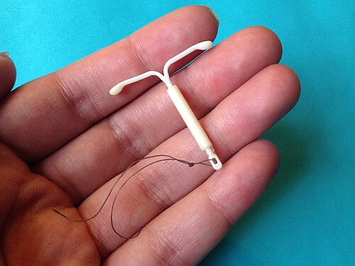

# DIU E MÉTODOS DE LONGA DURAÇÃO

Os métodos contraceptivos reversíveis de longa duração, conhecidos pela sigla LARC (Long-Acting Reversible Contraception), representam o padrão-ouro na prática clínica moderna e são os queridinhos das bancas de residência médica. Por que? Porque eles resolvem o maior problema da contracepção: a falha humana.

Quando falamos em eficácia, precisamos diferenciar o "uso perfeito" (aquele do laboratório) do "uso típico" (o da vida real, onde a paciente esquece a pílula ou fura o preservativo). Nos LARCs, essa diferença praticamente não existe. O índice de Pearl, que mede o número de gestações em 100 mulheres usando o método por um ano, é baixíssimo para esses dispositivos.

*Figura 1 - Dispositivo intrauterino (DIU) posicionado no útero. Fonte: BruceBlaus, CC BY 3.0 | Wikimedia Commons*

## Mecanismos de Ação: O "Porquê" da Eficácia

Para entender as indicações e contraindicações, você precisa entender como cada método funciona. Não decore, entenda a fisiopatologia uterina.

### DIU de Cobre (TCu 380A)

O DIU de cobre não é anovulatório. A paciente continua ovulando normalmente. O que ele faz é criar uma reação inflamatória estéril no endométrio.

Imagine o útero como um terreno. O cobre libera íons que atraem leucócitos e macrófagos, tornando o ambiente hostil. Essa inflamação produz enzimas proteolíticas e citocinas que são espermicidas. Se algum espermatozoide heroico conseguir passar, a inflamação também impede a nidação.

**Dica de Prova:** O DIU de cobre induz uma inflamação estéril local, aumentando células fagocíticas. Isso é o que as bancas chamam de "ambiente uterino hostil à fertilização".

*Figura 2 - Sistema intrauterino liberador de levonorgestrel (Mirena) - exemplo de LARC. Fonte: Sarahmirk, CC BY-SA 4.0 | Wikimedia Commons*

### SIU-Levonorgestrel (Mirena e Kyleena)

Aqui temos um sistema intrauterino (SIU) que libera progestagênio de forma contínua. Seu mecanismo é triplo:

- Espessamento do muco cervical: cria uma barreira física e química aos espermatozoides.

- Atrofia endometrial: o endométrio fica fino e impróprio para nidação.

- Alteração da motilidade tubária: dificulta o encontro do óvulo com o espermatozoide.

Diferente do que muitos pensam, o SIU-LNG não é primariamente anovulatório, embora possa inibir a ovulação em uma pequena porcentagem de ciclos.

### Implante de Etonogestrel (Nexplanon)

Este é o método mais eficaz que existe, superando inclusive a laqueadura tubária. É um bastão subdérmico que libera etonogestrel. Seu principal mecanismo é a anovulação (inibição do eixo HPO), além do espessamento do muco cervical.

## Comparativo de Eficácia: O Índice de Pearl

As bancas adoram comparar métodos. Guarde esta tabela, ela é fundamental para questões de aconselhamento contraceptivo.

| Método | Índice de Pearl (Uso Típico) | Duração |
| --- | --- | --- |
| Implante de Etonogestrel | 0,05 | 3 anos |
| SIU-Levonorgestrel | 0,2 | 5 anos |
| DIU de Cobre | 0,8 | 10 anos |
| Laqueadura Tubária | 0,5 | Definitivo |
| Vasectomia | 0,15 | Definitivo |
| Anticoncepcional Oral | 9,0 | Dependente da usuária |

**Pegadinha Clássica:** A alternativa vai dizer que a laqueadura é o método mais eficaz. Mentira. O implante subdérmico e o SIU-LNG têm eficácia superior ou igual à esterilização cirúrgica, com a vantagem da reversibilidade. No MedEvo, sempre reforçamos: LARC é a primeira linha para quem busca alta eficácia.

## Critérios de Elegibilidade da OMS

Este é o coração das provas de Planejamento Familiar. A OMS divide as condições em 4 categorias:

- Categoria 1: Sem restrição de uso.

- Categoria 2: Vantagens superam os riscos (pode usar).

- Categoria 3: Riscos superam as vantagens (evitar, usar apenas se não houver opção).

- Categoria 4: Risco inaceitável (Contraindicação Absoluta).

### Contraindicações Absolutas (Categoria 4) para DIU (Cobre e LNG)

- Gravidez suspeita ou confirmada.

- Sepse puerperal ou pós-aborto imediato.

- Doença Inflamatória Pélvica (DIP) atual ou nos últimos 3 meses.

- Sangramento vaginal de causa desconhecida (investigar antes de inserir).

- Malformações uterinas que distorçam a cavidade (útero septado, bicorno, miomas submucosos).

- Câncer de colo uterino ou de endométrio aguardando tratamento.

- Tuberculose pélvica.

### Especificidades do SIU-LNG e Implante (Hormonais)

O câncer de mama atual é Categoria 4 para qualquer método hormonal. Mesmo que a paciente esteja em remissão há 5 anos, a história de câncer de mama é Categoria 4 para o SIU-LNG e para o implante.

**Cuidado:** Muitos alunos confundem e acham que, por ser "local", o SIU-LNG poderia ser usado. Errado. O levonorgestrel tem absorção sistêmica, ainda que baixa.

### Especificidades do DIU de Cobre

A Doença de Wilson e a alergia ao cobre são Categoria 4. Além disso, se a paciente já tem um fluxo menstrual muito intenso (menorragia) ou dismenorreia grave, o DIU de cobre é Categoria 2 ou 3 (dependendo da gravidade), pois ele tende a piorar esses sintomas.

## Indicações Clínicas e Escolha do Método

Como professor, eu te digo: a escolha do método é uma decisão compartilhada. Mas para a prova, existem "perfis ideais".

### A Paciente com Sangramento Uterino Anormal (SUA) ou Adenomiose

Se a paciente sofre com hipermenorragia ou dismenorreia, o SIU-LNG é a melhor escolha. Ele promove atrofia endometrial, reduzindo drasticamente o fluxo e a dor. Cerca de 90% das usuárias entram em amenorreia ou têm fluxo muito reduzido após 6 meses.

### A Paciente com Contraindicação a Estrogênios

Lúpus com anticorpo antifosfolipídeo positivo, histórico de TVP/TEP, enxaqueca com aura ou fumantes > 35 anos. Para essas pacientes, o estrogênio é proibido (Cat 4). Os LARCs são excelentes opções, pois o DIU de cobre não tem hormônio e o SIU-LNG/Implante usam apenas progestagênio isolado.

**Exemplo Clínico:** Paciente com Lúpus, Trombose prévia e Menorragia. Qual o melhor método?
O DIU de cobre seria seguro para a trombose, mas pioraria a menorragia. O SIU-LNG é a escolha perfeita: trata o sangramento e é seguro para quem não pode usar estrogênio.

### Adolescentes e Nulíparas

Esqueça o mito de que "quem não teve filhos não pode usar DIU". Segundo a FEBRASGO e a OMS, os LARCs são métodos de primeira linha para adolescentes. Elas têm maior taxa de esquecimento de pílulas, logo, o método independente da memória é o ideal.

**Pérola de Prova:** Nuliparidade NÃO é contraindicação para DIU. O risco de expulsão é levemente maior, mas o benefício da eficácia compensa. Não há necessidade de USG de rotina antes da inserção em nulíparas, apenas avaliação clínica e toque bimanual.

## Inserção e Manejo de Complicações

A inserção pode ser feita em qualquer momento do ciclo, desde que se tenha certeza de que a paciente não está grávida. Inserir durante a menstruação facilita porque o colo está mais pérvio, mas não é obrigatório.

### DIU Pós-Parto e Pós-Aborto

- Pós-parto imediato (até 10 minutos após a saída da placenta): Alta taxa de expulsão, mas excelente para saúde pública.

- Pós-parto tardio: A partir de 4 semanas (MS). Entre 48h e 4 semanas, o risco de perfuração e expulsão é maior (Cat 3).

- Pós-aborto: Pode ser inserido imediatamente, exceto se houver infecção (aborto séptico = Cat 4).

### O Mistério do "Fio Não Visível"

Se a paciente vem para revisão e você não vê o fio no exame especular, qual a conduta?

- Excluir gravidez (sempre!).

- Solicitar USG pélvica ou transvaginal.

- Se o DIU estiver no lugar (intrauterino), mas o fio subiu: pode ser retirado com pinça de Hartmann ou via histeroscopia quando chegar a hora da troca.

- Se o USG mostrar útero vazio: solicitar Raio-X de abdome para ver se o DIU migrou para a cavidade abdominal (perfuração) ou se ele foi expulso sem a paciente perceber.

### DIU e Infecção (DIP)

O risco de DIP relacionado ao DIU é restrito aos primeiros 20 dias após a inserção, devido à quebra da barreira cervical durante o procedimento. Após esse período, o risco é o mesmo de uma não usuária.

- Se a paciente desenvolver DIP com o DIU: Inicie o tratamento antibiótico padrão. NÃO precisa retirar o DIU de imediato. Só retiramos se não houver melhora clínica após 48-72h de tratamento.

### DIU e Gestação Ectópica

Este é um tema que gera muita confusão. O DIU reduz o risco ABSOLUTO de gestação ectópica porque ele é um excelente contraceptivo. No entanto, se o método falhar e a paciente engravidar, a CHANCE RELATIVA dessa gestação ser ectópica é maior do que em uma paciente sem método.

**Resumo para prova:** DIU previne ectópica. Mas, se engravidar com DIU, pense primeiro em ectópica.

## Efeitos Adversos e Adaptação

### Sangramento Irregular (Spotting)

Muito comum nos primeiros 3 a 6 meses de SIU-LNG e do Implante de Etonogestrel. É a principal causa de descontinuação. O Dr. Will sempre lembra: "Aconselhamento pré-inserção é o melhor tratamento para o spotting". Se a paciente sabe que isso pode acontecer, ela não se assusta.

### Sinusiorragia (Sangramento no Coito)

Se uma usuária de DIU queixa-se de sangramento após a relação, a conduta inicial NUNCA é culpar o DIU. O primeiro passo é o exame especular para avaliar o colo uterino. Pode ser uma cervicite, um pólipo ou até uma neoplasia cervical. O DIU pode ser mantido mesmo em casos de NIC (Neoplasia Intraepitelial Cervical).

## Tabelas Comparativas para Fixação

### Tabela: DIU de Cobre vs. SIU-Levonorgestrel

| Característica | DIU de Cobre | SIU-LNG |
| --- | --- | --- |
| Hormônio | Nenhum | Levonorgestrel (Progestagênio) |
| Fluxo Menstrual | Tende a aumentar | Tende a reduzir (amenorreia) |
| Dismenorreia | Pode piorar | Melhora significativamente |
| Contracepção de Emergência | Sim (até 5 dias pós-coito) | Não |
| Custo | Baixo (disponível no SUS) | Elevado |
| Principal Efeito Colateral | Sangramento e dor | Spotting e acne |

### Tabela: Manejo de Situações Especiais

| Situação | Conduta / Categoria OMS |
| --- | --- |
| Amamentação (< 6 semanas) | DIU Cobre (Cat 1), SIU-LNG (Cat 2), Implante (Cat 2) |
| HIV / AIDS | Pode inserir e manter (Cat 2). Se AIDS clínica grave, evitar inserção (Cat 3) |
| Mioma Submucoso | Categoria 4 (distorce a cavidade) |
| Mioma Intramural | Categoria 2 (pode usar) |
| Candidíase de repetição | Não contraindica o DIU |
| Nuligesta com útero septado | Contraindicação (Cat 4) - prefira Implante ou Injetável |

## Aspectos Éticos e Legais no Brasil

A Lei do Planejamento Familiar no Brasil sofreu alterações importantes recentemente (Lei 14.443/2022).

- Não é mais necessária a autorização do cônjuge para métodos contraceptivos (laqueadura, vasectomia ou DIU).

- A idade mínima para esterilização voluntária caiu para 21 anos (ou qualquer idade se tiver pelo menos 2 filhos vivos).

- No caso do DIU, por ser um método reversível, o consentimento é apenas da paciente, registrado em prontuário.

**Dica MedEvo:** Se a questão trouxer uma paciente de 19 anos querendo DIU e o médico exigir autorização do pai ou do marido, essa conduta está ERRADA e fere a autonomia da paciente.

## O Implante de Etonogestrel em Detalhes

O implante (Nexplanon) merece um destaque por ser o "campeão" de eficácia.

- Local de inserção: Face interna do braço não dominante, 8-10 cm acima do epicôndilo medial.

- Duração: 3 anos.

- Principal vantagem: Redução da dismenorreia e alta eficácia em pacientes com baixa adesão (ex: adolescentes, pacientes com rebaixamento mental ou transtornos psiquiátricos).

- Principal desvantagem: Sangramento irregular (spotting).

**Erro Comum:** Achar que o implante aumenta o risco de trombose tanto quanto a pílula combinada. Errado. O implante é só progestagênio, sendo seguro para pacientes com risco cardiovascular aumentado (Cat 2).

## Pontos-Chave para Prova

- **Eficácia Máxima:** O implante de etonogestrel é o método reversível mais eficaz (Índice de Pearl < 0,1).

- **Mecanismo Cobre:** Inflamação estéril, citotóxica para espermatozoides e óvulo.

- **Mecanismo SIU-LNG:** Espessamento do muco cervical e atrofia endometrial.

- **Contraindicação Absoluta (Cat 4):** Gravidez, DIP atual ou < 3 meses, Câncer de mama atual (para hormonais), Sangramento vaginal inexplicado, Malformações uterinas que distorçam a cavidade.

- **Câncer de Mama:** História prévia, mesmo em remissão, é Categoria 4 para SIU-LNG e Implante.

- **Nuliparidade:** NÃO é contraindicação. LARCs são primeira linha para adolescentes e nulíparas.

- **DIP e DIU:** Risco aumentado apenas nos primeiros 20 dias. Se ocorrer DIP tardia, trata com o DIU no lugar; retira apenas se não houver resposta ao ATB.

- **Gestação Ectópica:** O DIU reduz o risco global de ectópica. Se houver falha e gravidez, o risco relativo de ser ectópica aumenta.

- **Sinusiorragia:** Sempre iniciar com exame especular para descartar patologias do colo antes de culpar o DIU.

- **Fio não visível:** Primeiro passo é excluir gravidez, segundo é USG pélvica.

- **Contracepção de Emergência:** O DIU de cobre é o método de emergência mais eficaz que existe (pode ser inserido até 5 dias após o coito).

- **Lúpus e SAF:** DIU de cobre é o mais seguro (Cat 1). SIU-LNG é Cat 2 (progestagênio isolado é permitido, exceto se houver vasculite grave ou anticorpo antifosfolipídeo positivo, onde se prefere o cobre).

- **Amenorreia:** É o efeito esperado do SIU-LNG em longo prazo (>90% de redução do fluxo).

- **Troca de DIU:** O TCu 380A dura 10 anos; o SIU-LNG (Mirena) dura 5 anos; o Implante dura 3 anos.

- **Pós-parto:** Inserção imediata (até 10 min) ou após 4 semanas. Entre 48h e 4 semanas é Categoria 3. 🏆

 Cópia offline para consulta pessoal.
 Fonte original:
 [https://www.medevo.com.br/material-apoio/ler/46548e5a-31d7-4978-9b76-e8359fec95b5](https://www.medevo.com.br/material-apoio/ler/46548e5a-31d7-4978-9b76-e8359fec95b5)
