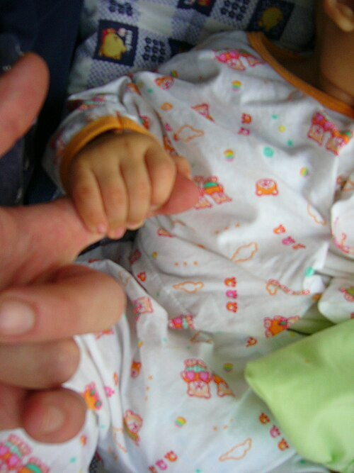

# DNPM: MARCOS DO DESENVOLVIMENTO

O Desenvolvimento Neuropsicomotor (DNPM) não é uma corrida de cem metros, mas sim um processo contínuo, sequencial e previsível de maturação do Sistema Nervoso Central (SNC). Para a prova de residência, você precisa entender que o cérebro da criança amadurece de forma "cefalocaudal" (de cima para baixo) e "proximodistal" (do centro para a periferia). É por isso que o bebê sustenta a cabeça antes de conseguir sentar, e consegue controlar o tronco antes de fazer o movimento de pinça com os dedos.

Se você entender essa lógica, para de decorar tabelas e começa a prever o que vem a seguir. O examinador adora colocar uma criança que "já faz X, mas ainda não faz Y" e perguntar se isso é normal. Se X for um marco de 6 meses e Y de 4 meses, temos um problema. Se for o contrário, estamos no caminho certo.

*Figura 1 - Reflexo de preensão palmar em lactente - um dos reflexos primitivos avaliados no DNPM. Fonte: User:Mattes, Public Domain | Wikimedia Commons*

## Princípios Fundamentais e Vigilância

Antes de mergulharmos nos meses, precisamos alinhar dois conceitos que as bancas misturam para te confundir: Vigilância do Desenvolvimento e Triagem (Screening).

A Vigilância é o que fazemos em toda consulta de puericultura. É o acompanhamento contínuo, observando os marcos, ouvindo a queixa da mãe e examinando a criança. Segundo o Ministério da Saúde e a Sociedade Brasileira de Pediatria (SBP), a ferramenta padrão para isso no Brasil é a Caderneta da Criança.

A Triagem é a aplicação de testes padronizados (como o Denver II ou o ASQ-3) quando a vigilância detecta algo suspeito. Cuidado: a prova pode dizer que "toda criança deve fazer Denver II em toda consulta". Isso está errado. O Denver II é uma ferramenta de triagem para casos de risco ou suspeita.

### A Regra de Ouro da Prematuridade

Este é o erro que mais reprova em pediatria. Se a questão trouxer um bebê que nasceu com 32 semanas de idade gestacional (IG), você **deve** usar a idade corrigida para avaliar o DNPM.

Como se calcula? Se o bebê nasceu 8 semanas antes do tempo (40 semanas - 32 semanas = 8 semanas, ou 2 meses), e hoje ele tem 5 meses de idade cronológica, você deve avaliá-lo como se ele tivesse 3 meses.

A diretriz da SBP recomenda corrigir a idade para o desenvolvimento motor até os 2 anos de idade. Se você avaliar um prematuro pela idade cronológica, vai diagnosticar atrasos inexistentes e errar a questão.

*Figura 2 - Reflexo Tônico Cervical Assimétrico (RTCA) em RN de 2 semanas - postura de esgrimista. Fonte: Samuel Finlayson, CC BY-SA 4.0 | Wikimedia Commons*

## Reflexos Primitivos: O Despertar do SNC

Os reflexos primitivos são respostas motoras involuntárias mediadas pelo tronco encefálico. Eles estão presentes ao nascimento e **devem desaparecer** à medida que o córtex cerebral amadurece e assume o controle voluntário dos movimentos.

Se um reflexo primitivo persiste além da idade esperada, isso sugere uma falha na maturação cortical ou uma lesão neurológica.

### Reflexo de Moro

É o mais famoso das provas. Ocorre diante de um susto ou queda súbita da cabeça. A resposta é dividida em duas fases:

- Extensão e abdução dos membros superiores (os braços abrem).

- Flexão e adução (os braços fecham, como um abraço), geralmente acompanhado de choro.

**Pérola de Prova:** O Moro deve desaparecer entre 4 e 6 meses. Se persistir após os 6 meses, suspeite de paralisia cerebral. Se for assimétrico ao nascimento, pense em fratura de clavícula ou paralisia braquial obstétrica (Erb-Duchenne).

### Reflexo Tônico-Assimétrico do Pescoço (RTAP)

Também chamado de "posição de esgrimista". Quando você vira a cabeça do bebê para um lado, o braço do mesmo lado estende e o braço oposto flexiona.
**Por que importa?** Ele impede que o bebê role. Para o bebê rolar (o que acontece por volta dos 4 a 6 meses), esse reflexo precisa desaparecer. Se a questão diz que o bebê de 7 meses ainda tem o RTAP, ele certamente não está rolando e tem um atraso.

### Reflexo de Preensão Palmar e Plantar

A preensão palmar desaparece cedo, por volta dos 2 a 3 meses, para permitir que a criança comece a abrir as mãos e agarrar objetos voluntariamente. Já a preensão plantar (apertar os dedos do pé quando estimulados) dura mais, sumindo por volta dos 10 a 12 meses, coincidindo com a época em que a criança começa a colocar o pé plano no chão para andar.

### Sinal de Babinski

Em adultos, o Babinski (extensão do hálux) é sempre patológico. Na pediatria, ele é **fisiológico** até os 12 a 18 meses devido à imaturidade do trato corticoespinhal (mielinização incompleta). Não marque "alteração neurológica" para um bebê de 10 meses com Babinski presente.

| Reflexo | Início | Desaparecimento Esperado |
| --- | --- | --- |
| Moro | Nascimento | 4 - 6 meses |
| Tônico-Assimétrico | Nascimento | 4 meses |
| Preensão Palmar | Nascimento | 2 - 3 meses |
| Preensão Plantar | Nascimento | 10 - 12 meses |
| Marcha Reflexa | Nascimento | 1 - 2 meses |
| Sucção | Nascimento | Substituído por voluntária aos 4m |

## O Primeiro Semestre: A Conquista do Eixo Central

Nesta fase, o foco é o controle da cabeça e do tronco superior.

### 2 Meses: O Marco do Sorriso

Aos 2 meses, o bebê deixa de ser um "ser reflexo" e começa a interagir.

- **Motor:** Sustenta a cabeça a 45º em decúbito ventral (bruços). As mãos começam a ficar mais abertas.

- **Adaptativo:** Segue objetos visualmente até 180º (ultrapassa a linha média).

- **Social:** **Sorriso Social**. Este é o marco mais cobrado. O bebê não sorri mais apenas por "gases" ou reflexo, ele sorri em resposta ao rosto humano.

- **Linguagem:** Emite sons guturais ("a-gu", vocalizações).

**Dica do MedEvo:** Se um bebê de 2 meses não tem sorriso social, a primeira coisa a investigar é a visão ou o estímulo ambiental. Se ele não sustenta a cabeça nem um pouco, olhe para o tônus muscular.

### 4 Meses: O Mundo em Alcance

- **Motor:** Sustenta a cabeça a 90º e apoia-se nos antebraços. É aqui que ele começa a **rolar** (geralmente de bruços para as costas primeiro).

- **Adaptativo:** Pega objetos voluntariamente e os leva à boca (exploração tátil-oral).

- **Social:** Ri alto (gargalhada).

- **Linguagem:** Vocaliza sons mais complexos.

### 6 Meses: O Sentar e a Introdução Alimentar

Este é um divisor de águas na puericultura.

- **Motor:** **Senta com apoio** (tripé). Consegue rolar para os dois lados.

- **Adaptativo:** Transfere objetos de uma mão para a outra. Se o bebê de 6 meses não transfere objetos, a coordenação motora fina está atrasada.

- **Social:** Prefere a mãe, começa a distinguir rostos familiares de estranhos.

- **Linguagem:** Balbucio monossilábico ("da", "ma").

**Cuidado:** Muitas bancas dizem que aos 6 meses o bebê já senta sem apoio. Errado. O sentar sem apoio (estável) é um marco que se consolida entre 7 e 8 meses. Aos 6 meses, ele precisa de suporte ou das próprias mãos à frente (posição de tripé).

## O Segundo Semestre: A Conquista da Verticalidade e da Pinça

Aqui o bebê começa a se deslocar e a usar as mãos como ferramentas de precisão.

### 9 Meses: A Pinça e a Angústia

- **Motor:** **Senta sozinho e sem apoio**. Pode começar a engatinhar (embora engatinhar não seja um marco obrigatório, alguns bebês pulam essa fase). Fica de pé com apoio.

- **Adaptativo:** **Pinça imatura** (usa o lado radial do dedo indicador e o polegar, mas não as pontas). Começa a bater um objeto no outro.

- **Social:** **Angústia do oitavo mês** (medo de estranhos). O bebê chora quando sai do colo da mãe. Isso é um sinal de saúde mental e vínculo, não de "mimo".

- **Linguagem:** Balbucio polissílabo ("mamama", "papapa"). Ele ainda não associa "papai" à pessoa específica necessariamente, ele está treinando os sons.

**Pegadinha de Prova:** A questão diz que um bebê de 9 meses não balbucia. Isso é um **Sinal de Alerta**. O balbucio reduplicado é essencial nesta fase.

### 12 Meses: A Independência

- **Motor:** **Anda com apoio** ou dá os primeiros passos sozinho.

- **Adaptativo:** **Pinça madura** (polpa com polpa, pega uma uva ou um grão de feijão com precisão). Entrega objetos sob pedido.

- **Social:** Brinca de "esconde-achou", entende o "não", aponta para o que quer.

- **Linguagem:** Diz as primeiras palavras com significado (ex: diz "mama" olhando para a mãe).

| Idade | Motor Grosso | Motor Fino/Adaptativo | Linguagem | Social |
| --- | --- | --- | --- | --- |
| 2m | Sustenta cabeça 45º | Segue 180º | Sons guturais | Sorriso social |
| 4m | Sustenta cabeça 90º/Rola | Pega objetos | Gargalha | Interage com ambiente |
| 6m | Senta com apoio (tripé) | Transfere objetos | Monossílabos | Distingue estranhos |
| 9m | Senta sem apoio | Pinça imatura | Polissílabos | Medo de estranhos |
| 12m | Anda com apoio | Pinça madura | 1-2 palavras | Aponta / Brinca de esconder |

## O Segundo Ano: Refinamento e Linguagem

A partir dos 12 meses, a variabilidade individual aumenta, mas as bancas focam em marcos muito específicos.

### 18 Meses: O Explorador

- **Motor:** Corre (meio desajeitado, mas corre) e sobe degraus baixos com ajuda.

- **Adaptativo:** Constrói torres de 3 blocos. Começa a usar a colher (derramando um pouco).

- **Linguagem:** Vocabulário de 10 a 20 palavras. Aponta partes do corpo quando solicitado.

- **Social:** Imita tarefas domésticas (varrer, falar ao telefone).

**Sinal de Alerta Crítico:** Aos 18 meses, se a criança não aponta para mostrar interesse, não faz contato visual ou não atende pelo nome, o Dr. Will alerta: ligue o radar para o Transtorno do Espectro Autista (TEA). A ausência do "apontar protodeclarativo" (apontar para compartilhar interesse, não apenas para pedir) é um dos sinais mais precoces de TEA.

### 24 Meses (2 Anos): O Orador e a Autonomia

- **Motor:** Sobe e desce escadas (um pé por degrau, mas ainda pode precisar de apoio). Chuta bola.

- **Adaptativo:** Torres de 6 blocos. Tira a própria roupa (peças simples).

- **Linguagem:** **Frases simples** (duas palavras, ex: "quer água", "dá bola"). Já tem cerca de 200 a 300 palavras.

- **Social:** Brincadeira paralela (brinca ao lado de outra criança, mas não necessariamente "com" ela de forma cooperativa).

**Dica de Prova:** A gagueira fisiológica é comum entre 2 e 3 anos. A criança pensa mais rápido do que consegue articular. Se a questão trouxer isso sem outros sinais de atraso, a conduta é apenas orientar a família e observar.

## Sinais de Alerta e Conduta

Você não precisa apenas saber o que é normal, precisa saber quando se desesperar (ou quando encaminhar).

### O que é um Sinal de Alerta?

Um sinal de alerta não é um diagnóstico de deficiência, mas uma indicação de que a criança precisa de uma avaliação mais profunda. Segundo o Ministério da Saúde:

- **Ausência de qualquer marco para a faixa etária anterior:** Se a criança tem 6 meses e não faz o que é esperado para os 4 meses.

- **Perda de habilidades (Regressão):** Este é o sinal mais grave. Uma criança que falava e parou de falar, ou que andava e parou de andar, precisa de investigação neurológica urgente. Isso pode ser sinal de doenças neurodegenerativas ou TEA.

- **Perímetro cefálico fora das curvas:** Microcefalia ou macrocefalia associadas a atraso.

- **Assimetrias:** Um lado do corpo se move e o outro não (suspeite de hemiparesia/paralisia cerebral).

### Conduta Prática

- **Marcos adequados:** Elogiar e orientar estímulos.

- **Um ou mais marcos ausentes (mas sem sinais de alerta graves):** Orientar a mãe a estimular e **reavaliar em 30 dias**. Não precisa encaminhar de imediato se for um atraso isolado e leve.

- **Sinais de alerta presentes ou ausência de marcos após reavaliação:** Encaminhar para avaliação especializada (Neuropediatra, Fonoaudiologia, Fisioterapia).

## Transtorno do Espectro Autista (TEA) nas Provas

O TEA tem caído com frequência absurda. O DSM-5 define o TEA por dois domínios principais:

- Déficits persistentes na comunicação social e na interação social.

- Padrões restritos e repetitivos de comportamento, interesses ou atividades.

**Sinais precoces para a prova:**

- Não manter contato visual durante a amamentação ou troca.

- Não responder ao nome aos 12 meses (parece que é surda, mas ouve outros sons).

- Não apontar aos 18 meses.

- Brincadeiras atípicas (enfileirar carrinhos em vez de fazê-los correr, focar em partes do objeto como as rodas).

- Hipersensibilidade sensorial (choro excessivo com barulhos comuns).

**Atenção:** Se a questão menciona "regressão de linguagem aos 18-24 meses", pense em TEA. Cerca de 25-30% das crianças com TEA apresentam essa regressão.

## Desenvolvimento da Linguagem: Onde os Alunos Erram

Muitos alunos acham que "atraso de fala" é sempre autismo ou surdez. Lembre-se da hierarquia de causas para atraso de fala em provas:

- **Falta de estímulo ambiental:** A causa mais comum hoje em dia (excesso de telas, pouca interação).

- **Deficiência Auditiva:** Sempre deve ser excluída. Se a criança não fala aos 12-15 meses, peça um teste de audição (Bera ou Audiometria, dependendo da idade), especialmente se não houver histórico de Teste da Orelhinha normal.

- **Transtornos de Linguagem ou TEA.**

**Marcos de Linguagem Resumidos:**

- 6 meses: Balbucio.

- 12 meses: Primeiras palavras com sentido.

- 18 meses: 10-20 palavras e aponta partes do corpo.

- 24 meses: Frases de 2 palavras ("quero pão").

- 3 anos: Frases completas, usa pronomes ("eu", "meu"). Já é compreendida por estranhos em 75% do tempo.

## Tabelas Comparativas para Revisão Rápida

### Tabela de Desenvolvimento Motor Grosso (O "Caminhar")

| Idade | Habilidade |
| --- | --- |
| 2 meses | Sustento cefálico parcial |
| 4 meses | Sustento cefálico completo / Rola |
| 6 meses | Senta com apoio (tripé) |
| 9 meses | Senta sem apoio / Fica de pé com apoio |
| 12 meses | Anda com apoio / Primeiros passos |
| 18 meses | Corre / Sobe escada com ajuda |
| 24 meses | Chuta bola / Sobe escada (um pé por degrau) |
| 3 anos | Pedala triciclo |

### Tabela de Desenvolvimento Motor Fino (O "Agarrar")

| Idade | Habilidade |
| --- | --- |
| 4 meses | Pega objetos e leva à boca |
| 6 meses | Transfere objetos entre as mãos |
| 9 meses | Pinça imatura (radial) |
| 12 meses | Pinça madura (polpa-polpa) |
| 18 meses | Torre de 3 blocos / Usa colher |
| 24 meses | Torre de 6 blocos / Abre maçanetas |

## O Impacto do Ambiente e das Telas

A SBP é muito rígida quanto ao tempo de tela, e isso começou a aparecer em questões sobre atraso de DNPM.

- **Menores de 2 anos:** Zero telas (nem passivamente).

- **2 a 5 anos:** Máximo 1 hora por dia, com supervisão.

O excesso de telas causa atraso de linguagem e prejuízo na interação social, simulando muitas vezes quadros de "autismo virtual". Se a questão descreve uma criança com atraso de fala que passa 4 horas no tablet, a primeira conduta é retirar a tela e aumentar o estímulo verbal.

## Exame Físico Neurológico no Lactente

Além dos marcos, o exame físico pode dar pistas de patologias:

- **Suspensão Ventral:** Ao segurar o bebê de bruços no ar, o esperado é que ele tente manter o tronco reto. Se ele fizer um "U" invertido (cabeça e pernas pendendo), ele tem hipotonia grave (Sinal do "U" ou sinal do cachecol positivo).

- **Perímetro Cefálico:** Deve ser medido em toda consulta até os 2 anos. O crescimento médio é:

- 1º trimestre: 2 cm/mês.

- 2º trimestre: 1 cm/mês.

- 2º semestre: 0,5 cm/mês.

- Total no 1º ano: cerca de 12 cm.

Se o PC não cresce, o cérebro não está crescendo (microcefalia). Se cresce demais, pode ser hidrocefalia ou macrocefalia familiar.

## Diagnóstico Diferencial de Atraso Motor

Se a criança tem apenas atraso motor, mas a linguagem e o social estão ótimos, pense em:

- **Hipotonia Benigna da Infância:** Atraso leve, mas com força preservada.

- **Doenças Neuromusculares:** Como Atrofia Muscular Espinal (AME) – aqui a criança é muito hipotônica, mas o olhar é muito vivo e inteligente.

- **Paralisia Cerebral:** Geralmente cursa com hipertonia (espasticidade) e persistência de reflexos primitivos.

Se o atraso é global (motor, linguagem e social), pense em:

- **Deficiência Intelectual.**

- **Erros Inatos do Metabolismo.**

- **Síndromes Genéticas (ex: Down).**

## Pontos-Chave para Prova

- **Idade Corrigida:** Obrigatória para prematuros até os 2 anos. Subtraia as semanas que faltaram para 40 semanas da idade cronológica.

- **Reflexo de Moro:** Desaparece entre 4 e 6 meses. Persistência é sinal de alerta para lesão de SNC.

- **Sorriso Social:** Marco dos 2 meses. Ausência exige avaliação de visão e estímulo.

- **Rolar:** Marco dos 4 aos 6 meses. Exige o desaparecimento do reflexo tônico-assimétrico do pescoço.

- **Sentar sem apoio:** Marco dos 7 aos 9 meses (consolidado aos 9).

- **Pinça:** Imatura aos 9 meses; Madura (polpa-polpa) aos 12 meses.

- **Linguagem aos 12 meses:** 1 a 2 palavras com significado. Se não houver, investigar audição.

- **Angústia do 8º mês:** É normal e esperada. Indica que a criança reconhece figuras de apego.

- **Sinal de Alerta aos 18 meses:** Não apontar, não fazer contato visual, não atender pelo nome (Suspeita de TEA).

- **Regressão de Marcos:** Sempre é uma emergência diagnóstica. Requer investigação neurológica imediata.

- **Babinski:** Fisiológico até 12-18 meses em lactentes.

- **Conduta no Atraso Leve:** Se apenas um marco estiver ausente e não houver sinais de alerta, orientar estímulo e reavaliar em 30 dias.

- **Marcha:** A idade limite para andar sem apoio é 15 meses (algumas referências dizem 18 meses como limite absoluto antes de investigar).

- **Gagueira Fisiológica:** Comum aos 2-3 anos. Conduta é observação e orientação, sem intervenção fonoaudiológica imediata se isolada.

- **Desenvolvimento Cefalocaudal:** A criança controla a cabeça (2-4m), depois o tronco (6-9m), depois as pernas (12m).

- **O que NÃO fazer:** Não diagnosticar atraso em prematuro sem corrigir a idade. Não ignorar o relato materno ("mãe que diz que o filho não ouve ou não fala tem sempre razão até que se prove o contrário"). 🧠

 Cópia offline para consulta pessoal.
 Fonte original:
 [https://www.medevo.com.br/material-apoio/ler/ffc5b362-acd6-47d8-99e2-8e6d29f52729](https://www.medevo.com.br/material-apoio/ler/ffc5b362-acd6-47d8-99e2-8e6d29f52729)
