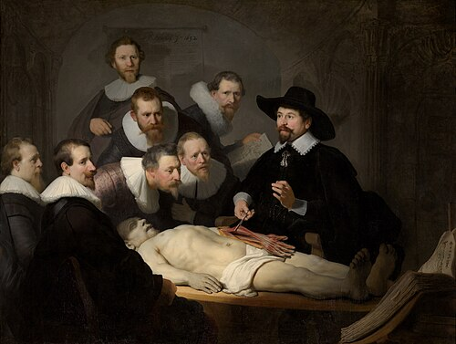
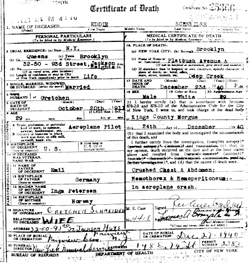

# DOCUMENTOS MÉDICO-LEGAIS

Para começar nossa conversa, você precisa entender que o documento médico não é apenas uma burocracia. Ele é a materialização do seu ato profissional. Na prova de residência, as bancas não querem saber se você sabe escrever bonito, elas querem saber se você conhece a responsabilidade jurídica e ética por trás de cada papel que assina.

Muitos alunos erram questões básicas porque confundem o papel do médico assistente com o do médico legista. Aqui no MedEvo, sempre batemos na tecla: o documento médico tem fé pública. Se você escreve algo errado, as consequências podem ser éticas (CRM), civis (indenizações) ou penais (prisão).

*Figura 1 - Estrela da Vida com símbolo médico (bastão de Asclépio) - representação da profissão médica. Fonte: Verdy p, Public Domain | Wikimedia Commons*

## Classificação dos Documentos Médico-Legais

Os documentos médicos são divididos em categorias conforme sua finalidade. Para a sua prova, foque nestes cinco:

- **Notificações:** São comunicações compulsórias às autoridades sobre fatos médicos relevantes (doenças de notificação compulsória, crimes de ação pública).

- **Atestados:** Afirmações por escrito de um fato médico e suas consequências. É o que o paciente mais te pede no dia a dia.

- **Relatórios:** Descrições minuciosas de um exame pericial. Se for feito por peritos, chama-se **Laudo**. Se for escrito pelo médico após a perícia, chama-se **Parecer**.

- **Prontuário:** O conjunto de documentos que registram a assistência ao paciente. É a sua maior defesa jurídica.

- **Depoimento Oral:** Quando o médico é chamado a juízo para explicar seus achados.

*Figura 2 - Exemplo de declaração de óbito histórica - documento médico-legal essencial. Fonte: Public Domain | Wikimedia Commons*

## Atestado Médico: O Direito do Paciente

O atestado médico é parte integrante do ato médico. Isso significa que, se você atendeu o paciente e ele precisa de um atestado, você tem o dever ético de fornecer. A recusa injustificada é infração ética.

### Regras de Ouro do Atestado

O atestado deve ser verídico e lúcido. Um erro clássico de prova é a questão do CID (Classificação Internacional de Doenças). Guarde isso: você **não pode** colocar o CID no atestado sem a autorização expressa do paciente. O sigilo médico é a regra. Se você colocar o CID apenas por "costume", está cometendo uma infração ética.

Outro ponto que o Dr. Will sempre lembra nas aulas: o médico não pode cobrar por atestados de sanidade ou de óbito quando o paciente está sob seus cuidados ou em serviços públicos. A cobrança só é permitida em situações de perícias particulares ou quando você é chamado para constatar um óbito de alguém que não era seu paciente (em âmbito privado).

### Atestado para Atividade Física

Bancas adoram perguntar sobre o "check-up" para academia. A verdade clínica é que, para indivíduos jovens e assintomáticos, a anamnese e o exame físico bem feitos são suficientes. Exames complementares como o teste ergométrico não são obrigatórios para todos, devendo ser solicitados conforme o risco cardiovascular estratificado.

## Declaração de Óbito (DO): O Grande Tema das Provas

Se você tiver que escolher apenas um tópico para dominar hoje, escolha a Declaração de Óbito. A DO tem duas grandes funções: uma **epidemiológica** (alimentar o Sistema de Informação sobre Mortalidade - SIM) e uma **jurídica** (permitir o registro civil e o sepultamento).

Cuidado para não confundir: a **Declaração de Óbito** é o documento médico (o formulário amarelo). A **Certidão de Óbito** é o documento do cartório (registro civil). O médico nunca emite a certidão, apenas a declaração.

### Quem deve emitir a DO?

Esta é a pergunta que define sua aprovação. A regra depende da causa da morte (Natural vs. Violenta) e da assistência médica prévia.

#### 1. Morte por Causa Natural

É aquela que decorre de um processo patológico interno (doenças).

- **Com assistência médica:** O médico assistente (aquele que vinha acompanhando o paciente) é o responsável principal. Se o paciente morre no hospital, a responsabilidade é do médico assistente ou, na sua ausência, do médico substituto (plantonista).

- **Sem assistência médica (ou causa mal definida):** Se houver um Serviço de Verificação de Óbitos (SVO) na região, o corpo vai para lá. O SVO serve para esclarecer mortes naturais de causa desconhecida.

- **Sem assistência e sem SVO:** Em locais onde não há SVO nem médico assistente, a DO pode ser fornecida por médico do serviço público de saúde ou, em última instância, por qualquer médico da localidade.

#### 2. Morte por Causa Externa (Violenta ou Suspeita)

Aqui não tem discussão: a DO é responsabilidade exclusiva do **Médico Legista (IML)**, independentemente de quanto tempo o paciente ficou internado.
Se um paciente sofre um acidente de trânsito, fica 3 meses na UTI e morre de pneumonia (causa imediata), a causa básica continua sendo o acidente. Portanto, quem atesta é o IML.

**Exemplo Clínico:** Imagine um idoso que cai da própria altura, fratura o fêmur, opera, mas evolui com embolia pulmonar e morre no hospital. Muitos alunos marcam que o médico do hospital atesta. Errado! A queda é uma causa externa. O corpo deve ir ao IML.

### Tabela: Responsabilidade pela Emissão da DO

| Tipo de Óbito | Local/Circunstância | Quem emite a DO? |
| --- | --- | --- |
| Natural | Hospital (com assistência) | Médico Assistente (ou plantonista) |
| Natural | Domicílio (com assistência) | Médico da Família / Assistente |
| Natural | Sem assistência / Causa desconhecida | SVO (onde houver) |
| Violento / Suspeito | Qualquer local (mesmo hospital) | IML (Médico Legista) |
| Natural | Local sem nenhum médico | 2 testemunhas + Registro Civil |

### O Preenchimento da Causa da Morte

A DO é dividida em Parte I e Parte II.

- **Parte I:** É a sequência causal. Você começa da causa imediata (linha A) e vai descendo até a causa básica (última linha preenchida).

- **Causa Imediata:** O evento final (ex: Hemorragia digestiva).

- **Causas Intermediárias:** O que levou à imediata (ex: Ruptura de varizes esofágicas).

- **Causa Básica:** A doença que iniciou tudo (ex: Cirrose hepática por Álcool).

- **Parte II:** Doenças preexistentes que contribuíram para a morte, mas não entraram na sequência direta (ex: Hipertensão, Diabetes).

**Dica de Ouro:** Nunca use "Parada Cardiorrespiratória" (PCR) como causa de morte. PCR é o modo de morrer, todo mundo para o coração quando morre. As bancas consideram isso um erro grave de preenchimento. Seja específico: use Infarto Agudo do Miocárdio, Insuficiência Cardíaca Congestiva, etc.

## Óbito Fetal e do Recém-Nascido

Este é um terreno cheio de pegadinhas. Vamos separar os conceitos:

### Nascido Vivo

Se o bebê nasceu e deu um único suspiro, ou o coração bateu uma vez, ou houve pulsação do cordão umbilical, ele é um **nascido vivo**.
Nesse caso, você precisa obrigatoriamente de dois documentos:

- Declaração de Nascido Vivo (DNV).

- Declaração de Óbito (DO).
Não importa se ele pesava 300g ou tinha 18 semanas. Se nasceu vivo e morreu depois, precisa dos dois.

### Óbito Fetal (Natimorto)

Aqui a regra é o "triplo 20" ou "500/25". Você só é obrigado a emitir a DO se o feto tiver:

- Idade gestacional ≥ 20 semanas; **OU**

- Peso ≥ 500 gramas; **OU**

- Estatura ≥ 25 cm (da cabeça ao calcanhar).

Se o feto tiver menos que isso em todos os critérios, a DO não é obrigatória para fins estatísticos, mas o médico pode emitir se a família desejar realizar o sepultamento.

## Prontuário Médico e Sigilo

O prontuário não pertence ao médico nem ao hospital; ele pertence ao paciente. O médico é o fiel depositário.

### Guarda do Prontuário

Segundo as normas vigentes, o prontuário em papel deve ser guardado por, no mínimo, **20 anos** a partir do último registro. Se for digitalizado ou eletrônico (dentro das normas de segurança), a guarda deve ser permanente.

### Sigilo Pós-Morte

O sigilo médico não acaba com a morte do paciente. Você continua proibido de revelar informações, exceto por dever legal (notificação compulsória), autorização dos herdeiros ou ordem judicial.

Cuidado: se uma seguradora pedir informações sobre a causa da morte de um paciente para pagar um seguro de vida, você só fornece se houver autorização expressa dos beneficiários/herdeiros no prontuário ou ordem judicial.

## Situações Especiais em Provas

### Morte Encefálica

A Declaração de Óbito em casos de morte encefálica deve ser preenchida com a data e hora do fechamento do diagnóstico (após o último teste clínico ou exame complementar), e não quando o coração parar após a retirada do suporte. A causa básica será a doença que levou ao coma (ex: AVC Hemorrágico).

### Morte em Puerpério

Óbitos de mulheres durante a gestação ou até um ano após o parto devem ser detalhados na DO. Isso é fundamental para o cálculo da Razão de Mortalidade Materna, um indicador de saúde pública muito cobrado.

### O Médico Plantonista e o Óbito

Muitos alunos acham que o plantonista não pode atestar óbito de paciente que ele não conhecia. Isso é um erro. Se o paciente estava internado no hospital e o médico assistente não está, o plantonista **deve** examinar o corpo, verificar o prontuário e emitir a DO se a causa for natural. O que ele não pode é atestar sem examinar o corpo. Emitir atestado sem exame direto é infração ética grave.

## Perícias e Documentos Judiciários

### CAT (Comunicação de Acidente de Trabalho)

A CAT deve ser emitida pela empresa até o primeiro dia útil após o acidente. Mas, se a empresa se recusar, o próprio médico que atendeu o trabalhador pode (e deve) emiti-la para garantir os direitos previdenciários do paciente.

### Diferença entre Perito e Assistente Técnico

- **Perito:** Nomeado pelo juiz, deve ser imparcial.

- **Assistente Técnico:** Contratado por uma das partes (acusação ou defesa). Ele não é suspeito de parcialidade, ele trabalha para quem o contratou, mas deve manter o rigor técnico.

## Erros Comuns que Você Deve Evitar

- **Atestar óbito violento no hospital:** Mesmo que o paciente tenha morrido na mesa de cirurgia após um tiro, você não assina a DO. Você faz o relatório médico de atendimento e encaminha o corpo ao IML.

- **Assinar atestado em branco:** Isso é crime de falsidade ideológica. Parece óbvio, mas cai em prova como "médico deixou guias assinadas para a enfermagem preencher".

- **Usar termos vagos:** "Falência de múltiplos órgãos" ou "Parada cardiorrespiratória" como causa básica. A banca vai te dar uma sequência de eventos e pedir para você identificar a causa básica. Lembre-se: a causa básica é a doença que "chutou a primeira peça do dominó".

### Exemplo de Cadeia Causal

Paciente com Diabetes Mellitus tipo 2 de longa data apresenta nefropatia diabética, evolui com insuficiência renal crônica e morre por uma arritmia secundária a hipercalemia.

- Linha A (Imediata): Fibrilação Ventricular

- Linha B (Intermediária): Hipercalemia

- Linha C (Intermediária): Insuficiência Renal Crônica

- Linha D (Básica): Diabetes Mellitus tipo 2

Percebeu? A diabetes é quem começou tudo. É ela que vai para as estatísticas do Ministério da Saúde.

## Pontos-Chave para Prova

- **Causa Externa (Trauma, Suicídio, Homicídio, Acidente):** Atestado de Óbito é sempre pelo IML, mesmo que a morte ocorra após longa internação hospitalar.

- **Morte Natural sem Assistência:** Encaminhar ao SVO (Serviço de Verificação de Óbitos). Se não houver SVO, médico do serviço público.

- **Morte Natural com Assistência:** Responsabilidade do médico assistente. Na ausência deste, o substituto/plantonista do hospital.

- **Nascido Vivo:** Qualquer sinal de vida (respiração, batimento, pulso de cordão). Exige DNV e DO, independente de peso ou idade gestacional.

- **Óbito Fetal (DO obrigatória):** Idade gestacional ≥ 20 semanas OU peso ≥ 500g OU estatura ≥ 25cm.

- **Sigilo Médico:** Não colocar CID no atestado sem autorização do paciente. O sigilo permanece após a morte.

- **Prontuário:** Guarda mínima de 20 anos para papel. O documento pertence ao paciente, o médico é o depositário.

- **Causa Básica:** É a doença ou lesão que iniciou a cadeia de eventos que levou à morte. É o dado mais importante para a epidemiologia.

- **Mecanismo de Morte:** Termos como "Parada Cardiorrespiratória" ou "Falência de Múltiplos Órgãos" não devem ser usados como causa básica.

- **Cobrança de DO:** Proibida em serviços públicos ou para pacientes sob sua assistência. Permitida apenas para médicos particulares que não assistiam o paciente.

- **Atestado de Sanidade:** É um ato médico e direito do paciente. A recusa sem motivo justo é infração ética.

- **Falsidade Ideológica:** Assinar documentos em branco ou com informações que você sabe serem falsas.

- **CAT:** Pode ser preenchida pelo médico se a empresa não o fizer.

- **SVO vs. IML:** SVO é para morte natural de causa mal definida. IML é para morte não natural (violenta ou suspeita).

- **Morte Encefálica:** A hora do óbito na DO é a hora da determinação da morte encefálica, não da parada cardíaca posterior. 🩺

 Cópia offline para consulta pessoal.
 Fonte original:
 [https://www.medevo.com.br/material-apoio/ler/3d538b1a-ba98-48d1-95cc-1f3fc9637548](https://www.medevo.com.br/material-apoio/ler/3d538b1a-ba98-48d1-95cc-1f3fc9637548)
