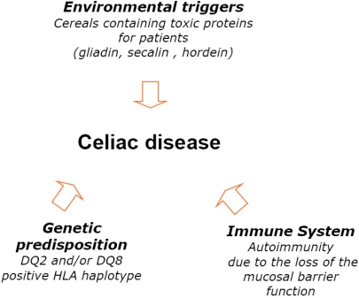
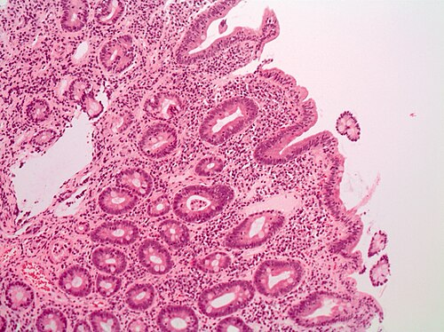

# DOENÇA CELÍACA

A Doença Celíaca (DC) não é uma simples "alergia ao glúten" ou uma intolerância alimentar passageira. Como professor, a primeira coisa que quero que você entenda é que estamos diante de uma **enteropatia imunomediada sistêmica**. Ela é desencadeada pela ingestão de glúten em indivíduos geneticamente predispostos.

Por que isso importa para a sua prova e para a sua vida prática? Porque se você enxergar a DC apenas como "diarreia e distensão", você vai errar 70% das questões de residência e, pior, vai deixar passar diagnósticos no consultório. A tendência atual das bancas é cobrar as manifestações atípicas e os critérios diagnósticos refinados, especialmente as novas recomendações que permitem o diagnóstico sem biópsia em casos selecionados na pediatria.

*Figura 1 - Fatores envolvidos na patogênese da doença celíaca: gliadina, transglutaminase tecidual, HLA-DQ2/DQ8. Fonte: Saturni et al., CC BY 4.0 | Wikimedia Commons*

## Fisiopatologia: O Porquê da Destruição

Para entender a doença, você precisa entender o gatilho. O glúten é um complexo proteico encontrado no **trigo, centeio e cevada**. A fração tóxica mais importante é a **gliadina**.

Em pessoas geneticamente suscetíveis (que possuem os alelos **HLA-DQ2 ou HLA-DQ8**), a gliadina atravessa a barreira epitelial intestinal. Aqui entra o papel de uma enzima fundamental: a **Transglutaminase Tecidual (tTG)**. Ela desamina a gliadina, tornando-a muito mais "atraente" para as células apresentadoras de antígenos.

O sistema imune, então, monta uma resposta inflamatória exacerbada. Linfócitos T CD4+ ativados liberam citocinas pró-inflamatórias que levam à destruição da arquitetura vilositária.

**O que acontece na prática?**
As vilosidades, que deveriam absorver nutrientes, sofrem atrofia. As criptas, tentando compensar a perda, sofrem hiperplasia. O resultado é uma superfície de absorção "careca". É por isso que o paciente apresenta má absorção de gorduras (esteatorreia), proteínas (edema) e micronutrientes (anemia).

*Figura 2 - Histologia de biópsia duodenal mostrando atrofia vilositária típica da doença celíaca. Fonte: Vasudevan/Lubel, CC BY 4.0 | Wikimedia Commons*

## Epidemiologia e Genética

A prevalência mundial é de cerca de 1%. No Brasil, os estudos mostram números semelhantes.

Um conceito que o Dr. Will sempre reforça nas discussões de caso é: **Doença Celíaca é uma doença de grupos de risco**. Você deve suspeitar ativamente em pacientes com:

- Parentes de primeiro grau de celíacos (risco de 10%).

- Síndrome de Down (prevalência até 10 vezes maior).

- Síndrome de Turner e Síndrome de Williams.

- Doenças autoimunes, especialmente Diabetes Mellitus Tipo 1 e Tireoidite de Hashimoto.

- Deficiência seletiva de IgA (guarde isso, será vital no diagnóstico).

Se a prova te der um paciente com DM1 que parou de crescer ou começou a ter episódios de hipoglicemia inexplicada, não pense apenas em ajuste de insulina. Pense em Doença Celíaca.

## Quadro Clínico: A Ponta do Iceberg

A clássica "forma de livro" é apenas a ponta do iceberg. A maioria dos pacientes hoje é diagnosticada na forma não clássica ou assintomática.

### Forma Clássica (Típica)

Geralmente surge entre os 6 e 24 meses de vida, após a introdução do glúten na dieta.

- **Diarreia crônica:** Fezes volumosas, pálidas, fétidas e que flutuam no vaso (esteatorreia).

- **Distensão abdominal:** O abdome fica globoso devido ao excesso de gases e alças dilatadas.

- **Hipotrofia muscular:** É muito característico o "emagrecimento das nádegas" (hipotrofia glútea).

- **Irritabilidade e anorexia:** A criança muda o comportamento.

- **Falha de crescimento (Failure to thrive):** Atraso pondero-estatural marcante.

### Forma Não Clássica (Atípica)

Aqui é onde as bancas de residência moram. O paciente pode não ter diarreia.

- **Anemia ferropriva refratária:** O ferro é absorvido no duodeno, justamente a área mais afetada pela DC. Se a anemia não melhora com sulfato ferroso oral, investigue DC.

- **Baixa estatura isolada:** Às vezes, o único sinal é a criança "cair" nos percentis de altura do gráfico de crescimento.

- **Defeitos no esmalte dentário:** Manchas e sulcos nos dentes permanentes.

- **Dermatite Herpetiforme:** É a manifestação cutânea da DC. São vesículas intensamente pruriginosas em superfícies extensoras (cotovelos, joelhos). Ter dermatite herpetiforme é sinônimo de ter doença celíaca.

- **Osteopenia/Osteoporose precoce:** Por má absorção de vitamina D e cálcio.

- **Puberdade atrasada.**

### Diferenciando o Edema

Cuidado para não confundir a desnutrição da Doença Celíaca com o **Kwashiorkor**. No Kwashiorkor, temos uma desnutrição proteica grave com edema generalizado (face de lua) e hipoalbuminemia, mas a causa é a falta de ingestão proteica na dieta, não necessariamente uma enteropatia por glúten. Na DC, o edema ocorre pela perda de proteínas (enteropatia perdedora de proteínas) ou má absorção severa.

## Diagnóstico: O Caminho das Pedras

O diagnóstico da Doença Celíaca exige que o paciente **esteja consumindo glúten**. Se o paciente retirou o glúten por conta própria, os exames serão falsamente negativos. Esse é um erro comum de consultório que você não pode cometer.

### 1. Sorologia (O primeiro passo)

O exame de escolha para triagem inicial é o **Anticorpo Antitransglutaminase tecidual da classe IgA (tTG-IgA)**.

**Atenção à pegadinha do IgA:**
Cerca de 2 a 3% dos celíacos têm deficiência congênita de IgA. Se o paciente não produz IgA, o tTG-IgA virá negativo mesmo que ele tenha a doença.

- **Conduta correta:** Sempre peça o **IgA Total** junto com o tTG-IgA.

- Se o IgA total for baixo, você deve solicitar os anticorpos da classe **IgG** (Antitransglutaminase IgG ou Antipéptido de Gliadina Deaminado IgG - DGP-IgG).

Outros anticorpos:

- **Anti-endomísio (EMA-IgA):** Muito específico, mas operador-dependente. Geralmente usado para confirmar casos duvidosos.

- **Antigliadina (AGA):** Caiu em desuso para diagnóstico de DC em crianças maiores, exceto o DGP (Anticorpo contra Peptídeos de Gliadina Deaminada), que é excelente em menores de 2 anos.

### 2. Biópsia de Intestino Delgado

Historicamente, era o padrão-ouro para todos. É feita por endoscopia digestiva alta, colhendo-se pelo menos 4 fragmentos (pelo menos um do bulbo duodenal e os outros da segunda ou terceira porção do duodeno).

A classificação utilizada é a de **Marsh-Oberhuber**:

- **Marsh 0:** Mucosa normal.

- **Marsh 1:** Aumento de linfócitos intraepiteliais (LIE > 25 por 100 enterócitos).

- **Marsh 2:** Hiperplasia de criptas + aumento de LIE.

- **Marsh 3:** Atrofia vilositária (a, b ou c, dependendo do grau de atrofia). **Este é o achado clássico da DC.**

### 3. O Novo Protocolo (Diagnóstico sem Biópsia)

Segundo a Sociedade Europeia de Gastroenterologia, Hepatologia e Nutrição Pediátrica (ESPGHAN, 2020), adotada pela Sociedade Brasileira de Pediatria (SBP), em crianças e adolescentes, podemos dispensar a biópsia se:

- **tTG-IgA > 10 vezes o valor de referência.**

- **Confirmado por um segundo anticorpo positivo (Anti-endomísio)** em uma segunda amostra de sangue.

Isso é revolucionário. Se a questão de prova descreve uma criança com sintomas claros, tTG-IgA de 250 (referência até 10) e EMA positivo, a resposta é: "Iniciar dieta isenta de glúten", e não "Solicitar biópsia".

### 4. Teste Genético (HLA-DQ2 / HLA-DQ8)

O teste genético tem um **alto valor preditivo negativo**.

- Se o teste for negativo, você pode excluir Doença Celíaca com 99% de certeza.

- Se for positivo, não confirma nada (30% da população saudável tem esses genes), apenas diz que a pessoa *pode* desenvolver a doença.

- **Quando usar?** Casos duvidosos, biópsias inconclusivas ou para triagem de grupos de risco (se o HLA for negativo, não precisa mais repetir sorologias anuais).

| Exame | Utilidade Principal | Observação de Ouro |
| --- | --- | --- |
| **tTG-IgA** | Triagem inicial | Sempre pedir com IgA Total |
| **EMA-IgA** | Confirmação | Alta especificidade |
| **DGP-IgG** | Crianças < 2 anos ou deficiência de IgA | Mais sensível que tTG em bebês |
| **Biópsia** | Padrão-ouro clássico | Classificação de Marsh |
| **HLA-DQ2/DQ8** | Excluir a doença | Se negativo, tchau DC |

## Diagnóstico Diferencial: Não confunda!

Muitas doenças pediátricas cursam com má absorção e distensão abdominal. O MedEvo exige que você saiba diferenciar:

- **Giardíase:** Causa diarreia crônica, distensão e esteatorreia. A diferença é que a giardíase costuma ser intermitente e responde ao tratamento com Metronidazol (ou Secnidazol). Se a criança tem "cara de celíaca" mas a sorologia é negativa, pense em Giardíase.

- **Fibrose Cística:** Também causa esteatorreia e falha de crescimento. Porém, a Fibrose Cística vem acompanhada de sintomas respiratórios (tosse crônica, pneumonias de repetição) e o diagnóstico é pelo Teste do Suor (Cloro > 60 mEq/L).

- **Alergia à Proteína do Leite de Vaca (APLV):** Geralmente ocorre mais cedo, logo após a introdução da fórmula. Pode ter sangue nas fezes (proctocolite), o que é raro na DC.

- **Intolerância à Lactose:** Causa diarreia explosiva, ácida, com muita flatulência, mas **não causa atrofia de vilosidades** nem falha de crescimento grave como a DC. O crescimento costuma ser normal.

## Tratamento: A Vida Sem Glúten

O único tratamento eficaz é a **dieta isenta de glúten por toda a vida**.
Não existe "um pouquinho de glúten". Mesmo migalhas podem manter a inflamação ativa e aumentar o risco de complicações a longo prazo.

**O que o paciente PODE comer:**

- Arroz, feijão, milho, batata, mandioca, carnes, ovos, frutas, verduras e leite.

**O que o paciente NÃO PODE comer:**

- Trigo, cevada e centeio.

- **Aveia:** A aveia em si não contém glúten, mas no Brasil ela é processada nas mesmas máquinas do trigo (contaminação cruzada). Por isso, a recomendação geral no Brasil é evitar, a menos que seja aveia com certificação "Gluten-Free".

**Cuidados Adicionais:**

- No início do tratamento, alguns pacientes podem ter uma **intolerância à lactose secundária**. Como a enzima lactase fica na ponta das vilosidades e as vilosidades estão destruídas, a criança não digere bem o leite. Isso melhora após alguns meses de dieta sem glúten e recuperação da mucosa.

- Reposição de micronutrientes: Ferro, Folato, Cálcio e Vitamina D podem ser necessários inicialmente.

## Complicações e Seguimento

Se o paciente não aderir à dieta, as consequências são graves:

- **Linfoma de Células T associado à Enteropatia (EATL):** Uma neoplasia rara, mas muito agressiva.

- **Crise Celíaca:** Uma emergência pediátrica rara com diarreia profusa, desidratação grave, distúrbios eletrolíticos (hipocalemia) e choque.

- **Infertilidade e abortos de repetição.**

- **Doenças autoimunes secundárias.**

**Como seguir o paciente?**
Pedimos a sorologia (tTG-IgA) periodicamente. O objetivo é que ela se torne negativa. Se o anticorpo continua alto após 6 a 12 meses, o paciente provavelmente está "escapando" da dieta (intencionalmente ou por contaminação oculta).

## Exemplo Clínico para Fixação

Imagine um paciente de 3 anos, levado ao pediatra por "barriga inchada" e fezes que brilham e boiam no vaso. A mãe relata que ele era um bebê gordinho, mas após o desmame e introdução de pães e papinhas, ele parou de ganhar peso e ficou muito irritado. Ao exame: palidez cutânea, abdome muito distendido, mas com membros finos e nádegas "murchas" (hipotrofia glútea).

**O que fazer?**

- Solicitar tTG-IgA + IgA Total.

- Se tTG-IgA > 10x o limite e EMA positivo em outra amostra -> Diagnóstico confirmado.

- Se tTG-IgA positivo mas < 10x -> Encaminhar para Endoscopia com Biópsia.

- Tratamento: Retirada total de trigo, cevada e centeio.

## Pontos-Chave para Prova

- **Definição:** Enteropatia imunomediada por glúten em indivíduos HLA-DQ2/DQ8 positivos.

- **Padrão-ouro clássico:** Biópsia duodenal (Marsh 3 é o marco).

- **Diagnóstico sem biópsia (SBP/ESPGHAN):** Possível em crianças se tTG-IgA > 10x o limite + Anti-endomísio (EMA) positivo em segunda amostra.

- **Triagem inicial:** Sempre tTG-IgA + IgA Total. Se IgA total for baixo, a sorologia IgA será falso-negativa.

- **Manifestação cutânea:** Dermatite Herpetiforme (vesículas pruriginosas).

- **Anemia ferropriva:** Frequentemente é a única manifestação da forma atípica e é refratária ao tratamento oral.

- **Grupos de risco:** DM1, Down, Turner, parentes de 1º grau.

- **O que NÃO fazer:** Nunca iniciar dieta sem glúten antes de completar a investigação diagnóstica. Isso "limpa" a mucosa e negativa os anticorpos, impedindo o diagnóstico correto.

- **Alimentos proibidos:** Trigo, cevada, centeio.

- **Alimentos permitidos:** Arroz, milho, mandioca, batata.

- **Diferencial importante:** Giardíase (distensão e esteatorreia, mas sorologia negativa e melhora com antiparasitários).

- **Marcador de aderência:** A queda dos títulos de tTG-IgA no acompanhamento.

- **Linfoma:** A principal complicação neoplásica da DC não tratada é o Linfoma de Células T.

- **Cuidado com a aveia:** No Brasil, deve ser evitada pela alta taxa de contaminação cruzada, a menos que seja certificada. 🌾

 Cópia offline para consulta pessoal.
 Fonte original:
 [https://www.medevo.com.br/material-apoio/ler/54c7225d-74f8-4386-b38e-0c8624d1d124](https://www.medevo.com.br/material-apoio/ler/54c7225d-74f8-4386-b38e-0c8624d1d124)
