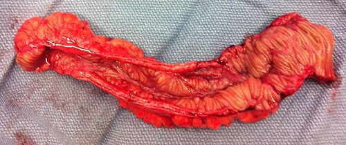
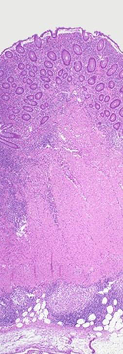

# DOENÇA DE CROHN CIRÚRGICA

A Doença de Crohn (DC) é um desafio para o cirurgião. Diferente da Retocolite Ulcerativa (RCU), onde a proctocolectomia total pode ser considerada "curativa" do ponto de vista intestinal, na Doença de Crohn a cirurgia **não cura**. O processo inflamatório pode acometer qualquer segmento do trato gastrointestinal, da boca ao ânus.

Por isso, a primeira lição que você deve levar para a prova e para a vida é: na Doença de Crohn, operamos **complicações**, não a doença em si. A cirurgia é um episódio dentro do tratamento crônico do paciente.

*Figura 1 - Peça cirúrgica de íleo terminal ressecado por doença de Crohn, mostrando estenose e espessamento parietal. Fonte: PPSE15, CC BY-SA 4.0 | Wikimedia Commons*

## Fisiopatologia e Anatomia: O Porquê da Conduta

Para entender por que a cirurgia de Crohn é "econômica", você precisa entender a natureza da inflamação. A DC é caracterizada por uma inflamação **transmural**. Isso significa que ela atravessa todas as camadas da parede intestinal (mucosa, submucosa, muscular e serosa).

Essa característica transmural explica três coisas fundamentais que caem em prova:

- **Fístulas:** Se a inflamação atravessa a parede, ela pode "furar" o intestino e comunicar-se com outro órgão (bexiga, vagina, outra alça) ou com a pele.

- **Estenoses:** A inflamação crônica gera cicatrização e fibrose. Como a inflamação é em toda a parede, o lúmen estreita de forma fixa.

- **Abscessos:** A microperfuração bloqueada pelo mesentério ou por alças adjacentes forma coleções purulentas.

Diferente da RCU, que é contínua e restrita à mucosa, a DC apresenta **lesões salteadas** (*skip lesions*). Você pode ter 20 cm de doença no íleo terminal, um cólon normal e outra lesão no sigmoide.

**Dica de Prova:** As bancas adoram perguntar sobre o "mesentério gorduroso" (*creeping fat*). Na cirurgia, observamos a gordura mesentérica "abraçando" a alça inflamada. Isso é patognomônico da Doença de Crohn.

*Figura 2 - Histopatologia H&E mostrando inflamação transmural característica da doença de Crohn. Fonte: Samir, CC BY-SA 3.0 | Wikimedia Commons*

## Indicações Cirúrgicas: Quando a Faca é Necessária?

Cerca de 70% a 80% dos pacientes com DC precisarão de ao menos uma cirurgia ao longo da vida. Mas cuidado: **perda de peso isolada NÃO é indicação cirúrgica**. O tratamento inicial é quase sempre clínico (imunossupressores e biológicos).

As indicações absolutas e relativas são:

### 1. Obstrução Intestinal (A mais comum!)

É a indicação cirúrgica mais frequente. Geralmente ocorre por estenose fibrótica no íleo terminal.

- **O erro clássico:** Achar que toda obstrução no Crohn é cirúrgica. No surto agudo, o edema da mucosa pode obstruir. Isso tratamos com corticoide e jejum. A cirurgia é para a **estenose fibrótica**, aquela que não cede ao tratamento clínico e causa dilatação da alça a montante.

### 2. Fístulas e Abscessos

Fístulas enterocutâneas, enterovesicais ou enteroentéricas complexas que causam desvio nutricional ou infecções de repetição. Abscessos devem ser, preferencialmente, drenados por via percutânea antes de qualquer tentativa de ressecção definitiva.

### 3. Perfuração Livre

É rara (devido ao caráter transmural que costuma "colar" as alças antes de furar), mas quando ocorre, é uma emergência com peritonite generalizada.

### 4. Hemorragia Refratária

Diferente da RCU, a hemorragia maciça no Crohn é incomum, mas pode ocorrer por erosão de um vaso calibroso em uma úlcera profunda. Se o manejo endoscópico e angiográfico falhar, a ressecção é indicada.

### 5. Suspeita de Malignidade

Esta é uma **indicação absoluta**. O paciente com Crohn tem risco aumentado de adenocarcinoma de intestino delgado e de cólon. Se houver uma estenose que o colonoscópio não ultrapassa ou uma massa suspeita, operamos.

### 6. Doença Perianal Grave

Fístulas complexas e abscessos anorretais que não respondem ao tratamento clínico e ameaçam a continência esfincteriana.

## Diagnóstico Diferencial: Crohn vs. RCU

Este é o tópico que mais gera questões de prova. Você precisa saber diferenciar as duas para decidir a técnica cirúrgica.

| Característica | Doença de Crohn | Retocolite Ulcerativa |
| --- | --- | --- |
| **Localização** | Qualquer ponto do TGI (Boca ao Ânus) | Restrita ao Cólon e Reto |
| **Padrão** | Descontínuo (Lesões salteadas) | Contínuo (Inicia no reto e sobe) |
| **Acometimento** | Transmural (Toda a parede) | Mucosa e Submucosa apenas |
| **Reto** | Frequentemente poupado | Sempre acometido |
| **Fístulas/Abscessos** | Comuns | Raros |
| **Granulomas** | Presentes (Não caseosos) em 30% | Ausentes |
| **Cura com Cirurgia** | Não | Sim (Proctocolectomia) |
| **Achado Endoscópico** | Úlceras aftoides, "pedra de calçamento" | Mucosa friável, granular, erosões |

**Exemplo Clínico:** Paciente de 28 anos com diarreia crônica, dor em fossa ilíaca direita e uma fístula perianal ativa. Ao exame, massa palpável em FID.

- **Diagnóstico:** Doença de Crohn (provável acometimento ileocecal).

- **Conduta no surto agudo:** Suporte nutricional + Antibióticos (Cipro/Metro) + Corticoide. Se houver obstrução por estenose fixa após melhora do edema, programar cirurgia.

## Princípios da Cirurgia em Crohn: A Regra de Ouro

Como professor, eu bato sempre na mesma tecla: **Ressecção Econômica**.

Na faculdade, aprendemos a tirar margens oncológicas de 5 cm ou mais. No Crohn, isso é um erro crasso. A recorrência da doença geralmente ocorre na linha de anastomose, independentemente da largura da margem. Se você tirar muito intestino a cada cirurgia, o paciente evoluirá para **Síndrome do Intestino Curto**.

### Margens Cirúrgicas

As margens devem ser macroscópicas. Se o intestino parece e é palpado como normal, ali é o ponto de corte. Não precisamos de biópsia de congelação para garantir margem microscopicamente livre. Segundo as diretrizes do GEDIIB e da ASCRS, margens macroscópicas são suficientes.

### Anastomoses

Sempre que possível, preferimos anastomoses primárias. No entanto, se o paciente estiver:

- Desnutrido (Albumina < 3.0 g/dL).

- Em uso de corticoide em dose alta (> 20 mg/dia de prednisona).

- Com abscesso abdominal não drenado.

- Instável hemodinamicamente.

Nesses casos, o Dr. Will recomenda: **não anastomose**. Faça uma estomia e proteja o paciente de uma deiscência que seria catastrófica.

## Técnicas Cirúrgicas Específicas

### 1. Ressecção Ileocecal

É a cirurgia mais realizada na DC. O íleo terminal é o alvo preferencial da doença. A técnica envolve a retirada do íleo doente, ceco e apêndice, com anastomose íleo-colônica (geralmente íleo-transverso lateral-lateral, que tem menor taxa de estenose recorrente).

### 2. Estenosoplastias (Enteroplastias)

Esta é a "queridinha" das provas de residência. O objetivo é tratar a estenose sem retirar intestino.

- **Heineke-Mikulicz:** Usada para estenoses **curtas** (< 7-10 cm). Faz-se uma incisão longitudinal e sutura transversal (igual à piloroplastia).

- **Finney:** Usada para estenoses **médias** (10-20 cm). É uma técnica de "U" invertido, criando uma anastomose ampla.

**Contraindicações da Estenosoplastia:**

- Múltiplas estenoses em um segmento curto (melhor ressecar o segmento).

- Flegmão ou abscesso na parede da alça.

- Suspeita de malignidade na estenose.

- Desnutrição grave.

### 3. Colectomia Total com Anastomose Ileoretal (IRA)

Indicada quando o Crohn afeta todo o cólon, mas o **reto está poupado**. É uma excelente opção para evitar a ileostomia definitiva. Se o reto estiver doente, a opção é a proctocolectomia total com ileostomia definitiva.

**Atenção:** Nunca faça um reservatório ileal (bolsa em J) em um paciente com diagnóstico confirmado de Crohn. O risco de recorrência da doença na bolsa e perda do reservatório é altíssimo. Reservatório ileal é para RCU!

## Fístulas Digestivas: O Pesadelo do Cirurgião

As fístulas na DC podem ser internas (enteroentérica, enterovesical, enterovaginal) ou externas (enterocutâneas).

### Fatores de Mau Prognóstico para Fechamento Espontâneo

Para a prova, decore o mnemônico **FRIEND** (ou as condições que impedem o fechamento):

- **F**oreign body (Corpo estranho).

- **R**adiation (Radiação prévia).

- **I**nfection/Inflammation (Abscesso ou Crohn ativo no trajeto).

- **E**pithelization (Epitelização do trajeto - fístula "labiada").

- **N**eoplasm (Câncer no trajeto).

- **D**istal obstruction (Obstrução distal à fístula - o conteúdo prefere sair pelo "buraco" do que passar pela obstrução).

**Pérola Clínica:** Uma fístula enterocutânea de **alto débito** (> 500 mL/24h) raramente fecha sozinha. Já as de baixo débito (< 200 mL/24h) têm melhor prognóstico. Outro fator favorável é a **Transferrina > 200 mg/dL**, indicando bom status nutricional.

### Manejo das Fístulas

- **Estabilização:** Reposição hidroeletrolítica (essencial nas fístulas proximais de alto débito).

- **Controle da Infecção:** Drenagem de abscessos e antibióticos.

- **Nutrição:** O pilar do tratamento. Se a fístula for distal, podemos usar nutrição enteral. Se for proximal e de alto débito, Nutrição Parenteral Total (NPT).

- **Decisão Cirúrgica:** Se após 4-6 semanas de tratamento clínico otimizado a fístula não fechar, a cirurgia (geralmente ressecção do segmento de origem) está indicada.

## Doença Perianal no Crohn

Cerca de 30% dos pacientes terão manifestações perianais (fístulas, abscessos, fissuras, plicomas).

- **Abscesso perianal:** Emergência! Drenagem imediata. Não espere flutuação, pois no Crohn a infecção pode se espalhar rapidamente pelos espaços profundos.

- **Fístulas perianais:** O tratamento de escolha para fístulas complexas é a passagem de **sedenho** (seton). O sedenho mantém o trajeto aberto, drenando a secreção e evitando novos abscessos, enquanto o tratamento biológico (Infliximabe) tenta fechar a fístula de dentro para fora.

- **Plicomas:** São grandes e edematosos. **Não devem ser excisados**, pois a cicatrização é péssima e pode gerar feridas crônicas dolorosas.

## Tabelas Comparativas para Revisão Rápida

### Tabela 1: Classificação de Fístulas Enterocutâneas por Débito

| Categoria | Débito (mL/24h) | Chance de Fechamento Espontâneo |
| --- | --- | --- |
| Baixo Débito | < 200 mL | Alta |
| Médio Débito | 200 - 500 mL | Moderada |
| Alto Débito | > 500 mL | Baixa |

### Tabela 2: Indicações de Estenosoplastia vs. Ressecção

| Situação | Conduta Preferencial | Justificativa |
| --- | --- | --- |
| Estenose única de 5 cm | Estenosoplastia (H-M) | Preservação de comprimento intestinal |
| Estenose de 15 cm | Estenosoplastia (Finney) | Evita ressecção de segmento longo |
| Múltiplas estenoses em 10 cm | Ressecção Segmentar | Mais simples e seguro que várias plastias juntas |
| Estenose com abscesso local | Ressecção | Tecido inflamado não segura sutura (deiscência) |
| Suspeita de Câncer | Ressecção com Margem | Necessidade de estadiamento oncológico |

### Tabela 3: Fatores Prognósticos na Fístula Enterocutânea

| Fator Favorável | Fator Desfavorável |
| --- | --- |
| Baixo débito (< 200 mL/dia) | Alto débito (> 500 mL/dia) |
| Trajeto longo (> 2 cm) | Trajeto curto / Labiada (epitelizada) |
| Ausência de obstrução distal | Obstrução distal presente |
| Nutrição adequada (Alb > 3.5) | Desnutrição grave |
| Transferrina > 200 mg/dL | Crohn ou Tuberculose ativa no trajeto |

## Situações Especiais e Pegadinhas de Prova

### 1. Divertículo de Meckel

Muitas vezes o diagnóstico diferencial de uma ileíte de Crohn é o Divertículo de Meckel inflamado. Lembre-se: o Meckel é o remanescente do **ducto onfalomesentérico**, localiza-se na borda **antimesentérica** do íleo, a cerca de 60 cm da válvula ileocecal. Se encontrar um Meckel incidental em uma cirurgia por apendicite em criança, a recomendação geral é ressecar. No adulto assintomático, a conduta é controversa, mas a tendência é não mexer.

### 2. Adenocarcinoma de Apêndice

Se o resultado do anátomo-patológico de uma "apendicectomia comum" vier como adenocarcinoma mucinoso invasivo, a conduta é **Hemicolectomia Direita**. Não basta a apendicectomia. Isso vale para o Crohn também, se houver neoplasia associada.

### 3. Tuberculose Intestinal

O grande diagnóstico diferencial do Crohn no Brasil. A TB intestinal também causa estenoses e fístulas, mas costuma apresentar granulomas **caseosos** e pode ter evidência de TB pulmonar. O tratamento é clínico (esquema RIPE), e a cirurgia fica reservada para complicações (obstrução é a principal).

### 4. Megacólon Tóxico

Embora mais comum na RCU, pode ocorrer no Crohn colônico. O paciente apresenta dilatação do cólon (> 6 cm no transverso), sinais de toxicidade sistêmica (febre, taquicardia, leucocitose) e dor abdominal.

- **Conduta:** Colectomia Total + Ileostomia Terminal. O reto é deixado (sepultado ou em fístula mucosa) para um segundo tempo. **Nunca faça anastomose no megacólon tóxico**.

## Nutrição: O "Remédio" Pré-Operatório

No MedEvo, sempre enfatizamos que o cirurgião moderno é um nutrólogo por tabela. Um paciente com Crohn que vai para a mesa de cirurgia desnutrido tem 3 a 4 vezes mais complicações.

- **Metas:** Se possível, adiar a cirurgia eletiva por 7-14 dias para otimizar a nutrição (preferencialmente enteral).

- **Fístula Duodenal:** Não é contraindicação para nutrição enteral! Você pode passar uma sonda pós-fístula ou usar fórmulas elementares que são absorvidas rapidamente.

- **Imunossupressores:** O uso de biológicos (anti-TNF) não parece aumentar drasticamente as complicações pós-operatórias, mas o **corticoide** sim. Sempre tente desmamar a prednisona para menos de 20 mg antes de operar.

## Pontos-Chave para Prova

- **Indicação mais comum:** Obstrução intestinal por estenose fibrótica.

- **Indicação absoluta:** Suspeita de malignidade (Adenocarcinoma).

- **Princípio cirúrgico:** Ressecção econômica (preservar intestino). Margens macroscópicas são suficientes.

- **Estenosoplastia Heineke-Mikulicz:** Para estenoses curtas (< 7-10 cm).

- **Estenosoplastia Finney:** Para estenoses de comprimento intermediário (10-20 cm).

- **Fístula Enterocutânea:** Transferrina > 200 mg/dL é fator favorável ao fechamento.

- **Pior prognóstico de fístula:** Alto débito, obstrução distal, epitelização (labiada), Crohn ativo.

- **Anastomose em Crohn:** Evitar se Albumina < 3.0, Prednisona > 20 mg ou abscesso não drenado.

- **Doença Perianal:** Abscesso = Drenagem imediata. Fístula complexa = Sedenho + Biológico.

- **Divertículo de Meckel:** Borda antimesentérica, remanescente do ducto onfalomesentérico.

- **Adenocarcinoma de Delgado:** É a neoplasia maligna primária mais comum do intestino delgado.

- **Megacólon Tóxico:** Colectomia total + Ileostomia (não anastomosa!).

- **Bolsa Ileal (J-Pouch):** Contraindicada se o diagnóstico for Doença de Crohn.

- **Fístula Enterovesical:** Ressecção do segmento intestinal doente + fechamento primário da bexiga (geralmente não precisa de ressecção ampla da bexiga, apenas um "manguito").

- **Recorrência:** O local mais comum de recorrência pós-operatória é a **anastomose ileocolônica**.

- **Linfoma de Delgado:** Segundo tumor maligno mais comum do delgado (o primeiro é o adenocarcinoma).

- **Mesotelioma Maligno:** Tumor primário mais comum do peritônio (lembrar da associação com asbesto).

- **Hidroadenite Supurativa:** Diagnóstico diferencial de doença perianal; inflamação das glândulas apócrinas. 🩺

 Cópia offline para consulta pessoal.
 Fonte original:
 [https://www.medevo.com.br/material-apoio/ler/b39373d5-7a59-4931-826c-96e97ac7df49](https://www.medevo.com.br/material-apoio/ler/b39373d5-7a59-4931-826c-96e97ac7df49)
