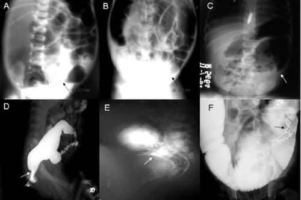
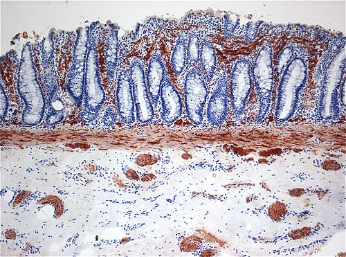

# DOENÇA DE HIRSCHSPRUNG

A Doença de Hirschsprung (DH), ou Megacólon Agangliônico Congênito, é aquele tema que separa o aluno que decora do aluno que entende a fisiopatologia. Se você compreender por que o intestino para de funcionar, você mata qualquer questão de prova, desde a clínica até a conduta cirúrgica.

Para começar, entenda o seguinte: o problema não é o "megacólon" em si. O megacólon é a consequência. O problema é o segmento estreito, sem nervos, que fica logo depois dele.

*Figura 1 - Radiografia abdominal e enema contrastado mostrando zonas de transição na doença de Hirschsprung. Fonte: Pratap et al., CC BY 2.0 | Wikimedia Commons*

## Fisiopatologia: A Falha na Migração

Para entender a DH, precisamos voltar à embriologia. Os plexos nervosos do intestino (Auerbach e Meissner) derivam das células da crista neural. Essas células migram no sentido **craniocaudal** durante a 5ª até a 12ª semana de gestação.

Na Doença de Hirschsprung, ocorre uma interrupção dessa migração. Como a migração é de cima para baixo, o segmento afetado será sempre o **distal** (reto e sigmoide). É por isso que não existe "Hirschsprung saltatório"; a aganglionose é sempre contínua a partir do ânus em direção proximal.

### O que acontece no segmento sem nervos?

Sem os plexos de Meissner (submucoso) e Auerbach (mioentérico), o intestino perde a capacidade de relaxamento reflexo. O óxido nítrico e o VIP (peptídeo intestinal vasoativo), que promovem o relaxamento, estão ausentes. O resultado é um segmento em **hipertonia permanente**.

Aqui está o "pulo do gato" que o Dr. Will sempre enfatiza nas discussões clínicas: o segmento doente é o segmento fino e espástico. O segmento saudável, que tem nervos, tenta empurrar as fezes contra essa obstrução funcional, acaba sofrendo uma dilatação compensatória e se torna o "megacólon".

**Dica de prova:** A alternativa vai tentar te convencer de que o megacólon é a parte doente. Errado! O megacólon é a parte sã que está trabalhando demais. A doença está no segmento distal, de calibre normal ou reduzido.

*Figura 2 - Histopatologia mostrando fibras aberrantes de acetilcolinesterase (marrom) na lâmina própria - diagnóstico de aganglionose. Fonte: Marvin 101, CC BY-SA 3.0 | Wikimedia Commons*

## Epidemiologia e Genética

A DH ocorre em aproximadamente 1 para cada 5.000 nascidos vivos. Existe uma predominância clara no sexo masculino (4:1). No entanto, quando a doença acomete segmentos longos (aganglionose colônica total), essa proporção se iguala.

Cerca de 10% dos casos estão associados à **Síndrome de Down (Trisomia do 21)**. Outras associações incluem a Síndrome de Waardenburg e neoplasias endócrinas múltiplas (MEN 2). Geneticamente, a mutação mais comum envolve o proto-oncogene **RET**.

## Quadro Clínico: O RN que não evacua

O cenário clássico de prova é o recém-nascido (RN) de termo que apresenta **atraso na eliminação de mecônio**.

Dados estatísticos para você anotar:

- 90% a 95% dos RNs saudáveis eliminam mecônio nas primeiras 24 horas de vida.

- Quase 100% o fazem em até 48 horas.

- Se o RN passou de 48 horas sem evacuar, a suspeita de Hirschsprung deve ser altíssima.

Os sintomas cardinais são:

- **Distensão abdominal:** Ocorre porque as fezes e gases ficam retidos acima do segmento agangliônico.

- **Vômitos biliosos:** Sinal de obstrução intestinal baixa.

- **Recusa alimentar.**

### O Toque Retal Explosivo

Este é um sinal semiológico clássico. Ao realizar o toque retal em um bebê com DH, o médico sente o canal anal apertado (hipertônico). Ao retirar o dedo, ocorre uma **saída explosiva de fezes e gases**.

Por que isso acontece? O seu dedo funcionou como uma sonda, vencendo mecanicamente a barreira do segmento espástico e permitindo que a pressão acumulada no megacólon (segmento proximal) se esvazie bruscamente.

**Cuidado:** Se a questão descreve um RN com distensão abdominal e toque retal com saída explosiva, a conduta diagnóstica imediata é investigar Hirschsprung.

## Diagnóstico: A Escada Investigativa

O diagnóstico da DH é clínico-radiológico-manométrico, mas a confirmação é sempre **histopatológica**.

### 1. Enema Opaco (ou Clister Opaco)

É geralmente o primeiro exame de imagem. O objetivo não é ver a aganglionose (que é microscópica), mas sim identificar a **zona de transição**.

- **O que procurar:** Uma mudança súbita de calibre entre o reto (fino) e o cólon proximal (dilatado).

- **Sinal do "cone de transição":** É a imagem patognomônica no enema.

- **Retenção do contraste:** Se após 24 horas o contraste ainda estiver no cólon, isso reforça a suspeita de distúrbio de motilidade.

**Pegadinha de prova:** No RN muito jovem (primeiros dias de vida), a zona de transição pode ainda não estar visível, pois o cólon proximal ainda não teve tempo de dilatar. Um enema "normal" em um RN de 2 dias não exclui Hirschsprung!

### 2. Manometria Anorretal

É um excelente exame de triagem, com alto valor preditivo negativo. O que buscamos é o **Reflexo Inibitório Retoanal (RIRA)**.

- **Fisiologia normal:** Quando o reto distende, o esfíncter anal interno relaxa automaticamente.

- **Na Doença de Hirschsprung:** O RIRA está **ausente**. O reto distende e o esfíncter não relaxa (ou até contrai).

Se o RIRA estiver presente, você pode praticamente descartar Hirschsprung. Se estiver ausente, você precisa da biópsia.

### 3. Biópsia Retal (O Padrão-Ouro)

O diagnóstico definitivo é feito pela biópsia retal por sucção ou cirúrgica. A amostra deve ser colhida pelo menos 2 cm acima da linha pectínea (para evitar a zona de aganglionose fisiológica do canal anal).

Os achados que confirmam a doença são:

- **Ausência de células ganglionares** nos plexos de Meissner e Auerbach.

- **Presença de troncos nervosos hipertróficos.**

- **Aumento da atividade da Acetilcolinesterase (AChE):** Na imuno-histoquímica, as fibras nervosas ficam grosseiras e escurecidas.

| Exame | Achado Sugestivo | Papel no Diagnóstico |
| --- | --- | --- |
| Enema Opaco | Zona de transição (cone) | Sugestivo / Localização anatômica |
| Manometria | Ausência do RIRA | Triagem (Alto valor preditivo negativo) |
| **Biópsia Retal** | **Aganglionose + Hipertrofia de troncos nervosos** | **Padrão-Ouro (Confirmatório)** |

## Diagnóstico Diferencial: Hirschsprung vs. Constipação Funcional

Esta é a dúvida mais comum no consultório e na prova de pediatria. Como diferenciar a criança com "intestino preso" comum daquela com Hirschsprung?

| Característica | Doença de Hirschsprung | Constipação Funcional |
| --- | --- | --- |
| Início dos sintomas | Período neonatal (atraso no mecônio) | Após o desmame ou treinamento esfincteriano |
| Crescimento ponderal | Frequentemente prejudicado (FTT) | Geralmente normal |
| Ampola retal | Vazia (fezes estão presas acima) | Cheia de fezes (fecaloma) |
| Encoprese (escape) | Rara | Muito comum |
| Toque retal | Saída explosiva de fezes | Fecaloma palpável |

Lembre-se: se a criança tem escape fecal (suja a cueca sem querer), o diagnóstico é quase certamente **Constipação Funcional**. O paciente com Hirschsprung tem uma obstrução funcional tão severa que o escape é muito difícil de ocorrer.

## Enterocolite de Hirschsprung: A Complicação Fatal

Se você esquecer tudo deste texto, não esqueça isso: a **Enterocolite Associada à Doença de Hirschsprung (EADH)** é a principal causa de morte nesses pacientes.

Ela pode ocorrer antes do diagnóstico, no pré-operatório ou mesmo após a cirurgia definitiva.

- **Fisiopatologia:** Estase fecal → Proliferação bacteriana (Clostridium difficile, S. aureus) → Translocação bacteriana e sepse.

- **Quadro Clínico:** Diarreia fétida (em "água de arroz" ou explosiva), febre, distensão abdominal importante e prostração.

- **Radiografia:** Pode mostrar pneumatose intestinal (ar na parede do intestino).

**Conduta na Enterocolite:**

- Estabilização clínica (hidratação vigorosa).

- Antibioticoterapia de amplo espectro (cobertura para anaeróbios).

- **Descompressão retal:** Sonda retal com lavagens salinas repetidas (2-3 vezes ao dia). Isso é fundamental para "esvaziar o pântano".

- Se o paciente não melhorar ou piorar: Colostomia de urgência.

**Dica MedEvo:** A prova vai perguntar a conduta no RN com suspeita de Hirschsprung que chega chocado e com diarreia. Primeiro estabiliza e descomprime. A cirurgia definitiva (abaixamento) NUNCA é feita na fase aguda da enterocolite.

## Tratamento Cirúrgico

O tratamento é cirúrgico e consiste em: remover o segmento agangliônico e "abaixar" o cólon normal (ganglionar) até o ânus.

### Preparo Pré-operatório

Antes da cirurgia, o paciente precisa estar descompressivo. Isso é feito com lavagens retais diárias. Se as lavagens não funcionarem para manter o bebê sem distensão e crescendo, indica-se uma **colostomia provisória** (em zona ganglionar confirmada por biópsia de congelação).

### Técnicas de Abaixamento (Pull-through)

Existem três técnicas principais que as bancas adoram citar:

- **Técnica de Swenson:** Foi a primeira. Ressecção do reto e cólon agangliônico com anastomose término-terminal logo acima do ânus. É mais difícil tecnicamente e tem mais risco de lesão de nervos pélvicos (disfunção sexual e urinária no futuro).

- **Técnica de Duhamel:** O cirurgião deixa a parede anterior do reto e abaixa o cólon por trás dele. Cria-se um "novo reto" que é metade agangliônico (frente) e metade ganglionar (trás). É muito usada em reoperações.

- *Nota:* A técnica de **Duhamel-Haddad** é a variante brasileira muito utilizada para o **Megacólon Chagásico** em adultos.

- **Técnica de Soave (Endoanal):** O cirurgião remove a mucosa do reto (mucosectomia) e passa o cólon são por dentro da "túnica muscular" do reto que ficou. É a favorita de muitos por evitar dissecação fora da parede retal, protegendo os nervos pélvicos.

Atualmente, a tendência é o **Abaixamento Endoanal Transanal Único**. Faz-se toda a cirurgia pelo ânus, sem necessidade de abrir a barriga (laparotomia), geralmente nos primeiros meses de vida, desde que o bebê esteja bem e as lavagens funcionem.

## Complicações Pós-operatórias

Mesmo após uma cirurgia perfeita, o paciente pode ter problemas:

- **Constipação persistente:** Pode ser por aganglionose residual (tirou pouco intestino), estenose da anastomose ou acalásia do esfíncter anal interno.

- **Incontinência fecal:** Mais comum se houve lesão do esfíncter ou se o abaixamento foi muito baixo.

- **Enterocolite recorrente:** Mesmo sem o segmento doente, o risco de enterocolite permanece por algum tempo.

## Situações Especiais e Pegadinhas

### Aganglionose de Segmento Ultracurto

Nesta variante, apenas 1-2 cm acima da linha pectínea são agangliônicos. O enema opaco é normal. O diagnóstico é feito pela manometria (RIRA ausente) e a biópsia precisa ser muito precisa. O tratamento pode ser apenas uma miomectomia anorretal (cortar uma tira do músculo esfíncter).

### Aganglionose Colônica Total

Ocorre em 5-10% dos casos. O enema opaco pode ser enganoso, mostrando um cólon de calibre normal (não há zona de transição porque o cólon todo é doente). O quadro clínico é de obstrução intestinal alta/média. O diagnóstico exige biópsias seriadas do cólon e íleo.

### Megacólon Chagásico vs. Hirschsprung

- **Hirschsprung:** Congênito, falha de migração, acomete crianças, biópsia mostra ausência de plexos desde o nascimento.

- **Chagas:** Adquirido (Trypanosoma cruzi), destruição dos plexos já formados, acomete adultos, história epidemiológica positiva. O tratamento cirúrgico de escolha no Brasil para o Chagas é a cirurgia de Duhamel-Haddad.

## Pontos-Chave para Prova 💡

- **Definição:** Ausência congênita de células ganglionares nos plexos de Meissner e Auerbach, sempre começando do reto e subindo de forma contínua.

- **Principal sinal neonatal:** Atraso na eliminação de mecônio além das primeiras 24-48 horas de vida.

- **Exame Físico:** Distensão abdominal + Toque retal com saída explosiva de fezes e gases.

- **Fisiopatologia:** Falha na migração craniocaudal das células da crista neural (5ª-12ª semana).

- **Zona de Transição:** No enema opaco, é a fronteira entre o reto espástico (doente) e o cólon dilatado (sadio).

- **Manometria Anorretal:** O achado clássico é a **ausência do Reflexo Inibitório Retoanal (RIRA)**.

- **Padrão-Ouro:** Biópsia retal mostrando aganglionose e aumento da Acetilcolinesterase.

- **Enterocolite:** Complicação mais grave e fatal. Clínica: febre, diarreia fétida e distensão. Conduta: estabilização + lavagem retal + antibiótico.

- **Tratamento Cirúrgico:** Abaixamento de cólon (Soave, Duhamel ou Swenson).

- **Associação Genética:** Síndrome de Down (10% dos casos) e mutação no gene RET.

- **Erro comum:** Achar que o megacólon é a parte doente. Lembre-se: o megacólon é o segmento saudável que dilatou por obstrução distal.

- **Diferencial Crítico:** Constipação funcional (tem encoprese, ampola retal cheia, início tardio). Hirschsprung (não tem encoprese, ampola vazia, início neonatal).

- **Conduta na Obstrução Neonatal:** Se houver suspeita de Hirschsprung com enterocolite, estabilizar clinicamente primeiro e depois planejar o abaixamento (sem colostomia, se possível).

- **Cirurgia de Duhamel-Haddad:** Frequentemente citada como tratamento para o megacólon chagásico (adquirido).

- **Imuno-histoquímica:** O aumento da acetilcolinesterase é o marcador clássico que auxilia a biópsia.

- **Contraindicação:** Nunca fazer o abaixamento definitivo durante um quadro de enterocolite aguda.

 Cópia offline para consulta pessoal.
 Fonte original:
 [https://www.medevo.com.br/material-apoio/ler/ebcfca4c-5a47-41a9-89d7-bb0bad3ba004](https://www.medevo.com.br/material-apoio/ler/ebcfca4c-5a47-41a9-89d7-bb0bad3ba004)
