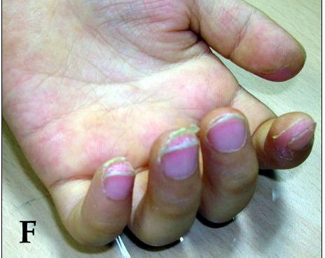
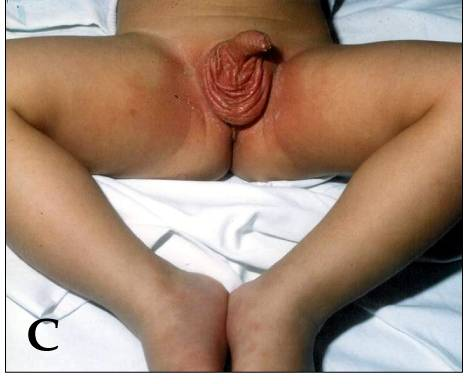
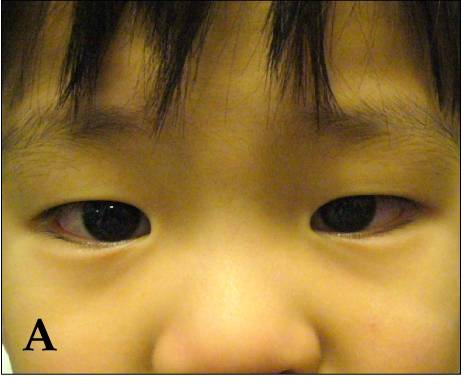
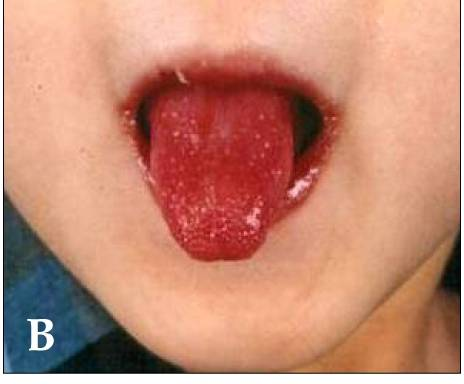
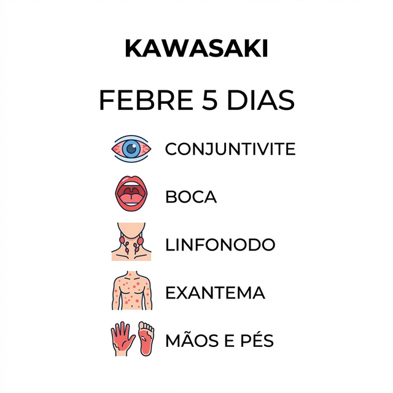
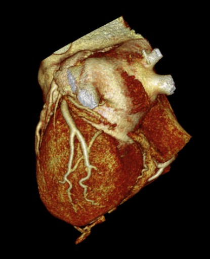

# DOENÇA DE KAWASAKI

A Doença de Kawasaki é uma vasculite sistêmica primária que acomete vasos de médio calibre. Se você quer entender essa patologia para a sua prova de residência e para a sua vida prática, a primeira coisa que precisa ter em mente é: ela é a principal causa de cardiopatia adquirida em crianças em países desenvolvidos e tem ganhado um destaque enorme no Brasil.

Por que um pediatra ou um médico generalista precisa saber isso com perfeição? Porque o diagnóstico é eminentemente clínico. Não existe um "Exame de Kawasaki" que você solicita e vem positivo ou negativo. O diagnóstico depende da sua capacidade de observar o paciente e somar critérios. Se você comer bola no diagnóstico, essa criança pode desenvolver um aneurisma de artéria coronária que mudará o prognóstico dela para sempre.

## Fisiopatologia: O Porquê dos Sintomas

Para entender o Kawasaki, imagine uma tempestade inflamatória. Embora a causa exata ainda seja discutida, a teoria mais aceita envolve uma resposta imunológica exagerada a um gatilho infeccioso (provavelmente viral ou bacteriano) em crianças geneticamente predispostas.

Aqui entra um conceito que as bancas adoram: os superantígenos. Diferente de um antígeno comum, que ativa apenas alguns clones de linfócitos T, os superantígenos (como os produzidos pelo Staphylococcus aureus ou Streptococcus pyogenes) ativam uma quantidade massiva de células T de forma inespecífica. Isso gera uma liberação brutal de citocinas pró-inflamatórias.

Essa inflamação ataca a parede dos vasos de médio calibre. Na fase aguda, temos uma pan-vasculite (inflamação de todas as camadas do vaso). O que acontece com um cano que está com a parede inflamada e enfraquecida? Ele dilata sob pressão. É exatamente assim que surgem os aneurismas coronarianos.

A evolução da doença costuma ser dividida em três fases:

- Fase Aguda (1 a 2 semanas): Febre alta e os critérios clínicos clássicos. É aqui que o bicho pega e onde devemos intervir.

- Fase Subaguda (2 a 4 semanas): A febre some, mas surge a descamação das extremidades e a trombocitose (aumento das plaquetas). É o período de maior risco para o surgimento dos aneurismas.

- Fase de Convalescença (6 a 8 semanas): Os sinais clínicos desaparecem e as provas inflamatórias (PCR e VHS) normalizam.

## Critérios Diagnósticos Clássicos

Como o Dr. Will sempre reforça nas discussões do MedEvo, a febre é o pilar central. Sem febre, você dificilmente fechará um diagnóstico de Kawasaki clássico.

A regra de ouro para a prova é: Febre persistente por pelo menos 5 dias, associada a pelo menos 4 dos 5 critérios abaixo.

### 1. Alterações nas Extremidades

Na fase aguda, você verá eritema (vermelhidão) e edema (inchaço) endurecido nas palmas das mãos e plantas dos pés. A criança chora quando você tenta calçar o sapato nela. Na fase subaguda (após 10 a 15 dias do início da febre), ocorre a descamação periungueal (ao redor das unhas), que pode se estender para toda a mão.

### 2. Exantema Polimorfo

O termo "polimorfo" significa que ele pode ter várias caras. Pode ser maculopapular (parecido com sarampo), urticariforme ou escarlatiniforme.
Cuidado: O exantema do Kawasaki NUNCA é bolhoso ou vesicular. Se houver bolhas, pense em outra coisa. Outra dica de ouro: o exantema costuma ser mais intenso na região perineal, onde pode haver descamação precoce.

### 3. Hiperemia Conjuntival Bilateral e Não Purulenta

Este é um detalhe que as bancas amam. A criança fica com os olhos bem vermelhos, mas não tem "remela". É uma injeção conjuntival bulbar que poupa a região ao redor da íris (limbo). Se tiver pus, desconfie de conjuntivite bacteriana ou adenovírus.

### 4. Alterações em Lábios e Cavidade Oral

Aqui temos o clássico "língua em framboesa" (eritematosa e com papilas proeminentes). Além disso, os lábios ficam vermelhos, rachados e podem sangrar. A orofaringe fica intensamente hiperemiada. Importante: não há exsudato amigdaliano nem úlceras (aftas). Se tiver afta, pense em estomatite herpética ou Coxsackie.

### 5. Linfonodomegalia Cervical

É o critério menos frequente. Geralmente é um linfonodo único, unilateral, localizado na cadeia cervical anterior e com diâmetro maior que 1,5 cm. Ele é endurecido e pouco doloroso. Se for bilateral e múltiplo, o diagnóstico de Kawasaki perde força.

Tabela 1: Resumo dos Critérios Diagnósticos (Sociedade Brasileira de Pediatria)

| Critério | Característica Principal | O que observar |
| --- | --- | --- |
| Febre | Obrigatória | Duração ≥ 5 dias, alta, persistente |
| Conjuntivite | Não purulenta | Bilateral, poupa o limbo |
| Oral | Língua em framboesa | Lábios fissurados e eritematosos |
| Extremidades | Edema/Eritema | Descamação periungueal tardia |
| Exantema | Polimorfo | Mais intenso em região perineal |
| Linfonodo | Cervical | > 1,5 cm, geralmente unilateral |

## Doença de Kawasaki Incompleta

Este é o grande desafio da prática e o prato cheio para questões de nível difícil. E se a criança tem febre há 5 dias, mas só apresenta 2 ou 3 critérios? Chamamos isso de Kawasaki Incompleto (não use o termo "atípico" para isso, atípico refere-se a sintomas incomuns como insuficiência renal).

O Kawasaki Incompleto é mais comum em lactentes (menores de 1 ano). E aqui vai um alerta: lactentes têm maior risco de aneurismas porque o diagnóstico costuma demorar.

Segundo a Academia Americana de Pediatria (AAP) e a SBP, se você tem uma criança com febre ≥ 5 dias e apenas 2 ou 3 critérios, você deve solicitar exames laboratoriais (PCR e VHS).

- Se PCR < 30 mg/L e VHS < 40 mm/h: Você observa e reavalia.

- Se PCR ≥ 30 mg/L ou VHS ≥ 40 mm/h: Você parte para os critérios suplementares.

Os critérios suplementares incluem:

- Albumina ≤ 3,0 g/dL.

- Anemia para a idade.

- Elevação de ALT (TGP).

- Plaquetas ≥ 450.000 (após o 7º dia).

- Leucocitose ≥ 15.000/mm³.

- Piúria estéril (leucocitúria ≥ 10/campo no sedimento urinário, mas com cultura negativa).

Se a criança tiver 3 ou mais desses critérios suplementares, você trata como Kawasaki. Se tiver menos, você pede um Ecocardiograma. Se o Eco vier positivo para alteração coronariana, você trata.

## Diagnóstico Diferencial: Não Confunda!

Muitas doenças na pediatria causam febre e exantema. O segredo é olhar para os detalhes que o Kawasaki NÃO tem.

- Escarlatina: Também tem língua em framboesa e exantema. Mas a escarlatina costuma ter exsudato nas amígdalas, sinal de Filatov (palidez perioral) e sinal de Pastia (acentuação do exantema nas dobras). Além disso, responde rápido à penicilina.

- Sarampo: Tem conjuntivite, mas ela é exsudativa (com secreção) e acompanhada de tosse, coriza e manchas de Koplik.

- Síndrome do Choque Tóxico Estafilocócico: Causa febre, rash e descamação, mas o paciente está chocado, hipotenso e com disfunção de múltiplos órgãos desde o início.

- Artrite Idiopática Juvenil (AIJ) Sistêmica: A febre é intermitente (picos diários), o exantema é evanescente (vai e vem com a febre) e há artrite real. No Kawasaki, pode haver artralgia, mas a febre é contínua.

### Kawasaki vs. SIM-P (Síndrome Inflamatória Multissistêmica Pediátrica)

Com a pandemia de COVID-19, surgiu a SIM-P. Ela se parece MUITO com o Kawasaki, mas existem diferenças cruciais que caem em prova:

- Idade: Kawasaki atinge crianças pequenas (< 5 anos). SIM-P atinge crianças maiores e adolescentes.

- Marcadores: Na SIM-P, o marcador de injúria miocárdica (Troponina e BNP) é muito mais alto.

- Sintomas GI: A SIM-P tem muita dor abdominal e diarreia, simulando um abdome agudo.

- Epidemiologia: Na SIM-P, há história de infecção por SARS-CoV-2 semanas antes.

## Exames Complementares e o Papel do Ecocardiograma

Lembre-se: nenhum exame laboratorial fecha o diagnóstico sozinho, mas eles ajudam a corroborar a suspeita e monitorar complicações.

- Hemograma: Na fase aguda, leucocitose com desvio à esquerda. Na fase subaguda (segunda semana), surge a trombocitose. Se você vir uma criança com 1 milhão de plaquetas e história de febre, pense em Kawasaki.

- Provas de Atividade Inflamatória: VHS e PCR ficam muito elevados. O VHS é um problema porque ele sobe naturalmente após o uso da Imunoglobulina, então para acompanhar a resposta ao tratamento, usamos o PCR.

- Ecocardiograma: É o exame padrão-ouro para avaliar as coronárias. Deve ser feito no diagnóstico, mas o tratamento NÃO deve ser atrasado à espera do exame se os critérios clínicos estiverem presentes.

As alterações no Eco podem ser:

- Ectasia (dilatação leve).

- Aneurismas (saculares ou fusiformes).

- Pericardite ou disfunção ventricular.

## Tratamento: O Tempo é Músculo (Cardíaco)

O objetivo principal do tratamento é reduzir a inflamação sistêmica e, principalmente, prevenir a formação de aneurismas de artéria coronária. Sem tratamento, cerca de 20 a 25% das crianças desenvolvem aneurismas. Com o tratamento adequado na fase aguda (até o 10º dia), esse risco cai para menos de 5%.

### 1. Imunoglobulina Humana Endovenosa (IGIV)

É a pedra angular do tratamento. A dose é de 2 g/kg, administrada em infusão única e lenta (10 a 12 horas).
Por que funciona? Ela modula a resposta imune, neutraliza citocinas e "acalma" a vasculite.
Janela de oportunidade: Deve ser administrada preferencialmente entre o 5º e o 10º dia de febre. Se o diagnóstico for feito após o 10º dia, mas a criança ainda tiver febre ou provas inflamatórias altas, você ainda deve fazer a IGIV.

### 2. Ácido Acetilsalicílico (AAS)

O uso do AAS no Kawasaki é clássico, mas as doses mudam conforme a fase.

- Fase Aguda (Anti-inflamatória): Doses altas. A SBP recomenda 80 a 100 mg/kg/dia, divididos em 4 doses. Algumas diretrizes internacionais sugerem doses menores (30 a 50 mg/kg/dia), mas para provas brasileiras, o "80 a 100" ainda é muito forte. Mantemos essa dose até a criança ficar afebril por 48 a 72 horas.

- Fase de Convalescença (Antiagregante): Após a febre ceder, reduzimos a dose para 3 a 5 mg/kg/dia, em dose única diária. Mantemos por 6 a 8 semanas. Se o ecocardiograma mostrar aneurismas, o AAS pode ser mantido indefinidamente.

Cuidado: Se a criança em uso de AAS contrair Influenza ou Varicela, há risco de Síndrome de Reye (insuficiência hepática aguda e encefalopatia). Nesses casos, suspendemos o AAS e substituímos por outro antiagregante, como o Clopidogrel.

### 3. Corticosteroides

Antigamente eram evitados, mas hoje sabemos que o uso de pulsoterapia com Metilprednisolona (30 mg/kg/dia por 3 dias) ou Prednisona oral pode ser indicado em pacientes de alto risco para resistência à IGIV ou em casos de vasculite grave.

Tabela 2: Esquema Terapêutico Padrão

| Medicamento | Dose na Fase Aguda | Dose na Fase Subaguda | Observação |
| --- | --- | --- | --- |
| IGIV | 2 g/kg (dose única) | Não se aplica | Fazer até o 10º dia |
| AAS | 80-100 mg/kg/dia | 3-5 mg/kg/dia | Risco de Síndrome de Reye |

## Manejo da Febre Persistente e Refratariedade

Cerca de 10 a 20% dos pacientes não respondem à primeira dose de IGIV (a febre persiste após 36 horas do término da infusão).
O que fazer?

- Repetir a IGIV (mais 2 g/kg).

- Se ainda assim não responder, usamos a pulsoterapia com corticoides.

- Em casos extremos, imunobiológicos como o Infliximabe (anti-TNF alfa) podem ser considerados.

## Complicações e Seguimento a Longo Prazo

A complicação mais temida, como já exaustivamente dito, é o aneurisma coronariano. Eles podem levar a trombose coronária e Infarto Agudo do Miocárdio (sim, infarto em crianças!).

O seguimento com ecocardiograma deve ser rigoroso:

- No diagnóstico.

- Com 1 a 2 semanas de doença.

- Com 4 a 6 semanas de doença.

Se houver aneurismas gigantes (> 8 mm), o risco de estenose e trombose é altíssimo, exigindo anticoagulação plena com Varfarina ou Heparina de baixo peso molecular, além do AAS.

Outra recomendação importante: Crianças que receberam IGIV não devem receber vacinas de vírus vivos atenuados (como Sarampo, Caxumba, Rubéola e Varicela) por um período de 11 meses. A imunoglobulina exógena pode interferir na resposta imunológica à vacina, tornando-a ineficaz.

## Pontos-Chave para Prova 💡

- Critério essencial: Febre por ≥ 5 dias (obrigatório para o Kawasaki clássico).

- Os 5 critérios clínicos: Conjuntivite não purulenta, alterações orais (língua em framboesa), exantema polimorfo, alterações nas extremidades (edema/eritema/descamação) e linfonodo cervical > 1,5 cm.

- Diagnóstico: Clínico. 4 dos 5 critérios + febre. Se tiver alteração coronariana no Eco, bastam 3 critérios + febre.

- Principal complicação: Aneurismas de artéria coronária (ocorre em 25% dos não tratados).

- Tratamento de escolha: IGIV (2 g/kg) + AAS em dose alta.

- Objetivo da IGIV: Prevenir aneurismas coronarianos. Deve ser feita preferencialmente até o 10º dia.

- Laboratório característico: Trombocitose marcante na fase subaguda (após a 2ª semana).

- Piúria estéril: É um achado comum e ajuda no diagnóstico de casos incompletos.

- Vacinação: Adiar vacinas de vírus vivos por 11 meses após o uso de IGIV.

- Síndrome de Reye: Risco associado ao uso de AAS durante infecção por Influenza ou Varicela.

- Kawasaki Incompleto: Comum em lactentes < 1 ano. Exige alto índice de suspeição e uso de critérios suplementares (albumina baixa, anemia, enzimas hepáticas altas).

- Diagnóstico Diferencial: Na SIM-P (pós-COVID), o paciente costuma ser mais velho, ter mais sintomas gastrointestinais e marcadores cardíacos (troponina) muito elevados.

- O que NÃO cai em prova, despenca: A conjuntivite do Kawasaki poupa a região perilímbica e não tem exsudato.

- Erro clássico: Achar que precisa de todos os critérios para tratar. Se a suspeita for alta e os exames sugerirem (Kawasaki incompleto), o tratamento deve ser iniciado para proteger o coração.

- O AAS na fase aguda é anti-inflamatório (dose alta); na fase crônica é antiagregante (dose baixa).

- A descamação das mãos e pés é periungueal e ocorre na fase subaguda, não no primeiro dia de febre.

 Cópia offline para consulta pessoal.
 Fonte original:
 [https://www.medevo.com.br/material-apoio/ler/16c8c72b-61c7-46b5-bc0f-6fab798f8812](https://www.medevo.com.br/material-apoio/ler/16c8c72b-61c7-46b5-bc0f-6fab798f8812)
