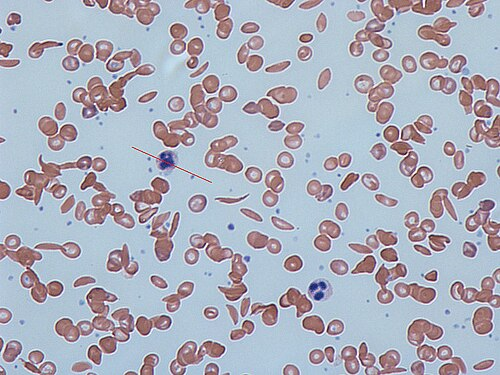
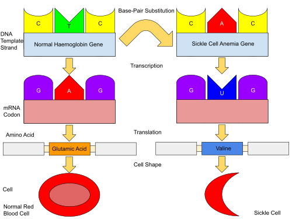

# DOENÇA FALCIFORME: TRIAGEM NEONATAL, CRISES E PROFILAXIAS

A doença falciforme não é apenas uma anemia, é uma doença multissistêmica de base genética, caracterizada por um estado inflamatório crônico e episódios agudos de vaso-oclusão. Para entender as questões de prova, você precisa visualizar o que acontece dentro do vaso: a hemoglobina S (HbS) polimeriza em situações de baixa tensão de oxigênio, mudando a conformação da hemácia para o formato de foice. Essa hemácia rígida não passa nos capilares, gera obstrução, isquemia tecidual e, consequentemente, dor e dano orgânico.

*Figura 1 - Microscopia de esfregaço sanguíneo mostrando hemácias em forma de foice características da doença falciforme. As células deformadas são rígidas e causam vaso-oclusão. Fonte: Dr Graham Beards, CC BY-SA 3.0 | Wikimedia Commons*

## Genética e Fisiopatologia: O Porquê da Doença

*Figura 2 - Diagrama demonstrando a mutação na posição 6 da cadeia beta: a substituição de adenina por timina no DNA resulta em troca de ácido glutâmico por valina na hemoglobina, causando a polimerização da HbS quando desoxigenada. Fonte: MapleDragon123, CC BY-SA 4.0 | Wikimedia Commons*

A herança é autossômica recessiva. Isso significa que, para ter a doença (HbSS), a criança deve herdar um gene "S" do pai e um da mãe. Se herdar apenas um, ela terá o Traço Falciforme (HbAS), que é uma condição benigna e assintomática na imensa maioria dos casos.

A mutação ocorre na cadeia beta da hemoglobina, onde o aminoácido ácido glutâmico é substituído pela valina na posição 6. Essa troca muda a polaridade da molécula. Quando a HbS libera o oxigênio nos tecidos, ela se agrupa em polímeros longos que deformam a célula.

Aqui entra um conceito que o MedEvo sempre reforça: a hemólise na anemia falciforme é predominantemente extravascular (no baço), mas também ocorre um componente intravascular importante. A liberação de hemoglobina livre no plasma consome óxido nítrico, um potente vasodilatador. Menos óxido nítrico significa mais vasoconstrição e mais adesão celular, fechando o ciclo da crise vaso-oclusiva.

## Triagem Neonatal: Interpretando o Teste do Pezinho

O diagnóstico precoce pelo Programa Nacional de Triagem Neonatal (PNTN) mudou a história natural da doença no Brasil. O exame utiliza a eletroforese de hemoglobina ou HPLC. A ordem das letras no resultado indica a quantidade relativa de cada hemoglobina (a primeira letra é a que existe em maior quantidade).

No recém-nascido, a hemoglobina predominante é a Fetal (HbF). Por isso, o "F" sempre virá primeiro.

### Padrões de Hemoglobina na Triagem

| Resultado | Interpretação | Conduta |
| --- | --- | --- |
| **Hb FA** | Recém-nascido normal (Hb Fetal + Hb Adulta) | Seguimento de rotina |
| **Hb FAS** | Traço Falciforme (Portador) | Aconselhamento genético aos pais; não é doença |
| **Hb FS** | Provável Anemia Falciforme (SS ou S-beta zero) | Repetir exame após 4 meses; iniciar profilaxias |
| **Hb FSC** | Doença SC (Hemoglobinopatia SC) | Acompanhamento especializado; risco de retinopatia |
| **Hb FSA** | S-beta talassemia | Acompanhamento especializado |

**Dica de prova:** Se a alternativa trouxer Hb FAS, a criança é saudável. Ela não tem anemia, não tem crise de dor e não precisa de penicilina. O erro clássico é tratar o portador do traço como se fosse doente. O traço falciforme inclusive confere proteção contra as formas graves de malária, o que explica a pressão seletiva para a manutenção desse gene na população.

## Manifestações Iniciais e a Asplenia Funcional

Por que os sintomas não aparecem logo ao nascimento? Porque o recém-nascido é protegido pela Hemoglobina Fetal (HbF). A HbF não polimeriza e impede que a HbS o faça. Os sintomas costumam surgir após os 4 a 6 meses de vida, quando os níveis de HbF caem e a HbS assume o protagonismo.

A primeira manifestação clínica clássica, muito cobrada em provas, é a **Dactilite Falciforme** (ou síndrome mão-pé). Ocorre em lactentes (6 meses a 2 anos) e se caracteriza por edema doloroso, calor e eritema no dorso das mãos e dos pés. É uma crise vaso-oclusiva da medula óssea dos ossos curtos. O tratamento é hidratação e analgesia potente.

Outro ponto crítico é o baço. Devido aos constantes episódios de microinfartos esplênicos por vaso-oclusão, a criança desenvolve **Asplenia Funcional** precocemente (geralmente até os 5 anos). O baço para de filtrar bactérias, tornando o paciente extremamente vulnerável a germes encapsulados, especialmente o *Streptococcus pneumoniae* (Pneumococo) e o *Haemophilus influenzae* tipo b.

## Crises Hematológicas Agudas: O Diagnóstico Diferencial

Este é o tópico favorito das bancas. Você precisa diferenciar rapidamente por que a hemoglobina de um paciente falcêmico caiu subitamente.

### 1. Crise de Sequestro Esplênico

É uma emergência pediátrica gravíssima. O sangue fica "preso" no baço de forma súbita.

- **Quadro:** Criança < 5 anos (que ainda tem baço funcionante), palidez súbita, taquicardia, hipotensão e um **baço gigante** (esplenomegalia aguda) que não estava lá antes.

- **Laboratório:** Queda acentuada da Hb + **Reticulocitose** (a medula está tentando compensar).

- **Tratamento:** Expansão volêmica cautelosa e transfusão de hemácias (em volume menor que o habitual, pois o sangue sequestrado pode retornar à circulação e causar hiperviscosidade). Após o primeiro episódio, há indicação de esplenectomia eletiva.

### 2. Crise Aplástica

Aqui o problema é na "fábrica" (medula óssea).

- **Causa:** Infecção pelo **Parvovírus B19**, que infecta os precursores eritroides.

- **Quadro:** Palidez e astenia progressiva, sem esplenomegalia nova.

- **Laboratório:** Queda da Hb + **Reticulocitopenia** (reticulócitos próximos a zero).

- **Tratamento:** Transfusão de hemácias e suporte. A medula costuma recuperar em 7 a 10 dias.

### 3. Crise Hemolítica

Menos comum de forma isolada. Geralmente associada a infecções ou deficiência de G6PD concomitante.

- **Quadro:** Icterícia súbita, colúria.

- **Laboratório:** Queda da Hb + Reticulocitose + Aumento de Bilirrubina Indireta.

| Característica | Sequestro Esplênico | Crise Aplástica |
| --- | --- | --- |
| **Baço** | Aumentado (Esplenomegalia) | Inalterado |
| **Reticulócitos** | Elevados (Reticulocitose) | Baixos (Reticulocitopenia) |
| **Gravidade** | Choque hipovolêmico rápido | Anemia sintomática progressiva |
| **Etiologia** | Vaso-oclusão esplênica | Parvovírus B19 |

## Crises Vaso-Oclusivas e Síndrome Torácica Aguda

A dor é a marca registrada da doença. As crises álgicas podem ocorrer em qualquer lugar: ossos, abdome (simulando abdome agudo), tórax.

**Manejo da Dor:** Segundo as diretrizes da SBP e do Ministério da Saúde, a dor deve ser tratada de forma agressiva.

- Hidratação: Apenas manutenção (1x a necessidade basal). **Nunca hiper-hidratar**, pois aumenta o risco de Síndrome Torácica Aguda.

- Analgesia: Escada da OMS. Começa com dipirona/AINEs, mas não tenha medo dos opioides (morfina) se a dor for moderada a grave.

### Síndrome Torácica Aguda (STA)

É a principal causa de morte e de internação em UTI. É definida como um **novo infiltrado pulmonar na radiografia de tórax** associado a pelo menos um dos seguintes: febre, dor torácica, tosse, taquipneia ou hipoxemia.

**Por que acontece?** Pode ser por infecção, infarto pulmonar ou embolia gordurosa (da medula óssea infartada).
**Tratamento da STA:**

- Antibioticoterapia de amplo espectro: Deve cobrir germes comuns e atípicos (ex: Ceftriaxona + Claritromicina/Azitromicina).

- Oxigenioterapia: Se saturação < 94%.

- Transfusão de hemácias: Transfusão simples ou exsanguíneotransfusão (troca) se o quadro for grave ou progressivo.

- Fisioterapia respiratória (incentivador inspiratório): Fundamental para evitar atelectasias.

## Acidente Vascular Cerebral (AVC)

O AVC é uma complicação devastadora, ocorrendo principalmente em crianças entre 2 e 10 anos. Na maioria das vezes é isquêmico (por estenose das grandes artérias cerebrais).

**Prevenção:** O Doppler Transcraniano (DTC) deve ser realizado anualmente em todas as crianças com HbSS ou S-beta zero, dos 2 aos 16 anos.

- Se o Doppler for alterado (velocidade de fluxo > 200 cm/s), a criança deve entrar em regime de **transfusão crônica** para manter a HbS < 30%. Isso reduz drasticamente o risco de um primeiro AVC.

**Manejo do AVC agudo:** A conduta de escolha é a **Exsanguíneotransfusão parcial de urgência**. O objetivo é reduzir rapidamente a porcentagem de HbS e melhorar a perfusão cerebral sem aumentar excessivamente a viscosidade sanguínea.

## O Manejo da Febre: Uma Emergência Médica

Como o Dr. Will sempre enfatiza em suas discussões clínicas, febre em paciente com anemia falciforme é "sepse até que se prove o contrário". Devido à asplenia funcional, a progressão para choque séptico por pneumococo pode ocorrer em poucas horas.

**Conduta obrigatória:**

- Toda criança falcêmica com febre (T > 38,3°C ou 38,5°C dependendo do protocolo) deve ser avaliada imediatamente.

- Coleta de exames: Hemograma, reticulócitos, hemocultura e urina 1.

- **Antibioticoterapia parenteral imediata:** Não espere os resultados dos exames. A primeira dose de Ceftriaxona deve ser feita na primeira hora (Golden Hour).

- Critérios de internação: Idade < 1 ano, febre alta (> 39°C-40°C), aparência toxêmica, leucocitose importante (> 30.000) ou leucopenia, desidratação ou histórico de sepse prévia.

## Profilaxias e Tratamento de Manutenção

O tratamento da doença falciforme baseia-se em evitar que as crises aconteçam.

### 1. Penicilina Oral (Profilaxia Antibiótica)

Deve ser iniciada assim que o diagnóstico é confirmado (idealmente até os 3 meses de vida) e mantida, no mínimo, até os 5 anos de idade.

- Droga: Penicilina V oral (ou Benzetacil de 21 em 21 dias se a adesão for ruim).

- Objetivo: Reduzir a mortalidade por sepse pneumocócica.

### 2. Imunização Especial

Além das vacinas do calendário básico, o falcêmico precisa de reforços e vacinas especiais (CRIE):

- Pneumocócica 13-valente e 23-valente.

- Meningocócica ACWY e B.

- Haemophilus influenzae tipo b (reforço).

- Influenza anual.

### 3. Ácido Fólico

Como há uma hemólise crônica, a medula óssea trabalha em ritmo acelerado e consome muito folato. A suplementação (1 a 5 mg/dia) é necessária para evitar a anemia megaloblástica sobreposta.

### 4. Hidroxiureia

É o "divisor de águas" no tratamento. A hidroxiureia aumenta a produção de **Hemoglobina Fetal (HbF)**. Com mais HbF, há menos polimerização da HbS, menos crises de dor, menos internações e maior sobrevida.

- **Indicações principais:** ≥ 3 crises álgicas graves por ano, histórico de STA, AVC prévio (se não puder transfundir), anemia grave sintomática.

- **Monitoramento:** Pode causar neutropenia e trombocitopenia, por isso exige hemogramas frequentes.

### 5. Quelantes de Ferro

Pacientes em regime de transfusão crônica (como os que tiveram AVC) desenvolvem sobrecarga de ferro (hemossiderose). O ferro se deposita no fígado, coração e glândulas endócrinas. O uso de quelantes (como o Deferasirox) é indicado quando a ferritina ultrapassa níveis críticos (geralmente > 1.000 ng/mL).

## Diagnósticos Diferenciais Importantes

Ao atender uma criança com anemia e icterícia, nem tudo é falciforme.

- **Esferocitose Hereditária:** Anemia, icterícia e esplenomegalia. O teste de fragilidade osmótica estará alterado. O Coombs é negativo.

- **Deficiência de G6PD:** Hemólise aguda após estresse oxidativo (infecção ou uso de sulfas/naftalina). Presença de Corpúsculos de Heinz no sangue periférico.

- **Osteomielite vs. Infarto Ósseo:** Diferenciar é difícil. Ambos causam dor, febre e edema. Na osteomielite, a febre é mais persistente e a dor não melhora com o tempo. O agente mais comum na falciforme é a **Salmonella**, seguida pelo *Staphylococcus aureus*.

## Situações Especiais e Complicações Crônicas

- **Colelitíase:** Muito comum devido à hemólise crônica (cálculos de bilirrubinato de cálcio). Se houver dor biliar, a colecistectomia eletiva é indicada.

- **Priapismo:** Ereção dolorosa e persistente. É uma emergência urológica (vaso-oclusão no corpo cavernoso). Pode levar à impotência se não tratada com hidratação, analgesia e, às vezes, aspiração local.

- **Nefropatia:** A medula renal é hipóxica e ácida, ambiente perfeito para a foicização. Isso causa isquemia, perda da capacidade de concentrar a urina (isostenúria) e hematúria indolor.

| Complicação | Manejo Principal |
| --- | --- |
| **Dactilite** | Analgesia + Hidratação |
| **Crise de Sequestro** | Transfusão de urgência + Esplenectomia posterior |
| **STA** | ATB (Ceftriaxona + Macrolídeo) + O2 + Fisioterapia |
| **AVC** | Exsanguíneotransfusão parcial |
| **Priapismo** | Hidratação + Analgesia + Avaliação Urológica |
| **Febre** | ATB venoso imediato (Ceftriaxona) |

## Pontos-Chave para Prova

- **Triagem Neonatal:** Hb FS é doença (SS ou S-beta zero); Hb FAS é traço (portador saudável).

- **Dactilite:** Primeira manifestação clínica, ocorre em lactentes, tratamento é suporte.

- **Crise de Sequestro Esplênico:** Baço cresce + Hb cai + Reticulócitos sobem. Risco de choque.

- **Crise Aplástica:** Parvovírus B19. Hb cai + Reticulócitos ZERO.

- **Síndrome Torácica Aguda:** Novo infiltrado no Raio-X + Sintoma respiratório/febre. ATB deve cobrir atípicos.

- **Hidratação na Crise:** Nunca hiper-hidratar. Manter 1x a necessidade basal para evitar edema pulmonar e STA.

- **Febre:** Emergência médica. Iniciar Ceftriaxona IV na primeira hora após coleta de culturas.

- **Profilaxia com Penicilina:** Dos 3 meses aos 5 anos de idade (obrigatório).

- **Doppler Transcraniano:** Anual, dos 2 aos 16 anos, para rastrear risco de AVC.

- **Hidroxiureia:** Aumenta Hb Fetal. Indicada em crises frequentes ou graves.

- **Osteomielite:** Salmonella é o agente clássico cobrado, mas S. aureus também é frequente.

- **Anemia na Falciforme:** Geralmente é normocítica e normocrômica com reticulocitose basal (o paciente vive com Hb entre 7 e 9 g/dL).

- **Transfusão:** Não se transfunde para "normalizar" a hemoglobina, mas sim para tratar complicações graves (STA, AVC, Sequestro) ou anemia sintomática.

- **Contraindicação Absoluta:** Não usar corticoides de forma rotineira em crises álgicas, pois estão associados a crises de rebote graves.

- **Erro Comum:** Achar que toda esplenomegalia em falcêmico é sequestro. Lembre-se que crianças pequenas têm esplenomegalia basal pela hemólise; o sequestro é um aumento **agudo** e doloroso associado à queda da Hb. 💉

Este guia consolida o que há de mais frequente e importante nas provas de residência. Entender a fisiopatologia da vaso-oclusão e da asplenia funcional é a chave para não errar nenhuma questão sobre o manejo dessas crianças.

 Cópia offline para consulta pessoal.
 Fonte original:
 [https://www.medevo.com.br/material-apoio/ler/9f997827-eebe-490d-bba3-635c5162c254](https://www.medevo.com.br/material-apoio/ler/9f997827-eebe-490d-bba3-635c5162c254)
