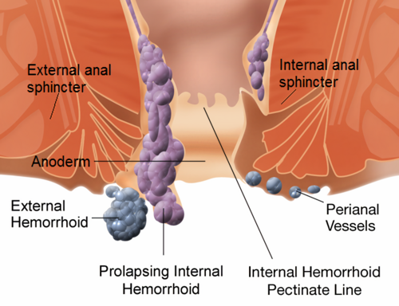
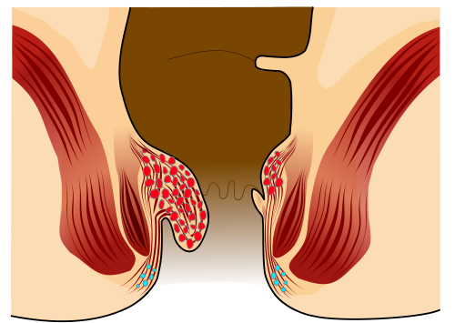

# DOENÇA HEMORROIDÁRIA

Para entender a doença hemorroidária, a primeira coisa que você precisa fazer é esquecer a ideia de que hemorroidas são "varizes do ânus". Se você levar esse conceito para a prova, vai errar questões de fisiopatologia. As hemorroidas são, na verdade, **coxins vasculares** normais do canal anal. Todos nós nascemos com eles. Eles são compostos por tecido conjuntivo, fibras musculares (músculo de Treitz) e comunicações arteriovenosas.

A função desses coxins é nobre: eles ajudam na continência anal fina, agindo como "almofadas" que vedam o canal anal. O problema — a **doença** hemorroidária — surge quando esses coxins se deslocam para baixo, inflamam ou trombosam.

## Anatomia e Fisiopatologia: O Porquê da Doença

*Figura 1 - Diagrama anatômico do canal anal mostrando a localização das hemorroidas internas (acima da linha pectínea, mucosa) e externas (abaixo da linha pectínea, anoderme). Fonte: WikipedianProlific & Mikael Häggström, CC BY-SA 3.0 | Wikimedia Commons*

A linha pectínea é o seu principal marco anatômico. Ela divide o canal anal em dois mundos completamente diferentes:

- **Acima da linha pectínea:** Revestimento por mucosa (epitélio colunar), inervação visceral (autonômica). Aqui moram as **hemorroidas internas**. Como a inervação é visceral, elas **não doem**, a menos que haja uma complicação grave. O sintoma clássico aqui é o sangramento indolor.

- **Abaixo da linha pectínea:** Revestimento por anoderme (epitélio escamoso ricamente inervado), inervação somática. Aqui moram as **hemorroidas externas**. Como a inervação é somática, qualquer corte ou trombose aqui dói — e dói muito.

A teoria mais aceita para explicar a doença é a **Teoria do Deslizamento dos Coxins Anais** (Teoria de Parks). Com o tempo, o esforço evacuatório crônico, a gravidez ou o envelhecimento levam à fragmentação dos tecidos de sustentação (ligamento de Parks). O coxim "escorrega" para fora do canal anal.

**Dica de Prova:** As bancas adoram perguntar a localização anatômica clássica. Os coxins costumam estar em três posições principais (olhando o paciente em posição de litotomia): lateral esquerda, anterolateral direita e posterolateral direita.

## Classificação das Hemorroidas Internas

*Figura 2 - Representação esquemática de hemorroida interna Grau II segundo classificação de Goligher, com prolapso durante a evacuação que reduz espontaneamente. Fonte: Armin Kübelbeck, CC BY 3.0 | Wikimedia Commons*

Esta é a parte mais cobrada em provas de residência. A classificação de Goligher foca exclusivamente no grau de **prolapso** das hemorroidas internas. Note que as hemorroidas externas não entram nesta gradação de I a IV.

| Grau | Descrição do Prolapso | Conduta Típica |
| --- | --- | --- |
| **Grau I** | Sem prolapso. Apenas sangramento. | Conservador (Dieta/Fibras) |
| **Grau II** | Prolapso com a evacuação, mas **reduz espontaneamente**. | Conservador ou Ligadura Elástica |
| **Grau III** | Prolapso que exige **redução manual** (o paciente precisa empurrar de volta). | Ligadura Elástica ou Cirurgia |
| **Grau IV** | Prolapso **irredutível** ou permanentemente exteriorizado. | Cirurgia (Hemorroidectomia) |

**Cuidado com a pegadinha:** O toque retal é fundamental para avaliar o tônus do esfíncter, procurar massas ou fecalomas, mas ele **não palpa hemorroidas internas de Grau I**. Elas são moles e colabam à pressão do dedo. Para diagnosticá-las, você precisa de uma anuscopia.

## Quadro Clínico e Diagnóstico

O paciente clássico chega ao consultório com uma queixa de **sangramento vermelho vivo, indolor**, que ocorre ao final da evacuação (pinga no vaso ou suja o papel).

Se o paciente relatar dor intensa, você deve pensar em duas coisas:

- **Trombose hemorroidária:** Uma complicação aguda.

- **Fissura anal:** O diagnóstico diferencial número um. Na fissura, a dor ocorre *durante* a evacuação e persiste por horas. Na hemorroida não complicada, a dor é rara.

### O Exame Físico

O exame deve ser feito em posição de Sims (decúbito lateral esquerdo) ou genupeitoral.

- **Inspeção:** Procure por mamilos externos, plicomas (excessos de pele que sobraram de inflamações prévias) ou prolapsos.

- **Toque Retal:** Essencial para excluir câncer de reto baixo e avaliar a próstata. Lembre-se: o toque não alcança a transição retossigmoide.

- **Anuscopia:** O padrão-ouro para visualizar hemorroidas internas e classificar o grau.

**Atenção ao Risco de Neoplasia:** Se o paciente tem mais de 45-50 anos (ou sinais de alarme como perda de peso e alteração do hábito intestinal), o sangramento anal não deve ser atribuído apenas às hemorroidas sem antes realizar uma **Colonoscopia**. Como o Dr. Will sempre reforça em suas discussões, "nem tudo que sangra no ânus é hemorroida". O Antígeno Carcinoembrionário (CEA) não serve para diagnóstico inicial, mas sim para acompanhamento pós-operatório de câncer colorretal.

## Diagnóstico Diferencial: Não confunda!

| Patologia | Característica da Dor | Achado ao Exame |
| --- | --- | --- |
| **Hemorroida Interna** | Indolor (exceto se Grau IV com isquemia) | Sangramento vivo, prolapso |
| **Fissura Anal** | Dor lancinante à evacuação ("passar cacos de vidro") | Úlcera linear, geralmente na linha média posterior |
| **Abscesso Perianal** | Dor contínua, pulsátil, progressiva | Massa flutuante, calor, rubor, febre |
| **Ectasia Vascular** | Indolor | Comum em idosos, sangramento colônico direito |

## Tratamento: Do Conservador ao Cirúrgico

O tratamento sempre começa pelo básico, a menos que o paciente já chegue com um Grau IV complicado.

### 1. Tratamento Conservador (MEV)

Indicado para todos os graus, mas é a base do Grau I e II.

- **Fibras:** 25 a 35g por dia. Isso aumenta o volume fecal e amolece as fezes, reduzindo o esforço.

- **Hidratação:** Mínimo de 2 litros de água/dia. Fibra sem água vira "cimento" no intestino.

- **Higiene:** Evitar papel higiênico (trauma mecânico). Usar ducha ou banhos de assento com água morna (promove relaxamento do esfíncter).

- **Tempo no vaso:** Orientar o paciente a não ficar sentado lendo ou no celular. A posição sentada com o assoalho pélvico relaxado favorece o ingurgitamento dos coxins.

### 2. Procedimentos de Consultório (Ambulatoriais)

Indicados para Graus I, II e alguns casos selecionados de Grau III que não querem cirurgia.

- **Ligadura Elástica:** É o método mais popular e eficaz. Um anel elástico é colocado na base da hemorroida interna (acima da linha pectínea). Isso causa isquemia, necrose e queda do mamilo em 7-10 dias.

- **Cuidado:** Nunca ligue abaixo da linha pectínea. A dor será insuportável e imediata.

- **Escleroterapia:** Injeção de substâncias esclerosantes. Menos eficaz que a ligadura a longo prazo.

### 3. Tratamento Cirúrgico (Hemorroidectomia)

As indicações clássicas são: falha do tratamento conservador, hemorroidas Grau III e IV, ou hemorroidas externas sintomáticas.

Existem duas técnicas principais que você precisa conhecer para a prova:

- **Milligan-Morgan (Aberta):** Os mamilos são ressecados e as feridas cirúrgicas são deixadas **abertas** para cicatrizar por segunda intenção. É a técnica mais utilizada no Brasil.

- **Ferguson (Fechada):** Os mamilos são ressecados e a mucosa/anoderme é **suturada** (fechada). Teoricamente, dói menos e cicatriza mais rápido, mas tem maior risco de deiscência de sutura e infecção.

**Técnicas Alternativas:**

- **PPH (Grampeamento):** Um grampeador circular resseca uma "faixa" de mucosa acima da linha pectínea e "puxa" as hemorroidas de volta para dentro (anopexia).

- **Vantagem:** Muito menos dor pós-operatória, pois não há cortes na anoderme (área sensível).

- **Desvantagem:** Não trata hemorroidas externas e tem maior taxa de recorrência do prolapso.

- **THD (Desarterialização):** Identifica as artérias hemorroidárias por Doppler e faz a ligadura alta. Também dói menos.

## Complicações Pós-Operatórias: O Terror do Residente

As bancas amam cobrar o que acontece *depois* da cirurgia.

- **Retenção Urinária Aguda:** É a complicação precoce mais comum. Ocorre por espasmo reflexo do esfíncter uretral devido à dor ou excesso de fluidos na raquianestesia.

- **Conduta:** Cateterismo vesical de alívio e controle da dor.

- **Dor Pós-Operatória:** O grande desafio. O manejo envolve analgésicos potentes, anti-inflamatórios, banhos de assento e laxantes para evitar fezes endurecidas.

- **Sangramento Secundário:** Ocorre geralmente entre o 7º e o 14º dia pós-op. Por que? É o momento em que a escara cicatricial (ou o ponto) se solta. Se for um sangramento volumoso com instabilidade, a conduta é reabordagem cirúrgica e ligadura por sutura.

- **Estenose Anal:** Uma complicação **tardia**. Ocorre quando o cirurgião resseca pele demais entre os mamilos (as chamadas "pontes cutâneas"). Sem pele suficiente, o ânus não dilata.

- **Incontinência Anal:** Rara, geralmente associada a lesão inadvertida do esfíncter interno.

## Situações Especiais e Urgências

### Trombose Hemorroidária Externa

O paciente chega com uma "bolinha" roxa, endurecida e muito dolorosa no ânus, de início súbito (geralmente após esforço).

- **Se < 72 horas:** Pode-se realizar a **trombectomia** ou excisão do mamilo trombosado em consultório com anestesia local. O alívio é imediato.

- **Se > 72 horas:** O edema já está diminuindo e o trombo começando a organizar. A conduta passa a ser conservadora (analgesia, banho de assento), pois o risco de sangramento da ferida cirúrgica não compensa o benefício.

### Crise Hemorroidária (Hemorroida Grau IV Estrangulada)

É o prolapso circular, com edema massivo e risco de necrose.

- A conduta inicial costuma ser conservadora: repouso, gelo local (para reduzir o edema), banhos de assento e analgesia.

- A **hemorroidectomia de urgência** é reservada para casos de necrose franca ou quando o tratamento clínico falha em reduzir o sofrimento do paciente.

### Gestantes

A doença hemorroidária é muito comum na gestação devido à pressão do útero sobre a veia cava e às alterações hormonais.

- **Regra de ouro:** O tratamento é quase sempre **conservador**. A cirurgia é evitada ao máximo, sendo reservada apenas para complicações graves e intratáveis, preferencialmente após o parto.

## Anatomia do Reto: Um detalhe importante

Lembre-se das **Valvas de Houston**. São três pregas transversais no reto:

- Superior: Esquerda.

- Média: Direita (é a mais proeminente e marca o nível do fundo de saco de Douglas).

- Inferior: Esquerda.
Isso cai em questões de anatomia cirúrgica e endoscopia.

## Resumo de Condutas por Cenário Clínico

| Cenário | Conduta de Escolha |
| --- | --- |
| Grau I com sangramento | Dieta rica em fibras + Hidratação |
| Grau II que falhou na dieta | Ligadura Elástica |
| Grau III sintomático | Hemorroidectomia ou PPH (se apenas prolapso) |
| Grau IV irredutível | Hemorroidectomia (Milligan-Morgan ou Ferguson) |
| Trombose externa < 72h | Excisão/Trombectomia local |
| Sangramento volumoso pós-op | Reabordagem cirúrgica e sutura |
| Retenção urinária pós-op | Cateterismo de alívio |

Este material, focado na metodologia MedEvo, cobre os pontos de maior incidência. Lembre-se que a chave da questão muitas vezes está em diferenciar o grau do prolapso e identificar se a dor descrita é compatível com hemorroida ou se sugere outra patologia orificial.

## Pontos-Chave para Prova 💡

- **Fisiopatologia:** A causa principal é o deslizamento dos coxins anais devido à degeneração do tecido de sustentação (Ligamento de Parks).

- **Hemorroida Interna Grau III:** É aquela que prolapsa e **exige redução manual**. É a "queridinha" das questões de indicação cirúrgica.

- **Hemorroida Interna Grau IV:** Prolapso persistente e irredutível. A conduta definitiva é a hemorroidectomia.

- **Hemorroidectomia Aberta (Milligan-Morgan):** Técnica mais comum; feridas deixadas abertas para cicatrizar por segunda intenção.

- **Hemorroidectomia Fechada (Ferguson):** Feridas são suturadas. Menor dor teórica, mas risco de deiscência.

- **PPH (Grampeamento):** Indicado para prolapsos internos (Grau III). **Vantagem:** Menor dor pós-operatória. **Contraindicação:** Não trata componentes externos.

- **Ligadura Elástica:** Procedimento de escolha para Graus I e II que falharam no tratamento clínico. **Proibido** abaixo da linha pectínea.

- **Complicação Precoce mais comum:** Retenção urinária aguda (especialmente após raquianestesia e manejo inadequado de dor).

- **Complicação Tardia:** Estenose anal (por ressecção excessiva de pontes cutâneas).

- **Sangramento Pós-Operatório (7-14 dias):** Geralmente por queda da escara cicatricial. Se grave, requer sutura no bloco.

- **Diferencial de Dor:** Hemorroida interna não dói. Se houver dor intensa à evacuação, pense primeiro em **Fissura Anal**.

- **Fissura Anal Crônica:** O tratamento cirúrgico de escolha é a **Esfincterotomia Lateral Interna** (ELI), visando reduzir a hipertonia do esfíncter.

- **Trombose Externa:** Se o paciente chegar com menos de 72h de dor, a trombectomia/excisão local é a melhor conduta.

- **Colonoscopia:** Sempre obrigatória em pacientes com sangramento e idade > 45-50 anos ou sinais de alarme, para excluir neoplasia.

- **Abscesso Perianal:** É uma urgência cirúrgica. A conduta é **Drenagem Imediata** + Antibióticos se houver celulite ou comorbidades.

- **O que NÃO fazer:** Não indicar cirurgia para hemorroidas Grau I sem antes tentar fibras e água. Não fazer ligadura elástica em hemorroidas externas.

 Cópia offline para consulta pessoal.
 Fonte original:
 [https://www.medevo.com.br/material-apoio/ler/9ce9c18a-d901-43b2-a979-7bd004fe75d8](https://www.medevo.com.br/material-apoio/ler/9ce9c18a-d901-43b2-a979-7bd004fe75d8)
