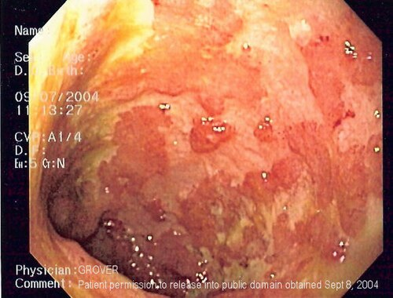

# DOENÇA INFLAMATÓRIA INTESTINAL

Para entender as Doenças Inflamatórias Intestinais (DII), você precisa primeiro esquecer a ideia de que elas são apenas "diarreias graves". O que estamos tratando aqui é uma falha catastrófica na diplomacia entre o sistema imune e a microbiota intestinal em indivíduos geneticamente predispostos.

Nas provas de residência, o examinador não quer apenas que você saiba o nome do remédio; ele quer que você saiba diferenciar se aquela úlcera na colonoscopia vai levar o paciente para a mesa de cirurgia ou para uma terapia biológica de manutenção. Vamos dissecar a Retocolite Ulcerativa (RCU) e a Doença de Crohn (DC) sob a ótica de quem decide condutas no dia a dia.

## Fisiopatologia: O Porquê da Inflamação

*Figura 1 - Comparação dos padrões de acometimento intestinal entre Doença de Crohn (pode afetar qualquer segmento, lesões salteadas e transmurais) e Retocolite Ulcerativa (restrita ao cólon, contínua desde o reto, superficial). Fonte: Samir/Fvasconcellos, CC BY-SA 3.0 | Wikimedia Commons*

Por que o corpo ataca o próprio intestino? A resposta curta é: perda de tolerância. Em um indivíduo saudável, o sistema imune ignora as bactérias comensais. Na DII, há um gatilho ambiental (como o tabagismo ou uso de AINEs) que quebra a barreira mucosa.

Na Doença de Crohn, temos uma forte associação com o receptor **NOD2 (CARD15)**. Guarde esse nome. Esse receptor deveria reconhecer componentes bacterianos; quando ele falha, a resposta imune se torna descontrolada e Th1/Th17 mediada, gerando o famoso **granuloma não caseoso**.

Já na RCU, a resposta é mais voltada para o padrão Th2. A grande diferença prática que você deve levar para a vida: na RCU a inflamação é **superficial (mucosa e submucosa)** e contínua; na DC, ela é **transmural** (atravessa todas as camadas), o que explica por que a DC faz fístula e a RCU não.

## Retocolite Ulcerativa (RCU): O Inimigo Previsível

*Figura 2 - Aspecto endoscópico da Retocolite Ulcerativa mostrando mucosa eritematosa, friável (sangra ao toque), com perda do padrão vascular e ulcerações superficiais contínuas. Fonte: Sebb, CC BY-SA 3.0 | Wikimedia Commons*

A RCU é uma doença "educada" no sentido de que ela segue regras anatômicas. Ela começa no reto e sobe de forma **contínua e simétrica** pelo cólon. Se o reto estiver normal na colonoscopia, desconfie fortemente do diagnóstico de DC.

### Quadro Clínico e Classificação

O paciente clássico chega com diarreia mucosanguinolenta, tenesmo (aquela vontade constante de evacuar mesmo com o reto vazio) e dor abdominal em cólica.

Para a prova, você precisa dominar os **Critérios de Truelove e Witts** para avaliar a gravidade do surto, pois isso muda sua conduta imediata:

| Parâmetro | Leve | Grave (Fulminante) |
| --- | --- | --- |
| Evacuações/dia | < 4 | > 6 + sinais sistêmicos |
| Sangue nas fezes | Pequeno/Ausente | Visível/Acentuado |
| Febre | Ausente | > 37,8 °C |
| Taquicardia | Ausente | > 90 bpm |
| Hemoglobina | > 11,5 g/dL | < 10,5 g/dL |
| VHS | < 30 mm/h | > 30 mm/h |

**Pérola clínica:** Se o paciente tem RCU grave, o primeiro passo não é dar biológico, é internar, hidratar e iniciar **corticoide venoso** (Metilprednisolona 40-60mg/dia). Se ele não responder em 3 a 5 dias, aí pensamos em terapia de resgate com Ciclosporina ou Infliximabe.

### Diagnóstico e Achados

Na colonoscopia, você verá uma mucosa friável (sangra ao toque do aparelho), perda do padrão vascular e ulcerações superficiais. No histopatológico, o termo que as bancas amam é **"criptite"** ou abscessos de criptas. Lembre-se: na RCU não há granuloma.

## Doença de Crohn (DC): O Inimigo Errático

Diferente da RCU, a Doença de Crohn é "rebelde". Ela pode afetar da boca ao ânus, de forma **salteada** (áreas doentes entremeadas por áreas sadias).

### Onde ela mais ataca?

O local preferido é o **íleo terminal**. Por isso, uma "massa palpável em fossa ilíaca direita" em um paciente com diarreia crônica e perda de peso é Crohn até que se prove o contrário. Como a inflamação é transmural, o intestino tenta "grudar" em outras alças ou órgãos para conter o processo, formando fístulas e abscessos.

**Exemplo Clínico:** Paciente de 22 anos com dor abdominal crônica, febre e uma fístula perianal complexa.

- **Raciocínio:** Fístula perianal + sintomas sistêmicos = Investigar Doença de Crohn de íleo terminal. A fístula não é um problema isolado, é a manifestação da inflamação que atravessou a parede do reto ou cólon.

### Manifestações Específicas

- **Acometimento Gastroduodenal:** Raro, mas cai em prova. O tratamento envolve IBP para reduzir a agressão ácida sobre uma mucosa já inflamada.

- **Deficiência de B12:** Como o íleo terminal é o local de absorção do complexo B12 + Fator Intrínseco, pacientes com Crohn ileal frequentemente evoluem com anemia megaloblástica.

## Manifestações Extraintestinais: Onde a DII sai do Intestino

Isso aqui é "carne de vaca" em provas. Você precisa saber quais manifestações acompanham a atividade da doença e quais são independentes.

-

**Artropatias (Mais comum):**

- Tipo I (Pauciarticular): Acompanha a atividade intestinal. Se tratar o intestino, a articulação melhora.

- Tipo II (Poliarticular): Independente da atividade intestinal.

- Espondilite Anquilosante: Independente e associada ao HLA-B27.

-

**Dermatológicas:**

- **Eritema Nodoso:** Nódulos dolorosos em face extensora de membros. Acompanha a atividade da doença.

- **Pioderma Gangrenoso:** Úlcera profunda e dolorosa. Mais comum na RCU e **não** necessariamente acompanha a atividade da doença.

-

**Hepatobiliares:**

- **Colangite Esclerosante Primária (CEP):** Fortemente associada à RCU. Se o paciente tem RCU e as enzimas colestáticas (FA e GGT) subirem, peça uma Colangiorressonância. Você verá o aspecto em "contas de rosário". Cuidado: a CEP aumenta drasticamente o risco de colangiocarcinoma.

-

**Oculares:** Epiesclerite (acompanha atividade) e Uveíte (pode ser independente).

## Diagnóstico Diferencial: Não confunda alhos com bugalhos

Muitas questões colocam um quadro de diarreia e tentam te induzir ao erro. O diagnóstico diferencial é decisivo, porque infecções, isquemia, neoplasia e doença funcional podem imitar DII.

- **Tuberculose Intestinal:** O grande desafio no Brasil. Também ataca o íleo terminal e faz granulomas, mas na TB o granuloma é **caseoso**. Na dúvida, sempre rastrear TB antes de iniciar biológicos.

- **Doença Celíaca:** Diarreia crônica e emagrecimento, mas associada à **Dermatite Herpetiforme** e anticorpos específicos (Anti-transglutaminase IgA). Lembre-se da deficiência de IgA que pode falsear o teste.

- **Colite por C. difficile:** Sempre suspeitar se o paciente usou antibiótico recentemente. O diagnóstico é pela toxina nas fezes ou pseudomembranas na colonoscopia.

- **Síndrome do Intestino Irritável (SII):** Não tem perda de peso, não tem sangue, não tem anemia e o PCR é normal. É um diagnóstico de exclusão baseado nos Critérios de Roma IV.

## Arsenal Terapêutico: O Passo a Passo

O tratamento mudou muito nos últimos anos. Saímos do modelo "Step-up" rígido (começar do mais fraco e subir) para uma abordagem mais individualizada, às vezes usando "Top-down" (biológico cedo) em pacientes com fatores de mau prognóstico.

### 1. Aminossalicilatos (5-ASA)

Exemplos: Mesalazina, Sulfassalazina.

- **Indicação:** Padrão-ouro para indução e manutenção na **RCU leve a moderada**.

- **No Crohn:** Têm eficácia muito limitada. Não use para Crohn de intestino delgado.

- **Dose:** Na RCU, usamos 2g a 4g/dia. Para proctite (doença só no reto), o supositório é superior à via oral.

### 2. Corticosteroides

Exemplos: Prednisona, Hidrocortisona, Budesonida.

- **Regra de Ouro:** Corticoide serve para **INDUZIR** remissão, nunca para manter. Se o paciente não consegue desmamar o corticoide sem o sintoma voltar, ele é "corticoide-dependente" e precisa de um imunomodulador ou biológico.

- **Budesonida:** Ótima para Crohn de íleo terminal e cólon direito porque tem alto efeito de primeira passagem hepática, causando menos efeitos colaterais sistêmicos.

### 3. Imunomoduladores

Exemplos: Azatioprina, 6-Mercaptopurina, Metotrexato.

- **Papel:** Poupadores de corticoide. Demoram 3 a 6 meses para agir.

- **Cuidado:** A Azatioprina pode causar leucopenia e pancreatite. Monitore o hemograma!

### 4. Terapia Biológica (Anti-TNF)

Exemplos: Infliximabe, Adalimumab.

- **Indicação:** Doença moderada a grave, refratários a imunomoduladores ou Crohn fistulizante.

- **Comboterapia:** Usar Infliximabe + Azatioprina é mais eficaz que qualquer um isolado (estudo SONIC), mas aumenta o risco de linfoma e infecções.

| Medicamento | Principal Indicação | Erro Comum |
| --- | --- | --- |
| Mesalazina | RCU Leve/Mod | Usar para manter remissão no Crohn (baixa eficácia) |
| Prednisona | Surto Agudo | Manter como uso contínuo (causa Cushing/Osteoporose) |
| Azatioprina | Manutenção | Esperar efeito imediato (demora meses) |
| Infliximabe | Crohn Fistulizante / RCU Grave | Iniciar sem rastrear TB e Hepatite B |

## Complicações Graves: Quando o bicho pega

### Megacólon Tóxico

É uma dilatação não obstrutiva do cólon (geralmente > 6cm no transverso) acompanhada de toxicidade sistêmica.

- **Diagnóstico:** Radiografia simples de abdômen + Febre, Taquicardia, Leucocitose.

- **Conduta:** Jejum, hidratação, corticoide venoso e antibióticos de amplo espectro. Se não melhorar em 24-72h ou piorar: **Colectomia de urgência**. Não espere perfurar!

### Câncer Colorretal (CCR)

O risco de CCR aumenta após 8-10 anos de doença.

- **Rastreio:** Colonoscopia com biópsias seriadas a cada 1-2 anos após esse período.

- **Fator de Risco Adicional:** Se o paciente tiver Colangite Esclerosante Primária, o rastreio deve ser anual e começar no momento do diagnóstico da CEP.

## Cirurgia na DII: Curativa ou Paliativa?

Esta é uma distinção conceitual que cai muito:

- **Na RCU:** A cirurgia é **curativa**. Se você tirar todo o cólon e reto (Proctocolectomia total com anastomose em bolsa ileal), a doença acaba.

- **No Crohn:** A cirurgia é **paliativa**. Ela trata a complicação (estenose, abscesso, fístula refratária), mas a doença pode voltar na anastomose. Por isso, no Crohn, a regra é: **poupar o máximo de intestino possível** para evitar a Síndrome do Intestino Curto.

## Situações Especiais e Pegadinhas

- **Tabagismo:** É o fator ambiental mais bizarro. O cigarro **piora** o Crohn (aumenta recidiva e fístulas), mas parece "proteger" ou abrandar a RCU. Muitos pacientes abrem o quadro de RCU logo após parar de fumar. (Não mande o paciente fumar, apenas saiba disso para a prova!).

- **Gravidez:** A regra é manter a doença em remissão. A maioria das drogas (5-ASA, Anti-TNF, Azatioprina) é segura. A grande exceção é o **Metotrexato**, que é absolutamente teratogênico e deve ser suspenso meses antes da concepção.

- **Calprotectina Fecal:** Excelente marcador de atividade inflamatória. Se estiver baixa, a chance de ser uma doença inflamatória ativa é mínima (alto valor preditivo negativo). Útil para diferenciar SII de DII.

## Pontos-Chave para Prova 💡

- **Diferença Fundamental:** RCU é mucosa, contínua e distal. Crohn é transmural, salteada e pode afetar qualquer ponto do TGI.

- **Marcadores Sorológicos:** ASCA positivo sugere Crohn; p-ANCA positivo sugere RCU. Nunca use isoladamente para diagnóstico.

- **Granuloma Não Caseoso:** Patognomônico de Doença de Crohn (mas só aparece em 30% das biópsias).

- **Megacólon Tóxico:** Diâmetro do cólon transverso > 6cm na radiografia + sinais de sepse.

- **Tratamento de Manutenção RCU:** Mesalazina (oral + retal se necessário).

- **Tratamento de Manutenção Crohn:** Azatioprina ou Biológicos. Mesalazina não é primeira linha.

- **Fístulas no Crohn:** Infliximabe é a droga de escolha para fechar fístulas.

- **Indicação de Colectomia na RCU:** Megacólon tóxico, colite fulminante refratária, displasia de alto grau ou câncer.

- **Manifestação Hepática:** Colangite Esclerosante Primária (CEP) está ligada à RCU.

- **Manifestação Cutânea:** Eritema nodoso (atividade) e Pioderma gangrenoso (independente).

- **Cuidado com Antidiarreicos:** Loperamida é contraindicada no surto grave de RCU pelo risco de precipitar megacólon tóxico.

- **Reto Normal:** Praticamente exclui Retocolite Ulcerativa.

- **Pediatria:** Crohn pode se manifestar apenas como atraso puberal e déficit de crescimento.

- **Vigilância de Câncer:** Iniciar após 8-10 anos de pancolite. Se tiver CEP, iniciar imediatamente.

- **Cirurgia no Crohn:** Sempre conservadora (strictureplasty ou ressecções segmentares).

- **Contraindicação Absoluta:** Nunca use corticoides para manter a remissão de longo prazo.

- **Exame de Imagem no Crohn:** Entero-Ressonância é superior para avaliar atividade transmural e fístulas sem radiação.

## Diverticulite

### Epidemiologia e Fisiopatologia

A doença diverticular do cólon é uma das condições gastrointestinais mais comuns no mundo ocidental. Os divertículos são herniações da mucosa através das camadas musculares do cólon, nas áreas de penetração vascular (pontos fracos). São **pseudodivertículos** (não envolvem todas as camadas da parede).

- **Localização:** preferencial no **cólon sigmoide** (90% dos casos)

- **Fatores de risco:** dieta pobre em fibras, idade avançada, obesidade, sedentarismo

É importante separar três conceitos:\n\n- **Diverticulose:** presença de divertículos no cólon, muitas vezes assintomática.\n- **Doença diverticular sintomática não complicada:** sintomas atribuídos aos divertículos, sem inflamação aguda evidente.\n- **Diverticulite aguda:** inflamação de um divertículo e dos tecidos pericólicos, geralmente no sigmoide, podendo ser apenas inflamação local ou evoluir com microperfuração contida, abscesso, fístula, obstrução ou peritonite.\n\nPortanto, a definição moderna de diverticulite não deve ser reduzida a “microperfuração”. A microperfuração pode ocorrer, mas o conceito central é **inflamação peridiverticular aguda**, confirmada preferencialmente por TC quando o diagnóstico não é trivial ou quando há risco de complicação.

### Classificação de Hinchey (Diverticulite Complicada)

| Estágio | Descrição | Conduta |
| --- | --- | --- |
| **I** | Abscesso pericólico confinado | Antibiótico ± drenagem percutânea |
| **II** | Abscesso pélvico ou retroperitoneal | Drenagem percutânea + antibiótico |
| **III** | Peritonite purulenta generalizada | **Cirurgia de emergência** |
| **IV** | Peritonite fecal | **Cirurgia de emergência** (alta mortalidade) |

### Quadro Clínico

- **Dor em fossa ilíaca esquerda** (FIE) - "apendicite do lado esquerdo"

- Febre, leucocitose

- Alteração do hábito intestinal (diarreia ou constipação)

- Sinais de peritonite se houver complicação

### Diagnóstico

- **TC de abdome com contraste:** exame de escolha - mostra espessamento da parede colônica, gordura pericólica borrada, divertículos, abscessos

- **Colonoscopia:** contraindicada na fase aguda (risco de perfuração). Realizar 6-8 semanas após resolução para excluir neoplasia

### Tratamento

| Situação | Conduta |
| --- | --- |
| Não complicada leve, imunocompetente, sem sepse e com boa tolerância oral | Analgesia, hidratação, dieta líquida/leve com progressão conforme melhora e reavaliação. **Antibiótico pode ser omitido em pacientes selecionados.** |
| Não complicada com fragilidade, comorbidades, imunossupressão, vômitos, sintomas refratários, PCR muito elevada ou leucocitose importante | Antibiótico + seguimento próximo; considerar internação conforme gravidade. |
| Abscesso pequeno, geralmente ≤ 3 cm, paciente estável | Antibiótico e vigilância clínica/radiológica. |
| Abscesso > 3 cm ou falha do tratamento clínico | **Drenagem percutânea guiada por imagem** + antibiótico, se tecnicamente possível. |
| Hinchey III/IV, peritonite difusa ou instabilidade | **Cirurgia de emergência**; Hartmann ou ressecção com anastomose primária conforme contaminação, estabilidade e risco cirúrgico. |

**Quando usar antibiótico:** cobrir gram-negativos e anaeróbios. Opções usuais incluem amoxicilina-clavulanato ou ciprofloxacino + metronidazol, ajustando a escolha ao perfil local, alergias, gravidade e risco de resistência.

### Pontos-Chave para Prova

- **Localização:** Cólon sigmoide é o local mais comum (cólon esquerdo).

- **Imagem:** TC é o padrão-ouro na fase aguda.

- **Colonoscopia:** Não fazer na fase aguda - fazer 6-8 semanas após para excluir câncer.

- **Hinchey:** Estágios III e IV requerem cirurgia de emergência.

- **Cirurgia de Hartmann:** Ressecção do segmento acometido + colostomia terminal; é opção clássica em peritonite grave, instabilidade ou alto risco, mas anastomose primária pode ser considerada em pacientes selecionados.

- **Recorrência:** Após o primeiro episódio de diverticulite não complicada, a maioria não terá novos episódios. Cirurgia eletiva é reservada para casos selecionados.

- **Fístula colovesical:** Suspeitar quando há pneumatúria e infecções urinárias de repetição.

- **Diferencial:** Excluir câncer colorretal após episódio complicado ou primeiro episódio sem colonoscopia recente de boa qualidade; aguardar cerca de 6-8 semanas após resolução clínica.

 Cópia offline para consulta pessoal.
 Fonte original:
 [https://www.medevo.com.br/material-apoio/ler/26caa944-7983-4afc-b29e-09fe5f34ec18](https://www.medevo.com.br/material-apoio/ler/26caa944-7983-4afc-b29e-09fe5f34ec18)
