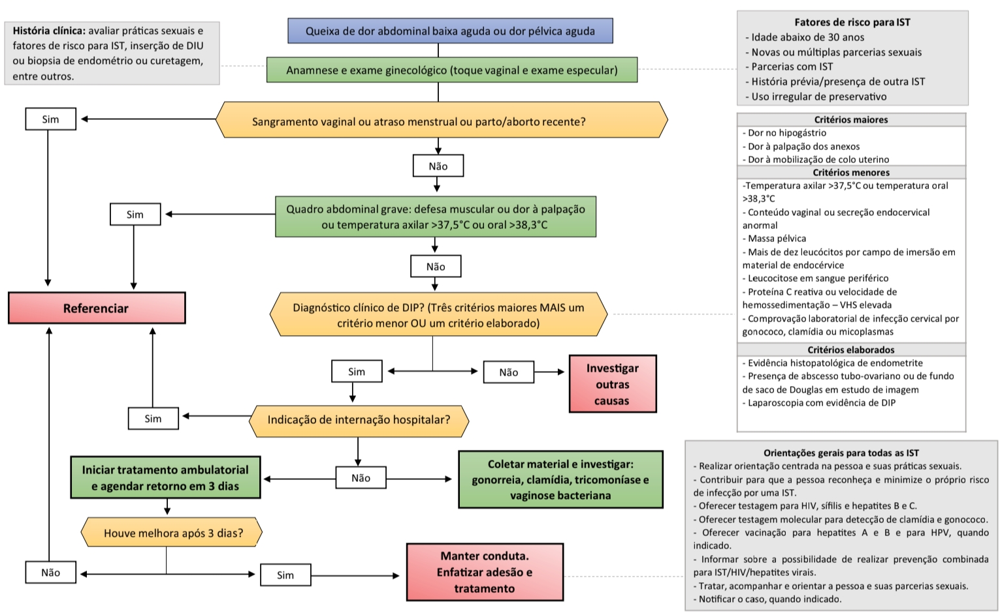

# DOENÇA INFLAMATÓRIA PÉLVICA

A Doença Inflamatória Pélvica, carinhosamente chamada de DIP, não é apenas uma infecção, é uma síndrome clínica. Se você tentar decorá-la como uma lista de bactérias, vai errar questões de prova. Você precisa entender a DIP como um processo dinâmico de ascensão bacteriana.

Imagine o trato genital feminino. O colo do útero funciona como um porteiro, uma barreira física e imunológica (através do muco cervical) que protege o andar superior (útero, trompas e ovários). A DIP acontece quando essa barreira falha ou é vencida por patógenos específicos, permitindo que micro-organismos da vagina e da endocérvice subam e façam um estrago no endométrio, nas tubas uterinas e no peritônio pélvico.

## Fisiopatologia e Etiologia: O Porquê da Infecção

Por que a DIP é considerada uma infecção polimicrobiana se ela começa, na maioria das vezes, como uma Infecção Sexualmente Transmissível (IST)?

A história natural da DIP geralmente começa com a *Neisseria gonorrhoeae* ou a *Chlamydia trachomatis*. Esses são os agentes iniciadores. Eles causam uma cervicite que altera o microambiente local. Uma vez que esses patógenos "abrem a porta" e sobem para as trompas, eles causam dano tecidual. Esse tecido inflamado e desvitalizado torna-se o banquete perfeito para a flora vaginal endógena.

É aqui que entram os anaeróbios (como o *Bacteroides fragilis*), os Gram-negativos entéricos (como a *Escherichia coli*) e o *Streptococcus*. Por isso, guarde esta regra de ouro: embora a causa inicial seja frequentemente uma IST, o tratamento precisa ser de amplo espectro para cobrir todo esse "exército" secundário.

Um detalhe que o Dr. Will sempre reforça nas discussões do MedEvo: a vaginose bacteriana não é DIP, mas ela é um fator de risco fortíssimo. A ausência de lactobacilos e o excesso de anaeróbios na vaginose facilitam a ascensão dos patógenos da DIP.

### Fatores de Risco: Quem é a Paciente da Prova?

As bancas adoram desenhar o perfil epidemiológico. Fique atento a:

- Mulheres jovens (especialmente < 25 anos), devido à ectopia cervical fisiológica (o epitélio colunar é mais suscetível à Clamídia).

- Múltiplos parceiros sexuais ou novo parceiro recente.

- Uso inconsistente de preservativos.

- História prévia de DIP (quem teve uma vez tem as trompas sequeladas, o que facilita novas infecções).

- Procedimentos invasivos recentes (biópsia de endométrio, curetagem, histeroscopia).

E o DIU? Cuidado aqui. O DIU não causa DIP por si só. O risco de infecção está restrito aos primeiros 20 dias após a inserção, relacionado ao procedimento em si (levar bactéria da vagina para dentro do útero). Após esse período, o risco de uma usuária de DIU ter DIP é praticamente o mesmo de uma não usuária. Se a questão disser que o DIU deve ser retirado de rotina em toda DIP, marque como errado.

## Quadro Clínico: A Tríade e Além

O diagnóstico da DIP é eminentemente clínico. Se você esperar o resultado de uma cultura para tratar, sua paciente terá uma sequela tubária antes do laudo chegar.

A apresentação clássica é a dor abdominal infraumbilical (em hipogástrio ou fossas ilíacas), geralmente bilateral. Mas não se engane: a dor pode ser súbita ou insidiosa.

No exame físico, buscamos a tríade clássica:

- Dor à palpação do abdome inferior.

- Dor à mobilização do colo uterino (o famoso sinal de Chandelier, onde a paciente "pula" de dor).

- Dor à palpação anexial.

Além disso, a paciente pode apresentar febre (embora esteja ausente em muitos casos leves), corrimento vaginal purulento, dispareunia profunda e sangramento uterino anormal (devido à endometrite associada).

### A Pegadinha do Hipocôndrio Direito

Se a questão descrever uma paciente com dor pélvica que agora apresenta dor intensa no hipocôndrio direito, que piora com a respiração profunda, você deve pensar na Síndrome de Fitz-Hugh-Curtis.

Isso é uma peri-hepatite causada pela transudação de exsudato inflamatório da pelve para o espaço subfrênico. Na laparoscopia, vemos as clássicas aderências em "corda de violino" entre a cápsula de Glisson e a parede abdominal. Importante: as enzimas hepáticas (TGO/TGP) costumam estar normais, pois a inflamação é na cápsula, não no parênquima do fígado.

## Critérios Diagnósticos: O que a FEBRASGO e o Ministério da Saúde Dizem

Para facilitar a vida do médico (e do estudante), dividimos o diagnóstico em critérios. Segundo o Protocolo Clínico e Diretrizes Terapêuticas (PCDT) de ISTs do Ministério da Saúde, o diagnóstico deve ser suspeitado em mulheres com dor pélvica e que apresentem um ou mais dos critérios mínimos.

### Tabela 1: Critérios Diagnósticos para DIP

| Categoria | Critérios |
| --- | --- |
| **Critérios Mínimos (Tríade)** | Dor no abdome inferior, Dor à palpação dos anexos e Dor à mobilização do colo uterino. |
| **Critérios Adicionais (Menores)** | Febre (> 38,3°C), Conteúdo vaginal ou endocervical mucopurulento, Leucocitose no exame a fresco da secreção, VHS ou PCR elevados, Comprovação laboratorial de infecção por Gonococo ou Clamídia. |
| **Critérios Elaborados (Definitivos)** | Evidência histopatológica de endometrite na biópsia, USG transvaginal ou RM mostrando tubas espessadas com líquido (piosalpinge), Laparoscopia com evidência visual de DIP. |

**Dica de Prova:** Para iniciar o tratamento empírico, você só precisa dos 3 critérios mínimos + 1 critério menor OU 1 critério elaborado. Não espere a laparoscopia! A laparoscopia é o padrão-ouro, mas é reservada para casos de dúvida diagnóstica ou falha terapêutica.

## Estadiamento de Monif: O Guia da Conduta

O estadiamento de Monif é o que define se você vai mandar a paciente para casa com comprimidos ou se vai interná-la para antibioticoterapia endovenosa.

### Tabela 2: Estadiamento de Monif e Conduta

| Estágio | Descrição Clínica | Conduta Inicial |
| --- | --- | --- |
| **Estágio I** | Salpingite aguda sem peritonite (DIP leve). | Tratamento Ambulatorial. |
| **Estágio II** | Salpingite aguda com peritonite pélvica. | Tratamento Hospitalar. |
| **Estágio III** | Salpingite com formação de abscesso tubo-ovariano (ATO) íntegro. | Tratamento Hospitalar. |
| **Estágio IV** | Abscesso tubo-ovariano roto ou secreção purulenta na cavidade (Choque/Sepse). | Tratamento Hospitalar + Cirurgia de Urgência. |

Muitos alunos erram ao achar que todo abscesso (Estágio III) precisa de cirurgia imediata. Errado! O tratamento inicial do abscesso íntegro é clínico (antibiótico venoso). A cirurgia entra se o abscesso romper ou se não houver melhora em 48 a 72 horas.

## Diagnóstico Diferencial: Não é só DIP

A dor pélvica é a grande "mimética" da ginecologia. Antes de fechar DIP, você deve obrigatoriamente excluir:

- **Gravidez Ectópica:** Sempre peça um Beta-HCG. A tríade de dor, atraso menstrual e sangramento pode confundir.

- **Apendicite Aguda:** A dor costuma começar periumbilical e migrar para a fossa ilíaca direita. Geralmente não tem dor à mobilização do colo ou corrimento.

- **Cisto Ovariano Roto ou Torção Anexial:** O início da dor costuma ser muito mais súbito do que na DIP.

- **Infecção Urinária (Cistite/Pielonefrite):** A presença de disúria e dor lombar ajuda, mas lembre-se que a DIP pode causar irritação vesical secundária.

## Tratamento Farmacológico: O Esquema que Cai na Prova

O tratamento deve ser iniciado imediatamente. O objetivo não é apenas curar a infecção aguda, mas prevenir as sequelas a longo prazo.

### Tratamento Ambulatorial (Monif I)

Indicado para pacientes com DIP leve, sem sinais de peritonite, sem náuseas/vômitos e que tenham condições de aderir ao tratamento oral.

**Esquema de Escolha (PCDT 2020/FEBRASGO):**

- **Ceftriaxona 500 mg IM, dose única** (Cobre Gonococo).

- **Doxiciclina 100 mg VO, de 12/12h por 14 dias** (Cobre Clamídia).

- **Metronidazol 500 mg VO, de 12/12h por 14 dias** (Cobre Anaeróbios).

Por que o Metronidazol entrou como rotina? Antigamente ele era opcional, mas estudos mostraram que a cobertura de anaeróbios reduz drasticamente a formação de abscessos e protege melhor a fertilidade da paciente. No MedEvo, sempre batemos na tecla: se a prova é atual, coloque o Metronidazol no esquema ambulatorial.

### Tratamento Hospitalar (Monif II, III e IV)

Quando internar? Esta é uma pergunta clássica de prova.

- Gestantes (sempre!).

- Ausência de resposta ao tratamento oral após 72 horas.

- Intolerância a medicações orais (vômitos).

- Estado geral grave (febre alta, queda do estado geral).

- Presença de abscesso tubo-ovariano.

- Suspeita de emergência cirúrgica (apendicite não excluída).

**Esquemas Hospitalares:**

- **Opção A:** Ceftriaxona 1g IV 1x/dia + Doxiciclina 100mg VO ou IV 12/12h + Metronidazol 400mg IV 12/12h.

- **Opção B (Clássica de livros americanos, mas muito cobrada):** Clindamicina 900mg IV 8/8h + Gentamicina (dose de ataque 2mg/kg e manutenção 1,5mg/kg 8/8h).

A paciente pode migrar para o tratamento oral após 24 a 48 horas de melhora clínica (afebril e redução da dor), mas o tempo total de tratamento (venoso + oral) deve ser sempre de 14 dias.

### Tabela 3: Resumo das Doses e Indicações

| Medicamento | Dose (Ambulatorial) | Dose (Hospitalar) | Alvo Principal |
| --- | --- | --- | --- |
| **Ceftriaxona** | 500mg IM (Dose única) | 1g IV (1x/dia) | *N. gonorrhoeae* |
| **Doxiciclina** | 100mg VO (12/12h - 14d) | 100mg IV/VO (12/12h) | *C. trachomatis* |
| **Metronidazol** | 500mg VO (12/12h - 14d) | 400mg IV (12/12h) | Anaeróbios |
| **Clindamicina** | - | 900mg IV (8/8h) | Anaeróbios/Gram+ |
| **Gentamicina** | - | 1,5mg/kg IV (8/8h) | Gram-negativos |

## Manejo do Parceiro e do DIU

Este é o ponto onde muitos alunos perdem pontos bobos.

**O Parceiro:** Todo parceiro sexual dos últimos 60 dias deve ser tratado empiricamente para Gonococo e Clamídia, mesmo que esteja assintomático. O esquema para o parceiro costuma ser Ceftriaxona 500mg IM + Azitromicina 1g VO (dose única). Não adianta tratar a paciente e ela ser reinfectada na semana seguinte.

**O DIU:** Se a paciente tem DIP e usa DIU, a conduta inicial é manter o DIU e iniciar o antibiótico. Se após 48 a 72 horas de tratamento correto não houver melhora, aí sim removemos o dispositivo. A única exceção é a DIP grave (Monif IV) ou abscessos volumosos onde a remoção pode ser considerada mais cedo, mas a regra geral é: o antibiótico vem antes da retirada.

## Complicações e Sequelas: O Drama Pós-DIP

A DIP é a principal causa evitável de infertilidade nas mulheres. O processo inflamatório nas trompas causa a destruição dos cílios do epitélio tubário e a formação de aderências (sinéquias).

As principais sequelas são:

- **Infertilidade de Causa Tubária:** Ocorre em cerca de 10% após o primeiro episódio, 25% após o segundo e mais de 50% após o terceiro.

- **Gravidez Ectópica:** O dano aos cílios da trompa faz com que o embrião não consiga chegar ao útero, implantando-se na tuba. O risco aumenta em até 10 vezes após uma DIP.

- **Dor Pélvica Crônica:** Causada pelas aderências firmes que se formam na pelve.

- **Recorrência:** Uma trompa sequelada é um local de fácil colonização bacteriana futura.

## Situações Especiais

### Gestantes

A DIP na gestação é rara (porque o tampão mucoso e a obliteração da cavidade uterina pelo saco gestacional protegem contra a ascensão bacteriana), mas quando ocorre é uma catástrofe. O risco de perda gestacional e morbidade materna é altíssimo. **Toda gestante com DIP deve ser internada.** A Doxiciclina é contraindicada na gestação (risco de manchas nos dentes e alterações ósseas do feto), sendo substituída geralmente por Azitromicina ou esquemas com Clindamicina.

### Pacientes com HIV

O quadro clínico e o tratamento são basicamente os mesmos. No entanto, pacientes com HIV podem apresentar abscessos tubo-ovarianos com mais frequência e ter uma resposta mais lenta ao tratamento. A tendência atual é ser mais liberal com a internação nessas pacientes.

### Abscesso Tubo-Ovariano (ATO)

Se você diagnosticou um ATO (Monif III), a internação é obrigatória. O tratamento inicial é clínico com antibióticos de amplo espectro que cubram muito bem anaeróbios (Metronidazol ou Clindamicina).

- **Quando drenar?** Se o abscesso for > 8 cm (algumas referências dizem 5-6 cm), se houver suspeita de ruptura (abdome agudo) ou se após 48-72h de ATB venoso a paciente mantiver febre e dor. A drenagem preferencial hoje é por via vaginal guiada por USG ou laparoscopia, evitando laparotomias extensas sempre que possível.

## Pontos-Chave para Prova 💡

- **Critérios Mínimos:** Dor abdominal + Dor anexial + Dor à mobilização do colo. Presentes em quase 100% dos casos.

- **Agentes Iniciadores:** *Chlamydia trachomatis* (mais comum, muitas vezes subaguda) e *Neisseria gonorrhoeae* (mais aguda e ruidosa).

- **Tratamento Ambulatorial:** Ceftriaxona 500mg IM + Doxiciclina 100mg VO 14d + Metronidazol 500mg VO 14d.

- **Internação Obrigatória:** Gestantes, ATO, sem melhora após 72h de VO, intolerância oral, sinais de peritonite ou sepse.

- **DIU:** Não precisa retirar de imediato na DIP leve/moderada. Trate primeiro, reavalie em 48-72h.

- **Fitz-Hugh-Curtis:** Peri-hepatite (aderências em corda de violino). Dor em hipocôndrio direito + DIP. Enzimas hepáticas normais.

- **Sequelas:** Infertilidade tubária, Gravidez Ectópica e Dor Pélvica Crônica. Metrorragia NÃO é sequela, é sintoma agudo.

- **Parceiros:** Tratar sempre os parceiros dos últimos 60 dias, mesmo que assintomáticos.

- **Vaginose Bacteriana:** Não causa DIP diretamente, mas é o principal fator de risco para a ascensão dos patógenos.

- **Laparoscopia:** É o padrão-ouro (critério definitivo), mas a conduta é baseada no diagnóstico clínico.

- **Monif I:** Único estágio que permite tratamento puramente ambulatorial.

- **Abscesso Roto (Monif IV):** É uma emergência cirúrgica. Antibiótico sozinho não resolve.

- **Doxiciclina:** É a droga de escolha para Clamídia, mas é contraindicada em gestantes.

- **Ceftriaxona:** Droga de escolha para o Gonococo. Lembre-se que a resistência à Ciprofloxacina é alta, por isso usamos a Cefalosporina de 3ª geração.

- **Exames de Imagem:** USG transvaginal é o primeiro exame. Piosalpinge (trompa espessada com conteúdo espesso) é um achado clássico.

- **Diagnóstico Diferencial:** O Beta-HCG é obrigatório para excluir gravidez ectópica em toda mulher em idade fértil com dor pélvica.

 Cópia offline para consulta pessoal.
 Fonte original:
 [https://www.medevo.com.br/material-apoio/ler/26198811-c7ad-4848-8680-b4c6ed849e80](https://www.medevo.com.br/material-apoio/ler/26198811-c7ad-4848-8680-b4c6ed849e80)
