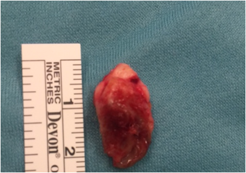
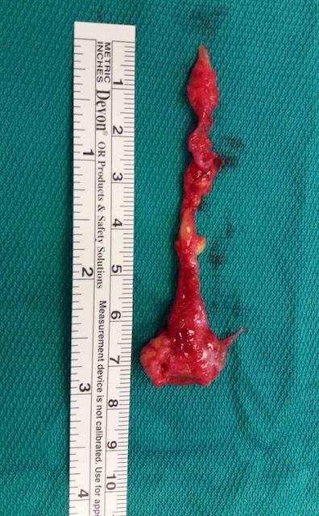

# DOENÇA PILONIDAL

A doença pilonidal é um daqueles temas que, à primeira vista, parece simples — "é só um pelinho encravado", diz o senso comum. Mas, para quem está se preparando para a residência, essa é uma armadilha perigosa. As bancas adoram explorar a confusão entre o tratamento da fase aguda e da fase crônica, além das diversas técnicas cirúrgicas.

O termo "pilonidal" vem do latim *pilus* (pelo) e *nidus* (ninho). Basicamente, estamos falando de um "ninho de pelos" que se desenvolve no tecido subcutâneo. Embora possa ocorrer em diversos locais, como o umbigo ou espaços interdigitais (comum em barbeiros), a localização clássica que cai na sua prova é a região sacrococcígea, no sulco interglúteo.

## Etiologia e Fisiopatologia: O Porquê da Doença

*Figura 1 - Espécime cirúrgico de cisto pilonidal mostrando a cavidade contendo pelos e debris queratinizados. A doença é adquirida, resultante da penetração de pelos no tecido subcutâneo da região sacrococcígea. Fonte: Lord Lucan, CC BY-SA 4.0 | Wikimedia Commons*

Antigamente, acreditava-se que o cisto pilonidal era uma malformação congênita, um remanescente do canal medular. Esqueça isso. Hoje, o consenso (e o que a sua prova vai cobrar) é que se trata de uma **doença adquirida**.

A teoria mais aceita é a de Karydakis, que propõe três fatores principais para o surgimento da doença:

- **O Pelo (O Invasor):** Pelos curtos, grossos e quebradiços que se soltam e ficam retidos no sulco interglúteo.

- **A Força (O Motor):** O movimento das nádegas ao caminhar ou sentar cria um efeito de vácuo e fricção, empurrando o pelo para dentro da pele.

- **A Vulnerabilidade da Pele (O Alvo):** O sulco interglúteo é uma área de pele fina, úmida e macerada, o que facilita a penetração do pelo.

Uma vez que o pelo perfura a epiderme, o corpo o reconhece como um corpo estranho. Isso gera uma reação inflamatória crônica, formando um granuloma e, eventualmente, um trajeto fistuloso (o *sinus* pilonidal). Se esse trajeto infectar e houver acúmulo de pus sem drenagem, temos o abscesso pilonidal.

**Dica de Prova:** As bancas costumam colocar alternativas afirmando que a doença é congênita para te confundir. Lembre-se: é **adquirida**. O fator mecânico (fricção e profundidade do sulco) é fundamental.

## Epidemiologia e Fatores de Risco

*Figura 2 - Aspecto clínico de sinus pilonidal mostrando orifício fistuloso (superior) e cisto (inferior) na região do sulco interglúteo. A localização típica é sacrococcígea. Fonte: Lord Lucan, CC BY-SA 4.0 | Wikimedia Commons*

Quem é o paciente típico? Imagine um homem jovem (15 a 30 anos), com muitos pelos (hirsuto), que passa muito tempo sentado. Durante a Segunda Guerra Mundial, essa condição ficou conhecida como "Jeep Disease", porque os soldados passavam horas saltando nos assentos duros dos jipes, o que traumatizava a região sacral.

Os principais fatores de risco que você deve identificar no enunciado da questão são:

- Sexo masculino (3 a 4 vezes mais comum).

- Obesidade (aumenta a profundidade do sulco e a maceração da pele).

- Sedentarismo ou ocupações que exigem ficar sentado por longos períodos.

- Hirsutismo (excesso de pelos corporais).

- Histórico familiar (embora adquirida, a anatomia local pode ser hereditária).

## Quadro Clínico e Exame Físico

A apresentação clínica varia drasticamente conforme o estágio da doença. No MedEvo, sempre reforçamos que você deve classificar o paciente mentalmente assim que lê o caso clínico.

### 1. Doença Assintomática

O paciente pode ter apenas os chamados "pits" ou orifícios primários na linha média do sulco interglúteo. Ele não sente dor, apenas percebe os buraquinhos. Aqui, a conduta costuma ser conservadora (higiene e depilação).

### 2. Abscesso Pilonidal (Fase Aguda)

Esta é a urgência proctológica. O paciente chega com dor intensa, calor, rubor e uma massa flutuante na região sacrococcígea.

- **Pérola Clínica:** Se o enunciado descreve "massa flutuante, dor aguda e febre em jovem", não pense duas vezes: é abscesso pilonidal.

- O diagnóstico é estritamente **clínico**. Não se pede ressonância ou tomografia para diagnosticar cisto pilonidal em prova, a menos que haja suspeita de complicações raríssimas como osteomielite.

### 3. Doença Pilonidal Crônica

Aqui o paciente apresenta drenagem persistente ou intermitente de secreção (serosanguinolenta ou purulenta) pelos orifícios. Ele relata que "suja a cueca" e sente um desconforto crônico, mas sem a dor lancinante do abscesso. Podem existir orifícios secundários, geralmente localizados lateralmente à linha média.

### Diagnóstico Diferencial

Muitos alunos erram ao confundir a doença pilonidal com outras patologias da região. Veja a tabela comparativa abaixo:

| Patologia | Características Diferenciais |
| --- | --- |
| **Fístula Perianal** | Orifício próximo ao ânus; conexão com o canal anal (regra de Goodsall). |
| **Hidradenite Supurativa** | Doença das glândulas apócrinas; múltiplas lesões em axilas e virilhas. |
| **Abscesso Perianal** | Dor mais próxima à margem anal, sem relação com pelos ou linha média sacral. |
| **Cisto Sebáceo Infectado** | Geralmente mais superficial e fora da linha média estrita. |
| **Granuloma Umbilical** | No caso do cisto pilonidal umbilical, diferencia-se da onfalite comum pela presença de pelos. |

## Manejo da Fase Aguda: O Abscesso

Aqui está o maior erro dos estudantes: achar que o tratamento do abscesso é a cirurgia definitiva. **Não é.**

Se o paciente chega no Pronto-Socorro com um abscesso pilonidal agudo e flutuante, a conduta de escolha é a **Drenagem Simples**.

- **Como fazer:** Anestesia local (embora o tecido inflamado dificulte a ação do anestésico), incisão lateral à linha média (para facilitar a cicatrização) e evacuação do pus e dos pelos.

- **Curetagem:** Após a drenagem, a curetagem da cavidade para remover debris e pelos é recomendada e não prejudica a cicatrização.

- **Antibióticos:** Segundo as diretrizes da Sociedade Brasileira de Coloproctologia (SBCP), o uso de antibióticos (como Cefalexina ou Amoxicilina com Clavulanato) deve ser reservado para pacientes com celulite extensa, sinais sistêmicos (febre) ou imunocomprometidos. Se for um abscesso localizado e bem drenado, a drenagem basta.

**Cuidado com a pegadinha:** A alternativa que diz "realizar exérese em bloco do cisto durante a fase aguda" está **errada**. Operar tecido infectado aumenta o risco de deiscência, infecção de sítio cirúrgico e recidiva. Primeiro drenamos, esperamos a inflamação baixar e depois programamos a cirurgia eletiva.

## Tratamento Definitivo (Fase Crônica)

Uma vez resolvida a fase aguda, o paciente deve ser encaminhado para o tratamento definitivo. Existem várias técnicas, e a escolha depende da extensão da doença e da experiência do cirurgião.

### 1. Técnicas Abertas (Cicatrização por Segunda Intenção)

Consiste na exérese de todo o tecido doente até a fáscia pré-sacral, deixando a ferida aberta para cicatrizar "de baixo para cima".

- **Vantagem:** Menor taxa de infecção pós-operatória imediata (já que não há fechamento de espaço morto).

- **Desvantagem:** Cicatrização muito lenta (semanas ou meses), exige curativos diários e é desconfortável.

### 2. Fechamento Primário (Linha Média)

O cirurgião retira o cisto e fecha a pele na linha média.

- **Atenção:** Esta técnica caiu em desuso para casos complexos porque a taxa de recidiva é altíssima. O fechamento na linha média mantém o sulco profundo e a cicatriz fica sob tensão, exatamente onde a doença começou.

### 3. Técnicas de Retalho (Off-Midline)

Estas são as "queridinhas" das provas de residência médica. O objetivo é retirar a cicatriz da linha média e, de quebra, "achatar" o sulco interglúteo, eliminando um dos fatores fisiopatológicos da doença.

- **Retalho de Limberg (ou Retalho Rômbico):** É feita uma incisão em formato de losango e um retalho de pele e gordura da região glútea é rodado para cobrir o defeito. É excelente para casos recidivados.

- **Técnica de Karydakis:** Realiza-se uma incisão lateralizada e o fechamento é feito fora da linha média.

- **Bascom (Cleft Lift):** Foca em elevar o assoalho do sulco interglúteo.

### 4. Técnicas Minimamente Invasivas

Atualmente, há uma tendência de ser menos agressivo.

- **EPSiT (Endoscopic Pilonidal Sinus Treatment):** Uso de um endoscópio fino para limpar o trajeto por dentro.

- **Injeção de Fenol ou Laser:** Destruição química ou térmica do epitélio da fístula. São opções para casos iniciais.

| Técnica | Indicação Principal | Principal Vantagem | Principal Desvantagem |
| --- | --- | --- | --- |
| **Drenagem Simples** | Abscesso Agudo | Alívio imediato da dor | Não é curativa (recidiva alta) |
| **Exérese Aberta** | Casos simples/múltiplos orifícios | Baixa complexidade técnica | Tempo de recuperação longo |
| **Retalho de Limberg** | Doença Recidivada/Complexa | Baixíssima recidiva | Cirurgia maior, cicatriz estética |
| **Técnica de Bascom** | Casos crônicos | Retira a cicatriz da linha média | Exige curva de aprendizado |

## Posição Cirúrgica e Anestesia

Para a cirurgia eletiva, a posição clássica é a **Jackknife** (também chamada de canivete ou Kraske). O paciente fica em decúbito ventral, com o quadril flexionado e as nádegas afastadas por fitas adesivas para expor o sulco interglúteo.

A anestesia pode ser local com sedação (para casos pequenos), raquianestesia ou geral, dependendo da extensão da técnica (especialmente se houver rotação de retalhos).

## Situações Especiais: O Cisto Pilonidal Umbilical

Esta é uma "pérola" que vira e mexe aparece em provas de alto nível. O mecanismo é o mesmo: pelos que caem no umbigo e, pela fricção da roupa e movimento abdominal, penetram na pele umbilical.

- **Quadro:** Drenagem purulenta ou sanguinolenta crônica pelo umbigo.

- **Diagnóstico Diferencial Importante:** Nódulo da Irmã Mary Joseph (metástase umbilical de câncer intra-abdominal). No cisto pilonidal, você verá pelos saindo pelo orifício; no nódulo de Mary Joseph, é uma massa sólida e endurecida.

- **Tratamento:** Remoção dos pelos e, se houver fístula persistente, exérese do trajeto (onfalectomia parcial ou total em casos extremos).

## Complicações e Prognóstico

A complicação mais comum da doença pilonidal é a **recidiva**. Mesmo com as melhores técnicas, as taxas de retorno da doença giram em torno de 5% a 15%. Por isso, a orientação pós-operatória é crucial:

- Manter a região sempre limpa e seca.

- **Depilação definitiva (laser)** ou raspagem regular dos pelos ao redor da cicatriz (isso reduz drasticamente a recidiva).

- Controle do peso.

Uma complicação rara, mas que já foi tema de questão, é a degeneração maligna para **Carcinoma Espinocelular (CEC)**. Isso ocorre em casos de doença crônica negligenciada por décadas (20-30 anos de inflamação persistente). Se o enunciado descrever um idoso com cisto pilonidal de longa data que desenvolveu uma úlcera vegetante e friável no local, suspeite de CEC.

Outra complicação mencionada nas pérolas clínicas é a **osteomielite do sacro**. É raríssima, mas pode ocorrer se a infecção crônica for muito profunda e atingir o periósteo.

## O Passo a Passo da Conduta (Algoritmo Mental)

Como o Dr. Will sempre orienta nas aulas do MedEvo, você precisa ter um fluxograma na cabeça para não perder tempo na prova:

- **Paciente com dor aguda, flutuação e febre?**

- Sim -> Abscesso Pilonidal -> Conduta: Drenagem imediata + Curetagem + Higiene local. (Antibiótico só se houver celulite/comorbidades).

- **Paciente com orifícios drenando secreção crônica, sem dor aguda?**

- Sim -> Doença Pilonidal Crônica -> Conduta: Cirurgia eletiva (Exérese aberta ou Retalhos).

- **Paciente assintomático (achado de exame físico)?**

- Sim -> Conduta: Observação + Medidas de higiene + Depilação.

## Pontos-Chave para Prova 🎯

- **Etiologia:** Doença adquirida, não congênita. Ocorre por penetração de pelos no subcutâneo.

- **Fatores de Risco:** Homem, jovem, obeso, hirsuto, sedentário (Jeep disease).

- **Localização:** Principalmente sacrococcígea (sulco interglúteo), mas pode ocorrer no umbigo.

- **Abscesso Agudo:** O tratamento é **Drenagem Simples** sob anestesia local. Não é o tratamento definitivo.

- **Antibioticoterapia:** Não é rotina na drenagem simples; indicada apenas se houver celulite extensa ou sinais sistêmicos.

- **Tratamento Definitivo:** Cirurgia eletiva após resolução da fase aguda.

- **Técnicas de Retalho (Limberg, Karydakis):** São superiores ao fechamento na linha média porque retiram a cicatriz da zona de tensão e achatam o sulco.

- **Cicatrização por Segunda Intenção:** Comum na exérese aberta; segura, mas lenta.

- **Posição Cirúrgica:** Jackknife (decúbito ventral com flexão de quadril).

- **Diagnóstico:** Clínico. Orifícios na linha média (pits) são patognomônicos.

- **Cisto Pilonidal Umbilical:** Causa drenagem purulenta umbilical; diagnóstico diferencial com Nódulo da Irmã Mary Joseph.

- **Recidiva:** É a complicação mais frequente. A prevenção envolve depilação (preferencialmente a laser) da região.

- **Degeneração Maligna:** Rara, mas pode ocorrer (Carcinoma Espinocelular) em casos de décadas de evolução.

- **Curetagem:** Durante a drenagem do abscesso, a remoção de pelos e debris com cureta ajuda na cicatrização e não é contraindicada.

- **O que NÃO fazer:** Não tente fechar primariamente na linha média um cisto complexo ou infectado; o risco de deiscência e recidiva é altíssimo.

- **Diagnóstico Diferencial:** Fístula perianal tem orifício próximo ao ânus e relação com o canal anal; pilonidal é mais superior, no sacro.

 Cópia offline para consulta pessoal.
 Fonte original:
 [https://www.medevo.com.br/material-apoio/ler/db755003-23e8-4240-9f00-32b846e943b3](https://www.medevo.com.br/material-apoio/ler/db755003-23e8-4240-9f00-32b846e943b3)
