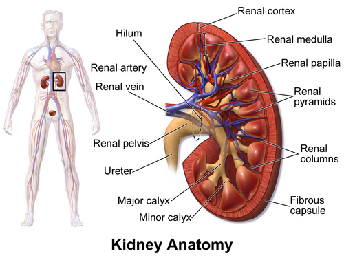
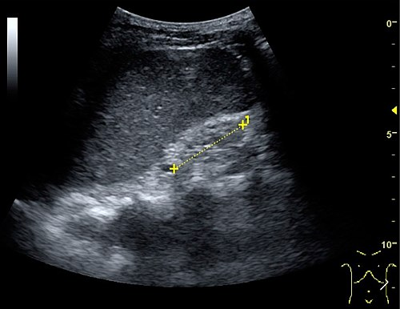

# DOENÇA RENAL CRÔNICA

Seja bem-vindo a esta aula escrita. Se você está aqui, é porque sabe que a Nefrologia é o "calcanhar de Aquiles" de muitos candidatos à residência. Mas eu vou te contar um segredo: as bancas não querem que você seja um nefrologista; elas querem que você saiba identificar quem está perdendo função renal, como retardar essa perda e como manejar as complicações que matam o paciente.

A Doença Renal Crônica (DRC) não é apenas uma "creatinina alta". É uma síndrome sistêmica. Vamos entender o porquê de cada conduta, pois, como sempre digo nas mentorias do MedEvo, quem entende a fisiopatologia não precisa decorar a conduta.

## Definição e o Critério dos 3 Meses

*Figura 1 - Anatomia do rim em corte longitudinal mostrando córtex, medula, pirâmides renais, pelve renal e ureter. Na DRC, há perda progressiva dessas estruturas com diminuição do parênquima funcional. Fonte: BruceBlaus, CC BY 3.0 | Wikimedia Commons*

A primeira coisa que você precisa fixar é o tempo. Para ser "crônica", a lesão ou a perda de função deve persistir por **pelo menos 3 meses**. Por que 3 meses? Porque esse é o tempo médio para que as alterações estruturais se tornem irreversíveis e para que os mecanismos de compensação (que veremos adiante) se consolidem.

O diagnóstico de DRC é feito se o paciente apresentar **QUALQUER UM** dos critérios abaixo por ≥ 3 meses:

- **Taxa de Filtração Glomerular (TFG) < 60 mL/min/1,73m²**.

- **Marcadores de lesão renal**:

- Albuminúria aumentada (Relação Albumina/Creatinina Urinária - RAC ≥ 30 mg/g).

- Alterações no sedimento urinário (ex: hematúria dismórfica, cilindros hemáticos).

- Alterações eletrolíticas por distúrbios tubulares.

- Alterações estruturais detectadas por imagem (ex: rins policísticos, rins pequenos e hiperecogênicos).

- Histórico de transplante renal.

**Dica de Prova:** A banca vai te dar um paciente com creatinina de 2.0 hoje e 0.8 há duas semanas. Isso NÃO é DRC. Isso é Lesão Renal Aguda (LRA). Para ser DRC, precisa do histórico de 3 meses ou de sinais de cronicidade no USG (rins diminuídos, perda da relação cortico-medular).

## Estadiamento: O Mapa do Tesouro (KDIGO)

*Figura 2 - Ultrassonografia demonstrando doença renal crônica em estágio terminal: rim com tamanho reduzido e ecogenicidade aumentada homogênea, sem diferenciação cortico-medular visível - sinais de cronicidade. Fonte: Hansen KL, Nielsen MB, Ewertsen C, CC BY 4.0 | Wikimedia Commons*

Não tente fugir: você precisa saber a classificação G-A do KDIGO. Ela define o prognóstico e a frequência de acompanhamento. O "G" vem de Glomerular (TFG) e o "A" de Albuminúria.

### Tabela 1: Estadiamento da DRC por TFG (Categorias G)

| Categoria | TFG (mL/min/1,73m²) | Descrição |
| --- | --- | --- |
| **G1** | ≥ 90 | Normal ou elevada |
| **G2** | 60 – 89 | Levemente diminuída |
| **G3a** | 45 – 59 | Diminuição leve a moderada |
| **G3b** | 30 – 44 | Diminuição moderada a grave |
| **G4** | 15 – 29 | Diminuição grave |
| **G5** | < 15 | Falência renal (Uremia/Terminal) |

### Tabela 2: Estadiamento por Albuminúria (Categorias A)

| Categoria | RAC (mg/g) | Descrição |
| --- | --- | --- |
| **A1** | < 30 | Normal a levemente aumentada |
| **A2** | 30 – 300 | Moderadamente aumentada (antiga microalbuminúria) |
| **A3** | > 300 | Gravemente aumentada (antiga macroalbuminúria) |

**Por que isso cai tanto?** Porque o risco cardiovascular e de progressão para diálise não depende só da TFG. Um paciente G2A3 (TFG 70, mas com muita proteína na urina) tem um risco muito maior do que um G3aA1 (TFG 50, sem proteína). A albuminúria é um marcador de inflamação endotelial sistêmica.

## Fisiopatologia: A Teoria do Néfron Intacto

Imagine que o rim é uma fábrica com 1 milhão de operários (néfrons). Se 500 mil morrem por causa do Diabetes, os outros 500 mil precisam trabalhar o dobro para manter a produção. Isso é a **hiperfiltração compensatória**.

O problema é que, para filtrar mais, o néfron remanescente aumenta a pressão dentro do glomérulo (vasoconstrição da arteríola eferente via Angiotensina II). Essa pressão alta, a longo prazo, "rasga" a barreira de filtração (causando albuminúria) e leva à esclerose glomerular.

É por isso que usamos **IECA ou BRA**: eles dilatam a arteríola eferente, reduzem a pressão intraglomerular e protegem o néfron. É a base da nefroproteção.

## Etiologia: Quem são os culpados?

No Brasil e no mundo, as duas principais causas são:

- **Diabetes Mellitus (DM)**: Principal causa de entrada em diálise.

- **Hipertensão Arterial Sistêmica (HAS)**: Segunda causa principal.

**Pérola Clínica:** Na nefropatia diabética clássica, os rins costumam estar de tamanho normal ou até aumentados no USG, mesmo com DRC avançada. Outras causas de "rins grandes" na DRC: Amiloidose, Mieloma Múltiplo, HIV (HIVAN) e Doença Policística. Se o USG mostrar rins pequenos e hiperecogênicos, pense em Nefrosclerose Hipertensiva ou Glomerulonefrites crônicas.

### Situações Específicas de Prova:

- **Mieloma Múltiplo**: Pode causar a Síndrome de Fanconi (disfunção do túbulo proximal com glicosúria e fosfatúria sem hiperglicemia) e nefropatia por cilindros.

- **Refluxo Vesicoureteral**: Causa pielonefrite crônica e cicatrizes renais, levando à doença tubulointersticial.

- **Estenose de Artéria Renal**: Suspeite se o paciente tiver HAS resistente ou se a creatinina subir > 30% após iniciar IECA/BRA.

## Quadro Clínico e a Síndrome Urêmica

A DRC é silenciosa até estágios avançados (G4/G5). Quando os sintomas aparecem, chamamos de **Uremia**. A uremia não é apenas ureia alta; é o acúmulo de centenas de toxinas que o rim não excretou.

- **Gastrointestinal**: Náuseas, vômitos e o clássico **soluço persistente** (frequentemente cobrado como sinal de uremia grave).

- **Neurológico**: Encefalopatia urêmica (desorientação, asterixis/flapping), convulsões e polineuropatia.

- **Cardiovascular**: Pericardite urêmica (atrito pericárdico é indicação de diálise de urgência!) e Hipertrofia Ventricular Esquerda (HVE).

- **Hematológico**: Anemia normo/normo e **disfunção plaquetária** (o paciente sangra porque a ureia inibe a adesão plaquetária, apesar de o número de plaquetas ser normal. O tempo de sangramento estará aumentado).

- **Pele**: Prurido urêmico e o "hálito urêmico" (cheiro de amônia).

## Manejo Farmacológico e Metas

Aqui é onde o Dr. Will sempre reforça: siga as diretrizes brasileiras (SBC 2020 para HAS e SBD 2024 para DM).

### 1. Controle da Pressão Arterial

- **Meta**: < 130/80 mmHg para quase todos os pacientes com DRC (especialmente se RAC > 30 mg/g).

- **Primeira escolha**: IECA (Enalapril, Captopril) ou BRA (Losartana, Valsartana).

- **Cuidado**: Nunca faça duplo bloqueio (IECA + BRA). Isso aumenta o risco de hipercalemia e insuficiência renal aguda sem benefício adicional.

### 2. Controle Glicêmico (SBD 2024)

- **Meta de HbA1c**:

- TFG > 60: 6,5% a 7,0%.

- TFG < 60 ou em diálise: 7,0% a 7,9% (evitar hipoglicemia, que é comum na DRC pois o rim deixa de degradar a insulina).

- **Inibidores da SGLT2 (Dapagliflozina, Empagliflozina)**: São a revolução. Devem ser iniciados se TFG > 20-25 mL/min para nefroproteção e redução de risco cardiovascular, independentemente do DM.

- **Metformina**: Contraindicada se TFG < 30 mL/min pelo risco de acidose lática.

- **Glibenclamida**: Evitar na DRC (risco altíssimo de hipoglicemia prolongada).

- **Sitagliptina**: Pode ser usada em estágios avançados (G4), mas a dose deve ser ajustada para 25 mg/dia.

### 3. Manejo da Anemia

A principal causa é a **deficiência de eritropoetina (EPO)**. Mas atenção à pegadinha: antes de dar EPO, você DEVE garantir que o estoque de ferro está adequado.

- **Alvo de Hemoglobina**: 10 a 11,5 g/dL (não queremos chegar a 13, pois aumenta risco de eventos trombóticos).

- **Reposição de Ferro**: Iniciar se Ferritina < 100 ng/mL ou Saturação de Transferrina (IST) < 20%. Na DRC dialítica, os alvos são maiores (Ferritina > 200).

## Distúrbio Mineral e Ósseo (DMO-DRC)

Este é o tema favorito da Nefrologia em provas. Entenda a cascata:

- O rim não excreta fósforo → **Hiperfosfatemia**.

- O fósforo alto "sequestra" o cálcio e inibe a 1-alfa-hidroxilase (enzima que ativa a Vitamina D).

- Sem Vitamina D ativa (Calcitriol), o intestino não absorve cálcio → **Hipocalcemia**.

- Cálcio baixo + Fósforo alto + Vitamina D baixa estimulam a paratireoide → **Hiperparatireoidismo Secundário**.

- O PTH alto retira cálcio do osso para o sangue, causando a **Osteíte Fibrosa Cística** (alto turnover ósseo).

**Tratamento**:

- Restrição de fósforo na dieta (800-1000 mg/dia).

- Quelantes de fósforo (Carbonato de Cálcio se cálcio baixo; Sevelamer se cálcio normal/alto).

- Vitamina D ativa (Calcitriol) se PTH continuar alto.

- Calcimiméticos (Cinacalcet) em casos graves.

## Complicações Metabólicas: Potássio e Ácido

- **Hipercalemia**: Ocorre geralmente quando TFG < 20-30. Manejo: dieta pobre em potássio, diuréticos de alça (Furosemida) e resinas de troca (Poliestirenossulfonato de cálcio ou Patiromer).

- **Acidose Metabólica**: O rim não consegue excretar H+ e nem reabsorver HCO3-. Isso causa perda de massa óssea e muscular.

- **Conduta**: Repor Bicarbonato de Sódio via oral se o bicarbonato sérico estiver < 22 mEq/L.

## Indicações de Diálise de Urgência

Você está no plantão e chega um paciente urêmico. Quando chamar o nefrologista para passar o cateter AGORA? Memorize o mnemônico **AEIOU**:

- **A**cidose metabólica refratária.

- **E**letrolíticos (Hipercalemia grave/refratária).

- **I**ntoxicação por drogas dialisáveis (Lítio, Metanol, Etilenoglicol, Salicilatos).

- **O**verload (Hipervolemia/Edema agudo de pulmão refratário a diuréticos).

- **U**remia grave (Encefalopatia, Pericardite ou Sangramento urêmico).

## Tabela 3: Diagnóstico Diferencial de Rins no USG

| Rins Pequenos (< 8-9 cm) | Rins Normais ou Aumentados |
| --- | --- |
| Nefrosclerose Hipertensiva | Nefropatia Diabética (fase inicial/intermediária) |
| Glomerulonefrite Crônica | HIVAN (Nefropatia pelo HIV) |
| Doença Tubulointersticial Crônica | Mieloma Múltiplo / Amiloidose |
| Isquemia Renal Crônica | Doença Renal Policística Autossômica Dominante |

## Pontos-Chave para Prova 💡

- **Definição**: TFG < 60 ou lesão renal por ≥ 3 meses.

- **Principal causa de morte**: Doença Cardiovascular (o paciente morre do coração antes de chegar na diálise).

- **Anemia**: Causa principal é deficiência de EPO. Sempre repor ferro antes da EPO (Alvo Hb 10-11,5).

- **Uremia e Sangramento**: O tempo de sangramento aumenta por disfunção plaquetária; o número de plaquetas é normal.

- **Drogas Perigosas**: Meperidina é proibida (acúmulo de normeperidina causa convulsão). Aminoglicosídeos e contrastes iodados são nefrotóxicos.

- **Nefroproteção**: IECA ou BRA são a base. iSGLT2 (Dapagliflozina) agora é padrão-ouro para reduzir progressão.

- **Hiperparatireoidismo Secundário**: P alto, Ca baixo, Vit D baixa, PTH alto.

- **Osteíte Fibrosa Cística**: É a doença óssea de "alto turnover" causada pelo excesso de PTH.

- **Indicação de Diálise**: Pericardite urêmica (atrito pericárdico) é indicação ABSOLUTA e imediata.

- **Metformina**: Suspender se TFG < 30 mL/min.

- **Glibenclamida**: Contraindicação relativa/evitar na DRC pelo risco de hipoglicemia.

- **Meta de PA**: < 130/80 mmHg (Diretriz SBC 2020).

- **Rins no USG**: Rins grandes na DRC sugerem Diabetes, HIV, Mieloma ou Policística.

- **Acidose**: Tratar com Bicarbonato de Sódio se HCO3 < 22 mEq/L.

- **Potássio**: Evitar IECA/BRA se K > 5,5 mEq/L (contraindicação relativa, monitorar de perto).

- **Fisiologia**: O aparelho justaglomerular é o principal local de secreção de renina.

- **Ectopia Renal**: Se o rim estiver fora do lugar (ex: pélvico), a adrenal costuma estar no lugar normal (loja renal).

- **Transplante**: O transplante duplo rim-pâncreas é a melhor opção para pacientes com DM1 e DRC estágio 5.

 Cópia offline para consulta pessoal.
 Fonte original:
 [https://www.medevo.com.br/material-apoio/ler/42405cbb-973e-4cc5-91e3-c85499ab343a](https://www.medevo.com.br/material-apoio/ler/42405cbb-973e-4cc5-91e3-c85499ab343a)
