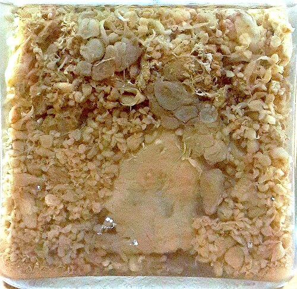
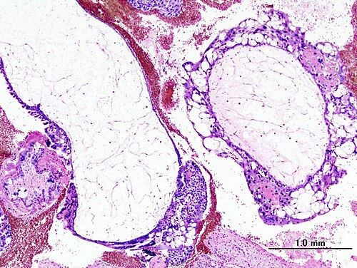

# DOENÇA TROFOBLÁSTICA GESTACIONAL

A Doença Trofoblástica Gestacional (DTG) não é uma patologia única, mas um espectro de doenças que surgem de uma proliferação anormal do trofoblasto. Como professor, vejo muitos alunos se perderem tentando decorar nomes complicados, mas o segredo aqui é entender que estamos falando de uma "gestação que deu errado" logo na concepção, transformando o que seria uma placenta em um tumor, seja ele benigno ou maligno.

Nas provas de residência, este tema é um prato cheio para os examinadores porque envolve genética, ultrassonografia, marcadores laboratoriais (o famoso hCG) e um seguimento pós-operatório rigoroso. Se você entender a lógica do seguimento, você acerta 80% das questões.

## Classificação e Fisiopatologia: Onde Tudo Começa

Para entender a DTG, precisamos dividir o grupo em duas grandes categorias: as formas benignas (Mola Hidatiforme) e as formas malignas (Neoplasia Trofoblástica Gestacional).

### Mola Hidatiforme (MH)

*Figura 1 - Aspecto macroscópico da mola hidatiforme: vilosidades hidrópicas formando vesículas translúcidas semelhantes a "cachos de uva". Fonte: Alaa, CC BY-SA 4.0 | Wikimedia Commons*
A mola hidatiforme é a forma mais comum. Ela se divide em Completa e Parcial. Aqui mora a primeira grande pegadinha de prova: a genética de cada uma.

**1. Mola Hidatiforme Completa (MHC):**
Imagine um óvulo "vazio", sem material genético funcional, que é fecundado por um espermatozoide que se duplica, ou por dois espermatozoides. O resultado é um ovo com 46 cromossomos, mas todos de origem paterna (diploidia androgenética).

Por que isso importa? Como não há DNA materno, não há desenvolvimento de tecido embrionário. Não existe feto, não existe cordão, não existe membrana. O que existe é uma proliferação maciça de vilosidades hidrópicas (vesículas) que lembram "cachos de uva". É a MHC que apresenta os maiores níveis de hCG e o maior risco de malignização (cerca de 15 a 20%).

**2. Mola Hidatiforme Parcial (MHP):**
Aqui, um óvulo normal é fecundado por dois espermatozoides (ou um que se duplica). O resultado é uma triploidia (69,XXX ou 69,XXY).

Diferente da completa, na mola parcial existe tecido fetal ou embrionário. Você pode encontrar um feto (quase sempre com múltiplas malformações e que não sobrevive) em meio a áreas de placenta normal e áreas de degeneração molar. O risco de malignização é bem menor, em torno de 1 a 5%.

*Figura 2 - Histopatologia da mola hidatiforme completa: proliferação trofoblástica difusa com vilosidades hidrópicas e ausência de tecido fetal. Fonte: CC BY-SA 3.0 | Wikimedia Commons*

### Neoplasia Trofoblástica Gestacional (NTG)

Quando a doença deixa de ser apenas uma "mola" e passa a invadir o miométrio ou se espalhar pelo corpo, chamamos de NTG. Ela inclui:

- Mola Invasora (mais comum pós-mola).

- Coriocarcinoma (altamente agressivo e metastático).

- Tumor Trofoblástico do Sítio Placentário (raro, produz menos hCG e mais lactogênio placentário).

- Tumor Trofoblástico Epitelioide.

## Quadro Clínico: O "Clássico" que a Prova Adora

O quadro clínico da DTG é o que chamamos de "exagero gestacional". Tudo o que uma grávida sente, a paciente com mola sente em dobro ou triplo.

O sintoma mais comum, presente em quase 100% dos casos, é o sangramento vaginal. Mas não é qualquer sangramento. As bancas costumam descrever como um sangramento intermitente, de cor escura, tipo "suco de ameixa" ou "água de carne". Às vezes, a paciente relata a eliminação de vesículas (as famosas "uvas").

### Sinais de Alerta e Complicações

Fique atento a estes sinais, pois eles gritam "Mola Completa" na sua prova:

- **Útero maior que a idade gestacional (IG):** O trofoblasto cresce muito rápido. Se a paciente tem 8 semanas de amenorreia, mas o útero está na cicatriz umbilical, suspeite.

- **Hiperemese Gravídica:** O hCG é estruturalmente semelhante ao TSH e atua nos receptores de vômito. Níveis astronômicos de hCG causam vômitos incoercíveis.

- **Hipertireoidismo:** Pelo mesmo motivo (semelhança com TSH), a paciente pode apresentar taquicardia, tremores e pele quente.

- **Pré-eclâmpsia precoce:** Se você vir uma paciente com picos hipertensivos e proteinúria antes das 20 semanas de gestação, a primeira hipótese deve ser Mola Hidatiforme.

- **Cistos Teca-Luteínicos:** São cistos ovarianos bilaterais, causados pela hipereestimulação dos ovários pelo hCG. Não precisam de cirurgia, eles regridem quando o hCG cai.

**Exemplo Clínico MedEvo:** Paciente de 19 anos, 10 semanas de atraso menstrual, queixa de sangramento vaginal escuro e vômitos intensos. Ao exame: PA 150/90 mmHg, AU de 16 cm (compatível com 16-18 semanas). Ao toque, anexos aumentados e dolorosos. Qual o diagnóstico? Mola Hidatiforme Completa. O útero maior que a IG e a hipertensão precoce são as chaves aqui.

## Diagnóstico: A Tríade de Ouro

O diagnóstico da DTG baseia-se em três pilares: Clínica, hCG e Ultrassonografia.

### 1. Beta-hCG Quantitativo

Na gestação normal, o hCG dobra a cada 48 horas e atinge um pico por volta de 10 a 12 semanas, raramente ultrapassando 100.000 mUI/mL. Na mola completa, é comum encontrarmos valores de 200.000, 500.000 ou até mais de 1 milhão.

Cuidado: Um hCG baixo não exclui mola parcial, mas um hCG estratosférico confirma a suspeita de mola completa.

### 2. Ultrassonografia (USG)

É o exame de escolha para triagem.

- **Na Mola Completa:** Você verá uma massa ecogênica heterogênea preenchendo a cavidade uterina, com múltiplas áreas anecoicas (vesículas). O termo clássico de prova é imagem em "tempestade de neve", "flocos de neve" ou "cacho de uvas". Lembre-se: não há feto nem saco gestacional.

- **Na Mola Parcial:** Você verá espaços císticos na placenta ("queijo suíço") e a presença de tecido fetal ou saco gestacional, muitas vezes com um feto com restrição de crescimento ou malformações.

### 3. Histopatológico

É o diagnóstico definitivo. Toda mola esvaziada DEVE ser enviada para estudo anatomopatológico. É ele quem vai diferenciar com certeza a completa da parcial e confirmar se há sinais de malignidade.

| Característica | Mola Completa | Mola Parcial |
| --- | --- | --- |
| Cariótipo | 46,XX (mais comum) ou 46,XY | 69,XXX ou 69,XXY |
| Tecido Fetal | Ausente | Presente |
| Edema de Vilosidades | Difuso | Focal |
| Proliferação Trofoblástica | Difusa / Acentuada | Focal / Leve |
| Risco de Malignização | 15 a 20% | < 5% |
| Tamanho do Útero | > Idade Gestacional | Geralmente = ou < IG |

## Tratamento: O Esvaziamento Uterino

Uma vez diagnosticada a mola, o útero deve ser esvaziado o quanto antes para evitar complicações como hemorragia e embolia trofoblástica.

### A Técnica de Escolha

O método preferencial é o **Esvaziamento por Vácuo-Aspiração** (AMIU ou aspiração elétrica).
Por que não a curetagem simples? Porque o útero molar é muito amolecido e grande, o que aumenta drasticamente o risco de perfuração uterina com a cureta metálica. A aspiração é mais rápida e segura.

**Dica do Dr. Will:** Durante o procedimento, é fundamental iniciar a infusão de ocitocina APENAS após o início da aspiração. Se você começar a ocitocina antes, o útero contrai com as vesículas lá dentro, podendo empurrar células trofoblásticas para a circulação sistêmica, causando embolia pulmonar trofoblástica.

### Histerectomia

Pode ser considerada em pacientes com prole constituída (que não querem mais filhos) e que tenham mais de 40 anos. Isso reduz o risco de NTG, mas não elimina a necessidade de seguimento com hCG, pois a doença pode já ter se espalhado microscopicamente.

### Imunoglobulina Anti-D

Não esqueça disso! Se a paciente for Rh negativo e o parceiro Rh positivo (ou desconhecido), ela deve receber a imunoglobulina anti-D logo após o esvaziamento, pois há expressão de antígenos Rh no trofoblasto.

## Seguimento Pós-Molar: Onde a Prova se Decide

Este é o tópico mais cobrado. O esvaziamento trata a mola, mas não garante a cura. Precisamos monitorar a paciente para detectar precocemente se a doença vai evoluir para uma Neoplasia Trofoblástica Gestacional (NTG).

### O Protocolo de hCG

O seguimento é feito com dosagens semanais de hCG quantitativo.

- **Dosagem semanal:** Até que ocorram 3 resultados negativos (ou abaixo do valor de referência do laboratório, geralmente < 5 mUI/mL).

- **Dosagem mensal:** Após os 3 negativos semanais, a paciente passa para dosagens mensais por mais 6 meses.

Algumas diretrizes mais recentes (como a da FEBRASGO) sugerem que, na mola parcial, se o hCG negativar, o seguimento pode ser mais curto, mas para a prova de residência, o padrão ouro ainda é o esquema 3 semanais + 6 mensais.

### Contracepção: O Ponto Crítico

A paciente NÃO pode engravidar durante o seguimento. Por quê? Porque se o hCG subir, não saberemos se é uma nova gravidez ou se a mola virou um câncer (NTG).

- **O que usar?** Anticoncepcionais hormonais combinados são a primeira escolha.

- **E o DIU?** O DIU deve ser evitado até que o hCG esteja negativo, pelo risco de perfuração uterina (útero ainda amolecido) e confusão com sangramentos da própria doença.

## Neoplasia Trofoblástica Gestacional (NTG): Quando Suspeitar?

Você está seguindo a paciente e algo dá errado. Como saber se a mola virou NTG? A FIGO (Federação Internacional de Ginecologia e Obstetrícia) estabelece critérios claros que você precisa memorizar:

- **Platô de hCG:** Quando os valores de hCG permanecem estáveis (variação menor que 10%) por 4 dosagens ao longo de 3 semanas (dias 1, 7, 14 e 21).

- **Ascensão de hCG:** Quando há aumento do hCG (mais de 10%) por 3 dosagens ao longo de 2 semanas (dias 1, 7 e 14).

- **Persistência de hCG:** hCG ainda detectável após 6 meses do esvaziamento (critério controverso em algumas diretrizes, mas ainda cai em prova).

- **Diagnóstico Histopatológico:** Se o laudo vier como Coriocarcinoma.

Se qualquer um desses critérios for preenchido, o diagnóstico é NTG e a paciente precisa de estadiamento e quimioterapia.

## Estadiamento e Tratamento da NTG

Diferente de outros cânceres, o estadiamento da NTG é clínico e radiológico, e utiliza o **Escore de Risco da FIGO/OMS**.

### Estadiamento Anatômico (FIGO)

- **Estádio I:** Doença restrita ao útero.

- **Estádio II:** Estende-se aos anexos ou vagina, mas limitada às estruturas pélvicas.

- **Estádio III:** Metástases pulmonares (com ou sem envolvimento uterino).

- **Estádio IV:** Metástases à distância (cérebro, fígado, rim, trato gastrointestinal). **Cuidado:** Metástase pulmonar é Estádio III. Cérebro e fígado são Estádio IV e conferem o pior prognóstico.

### Escore de Risco (Sistema de Pontuação)

O escore leva em conta a idade, antecedente gestacional, intervalo do fim da gestação, hCG pré-tratamento, tamanho do tumor, local das metástases e falha de quimioterapia prévia.

- **Baixo Risco (Escore 0-6):** Tratamento com monoterapia (geralmente Metotrexato ou Actinomicina D). O prognóstico é excelente, beirando 100% de cura.

- **Alto Risco (Escore ≥ 7):** Tratamento com poliquimioterapia. O esquema mais comum é o **EMA-CO** (Etoposídeo, Metotrexato, Actinomicina D, Ciclofosfamida e Vincristina/Oncovin).

## Diagnóstico Diferencial de Sangramento no 1º Trimestre

Na hora da prova, a DTG vai aparecer como uma opção ao lado de:

- **Abortamento:** No abortamento, o útero costuma ser menor ou igual à IG, o hCG é mais baixo e a USG mostra saco gestacional ou restos ovulares, não vesículas.

- **Gravidez Ectópica:** Dor abdominal intensa é o marco, com útero vazio e massa anexial. O hCG sobe mais lentamente que o esperado.

- **Doença Inflamatória Pélvica (DIP):** Tem febre e dor à mobilização do colo, mas o teste de gravidez é negativo.

## Situações Especiais e Pegadinhas

### Síndrome de Sheehan

Embora mais comum em hemorragias pós-parto, uma hemorragia grave por esvaziamento molar pode levar à necrose hipofisária (Síndrome de Sheehan). Fique atento se a questão mencionar agalactia e amenorreia após o procedimento.

### Ocitocina e DTG

Muitas questões tentam te induzir ao erro dizendo que a ocitocina deve ser usada para facilitar o esvaziamento. Lembre-se: ela ajuda na contração uterina para evitar hemorragia, mas só deve ser ligada DEPOIS que você já começou a aspirar o conteúdo molar.

### Metástases de Coriocarcinoma

O coriocarcinoma é um tumor "vascularizado". Ele sangra muito. Se a paciente chega com hemoptise (sangue no escarro) e tem antecedente de mola ou aborto recente, pense em metástase pulmonar de coriocarcinoma. Se tiver convulsão, pense em metástase cerebral.

## Tabelas Comparativas para Revisão Rápida

### Tabela 1: Critérios de Malignização (NTG) pós-mola

| Critério | Definição |
| --- | --- |
| Platô | 4 valores de hCG em 3 semanas (dias 1, 7, 14, 21) |
| Ascensão | 3 valores de hCG em 2 semanas (dias 1, 7, 14) |
| Tempo | hCG positivo após 6 meses do esvaziamento |
| Histologia | Diagnóstico de Coriocarcinoma |

### Tabela 2: Estadiamento FIGO (Anatômico)

| Estádio | Localização da Doença |
| --- | --- |
| I | Limitada ao corpo uterino |
| II | Estruturas pélvicas (vagina, anexos, ligamentos) |
| III | Metástases pulmonares |
| IV | Outras metástases (Cérebro, Fígado, Rim, TGI) |

### Tabela 3: Manejo da DTG

| Situação | Conduta de Escolha |
| --- | --- |
| Diagnóstico de Mola | Vácuo-aspiração (AMIU) + Histopatológico |
| Seguimento Pós-Mola | hCG semanal até 3 negativos, depois mensal por 6 meses |
| NTG Baixo Risco (0-6) | Monoterapia (Metotrexato) |
| NTG Alto Risco (≥ 7) | Poliquimioterapia (EMA-CO) |
| Paciente Rh Negativo | Imunoglobulina Anti-D após esvaziamento |

## Pontos-Chave para Prova

- **Mola Completa:** 46,XX (origem paterna), sem feto, USG em "flocos de neve", alto risco de malignização.

- **Mola Parcial:** 69,XXX ou 69,XXY (triploidia), presença de feto/partes fetais, baixo risco de malignização.

- **Quadro Clínico Clássico:** Sangramento "suco de ameixa", útero maior que a idade gestacional, hiperemese e pré-eclâmpsia antes das 20 semanas.

- **Cistos Teca-Luteínicos:** São bilaterais, causados pelo excesso de hCG e regridem espontaneamente. Não opere!

- **Esvaziamento:** Preferencialmente por vácuo-aspiração (AMIU). A ocitocina deve ser usada apenas após o início da aspiração.

- **Seguimento:** hCG semanal até 3 negativos, depois mensal por 6 meses.

- **Contracepção:** Obrigatória durante todo o seguimento. Anticoncepcionais orais são a primeira escolha. Evite o DIU inicialmente.

- **Critérios de NTG:** Platô por 3 semanas ou ascensão por 2 semanas no hCG pós-esvaziamento.

- **Metástases:** O pulmão é o sítio mais comum (Estádio III). Cérebro e fígado indicam alto risco (Estádio IV).

- **Tratamento NTG:** Baixo risco (escore < 7) usa Metotrexato. Alto risco (escore ≥ 7) usa esquema EMA-CO.

- **Erro Comum:** Achar que a mola parcial não precisa de seguimento. Precisa sim, embora o risco seja menor.

- **Pegadinha de USG:** A imagem em "cacho de uvas" é patognomônica de mola completa. Na parcial, a placenta parece um "queijo suíço".

- **Fatores de Risco:** Extremos de idade (< 20 e > 40 anos) e história prévia de mola (o risco aumenta para 1 a 2% após a primeira e para 15 a 20% após a segunda).

- **Hipotireoidismo?** Nunca! A DTG causa hipertireoidismo clínico ou laboratorial devido à semelhança do hCG com o TSH.

- **Coriocarcinoma:** Pode surgir após qualquer evento gestacional (mola, aborto, gravidez ectópica ou parto a termo). Suspeite se houver sangramento persistente e hCG alto após o parto. 🩺

 Cópia offline para consulta pessoal.
 Fonte original:
 [https://www.medevo.com.br/material-apoio/ler/6be1d4df-b632-44c8-8bae-3f16b6c54992](https://www.medevo.com.br/material-apoio/ler/6be1d4df-b632-44c8-8bae-3f16b6c54992)
