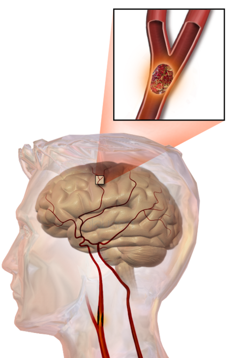
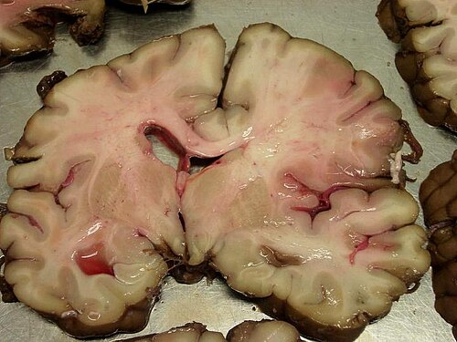

# DOENÇA VASCULAR CEREBRAL

Para entender a Doença Vascular Cerebral (DVC), você precisa parar de ver o cérebro como um órgão estático e passar a vê-lo como um consumidor voraz de oxigênio e glicose que não tolera "atrasos na entrega". Nas provas de residência, o tema é dividido basicamente em três grandes pilares: o Isquêmico (o mais comum), o Hemorrágico (o mais dramático) e as Urgências Traumáticas/Cirúrgicas (os hematomas).

## Acidente Vascular Encefálico Isquêmico (AVEi)

*Figura 1 - Ilustração mostrando mecanismo do acidente vascular cerebral com oclusão arterial e área de isquemia. Fonte: Blausen Medical, CC BY 3.0 | Wikimedia Commons*

O AVEi responde por cerca de 80-85% dos casos. O conceito fundamental aqui é a **Penumbra Isquêmica**. Quando um vaso entope, existe um núcleo central de morte celular imediata, mas ao redor dele há um tecido sofrendo, que ainda não morreu. Nosso objetivo no tratamento agudo é salvar essa penumbra.

### Fisiopatologia e Etiologia

Por que o vaso entope? Ou é um **êmbolo** que viajou de outro lugar (geralmente do coração, como na Fibrilação Atrial, ou de uma placa na carótida) ou é um **trombo** que se formou ali mesmo sobre uma placa de aterosclerose (comum em hipertensos e diabéticos).

Nas provas, guarde isso: se o quadro é súbito e o paciente tem FA, pense em cardioembolia. Se o paciente vem tendo "avisos" (AITs) e tem muitos fatores de risco cardiovascular, pense em aterotrombose de grandes vasos.

### Diagnóstico e a Regra de Ouro da Imagem

O paciente chega com déficit focal (hemiparesia, afasia, desvio de rima). Qual o primeiro exame? **Tomografia de Crânio (TC) sem contraste**.

Muitos alunos erram achando que a TC serve para ver o infarto. Errado! Nas primeiras horas, a TC no AVEi costuma ser **normal**. O objetivo da TC inicial é **excluir hemorragia**. Se tem sangue, o tratamento muda completamente. Se a TC está normal ou com sinais precoces discretos, o diagnóstico é AVE Isquêmico até que se prove o contrário.

### O Protocolo ASPECTS

As bancas agora exigem que você conheça o ASPECTS. Ele é um escore radiológico que vai de 10 a 0, aplicado apenas ao território da Artéria Cerebral Média (ACM).

- **10 pontos:** TC normal (sem sinais de isquemia).

- **Cada área afetada:** Subtrai-se 1 ponto.

- **Significado:** Quanto menor o score, maior a área isquêmica. Um ASPECTS < 7 geralmente indica um prognóstico pior e uma área de infarto já estabelecida muito grande.

### Tratamento Agudo: Trombólise e Trombectomia

Aqui está o "filé mignon" das provas. Você precisa decorar os tempos e os critérios.

**Trombólise Química (rtPA - Alteplase):**

- **Janela:** Até 4,5 horas do início dos sintomas (ou do "último momento visto bem").

- **Dose:** 0,9 mg/kg (máximo 90 mg), sendo 10% em bólus e o restante em 1 hora.

- **Critério de PA:** A pressão deve estar **abaixo de 185/110 mmHg** para começar. Se estiver acima, você deve baixar com medicação venosa (esmolol, nitroprussiato) antes de correr o trombolítico. Durante e após a infusão, a meta é manter < 180/105 mmHg.

**Contraindicações Absolutas ao rtPA (Decore estas!):**

- Sangramento intracraniano prévio (qualquer tempo).

- AVC isquêmico ou TCE grave nos últimos 3 meses.

- Sangramento gastrointestinal recente (últimos 21 dias).

- Cirurgia de grande porte nos últimos 14 dias.

- Uso de anticoagulantes orais com RNI > 1,7 ou uso de DOACs (rivaroxabana, apixabana) nas últimas 48h.

- Plaquetas < 100.000.

**Trombectomia Mecânica:**
Indicada para oclusão de grandes vasos (Carótida Interna ou ACM segmento M1).

- **Janela:** Geralmente até 6 horas, mas pode ser estendida até 24 horas em casos selecionados (usando critérios de imagem avançada como o protocolo DAWN ou DEFUSE-3).

- **Dica do Dr. Will:** Mesmo que o paciente tenha indicação de trombectomia, se ele estiver na janela de 4,5h, você faz o rtPA venoso **enquanto** prepara a sala de hemodinâmica. Uma coisa não exclui a outra.

### Manejo da Pressão Arterial no AVEi

Se o paciente **NÃO** vai trombolisar, nós somos muito mais tolerantes com a pressão. Por quê? Porque o cérebro precisa de pressão de perfusão para manter a penumbra viva. Só baixamos a PA se ela exceder **220/120 mmHg**. Se baixar demais, você "mata" a penumbra por hipoperfusão.

| Situação | Meta de PA para iniciar | Meta de PA durante/após |
| --- | --- | --- |
| Candidato à Trombólise | < 185/110 mmHg | < 180/105 mmHg |
| Não candidato à Trombólise | < 220/120 mmHg | Redução de 15% em 24h |

### AVE Isquêmico Maligno

Ocorre quando há um infarto extenso de todo o território da ACM. O cérebro incha tanto que desvia a linha média e hernia.

- **Conduta:** Craniectomia descompressiva precoce (especialmente em pacientes < 60 anos). Isso reduz a mortalidade de 80% para cerca de 40-50%. É uma medida de salvamento de vida, não necessariamente de recuperação funcional plena.

## Hemorragia Intraparenquimatosa (HIP)

*Figura 2 - Fotografia de peça de autópsia mostrando AVC agudo em território da artéria cerebral média. Fonte: Marvin 101, CC BY-SA 3.0 | Wikimedia Commons*

Aqui o vaso não entupiu, ele rompeu. A causa número 1 é a **Hipertensão Arterial Sistêmica (HAS)** descontrolada, que causa ruptura de pequenas artérias penetrantes (microaneurismas de Charcot-Bouchard).

### Quadro Clínico

Diferente do isquêmico, o paciente com HIP costuma chegar com:

- Déficit focal súbito + Cefaleia intensa + Vômitos.

- Rebaixamento do nível de consciência precoce.

- Níveis pressóricos muito elevados (frequentemente > 200 mmHg).

### Localizações Típicas da HIP Hipertensiva

As bancas adoram cobrar a topografia:

- **Putâmen (mais comum):** Hemiparesia contralateral pura (lesão da cápsula interna).

- **Tálamo:** Déficit sensitivo contralateral + desvio do olhar para baixo.

- **Ponte:** Coma, pupilas puntiformes e reativas, padrão respiratório atáxico.

- **Cerebelo:** Ataxia, vertigem, vômitos e sinais de compressão de tronco.

### Manejo da HIP

Diferente do isquêmico, aqui queremos a PA **baixa** para o sangue parar de sair. Segundo as diretrizes atuais (baseadas no INTERACT-2), a meta de PAS é **< 140 mmHg** (se a PAS inicial estiver entre 150-220 mmHg), de forma rápida e sustentada.

**Quando operar uma HIP?**
A maioria é tratamento clínico (controle de PA e PIC). Mas o **Hematoma Cerebelar** é a exceção clássica: se tiver > 3 cm, sinais de compressão de tronco ou hidrocefalia, a cirurgia de drenagem é mandatória e urgente. No MedEvo, sempre reforçamos: "Sangue no cerebelo é igual a neurocirurgião no telefone".

## Hemorragia Subaracnoidea (HSA)

A HSA não traumática é causada, em 80% dos casos, pela ruptura de um **aneurisma sacular**. É a famosa "pior cefaleia da vida".

### Diagnóstico

- **TC de crânio sem contraste:** Padrão-ouro inicial. Mostra sangue nas cisternas da base e sulcos.

- **Punção Lombar (PL):** Se a suspeita clínica é alta (cefaleia em trovão) e a TC veio normal. O que procurar? **Xantocromia** (líquor amarelado pela degradação da hemoglobina). A PL deve ser feita preferencialmente após 6-12h do início da dor para permitir a lise das hemácias.

### Classificações (Essencial para Prova)

Você precisa conhecer duas: Hunt-Hess (clínica) e Fisher (radiológica).

**Escala de Hunt-Hess (Gravidade Clínica):**

- I: Assintomático ou cefaleia leve.

- II: Cefaleia moderada a grave, rigidez de nuca, sem déficit (exceto nervo craniano).

- III: Sonolência, confusão, déficit focal leve.

- IV: Torpor, hemiparesia moderada/grave.

- V: Coma profundo, descerebração.

**Escala de Fisher (Risco de Vasoespasmo pela TC):**

- I: Sem sangue detectável.

- II: Sangue difuso, lâmina < 1mm.

- III: Coágulo localizado ou lâmina > 1mm (Alto risco de vasoespasmo).

- IV: Sangue intracerebral ou ventricular.

### Complicações da HSA

Este é o ponto onde os alunos mais se confundem. Existem três complicações principais com tempos diferentes:

- **Ressangramento:** Ocorre nas primeiras 24-72h. É a maior causa de morte precoce. Por isso, o tratamento do aneurisma (clipping cirúrgico ou embolização endovascular) deve ser feito o mais rápido possível.

- **Vasoespasmo e Isquemia Cerebral Tardia:** Ocorre entre o 3º e o 14º dia (pico no 7º). O sangue "irrita" as artérias por fora, fazendo-as fechar.

- **Prevenção:** Nimodipina 60mg de 4/4h para todos os pacientes (melhora o desfecho neurológico, embora não impeça o espasmo em si).

- **Tratamento:** **Terapia dos 3H** (Hipertensão, Hipervolemia e Hemodiluição). *Nota: Atualmente, foca-se mais na Hipertensão induzida, mantendo a euvolemia.*

- **Hidrocefalia:** Pode ser aguda ou crônica. O sangue obstrui as granulações aracnoides, impedindo a reabsorção do líquor.

### Aneurismas Específicos e Nervos Cranianos

- **Aneurisma de Artéria Comunicante Posterior:** Pode comprimir o **III par (Oculomotor)**, causando midríase e ptose ipsilateral. Isso cai muito!

- **Aneurisma de Artéria Comunicante Anterior:** O local mais comum de aneurismas no polígono de Willis.

## Hematomas Traumáticos (Neurocirurgia de Emergência)

Aqui entramos na área do trauma, mas que compartilha a imagem com a DVC. A diferenciação entre Epidural e Subdural é questão garantida.

### Hematoma Epidural (Extradural)

- **Vaso:** Artéria Meníngea Média (sangramento arterial, rápido).

- **Mecanismo:** Trauma em região temporal (fratura da escama do temporal).

- **Clínica Clássica:** O **Intervalo Lúcido**. O paciente desmaia no trauma, acorda bem, e horas depois rebaixa bruscamente por herniação uncal (anisocoria ipsilateral e hemiparesia contralateral).

- **Imagem:** Lente **Biconvexa** (limita-se pelas suturas cranianas).

### Hematoma Subdural Agudo

- **Vaso:** Veias em ponte (sangramento venoso, mais lento que o arterial).

- **Mecanismo:** Desaceleração súbita, comum em idosos e etilistas (cérebro atrofiado "balança" mais).

- **Imagem:** Formato de **Crescente** ou Lua Nova (não respeita suturas, espalha-se pela convexidade).

| Característica | Hematoma Epidural | Hematoma Subdural |
| --- | --- | --- |
| Origem | Arterial (A. Meníngea Média) | Venosa (Veias em ponte) |
| Formato na TC | Biconvexo (Lente) | Crescente (Côncavo-convexo) |
| Evolução | Hiperaguda (Intervalo lúcido) | Aguda, Subaguda ou Crônica |
| População | Jovens (Trauma direto) | Idosos, Etilistas, Atrofia cerebral |

## Síndromes Vasculares Específicas

As bancas amam a **Síndrome de Wallenberg** (ou Síndrome Medular Lateral).

- **Vaso:** Oclusão da PICA (Artéria Cerebelar Posterior Inferior) ou da Vertebral.

- **Clínica:**

- Ipsilateral: Síndrome de Horner (miose, ptose, anidrose), ataxia, perda de sensibilidade térmica/dolorosa na face.

- Contralateral: Perda de sensibilidade térmica/dolorosa no corpo.

- Outros: Disfagia e disartria (lesão do núcleo ambíguo).

## Manejo Geral e Suporte

No AVC agudo, algumas medidas são universais e "salvam" pontos na prova:

- **Cabeceira:** 30 graus (para controle de PIC).

- **Glicemia:** Manter entre 140-180 mg/dL. Hipoglicemia é o principal *mimic* (simulador) de AVC. Sempre teste a glicemia capilar!

- **Temperatura:** Tratar febre agressivamente (aumenta o consumo metabólico cerebral).

- **Oxigênio:** Apenas se SatO2 < 94%. Não se faz O2 suplementar para todo mundo.

- **Anticoagulação no AVEi:** Nunca na fase aguda (primeiras 24h). Se o paciente foi trombolisado, nem AAS nem Heparina nas primeiras 24h. Após isso, TC de controle para excluir transformação hemorrágica e então iniciar antiagregação.

## Pontos-Chave para Prova

- **TC de Crânio Normal:** Não exclui AVE Isquêmico agudo nem HSA (se a suspeita for alta, faça PL).

- **Janela de Trombólise:** 4,5 horas. PA alvo < 185/110 mmHg.

- **Dose Alteplase:** 0,9 mg/kg (máximo 90 mg).

- **Contraindicação Absoluta:** RNI > 1,7 ou sangramento intracraniano prévio.

- **Hematoma Epidural:** Artéria meníngea média + Lente biconvexa + Intervalo lúcido.

- **Hematoma Subdural:** Veias em ponte + Imagem em crescente.

- **HSA:** Pior cefaleia da vida. Complicações: Ressangramento (24h), Vasoespasmo (3-14 dias), Hidrocefalia.

- **Tratamento Aneurisma:** Precoce (primeiras 72h) para evitar ressangramento.

- **Nimodipina:** Obrigatória na HSA para melhorar prognóstico neurológico.

- **HIP Cerebelar:** Operar se > 3 cm ou compressão de tronco.

- **Meta de PA na HIP:** PAS < 140 mmHg (se inicial < 220).

- **Meta de PA no AVEi (não trombolisado):** Só baixar se > 220/120 mmHg.

- **Síndrome de Wallenberg:** Oclusão da PICA; disfagia, ataxia e sensibilidade cruzada.

- **ASPECTS:** 10 é normal; < 7 indica grande área de infarto.

- **Xantocromia:** Líquor amarelo na PL, confirma HSA após TC negativa.

- **Causa de Morte no Atestado:** O AVC é a causa básica se ele iniciou a sucessão de eventos (ex: AVC -> Imobilidade -> Pneumonia -> Óbito). 🧠

 Cópia offline para consulta pessoal.
 Fonte original:
 [https://www.medevo.com.br/material-apoio/ler/8c3938c6-caed-48b2-ae4a-ad264b4b9cb7](https://www.medevo.com.br/material-apoio/ler/8c3938c6-caed-48b2-ae4a-ad264b4b9cb7)
