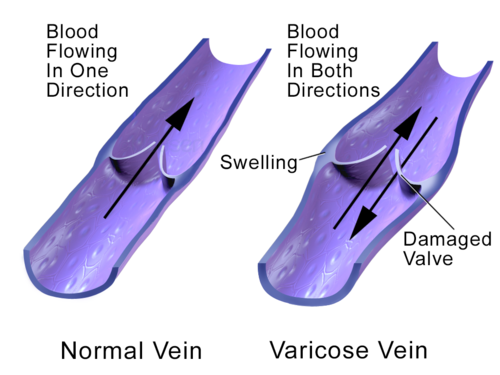
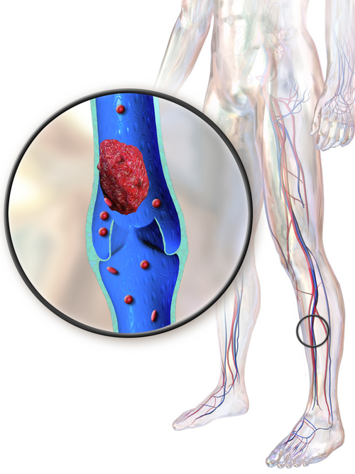

# DOENÇA VENOSA

Para entender a doença venosa, você precisa parar de pensar na veia apenas como um "tubo que leva sangue de volta". Pense nela como um sistema de baixa pressão que luta contra a gravidade o dia inteiro. Quando esse sistema falha, temos a Hipertensão Venosa. É esse o conceito que você deve levar para a prova: tudo na doença venosa crônica (DVC) é consequência do aumento da pressão hidrostática no compartimento venoso.

## Anatomia e Fisiologia: Onde Tudo Começa

*Figura 1 - Ilustração comparando veia normal com válvulas competentes e veia varicosa com refluxo valvular e dilatação. Fonte: Blausen Medical, CC BY 3.0 | Wikimedia Commons*

O sistema venoso dos membros inferiores é dividido em três componentes fundamentais. Se você não dominar isso, não entende o porquê de uma cirurgia ou de um exame de imagem.

- **Sistema Venoso Profundo (SVP):** Responsável por cerca de 85-90% do retorno venoso. As veias acompanham as artérias e têm o mesmo nome (veia femoral, veia poplítea, veias tibiais). Cuidado: a veia femoral profunda e a veia femoral se unem para formar a veia femoral comum. No trígono femoral, a veia femoral comum recebe a veia femoral profunda e a veia safena magna.

- **Sistema Venoso Superficial (SVS):** Localizado acima da fáscia muscular. As estrelas aqui são a **Veia Safena Magna** (a mais longa, desemboca na veia femoral comum na região da virilha – a famosa "croça") e a **Veia Safena Parva** (corre na região posterior da panturrilha e desemboca, geralmente, na veia poplítea).

- **Veias Perfurantes:** São as "pontes" que ligam o sistema superficial ao profundo. O fluxo normal é sempre do **superficial para o profundo**. Se a válvula da perfurante falha, o sangue "foge" do profundo para o superficial, gerando varizes.

### A Bomba Muscular da Panturrilha

O coração não consegue trazer o sangue das pernas sozinho. O principal motor é a **bomba muscular da panturrilha**. Quando o músculo contrai, ele espreme as veias profundas, impulsionando o sangue para cima. As válvulas garantem que o sangue não volte. Se o paciente é sedentário ou tem anquilose de tornozelo, essa bomba falha. É por isso que o repouso prolongado é fator de risco para trombose e por que caminhar ajuda no tratamento da insuficiência venosa.

## Fisiopatologia da Hipertensão Venosa

Por que a perna do paciente fica escura e inchada? A hipertensão venosa (por refluxo valvular ou obstrução) aumenta a pressão nos capilares. Isso causa:

- Extravasamento de plasma (Edema).

- Extravasamento de hemácias. A hemoglobina se degrada em hemossiderina, que é um pigmento acastanhado. Isso explica a **Dermatite Ocre** (C4a).

- Liberação de mediadores inflamatórios que levam à fibrose do tecido subcutâneo. Isso é a **Lipodermatoesclerose** (C4b), onde a perna fica com aspecto de "garrafa de champanhe invertida".

## Classificação CEAP: O Alfabeto do Cirurgião Vascular

As bancas de residência AMAM a classificação CEAP. Ela é o padrão-ouro para descrever a Insuficiência Venosa Crônica (IVC). O "C" (Clínico) é o mais cobrado.

| C (Clínico) | Descrição |
| --- | --- |
| **C0** | Sem sinais visíveis ou palpáveis de doença venosa. |
| **C1** | Telangiectasias (< 1mm) ou veias reticulares (1-3mm). |
| **C2** | Veias varicosas (varizes propriamente ditas, > 3mm). |
| **C3** | Edema (sem alterações de pele ainda). |
| **C4** | Alterações tróficas da pele (a: pigmentação/eczema; b: lipodermatoesclerose). |
| **C5** | Úlcera venosa **cicatrizada**. |
| **C6** | Úlcera venosa **ativa**. |

**Dica de Prova:** Se a questão descreve um paciente com varizes calibrosas e edema 2+/4+, mas diz que a pele está íntegra e sem manchas, ele é **CEAP C3**. Se já tiver a mancha marrom (dermatite ocre), pula para **C4**.

O restante da sigla CEAP (Etiológica, Anatômica, Fisiopatológica) ajuda a refinar o diagnóstico:

- **E (Etiologia):** Congênita (Ec), Primária (Ep - a mais comum, idiopática), Secundária (Es - ex: pós-trombótica).

- **A (Anatomia):** Superficial (As), Profunda (Ad), Perfurante (Ap).

- **P (Fisiopatologia):** Refluxo (Pr), Obstrução (Po), Ambos (Pr,o).

## Quadro Clínico e Exame Físico

O paciente clássico queixa-se de **sensação de peso, queimação, cansaço ou prurido** nos membros inferiores.

**O "Pulo do Gato" do Sintoma:** A dor da insuficiência venosa **piora ao final do dia** (após ortostatismo prolongado) e **melhora com a elevação dos membros**. Se a dor piora ao caminhar e melhora ao parar, pense em doença arterial (claudicação intermitente). Se a dor melhora com repouso mas não depende da posição, pode ser ortopédica.

### Manobras de Exame Físico (Clássicas em Provas)

Embora o Doppler tenha substituído muito dessas manobras na prática, as bancas ainda cobram:

- **Prova de Brodie-Trendelenburg:** Avalia a competência das válvulas da safena e das perfurantes. Deita-se o paciente, eleva-se a perna para esvaziar as veias e coloca-se um garrote na coxa. Ao levantar o paciente, observa-se o enchimento. Se encher rápido com o garrote, as perfurantes são insuficientes. Se encher só após tirar o garrote, o refluxo é da safena.

- **Teste de Perthes:** Avalia a patência do sistema venoso profundo. Garroteia-se o sistema superficial e pede-se para o paciente caminhar ou ficar na ponta dos pés. Se as varizes esvaziarem, o sistema profundo está pérvio. Se a dor aumentar e as veias ficarem mais tensas, há obstrução profunda (o sangue não tem por onde sair). **Cuidado:** Nunca opere varizes sem ter certeza de que o sistema profundo está funcionando!

## Diagnóstico por Imagem

O **Ultrassom Doppler Vascular** é o padrão-ouro. Ele é não invasivo, barato e funcional.

- **O que ele vê?** Anatomia (presença de trombos) e Fisiologia (direção do fluxo).

- **Refluxo:** Definido como fluxo retrógrado com duração > 0,5 segundos para veias superficiais e > 1,0 segundo para veias profundas.

- **Diferenciação:** No USG, a **veia é compressível** e a artéria não. Se a veia não colaba à compressão do transdutor, suspeite de TVP.

- **Sombra Acústica:** Em casos de trombose antiga, as cicatrizes fibróticas na parede venosa podem ser ecogênicas e gerar sombra acústica, indicando cronicidade.

**Atenção:** A cintilografia **NÃO** é método diagnóstico para varizes de membros inferiores. Não marque essa opção!

## Tratamento da Insuficiência Venosa Crônica

O tratamento depende do estágio CEAP e dos sintomas. No MedEvo, sempre batemos na tecla: trate o paciente, não apenas o exame.

### 1. Tratamento Conservador (Pilar para todos)

- **Mudança de Estilo de Vida (MEV):** Perda de peso, evitar ortostatismo prolongado, exercícios físicos (fortalecer a bomba da panturrilha).

- **Terapia Compressiva:** É o padrão-ouro para manejo de sintomas e prevenção de úlceras. As meias de compressão elástica (geralmente 20-30 mmHg) reduzem o diâmetro das veias, melhorando a coaptação das válvulas.

- *Dica de Ouro:* Se o paciente usa meia e o edema piorou, verifique se a meia não está velha e perdeu a elasticidade. Elas devem ser trocadas a cada 4-6 meses.

- **Medicamentos Venotônicos:** (Ex: Diosmina, Hesperidina). Ajudam nos sintomas (peso, dor), mas **não eliminam as varizes**.

### 2. Tratamento Intervencionista

Indicado para pacientes sintomáticos (C2 em diante) ou com complicações (C4-C6).

- **Escleroterapia com Espuma:** Ótima para úlceras (C6) e veias tortuosas. Tem menor efetividade a longo prazo para a safena magna quando comparada à cirurgia ou termoablação, mas é barata e ambulatorial.

- **Termoablação (Laser ou Radiofrequência):** Tratamento minimamente invasivo. "Queima-se" a veia por dentro. Tem recuperação mais rápida que a cirurgia convencional.

- **Cirurgia Convencional (Safenectomia):** Ligadura e retirada da veia (stripping). Ainda muito utilizada, especialmente em veias muito calibrosas ou muito superficiais onde o calor da radiofrequência poderia queimar a pele.

## Trombose Venosa Profunda (TVP)

*Figura 2 - Ilustração de trombose venosa profunda mostrando formação de trombo no interior da veia com obstrução do fluxo sanguíneo. Fonte: BruceBlaus/Blausen Medical, CC BY 3.0 | Wikimedia Commons*

Aqui o bicho pega. A TVP é uma emergência vascular pelo risco de Tromboembolismo Pulmonar (TEP).

### Diagnóstico

- **Quadro Clínico:** Edema unilateral, dor, empastamento da panturrilha, sinal de Homans (dor na dorsiflexão do pé - baixa sensibilidade).

- **D-dímero:** Alta sensibilidade, baixa especificidade. Útil para **excluir** TVP em pacientes de baixo risco (Score de Wells). Se o D-dímero vier negativo, você descarta. Se vier positivo, não confirma nada, precisa de Doppler.

- **Eco-Doppler:** Exame confirmatório. A ausência de compressibilidade da veia é o sinal patognomônico.

### Tratamento

O objetivo principal é evitar o TEP e a Síndrome Pós-Trombótica (SPT).

- **Anticoagulação:** É a conduta inicial padrão.

- Pode-se iniciar com Heparina (HNF ou HBPM) e transição para Warfarina (alvo INR 2-3).

- Atualmente, os NOACs (Rivaroxabana, Apixabana) são muito usados pela praticidade.

- **Tempo:** Geralmente 3 a 6 meses para o primeiro episódio com fator desencadeante claro (ex: cirurgia ortopédica).

- **Mobilização:** Ao contrário do que se pensava antigamente, o paciente **deve deambular** assim que a anticoagulação estiver plena. A elevação do membro ajuda no edema.

### Situações Especiais na TVP

- **Flegmasia Alba Dolens:** Edema maciço, pálido, por oclusão iliofemoral profunda, mas com fluxo arterial preservado.

- **Flegmasia Cerulea Dolens:** Estágio mais grave. O edema é tão severo que compromete o fluxo arterial (isquemia secundária). A perna fica cianótica. É uma emergência cirúrgica/endovascular.

- **Síndrome de Cockett (ou May-Thurner):** Compressão da veia ilíaca comum esquerda pela artéria ilíaca comum direita contra a coluna vertebral. Suspeite em mulheres jovens com TVP de repetição apenas na perna esquerda.

## Tromboflebite Superficial (TVS)

É a inflamação/trombose de uma veia superficial.

- **Clínica:** Cordão venoso endurecido, hiperemiado e doloroso.

- **Tratamento:** Geralmente conservador com AINEs e compressas mornas.

- **Quando anticoagular?** Se o trombo estiver a menos de 3 cm da junção safeno-femoral ou safeno-poplítea, pelo risco de progressão para o sistema profundo (TVP).

- **Tromboflebite Migrante:** Se o paciente tem episódios de flebite que "pulam" de um lugar para outro, investigue neoplasia oculta (Síndrome de Trousseau).

## Diagnóstico Diferencial de Úlceras

Isso cai muito! Você precisa diferenciar a úlcera venosa da arterial.

| Característica | Úlcera Venosa | Úlcera Arterial |
| --- | --- | --- |
| **Localização** | Terço distal, região medial (perimaleolar). | Extremidades (dedos), pontos de pressão, maleolo lateral. |
| **Dor** | Leve a moderada, melhora com elevação. | Intensa, piora com elevação, melhora pendente. |
| **Aparência** | Bordos irregulares, fundo granulado/exsudativo. | Bordos "em saca-bocado", fundo pálido/necrótico. |
| **Pulsos** | Presentes (podem estar difíceis pelo edema). | Ausentes ou muito reduzidos. |
| **Pele adjacente** | Dermatite ocre, lipodermatoesclerose. | Pálida, atrófica, sem pelos, fria. |

**Exemplo Clínico:** Paciente de 70 anos, tabagista, com dor intensa no pé que melhora quando ele dorme sentado com a perna para fora da cama. Ao exame, úlcera pequena e profunda no hálux. Isso é **Arterial**. Se fosse uma úlcera grande, exsudativa, no tornozelo interno, com a perna toda manchada de marrom, seria **Venosa**.

## Anatomia Vascular Abdominal e Outras Veias

Não esqueça das conexões sistêmicas:

- **Veias Gonadais:** A veia gonadal **direita** drena direto para a Veia Cava Inferior. A veia gonadal **esquerda** drena para a Veia Renal Esquerda. Isso explica por que varicocele é mais comum à esquerda.

- **Veia Renal:** A oclusão de uma veia renal segmentar geralmente não causa grandes problemas devido à rica rede de anastomoses.

- **Membro Superior:** A veia basílica recebe as veias braquiais e se torna veia axilar na borda inferior do músculo redondo maior. O acesso venoso para hemodiálise (fístulas) geralmente usa a veia cefálica ou basílica.

## Síndrome Pós-Trombótica (SPT)

É a principal complicação tardia da TVP. Ocorre porque o trombo destrói as válvulas ou deixa a veia obstruída permanentemente.

- **Clínica:** Edema crônico, varizes secundárias, dor e até úlceras.

- **Prevenção:** O uso de meias elásticas de alta compressão logo após a fase aguda da TVP reduz significativamente a incidência de SPT.

- **Importante:** Varizes unilaterais de início súbito ou em locais atípicos devem sempre levantar a suspeita de uma TVP prévia (varizes secundárias).

## Pontos-Chave para Prova 🩺

- **CEAP C4:** Alterações de pele (dermatite ocre, eczema, lipodermatoesclerose). Não confunda com C3 (apenas edema).

- **CEAP C5 vs C6:** C5 é úlcera cicatrizada; C6 é úlcera aberta/ativa. Memorize isso, cai em 50% das provas de vascular.

- **Padrão-Ouro Diagnóstico:** Ultrassonografia Doppler Vascular.

- **Tratamento de Escolha Safena:** Termoablação (Laser/Radiofrequência) é preferível à cirurgia convencional por menor morbidade, embora ambas sejam corretas.

- **Escleroterapia com Espuma:** Excelente para CEAP C6 (ajuda a fechar a úlcera rápido) e pacientes sem condições cirúrgicas.

- **Sinal de Homans:** Dor na panturrilha à dorsiflexão passiva do pé. Baixa sensibilidade para TVP, mas cai em prova.

- **D-dímero:** Só serve para EXCLUIR TVP em paciente de baixo risco. Se der positivo, peça Doppler.

- **Flebite Ascendente:** Se a tromboflebite superficial está subindo pela coxa e chegando perto da croça da safena (< 3cm), a conduta é anticoagulação ou ligadura cirúrgica da croça para evitar TVP.

- **Veia Gonadal Esquerda:** Drena para a veia renal esquerda. A direita drena para a cava.

- **Teste de Perthes Positivo:** Indica obstrução do sistema venoso profundo. **Contraindicação absoluta** para retirada de veias superficiais.

- **Fístula Arteriovenosa Traumática:** Suspeite se houver varizes unilaterais, edema, úlcera e **frêmito** palpável no local.

- **Tríade de Virchow:** Estase venosa, lesão endotelial e hipercoagulabilidade. Base da fisiopatologia da TVP.

- **Anticoagulação na TVP:** Alvo de INR entre 2,0 e 3,0 quando usar Warfarina.

- **Meias Elásticas:** Devem ser evitadas se o Índice Tornozelo-Braquial (ITB) for < 0,5 (doença arterial grave associada).

- **Cintilografia:** NÃO é usada para diagnóstico de varizes.

- **Linfedema:** Diferente do edema venoso, o linfedema costuma envolver o dorso do pé e os dedos (Sinal de Stemmer: impossibilidade de pinçar a pele do dorso do segundo dedo). O edema venoso poupa o pé inicialmente.

 Cópia offline para consulta pessoal.
 Fonte original:
 [https://www.medevo.com.br/material-apoio/ler/b3d44b98-024d-417e-b002-582e3c4eb753](https://www.medevo.com.br/material-apoio/ler/b3d44b98-024d-417e-b002-582e3c4eb753)
