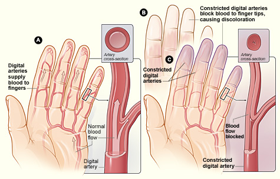
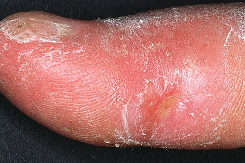

# DOENÇAS AUTOIMUNES SISTÊMICAS

As doenças autoimunes sistêmicas reúnem condições em que a perda de tolerância imunológica produz inflamação multissistêmica. Neste material, o foco é o núcleo das **colagenoses/doenças do tecido conjuntivo** e uma entidade autoimune relacionada muito cobrada: a síndrome do anticorpo antifosfolípide (SAF).

Ficam fora do escopo central deste material doenças como fibromialgia e febre reumática. A fibromialgia é uma síndrome de sensibilização central, não uma doença autoimune sistêmica. A febre reumática é uma complicação imunomediada pós-estreptocócica e deve ser estudada em material próprio. Essa separação evita misturar entidades com fisiopatologia, diagnóstico e tratamento completamente diferentes.

Núcleo deste material

Colagenoses/doenças autoimunes sistêmicas:
- Esclerose sistêmica
- Síndrome de Sjögren
- Miopatias inflamatórias: dermatomiosite e polimiosite
- Doença mista do tecido conjuntivo

Entidade autoimune relacionada:
- Síndrome do anticorpo antifosfolípide (SAF), especialmente quando secundária ao lúpus

Fora do escopo deste material:
- Fibromialgia: sensibilização central, sem autoimunidade sistêmica
- Febre reumática: sequela imunomediada pós-faringite estreptocócica

## Esclerose Sistêmica (Esclerodermia)

*Figura 1 - Diagrama ilustrando o fenômeno de Raynaud: (A) artérias digitais normais; (B) palidez por vasoespasmo; (C) cianose por estase venosa. O Raynaud é manifestação inicial em >95% dos casos de esclerose sistêmica. Fonte: NHLBI, Domínio Público | Wikimedia Commons*

A Esclerose Sistêmica (ES) é marcada por uma tríade fisiopatológica central: vasculopatia de pequenos vasos, ativação do sistema imune e fibrose tecidual progressiva. O excesso de colágeno não fica restrito à pele, ele invade pulmões, trato gastrointestinal, rins e coração.

### Classificação e Fenótipo Clínico

A divisão clássica que as bancas amam é entre a forma Cutânea Limitada e a forma Cutânea Difusa. O divisor de águas aqui é a topografia do espessamento cutâneo.

Na **Esclerose Sistêmica Cutânea Limitada**, o espessamento da pele ocorre apenas distalmente aos cotovelos e joelhos, podendo envolver face e pescoço. É aqui que se encaixa a antiga Síndrome CREST (Calcinose, Raynaud, Esôfago, Esclerodactilia e Telangiectasia). O anticorpo marcador é o **Anticentrômero**. O prognóstico costuma ser melhor, mas cuidado: esses pacientes têm um risco aumentado de Hipertensão Arterial Pulmonar (HAP) tardia.

Na **Esclerose Sistêmica Cutânea Difusa**, o espessamento é proximal (tronco, braços, coxas). O início é súbito e a progressão é rápida. O anticorpo aqui é o **Anti-Scl-70 (antitopoisomerase I)**. Estes pacientes são os que mais evoluem com Fibrose Pulmonar (Doença Pulmonar Intersticial) e Crise Renal Esclerodérmica.

### Manifestações Clínicas e Pérolas de Exame

*Figura 2 - Aspecto clínico de dedo com esclerodactilia e necrose digital em paciente com esclerose sistêmica, demonstrando o espessamento cutâneo característico e úlcera isquêmica secundária à vasculopatia. Fonte: Breuckmann F et al., CC BY 2.0 | Wikimedia Commons*

O **Fenômeno de Raynaud** é a manifestação inicial em mais de 95% dos casos. Raynaud associado a "mãos em garra" ou esclerodactilia (pele endurecida nos dedos) torna a suspeita de ES muito forte. No rosto, observe a microstomia (diminuição da abertura bucal) e o desaparecimento das rugas de expressão, dando um aspecto de "fácies de máscara".

No trato gastrointestinal, o esôfago é o órgão mais afetado. Ocorre atrofia da musculatura lisa e fibrose, levando a uma dismotilidade esofágica grave. O paciente queixa-se de disfagia de condução e pirose intensa. A manometria esofágica mostrará hipopressão do esfíncter inferior e aperistalse dos dois terços inferiores. Outra alteração clássica é o "estômago em melancia" (ectasia vascular antral), que causa sangramento digestivo oculto e anemia ferropriva.

### Crise Renal Esclerodérmica: O Grande Medo

Esta é uma emergência reumatológica. O paciente apresenta hipertensão maligna súbita e insuficiência renal rapidamente progressiva.

**Ponto de prova:** o principal fator de risco para desencadear crise renal é o uso de corticosteroides em doses moderadas a altas (geralmente > 15 mg/dia de prednisona). Por isso, na ES, corticoides devem ser evitados sempre que possível.

O tratamento da crise renal NÃO é feito com corticoide. O padrão-ouro é o uso de **Inibidores da ECA (IECA)**, como o Captopril, mesmo que a creatinina esteja subindo. Por que? Porque a fisiopatologia é uma hiperativação do sistema renina-angiotensina-aldosterona devido à isquemia das artérias arqueadas renais. O IECA salva o rim desse paciente.

### Diagnóstico e Anticorpos

O diagnóstico é clínico, baseado nos critérios do ACR/EULAR. No laboratório, o FAN costuma ser positivo em padrão nucleolar ou pontilhado fino.

- **Anti-Scl-70:** Associado à forma difusa e fibrose pulmonar.

- **Anticentrômero:** Associado à forma limitada e hipertensão pulmonar.

- **Anti-RNA polimerase III:** Fortemente associado ao risco de Crise Renal e envolvimento cutâneo extenso.

| Característica | ES Cutânea Limitada | ES Cutânea Difusa |
| --- | --- | --- |
| Extensão da Pele | Distal a cotovelos/joelhos | Proximal (tronco e membros) |
| Fenômeno Raynaud | Anos antes do diagnóstico | Curto tempo antes ou síncrono |
| Anticorpo Típico | Anticentrômero | Anti-Scl-70 |
| Complicação Pulmonar | Hipertensão Pulmonar (HAP) | Doença Intersticial (Fibrose) |
| Crise Renal | Rara | Mais comum (até 15%) |

## Síndrome de Sjögren

A Síndrome de Sjögren (SS) é uma exocrinopatia autoimune. O sistema imune (linfócitos T e B) infiltra as glândulas exócrinas, principalmente as salivares e lacrimais, levando à destruição do parênquima.

### Quadro Clínico

A apresentação clássica é a "Síndrome Sicca":

- **Xerostomia:** Boca seca, dificuldade para engolir alimentos secos, aumento de cáries e candidíase oral.

- **Xeroftalmia:** Olho seco, sensação de areia, que pode evoluir para ceratoconjuntivite seca.

Mas atenção: a SS é sistêmica. O paciente pode apresentar artralgia, fadiga, vasculite cutânea (púrpura palpável) e até neuropatia periférica.

**Ponto de prova:** a complicação mais temida da Síndrome de Sjögren é o desenvolvimento de **linfoma não Hodgkin**, especialmente linfoma de células B da zona marginal/MALT. Suspeitar diante de aumento persistente de parótidas, queda do complemento (C4), crioglobulinas ou linfonodomegalias.

### Diagnóstico

O diagnóstico baseia-se na combinação de sintomas sicca, evidência objetiva de hipofunção glandular e autoanticorpos.

- **Teste de Schirmer:** Avalia a produção de lágrima (positivo se ≤ 5mm em 5 minutos).

- **Biópsia de Glândula Salivar Menor:** Presença de focos inflamatórios (escore de foco ≥ 1 foco/4mm²).

- **Autoanticorpos:** **Anti-SSA (Ro)** e **Anti-SSB (La)**. O Anti-Ro é o mais sensível, enquanto o Anti-La é mais específico.

Lembre-se que a SS pode ser primária ou secundária a outras doenças, como Artrite Reumatoide ou Lúpus.

## Miopatias Inflamatórias (Dermatomiosite e Polimiosite)

Aqui o alvo é o músculo esquelético. A característica principal é a **fraqueza muscular proximal e simétrica**. O paciente tem dificuldade para pentear o cabelo, levantar de uma cadeira baixa ou subir degraus.

### Dermatomiosite (DM)

A DM apresenta manifestações cutâneas patognomônicas que as bancas adoram:

- **Pápulas de Gottron:** Lesões eritemato-papulares sobre as superfícies extensoras das articulações (interfalangeanas e metacarpofalangeanas).

- **Heliotropo:** Eritema violáceo em pálpebras superiores, muitas vezes com edema.

- **Sinal do V ou do Xale:** Eritema em áreas fotoexpostas (tórax superior e dorso).

**Importante:** A Dermatomiosite no adulto funciona frequentemente como uma **Síndrome Paraneoplásica**. Ao diagnosticar DM em adulto, é obrigatório considerar rastreio oncológico conforme idade, sexo, fatores de risco e sinais de alarme (mama, pulmão, cólon, ovário e próstata, entre outros).

### Polimiosite (PM)

A PM é um diagnóstico de exclusão entre as miopatias. Não apresenta as lesões cutâneas da DM. O mecanismo é uma agressão direta por linfócitos T CD8+ às fibras musculares. Uma complicação grave é o acometimento da musculatura orofaríngea, levando a disfagia alta e risco de pneumonia aspirativa.

### Diagnóstico e Tratamento

- **Enzimas Musculares:** CPK (Creatinofosfoquinase) muito elevada (10 a 50x o normal), além de aldolase, TGO e TGP.

- **Eletroneuromiografia:** Padrão miopático (potenciais de pequena amplitude e curta duração).

- **Biópsia Muscular:** É o padrão-ouro para confirmar a inflamação.

- **Autoanticorpos:** **Anti-Jo-1** é o mais comum e está associado à Síndrome Antissintetase (miopatia + doença pulmonar intersticial + "mãos de mecânico" + Raynaud + artrite).

O tratamento de primeira linha são os **Corticosteroides em doses altas** (Prednisona 1mg/kg/dia). Em casos graves ou refratários, usamos imunossupressores como Metotrexato ou Azatioprina.

## Doença Mista do Tecido Conjuntivo (DMTC)

A DMTC é uma síndrome de sobreposição (overlap). O paciente apresenta características de Lúpus, Esclerose Sistêmica e Polimiosite ao mesmo tempo.

Para o diagnóstico, é obrigatória a presença do anticorpo **Anti-RNP** em títulos elevados.
As manifestações mais comuns incluem:

- Fenômeno de Raynaud (quase 100%).

- Mãos inchadas ("puffy hands").

- Sinovite/Artrite.

- Miosite.

A principal causa de morte na DMTC, que deve ser monitorada com ecocardiograma periódico, é a **hipertensão arterial pulmonar**.

## Entidade Relacionada: Síndrome do Anticorpo Antifosfolípide (SAF)

A SAF não é uma colagenose clássica, mas é uma entidade autoimune sistêmica frequentemente associada ao lúpus eritematoso sistêmico. Por isso, é útil estudá-la ao lado das doenças do tecido conjuntivo, desde que fique claro que o eixo clínico é **trombose e morbidade gestacional**, não inflamação cutâneo-articular difusa.\n\nA SAF é um estado de hipercoagulabilidade autoimune. Pode ser primária ou secundária, especialmente ao lúpus.

**Critérios Clínicos:**

- **Trombose Vascular:** Um ou mais episódios de trombose arterial, venosa ou de pequenos vasos em qualquer tecido.

- **Morbidade Gestacional:**

- ≥ 3 abortos espontâneos inexplicados antes da 10ª semana.

- ≥ 1 morte fetal inexplicada de feto morfologicamente normal após a 10ª semana.

- ≥ 1 parto prematuro antes da 34ª semana por eclâmpsia, pré-eclâmpsia grave ou insuficiência placentária.

**Critérios Laboratoriais (Devem ser positivos em 2 ocasiões com 12 semanas de intervalo):**

- Anticoagulante Lúpico.

- Anticardiolipina (IgG ou IgM) em títulos médios/altos.

- Anti-beta-2-glicoproteína I (IgG ou IgM).

O tratamento da SAF com trombose é a **anticoagulação plena vitalícia** com Varfarina (alvo de RNI entre 2,0 e 3,0). Cuidado: DOACs (Rivaroxabana, etc.) não são recomendados na SAF de alto risco (triplo positivos).

## Pontos-Chave para Prova

- **Escopo do material:** o foco aqui são colagenoses/doenças autoimunes sistêmicas e entidades autoimunes relacionadas. Fibromialgia e febre reumática não fazem parte deste núcleo e devem ser estudadas em materiais próprios.

- **Esclerose sistêmica:** Raynaud quase sempre precede as demais manifestações; anticentrômero sugere forma limitada e risco de hipertensão pulmonar; anti-Scl-70 sugere forma difusa e maior risco de doença pulmonar intersticial.

- **Crise renal esclerodérmica:** suspeitar diante de hipertensão de início abrupto, injúria renal aguda e microangiopatia; o tratamento é IECA, classicamente captopril. Evitar corticoide em altas doses na esclerose sistêmica difusa.

- **Síndrome de Sjögren:** sicca ocular/oral, parotidomegalia, anti-Ro/SSA e anti-La/SSB; atenção ao risco aumentado de linfoma não Hodgkin.

- **Dermatomiosite:** pápulas de Gottron e heliotropo são achados cutâneos centrais; em adultos, considerar rastreio de neoplasia conforme risco clínico.

- **Polimiosite:** fraqueza muscular proximal simétrica, elevação de enzimas musculares e ausência das lesões cutâneas típicas da dermatomiosite.

- **Doença mista do tecido conjuntivo:** combinação de manifestações de lúpus, esclerose sistêmica e miopatia inflamatória; anti-U1-RNP em altos títulos é marcador central; hipertensão pulmonar é causa importante de morbimortalidade.

- **SAF:** trombose arterial/venosa ou morbidade gestacional associada a anticorpos antifosfolípides persistentes; quando associada ao lúpus, funciona como entidade autoimune relacionada, não como colagenose clássica.

 Cópia offline para consulta pessoal.
 Fonte original:
 [https://www.medevo.com.br/material-apoio/ler/930af4f7-4cbd-4289-ba37-77622f8c8f90](https://www.medevo.com.br/material-apoio/ler/930af4f7-4cbd-4289-ba37-77622f8c8f90)
